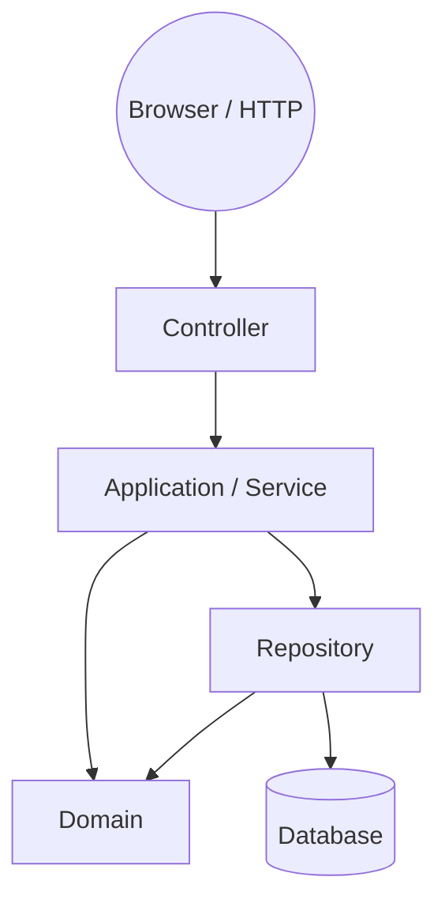

# SmartFix — Campus Facility Maintenance and Technician Dispatch System

> **SWE5006 — Designing Modern Software Systems Practice (NUS-ISS)** · five-member
> Agile team · Jira + GitHub.

> **Repository status:** this repository currently contains the **initial SmartFix
> architecture and development scaffold**. Business functionality will be implemented
> incrementally through Agile sprints following detailed analysis and design.

This README is the team's engineering handbook. If you are new to the repository,
start here: it tells you what SmartFix is, what currently works, where code belongs,
and how to work safely with the shared project. Detailed guides live in [`docs/`](docs/).

---

## Table of contents

1. [Project identity](#1-project-identity)
2. [Business problem](#2-business-problem)
3. [Current project status](#3-current-project-status)
4. [Official system roles](#4-official-system-roles)
5. [Planned SmartFix workflow](#5-planned-smartfix-workflow)
6. [Architecture overview](#6-architecture-overview)
7. [Repository tree](#7-repository-tree)
8. [Module responsibility table](#8-module-responsibility-table)
9. [Where should my code go?](#9-where-should-my-code-go)
10. [Controller / Service / Domain / Repository / DTO rules](#10-controller--service--domain--repository--dto-rules)
11. [How to add a small feature](#11-how-to-add-a-small-feature)
12. [How to add a large feature / new module](#12-how-to-add-a-large-feature--new-module)
13. [Local environment setup](#13-local-environment-setup)
14. [Daily development workflow](#14-daily-development-workflow)
15. [Git branch naming](#15-git-branch-naming)
16. [Commit guidance](#16-commit-guidance)
17. [Pull Request workflow](#17-pull-request-workflow)
18. [Definition of Done (DoD)](#18-definition-of-done-dod)
19. [Database / Flyway safety](#19-database--flyway-safety)
20. [Dependency management safety](#20-dependency-management-safety)
21. [Configuration / secret safety](#21-configuration--secret-safety)
22. [Files that require extra care](#22-files-that-require-extra-care)
23. [Merge conflict guidance](#23-merge-conflict-guidance)
24. [Main branch protection](#24-main-branch-protection)
25. [Emergency: I broke my branch](#25-emergency-i-broke-my-branch)
26. [Emergency: broken main](#26-emergency-broken-main)
27. [CI failure guidance](#27-ci-failure-guidance)
28. [Testing expectations](#28-testing-expectations)
29. [H2 vs PostgreSQL warning](#29-h2-vs-postgresql-warning)
30. [Security development rules](#30-security-development-rules)
31. [Design Pattern rule](#31-design-pattern-rule)
32. [Architecture decision process](#32-architecture-decision-process)
33. [Before-coding checklist](#33-before-coding-checklist)
34. [Before-commit checklist](#34-before-commit-checklist)
35. [Before-PR checklist](#35-before-pr-checklist)
36. [Before-merge checklist](#36-before-merge-checklist)
37. [Things team members MUST NOT do](#37-things-team-members-must-not-do)
38. [Documentation index](#38-documentation-index)

---

## 1. Project identity

**SmartFix** is a web-based **campus facility maintenance and technician dispatch
system**. It is developed in the **SWE5006 Designing Modern Software Systems Practice**
module (NUS-ISS) by a **five-member team** using **Agile** practices over ~10 weeks,
with **Jira** for the backlog and **GitHub** for version control.

One Spring Boot application, one deployable unit, one primary relational database.

## 2. Business problem

Facility faults on campus are today reported through disconnected channels — phone
calls, email and informal chat groups. The result:

- **Disconnected reporting** — no single, structured channel for fault reports.
- **Poor traceability** — request history is scattered and hard to follow.
- **Delayed technician assignment** — no central view of what needs work or who is free.
- **Low repair visibility** — requesters cannot see progress, and there is limited
  operational visibility for administrators.

SmartFix will centralise fault reporting, maintenance-request tracking, technician
assignment, repair handling, SLA monitoring, facility-status visibility, feedback and
operational reporting — a structured workflow from initial report to closure.

## 3. Current project status

**Current status: INITIAL ARCHITECTURE / DEVELOPMENT SCAFFOLD.**

### What currently works

- A single Spring Boot 3.5.4 (Java 21) application that **compiles and starts**.
- A minimal **home page** (`GET /`) rendered through Spring MVC + Thymeleaf.
- An **Actuator health endpoint**: `GET /actuator/health`.
- **PostgreSQL for local development** via Docker Compose.
- An **isolated H2 test profile** so `mvn test` needs no external database.
- **Flyway** migration infrastructure (baseline `V1` is intentionally empty).
- A **temporary permit-all security baseline** (see §30).
- Infrastructure tests: application-context load + home-page render.
- A minimal Jenkinsfile (Checkout → Build → Unit Test → Package).

### What does NOT exist yet (do not assume it works)

Authentication/SSO, final RBAC, maintenance-request CRUD, file/image upload, comments,
feedback, reopen workflow, request status-transition engine, work-order workflow,
technician matching/ranking (and the Strategy Pattern), SLA calculation/scheduling/
escalation, notifications/email, campus-map provider integration, real-time streaming,
public/private facility authorization, dashboards, reports, announcements, full audit
trail, and the final database schema. These are **planned**, not implemented — do not
write code, docs, or tests as if they exist.

## 4. Official system roles

The approved proposal defines **three** roles only:

| Role | Typical actor | Responsibility |
|------|---------------|----------------|
| **REQUESTER** | Student / staff member | Reports facility issues; tracks resolution; confirms and gives feedback. |
| **TECHNICIAN** | Maintenance worker | Accepts assigned work, performs and records repairs. |
| **ADMINISTRATOR** | System/admin staff | User admin, request review/classification/priority, SLA setup, technician assignment, monitoring, facility-status admin. |

**Do NOT introduce a separate `FACILITY_OFFICER` role.** The scaffold's
[`Role`](src/main/java/com/smartfix/user/domain/Role.java) enum contains only the three
official roles. Any role change is a **requirement/design change** and must be raised
with the team before modelling (see `docs/team-workflow.md`).

## 5. Planned SmartFix workflow

The intended end-to-end flow (conceptual — to be confirmed through use-case and class
design):

```text
Requester submits
    ↓
Administrator reviews, classifies, sets priority
    ↓
Technician assigned
    ↓
Technician repairs and records work
    ↓
Resolution reached
    ↓
Requester confirmation  (open design point — see below)
    ↓
Administrator final verification / closure
```

**Open business/design decisions (do NOT invent answers):**

- *Who may move a request to Closed?* The proposal contains both
  "requester confirms → administrator finally closes" and "technician can update states
  including Closed". This is unresolved and must be settled during use-case and
  sequence-diagram analysis. The architecture is deliberately flexible enough to add the
  final rule later without a rewrite.
- Whether external **NUS SSO** is truly required (not yet confirmed; authentication is
  currently scaffold-only).
- Whether and when a technician **matching strategy** (Strategy Pattern) is justified.
- Whether a **Facility Officer** role is ever introduced (see §4).
- Module → functional-area mapping details for reporting/map features.

## 6. Architecture overview

**Modular Monolith + Layered Architecture + Package by Business Feature.**

- One Spring Boot application, one deployable JAR, one primary PostgreSQL database.
- Source is grouped first by **business module** (`auth`, `user`, `request`, …), and
  second by **layer** inside a module (`controller`, `service`, `domain`, `repository`,
  `dto`) where that layer is genuinely needed.

### Why this architecture?

| Goal | How the architecture supports it |
|------|----------------------------------|
| Maintainability | Small, single-purpose modules and thin controllers are easy to reason about. |
| Extensibility | New stories extend an existing module (or add one) with clear boundaries. |
| Testability | Services/domain test in isolation; repositories against a real/embedded DB. |
| Parallel team development | Modules are loosely coupled, so members rarely edit the same files. |
| Low coupling / high cohesion | Cross-module access goes through owning modules' public services. |

**This is NOT microservices.** There is exactly one deployable application and one
database. Microservices, Kubernetes, message brokers and separate backend services are
out of scope for this project — they would add operational complexity the team does not
need. A module can be *extracted* later if a genuine boundary appears, but we do not
pay distributed-systems costs now.

### Dependency direction (accurate picture)

Layers do **not** form a single chain. Controllers depend on services; services use
**both** domain objects and repositories; repositories own persistence and use domain
types. Domain stays independent of web/infrastructure.



- **Controller:** web concerns only — maps requests, validates/maps input, calls a
  service, chooses a view/response. No business logic, no database access.
- **Service:** coordinates use cases and workflows; uses domain objects and
  repositories; where needed owns the transaction boundary.
- **Domain:** business concepts and rules; should stay independent of controllers,
  views and Spring/HTTP infrastructure where practical.
- **Repository:** persistence queries only — it never owns business workflow.
- **DTO:** boundary data passed across presentation/application edges instead of leaking
  persistence entities into views/APIs.

Full detail, cross-module rules and the **common** package rule: see
[`docs/architecture.md`](docs/architecture.md) and [`docs/module-guide.md`](docs/module-guide.md).

## 7. Repository tree

The **actual** current tree (generated/build artefacts under `target/` are git-ignored):

```text
smartfix/
├── src/
│   ├── main/
│   │   ├── java/com/smartfix/
│   │   │   ├── SmartFixApplication.java
│   │   │   ├── auth/config/SecurityConfig.java
│   │   │   ├── common/web/HomeController.java
│   │   │   └── user/domain/Role.java
│   │   └── resources/
│   │       ├── application.yml            # base config (datasource, JPA, Flyway, actuator)
│   │       ├── application-dev.yml        # dev profile: SQL + DEBUG logging
│   │       ├── templates/home.html        # Thymeleaf view for the home page
│   │       ├── static/css/site.css        # minimal stylesheet
│   │       └── db/migration/V1__baseline.sql
│   └── test/
│       ├── java/com/smartfix/
│       │   ├── SmartFixApplicationTests.java
│       │   └── common/web/HomeControllerTests.java
│       └── resources/application-test.yml # isolated H2 test profile
├── docs/                                  # team engineering handbook
├── .github/
│   ├── pull_request_template.md
│   └── ISSUE_TEMPLATE/                    # optional supporting issue templates
├── Dockerfile
├── docker-compose.yml
├── Jenkinsfile
├── pom.xml
├── CONTRIBUTING.md
├── .gitignore · .editorconfig · .env.example · .dockerignore
└── README.md
```

### What goes where (per important location)

| Location | What it is | What belongs there | What does NOT belong there |
|---|---|---|---|
| `pom.xml` | Maven build definition | Declared, reviewed dependencies and plugins | Random new libraries, quick fixes to "make it build" |
| `src/main/java/com/smartfix/SmartFixApplication.java` | Spring Boot entry point | Application bootstrap only | Business logic |
| `src/main/java/com/smartfix/auth/` | Authentication & authorization | Security config, future login/RBAC (Sprint 2) | Request, dispatch, SLA logic |
| `src/main/java/com/smartfix/common/` | Cross-cutting infrastructure | `common.exception`, `common.web`, `common.validation`, `common.configuration` | Business utilities shared by accident (see §8 and architecture doc) |
| `src/main/java/com/smartfix/user/` | Users, roles, accounts | `Role` (now), future `User`/account model | Maintenance-request or technician-dispatch logic |
| `src/main/resources/db/migration/` | Flyway schema migrations | Numbered, additive migrations (V2, V3, …) | Editing/overwriting an already-shared migration |
| `src/main/resources/application*.yml` | Application configuration | Config that follows the existing env-var pattern | Hard-coded secrets |
| `src/test/java/` | Automated tests | Tests that belong with the code under test | Fake "green" tests, deleted-to-pass tests |
| `docs/` | Engineering handbook | Architecture, workflow, safety, database, testing guides | Sprint-by-sprint feature code |
| `Dockerfile`, `docker-compose.yml`, `Jenkinsfile` | Ops/build automation | Changes agreed with the team | One-member experiments that change everyone's environment |

## 8. Module responsibility table

Planned top-level modules under `com.smartfix`. Only packages that contain real code
exist today (`common`, `auth`, `user`); empty placeholder directories are **not**
created. Create a package when a story needs it.

| Module | Responsibility | Typical future classes | Must NOT contain |
|---|---|---|---|
| `common` | Genuinely cross-cutting infrastructure only | `common.exception.GlobalExceptionHandler`, `common.web.HomeController`, shared validation/config | Business logic, `TechnicianMatchingUtil`, `SlaCalculator`, request/facility helpers |
| `auth` | Authentication & authorization concerns | `SecurityConfig` (today), login controller/service, RBAC rules (Sprint 2) | Maintenance request logic, technician matching |
| `user` | Users, roles, accounts, activation | `User`, `Role` (today), `UserRepository`, `UserService`, account admin | Work-order or dispatch rules |
| `request` | Maintenance-request lifecycle, submission, history, comments, feedback | `MaintenanceRequest`, `RequestComment`, `Attachment`, `Feedback` | SLA calculation; technician assignment |
| `workorder` | Work orders and repair execution | `WorkOrder`, diagnosis/work/materials/time/evidence records | Request submission; matching rules |
| `dispatch` | Technician recommendation & assignment | `Assignment`, dispatch service/rules (matching strategy only after design) | Reading other modules' repositories directly |
| `sla` | SLA policies, deadlines, escalation | `SlaPolicy`, deadline/reminder/escalation logic | Request creation; work execution |
| `facility` | Facilities, location, future map/public status | `Facility`, facility-status records | Notification delivery |
| `notification` | In-app / email notifications | `Notification`, notification service | Domain workflow logic |
| `reporting` | Operational reporting & dashboards | read-model/query services over other modules' **public APIs** | Directly reaching into every module's repositories |
| `announcement` | Maintenance announcements / public notices | `Announcement` | Request or SLA state changes |
| `audit` | Audit history of significant actions | `AuditEntry`, audit writer | Business decision logic |

Boundary reasoning and scenarios for every module: see
[`docs/module-guide.md`](docs/module-guide.md).

## 9. Where should my code go?

Quick decision guide — find your situation and follow the pointer.

| "I am adding …" | Where it goes |
|---|---|
| A new **request page / form view** | `request/controller` + `templates/` |
| **Request submission / history** behaviour | `request/service` (+ `request/domain`, `request/repository`) |
| **Technician-matching logic** | `dispatch/service` / `dispatch/domain` — never a premature `Strategy` |
| A **database query for WorkOrders** | `workorder/repository` |
| An **HTTP form/request object** | relevant module `dto` (e.g. `request/dto`) |
| A **global exception handler** | `common/web` or `common/exception` |
| A helper used **only by SLA** | `sla` — **NOT** `common` |
| **Security/login rules** | `auth` (with `user` for accounts) |
| A **new unrelated business capability** | discuss whether a new top-level module is justified (see §12) |
| A change to **how the app is built/deployed** | `pom.xml`, `Dockerfile`, `docker-compose.yml`, `Jenkinsfile` — team discussion |

Not sure? Ask on the channel or in the PR description — do not guess where shared code
should live.

## 10. Controller / Service / Domain / Repository / DTO rules

### Controller
- **Purpose:** receive HTTP requests and decide the response (view or payload).
- **Allowed:** request mapping; input validation; calling a service; choosing a view.
- **Forbidden:** SQL; JPA repository access; complex business logic; technician
  matching; SLA rules.
- **Example:** `HomeController` calls nothing business-related and returns a view name.

### Service
- **Purpose:** coordinate use cases and application/business workflow.
- **Allowed:** use-case coordination; transaction boundaries where appropriate; using
  repositories; coordinating domain objects.
- **Forbidden:** HTML rendering; Spring/HTTP-specific concerns where avoidable.
- **Example:** a future `RequestSubmissionService` orchestrating request + attachment
  persistence and validation.

### Domain
- **Purpose:** business concepts, state and rules.
- **Allowed:** entities, value objects, enums, domain behaviour/rules.
- **Forbidden:** controller/web/Spring dependencies; (where practical) direct
  infrastructure coupling.
- **Example:** `MaintenanceRequest` and its lifecycle method(s) (designed later), `Role`.

### Repository
- **Purpose:** persistence access, hiding database interaction.
- **Allowed:** persistence queries and CRUD over domain types.
- **Forbidden:** business workflow; orchestrating other modules.
- **Example:** a future `RequestRepository`.

### DTO
- **Purpose:** request/response/application boundary data.
- **Why not expose entities directly?** Entities carry persistence and lifecycle
  concerns; exposing them to views/APIs couples the web layer to the data model, makes
  unintended fields visible and makes refactoring harder. Introduce DTOs at the
  presentation/application boundary as soon as real request/response data flows exist.

## 11. How to add a small feature

Example: **"add a comment to a maintenance request"** (illustrative — implement only
when such a story exists).

1. Find the **Jira story** and read its acceptance criteria.
2. **Confirm the use case** — do not skip analysis for stateful behaviour.
3. **Identify the owning module** → `request` (comments belong to the request module).
4. Create a **feature branch** (`feature/SCRUM-XX-request-comments`).
5. **Update design if needed** — note any ECB/sequence/class impacts.
6. **Modify domain/database only if required** — if a table changes, add a new Flyway
   migration (see §19), never edit the baseline.
7. **Implement** following the layer rules (§10) and module boundaries (§8).
8. **Unit test** the new behaviour (see §28 and `docs/testing-guide.md`).
9. **Run the full suite:** `mvn test`.
10. **Create a PR** using the template.
11. **Get at least one review**; respond to comments.
12. **Merge to `main`** only when CI is green and DoD (§18) is met.

## 12. How to add a large feature / new module

New **top-level modules are not created casually.** Before adding one, ask:

- Is this a **distinct business capability**?
- Does it have its **own lifecycle/data/rules**?
- Would placing it inside an existing module **reduce cohesion**?
- Will **multiple features depend** on it?
- Can its responsibility be described in **one clear sentence**?

Example (illustrative future): an `inventory/` module for spare-parts inventory
management — a distinct capability with its own data and rules.

When boundaries are respected, adding a module should **not require restructuring
existing modules**. Prefer growing an existing module first. Architecture-affecting
decisions belong in an ADR (§32) and should be discussed before large PRs.

## 13. Local environment setup

### 13.1 Prerequisites

| Tool | Version | Check |
|---|---|---|
| JDK | 21 | `java -version` |
| Maven | 3.9+ | `mvn -version` |
| Docker | Docker Desktop with Compose v2 | `docker --version` and `docker compose version` |
| Git | any recent | `git --version` |

**Clone** (replace the URL with the repository URL shown by GitHub's *Clone* button):

```bash
git clone https://github.com/Lian9374/smartfix.git
cd smartfix
```

### 13.2 Create your local environment file

```bash
cp .env.example .env
# edit .env only if you need different values; never commit .env
```

### 13.3 Start the database

```bash
docker compose up -d db
```

This starts PostgreSQL 16 with database/user/password from `.env` (or the safe local
defaults in `docker-compose.yml`).

**Port 5432 already in use?** (e.g. a locally installed PostgreSQL). Use another host
port and tell the app:

```bash
DB_PORT=5433 docker compose up -d db
```

### 13.4 Run the application

```bash
mvn spring-boot:run -Dspring-boot.run.profiles=dev
```

- Home page: <http://localhost:8080/>
- Health: <http://localhost:8080/actuator/health> → expect `{"status":"UP"}`

If port `8080` is occupied on your machine, run on another port:

```bash
mvn spring-boot:run -Dspring-boot.run.profiles=dev \
  -Dspring-boot.run.arguments="--server.port=8081"
```

### 13.5 Test and package

```bash
mvn test            # runs tests against the isolated H2 profile - no DB needed
mvn clean package   # full build + tests + runnable fat jar
java -jar target/smartfix-0.0.1-SNAPSHOT.jar
```

Optional — run the app itself in Docker:

```bash
docker compose --profile app up --build
```

More detail and troubleshooting: `docs/development-guide.md` and `docs/troubleshooting.md`.

## 14. Daily development workflow

```bash
# 1. Start from an up-to-date main
git checkout main
git pull origin main

# 2. Create a feature branch
git checkout -b feature/SCRUM-XX-short-description

# 3. Develop ... then run tests
mvn test

# 4. Review what will be committed
git status
git diff

# 5. Stage and commit (see §16)
git add <files>
git commit -m "feat(request): add request submission validation"

# 6. Push the branch
git push -u origin feature/SCRUM-XX-short-description

# 7. Open a Pull Request (template in .github/pull_request_template.md)
# 8. Get review, keep CI green, then merge
```

Keep branches short-lived and sync with `main` regularly (see §23 for merges). Do not
rewrite already-shared history; default to `git pull`/`merge`, not rebase/force-push.

## 15. Git branch naming

| Prefix | Use | Example |
|---|---|---|
| `feature/` | New functionality | `feature/SCRUM-21-request-submission` |
| `fix/` | Bug fixes | `fix/SCRUM-33-duplicate-assignment` |
| `chore/` | Tooling/maintenance | `chore/SCRUM-12-upgrade-logging` |
| `docs/` | Documentation | `docs/SCRUM-15-architecture-diagrams` |
| `test/` | Test work | `test/SCRUM-41-dispatch-ranking-tests` |

## 16. Commit guidance

Write clear, conventional-style messages that say **what and why**.

- `feat(request): add request submission validation`
- `fix(workorder): prevent duplicate assignment`
- `test(dispatch): add technician ranking tests`
- `docs: clarify local setup`

Include the Jira key where the team convention requires it. **Avoid vague messages:**
`update`, `changes`, `fix bug`, `final`, `final2`. Commit related changes together;
do not bundle unrelated edits in one commit.

## 17. Pull Request workflow

- **No direct development on `main`.** All changes merge via Pull Requests.
- A PR must state: **Jira issue**, **summary**, **why**, **design/architecture
  impact**, **database impact**, **security impact**, **testing performed**,
  **screenshots** (UI changes), **known limitations** — the template is in
  [`.github/pull_request_template.md`](.github/pull_request_template.md).
- **At least one teammate review is recommended** before merge.
- **CI must pass** before merge; do not merge a red build "because it works locally".
- **Unresolved review comments must not be ignored** — answer or fix them.

## 18. Definition of Done (DoD)

A Jira story is **NOT done** merely because code runs on one laptop. It is done when:

- [ ] Acceptance criteria are satisfied.
- [ ] Relevant analysis/design notes are updated.
- [ ] Code follows module boundaries and layer rules.
- [ ] Tests are added/updated for new behaviour.
- [ ] `mvn test` passes.
- [ ] The application builds (`mvn clean package`).
- [ ] No secrets are committed.
- [ ] Flyway migrations are correct and additive (see §19).
- [ ] PR is reviewed; comments addressed.
- [ ] CI passes.
- [ ] Documentation updated if behaviour/setup changed.
- [ ] Jira is updated and the story merged to `main`.

## 19. Database / Flyway safety

**Critical — read `docs/database-guide.md`.**

- **NEVER casually edit an already-shared/applied migration.** If `V1__baseline.sql`
  (or any future `V1__create_user.sql`) has been used by teammates/main/CI, do not
  rewrite it. Hibernate runs with `ddl-auto: none` — **the schema comes only from
  Flyway migrations**.
- Evolve the schema with **new numbered migrations**: `V2__...`, `V3__...`.
- **Migration naming:** `V<number>__<snake_case_description>.sql` (two underscores
  before the description), unique and increasing versions.
- **Coordinate:** before choosing the next version number, `git pull` latest `main`
  and check for a teammate's migration so you do not duplicate `V3`.
- **Review destructive SQL** (`DROP`, `TRUNCATE`, `ALTER ... DROP COLUMN`) with a
  teammate; never drop shared/production data casually.
- **Local reset** is a per-developer action on *your* local database only:
  `docker compose down -v && docker compose up -d db` — never a substitute for writing
  a corrective migration, and never run against shared environments.

## 20. Dependency management safety

- **Do not casually modify `pom.xml`.** Before adding a dependency ask: Is it
  necessary? Does Spring Boot already provide it? Is there an equivalent already? Does
  it introduce security/licensing issues? Will it affect every team member?
- After a change: run `mvn dependency:tree`, `mvn test`, and `mvn clean package` as
  appropriate.
- **Large dependency/framework changes require team discussion** (and usually an ADR).

## 21. Configuration / secret safety

**NEVER commit:** `.env`, passwords, API keys, tokens, real database credentials,
private keys, cloud credentials.

- Configuration that differs per developer goes through environment variables, with
  examples committed in `.env.example`.
- Values in `docker-compose.yml`/`application*.yml` are **local-development defaults**,
  not secrets.
- **If a secret is accidentally committed:**
  1. Notify the team immediately.
  2. **Rotate/revoke** the credential (assume it is exposed).
  3. Do not assume deleting the file from the latest commit removes it from history.
  4. Follow repository-history cleanup only if the team agrees it is safe/needed.
  5. Check CI logs and caches for the secret.

## 22. Files that require extra care

Changing these affects **everyone** — treat them as high-impact.

| File | Why it affects everyone | Checks | Team discussion/review recommended? |
|---|---|---|---|
| `pom.xml` | Dependencies/build for all members & CI | `mvn test`, `mvn clean package`, `dependency:tree` | Yes (dependency changes) |
| `application.yml` / `.env.example` | Datasource/profile defaults | Keep env-var pattern; no secrets | Yes (central config) |
| `docker-compose.yml` | Shared local DB/app environment | `docker compose config` | Yes |
| `Dockerfile` | Container image build | `docker compose --profile app build` | Yes |
| `Jenkinsfile` | CI for the whole team | Review stage commands | Yes |
| `SecurityConfig.java` | Access control posture | Design review (Sprint 2) | Yes |
| `db/migration/V*.sql` | Shared database schema | See §19 | Yes (destructive SQL always) |
| `.gitignore` | What gets committed | Check nothing sensitive is unignored | Yes |
| `docs/architecture.md` & module guides | Shared conventions | Align with actual code | Yes |

## 23. Merge conflict guidance

- Do not panic, and do **not** blindly click "Accept Current" or "Accept Incoming".
- Process: (1) identify both authors' intent → (2) understand the conflicting code →
  (3) communicate if business logic conflicts → (4) resolve locally → (5) compile →
  (6) run tests → (7) inspect the diff → (8) commit the resolution.
- **Extra care** for conflicts in: `pom.xml`, Flyway migrations, security configuration
  and central configuration — resolve these deliberately and get a second pair of eyes.

## 24. Main branch protection

**Recommended GitHub repository-owner settings (must be configured in the GitHub UI —
do not assume they exist):**

- Require a Pull Request before merging to `main`.
- Require at least **one approval** (where practical).
- Require the **CI check** to pass.
- **Block force pushes.**
- **Block branch deletion.**
- Prevent direct pushes to `main` where possible.

Full setup instructions (branch protection/rulesets, optional `CODEOWNERS`):
[`docs/github-repository-settings.md`](docs/github-repository-settings.md).

## 25. Emergency: I broke my branch

Stay calm — you almost never need force-push.

1. Look first: `git status` → `git diff` → `git log --oneline -5`.
2. **Do not immediately force-push.**
3. Recover safely:
   - Discard an *uncommitted* file only when you are sure: `git restore <file>`.
   - Revert an already-committed (shared) change with `git revert <commit>`.
   - Before risky recovery, create a **backup branch**:
     `git branch backup/my-work` (cheap and safe).
4. **Destructive commands that can permanently destroy work — never casual:**
   - `git reset --hard`
   - `git clean -fd`
   - `git push --force`
5. Prefer `git revert` for commits already pushed/shared.

Full walkthrough: [`docs/git-safety-guide.md`](docs/git-safety-guide.md).

## 26. Emergency: broken main

1. **Stop additional merges.**
2. Identify the offending PR/commit (`git log`, GitHub PR list).
3. Create a **repair/revert branch** from `main`.
4. **Prefer `git revert`** — never rewrite shared history.
5. Open an urgent PR, run CI, and merge the repair.
6. **Communicate team-wide**; document the cause if it is significant.

Full guidance: [`docs/release-and-recovery.md`](docs/release-and-recovery.md).

## 27. CI failure guidance

A red Jenkins/CI build is **not** "Jenkins being annoying" — investigate before
merging. Check, in order: compile errors → unit tests → dependency resolution →
environment assumptions → database migrations (Flyway) → (later) Docker build.
**Do not merge "because it works locally" when required CI is failing.** Also: never
"fix" a red build by disabling tests or weakening a migration.

## 28. Testing expectations

See [`docs/testing-guide.md`](docs/testing-guide.md) for the full guide.

- **Current scaffold tests:** an application-context test and a home-page (controller)
  smoke test — infrastructure only.
- **Unit tests** (JUnit 5 + Mockito) for complex logic — future targets: technician
  assignment, SLA rules, request state transitions, invalid transitions,
  authorization-sensitive behaviour.
- **Controller tests:** MockMvc against Thymeleaf views / endpoints.
- **Integration tests:** repository behaviour and database integration as the model
  grows; security integration where appropriate.
- Tests live next to the code they test and follow clear names, e.g.
  `DispatchServiceTests`, `requestWorkflowCannotReopenAfterClosed()`.

## 29. H2 vs PostgreSQL warning

- The `test` profile uses **H2 in PostgreSQL mode** for fast, isolated scaffold tests —
  it needs no database and no per-developer setup.
- **H2 is not identical to PostgreSQL.** PostgreSQL-specific behaviour (functions,
  indexes, locking, constraints) may differ. As the schema and queries become real,
  rely on PostgreSQL integration testing (e.g. **Testcontainers**) rather than assuming
  every H2-green test proves PostgreSQL correctness.
- Testcontainers is **not** added yet — introduce it deliberately when the team starts
  writing real persistence code.

## 30. Security development rules

- The current `SecurityConfig` is a **temporary, permit-all scaffold** so the team can
  verify the foundation. It is clearly marked with `TODO(Sprint 2)`.
- When Sprint 2 implements authentication, design **password hashing, session/CSRF
  rules, authorization, protected routes and role tests** carefully — and update the
  scaffold TODOs.
- **Never leave temporary permit-all accidentally enabled for a final release.**

## 31. Design Pattern rule

Do not introduce a pattern because the course mentions design patterns. The correct
order is:

```text
design problem → alternatives → pattern justification → class design
→ implementation → tests
```

Example: a **Strategy Pattern** for technician matching is introduced **only when
dispatch analysis shows interchangeable/changing matching strategies** — never before.

## 32. Architecture decision process

Create an **ADR** (architecture decision record under `docs/decisions/`) when a decision
has lasting architectural impact, e.g.:

- A new framework or library family.
- A new database or storage technology.
- A major authentication approach.
- A new large business module.
- A change to the architecture style.
- A new integration technology.

**Minor class changes do not need ADRs.** The baseline decision is recorded in
[`docs/decisions/ADR-001-architecture-baseline.md`](docs/decisions/ADR-001-architecture-baseline.md).

## 33. Before-coding checklist

- [ ] Is there a Jira story?
- [ ] Do I understand the acceptance criteria?
- [ ] Is analysis/design sufficient for this behaviour (stateful/complex rules)?
- [ ] Which module owns this?
- [ ] Does this require database changes?
- [ ] Does this affect another teammate's area?
- [ ] Is there an existing reusable service/API I should use?
- [ ] Am I about to duplicate existing behaviour?

## 34. Before-commit checklist

- [ ] `git status` reviewed.
- [ ] No unrelated files staged.
- [ ] No secrets.
- [ ] No generated junk (`target/`, IDE files, logs).
- [ ] Code formatted.
- [ ] Tests run.
- [ ] Migration (if any) reviewed.
- [ ] Commit message meaningful.

## 35. Before-PR checklist

- [ ] Latest `main` incorporated safely.
- [ ] Tests pass.
- [ ] Build passes.
- [ ] Acceptance criteria met.
- [ ] Screenshots included if UI changed.
- [ ] Design docs updated when appropriate.
- [ ] DB migration included if necessary.
- [ ] No leftover debugging code.
- [ ] No blocking TODO left in.
- [ ] PR description complete.

## 36. Before-merge checklist

- [ ] Review complete.
- [ ] CI green.
- [ ] Conflicts resolved.
- [ ] Jira link present.
- [ ] No accidental scope creep.
- [ ] Migration ordering valid.
- [ ] Reviewer understands architectural impact.

## 37. Things team members MUST NOT do

- Do not code directly on `main`.
- Do not force-push `main`.
- Do not commit secrets or `.env`.
- Do not edit shared Flyway history casually.
- Do not bypass failing CI (do not disable tests to make it green).
- Do not put all shared code into `common`.
- Do not call another module's repositories casually (use its service/API).
- Do not create design patterns without a justified design problem.
- Do not add major dependencies silently.
- Do not rewrite another member's feature without communicating.
- Do not commit IDE/build output.
- Do not make architecture changes inside an unrelated feature PR.
- Do not delete a migration because your local DB failed.
- Do not remove security configuration just to fix an access problem.

## 38. Documentation index

| Guide | Purpose |
|---|---|
| [`docs/architecture.md`](docs/architecture.md) | Architecture, dependency direction, cross-module and `common` rules |
| [`docs/module-guide.md`](docs/module-guide.md) | Deep per-module purpose/boundaries/dependencies |
| [`docs/development-guide.md`](docs/development-guide.md) | Beginner-friendly daily developer manual |
| [`docs/team-workflow.md`](docs/team-workflow.md) | Jira → GitHub workflow, roles, coordination |
| [`docs/git-safety-guide.md`](docs/git-safety-guide.md) | "How not to destroy the repository" |
| [`docs/database-guide.md`](docs/database-guide.md) | PostgreSQL + Flyway safety and recipes |
| [`docs/testing-guide.md`](docs/testing-guide.md) | Testing levels, naming, mocking guidance |
| [`docs/troubleshooting.md`](docs/troubleshooting.md) | Common problems and diagnostics |
| [`docs/release-and-recovery.md`](docs/release-and-recovery.md) | Stable `main`, tags, recovery after bad merges |
| [`docs/github-repository-settings.md`](docs/github-repository-settings.md) | Repository-owner setup, branch protection, CODEOWNERS |
| [`CONTRIBUTING.md`](CONTRIBUTING.md) | Non-negotiable contribution rules |

The documentation exists to protect the team and make the engineering process visible —
not to become bureaucracy. When in doubt: prefer a small, reviewed, tested change over a
large, unreviewed one.
