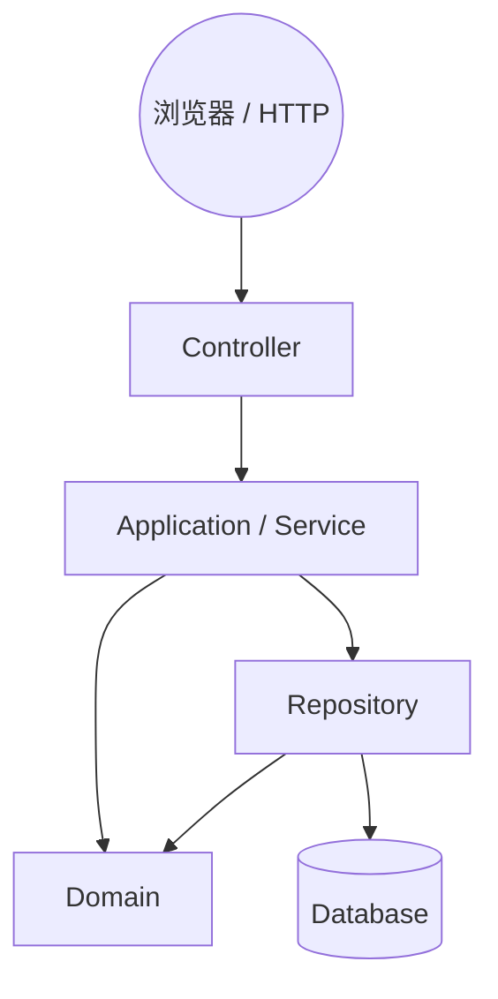

# SmartFix — 校园设施维护与技术人员派单系统

[**English**](README.md) | **简体中文**

> **SWE5006 — 现代软件系统设计实践（NUS-ISS）** · 五人敏捷团队 · Jira + GitHub。

> **仓库状态：** 本仓库当前包含 **SmartFix 的初始架构与开发脚手架**。真正的业务功能会
> 在后续敏捷 Sprint 中，按照 User Story、Use Case、Analysis、Design 逐步实现。**当前仓库
> 只是项目基础框架，不是已经完成的 SmartFix 系统。**

这份中文 README 是**中文上手指南**，面向刚加入团队、还在熟悉
Spring Boot / Maven / Git / Docker / PostgreSQL / 分层架构 / Modular Monolith
的同学。英文版 [`README.md`](README.md) 仍是项目的主要、权威文档，规则以它和
`docs/` 下各指南为准。这份文档只做一件事：让你**用中文就能看懂整个项目，然后安全地开始写代码**。

---

## 新人快速上手（15–30 分钟）

如果你第一次加入，只需按顺序完成下面这些，就可以开始干活：

1. 先读第 [1](#1-这个项目是做什么的)～[3](#3-规划中的业务流程) 节，了解项目角色和模块划分。
2. 装好环境：JDK 21、Maven 3.9+、Docker Desktop（含 Compose）、Git（检查方法见[本地环境](#14-本地环境搭建)）。
3. 克隆仓库并创建自己的环境文件：
   ```bash
   git clone https://github.com/Lian9374/smartfix.git
   cd smartfix
   cp .env.example .env   # 按需修改；.env 永远不要提交
   ```
4. 启动数据库：
   ```bash
   docker compose up -d db
   ```
5. 启动应用：
   ```bash
   mvn spring-boot:run -Dspring-boot.run.profiles=dev
   ```
6. 打开浏览器确认 <http://localhost:8080/>，再看健康检查 <http://localhost:8080/actuator/health>（预期 `{"status":"UP"}`）。
7. 跑一遍测试确认环境没问题：`mvn test`。
8. 读一遍 [日常 Git 工作流](#16-日常-git-工作流) 和 [main 分支规则](#19-main-分支规则)。
9. 从 Jira 领取你自己的 Story（如 SCRUM-XX）。
10. 从 `main` 创建 feature 分支开始开发（流程见 [拿到 Jira Story 后怎么开发](#15-拿到-jira-story-后到底怎么开发)）。

> 遇到任何环境问题，先看 [`docs/troubleshooting.md`](docs/troubleshooting.md)。

---

## 目录

1. [这个项目是做什么的](#1-这个项目是做什么的)
2. [官方系统角色](#2-官方系统角色)
3. [规划中的业务流程](#3-规划中的业务流程)
4. [当前已经完成什么](#4-当前已经完成什么)
5. [当前还没有实现什么](#5-当前还没有实现什么)
6. [架构到底是什么](#6-架构到底是什么)
7. [依赖方向（准确理解）](#7-依赖方向准确理解)
8. [当前仓库目录结构](#8-当前仓库目录结构)
9. [模块职责表](#9-模块职责表)
10. [common 不是“什么都能放”的公共文件夹](#10-common-不是什么都能放的公共文件夹)
11. [Controller/Service/Domain/Repository/DTO 各层职责](#11-controllerservicedomainrepositorydto-各层职责)
12. [模块之间应该怎么调用](#12-模块之间应该怎么调用)
13. [我的代码应该放在哪里](#13-我的代码应该放在哪里)
14. [本地环境搭建](#14-本地环境搭建)
15. [拿到 Jira Story 后到底怎么开发](#15-拿到-jira-story-后到底怎么开发)
16. [日常 Git 工作流](#16-日常-git-工作流)
17. [分支命名规范](#17-分支命名规范)
18. [Commit 怎么写](#18-commit-怎么写)
19. [main 分支规则](#19-main-分支规则)
20. [Pull Request 流程](#20-pull-request-流程)
21. [怎么加一个小功能](#21-怎么加一个小功能)
22. [怎么增加一个大模块](#22-怎么增加一个大模块)
23. [数据库开发与 Flyway](#23-数据库开发与-flyway)
24. [已经共享的 migration 不要随便修改](#24-已经共享的-migration-不要随便修改)
25. [数据库变更举例](#25-数据库变更举例)
26. [测试怎么做](#26-测试怎么做)
27. [H2 与 PostgreSQL 的警告](#27-h2-与-postgresql-的警告)
28. [安全开发警告](#28-安全开发警告)
29. [绝对不能提交到 GitHub 的内容](#29-绝对不能提交到-github-的内容)
30. [pom.xml 安全](#30-pomxml-安全)
31. [修改前必须小心的文件](#31-修改前必须小心的文件)
32. [Merge Conflict 怎么处理](#32-merge-conflict-怎么处理)
33. [如果不小心在 main 上开发了](#33-如果不小心在-main-上开发了)
34. [危险 Git 命令](#34-危险-git-命令)
35. [我的 feature 分支坏了怎么办](#35-我的-feature-分支坏了怎么办)
36. [main 坏了怎么办](#36-main-坏了怎么办)
37. [CI / Jenkins 相关](#37-ci-jenkins-相关)
38. [Definition of Done（完成的定义）](#38-definition-of-done完成的定义)
39. [开始写代码前 Checklist](#39-开始写代码前-checklist)
40. [提交前 Checklist](#40-提交前-checklist)
41. [开 PR 前 Checklist](#41-开-pr-前-checklist)
42. [合并前 Checklist](#42-合并前-checklist)
43. [团队绝对禁止做的事](#43-团队绝对禁止做的事)
44. [Design Pattern 规则](#44-design-pattern-规则)
45. [这个开发方式和 SWE5006 的关系](#45-这个开发方式和-swe5006-的关系)
46. [术语表](#46-术语表)
47. [文档导航](#47-文档导航)

---

## 1. 这个项目是做什么的

**SmartFix** 是一个基于 Web 的**校园设施维护与技术人员派单系统**，用于
**SWE5006 Designing Modern Software Systems Practice（NUS-ISS）** 课程，由
**五人团队**采用 **Agile** 方式开发（约 10 周），**Jira** 管需求/任务，**GitHub** 管代码协作。

要解决的业务问题：目前校园里的设施故障是通过电话、邮件、聊天群等**分散渠道**上报的，
导致：

- **上报分散**——没有一个统一、结构化的报障入口；
- **追溯困难**——请求历史散落各处，很难跟踪；
- **派单滞后**——没有统一视图知道哪些需要维修、谁有空；
- **维修不透明**——报修用户看不到进度，管理员也缺少运营视角。

SmartFix 要把这些串成一条**结构化流程**：集中报障 → 请求跟踪 → 技术人员分配 → 维修处理
→ SLA 监控 → 设施状态可见 → 反馈与运营报表，直到请求被关闭。

技术形态一句话：**一个 Spring Boot 应用、一个可部署单元、一个主关系型数据库。**

## 2. 官方系统角色

经批准的项目方案目前只定义**三个角色**，不要把 `FACILITY_OFFICER` 之类加进来：

| 角色 | 典型用户 | 职责 |
|---|---|---|
| **REQUESTER（报修用户）** | 学生或教职员工 | 提交设施故障、查看进度、确认维修结果并反馈 |
| **TECHNICIAN（维修人员）** | 维修工人 | 接收分配的任务、执行维修、更新维修进度、记录维修结果 |
| **ADMINISTRATOR（管理员）** | 系统/行政人员 | 用户管理、请求审核与分类、设置优先级、配置 SLA、技术人员分配、监控与设施状态管理 |

代码里的 `user/domain/Role.java` 目前也只有这三个角色。任何角色模型的改动都属于
**需求/设计变更**，必须先在团队里讨论（见 [`docs/team-workflow.md`](docs/team-workflow.md)），
不要自作主张建模。

## 3. 规划中的业务流程

下面是规划中的端到端流程（**概念示意**，细节状态流转规则仍属于开放的
Analysis & Design 问题，请不要当成最终规则）：

```text
报修用户（REQUESTER）
   ↓
提交维修请求
   ↓
管理员审核 / 分类 / 设置优先级
   ↓
技术人员推荐与分配（TECHNICIAN）
   ↓
维修人员接单、执行维修
   ↓
更新维修进度与维修结果
   ↓
报修用户确认（开放设计点，见下方说明）
   ↓
管理员最终核验 / 关闭请求
```

**开放的业务/设计问题（不要自己拍脑袋定答案）：**

- **谁可以把请求置为“已关闭”？** 方案里既有“用户确认 → 管理员最终关闭”，也有“维修人员可更新到 Closed”。到底谁有权关单，要在 Use Case / Sequence Diagram 分析阶段定下来。当前架构保持足够的灵活性，后期加上最终规则不需要推倒重来。
- 外部 **NUS SSO** 是否真的需要（尚未确认，当前只有脚手架级别的认证）。
- 什么时候、是否真的需要技术人员的**匹配策略**（Strategy Pattern）。
- 是否会出现 **Facility Officer** 角色（见第 [2](#2-官方系统角色) 节）。
- 报表/地图等功能的模块映射细节。

## 4. 当前已经完成什么

> 一句话：**能编译、能启动、能跑通“从浏览器 → Controller → 模板”的最小链路**。

- ✅ 单个 Spring Boot 3.5.4（Java 21）应用，**可以编译、可以启动**。
- ✅ 最小**首页**（`GET /` 和 `GET /home`），用 Spring MVC + Thymeleaf 渲染。
- ✅ **Actuator 健康检查**：`GET /actuator/health`。
- ✅ 本地开发用 **PostgreSQL（Docker Compose）**。
- ✅ **隔离的 H2 测试 profile**：跑 `mvn test` 不需要外部数据库。
- ✅ **Flyway** 迁移基础设施（`V1__baseline.sql` 是**故意留空**的基线）。
- ✅ **临时放行（permit-all）的安全基线**（见第 [28](#28-安全开发警告) 节）。
- ✅ 基础设施测试：应用上下文能加载 + 首页能渲染。
- ✅ Maven 构建、`Jenkinsfile` 基线（Checkout → Build → Unit Test → Package）。
- ✅ 一整套工程文档（中文版见本文件，英文版见 README 与 `docs/`）。

## 5. 当前还没有实现什么

> 下面这些**都还没有做**，写代码、写文档、写测试时**不要假设它们存在**：

完整登录、NUS SSO、最终版 RBAC 权限模型、维修请求 CRUD、图片上传、评论、反馈、
重开（reopen）流程、请求状态流转引擎、工单（Work Order）流程、技术人员智能匹配
（以及配套的 Strategy Pattern）、SLA 计算/调度/升级、通知/邮件、校园地图 provider 集成、
实时推送、报表/看板、公告、完整审计日志，以及**最终的数据库表结构**。

**为什么故意不做？** 因为课程要求团队按下面的顺序推进，而不是先把功能“预生成”出来：

```text
User Story → Use Case → Analysis → Design → Implementation → Testing
```

先想清楚“做什么、给谁用、规则是什么”，再写代码。现在把表结构和业务代码写死，反而是浪费
而且会锁死后续设计。

## 6. 架构到底是什么

SmartFix 采用的是：

```text
Modular Monolith（模块化单体）
  + Layered Architecture（分层架构）
  + Package by Business Feature（按业务模块分包）
```

用大白话说：

**整个 SmartFix 是一个 Spring Boot 应用，它不是微服务。** 但在**一个应用内部**，代码按
**业务职责**分成多个独立模块，例如 `auth`、`user`、`request`、`workorder`、`dispatch`、
`sla`、`facility`、`notification`、`reporting`、`announcement`、`audit`，每个模块内部再按
需要分 `controller` / `service` / `domain` / `repository` / `dto` 层。

**好处：**

- **更容易找代码**：做“报修”功能就进 `request`，别处翻。
- **更容易多人协作**：不同同学写不同模块，很少抢同一个文件。
- **降低冲突、降低模块耦合、更容易测试**。
- **后期能横向加新业务模块**，不需要为了加功能把整个系统拆了重建。

**特别提醒：这不是微服务。** 这里只有一个可部署应用、一个数据库。Kubernetes、消息队列、
拆分多个后端服务都**不在本项目范围内**——它们带来的运维复杂度是当前五人小团队不需要的。
只有在将来真的出现清晰边界时，才考虑把某个模块抽取出去。

### 模块与层的顺序

先按**业务模块**分组源码（`auth`、`request`……），模块内部**在确实需要那一层时**再按层分包。
**不要**提前创建一堆空目录装样子——代码仓库里现在只存在真正有代码的包。

## 7. 依赖方向（准确理解）

依赖**不是**一条“Controller → Service → Domain → Repository”的单链。准确的理解是：
Controller 依赖 Service；Service 同时使用 **Domain 对象**和 **Repository**；Repository
负责持久化并使用 Domain 类型；Domain 独立于 Web/基础设施。



- **Controller**：只做 Web 层的事——接收请求、校验/转换输入、调用 Service、决定返回哪个页面/响应。**不写**复杂业务逻辑，**不直接碰数据库**。
- **Service**：组织 use case 和工作流；协调 Domain 对象；调用 Repository；在需要的地方负责事务边界。
- **Domain**：业务概念与业务规则；应尽量独立于 Controller、视图和 Spring/HTTP 基础设施。
- **Repository**：只做持久化访问，**不负责**业务流程编排。
- **DTO**：在页面/应用边界传递数据的对象。

详细规则、跨模块规则和 `common` 规则，见 [`docs/architecture.md`](docs/architecture.md)
与 [`docs/module-guide.md`](docs/module-guide.md)。

## 8. 当前仓库目录结构

这是**真实的**当前目录（`target/` 是构建产物，已被 `.gitignore` 忽略）：

```text
smartfix/
├── src/
│   ├── main/
│   │   ├── java/com/smartfix/
│   │   │   ├── SmartFixApplication.java      # Spring Boot 启动入口
│   │   │   ├── auth/config/SecurityConfig.java  # 临时安全基线（见 §28）
│   │   │   ├── common/web/HomeController.java   # 首页 Controller
│   │   │   └── user/domain/Role.java            # 三个官方角色枚举
│   │   └── resources/
│   │       ├── application.yml              # 基础配置（数据源/JPA/Flyway/Actuator）
│   │       ├── application-dev.yml          # dev profile：打印 SQL + DEBUG 日志
│   │       ├── templates/home.html          # Thymeleaf 首页模板
│   │       ├── static/css/site.css          # 极简样式
│   │       └── db/migration/V1__baseline.sql # Flyway 基线（故意为空）
│   └── test/
│       ├── java/com/smartfix/
│       │   ├── SmartFixApplicationTests.java     # 应用上下文加载测试
│       │   └── common/web/HomeControllerTests.java # 首页渲染测试
│       └── resources/application-test.yml        # 隔离的 H2 测试 profile
├── docs/                          # 团队工程文档（英文）
├── .github/
│   ├── pull_request_template.md   # PR 模板
│   └── ISSUE_TEMPLATE/            # 可选的 issue 模板
├── Dockerfile
├── docker-compose.yml
├── Jenkinsfile
├── pom.xml
├── CONTRIBUTING.md
├── .gitignore · .editorconfig · .env.example · .dockerignore
├── README.md                      # 主文档（英文）
└── README.zh-CN.md                # 本文件（中文上手文档）
```

## 9. 模块职责表

> 状态说明：**已存在** = 该包现在已有真实代码（目前只有 `common`、`auth`、`user`
> 有骨架代码）；**规划中** = 是设计好的模块边界，但**还没有创建目录**，等某个 Story
> 需要时才创建。**不要提前建空包。**

| 模块 | 状态 | 负责什么 | 以后可能放什么 | 不能放什么 |
|---|---|---|---|---|
| `common` | 已存在 | 真正横切的基础设施 | `common.exception`、`common.web`（如 `HomeController`）、共享校验/配置 | 业务逻辑；`TechnicianMatchingUtil`、`SlaCalculator`、各种业务 Helper |
| `auth` | 已存在 | 认证与授权 | `SecurityConfig`（现在）、登录 Controller/Service、RBAC 规则（Sprint 2） | 维修请求逻辑、技术人员匹配 |
| `user` | 已存在 | 用户、角色、账号 | `User`、`Role`（现在）、`UserRepository`、`UserService`、账号管理 | 工单或派单规则 |
| `request` | 规划中 | 维修请求生命周期：提交、历史、评论、反馈 | `MaintenanceRequest`、`RequestComment`、`Attachment`、`Feedback`、`RequestController/Service/Repository/DTO` | SLA 计算；技术人员分配 |
| `workorder` | 规划中 | 工单与维修执行 | `WorkOrder`、诊断/维修/物料/工时/证据记录 | 请求提交；匹配规则 |
| `dispatch` | 规划中 | 技术人员推荐与分配 | `Assignment`、派单服务/规则（匹配策略要等设计证明需要后再引入） | 直接读别的模块的 Repository |
| `sla` | 规划中 | SLA 策略、期限、超时、升级 | `SlaPolicy`、deadline/提醒/升级逻辑 | 请求创建；维修执行 |
| `facility` | 规划中 | 设施、位置、未来的地图/公开状态 | `Facility`、设施状态记录 | 通知投递 |
| `notification` | 规划中 | 站内/邮件通知 | `Notification`、通知服务 | 领域工作流逻辑 |
| `reporting` | 规划中 | 运营报表与看板 | 基于其他模块**公共 API** 的只读查询 | 直接伸手进每个模块的 Repository |
| `announcement` | 规划中 | 维护公告 / 公开通知 | `Announcement` | 请求或 SLA 的状态变更 |
| `audit` | 规划中 | 重要操作的审计历史 | `AuditEntry`、审计写入 | 业务决策逻辑 |

每个模块的边界论证、依赖关系、场景示例，看
[`docs/module-guide.md`](docs/module-guide.md)。

## 10. common 不是“什么都能放”的公共文件夹

**警告 ⚠️：`common` 只放真正“横切”的基础设施**，例如：

- `common.exception`（全局异常处理）
- `common.web`（通用 Web 设施，如 `HomeController`）
- `common.validation`（跨模块共享的校验）
- `common.configuration`（跨模块共享的配置）

**业务专用类必须留在它自己的业务模块里**，绝不能为了“省事”塞进 `common`。反例：

- `TechnicianMatchingUtil` → 应该属于 `dispatch`
- `SlaCalculator` → 应该属于 `sla`
- `RequestHelper` → 应该属于 `request`
- `FacilityStatusHelper` → 应该属于 `facility`

判断标准：**这个类只被一个业务模块用？→ 放那个模块里。** 不确定就问，别猜。

## 11. Controller/Service/Domain/Repository/DTO 各层职责

| 层 | 主要职责 | 可以做什么 | 不能做什么 |
|---|---|---|---|
| **Controller** | 接收 HTTP 请求、参数校验、决定响应（页面或数据） | 路由映射；输入校验；调用 Service；选择视图 | 直接访问数据库；写复杂业务逻辑；实现 SLA；实现匹配算法 |
| **Service** | 组织 use case、协调 Domain、调用 Repository、管事务 | 用例协调；事务边界；编排领域对象 | 渲染 HTML；能避免就避免 Spring/HTTP 相关代码 |
| **Domain** | 业务概念、状态与业务规则 | Entity、值对象、枚举、领域行为 | 依赖 Controller/Web/Spring；尽量少直接耦合基础设施 |
| **Repository** | 数据库访问 | 对 Domain 类型做持久化查询/CRUD | 业务流程；编排其他模块 |
| **DTO** | 在页面/应用边界传递数据 | 请求/响应/应用边界的传输对象 | 不要为了方便，把所有 JPA Entity 直接当页面输入输出模型 |

> 为什么不要直接暴露 Entity？Entity 带有持久化和生命周期的关注点，直接暴露给视图/API 会让
> Web 层和数据模型绑死、暴露不该暴露的字段、让重构变难。一旦出现真实的请求/响应数据流，
> 就在展示/应用边界引入 DTO。

## 12. 模块之间应该怎么调用

**推荐做法：**

```text
Module A
   → 调 Module B 的公共 Service / API
   →（由 Module B 内部决定是否用 Module B 的 Repository）
```

**不推荐：**

```text
Module A
   → 直接访问 Module B 的 Repository
```

例子：`DispatchService` 不应该随手直接使用其他模块的 `UserRepository`、
`RequestRepository`、`WorkOrderRepository`、`SlaRepository`。需要用户/请求/工单数据时，
应该通过它们所在模块的 **Service / 公共 API** 拿到。

**为什么？** 否则模块之间会越来越耦合，整个 Modular Monolith 最后会退化成一个
“**大泥球**”（big ball of mud），谁都改不动。

**循环依赖是绝对禁止的。** 如果 A 依赖 B、B 又依赖 A，请停下来**讨论设计**，而不是塞
一个 hack 绕过去。

## 13. 我的代码应该放在哪里

快速决策表——找到你的情况，按箭头走：

| 我要加的东西 | 放哪里 |
|---|---|
| 新的**请求页面/表单视图** | `request/controller` + `src/main/resources/templates/` |
| **请求提交 / 历史**行为 | `request/service`（必要时 `request/domain`、`request/repository`） |
| **技术人员匹配逻辑** | `dispatch/service` / `dispatch/domain`——**永远不要提前写 Strategy** |
| **某个工单的数据库查询** | `workorder/repository` |
| **HTTP 表单/请求对象** | 所属模块的 `dto`（如 `request/dto`） |
| **全局异常处理器** | `common/web` 或 `common/exception` |
| **只被 SLA 用的工具类** | `sla`——**不是** `common` |
| **安全 / 登录规则** | `auth`（账号相关配合 `user`） |
| **新的、与其他模块无关的业务能力** | 先讨论是否值得新增顶层模块（见 §22） |
| **改构建 / 部署方式** | `pom.xml`、`Dockerfile`、`docker-compose.yml`、`Jenkinsfile`——先团队讨论 |

拿不准就在群里问或在 PR 描述里写清楚，**不要猜**共享代码该放哪。

## 14. 本地环境搭建

### 14.1 前置条件

| 工具 | 版本 | 检查命令 |
|---|---|---|
| JDK | 21 | `java -version` |
| Maven | 3.9+ | `mvn -version` |
| Docker | Docker Desktop + Compose v2 | `docker --version`、`docker compose version` |
| Git | 任意较新版本 | `git --version` |

### 14.2 克隆并创建本地环境文件

```bash
git clone https://github.com/Lian9374/smartfix.git
cd smartfix
cp .env.example .env     # 只在需要改默认值时编辑；.env 永不提交
```

`.env.example` 提供的是**本地开发默认值**（数据库 smartfix/smartfix 等），不是生产机密。

### 14.3 启动数据库

```bash
docker compose up -d db
```

这会启动 PostgreSQL 16，库名/用户名/密码来自 `.env`（或 `docker-compose.yml` 里的安全默认值）。

**5432 端口被占用？**（例如本机装了 PostgreSQL。）换个宿主端口再告诉应用：

```bash
DB_PORT=5433 docker compose up -d db
```

### 14.4 运行应用

```bash
mvn spring-boot:run -Dspring-boot.run.profiles=dev
```

- 首页：<http://localhost:8080/>
- 健康检查：<http://localhost:8080/actuator/health> → 预期 `{"status":"UP"}`

**8080 被占用？** 换端口：

```bash
mvn spring-boot:run -Dspring-boot.run.profiles=dev \
  -Dspring-boot.run.arguments="--server.port=8081"
```

### 14.5 测试与打包

```bash
mvn test                          # 走隔离的 H2 profile，不需要数据库
mvn clean package                 # 完整构建 + 测试 + 可运行 fat jar
java -jar target/smartfix-0.0.1-SNAPSHOT.jar
```

可选——把应用本身也用 Docker 跑起来：

```bash
docker compose --profile app up --build
```

更多细节和常见问题排查：`docs/development-guide.md`、`docs/troubleshooting.md`。

## 15. 拿到 Jira Story 后到底怎么开发

假设 Jira 上是：**SCRUM-25 Add maintenance request comments**。完整流程：

1. **先读 Jira Story 和 Acceptance Criteria**——先搞清楚“要做什么、怎样才算完成”。
2. **明确这个功能属于哪个业务模块**。评论属于请求 → `request` 模块。
3. **确认要不要补 Analysis / Design**：Use Case、Sequence Diagram、Class Design。
   有状态流转或复杂规则时**不要跳过分析**。
4. **同步本地 main**：
   ```bash
   git checkout main
   git pull origin main
   ```
5. **创建自己的 feature 分支**：
   ```bash
   git checkout -b feature/SCRUM-25-request-comments
   ```
6. **开发**：遵守层规则（§11）和模块边界（§9）。如果涉及改表，加新的 Flyway migration（§23），不要改基线。
7. **添加或修改测试**（§26）。
8. **跑测试**：`mvn test`
9. **跑打包**：`mvn clean package`
10. **检查将要提交的内容**：`git status` 和 `git diff`
11. **提交并推送自己的分支**（Commit 规范见 §18）：
    ```bash
    git add <具体文件>
    git commit -m "feat(request): add request comment validation"
    git push -u origin feature/SCRUM-25-request-comments
    ```
12. **创建 Pull Request**（用 PR 模板，见 §20）。
13. **找组员 Review**；回复或处理每一条评论。
14. **CI 通过**后再合并到 `main`。
15. **合并后更新 Jira**，把 Story 状态前进。

## 16. 日常 Git 工作流

一步步来，每条命令附简短中文解释：

```bash
git checkout main                 # 切到 main 分支
git pull origin main              # 把远端最新 main 拉到本地（保持最新）
git checkout -b feature/SCRUM-XX-short-description
                                  # 基于最新 main 创建自己的功能分支
```

开发之后：

```bash
git status                        # 看改了哪些文件（新增/修改/删除）
git diff                          # 看具体的改动内容（还没 add 的）
git add src/main/java/...         # 只暂存你确实要提交的文件
git commit -m "feat(request): add request comment validation"
                                  # 写一条有意义的提交信息（见 §18）
git push -u origin feature/SCRUM-XX-short-description
                                  # 推送分支到 GitHub；-u 让后续直接 git push
```

然后去 GitHub 开 Pull Request。**分支保持短命**，定期和 `main` 同步。**不要 rewrite
已经共享的历史**，默认用 `git pull` / merge，而不是 rebase / force push。

## 17. 分支命名规范

| 前缀 | 用途 | 示例 |
|---|---|---|
| `feature/` | 新功能 | `feature/SCRUM-21-request-submission` |
| `fix/` | 修 Bug | `fix/SCRUM-33-duplicate-assignment` |
| `chore/` | 工具/维护 | `chore/SCRUM-12-upgrade-logging` |
| `docs/` | 文档 | `docs/SCRUM-15-architecture-diagrams` |
| `test/` | 测试相关工作 | `test/SCRUM-41-dispatch-ranking-tests` |

## 18. Commit 怎么写

写清楚“**改了什么、为什么**”的 conventional 风格信息：

- `feat(request): add request submission validation`
- `fix(workorder): prevent duplicate assignment`
- `test(dispatch): add technician ranking tests`
- `docs: clarify local setup`

**避免模糊信息**：`update`、`changes`、`fix bug`、`final`、`final2` 都不合格。
相关改动放同一个 commit；**不要**把无关改动混在一个 commit 里。

## 19. main 分支规则

> ### 禁止直接在 main 上开发 ⛔

**`main` = 团队当前稳定集成的版本。** 正常流向是：

```text
main
 ↓
feature branch（每个人在自己的分支上开发）
 ↓
开发 + 测试
 ↓
Pull Request
 ↓
Review
 ↓
CI
 ↓
main
```

- **不要** force push `main`。
- **不要** rewrite 已经共享的 `main` 历史。
- 保护 `main` 的 GitHub 设置需要**仓库管理员在 GitHub 网页上配置**（PR 必须、至少 1 个
  approval、要求 CI 通过、禁止 force push、禁止删分支等），配置方法见
  [`docs/github-repository-settings.md`](docs/github-repository-settings.md)。
  在真正配置好之前，**不要假设它已经生效**。

## 20. Pull Request 流程

- **所有改动都通过 PR 合入 `main`**，不在 `main` 上直接提交。
- PR 需要写明：**Jira issue、类型、摘要、为什么、设计/架构影响、数据库影响、安全影响、
  测试情况、截图（UI 改动）、已知限制**——模板在
  [`.github/pull_request_template.md`](.github/pull_request_template.md)。
- **至少一位组员 Review**；每条评论都要回应或解决，不能无视。
- **CI 必须通过**才能合并；不许“在我机器上明明是绿的”就合一个红构建。
- **未解决的 review 评论**不能合并。

## 21. 怎么加一个小功能

小功能通常**放进现有模块**，而不是新建模块。

例子：**“给维修请求加评论”** → 属于 `request` 模块（评论是请求的一部分）。

**不要**随手新建一个 `comment/` 顶层模块——除非评论真的发展成一个**独立的业务能力**
（有自己的数据、规则、生命周期、多个功能都依赖它）。决策规则就一句话：

> 先放进最贴近的现有模块；只有当“放进去会明显降低 cohesion（内聚）”，才考虑新模块。

## 22. 怎么增加一个大模块

架构支持**横向扩展**：新的大业务能力可以加一个顶层模块。

例子（示意）：将来的**备件库存管理**，可能新增一个 `inventory/` 模块：

```text
inventory/
├── controller
├── service
├── domain
├── repository
└── dto
```

一个边界清晰的**新模块**，加进去时**不应该要求重构 request / workorder / dispatch** 等现有模块。
**先倾向于长大现有模块**，而不是随便开新模块。

在新增顶层模块之前，团队要问自己：

- 它是不是**独立的业务能力**？
- 它有没有**自己的数据、生命周期和规则**？
- 放进现有模块会不会**降低内聚**？
- 它的职责能不能用**一句话说清楚**？
- 是不是**真的需要**新的 module？

影响架构的决定要写 **ADR**（架构决策记录，统一放在 `docs/decisions/`；判断什么时候要写 ADR，
见英文 [`README.md`](README.md) §32 与 [`docs/decisions/ADR-001-architecture-baseline.md`](docs/decisions/ADR-001-architecture-baseline.md)），
并在大 PR 之前先讨论。

## 23. 数据库开发与 Flyway

### 本地数据库

```bash
docker compose up -d db          # 启动本地 PostgreSQL 16
```

环境变量（通过 `.env` 设置，`docker compose` 和 Spring Boot 都读它）：

| 变量 | 作用 | 默认值 |
|---|---|---|
| `POSTGRES_DB` | 数据库名 | `smartfix` |
| `POSTGRES_USER` | 用户名 | `smartfix` |
| `POSTGRES_PASSWORD` | 密码 | `smartfix` |
| `DB_PORT` | 映射到宿主机的端口 | `5432` |
| `DB_URL` | Spring Boot 的 JDBC 连接串 | `jdbc:postgresql://localhost:5432/smartfix` |
| `DB_USERNAME` / `DB_PASSWORD` | 应用连库用 | `smartfix` / `smartfix` |
| `SPRING_PROFILES_ACTIVE` | 激活的 profile | `dev` |

**`.env.example` vs `.env`：** `.env.example` 是提交到仓库的**模板**；真正按自己机器改的
`.env` **被 `.gitignore` 忽略，禁止提交**。

### Flyway 是什么、为什么

Flyway 是数据库**版本迁移**工具。项目里 **`ddl-auto: none`**——Hibernate **绝不自动建表**，
数据库结构**只来自 `db/migration/` 下的 Flyway migration**。现在只有一条故意为空的
`V1__baseline.sql`，真实表结构会在每个 Sprint 完成领域建模 / 类设计、获批后，用新 migration 加进来。

**migration 命名规范：**

```text
V<数字>__<snake_case_描述>.sql
# 例：V2__add_maintenance_request.sql（描述用下划线，版本号唯一且递增）
```

### 创建 migration 之前

1. `git pull` 最新的 `main`；
2. 看 `db/migration/` 里已有的版本号；
3. 选**下一个正确的版本号**（避免和别人撞成两个 `V3`）；
4. 破坏性的结构变更（删表删列）先和组员讨论；
5. 跑应用/测试验证迁移没问题。

## 24. 已经共享的 migration 不要随便修改

> ### 警告 ⚠️：已经合入 main / 已经被大家或 CI 跑过的 migration，不要随便改

举例：假设未来某次 PR 已经创建并合入了 `V2__create_user_table.sql`，而且大家都跑过了。
那么**不要**再去编辑这个文件——因为别人数据库里已经记下“V2 已执行”，你改了文件内容，
他们的 Flyway 校验会失败（checksum 不匹配），整个团队都会坏。

**正确做法：新增一个 migration 去演进**：

```text
V2__create_user_table.sql   # 已共享，不再改动
V3__add_user_status.sql     # 新增：加一列状态
```

**为什么？** Flyway 用版本号 + checksum 保证“谁在哪台机器上执行过什么”。改共享文件 =
制造不可恢复的混乱。**自己本地数据库坏了，不能靠删 migration 解决**——那会让团队里其他人
的数据库和 CI 全部不一致。本地问题用本地重置（`docker compose down -v && docker compose up -d db`），
这只影响你自己的库（详见 [`docs/database-guide.md`](docs/database-guide.md)）。

## 25. 数据库变更举例

| 想做什么 | 怎么做 |
|---|---|
| **新增表** | 写一个新的 migration，例如 `V2__add_maintenance_request.sql` |
| **新增字段** | 写一个新的 migration，例如 `V3__add_request_priority.sql`，用 `ALTER TABLE ... ADD COLUMN` |
| **改列名** | 还是新的 migration（改名会破坏数据映射，先和组员确认再动） |
| **删列 / 删表 / TRUNCATE** | **高风险**，先和团队讨论，绝不随手做 |

**不要**因为本地 Flyway 报错就去删 migration 文件。迁移文件是共享资产，演进靠“加”不靠“删改”。
详细的 SQL 示例和迁移冲突处理，见 [`docs/database-guide.md`](docs/database-guide.md)。

## 26. 测试怎么做

完整的测试指南见 [`docs/testing-guide.md`](docs/testing-guide.md)。要点：

**现在的测试（脚手架级，只有 2 个）：**

- `SmartFixApplicationTests`——应用上下文能否加载；
- `HomeControllerTests`——首页能否渲染。

**将来的测试**（写了真实业务逻辑后要跟着补）：

- **Unit Test（单元测试）**：用 JUnit 5 + Mockito 测复杂逻辑。未来重点对象：技术人员分配、
  SLA 规则、请求状态流转、**非法状态转换**、和权限相关的行为。命名贴近业务，例如
  `DispatchServiceTests`、`requestWorkflowCannotReopenAfterClosed()`（这些是**示意名**，
  现在还不存在）。
- **Controller Test（控制器测试）**：用 MockMvc 测 Controller 和页面/端点。
- **Repository / Integration Test（仓储/集成测试）**：测真实数据访问；模型变大后、以及需要
  时再加安全集成测试。

**重要习惯：改业务规则 → 同步改/加测试。** 没有测试保护的规则改动，等于在盲改。

常用命令：

```bash
mvn test                                        # 跑全部测试（走 H2，不需要数据库）
mvn test -Dtest=SomeServiceTests                # 只跑某个测试类（示意语法）
mvn test -Dtest=SomeServiceTests#someMethod      # 只跑某个方法（示意语法）
```

## 27. H2 与 PostgreSQL 的警告

- 当前 `test` profile 用 **H2 的 PostgreSQL 兼容模式**，测试**又快又隔离**：跑 `mvn test`
  不需要数据库、不需要每个人配置。
- 但 **H2 ≠ PostgreSQL**。PostgreSQL 特有的行为（函数、索引、锁、约束）两边可能不一样。
  将来 schema 和 SQL 变“真”之后，**不能假设 H2 全绿就代表 PostgreSQL 一定没问题**——
  届时可能需要引入基于 PostgreSQL / **Testcontainers** 的集成测试。
- **Testcontainers 现在还没有加**。等团队开始写真正的持久化代码时，再**有意地**引入，而不是现在随手加。

## 28. 安全开发警告

> ### 警告 ⚠️：现在 SecurityConfig 的 permit-all 是【临时的】

当前的 `SecurityConfig` 放行所有请求，**只是为了让脚手架能跑起来**，代码里明确标了
`TODO(Sprint 2)`。它**不是**安全的登录方案。

- **Sprint 2 必须**用真正的认证 + RBAC 替换它：密码哈希、会话/CSRF 规则、授权规则、
  受保护路由、角色测试，并清掉脚手架里的 TODO。
- **绝不允许**为了让某个接口能访问，就顺手删掉/弱化安全配置来“解决问题”。
- **最终交付版本绝不允许**意外残留 permit-all 的临时配置。
- 账号、密码、API Key 等凭据**永远不能提交**到仓库。

## 29. 绝对不能提交到 GitHub 的内容

> ### 绝对不能提交：`.env`、password、API Key、token、云厂商凭证、数据库真实凭据、私钥

**如果不小心把 secret 提交了，怎么办？**

1. **立即通知团队。**
2. **立即轮换/吊销**该凭据（就当它已经泄露）。
3. **不要以为**“删掉最新提交里的那个文件”就等于从 Git 历史里抹掉了——历史里还有。
4. 只有在团队同意、且确认安全/必要时，才做 Git 历史清理。
5. **检查 CI 日志和缓存**里是否也出现了这个 secret。

配置上：每个开发者不同的配置走**环境变量**，模板提交在 `.env.example`；
`docker-compose.yml` 和 `application*.yml` 里的值是**本地开发默认值**，不是 secret。

## 30. pom.xml 安全

`pom.xml` 影响**全团队**：加依赖、改插件，每个人的构建和 CI 都会变。

**不要随手往 pom.xml 加东西。** 加依赖之前问自己：

- 真的需要吗？
- Spring Boot 是不是已经提供了？
- 仓库里是不是已有同类的依赖？
- 会不会影响所有组员的构建？
- 会不会引入安全/授权风险？

改完之后跑：`mvn dependency:tree`、`mvn test`、`mvn clean package`。
**大的依赖/框架改动必须团队讨论**（通常还要写 ADR）。

## 31. 修改前必须小心的文件

下面这些文件改了会影响**所有人**，属于“团队级影响”文件：

| 文件 | 为什么重要 | 修改前后要检查什么 |
|---|---|---|
| `pom.xml` | 依赖/构建影响所有成员和 CI | `mvn test`、`mvn clean package`、`mvn dependency:tree` |
| `application.yml` / `.env.example` | 数据源/profile 默认值 | 保持环境变量模式；不要写死 secret |
| `docker-compose.yml` | 共享的本地数据库/应用环境 | `docker compose config` |
| `Dockerfile` | 容器镜像构建 | `docker compose --profile app build` |
| `Jenkinsfile` | 全团队 CI | 核对每个 stage 的命令 |
| `SecurityConfig.java` | 访问控制姿态 | 设计评审（Sprint 2） |
| `db/migration/V*.sql` | 共享数据库 schema | 见 §24；破坏性 SQL 一定评审 |
| `.gitignore` | 决定什么会被提交 | 检查有没有该忽略的敏感文件漏掉了 |
| 架构文档 / 模块文档 | 共享约定 | 和真实代码保持一致 |

## 32. Merge Conflict 怎么处理

遇到 conflict **不要**慌，也**不要**随手乱点：

```text
Accept Current    # ❌ 只保留我这边的
Accept Incoming   # ❌ 只保留对方那边的
```

先理解**双方**的改动意图：

1. 查看冲突文件。
2. 理解两边代码各自想干什么。
3. 如果涉及业务逻辑，**先和另一位开发者沟通**。
4. **手动合并出正确的逻辑**（而不是二选一）。
5. 编译。
6. 跑测试。
7. 再看一遍 `git diff`。
8. 提交这次 conflict resolution。

**特别小心**这些文件的冲突：`pom.xml`、Flyway migration、`SecurityConfig.java`、
各种中心化配置——它们要**刻意处理**，最好找第二个人一起看。

## 33. 如果不小心在 main 上开发了

别慌，先看状态，**不要一上来就 reset**：

- **改动还没提交**：直接带着改动切到新分支即可，工作区改动会跟过去：
  ```bash
  git switch -c feature/SCRUM-XX-description
  ```
- **已经提交了（还没推送，或已经推送）**：先把当前指针挪到安全位置再处理。参考
  [`docs/git-safety-guide.md`](docs/git-safety-guide.md) 的“Accidental situations”
  一节和 [`docs/troubleshooting.md`](docs/troubleshooting.md) 的 Git 部分。

原则：**先把“没提交/误提交”的改动放到安全的地方（新分支），再决定怎么处理 main**，
不要用 `git reset --hard` 之类来“擦除”。拿不准就问组员。

## 34. 危险 Git 命令

> ### 警告 ⚠️：下面的命令很危险，可能永久销毁工作成果

| 命令 | 可能销毁什么 |
|---|---|
| `git reset --hard` | 丢弃工作区和暂存区里**未提交**的改动，还可能让本地提交“消失” |
| `git clean -fd` | 删除**所有未被 Git 跟踪**的文件（本地新建、还没 add 的文件也会被删） |
| `git push --force` | 用你本地的历史**覆盖远端历史**，可能抹掉别人已推送的提交 |

这些**不是**日常工作流。想撤销一个**已经共享/推送**的提交，**优先用 `git revert`**：

```text
共享历史 → 优先 revert，不要 rewrite。
```

`git revert` 会新增一个“反向提交”，不重写历史，别人拉下来就安全了。
完整的恢复路径见 [`docs/git-safety-guide.md`](docs/git-safety-guide.md)。

## 35. 我的 feature 分支坏了怎么办

冷静——你**几乎永远不需要 force push**。

1. 先看现场：`git status` → `git diff` → `git log --oneline -5`。
2. **不要立刻 force push。**
3. 安全恢复：
   - 只**丢弃某个还没提交的文件**（确认无误时）：`git restore <file>`。
   - 撤销一个**已提交（已共享）**的改动：`git revert <commit>`。
   - 危险恢复前，先建一个**备份分支**（便宜又安全）：
     ```bash
     git branch backup/my-work
     ```
4. 拿不准时**问组员**，不要猜着乱敲危险命令。

## 36. main 坏了怎么办

团队流程：

1. **暂停继续 merge**（先止血）。
2. 找到导致问题的 **PR / commit**（`git log`、GitHub PR 列表）。
3. 从 `main` 创建 **repair / revert 分支**。
4. **优先 `git revert`**——绝不 rewrite 共享历史。
5. 开一个**紧急 PR**，跑 CI，合并修复。
6. **通知所有组员**；影响较大时记录原因。

详细步骤见 [`docs/release-and-recovery.md`](docs/release-and-recovery.md)。

## 37. CI / Jenkins 相关

当前 `Jenkinsfile` 只有现在真能跑的 stage：

```text
Checkout（拉代码）
   ↓
Build（mvn -B -DskipTests clean compile）
   ↓
Unit Test（mvn -B test，走 H2，不需要数据库）
   ↓
Package（mvn -B -DskipTests package，产出可运行 jar）
```

**CI 失败 ≠ “Jenkins 出问题了就不管了”。** 红构建要先查清楚再谈合并。按顺序排查：
编译错误 → 单元测试 → 依赖解析 → 环境假设 → 数据库迁移（Flyway）→（以后）Docker 构建。
**当要求的 CI 是红的时，不要因为“我本地是绿的”就合并。** 也不许为了把 CI 弄绿就
删测试、弱化 migration。

以后（Sprint 4/5）只有当真配置了对应工具，才会加：静态代码分析、SCA 依赖安全扫描、
容器安全扫描、Docker 构建发布、部署等 stage。**现在没有的东西不要假装有。**

## 38. Definition of Done（完成的定义）

一个 Story **不算完成**，只因为“我电脑上能运行”。它要满足：

- [ ] Acceptance Criteria 满足
- [ ] 相关 Analysis / Design 如有需要已更新
- [ ] 代码放在正确的模块
- [ ] 没有破坏架构边界（层规则 §11、模块规则 §9、跨模块规则 §12）
- [ ] 测试已增加/更新
- [ ] `mvn test` 通过
- [ ] `mvn clean package` 通过
- [ ] 没有提交 secret
- [ ] Flyway migration 正确且是“增量式”的（§24）
- [ ] PR 已创建
- [ ] Review 完成，评论都已处理
- [ ] CI 通过
- [ ] 行为/配置变化时文档已更新
- [ ] Jira 状态已更新
- [ ] 已合并到 `main`

## 39. 开始写代码前 Checklist

- [ ] 我有对应的 Jira Story 吗？
- [ ] Acceptance Criteria 看懂了吗？
- [ ] 这个功能属于哪个 module？
- [ ] 需要先做 Analysis / UML（用例、时序、类图）吗？
- [ ] 需要改数据库吗？
- [ ] 是不是有别人正在改同一个模块 / 同一批文件？
- [ ] 有没有可以复用的现成 Service / API？
- [ ] 我是不是在重复已有功能？
- [ ] 这次改动会改变架构吗？

## 40. 提交前 Checklist

- [ ] 看过 `git status`
- [ ] 看过 `git diff`
- [ ] 没有无关文件被暂存
- [ ] 没有 secret
- [ ] 没有调试残留 / 生成的垃圾（`target/`、IDE 文件、日志）
- [ ] 测试已跑过
- [ ] migration（如有）已核对
- [ ] commit message 有意义（§18）

## 41. 开 PR 前 Checklist

- [ ] Story 实现完成，Acceptance Criteria 满足
- [ ] 已安全同步最新的 `main`
- [ ] 测试通过
- [ ] 构建通过
- [ ] UI 有改动时附了截图
- [ ] 需要的话包含了 migration
- [ ] 相关设计文档已更新
- [ ] 没有无关的重构混进来
- [ ] 没有遗留调试代码
- [ ] PR 描述完整（模板见 `.github/pull_request_template.md`）

## 42. 合并前 Checklist

- [ ] Review 已完成
- [ ] CI 绿色
- [ ] 冲突已正确处理（§32）
- [ ] Jira 已关联
- [ ] 没有 scope creep（夹带无关改动）
- [ ] migration 顺序/编号没问题
- [ ] Reviewer 理解这次改动的架构影响

## 43. 团队绝对禁止做的事

- 禁止直接在 `main` 上开发。
- 禁止 force push `main`。
- 禁止提交 secret 或 `.env`。
- 禁止随便修改已经共享的 Flyway migration（§24）。
- 禁止为了让 CI 变绿而删除测试或绕过检查。
- 禁止因为某个接口访问失败就删除 / 弱化 Spring Security。
- 禁止把所有“共享”代码都塞进 `common`（§10）。
- 禁止一个模块随便直接访问其他模块的 Repository（§12）。
- 禁止没有讨论就增加大型 dependency / framework。
- 禁止把架构重构藏在普通的 feature PR 里。
- 禁止因为自己本地数据库坏了就删 migration。
- 禁止为了“课程要求”强行套 Design Pattern（§44）。
- 禁止覆盖别人的代码却不沟通。
- 禁止提交 `target/`、IDE 临时文件或生成的垃圾。

## 44. Design Pattern 规则

课程会提 Design Pattern，但**不代表现在就该造 pattern**。

**错误做法：**

```text
“课程要求 Design Pattern，所以先创建一个 Strategy Pattern。”
```

**正确做法：**

```text
发现真实设计问题
  ↓
分析“变化点”（哪里真的会变）
  ↓
比较不同方案
  ↓
选择 Pattern
  ↓
Class Design
  ↓
Implementation
  ↓
Unit Test
```

**例子——技术人员派单：** 只有当 dispatch 的分析证明“多种匹配算法真的是可替换 / 会变”时，
才引入 **Strategy Pattern**；在那之前，先不要写。先写清楚逻辑、用测试锁住行为，等变化点真实
出现再抽象。

## 45. 这个开发方式和 SWE5006 的关系

SmartFix 不只是“写一个能跑的网站”。这个仓库要展示的是一整套工程能力：

```text
Agile · Analysis & Design · Design Patterns · 结构清晰的代码 · Testing · DevSecOps
```

重要 Story 大致应该走：

```text
Jira / User Story
  ↓
Use Case
  ↓
Analysis
  ↓
Sequence / Class Design
  ↓
Implementation
  ↓
Unit Test
  ↓
PR（Review）
  ↓
CI / CD
```

**这正是为什么业务功能没有被提前生成**——先有分析和设计，再有实现，这样每一步都有据可查，
也符合课程对过程的考察。

## 46. 术语表

| 术语 | 一句话解释 |
|---|---|
| **Jira Story** | Jira 里的一条用户故事/任务，是团队排期和跟踪的最小工作单元（如 SCRUM-25）。 |
| **Sprint** | 敏捷迭代周期，团队在一个 Sprint 内完成一批 Story。 |
| **Branch** | Git 分支：一条独立的开发线，用来隔离你的改动，避免直接改 `main`。 |
| **Pull Request (PR)** | 请求把你的分支合并进 `main` 的“评审单”，组员在上面 Review 和讨论。 |
| **Merge** | 把分支的改动合入另一个分支（通常合入 `main`）。 |
| **CI** | 持续集成：代码一推送就自动跑编译、测试、打包（这里是 Jenkins）。 |
| **Controller** | Web 层，接收 HTTP 请求、决定返回哪个页面/数据（见 §11）。 |
| **Service** | 应用层，组织用例与业务流程（见 §11）。 |
| **Domain** | 领域层，业务概念与业务规则（见 §11）。 |
| **Repository** | 数据访问层，封装对数据库的读写（见 §11）。 |
| **DTO** | 在页面/应用边界传输数据的对象，避免把 Entity 直接暴露出去（见 §11）。 |
| **Entity** | 映射到数据库表、带持久化语义的领域对象。 |
| **Flyway** | 数据库版本迁移工具：用带编号的 SQL 文件管理 schema 演进（见 §23）。 |
| **Migration** | 一条 Flyway 迁移，即一个 `V<n>__xxx.sql` 文件。 |
| **Modular Monolith** | 模块化单体：一个应用，内部按业务切成多个模块（见 §6）。 |
| **RBAC** | 基于角色的访问控制，Sprint 2 要做（见 §28）。 |
| **SLA** | 服务等级协议，这里指维修响应的时限规则（超时提醒/升级）。 |
| **ADR** | 架构决策记录：把有长期影响的架构决定写成文档，放在 `docs/decisions/`。 |

## 47. 文档导航

需要深入时，去读这些英文文档（都是当前真实存在的文件）：

| 文档 | 用途 |
|---|---|
| [`README.md`](README.md) | 主文档（英文），工程手册：架构、模块、工作流、安全规则。**规则以此为准。** |
| [`CONTRIBUTING.md`](CONTRIBUTING.md) | 贡献守则（简洁版“不可违反”规则）。 |
| [`docs/architecture.md`](docs/architecture.md) | 架构详解：依赖方向、跨模块规则、`common` 规则、ECB 关系。 |
| [`docs/module-guide.md`](docs/module-guide.md) | 每个模块的深挖：目的、边界、依赖、禁止项。 |
| [`docs/development-guide.md`](docs/development-guide.md) | 面向新手的日常开发手册（搭建、日常循环、提交、同步）。 |
| [`docs/team-workflow.md`](docs/team-workflow.md) | Jira → GitHub 的团队协作流程、角色分工、协调方法。 |
| [`docs/git-safety-guide.md`](docs/git-safety-guide.md) | “怎么不把仓库弄坏”：安全/危险命令、恢复方法。 |
| [`docs/database-guide.md`](docs/database-guide.md) | PostgreSQL + Flyway 的安全规则与 SQL 示例。 |
| [`docs/testing-guide.md`](docs/testing-guide.md) | 测试层级、命名、mock 建议、跑法。 |
| [`docs/troubleshooting.md`](docs/troubleshooting.md) | 常见问题排查（环境、端口、Flyway、Git）。 |
| [`docs/release-and-recovery.md`](docs/release-and-recovery.md) | 稳定 `main`、打标签、坏合并后的恢复。 |
| [`docs/github-repository-settings.md`](docs/github-repository-settings.md) | 仓库管理员在 GitHub 上要配的保护设置。 |
| [`docs/decisions/ADR-001-architecture-baseline.md`](docs/decisions/ADR-001-architecture-baseline.md) | 基线架构决策记录。 |

---

文档存在的意义是**保护团队、让工程过程可见**，而不是变成官僚主义。拿不准的时候，
选一个**小、经过 Review、有测试**的改动，而不是一个大而无人评审的改动。
有问题先看文档，再问组员，最后才动手。
