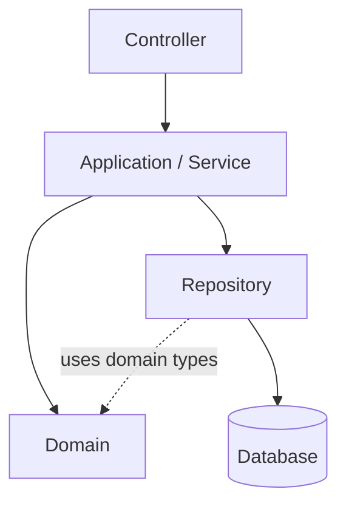

# SmartFix Architecture

This document explains the architecture of the SmartFix repository for the five team
members. It is the authoritative description of *how code should be organised* and
*how modules may talk to each other*.

> **Scope note:** this describes the engineering baseline. Business functionality is
> implemented incrementally through Agile sprints after analysis and design, and the
> architecture may be refined as the team learns. Any architecture change goes through
> the process in README §32 / `docs/team-workflow.md`.

---

## 1. Architectural style

**Modular Monolith + Layered Architecture + Package by Business Feature.**

- One Spring Boot application, one deployable unit, one primary relational database.
- Microservices, Kubernetes and distributed messaging are **intentionally not used**
  (section 7).
- Code is organised **primarily by business module**; within a module, layers are added
  only where genuinely needed.

### 1.1 Module-first packaging

Planned module boundaries under `com.smartfix` (deep-dive: `docs/module-guide.md`):

```text
com.smartfix
├── common          # genuinely cross-cutting infrastructure only
├── auth            # authentication & authorization
├── user            # users, roles, accounts
├── request         # maintenance requests, history, comments, feedback
├── workorder       # work orders, repair tracking, evidence
├── dispatch        # technician recommendation & assignment
├── sla             # SLA policies, deadlines, escalation
├── facility        # facilities, campus map, public status
├── notification    # in-app / email notifications
├── reporting       # operational reporting
├── announcement    # maintenance announcements
└── audit           # audit history
```

Only packages that actually contain code exist in the repository today (`common`,
`auth`, `user`). Empty directories are **not** created merely to look complete; this
layout is the *target* structure that stories grow into.

### 1.2 Layers inside a module

Where a module needs the full stack, group code into conventional layers:

```text
<module>/
    controller/   # HTTP + view handling (thin)
    service/      # application / business coordination
    domain/       # business concepts (entities, enums, rules)
    repository/   # persistence
    dto/          # request/response/application boundary data
```

Not every layer must exist in every module. Add a layer only when real code needs it.

## 2. Dependency direction (accurate picture)

Layers do **not** form a single chain. The relationship is better described as:



Meaning:

- **Controller → Service.** Controllers depend on services (application API), never on
  repositories or the database directly.
- **Service → Domain and Service → Repository.** A service coordinates use cases by
  *using domain objects* (business rules/state) and *using repositories* (persistence).
  This is a **branch**, not a chain: the Domain layer does **not** sit "above" the
  Repository, and the Service is not required to pass every domain object through the
  Repository.
- **Repository → Domain.** Repositories persist *domain* types, so they use domain
  types as their data model. Repositories hide the database from the rest of the app.
- **Domain** represents business concepts and rules and should remain **as independent
  of infrastructure as practical** — no dependency on controllers, web/view machinery or
  Spring-specific plumbing where avoidable. (A JPA annotation such as `@Entity` on a
  domain class is a pragmatic, team-accepted coupling to persistence technology — the
  point is that Domain must **not** depend on Controller/View infrastructure.)

Responsibilities:

| Layer | Handles | Must not |
|---|---|---|
| **Controller** | HTTP/web concerns; validate and map input; delegate behaviour; choose view/response | Business logic; database access; repository calls |
| **Service** | Use-case coordination; application/business workflow; uses domain objects and repositories | HTML rendering; HTTP-specific logic where avoidable |
| **Domain** | Business concepts, state and business rules | Controller/web dependencies; orchestrating other modules |
| **Repository** | Persistence access; hides database interaction; normally used by services | Business workflow; orchestrating other modules |
| **DTO** | Request/response/application boundary data | Business logic |

### 2.1 The common pitfall

A naive diagram "Controller → Service → Domain → Repository" can wrongly imply that
Domain depends on Repository. It does not. Services pull from Domain and Repository
independently. Controllers never reach into Domain or Repository directly.

## 3. Cross-module dependency rules

Modules are cohesive, loosely coupled units. Communication between them must respect
boundaries.

### 3.1 How Module A should use Module B

**Preferred**

```text
Module A  →  Module B public Service / application API
```

For example, a dispatch service that needs requester context should call
`UserService`/`RequestService` (the public API of the module that owns that data), not
reach into `UserRepository`/`RequestRepository`.

### 3.2 What to avoid

```text
Module A  →  Module B Repository directly        (avoid)
Module A  →  Module B internal implementation    (avoid)
```

For example, `DispatchService` must **not** freely reach into `UserRepository`,
`RequestRepository`, `WorkOrderRepository`, `FacilityRepository` or `SlaRepository`
from unrelated modules.

### 3.3 Why

- **Protects module boundaries** — each module keeps control of its own data and rules.
- **Reduces coupling** — a change inside Module B cannot silently break Module A.
- **Improves maintainability** — each module stays readable and independently evolvable.
- **Makes later change safer** — swapping a module's internals only affects its public API.
- **Prevents one large tightly coupled monolith** — which is exactly what we are trying
  to avoid while staying modular.

### 3.4 Cyclic dependencies are prohibited

If Module A requires Module B and Module B requires Module A, **stop and review the
design** rather than adding hacks. Typical fixes: extract the shared concept into a
third module (or into the domain of the module that truly owns it), invert the
dependency, or introduce a shared "contract"/interface owned by one side. Never resolve
a cycle by merging two unrelated modules or by dumping shared code into `common`.

## 4. The `common` package rule

`common` is **not a dumping ground**.

**Allowed** (genuinely cross-cutting infrastructure):

```text
common.exception      # e.g. a global exception handler
common.web            # e.g. the scaffold home page controller
common.validation     # shared, module-independent validation
common.configuration  # shared, module-independent configuration
```

**Not allowed** — business-specific concepts that happen to be used by several classes:

```text
TechnicianMatchingUtil   → must NOT go in common (belongs to dispatch)
SlaCalculator            → must NOT go in common (belongs to sla)
RequestHelper            → must NOT go in common (belongs to request)
FacilityStatusHelper     → must NOT go in common (belongs to facility)
```

### 4.1 How to decide whether something belongs in `common`

Ask:

1. Is it **module-independent** — does it work for any module without knowing a
   module's business concepts?
2. Is it **cross-cutting infrastructure** (error handling, web plumbing, shared
   configuration), not business logic?
3. Would placing it in a business module cause that module to be imported by unrelated
   modules just to reach a generic helper?

If it is business logic that several *specific* modules use, it likely belongs to the
module that **owns** the concept; other modules call that module's public API. If it is
generic and module-independent, `common` may be acceptable. When unsure, discuss —
prefer a wrong-but-visible decision to silently dumping logic into `common`.

## 5. Relationship to ECB analysis

Analysis models map onto implementation **conceptually** — analysis names are not copied
into package or class names.

| Analysis (ECB) | Implementation |
|---|---|
| Boundary | Spring MVC Controller / View |
| Control | Application / Business Service |
| Entity | Domain Entity |
| Persistence | Repository |

There is deliberately **no** `boundary`/`control` package. ECB is a way of thinking;
implementation uses conventional Java architecture.

## 6. How this structure supports the project goals

- **Maintainability:** small modules + thin controllers + clear dependency direction.
- **Extensibility:** new stories add code inside the owning module; the module layout
  gives future features (matching, SLA, notifications, map, reporting) a clear home
  without pre-building them.
- **Testability:** services/domain unit-test in isolation (Mockito); web layers via
  MockMvc; repositories against an isolated test database. `mvn test` needs no external
  database (H2 test profile).
- **Team parallel development:** boundaries mean members rarely edit the same code;
  cross-module access goes through stable public APIs.
- **DevSecOps friendliness:** one deployable JAR keeps CI simple; module boundaries give
  future static analysis meaningful structure.

## 7. Why microservices are intentionally NOT used

- Small team (five), cohesive single workflow — modular monolith boundaries give the
  same development-time isolation without distributed-systems cost (service discovery,
  networking, data consistency, deployment, observability).
- The module syllabus does not require distributed architecture.
- The team should focus on analysis & design, patterns, testing and DevSecOps rather
  than infrastructure.

If a future sprint reveals a genuinely independent boundary (scaling or team), a module
can be extracted. The module-first layout keeps that option open **without** paying the
distributed cost today.

## 8. Functional module diagram vs implementation architecture

The proposal describes *functional* areas (request management, technician dispatch,
SLA monitoring…). Those are a **requirements view**, not a code structure. This
repository maps them to **implementation modules**. The mapping is confirmed during
use-case and class design rather than assumed now.

## 9. Current scaffold boundaries

Only the engineering baseline exists: application entry point, temporary security
baseline (README §30), minimal home page, configuration, database/Flyway
infrastructure and infrastructure tests. See
[`docs/decisions/ADR-001-architecture-baseline.md`](decisions/ADR-001-architecture-baseline.md)
and the README for the explicit list of what is intentionally not yet implemented.
