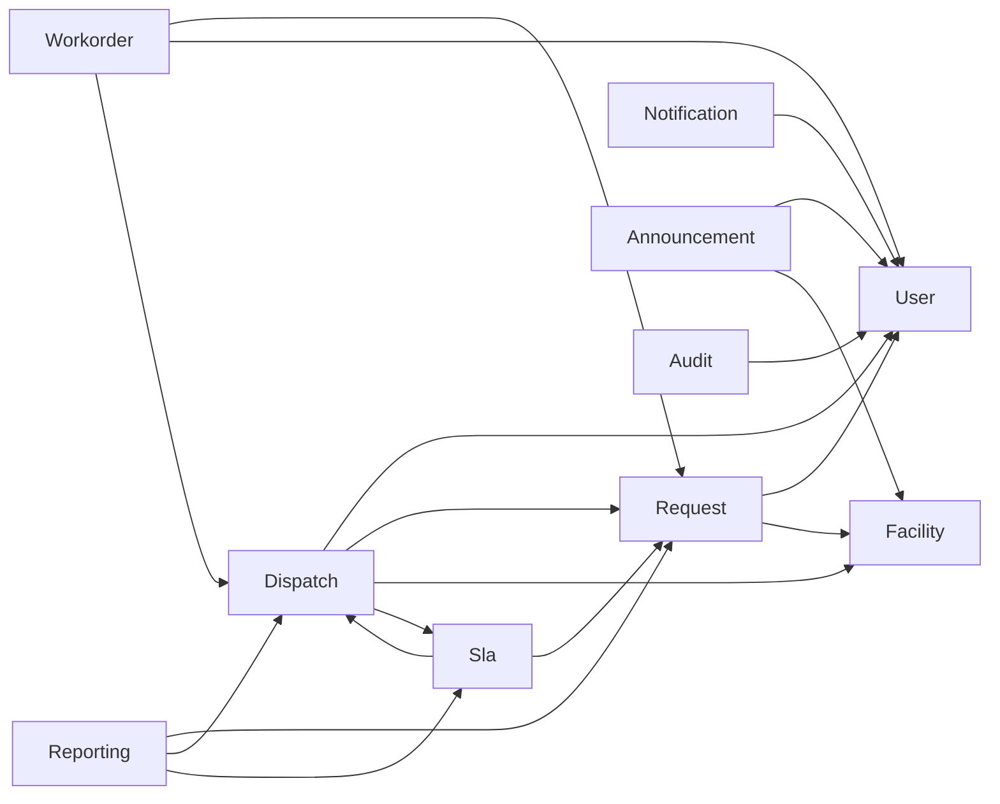

# SmartFix Module Guide

This guide explains every planned `com.smartfix.*` module: its purpose, what it owns,
what it must **not** own, likely future content, and the dependencies it may reasonably
have. Use it to answer the question **"where should this code go?"** before writing it.

> Only modules that contain real code exist in the repository today (`common`, `auth`,
> `user`). Everything else below is the **target structure**. Create a module/package
> when a story needs it — not before. See also `docs/architecture.md` (cross-module
> rules and the `common` rule).

---

## Cross-cutting rules (read first)

1. **Cross-module access goes through the owning module's public Service/API** — never
   casually through another module's Repository.
2. **Cyclic module dependencies are prohibited** — if A needs B and B needs A, stop and
   redesign.
3. **`common` holds only genuinely cross-cutting infrastructure** — never business
   logic that several modules share.
4. When a module below lists "may reasonably depend on", that means *via that module's
   public API*, not its internals.

---

## `common`

- **Purpose:** genuinely cross-cutting infrastructure shared by all modules.
- **Owns:** infrastructure that has no business meaning on its own — error handling,
  web plumbing, shared generic configuration.
- **Does not own:** any business concept. No request, dispatch, SLA, facility or
  technician logic — even if used by several classes.
- **Current content:** `common/web/HomeController` (scaffold home page).
- **Likely future content:** `common.exception` (global exception handler),
  `common.validation` (generic, module-independent validation),
  `common.configuration`.
- **May reasonably depend on:** framework/Spring infrastructure only.
- **Example of something that must NOT live here:** `TechnicianMatchingUtil`,
  `SlaCalculator`, `RequestHelper`, `FacilityStatusHelper`.

**Decision aid:** is it module-independent infrastructure (→ consider `common`) or is it
business logic owned by one module (→ keep it in that module, let others call its API)?

---

## `auth`

- **Purpose:** authentication and authorization concerns.
- **Owns:** who may access the system and what they may do — login flow, session,
  security configuration, (future) RBAC rules, password encoding decisions.
- **Does not own:** maintenance requests, technician matching, SLA, facility data.
- **Current content:** `auth/config/SecurityConfig` — a **temporary** permit-all
  baseline (see README §30).
- **Likely future domain objects:** login/session/authority concepts (an actual `User`
  account lives in `user`; `auth` defines access rules and how identities are verified).
- **Likely services:** `AuthService` / authentication provider, password encoder wiring.
- **Likely repository responsibility:** none for its own core rules; it consults the
  `user` module for accounts/roles via `user`'s public API.
- **May reasonably depend on:** `user` (accounts, roles). Should not depend on
  `request`, `dispatch`, `workorder`, etc. (other modules depend on *it* instead).
- **Example scenario:** "protect the technician workbench behind a TECHNICIAN role" →
  add an authorization rule in `auth`, referencing roles from `user`.

---

## `user`

- **Purpose:** users, roles and accounts.
- **Owns:** who the people in the system are, their roles and account state
  (active/inactive).
- **Does not own:** requests, work orders, technician *matching decisions* (a
  technician's *profile* relevant to matching may live here or in a
  `TechnicianProfile` concept that `dispatch` consumes — decide during modelling).
- **Current content:** `user/domain/Role` (REQUESTER / TECHNICIAN / ADMINISTRATOR only).
- **Likely future domain objects:** `User`, `Role`, possibly `TechnicianProfile`,
  account-status values.
- **Likely services:** `UserService` (account admin, role assignment — Sprint 2).
- **Likely repository responsibility:** `UserRepository`, role/account queries.
- **May reasonably depend on:** nothing business-heavy; `common` for infrastructure.
  `auth` and most other modules may depend on `user`.
- **Must not contain:** request/dispatch/work-order workflow logic.
- **Example scenario:** "Sprint 2 needs admin to create a technician account" → add the
  account + role handling in `user` (admin UI in `user/controller`), protect it with
  `auth` rules.

---

## `request`

- **Purpose:** the maintenance-request lifecycle: submission, request information,
  history, comments and feedback.
- **Owns:** request concepts — what was reported, by whom, about which facility, the
  request lifecycle (to be formally designed), history/comments/feedback.
- **Does not own:** technician assignment decisions (that is `dispatch`), SLA calculation
  (`sla`), the physical repair work record (`workorder`).
- **Likely future domain objects:** `MaintenanceRequest`, `RequestComment`,
  `Attachment`, `Feedback`, possibly `MaintenanceCategory` (see note below) and the
  request-status model.
- **Likely services:** `RequestService`/`RequestSubmissionService`,
  comment/feedback services.
- **Likely repository responsibility:** `RequestRepository`, history/comments/feedback
  persistence.
- **May reasonably depend on:** `user` (requester), `facility` (location/asset),
  `auth`. It should coordinate with `dispatch`, `sla`, `workorder` **through their
  public services** when a workflow spans modules — never by reaching into their
  repositories.
- **Must not contain:** technician-matching algorithms, SLA deadline math.
- **Open modelling note:** `MaintenanceCategory` (used to classify a request) may belong
  in `request` or in `facility`. Decide during class design; do not pre-place it.

**Example scenario:** "requester submits a fault with a photo" → submission logic +
`Attachment` reference in `request`; file *storage* (if ever) is infrastructure that a
service behind `request` uses.

---

## `workorder`

- **Purpose:** work orders and repair execution.
- **Owns:** what a technician actually does for an assigned request — diagnosis, work
  performed, materials used, time spent, completion evidence, repair-side audit history.
- **Does not own:** the original request's submission or its classification; SLA policy;
  *who* the technician is beyond a reference.
- **Likely future domain objects:** `WorkOrder`, diagnosis/work/materials/time/evidence
  records.
- **Likely services:** `WorkOrderService` (accept, update repair state, record evidence).
- **Likely repository responsibility:** `WorkOrderRepository`, repair-record queries.
- **May reasonably depend on:** `user` (technician identity), `request` (the request
  being worked), `dispatch` (the assignment that created the work order) — via public
  services.
- **Must not contain:** technician *matching*; SLA computation; request submission.

**Example scenario:** "technician marks a diagnosis and logs materials used" → update a
`WorkOrder` inside `workorder`, notify relevant parties through `notification`'s public
API (never write emails from here).

---

## `dispatch`

- **Purpose:** technician recommendation and assignment.
- **Owns:** the assignment decision — who is recommended, who is assigned, reassignment
  reasons. This is where a technician-*matching* concern lives **when analysis justifies
  it**.
- **Does not own:** the request itself, the work order, the technician's personal data.
- **Likely future domain objects:** `Assignment`, and — only after design —
  matching/ranking concepts.
- **Likely services:** `DispatchService`/`AssignmentService`.
- **Likely repository responsibility:** `AssignmentRepository` (assignment state).
- **May reasonably depend on:** `user` (technicians), `request` (the request to
  dispatch), `facility` (location/service area), `sla` (deadlines) — **via their public
  services**, so it can read what it needs without coupling to their repositories.
- **Must not contain:** reading `UserRepository`, `RequestRepository`,
  `WorkOrderRepository`, `FacilityRepository` or `SlaRepository` directly.
- **Design-pattern note:** do **not** create `TechnicianMatchingStrategy`,
  `SkillBasedStrategy`, `LocationBasedStrategy`, etc. now. A Strategy Pattern is added
  only if dispatch analysis demonstrates interchangeable/changing matching strategies
  (README §31).

**Example scenario:** "admin dispatches the best available technician" → `DispatchService`
asks `user`'s public API for technicians, `request`'s public API for the request, applies
(designed) matching logic, and persists the assignment in `dispatch`.

---

## `sla`

- **Purpose:** SLA policy, deadlines, reminders and escalation.
- **Owns:** SLA *rules and timing behaviour* — target response/resolution times,
  approaching-deadline detection, overdue detection, escalation decisions.
- **Does not own:** the request data it computes against, the actual repair work.
- **Likely future domain objects:** `SlaPolicy`, deadline/escalation concepts.
- **Likely services:** `SlaService`, deadline/reminder/escalation logic.
- **Likely repository responsibility:** `SlaPolicyRepository`.
- **May reasonably depend on:** `request` (request metadata such as priority/category),
  `dispatch`/`workorder` state — via public services. It reads request/work state but
  does not own it.
- **Must not contain:** request submission, technician matching, notification *delivery*
  (it *triggers* `notification`).
- **Scenario:** "overdue request escalates to an administrator" → `sla` detects the
  overdue condition (pure, unit-testable logic), then asks `notification` to send.

---

## `facility`

- **Purpose:** facilities and their location/status; later the campus-map and
  public/private facility-status concerns.
- **Owns:** what facilities exist, their details and maintenance/operational status;
  privacy rules for status visibility (public vs private areas) when designed.
- **Does not own:** maintenance requests, technicians, SLA policy.
- **Likely future domain objects:** `Facility`, facility-status values; possibly
  `MaintenanceCategory` (see `request` note).
- **Likely services:** `FacilityService`, status lookup for requests and the public map.
- **Likely repository responsibility:** `FacilityRepository`.
- **May reasonably depend on:** `user`/`auth` for visibility rules later. Other modules
  depend on it for facility reference data.
- **Must not contain:** external map-provider SDKs, real-time streaming, GPS tracking
  (these are reserved for later and only if the team approves the integration).

**Scenario:** "a request form lists nearby facilities" → the form uses `facility`'s
public read API, not raw repository calls from `request`.

---

## `notification`

- **Purpose:** in-app / email notifications.
- **Owns:** notification records and their *delivery*.
- **Does not own:** the domain workflow that *produces* the need to notify.
- **Likely future domain objects:** `Notification` (type, recipient, read state).
- **Likely services:** `NotificationService` (create/send, mark read).
- **Likely repository responsibility:** `NotificationRepository`.
- **May reasonably depend on:** `user` (recipients), `auth`; other modules *call* its
  public API when domain events need notifying.
- **Must not contain:** SLA math, dispatch decisions, email *template business rules*.

**Scenario:** "status changed → tell the requester" → the owning module calls
`NotificationService`, which owns delivery and read state.

---

## `reporting`

- **Purpose:** operational reporting and dashboards.
- **Owns:** read models/queries that summarise the system for administrators (backlog,
  overdue, resolution time, SLA compliance, recurring categories, technician workload).
- **Does not own:** the source data — it belongs to other modules.
- **Likely services:** reporting/query services.
- **Likely repository responsibility:** report/read queries **against its own read
  projection** where applicable; otherwise it should **call other modules' public
  read APIs**, not reach into every module's repositories.
- **Must not contain:** write-side workflow.

**Scenario:** "Sprint 5 workload report" → add read queries behind `reporting` that
consume other modules' public APIs (or a module-owned projection). No report logic in
controllers.

---

## `announcement`

- **Purpose:** maintenance announcements / public notices for major activities.
- **Owns:** announcement content, validity, visibility rules.
- **Does not own:** request/repair state.
- **Likely future domain objects:** `Announcement`.
- **Likely services:** `AnnouncementService`.
- **Likely repository responsibility:** `AnnouncementRepository`.
- **May reasonably depend on:** `user`/`auth` (who may post), `facility` (which facility
  the announcement is about).

---

## `audit`

- **Purpose:** audit history of significant actions.
- **Owns:** append-only records of who did what, when (authorization-relevant and
  state-changing actions).
- **Does not own:** the business rules that trigger actions.
- **Likely future domain objects:** `AuditEntry`.
- **Likely services:** an audit writer/reader service.
- **Likely repository responsibility:** `AuditRepository` (append-oriented).
- **May reasonably depend on:** `auth`/`user` (actor identity). Other modules call the
  audit API when they perform significant actions.
- **Must not contain:** decision logic; do not bury audit records inside unrelated
  business repositories.

**Scenario:** "who changed the SLA target?" → the change path writes an `AuditEntry`
through `audit`'s public API.

---

## Dependency summary (illustrative)

The direction of each arrow is *dependency*: the source uses the target's **public
API**. Any arrow you add that crosses a module boundary must point at a service/API,
never at a foreign repository. If two modules would need to depend on each other,
redesign before coding.

(`common` is omitted above: as cross-cutting infrastructure it may be used by any
module, but it must never pull *business* modules into its own logic.)
