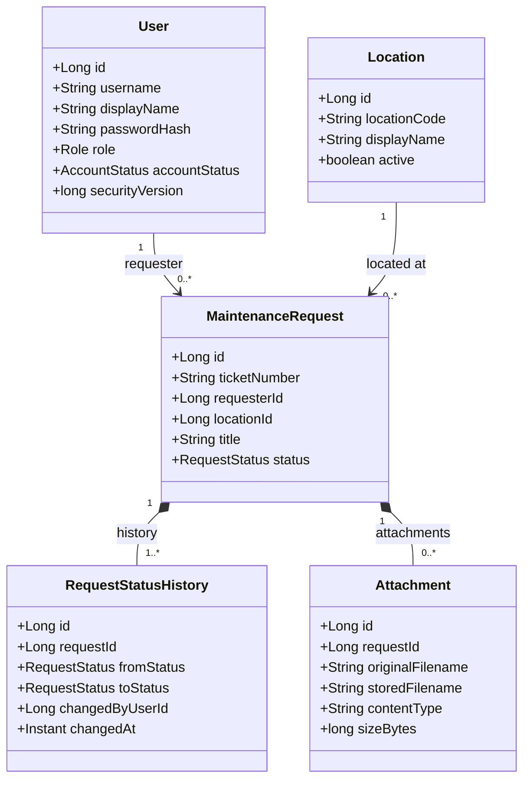
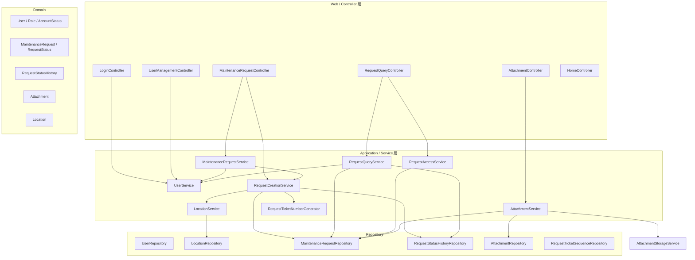
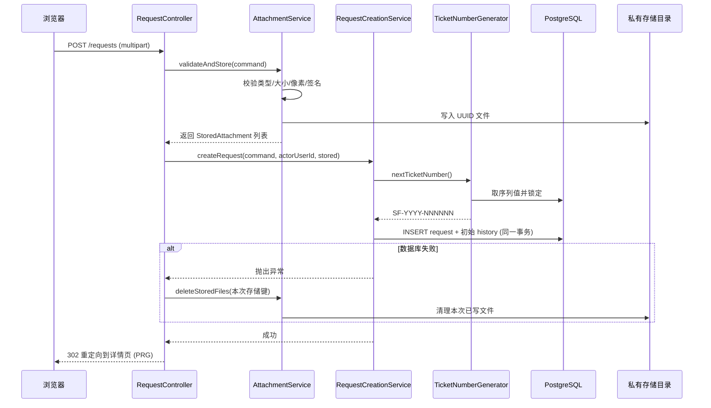
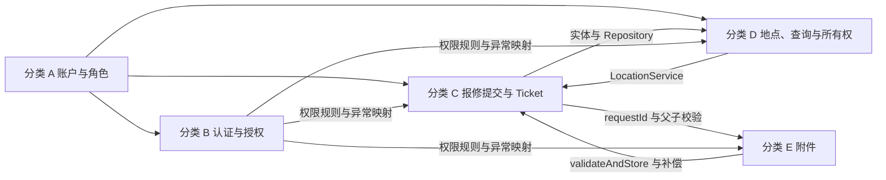
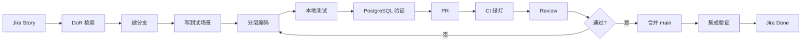

# SmartFix Sprint 2 开发规划 · 编码规范 · 工作分类与推进顺序 · 验收手册

[English version](SmartFix_Sprint2_Development_Plan_EN.md) | **简体中文**

> **文档状态：规划稿（Planning Draft）——尚未执行。**
> 本文档描述的是 **Sprint 2 将要做什么**，不是已经完成的功能。仓库当前仍然只有
> 初始架构脚手架；Sprint 2 的类、表、路由、测试 **都还不存在**。

> **⚠️ 需求文件缺失说明：** 规划者**没有收到**独立的 Sprint 2 需求 Markdown 文件
> （原提示词中引用的《粘贴的 markdown (1)。md(5)》内容为空，仓库内也不存在任何
> sprint/requirement 文件）。因此本文档的范围与类清单**以本次给出的 Sprint 2 规格为准**，
> 并结合仓库真实现状编写。**Sprint 2 正式启动前，必须与需求文件逐条对照校准**；
> 凡本文档与需求文件不一致之处，以需求文件为准，并按本文档 §29 的流程走变更。

---

## 目录

1. [文档定位与读者](#1-文档定位与读者)
2. [Sprint 2 统一目标](#2-sprint-2-统一目标)
3. [正式角色与权限边界](#3-正式角色与权限边界)
4. [明确不在 Sprint 2 开发的范围](#4-明确不在-sprint-2-开发的范围)
5. [必须统一的领域模型](#5-必须统一的领域模型)
6. [项目目录说明](#6-项目目录说明)
7. [统一分层规范](#7-统一分层规范)
8. [命名规范](#8-命名规范)
9. [完整类清单与负责分类](#9-完整类清单与负责分类)
10. [核心数据字典](#10-核心数据字典)
11. [建议输入限制](#11-建议输入限制)
12. [建议 Service 契约](#12-建议-service-契约)
13. [HTTP 路由与权限矩阵](#13-http-路由与权限矩阵)
14. [Ticket Number 设计](#14-ticket-number-设计)
15. [数据库迁移规划](#15-数据库迁移规划)
16. [附件安全与一致性](#16-附件安全与一致性)
17. [五个工作分类与推进顺序](#17-五个工作分类与推进顺序)
18. [共享文件与冲突管理](#18-共享文件与冲突管理)
19. [开发流程](#19-开发流程)
20. [两周执行计划](#20-两周执行计划)
21. [测试规划与验收用例](#21-测试规划与验收用例)
22. [DevSecOps 与安全检查](#22-devsecops-与安全检查)
23. [本地环境与配置](#23-本地环境与配置)
24. [Git 与 PR 规范](#24-git-与-pr-规范)
25. [Definition of Ready (DoR)](#25-definition-of-ready-dor)
26. [Definition of Done (DoD)](#26-definition-of-done-dod)
27. [Demo 脚本](#27-demo-脚本)
28. [风险清单](#28-风险清单)
29. [Day 1 决策表](#29-day-1-决策表)
30. [可复制模板](#30-可复制模板)
31. [状态标记约定与仓库现状对照](#31-状态标记约定与仓库现状对照)

---

## 1. 文档定位与读者

**这是什么：** 一份可以直接指导五名组员进入编码阶段的 Sprint 2 完整规划——包含目标、范围、
类设计、数据字典、接口契约、路由权限、测试、工作分类与推进顺序、流程、验收与风险。

**读者是谁：** 五名准备开始编码，但对类名、包路径、接口、数据库、Git、测试和协作方式
还不完全清楚的组员。读完 §17 就能知道从哪里开始、按什么顺序推进。

**它回答的问题：** Sprint 2 做什么、为什么只做这些、不做什么、分成哪五个工作分类、建哪些类、类放哪、
类之间怎么调、哪些类共享、谁的维护责任、各层职责如何划分、User/Authentication/Location/Request/Attachment
如何集成、表怎么设计、migration 怎么编号、路由权限所有权怎么设计、图片上传如何安全、
文件成功但数据库失败怎么办、写哪些测试、Jenkins 检查什么、何时算 Done、两周每天做什么、
如何 Demo、还有哪些风险、Sprint 3 如何接续。

### 1.1 状态标记约定

本文档对所有条目使用三种标记，**请严格遵守，不要把计划当成已完成**：

| 标记 | 含义 |
|---|---|
| **【现状】** | 当前仓库**已经存在**的东西（可核对代码） |
| **【S2 新增】** | Sprint 2 **计划新增**（现在还不存在） |
| **【后续 Sprint】** | Sprint 3/4 才做，Sprint 2 **明确不做** |
| **【待 Day 1 确认】** | 建议基线，需 Day 1 团队确认后冻结（可能写成 ADR） |

### 1.2 本 Sprint 的产出物边界

本文档**只做规划**。规划本身**不产出任何代码、migration、配置修改**。Sprint 2 的真正产出是
§17 中五个工作分类对应的代码与测试。

---

## 2. Sprint 2 统一目标

### 2.1 Sprint Goal（唯一，不得扩张）

> **让一名报修用户完成从登录到「看到自己的报修记录」的最小闭环。**

```text
Requester 登录
   ↓
提交报修（可带图片）
   ↓
系统生成唯一 Ticket Number
   ↓
初始状态置为 SUBMITTED
   ↓
系统写入初始 RequestStatusHistory
   ↓
Requester 查看自己的报修列表
   ↓
Requester 查看自己的报修详情、附件与状态历史
```

### 2.2 闭环之外但属于 Sprint 2 的附带范围

1. **Administrator 管理账户与角色**（创建用户、改角色、改账户状态）。
2. **Administrator 可以按 Ticket Number 只读代查报修**（read-only lookup）。
3. **Administrator 不能代替 Requester 提交报修**（无提交入口、服务端也拒绝）。
4. **Technician 只能登录并进入受控占位首页**（placeholder），本轮不处理工单。
5. **Requester 只能查看自己的请求与附件**（ownership 强制）。
6. **未登录、错误角色、非所有者访问必须被拒绝**（401/403/404 语义见 §13）。

### 2.3 为什么只做这个范围

- 这是**第一个真正端到端贯通**的切片：安全（登录/角色/所有权）+ 持久化（Flyway 真实建表）
  + 领域建模（聚合根与状态历史）+ 文件（上传安全与补偿）+ 测试与 CI。
- 它把**所有高风险工程机制**一次性建立起来（迁移纪律、权限矩阵、上传安全、集成测试），
  这些机制一旦立住，Sprint 3 的业务功能就是在稳定地基上堆东西。
- 它故意**不碰**审核、派单、SLA 等规则密集的部分——那些需要更完整的 Analysis & Design。

### 2.4 Sprint 2 成功的最小判据

Sprint 2 结束时，任何人都能在 `main` 上跑起来并演示 §27 的 Demo 脚本，且：

- 数据库结构 100% 来自 Flyway migration；
- 未登录/越权/非所有者访问全部被正确拒绝；
- 报修提交失败时**不会**留下“数据库有记录但文件缺失”或“文件残留但数据库无记录”的状态；
- `mvn clean verify` 在本地与 Jenkins 均为绿。

---

## 3. 正式角色与权限边界

### 3.1 正式角色只有三个

```text
REQUESTER
TECHNICIAN
ADMINISTRATOR
```

**不要自行加入 `FACILITY_OFFICER`。**

### 3.2 角色相关规则

1. 以后若真要加入 `FACILITY_OFFICER`，**必须先作为需求变更**提出并获批。
2. 需求变更必须**同步**修改：`Role` 枚举、权限矩阵、架构模型、测试、页面、文档——缺一不可。
3. **`AccountStatus` 不是角色**。`AccountStatus` 表示账户是否可用（如 `ACTIVE` / `DISABLED`），
   与“这名用户是什么角色”是两件正交的事。
4. **一名用户本轮只拥有一个 Role**（不做多角色/角色集合），这是 Sprint 2 的有意简化。
5. **Administrator 的“代查”是只读访问**：只读查看报修详情，**不代表**可以代提交、审批、
   改状态、派单。这三件事在 Sprint 2 一律不做，服务端必须拒绝而不是只藏按钮。

### 3.3 权限边界一句话总结

| 能力 | REQUESTER | TECHNICIAN | ADMINISTRATOR |
|---|---|---|---|
| 登录、登出 | ✅ | ✅ | ✅ |
| 受控占位首页 | ✅ | ✅ | ✅ |
| 提交报修 | ✅ | ❌ | ❌（明确禁止代提交） |
| 查看我的报修列表/详情/附件 | ✅（仅自己） | ❌ | ❌ |
| 按 Ticket Number 只读代查 | ❌ | ❌ | ✅（只读） |
| 用户与角色管理 | ❌ | ❌ | ✅ |

---

## 4. 明确不在 Sprint 2 开发的范围

以下内容 **Sprint 2 一律不做**（不要顺手实现，也不要预留半成品代码）：

| # | 不做的事 | 为什么推迟 | 预计 |
|---|---|---|---|
| 1 | 管理员审核与完整分类工作流 | 需要完整的用例与时序设计；状态规则未定 | Sprint 3 |
| 2 | `WorkOrder`（工单） | 依赖派单模型先确定 | Sprint 3 |
| 3 | 派单、改派、技术员接单 | 需要匹配与派单规则分析 | Sprint 3 |
| 4 | Strategy Pattern 技术员匹配 | 变化点尚未被证明，提前抽象违反 §44 原则 | Sprint 3/4 |
| 5 | 维修状态更新（进行中/完成） | 依赖工单模型 | Sprint 3 |
| 6 | 完成确认 | 关单权归属仍是开放问题 | Sprint 3 |
| 7 | 重开（reopen） | 需要状态机规则 | Sprint 3 |
| 8 | Feedback（反馈） | 依赖完成确认 | Sprint 3/4 |
| 9 | SLA | 需要策略与调度设计 | Sprint 4 |
| 10 | 邮件与站内通知 | 需要通知基础设施与事件设计 | Sprint 4 |
| 11 | 地图 API | 依赖设施/位置模型成熟 | Sprint 4 |
| 12 | 实时更新 | 非最小闭环所需 | 不做/后议 |
| 13 | 微服务 | 架构决定：单体内模块化（README §6） | 不做 |
| 14 | Kubernetes | 运维复杂度超出项目需要 | 不做 |
| 15 | 生产部署 | 本课程交付为可运行系统，非生产上线 | 不做 |
| 16 | JWT | 本轮用服务端 Session；JWT 无必要收益 | 不做 |
| 17 | 公开注册 | 账户由管理员创建，避免开放注册面 | 后议 |
| 18 | 密码找回 | 需要邮件通道，依赖 #10 | Sprint 4 |
| 19 | NUS SSO | 尚未确认是否真需要 | 待确认 |

**为什么必须写清楚“不做”：** 五人两周的产能有限；范围膨胀是学生项目最常见的失败原因。
把“不做”显式写下来，才能在 Code Review 中说清楚“这个实现超出范围”。

---

## 5. 必须统一的领域模型

### 5.1 正式核心对象（全队唯一命名）

```text
User · Role · AccountStatus · Location · MaintenanceRequest
RequestStatus · RequestStatusHistory · UrgencyLevel
MaintenanceCategory · Attachment
```

### 5.2 唯一名称（禁止同义词）

| 正式名称 | 禁止使用的近义名 | 理由 |
|---|---|---|
| `RequestStatusHistory` | `StatusHistory`、`RequestHistory` | 全队唯一名称，避免同一概念两套表 |
| `MaintenanceRequest` | `Request`、`IssueRequest` | `Request` 与 HTTP request 混淆 |
| `WorkOrder`（后续 Sprint） | `MaintenanceWorkOrder` | 保持简短唯一 |
| `MaintenanceRecord`（后续 Sprint） | `RepairRecord` | 同上 |
| `urgencyLevel` | `urgency`、`priority`、`priorityLevel` | 一个概念只能一个名字 |
| `User` | 小写 `user` 作为类型名 | 避免与关键字/变量混淆 |

### 5.3 核心领域类图



### 5.4 领域规则（必须遵守）

1. **`MaintenanceRequest` 是报修聚合根**：提交、状态、附件都以它为中心。
2. **`Attachment` 与 `RequestStatusHistory` 属于 `MaintenanceRequest`**（组合关系）：
   它们没有独立生命周期，离开报修没有意义。
3. **`RequestStatus` 必须是 `enum`**（不是字符串常量散落各处，也不是独立表）。
4. **Sprint 2 只实现 `SUBMITTED`** 一个状态；其余状态枚举值可先在枚举中占位但**不得有流转逻辑**。
5. **附件在数据库只保存元数据**（文件名、类型、大小、时间、存储键），文件本体在磁盘。
6. **文件使用 UUID 存储名**，绝不使用用户原始文件名的路径。
7. **不使用用户原始文件名作为路径**（防路径穿越，见 §16）。
8. **跨模块关系通过标量 ID + 数据库外键连接**（`requesterId`、`locationId`），
   不在模块之间建立 JPA 对象关联。
9. **不在 `User` 上建立大型双向报修集合**（避免加载用户即拖出全部报修、避免双向维护）。
10. **不使用危险级联删除删除历史请求**：历史与附件的外键**不允许 `ON DELETE CASCADE` 删除请求**，
    审计类数据必须保留。

### 5.5 模块依赖图（Sprint 2 目标形态）



**图中要点：** Service 只通过**对方模块的 Service** 拿数据（`MRS → US`、`RCS → LS`），
**没有任何跨模块的 Repository 直连**（见 §7.3）。

---

## 6. 项目目录说明

### 6.1 四个根目录各自放什么

| 目录 | 放什么 | 绝对不能放什么 |
|---|---|---|
| `src/main/java` | 正式 Java 源代码（按业务模块分包） | 测试代码、生成物 |
| `src/main/resources` | 配置（`application*.yml`）、Thymeleaf 模板（`templates/`）、公共静态资源（`static/`）、Flyway SQL（`db/migration/`） | 用户上传的文件、真实密码 |
| `src/test/java` | 测试代码（`*Test`、`*IT`） | 正式业务代码 |
| `src/test/resources` | 测试专用配置（`application-test.yml`）、**合成的**测试用图片等文件 | 真实用户数据、真实凭据 |

### 6.2 关键规则

1. `main/resources/static` **只放公共 CSS、JS 和系统自带静态图片**（如 logo、样式图）。
2. **用户上传的图片绝对不能放进 `static`**：`static` 是类路径资源，会被当作公开资源直接提供，
   既无法做授权，也会随构建打进 JAR。
3. **正式代码不能依赖 `test` 目录**（`main` 不得 import `test` 下的任何类）。
4. **用户文件不能写入 JAR 或 `resources`**：运行时写入 `resources` 会失败或丢失；
   用户文件必须写入**外部可配置的私有目录**（`SMARTFIX_UPLOAD_DIR`，见 §23）。

### 6.3 保留“业务模块优先”的目录结构

```text
com.smartfix.user
com.smartfix.auth
com.smartfix.facility
com.smartfix.request
com.smartfix.common
```

模块内部按需分层（**需要哪层才建哪层，不提前建空包**）：

```text
controller     # Web 入口
service        # 用例编排、事务、权限
domain         # 实体与枚举
repository     # 持久化
dto            # 边界数据传递
config         # 该模块的配置
validation     # 该模块的校验器
storage        # 该模块的存储实现（request 模块的附件存储）
```

---

## 7. 统一分层规范

### 7.1 各层职责与禁止事项

| 层 | 负责 | 禁止 |
|---|---|---|
| **Controller** | HTTP 请求处理、表单绑定、DTO 校验、调用 Service、返回视图 | 直接调用 Repository；编写 SQL；承担事务流程；写业务规则 |
| **Service** | 用例编排、业务校验、权限判断、事务、跨组件协作 | 拼接 HTML；把 JPA Entity 直接返回给页面 |
| **Domain** | 实体、枚举、领域状态与规则 | 依赖 `MultipartFile`、`HttpServletRequest`、Controller |
| **Repository** | 持久化与数据库查询 | 处理页面；处理上传流程；编排跨模块用例 |
| **DTO** | 边界数据传递（输入 Command / 输出 Response） | 直接把 Entity 当 DTO 使用 |
| **Config** | 配置类与配置属性绑定 | 业务逻辑 |
| **Validation** | 上传等专项校验器 | 数据库访问 |
| **Storage** | 文件存储的具体实现 | 业务规则、页面逻辑 |

### 7.2 运行时依赖方向

```text
Controller → Service → Repository / Domain
```

### 7.3 跨模块调用规则

**允许（推荐）：**

```text
auth    → UserService
request → UserService
request → LocationService
```

**禁止：**

```text
auth    → UserRepository
request → LocationRepository
Controller → Repository          （任何情况下都不允许）
```

**理由：** Repository 是模块的内部实现细节。跨模块直连 Repository 会让模块边界失效，
最终退化成“大泥球”（见 [`docs/architecture.md`](../architecture.md) 与
[`docs/module-guide.md`](../module-guide.md)）。

### 7.4 提交请求的时序（Sprint 2 主链路）



---

## 8. 命名规范

### 8.1 完整命名规范表

| # | 对象 | 规则 | 正确示例 | 错误示例 |
|---|---|---|---|---|
| 1 | 包名 | 全小写英文 | `com.smartfix.request.service` | `com.smartfix.Request.Service` |
| 2 | Java 类名 | PascalCase | `MaintenanceRequestService` | `maintenanceRequestService` |
| 3 | Entity | PascalCase 单数 | `MaintenanceRequest` | `MaintenanceRequests` |
| 4 | Enum | PascalCase 单数 | `RequestStatus` | `RequestStatuses` |
| 5 | Enum 值 | UPPER_SNAKE_CASE | `SUBMITTED` | `Submitted` |
| 6 | Command（输入 DTO） | 动作＋业务对象＋`Command` | `SubmitMaintenanceRequestCommand` | `RequestForm` |
| 7 | Response（输出 DTO） | 业务对象＋用途＋`Response` | `MaintenanceRequestSummaryResponse` | `RequestDTO` |
| 8 | Service | 业务对象＋`Service` | `RequestQueryService` | `RequestManager` |
| 9 | Repository | 实体＋`Repository` | `MaintenanceRequestRepository` | `RequestDao` |
| 10 | Controller | 业务对象＋`Controller` | `UserManagementController` | `AdminServlet` |
| 11 | 方法 | lowerCamelCase，动词开头 | `requireReadableRequest` | `check()` |
| 12 | 字段 | lowerCamelCase | `urgencyLevel` | `Urgency_Level` |
| 13 | 常量 | UPPER_SNAKE_CASE | `MAX_ATTACHMENTS` | `maxAttachments` |
| 14 | 数据库表 | lower_snake_case 复数 | `maintenance_requests` | `MaintenanceRequest` |
| 15 | 数据库列 | lower_snake_case | `ticket_number` | `ticketNumber` |
| 16 | URL | 小写、复数、kebab-case | `/requests/mine` | `/getMyRequest` |
| 17 | Thymeleaf 模板 | kebab-case | `request-details.html` | `requestDetails.html` |
| 18 | 配置项 | kebab-case 层级 | `smartfix.attachment.max-count` | `smartfix_attachmentMaxCount` |
| 19 | 环境变量 | UPPER_SNAKE_CASE | `SMARTFIX_UPLOAD_DIR` | `smartfix.upload.dir` |
| 20 | Unit Test | 被测类＋`Test` | `AttachmentValidatorTest` | `TestAttachment` |
| 21 | Integration Test | 被测用例＋`IT` | `MaintenanceRequestFlowIT` | `IntegrationTest1` |
| 22 | Git 分支 | `feature/SCRUM-编号-短描述` | `feature/SCRUM-52-request-submission` | `mybranch` |
| 23 | Flyway migration | `V数字__snake_case_description.sql` | `V4__create_maintenance_requests.sql` | `v4-CreateRequests.sql` |
| 24 | Git Commit | `类型(模块): 具体动作 Jira-Key` | `feat(request): add submission validation SCRUM-52` | `update` |

### 8.2 接口与实现：不要机械套模板

1. **不要机械创建 `IUserService` 和 `UserServiceImpl`。** 只有一个实现、没有替换需求时，
   接口只是噪音。直接写 `@Service public class UserService`。
2. **只有存在多个实现，或需要替换外部依赖时才建立接口。**
3. **附件存储使用 `AttachmentStorageService` 接口是合理的**：因为需要隔离“磁盘实现”
   与“测试替身（test double）”——测试时不希望真的写磁盘。
   实现类命名为 `LocalAttachmentStorageService`。
4. **同一个业务概念只能存在一个正式名称**（见 §5.2）。
5. **新类型应登记在 `docs/sprint2/class-catalog.md`**（Sprint 2 期间建立的类登记表；
   由各分类在新增类时补一行）。

---

## 9. 完整类清单与负责分类

> **图例：** 【现状】= 仓库已有；【S2 新增】= Sprint 2 计划新增。
> **负责分类：** A = 账户与角色 · B = 认证与授权 · C = 报修提交与 Ticket · D = 地点、查询与所有权 · E = 附件（见 §17）。
> **本章只标“哪个分类负责”，不指定人。** 谁认领哪个分类由团队在 Jira 上决定并在站会上同步；
> 一个人可以认领多个分类，也可以中途换手。

### 9.1 `user` 模块（负责分类：A 账户与角色）

| 包名 | 类名 | 职责 | 调用方 | 状态 |
|---|---|---|---|---|
| `com.smartfix.user.domain` | `User` | 用户实体（账号、角色、状态、安全版本号） | 各 Service/Repository | 【S2 新增】 |
| `com.smartfix.user.domain` | `Role` | 三个正式角色枚举 | 权限判断、模板 | 【现状】`src/main/java/com/smartfix/user/domain/Role.java`，**修改现有类**（保持三值不变） |
| `com.smartfix.user.domain` | `AccountStatus` | 账户状态枚举（`ACTIVE`/`DISABLED`） | `ActiveAccountFilter`、管理页 | 【S2 新增】 |
| `com.smartfix.user.repository` | `UserRepository` | 用户持久化查询 | `UserService` | 【S2 新增】 |
| `com.smartfix.user.service` | `UserService` | 账号创建/角色/状态/查询/认证数据读取 | `UserManagementController`、`SmartFixUserDetailsService`、`MaintenanceRequestService`、`RequestQueryService` | 【S2 新增】 |
| `com.smartfix.user.service` | `UserBootstrapService` | 首次启动创建引导管理员（幂等） | `BootstrapAdminInitializer` | 【S2 新增】 |
| `com.smartfix.user.controller` | `UserManagementController` | 管理员用户管理页面与表单 | 浏览器（ADMIN） | 【S2 新增】 |
| `com.smartfix.user.dto` | `CreateUserCommand` | 创建用户表单 | `UserManagementController` | 【S2 新增】 |
| `com.smartfix.user.dto` | `ChangeUserRoleCommand` | 改角色表单 | `UserManagementController` | 【S2 新增】 |
| `com.smartfix.user.dto` | `ChangeAccountStatusCommand` | 改账户状态表单 | `UserManagementController` | 【S2 新增】 |
| `com.smartfix.user.dto` | `UserSummaryResponse` | 用户列表行 | 用户管理页 | 【S2 新增】 |
| `com.smartfix.user.dto` | `UserAccessResponse` | 供其他模块使用的“访问上下文” | `RequestAccessService` | 【S2 新增】 |
| `com.smartfix.user.dto` | `UserAuthenticationData` | 供 `auth` 模块认证所需的数据（用户名、哈希、角色、状态、安全版本） | `SmartFixUserDetailsService` | 【S2 新增】 |
| `com.smartfix.user.config` | `PasswordConfig` | 暴露 `PasswordEncoder`（BCrypt） | Spring 容器 | 【S2 新增】 |
| `com.smartfix.user.config` | `BootstrapAdminProperties` | 引导管理员配置属性绑定 | `UserBootstrapService` | 【S2 新增】 |
| `com.smartfix.user.config` | `BootstrapAdminInitializer` | 启动钩子，触发引导逻辑 | Spring 启动 | 【S2 新增】 |

### 9.2 `auth` 模块（负责分类：B 认证与授权）

| 包名 | 类名 | 职责 | 调用方 | 状态 |
|---|---|---|---|---|
| `com.smartfix.auth.config` | `SecurityConfig` | 认证、授权、CSRF、会话规则 | Spring Security | 【现状】`src/main/java/com/smartfix/auth/config/SecurityConfig.java`，**修改现有类**（用真实规则替换 permit-all） |
| `com.smartfix.auth.service` | `SmartFixUserDetailsService` | 从 `UserService` 加载认证数据 | Spring Security | 【S2 新增】 |
| `com.smartfix.auth.security` | `SmartFixUserDetails` | 自定义 `UserDetails`（携带 `userId`、`role`、`securityVersion`） | `SmartFixUserDetailsService` | 【S2 新增】 |
| `com.smartfix.auth.security` | `ActiveAccountFilter` | 每请求校验账户仍启用、安全版本未失效 | Servlet 过滤器链 | 【S2 新增】 |
| `com.smartfix.auth.controller` | `LoginController` | 登录页与登出 | 浏览器 | 【S2 新增】 |

### 9.3 `facility` 模块（负责分类：D 地点、查询与所有权）

| 包名 | 类名 | 职责 | 调用方 | 状态 |
|---|---|---|---|---|
| `com.smartfix.facility.domain` | `Location` | 设施地点实体 | `LocationService` | 【S2 新增】 |
| `com.smartfix.facility.repository` | `LocationRepository` | 地点查询 | `LocationService` | 【S2 新增】 |
| `com.smartfix.facility.service` | `LocationService` | 可用地点列表、读取、校验 | `RequestCreationService`、表单页 | 【S2 新增】 |
| `com.smartfix.facility.dto` | `LocationResponse` | 地点下拉/展示数据 | 报修表单页 | 【S2 新增】 |

### 9.4 `request` 模块 · domain（负责分类：C 报修提交与 Ticket）

| 包名 | 类名 | 职责 | 调用方 | 状态 |
|---|---|---|---|---|
| `com.smartfix.request.domain` | `MaintenanceRequest` | 报修聚合根 | 全部 request 服务 | 【S2 新增】 |
| `com.smartfix.request.domain` | `RequestStatus` | 状态枚举（Sprint 2 仅用 `SUBMITTED`） | 状态历史、页面 | 【S2 新增】 |
| `com.smartfix.request.domain` | `RequestStatusHistory` | 状态变更历史条目 | 详情页 | 【S2 新增】 |
| `com.smartfix.request.domain` | `UrgencyLevel` | 紧急程度枚举 | 表单、列表 | 【S2 新增】 |
| `com.smartfix.request.domain` | `MaintenanceCategory` | 故障类别枚举 | 表单、列表 | 【S2 新增】 |
| `com.smartfix.request.domain` | `Attachment` | 附件元数据实体 | 详情页、下载 | 【S2 新增】 |

### 9.5 `request` 模块 · repository（负责分类：C 报修提交与 Ticket）

| 包名 | 类名 | 职责 | 调用方 | 状态 |
|---|---|---|---|---|
| `com.smartfix.request.repository` | `MaintenanceRequestRepository` | 报修持久化与查询 | `RequestCreationService`、`RequestQueryService`、`RequestAccessService`、`AttachmentService` | 【S2 新增】 |
| `com.smartfix.request.repository` | `RequestStatusHistoryRepository` | 历史条目持久化与按请求查询 | `RequestCreationService`、`RequestQueryService` | 【S2 新增】 |
| `com.smartfix.request.repository` | `RequestTicketSequenceRepository` | 序列值获取与锁定 | `RequestTicketNumberGenerator` | 【S2 新增】 |
| `com.smartfix.request.repository` | `AttachmentRepository` | 附件元数据持久化与按请求查询 | `AttachmentService` | 【S2 新增】 |

### 9.6 `request` 模块 · application（负责分类：C 为主，见下表“负责分类”列）

| 包名 | 类名 | 职责 | 调用方 | 负责分类 | 状态 |
|---|---|---|---|---|---|
| `com.smartfix.request.controller` | `MaintenanceRequestController` | `/requests/new`、`POST /requests` | 浏览器（REQUESTER） | C | 【S2 新增】 |
| `com.smartfix.request.controller` | `RequestQueryController` | `/requests/mine`、`/requests/{ticketNumber}` | 浏览器（REQUESTER/ADMIN 只读） | D | 【S2 新增】 |
| `com.smartfix.request.controller` | `AttachmentController` | 附件下载 | 浏览器（授权用户） | E | 【S2 新增】 |
| `com.smartfix.request.service` | `MaintenanceRequestService` | 报修页面用例入口（表单准备、提交编排） | `MaintenanceRequestController` | C | 【S2 新增】 |
| `com.smartfix.request.service` | `RequestCreationService` | **独立 Bean**，负责报修创建事务（request + 初始 history） | `MaintenanceRequestService` | C | 【S2 新增】 |
| `com.smartfix.request.service` | `RequestTicketNumberGenerator` | 生成 `SF-YYYY-NNNNNN` | `RequestCreationService` | C | 【S2 新增】 |
| `com.smartfix.request.service` | `RequestQueryService` | 我的报修列表、详情组装 | `RequestQueryController` | D | 【S2 新增】 |
| `com.smartfix.request.service` | `RequestAccessService` | 统一角色与所有权判定 | `RequestQueryService`、`AttachmentService` | D | 【S2 新增】 |
| `com.smartfix.request.service` | `AttachmentService` | 校验并存储、读取、清理 | `MaintenanceRequestController`、`AttachmentController` | E | 【S2 新增】 |
| `com.smartfix.request.service` | `AttachmentStorageService` | **接口**：文件存储抽象 | `AttachmentService` | E | 【S2 新增】 |
| `com.smartfix.request.storage` | `LocalAttachmentStorageService` | 本地磁盘实现（UUID 名、私有目录） | Spring 容器注入 | E | 【S2 新增】 |
| `com.smartfix.request.validation` | `AttachmentValidator` | 类型/大小/像素/签名校验 | `AttachmentService` | E | 【S2 新增】 |
| `com.smartfix.request.config` | `AttachmentProperties` | 附件限制配置绑定 | `AttachmentValidator` | E | 【S2 新增】 |

### 9.7 `request` 模块 · DTO

| 包名 | 类名 | 职责 | 负责分类 | 状态 |
|---|---|---|---|---|
| `com.smartfix.request.dto` | `SubmitMaintenanceRequestCommand` | 提交报修表单输入 | C | 【S2 新增】 |
| `com.smartfix.request.dto` | `MaintenanceRequestSubmissionResponse` | 提交结果（含 ticketNumber） | C | 【S2 新增】 |
| `com.smartfix.request.dto` | `MaintenanceRequestSummaryResponse` | 列表行 | D | 【S2 新增】 |
| `com.smartfix.request.dto` | `MaintenanceRequestDetailsResponse` | 详情 | D | 【S2 新增】 |
| `com.smartfix.request.dto` | `RequestStatusHistoryResponse` | 历史条目展示 | D | 【S2 新增】 |
| `com.smartfix.request.dto` | `AttachmentResponse` | 附件展示（**不含 `storedFilename`**） | E | 【S2 新增】 |
| `com.smartfix.request.dto` | `UploadAttachmentCommand` | 上传输入（**不含磁盘路径**） | E | 【S2 新增】 |
| `com.smartfix.request.dto` | `StoredAttachment` | 存储结果（存储键、大小、类型） | E | 【S2 新增】 |

### 9.8 `common` 模块（协调分类：B 认证与授权）

| 包名 | 类名 | 职责 | 状态 |
|---|---|---|---|
| `com.smartfix.common.web` | `HomeController` | 首页与受控占位首页 | 【现状】`src/main/java/com/smartfix/common/web/HomeController.java`，**修改现有类** |
| `com.smartfix.common.exception` | `GlobalExceptionHandler` | 统一异常到页面/状态码映射 | 【S2 新增】 |
| `com.smartfix.common.exception` | `ResourceNotFoundException` | 资源不存在（→404） | 【S2 新增】 |
| `com.smartfix.common.exception` | `BusinessConflictException` | 业务冲突（→409） | 【S2 新增】 |
| `com.smartfix.common.exception` | `InputValidationException` | 输入校验失败（→400） | 【S2 新增】 |
| `com.smartfix.common.configuration` | `TimeConfig` | 注入 `Clock`（Asia/Singapore 展示、UTC 存储） | 【S2 新增】 |

**说明：** 若仓库检查发现某个类名不适合当前代码结构（例如 `common.web.HomeController` 承担了
占位首页职责后语义变化），可以提出调整，但**必须说明原因并统一唯一名称**，不得出现两套叫法。

---

## 10. 核心数据字典

### 10.0 全局类型约定

| 约定 | 规则 |
|---|---|
| `Long` ↔ `BIGINT` | Java `Long` 对应 PostgreSQL `BIGINT` |
| `Instant` ↔ `TIMESTAMPTZ` | Java `Instant` 对应 `TIMESTAMPTZ` |
| 枚举 | 数据库**存字符串**（`VARCHAR`），不用 ordinal |
| 时间 | **存 UTC**，**展示 Asia/Singapore** |
| 存储文件名 | **UUID** |
| 主键 | 统一 `BIGINT` 自增（`GENERATED BY DEFAULT AS IDENTITY`） |

### 10.1 `users` → `User`

| Java 字段 | Java 类型 | 数据库列 | 数据库类型 | 可空 | 唯一 | 默认 | 外键 | 校验 | 用途 | 客户端可提交 |
|---|---|---|---|---|---|---|---|---|---|---|
| `id` | `Long` | `id` | `BIGINT` | 否 | 是(PK) | identity | — | — | 主键 | ❌ |
| `username` | `String` | `username` | `VARCHAR(50)` | 否 | 是 | — | — | 3–50 字符；小写字母数字及 `.`/`_`/`-` | 登录名 | 仅管理员创建时 |
| `displayName` | `String` | `display_name` | `VARCHAR(100)` | 否 | 否 | — | — | 1–100 字符 | 展示名 | 仅管理员创建时 |
| `passwordHash` | `String` | `password_hash` | `VARCHAR(100)` | 否 | 否 | — | — | 写入前 BCrypt | 密码哈希（**永不回显**） | ❌（只收明文密码，立即哈希） |
| `role` | `Role` | `role` | `VARCHAR(20)` | 否 | 否 | — | — | 必须是三个正式角色之一 | 角色 | 仅管理员 |
| `accountStatus` | `AccountStatus` | `account_status` | `VARCHAR(20)` | 否 | 否 | `'ACTIVE'` | — | `ACTIVE`/`DISABLED` | 账户可用性 | 仅管理员 |
| `securityVersion` | `long` | `security_version` | `BIGINT` | 否 | 否 | `0` | — | ≥0 | 角色/状态变更时自增，使旧会话失效 | ❌ |
| `createdAt` | `Instant` | `created_at` | `TIMESTAMPTZ` | 否 | 否 | `now()` | — | — | 创建时间 | ❌ |
| `updatedAt` | `Instant` | `updated_at` | `TIMESTAMPTZ` | 否 | 否 | `now()` | — | — | 更新时间 | ❌ |

### 10.2 `locations` → `Location`

| Java 字段 | Java 类型 | 数据库列 | 数据库类型 | 可空 | 唯一 | 默认 | 外键 | 校验 | 用途 | 客户端可提交 |
|---|---|---|---|---|---|---|---|---|---|---|
| `id` | `Long` | `id` | `BIGINT` | 否 | 是(PK) | identity | — | — | 主键 | ❌ |
| `locationCode` | `String` | `location_code` | `VARCHAR(50)` | 否 | 是 | — | — | 1–50 字符 | 地点编码（业务标识） | ❌（Sprint 2 由迁移/种子数据提供） |
| `building` | `String` | `building` | `VARCHAR(100)` | 是 | 否 | — | — | ≤100 | 楼栋 | ❌ |
| `floor` | `String` | `floor` | `VARCHAR(20)` | 是 | 否 | — | — | ≤20 | 楼层 | ❌ |
| `room` | `String` | `room` | `VARCHAR(50)` | 是 | 否 | — | — | ≤50 | 房间 | ❌ |
| `displayName` | `String` | `display_name` | `VARCHAR(150)` | 否 | 否 | — | — | 1–150 | 展示名 | ❌ |
| `active` | `boolean` | `active` | `BOOLEAN` | 否 | 否 | `true` | — | — | 是否可用于新报修 | ❌ |

### 10.3 `maintenance_requests` → `MaintenanceRequest`

| Java 字段 | Java 类型 | 数据库列 | 数据库类型 | 可空 | 唯一 | 默认 | 外键 | 校验 | 用途 | 客户端可提交 |
|---|---|---|---|---|---|---|---|---|---|---|
| `id` | `Long` | `id` | `BIGINT` | 否 | 是(PK) | identity | — | — | 内部主键 | ❌ |
| `ticketNumber` | `String` | `ticket_number` | `VARCHAR(20)` | 否 | **是** | — | — | `SF-YYYY-NNNNNN` | 对外单号 | ❌（服务端生成） |
| `requesterId` | `Long` | `requester_id` | `BIGINT` | 否 | 否 | — | → `users(id)` | 必须等于当前登录用户 | 报修人 | **❌ 绝不接受表单值** |
| `locationId` | `Long` | `location_id` | `BIGINT` | 否 | 否 | — | → `locations(id)` | 必须是**启用**地点 | 故障地点 | ✅（下拉选择，服务端校验） |
| `title` | `String` | `title` | `VARCHAR(120)` | 否 | 否 | — | — | trim 后 1–120 | 标题 | ✅ |
| `description` | `String` | `description` | `VARCHAR(2000)` | 否 | 否 | — | — | trim 后 1–2000 | 描述 | ✅ |
| `category` | `MaintenanceCategory` | `category` | `VARCHAR(30)` | 否 | 否 | — | — | 枚举值之一 | 类别 | ✅ |
| `urgencyLevel` | `UrgencyLevel` | `urgency_level` | `VARCHAR(20)` | 否 | 否 | — | — | 枚举值之一 | 紧急程度 | ✅ |
| `status` | `RequestStatus` | `status` | `VARCHAR(20)` | 否 | 否 | `'SUBMITTED'` | — | Sprint 2 仅 `SUBMITTED` | 当前状态 | ❌ |
| `createdAt` | `Instant` | `created_at` | `TIMESTAMPTZ` | 否 | 否 | `now()` | — | — | 创建时间 | ❌ |
| `updatedAt` | `Instant` | `updated_at` | `TIMESTAMPTZ` | 否 | 否 | `now()` | — | — | 更新时间 | ❌ |

### 10.4 `request_status_history` → `RequestStatusHistory`

| Java 字段 | Java 类型 | 数据库列 | 数据库类型 | 可空 | 唯一 | 默认 | 外键 | 校验 | 用途 | 客户端可提交 |
|---|---|---|---|---|---|---|---|---|---|---|
| `id` | `Long` | `id` | `BIGINT` | 否 | 是(PK) | identity | — | — | 主键 | ❌ |
| `requestId` | `Long` | `request_id` | `BIGINT` | 否 | 否 | — | → `maintenance_requests(id)`（**不级联删除**） | 必须属于同一请求 | 所属报修 | ❌ |
| `fromStatus` | `RequestStatus` | `from_status` | `VARCHAR(20)` | **是** | 否 | `NULL` | — | 初始条目为 NULL | 变更前状态 | ❌ |
| `toStatus` | `RequestStatus` | `to_status` | `VARCHAR(20)` | 否 | 否 | — | — | 初始为 `SUBMITTED` | 变更后状态 | ❌ |
| `changedByUserId` | `Long` | `changed_by_user_id` | `BIGINT` | 否 | 否 | — | → `users(id)` | — | 操作人 | ❌ |
| `changedAt` | `Instant` | `changed_at` | `TIMESTAMPTZ` | 否 | 否 | `now()` | — | — | 变更时间 | ❌ |
| `comment` | `String` | `comment` | `VARCHAR(500)` | 是 | 否 | `NULL` | — | ≤500 | 备注（Sprint 2 可为空/固定文案） | ❌ |

### 10.5 `request_attachments` → `Attachment`

| Java 字段 | Java 类型 | 数据库列 | 数据库类型 | 可空 | 唯一 | 默认 | 外键 | 校验 | 用途 | 客户端可提交 |
|---|---|---|---|---|---|---|---|---|---|---|
| `id` | `Long` | `id` | `BIGINT` | 否 | 是(PK) | identity | — | — | 主键 | ❌ |
| `requestId` | `Long` | `request_id` | `BIGINT` | 否 | 否 | — | → `maintenance_requests(id)` | 必须属于同一请求 | 所属报修 | ❌ |
| `originalFilename` | `String` | `original_filename` | `VARCHAR(255)` | 否 | 否 | — | — | 清理后的展示名 | 原始文件名（**仅展示**） | ❌（服务端取自上传） |
| `storedFilename` | `String` | `stored_filename` | `VARCHAR(64)` | 否 | **是** | — | — | UUID | 磁盘存储键（**绝不返回给浏览器**） | ❌ |
| `contentType` | `String` | `content_type` | `VARCHAR(100)` | 否 | 否 | — | — | 服务端探测所得 | 内容类型 | ❌ |
| `sizeBytes` | `long` | `size_bytes` | `BIGINT` | 否 | 否 | — | — | >0 且 ≤上限 | 字节数 | ❌ |
| `uploadedAt` | `Instant` | `uploaded_at` | `TIMESTAMPTZ` | 否 | 否 | `now()` | — | — | 上传时间 | ❌ |

---

## 11. 建议输入限制

> **【待 Day 1 确认】** 以下数值是**建议基线**，需在 Day 1 形成 ADR 后冻结。
> **不得写成“已经被课程要求批准”。**

| 项目 | 建议基线 | 备注 |
|---|---|---|
| `username` | 3–50 位 | 唯一；重复 → 409 |
| `displayName` | 1–100 字符 | trim 后校验 |
| `password` | 至少 12 字符，UTF-8 不超过 72 字节 | 上限来自 BCrypt 的 72 字节限制 |
| `title` | trim 后 1–120 字符 | |
| `description` | trim 后 1–2000 字符 | |
| `category` | `ELECTRICAL`、`PLUMBING`、`HVAC`、`BUILDING`、`OTHER` | 枚举紧集 |
| `urgencyLevel` | `LOW`、`MEDIUM`、`HIGH` | 枚举紧集 |
| 附件数量 | 0–3 张 | 图片**可选**（见 §29 决策表） |
| 单张大小 | ≤ 5 MiB | |
| 合计大小 | ≤ 15 MiB | |
| 格式 | PNG、JPEG | 以**实际解码结果**为准，不只看扩展名 |
| 单边像素 | ≤ 10000 px | |
| 总像素 | ≤ 2000 万 | |
| 列表分页 | 默认 20，最大 100 | `page`/`size` 参数需夹取 |
| Session 空闲超时 | 30 分钟 | |

---

## 12. 建议 Service 契约

> **统一原则（先读）：**
> 1. **`actorUserId` 必须来自受信任的登录主体**（`SmartFixUserDetails`），
>    **绝不从表单或隐藏字段接受 `requesterId`**。
> 2. **`RequestCreationService` 用独立 Spring Bean 提供数据库事务**（自调用不生效，见 §12.7）。
> 3. **`RequestAccessService` 统一处理角色与所有权判定**（不要在多个地方各自判断）。
> 4. **上传 DTO 不应向浏览器暴露磁盘路径**。
> 5. **`AttachmentResponse` 不包含 `storedFilename`**。

### 12.1 `UserService`

```java
Long createUser(CreateUserCommand command, Long actorUserId);
void changeRole(Long userId, ChangeUserRoleCommand command, Long actorUserId);
void changeAccountStatus(Long userId, ChangeAccountStatusCommand command, Long actorUserId);
List<UserSummaryResponse> listUsers();
UserAuthenticationData findAuthenticationByUsername(String username);
UserAccessResponse getUserAccess(Long userId);
```

| 方法 | 输入 | 输出 | 异常 | 事务 | 调用方 |
|---|---|---|---|---|---|
| `createUser` | 创建表单＋操作人 | 新用户 `id` | 重复用户名 → `BusinessConflictException`；密码不合规 → `InputValidationException` | 是（写） | `UserManagementController` |
| `changeRole` | 目标用户、新角色、操作人 | — | 用户不存在 → `ResourceNotFoundException`；**不允许停用/降级最后一名管理员** | 是（写） | `UserManagementController` |
| `changeAccountStatus` | 目标用户、新状态、操作人 | — | 同上；**不允许停用最后一名管理员** | 是（写） | `UserManagementController` |
| `listUsers` | — | 用户摘要列表 | — | 只读 | `UserManagementController` |
| `findAuthenticationByUsername` | 用户名 | 认证数据（哈希、角色、状态、安全版本） | 未找到 → 返回空/抛受控异常（由 `auth` 转成认证失败） | 只读 | `SmartFixUserDetailsService` |
| `getUserAccess` | 用户 id | 访问上下文（角色、状态、安全版本） | 用户不存在 → `ResourceNotFoundException` | 只读 | `RequestAccessService` |

> **注意：** 角色或状态变更必须**自增 `securityVersion`**，使该用户已存在的旧会话在
> `ActiveAccountFilter` 处失效（对应 AC09/AC16）。

### 12.2 `LocationService`

```java
List<LocationResponse> listActiveLocations();
LocationResponse getLocation(Long locationId);
Location requireActiveLocation(Long locationId);
```

| 方法 | 输入 | 输出 | 异常 | 事务 | 调用方 |
|---|---|---|---|---|---|
| `listActiveLocations` | — | 启用地点列表 | — | 只读 | 报修表单页（`MaintenanceRequestService`） |
| `getLocation` | 地点 id | 地点数据 | 不存在 → `ResourceNotFoundException` | 只读 | 详情页 |
| `requireActiveLocation` | 地点 id | 领域对象 | 不存在/已停用 → `InputValidationException` | 只读 | `RequestCreationService` |

### 12.3 `MaintenanceRequestService`

```java
MaintenanceRequestSubmissionResponse submitRequest(
        SubmitMaintenanceRequestCommand command,
        List<MultipartFile> files,
        Long actorUserId);
```

| 输入 | 输出 | 异常 | 事务 | 调用方 |
|---|---|---|---|---|
| 表单 + 文件 + 登录用户 id | 提交结果（含 `ticketNumber`） | 校验失败 → `InputValidationException`；文件问题 → 见 §16；数据库失败 → 向上抛并由 Controller 走补偿清理 | **本方法本身不开启事务**（事务在 `RequestCreationService`） | `MaintenanceRequestController` |

**职责：** 准备表单选项（地点、类别、紧急程度）＋编排“先存文件、再建数据库记录、失败则清理”的流程。

### 12.4 `RequestQueryService`

```java
List<MaintenanceRequestSummaryResponse> listMyRequests(Long actorUserId, int page, int size);
MaintenanceRequestDetailsResponse getRequestDetails(String ticketNumber, Long actorUserId);
```

| 方法 | 输入 | 输出 | 异常 | 事务 | 调用方 |
|---|---|---|---|---|---|
| `listMyRequests` | 登录用户 id、分页 | 我的报修列表（**仅本人**） | — | 只读 | `RequestQueryController` |
| `getRequestDetails` | ticketNumber、登录用户 id | 详情（含附件与状态历史） | 不可读 → `ResourceNotFoundException`（**不用 403**，见 §13.4） | 只读 | `RequestQueryController` |

### 12.5 `RequestAccessService`

```java
MaintenanceRequest requireReadableRequest(String ticketNumber, Long actorUserId);
```

| 输入 | 输出 | 异常 | 事务 | 调用方 |
|---|---|---|---|---|
| ticketNumber、登录用户 id | 可读的报修聚合 | 不存在、非本人、角色不允许 → `ResourceNotFoundException` | 只读 | `RequestQueryService`、`AttachmentService`（下载授权） |

**统一判定规则：**

```text
ADMINISTRATOR → 允许只读（代查）
REQUESTER     → 仅当 request.requesterId == actorUserId
TECHNICIAN    → 不允许
其他/未登录    → 不允许
```

### 12.6 `AttachmentService`

```java
List<StoredAttachment> validateAndStore(List<MultipartFile> files, Long actorUserId);
StoredAttachment readAttachment(String ticketNumber, Long attachmentId, Long actorUserId);
void deleteStoredFiles(List<StoredAttachment> stored);
```

| 方法 | 输入 | 输出 | 异常 | 事务 | 调用方 |
|---|---|---|---|---|---|
| `validateAndStore` | 上传文件列表、登录用户 | 存储结果列表（存储键） | 校验失败 → `InputValidationException`；写入失败 → 受控异常 | 否（文件系统） | `MaintenanceRequestService` |
| `readAttachment` | ticketNumber、附件 id、登录用户 | 可读流＋元数据 | 父子不匹配或不可读 → `ResourceNotFoundException` | 只读 | `AttachmentController` |
| `deleteStoredFiles` | 本次存储结果 | — | 清理失败**只记录日志**（见 §16） | 否 | `MaintenanceRequestService`（补偿） |

### 12.7 `RequestCreationService`

```java
MaintenanceRequestSubmissionResponse createRequest(
        SubmitMaintenanceRequestCommand command,
        List<StoredAttachment> storedAttachments,
        Long actorUserId);
```

| 输入 | 输出 | 异常 | 事务 | 调用方 |
|---|---|---|---|---|
| 表单 + 已存储附件 + 登录用户 | 提交结果 | 数据库异常向上抛（**触发文件补偿**） | **`@Transactional`（独立 Bean）** | `MaintenanceRequestService` |

**本方法在一个事务内完成：**

1. 生成 `ticketNumber`；
2. `INSERT maintenance_requests`（`status = SUBMITTED`，`requesterId = actorUserId`）；
3. `INSERT request_status_history`（`from_status = NULL`，`to_status = SUBMITTED`，
   `changed_by_user_id = actorUserId`）；
4. `INSERT request_attachments`（若有）。

> **为什么必须是独立 Bean：** Spring 的 `@Transactional` 依赖代理，**同类内部自调用不会开启事务**。
> 把事务边界放在独立 Bean 的公开方法上，语义清晰且不会踩这个坑。

### 12.8 `RequestTicketNumberGenerator`

```java
String nextTicketNumber();
```

| 输入 | 输出 | 异常 | 事务 | 调用方 |
|---|---|---|---|---|
| — | `SF-YYYY-NNNNNN` | 序列不可用 → 抛出并导致提交失败（不得静默重试成重复号） | 参与 `createRequest` 事务 | `RequestCreationService` |

---

## 13. HTTP 路由与权限矩阵

### 13.1 路由表

| 路由 | 处理者 | 用途 | 允许角色 | CSRF | 成功 | 失败 | Ownership |
|---|---|---|---|---|---|---|---|
| `GET /login` | `LoginController` | 登录页 | 匿名 | 否 | 200 页面 | — | — |
| `POST /login` | Spring Security | 提交登录 | 匿名 | **是** | 302 → `/` | 302 → `/login?error` | — |
| `POST /logout` | Spring Security | 登出 | 已登录 | **是** | 302 → `/login?logout` | — | — |
| `GET /` | `HomeController` | 首页/受控占位页 | 已登录 | — | 200 页面 | 302 → `/login` | — |
| `GET /requests/new` | `MaintenanceRequestController` | 报修表单 | REQUESTER | — | 200 页面 | 403 | — |
| `POST /requests` | `MaintenanceRequestController` | 提交报修 | REQUESTER | **是** | **302 → `/requests/{ticketNumber}`**（PRG） | 表单回显 / 400 / 413 | — |
| `GET /requests/mine` | `RequestQueryController` | 我的报修 | REQUESTER | — | 200 列表 | 403 | — |
| `GET /requests/{ticketNumber}` | `RequestQueryController` | 报修详情 | REQUESTER（本人）/ ADMIN（只读） | — | 200 详情 | 404 | **是** |
| `GET /requests/{ticketNumber}/attachments/{attachmentId}` | `AttachmentController` | 附件下载 | REQUESTER（本人）/ ADMIN | — | 200 文件流 | 404 | **是（父子双校验）** |
| `GET /admin/requests/lookup` | `RequestQueryController` | 按 Ticket 只读代查 | ADMIN | — | 200 详情 | 404 | 只读 |
| `GET /admin/users` | `UserManagementController` | 用户列表 | ADMIN | — | 200 列表 | 403 | — |
| `GET /admin/users/new` | `UserManagementController` | 创建用户表单 | ADMIN | — | 200 页面 | 403 | — |
| `POST /admin/users` | `UserManagementController` | 创建用户 | ADMIN | **是** | 302 → `/admin/users` | 表单回显 / 409 | — |
| `POST /admin/users/{userId}/role` | `UserManagementController` | 改角色 | ADMIN | **是** | 302 → `/admin/users` | 400 / 404 | — |
| `POST /admin/users/{userId}/status` | `UserManagementController` | 改账户状态 | ADMIN | **是** | 302 → `/admin/users` | 400 / 404 | — |
| `GET /actuator/health` | Actuator | 健康检查 | 匿名（仅 health） | — | 200 JSON | — | — |

> **注意：** Sprint 2 **没有**管理员提交报修的路由（`POST /requests` 对 ADMIN 返回 403），
> 这是 §3.2 第 5 条的直接体现。

### 13.2 权限矩阵

| 路由 | REQUESTER | TECHNICIAN | ADMINISTRATOR | 未登录 |
|---|---|---|---|---|
| `GET /login`、`POST /login` | 允许 | 允许 | 允许 | 允许 |
| `GET /` | ✅ | ✅（占位页） | ✅ | 302 → `/login` |
| `GET /requests/new`、`POST /requests` | ✅ | ❌ 403 | ❌ 403 | 302 → `/login` |
| `GET /requests/mine` | ✅ | ❌ 403 | ❌ 403 | 302 → `/login` |
| `GET /requests/{ticketNumber}` | ✅ 仅本人 | ❌ 403 | ✅ 只读 | 302 → `/login` |
| `GET /requests/{t}/attachments/{a}` | ✅ 仅本人 | ❌ 403 | ✅ 只读 | 302 → `/login` |
| `/admin/**` | ❌ 403 | ❌ 403 | ✅ | 302 → `/login` |
| `GET /actuator/health` | ✅ | ✅ | ✅ | ✅ |

### 13.3 错误语义约定

| 情况 | 状态码/行为 |
|---|---|
| 未登录访问受保护页面 | **302 跳转登录页** |
| 错误角色 | **403** |
| Requester 访问他人请求 | **404**（不泄露“存在但无权”） |
| 访问不存在的请求 | **404** |
| 伪造 Ticket 与 attachmentId 组合（父不匹配） | **404** |
| 字段校验错误 | **400** 或表单错误回显 |
| 重复用户名 | **409** |
| multipart 超限 | **413** |
| 未知异常 | **500 友好页面** |

### 13.4 为什么“他人资源”返回 404 而不是 403

403 等于告诉攻击者“这个 Ticket 是存在的，只是你没权限”——这会变成一个**单号枚举预言机**。
因此对**非所有者**统一返回 404，让“不存在”和“无权限”在外部不可区分。

### 13.5 错误页面与日志不得泄露

错误页面与日志**不能**泄露：SQL 语句、Java 类名/堆栈、服务器文件路径。
`GlobalExceptionHandler` 负责映射：业务异常 → 友好页面；未知异常 → 通用 500 页面 + **服务端日志**
（日志中保留堆栈，但**不返回给浏览器**）。

---

## 14. Ticket Number 设计

### 14.1 格式

```text
SF-YYYY-000001
 │   │      └── 6 位序号（左侧补零）
 │   └── 年份（Asia/Singapore 时区的当年）
 └── 固定前缀
```

### 14.2 十个必须讲清楚的点

1. **内部主键与 Ticket Number 的区别：** `id`（BIGINT）是内部主键，供数据库关联使用；
   `ticketNumber` 是**对外**单号，供人阅读与查询。二者都不是彼此的替代。
2. **PostgreSQL sequence 如何保证并发安全：** 序号来自数据库序列，序列取值是**原子**的，
   两个并发事务不会拿到同一个值。
3. **数据库 `UNIQUE` 约束的作用：** 即使应用层出 bug，数据库仍保证不出现重复单号——
   这是最后一道防线，**必须存在**。
4. **年份如何生成：** 用注入的 `Clock`（`TimeConfig`）以 Asia/Singapore 取当年年份。
5. **为什么允许跳号：** 事务回滚会“消耗”掉已取的序列值，导致号段出现空洞。
   跳号**不影响业务**，追求连续号反而会引入锁与性能问题。
6. **为什么不能用 `count(*)`：** 并发下两个请求会读到同一个 count，产生重复号；
   且删除记录后 count 会倒退。
7. **为什么不能用 `max(id) + 1`：** 同样是竞态；并发插入时两者都会算出同一个值。
8. **为什么不能用应用内存计数器：** 多实例/重启即失效，且无法与数据库状态一致。
9. **为什么 Ticket Number 不是访问凭据：** 它是**可枚举**的短字符串。
   授权**必须**基于登录身份与所有权判定（§12.5），绝不能“知道单号就能看”。
10. **PRG 与强幂等的区别：** PRG（Post/Redirect/Get）只解决“刷新页面重复提交”的
    浏览器行为；**强幂等**（同一提交意图只产生一条记录）需要额外的 `submissionKey` 机制。

### 14.3 Sprint 2 的取舍

- **必须做：Post/Redirect/Get。** 提交成功后 302 重定向到详情页。
- **不默认要求服务端强幂等。** 如果将来要防“用户连点两次创建两条记录”，
  应作为**单独 Story** 引入 `submissionKey`（唯一约束 + 重复提交时返回既有记录），
  而不是在 Sprint 2 临时加一个半成品。
- **注意残留风险：** 双击提交在 Sprint 2 仍可能创建两条记录（见 §28 风险 R15），
  Demo 与验收时必须知道这个边界。

---

## 15. 数据库迁移规划

### 15.1 建议迁移序列

> **前提：** 仓库当前只有 `V1__baseline.sql`（**故意为空**的基线，【现状】）。
> 以下为 **【S2 新增】** 计划。

| 版本 | 文件 | 创建内容 | 负责分类 |
|---|---|---|---|
| V2 | `V2__create_users.sql` | `users` 表 + `username` 唯一约束 | A |
| V3 | `V3__create_locations.sql` | `locations` 表 + `location_code` 唯一约束 + 少量种子数据（**可选，见决策表**） | D |
| V4 | `V4__create_maintenance_requests.sql` | `maintenance_requests` 表 + `ticket_number` 唯一约束 + 外键 + 序列 | C |
| V5 | `V5__create_request_attachments.sql` | `request_attachments` 表 + 外键 + `stored_filename` 唯一约束 | E |
| V5′/V6 | `V6__create_request_status_history.sql` | `request_status_history` 表 + 外键（**不级联删除**） | C |

> **注意：** 原提示词把“请求附件”列为 V5，而 `request_status_history` 未单独给号。
> 由于**报修创建必须在同一事务里写初始历史**，`request_status_history` 必须在 V4 之后尽快建立。
> **具体编号由 Day 1 冻结**（见 §29 第 11 项），全队以登记表为准。

### 15.2 迁移纪律（12 条必须说明的点）

1. **每个 migration 的负责分类** 见上表；该分类对文件内容与评审响应负责（具体人员由团队认领）。
2. **每个 migration 创建的表和约束** 见上表与 §10 数据字典。
3. **migration 之间的依赖：** `V2`（users）与 `V3`（locations）互相独立；
   `V4` 依赖 `V2`+`V3`（外键）；`V5`、`V6` 依赖 `V4`。
4. **PR 合并顺序：** 必须按 **V2 → V3 → V4 → V6 → V5**（或团队 Day 1 冻结后的顺序）合并，
   否则后合并的 migration 会因外键目标不存在而失败。
5. **如何预留版本号：** 在 `docs/sprint2/` 的迁移登记表中**先登记再写文件**，
   登记即占用该号，避免两人同时写 `V4`。
6. **版本号冲突如何处理：** 若发现两人占用了同一号，**后写的人改号并重命名文件**，
   在 PR 中说明；**绝不**修改已合并文件的版本号。
7. **已合并或已执行 migration 为什么不能直接修改：** Flyway 记录每个版本的 **checksum**，
   改文件内容会让所有已执行过该版本的数据库（队友、CI）校验失败，**全队一起坏**。
8. **Flyway checksum 的含义：** 它是迁移文件内容的校验值，用于判断“文件是否与当初执行时一致”。
9. **为什么不能用 `flyway repair` 掩盖未知差异：** repair 只改写校验值，
   **不会**让数据库结构与文件重新一致——它把“可见的错误”变成“不可见的错误”。
   出现校验失败必须**查清原因**再决定。
10. **主配置为什么保持 `ddl-auto=none`：** 结构必须**只**由 migration 定义。
    任何自动建表都会让“代码里能跑、别人库上不行”。
11. **为什么真实 PostgreSQL 集成测试需要 `ddl-auto=validate`：** 它让 Hibernate 在启动时
    **校验实体映射与真实表结构是否一致**，把映射错误在测试阶段暴露出来（而不是上线后）。
    **注意：`validate` 只校验、不建表。**
12. **不允许 Hibernate `update` 代替 migration：** `update` 不可预测、不可评审、无法回滚，
    且会让不同人的数据库结构悄悄分叉。

### 15.3 集成测试数据库策略

```text
单元/控制器测试   → H2（快速、隔离）
Repository/集成   → PostgreSQL（Testcontainers）【S2 计划，需团队同意新增测试依赖】
Docker smoke      → docker compose 起真实 PostgreSQL + 应用
```

**Testcontainers 尚未引入**（【后续/待确认】）。若采用，需在 `pom.xml` 增加 **test scope** 依赖，
属于**团队级变更**，必须走 §24 的协商流程，不能由个人直接加。

---

## 16. 附件安全与一致性

### 16.1 上传安全（20 条）

| # | 要点 | 说明 |
|---|---|---|
| 1 | **为什么不能只检查扩展名** | 扩展名完全由客户端控制，`evil.png` 可以是任意内容 |
| 2 | **为什么客户端 Content-Type 不可信** | 请求头可随意伪造，服务端必须自行判定 |
| 3 | **文件签名检查** | 读取文件头魔数（PNG `89 50 4E 47`、JPEG `FF D8 FF`）验证真实类型 |
| 4 | **图片解码检查** | 用 `ImageIO` 实际解码一次；解码失败即拒绝（防“图片马”） |
| 5 | **像素限制** | 单边 ≤10000、总计 ≤2000 万像素，防解压炸弹 |
| 6 | **单文件与总大小限制** | 单张 ≤5 MiB、合计 ≤15 MiB（§11） |
| 7 | **数量限制** | 0–3 张 |
| 8 | **原文件名清理** | 去掉路径部分与危险字符，仅保留展示用的安全名 |
| 9 | **路径穿越防护** | 存储路径必须由服务端用 UUID 拼接，绝不使用用户输入参与路径 |
| 10 | **UUID 存储名** | 磁盘文件名 = UUID，与用户输入完全解耦 |
| 11 | **私有存储目录** | 目录 `SMARTFIX_UPLOAD_DIR` 在应用外部，不随构建打包 |
| 12 | **非 root 容器权限** | 容器以非 root 运行（【现状】Dockerfile 已用非 root 用户），目录权限需匹配 |
| 13 | **为什么不能存入 `static`** | `static` 是公开类路径资源，无法授权、会打进 JAR |
| 14 | **授权下载** | 下载必须经过 `RequestAccessService`（§12.5） |
| 15 | **Ticket 与 attachmentId 父子关系校验** | 附件必须属于该 ticket，否则 404（防 ID 遍历） |
| 16 | **Content-Type** | 下载时返回服务端探测到的类型，不信任存储的客户端值 |
| 17 | **nosniff** | 响应加 `X-Content-Type-Options: nosniff` |
| 18 | **Content-Disposition** | 使用 `attachment; filename="..."`，避免浏览器内联执行 |
| 19 | **缓存策略** | 私有内容使用 `Cache-Control: private, no-store` |
| 20 | **Docker volume 持久化** | 上传目录必须挂载到 volume，否则容器重建即丢文件 |

### 16.2 文件与数据库补偿流程（12 步）

```text
1.  先验证表单、账户状态、地点（启用）、以及全部图片
2.  验证失败时 → 不写任何正式文件
3.  开始写入时 → 记录本次写入的存储键（storedKeys）
4.  第 N 个文件写入失败 → 清理本次已写的 1..N-1 个文件
5.  文件全部就绪后 → 调用 RequestCreationService 完成数据库事务
6.  数据库异常或提交失败 → 清理本次全部文件
7.  清理失败 → 单独记录日志（不得静默吞掉，也不得影响主流程返回）
8.  不能将失败伪装成成功：任何清理异常都不能让用户看到“提交成功”
9.  @Transactional 不能回滚本地文件：事务只覆盖数据库，文件系统不在其中
10. 进程崩溃仍可能留下孤立文件：这是可接受的残留风险
11. 对账工具应先输出只读报告：列出“有文件无记录”“有记录无文件”
12. 不得扫描后直接批量删除整个上传目录：误删不可恢复
```

### 16.3 为什么必须做补偿

若“先写文件、后写数据库”，则存在三类不一致：**文件多、记录少（孤儿文件）**、
**记录多、文件少（坏引用）**、**部分写入（半套附件）**。补偿流程保证：
**用户看到成功 ⇒ 数据库与文件都成功**；失败则尽量回到写入前状态，并留下可查日志。

---

## 17. 五个工作分类与推进顺序

> **本章不做人员分工。** 团队按下面五个**工作分类**推进，**分类与人员不绑定**——
> 任何人可以认领任一分类，也可以在不同阶段换手。
> 真正决定先后的是**分类之间的依赖关系**，不是谁做哪一块。
>
> **测试随分类一起完成**，不推迟到 Sprint 末尾，也不集中交给某一个人。

### 17.1 五个工作分类

| 分类 | 覆盖能力 | 涉及模块与包 | 主要类 |
|---|---|---|---|
| **A 账户与角色** | 创建用户、改角色、启停账户、引导管理员、对外提供认证数据与访问上下文 | `com.smartfix.user.*` | `User`、`Role`、`AccountStatus`、`UserRepository`、`UserService`、`UserBootstrapService`、`UserManagementController`、`UserAuthenticationData`、`UserAccessResponse`、`PasswordConfig`、`BootstrapAdminProperties`、`BootstrapAdminInitializer` |
| **B 认证与授权** | 登录/登出、会话、CSRF、路由权限、统一异常与错误页 | `com.smartfix.auth.*`、`com.smartfix.common.exception`、`com.smartfix.common.configuration` | `SecurityConfig`、`SmartFixUserDetails`、`SmartFixUserDetailsService`、`ActiveAccountFilter`、`LoginController`、`GlobalExceptionHandler`、`ResourceNotFoundException`、`BusinessConflictException`、`InputValidationException`、`TimeConfig` |
| **C 报修提交与 Ticket** | 报修聚合、唯一单号、初始状态历史、提交主链路（PRG） | `com.smartfix.request.{domain,repository,service,controller,dto}`（写侧） | `MaintenanceRequest`、`RequestStatus`、`RequestStatusHistory`、`UrgencyLevel`、`MaintenanceCategory`、`MaintenanceRequestRepository`、`RequestStatusHistoryRepository`、`RequestTicketSequenceRepository`、`RequestTicketNumberGenerator`、`RequestCreationService`、`MaintenanceRequestService`、`MaintenanceRequestController`、`SubmitMaintenanceRequestCommand`、`MaintenanceRequestSubmissionResponse` |
| **D 地点、查询与所有权** | 地点数据、我的报修、详情与状态历史、越权判定、管理员只读代查 | `com.smartfix.facility.*`、`com.smartfix.request.{controller,service,dto}`（读侧） | `Location`、`LocationRepository`、`LocationService`、`LocationResponse`、`RequestAccessService`、`RequestQueryService`、`RequestQueryController`、`MaintenanceRequestSummaryResponse`、`MaintenanceRequestDetailsResponse`、`RequestStatusHistoryResponse` |
| **E 附件** | 校验、私有存储、授权下载、失败补偿清理 | `com.smartfix.request.{domain,repository,service,storage,validation,config,controller}`（附件侧） | `Attachment`、`AttachmentRepository`、`AttachmentService`、`AttachmentStorageService`、`LocalAttachmentStorageService`、`AttachmentValidator`、`AttachmentProperties`、`AttachmentController`、`AttachmentResponse`、`UploadAttachmentCommand`、`StoredAttachment` |

### 17.2 每个分类的目标与边界

#### 分类 A — 账户与角色

- **目标：** 系统有一份可信的账户数据源：管理员能建号、改角色、启停账户，其他分类能读到认证数据与访问上下文。
- **对外契约（必须先冻结）：** `UserAuthenticationData`、`UserAccessResponse`、`UserService`（§12.1）。
- **必须测试的场景：** 创建用户成功／重复用户名 409／密码规则／角色变更自增安全版本／账户停用／**最后一名管理员不能被停用或降级**／引导管理员幂等（重复启动不重复建）。
- **安全注意事项：** 只收明文密码并**立即 BCrypt**；`passwordHash` 永不出现在页面、日志或 Response；改角色与改状态必须自增 `securityVersion`。
- **不允许做的事情：** 不做真正的登录逻辑（属于分类 B）；不做注册/找回密码（§4）；不把 `UserRepository` 暴露给其他分类；不在 `User` 上加报修集合。
- **完成判据：** 管理员能创建三种角色的账户；重复用户名被拒；停用账户无法继续使用旧会话；`V2` 在干净库上执行成功。

#### 分类 B — 认证与授权

- **目标：** 未登录不能访问受保护页面；错误角色被拒；账户停用后旧会话立即失效；所有状态变更请求受 CSRF 保护。
- **对外契约：** 消费 §12.1 的 `findAuthenticationByUsername`；对外提供**全站权限规则**与**统一异常映射**。
- **必须测试的场景：** 未登录跳转／正确登录／错误凭据／Technician 越权 403／Requester 访问 `/admin/**` 403／CSRF 缺失被拒 403／账户停用后旧会话失效／角色变更后旧会话失效／登出后受保护页面不可访问。
- **安全注意事项：** 只在必要处放行（`/login`、`/actuator/health`、静态资源）；**绝不重新引入 permit-all**；CSRF 对 GET 不适用、对 POST 必须开启；错误页不得泄露堆栈。
- **不允许做的事情：** 不做 SSO/JWT（§4）；不为了让测试通过而放宽授权；不把 `securityVersion` 检查散落到各 Controller（统一在过滤器）。
- **完成判据：** 匿名访问受保护 URL 一律 302 到登录页；错误角色 403；停用账户的旧会话在下一次请求即被踢出。

#### 分类 C — 报修提交与 Ticket

- **目标：** 提交报修后产生**唯一 Ticket**，状态 `SUBMITTED`，并**写入一条初始 `RequestStatusHistory`**。
- **对外契约（必须先冻结）：** `MaintenanceRequest` 实体字段、`RequestCreationService`、`RequestTicketNumberGenerator`（§12.7、§12.8）。
- **必须测试的场景：** 合法提交成功／**初始历史必须存在且为 NULL → SUBMITTED**／无附件提交／三张附件提交／字段校验失败不落库／停用地点被拒／**并发 Ticket 不重复**／数据库失败时文件被清理／PRG 重定向到详情页。
- **安全注意事项：** `requesterId` **只能**来自登录主体；`status` **不接受**客户端输入；提交前必须校验账户启用与地点启用。
- **不允许做的事情：** 不做审核/派单/工单/SLA（§4）；不写状态流转逻辑（只有 `SUBMITTED`）；不让其他分类直连本分类的 Repository。
- **完成判据：** 提交成功后能看到形如 `SF-2026-000123` 的唯一单号，数据库中该请求有一条 `SUBMITTED` 状态历史，`changed_by_user_id` 是提交者本人。

#### 分类 D — 地点、查询与所有权

- **目标：** Requester 只能看到自己的报修列表与详情（含附件与状态历史）；Administrator 能按 Ticket 只读代查；越权一律 404。
- **对外契约（必须先冻结）：** `LocationService.requireActiveLocation`、`RequestAccessService.requireReadableRequest`（§12.2、§12.5）——附件下载也复用它。
- **必须测试的场景：** 我的列表只含本人／详情含附件与历史／**Requester B 访问 A 的详情 404**／**B 访问 A 的附件 404**／不存在的 Ticket 404／管理员只读代查成功／**管理员不能提交（403）**／停用地点不出现在下拉中。
- **安全注意事项：** 所有权判定集中在 `RequestAccessService`；返回 404 而非 403（§13.4）；列表查询条件必须带 `requesterId`，**不能**先全查再过滤。
- **不允许做的事情：** 不做审核状态、不做地图（§4）；不在模板里用隐藏字段决定可见性；不在 Controller 里手写所有权 if 判断。
- **完成判据：** Requester A 看到自己的请求；Requester B 打开 A 的链接得到 404；管理员按单号能看到详情但不能提交。

#### 分类 E — 附件

- **目标：** 只有合法图片能被存入私有目录；下载必须授权；提交失败不留垃圾文件。
- **对外契约（必须先冻结）：** `AttachmentStorageService` 接口与 `AttachmentService.validateAndStore` 的签名（§12.6）——分类 C 依赖它做补偿。
- **必须测试的场景：** 合法 PNG/JPEG 通过／**改扩展名的伪造文件被拒**／超大文件被拒 413／超像素被拒／超过 3 张被拒／**路径穿越文件名（`../../etc/passwd`）不产生影响**／第 N 个文件失败时前 N-1 个被清理／数据库失败时文件被清理／下载时父子不匹配 404／响应头正确（nosniff、attachment、no-store）。
- **安全注意事项：** 见 §16.1 全部 20 条，尤其是签名与解码校验、UUID 命名、私有目录、授权下载。
- **不允许做的事情：** 不把文件写进 `static` 或 `resources`；不信任客户端 Content-Type；不把 `storedFilename` 返回给浏览器；不在日志里打印文件内容或完整路径。
- **完成判据：** 上传合法图片后详情页能看到下载链接；伪造图片被拒；容器重启后附件仍可下载；提交失败后上传目录里没有残留文件。

### 17.3 分类之间的依赖关系



**两类相互依赖（C↔D、C↔E）如何拆开：**

- 跨分类的**接口先冻结**，实现后跟上。契约一旦冻结，两个分类就能真正并行。
- C 与 D 之间：C **先做不含查询的最小版本**（提交 + 详情页雏形），D 基于 C 已合并的实体做只读查询。
- C 与 E 之间：C **先做不含附件的最小版本**（无附件也能提交），E 独立完成校验与存储后再接入 C 的补偿链路。
- **禁止**为了"先跑通"而在 C 里临时写一套自己的文件处理——那会立刻产生第二套实现。

### 17.4 工作推进顺序

**四条顺序规则：**

1. 顺序由**依赖**决定，不由人员决定；谁做哪一步可以协商，步骤本身的次序不能颠倒。
2. 上一步没有达到它的**可观察输出**之前，不开始依赖它的下一步。
3. **接口先冻结、实现后跟上**：跨分类契约在对应分类开工的第一天就定稿（见 17.3）。
4. 测试**随分类完成**，不集中到最后；集成与 CI 单独作为最后一步，不吞掉前面的测试工作。

| 步骤 | 内容 | 前置 | 为什么必须在这个位置 | 可观察输出 |
|---|---|---|---|---|
| **S1** | Day 1 冻结：领域模型、命名、类清单、Service 契约、路由与权限、迁移编号 | 无 | 所有分类共用同一套名称与契约；不先冻结就会各写各的 | 类登记表与迁移登记表提交；**不写任何业务代码** |
| **S2** | 分类 A 第一步：`users` 迁移 + `User`/`Role`/`AccountStatus` + `UserRepository` | S1 | A 是 B、C、D 的共同前置；`requester_id`、`changed_by_user_id` 都要外键指向它 | 干净库迁移到 `V2` 成功 |
| **S3** | 分类 D 第一步：`locations` 迁移 + `Location` + `LocationService`（**与 S2 并行**） | S1 | 与 A 无依赖；C 的表需要它做外键，先建好才不会卡住 S7 | 干净库迁移到 `V3` 成功 |
| **S4** | 分类 A 第二步：`UserService`（认证数据、创建、角色、状态）+ 引导管理员 | S2 | B 需要认证数据，C 需要校验报修人；接口契约在此定稿 | `UserServiceTest`、`UserBootstrapServiceTest` 通过 |
| **S5** | 分类 B 第一步：认证链路（`PasswordConfig` 对接、`SmartFixUserDetails`、`SmartFixUserDetailsService`） | S4 | 没有可信身份，后面的授权与提交都无从谈起 | 能按用户名加载认证数据（含角色、状态、安全版本） |
| **S6** | 分类 B 第二步：`SecurityConfig` 真实规则 + 会话 + CSRF + 登录页 + 错误页 | S5 | 所有受保护路由都依赖它；早于提交链路完成，才能用真实身份测试提交 | 匿名 302 / 错误角色 403 / 登录成功（AC01–AC05） |
| **S7** | 分类 C 第一步：`maintenance_requests`、`request_status_history` 迁移 + 实体 + `RequestTicketNumberGenerator` | S2、S3、S1 | 外键目标（`users`、`locations`）必须先存在，否则迁移直接失败 | 干净库迁移到 `V4`/`V6` 成功；并发测试无重复单号 |
| **S8** | 分类 C 第二步：`RequestCreationService` + `MaintenanceRequestService` + Controller + 表单页（**无附件**） | S6、S7 | 提交必须由真实登录身份驱动；先跑通无附件版本，把附件留作接入点 | 登录后提交成功，Ticket 与初始历史可见（AC10–AC12） |
| **S9** | 分类 E 第一步：`AttachmentValidator` + `AttachmentStorageService` + 本地实现（**与 S7/S8 并行**） | S1（接口先冻结） | 与提交链路无实现依赖，接口冻结后可完全并行 | `AttachmentValidatorTest`、`LocalAttachmentStorageServiceTest` 通过 |
| **S10** | 分类 C 与 E 联调：提交链路接入附件 + 补偿清理 | S8、S9 | 补偿是**两个分类都就绪后**才能验证的行为 | AC23、AC24 通过；上传目录无残留 |
| **S11** | 分类 D 第二步：`RequestAccessService` + `RequestQueryService` + 列表/详情/代查页 | S8 | 查询需要一个已存在且能写入的报修聚合与数据 | AC16、AC17、AC18 通过（越权 404） |
| **S12** | 集成、测试补齐、PostgreSQL 验证、Docker smoke、CI 与安全检查 | S1–S11 | 只有功能齐备后才能做端到端与真实库验证 | `mvn clean verify` 绿；§27 Demo 脚本一次跑通 |

**这不是瀑布。** S3 与 S2 并行，S9 与 S7/S8 并行；S4 完成后 B 与 C 的准备工作可以同时展开。
唯一不能压缩的是 **S1 → S2/S3 → S4 → S5/S6 → S7/S8 → S10/S11** 这条主干上的先后。

### 17.5 分类与本文其他章节的对应

| 分类 | 类清单 | Service 契约 | 路由与权限 | 测试类（§21.2） |
|---|---|---|---|---|
| A 账户与角色 | §9.1 | §12.1 | §13.1 中 `/admin/users*` | `UserServiceTest`、`UserManagementControllerTest`、`UserBootstrapServiceTest` |
| B 认证与授权 | §9.2、§9.8 | 消费 §12.1 | §13.1 中 `/login`、`/logout`、§13.2 全表 | `SmartFixUserDetailsServiceTest`、`SecurityConfigTest`、`ActiveAccountFilterTest`、`AuthenticationFlowIT` |
| C 报修提交与 Ticket | §9.4、§9.5、§9.6（写侧）、§9.7（部分） | §12.3、§12.7、§12.8 | §13.1 中 `/requests/new`、`POST /requests` | `RequestTicketNumberGeneratorTest`、`RequestCreationServiceTest`、`MaintenanceRequestServiceTest`、`MaintenanceRequestControllerTest` |
| D 地点、查询与所有权 | §9.3、§9.6（读侧）、§9.7（部分） | §12.2、§12.4、§12.5 | §13.1 中 `/requests/mine`、`/requests/{ticketNumber}`、`/admin/requests/lookup` | `LocationServiceTest`、`RequestAccessServiceTest`、`RequestQueryServiceTest`、`RequestQueryControllerTest` |
| E 附件 | §9.6（附件侧）、§9.7（部分） | §12.6 | §13.1 中 `/requests/{t}/{a}` | `AttachmentValidatorTest`、`LocalAttachmentStorageServiceTest`、`AttachmentServiceTest`、`AttachmentControllerTest`、`AttachmentPersistenceIT` |

---

## 18. 共享文件与冲突管理

### 18.1 共享文件协调表

| 共享文件/类 | 协调分类 | 使用方 | 修改前如何沟通 |
|---|---|---|---|
| `MaintenanceRequest` | **C** | C、D、E | 在群里说明字段/方法变更，先在 PR 描述里列影响面 |
| `MaintenanceRequestRepository` | **C** | C、D、E | 新增查询方法需分类 C 同意；避免多人同时重写 |
| `Location` | **D** | D、C | 分类 C 只需读取契约，不改实体 |
| `Attachment` | **E** | E、C、D | 分类 C/D 只读元数据，不改实体 |
| `SecurityConfig` | **B** | 全体 | 任何规则改动必须由分类 B 执行或评审 |
| `GlobalExceptionHandler` | **B** | 全体 | 新增异常类型先与分类 B 对齐映射 |
| `pom.xml` | **B** | 全体 | 依赖变更需团队同意（§24/§22） |
| `Jenkinsfile` | **B** | 全体 | CI 变更单独 PR，不夹带业务改动 |
| `docker-compose.yml` | **B** | 全体 | 影响所有人本地环境，先讨论 |
| `application*.yml` | **B** | 全体 | 保持环境变量模式，不写死值 |
| Flyway migration 登记表 | **C** | A、C、D、E | 先登记版本号再写文件，避免撞号 |
| 公共 CSS | 任何人（使用方） | 全体 | 小改可直接提；结构性调整先沟通 |

### 18.2 十条协作纪律

1. **哪个分类协调、哪些分类是使用方** 见上表；使用方**不直接重写**协调分类的类。
2. **修改前沟通：** 计划改共享类时，先在 PR 描述或群里说明“我要改什么、谁受影响”。
3. **避免多人同时重写同一个类：** 一个 Story 只应由一人持有；拆成不同 Service/Controller。
4. **查询、提交与附件拆到不同 Service 和 Controller**（本规划已按此设计：
   `MaintenanceRequestController` / `RequestQueryController` / `AttachmentController` 三者分离），
   这样不同的分类可以并行工作而几乎不碰同一个文件。
5. **migration 序号如何预留：** 登记表先占号（§15.2 第 5 条）。
6. **合并冲突如何处理：** 按 [`docs/git-safety-guide.md`](../git-safety-guide.md) 与
   README §23：先理解双方意图，再手动合并，然后编译+测试+看 diff。
7. **为什么不能用 `git reset --hard`：** 它会丢弃未提交工作与本地提交，**不可恢复**。
8. **为什么不能随意 `git push --force`：** 会覆盖远端历史，抹掉别人的提交。
9. **为什么不能直接全选 ours 或 theirs：** 那等于**删除另一方的正确逻辑**，
   在 `pom.xml`、migration、`SecurityConfig` 上是高危操作。
10. **冲突后必须验证：** 编译 + 全量测试 + `git diff` 自查，才能提交冲突解决结果。

---

## 19. 开发流程

一个 Story 从开始到 Done 的完整 20 步：

```text
1.  Jira Story（含范围与不在范围内）
2.  Acceptance Criteria（可测试）
3.  Definition of Ready（§25 全部满足）
4.  确认类名与契约（对照 §9/§12，登记到 class-catalog）
5.  预留 migration 版本号（如需要）
6.  从最新 main 建立分支
7.  列出测试场景（先写场景清单，再写代码）
8.  先做小设计（类图/时序草图，必要时补 UML）
9.  分层编码（Controller → Service → Domain → Repository → DTO）
10. 本地单元测试
11. PostgreSQL 验证（真实库跑迁移 + 手工验证）
12. 自查 git diff
13. 创建 PR（用模板，写明影响面）
14. CI（Jenkins）
15. Code Review（至少一名非作者）
16. 修复问题（不降低测试标准）
17. 合并（CI 绿 + Review 通过）
18. main 集成验证（合并后再跑一次关键路径）
19. 更新文档（含 class-catalog、登记表）
20. Jira 标记 Done
```

**流程说明：** 这套流程**针对每条小任务重复执行**，不是一次性瀑布开发。
一条 Story 可能只走其中前 12 步（如果不需要 migration、不需要 UML），但**不能跳过第 7、10、13、14、15 步**。



---

## 20. 两周执行计划

> 两周按 **Day 1 – Day 10**（工作日）编排。每天列出：共同目标、可并行工作、依赖、
> 合并目标、可观察输出、风险、未达标时的范围调整。

### Day 1 — 团队对齐（**不出业务代码**）

- **共同目标：** 冻结 §5 领域模型、§3 角色、§8 命名、§9 类清单、§12 契约、§13 路由与权限、
  §15 迁移顺序、§11 附件限制，并产出 ADR。
- **可并行工作：** 各分类核对自己负责范围内的类名与职责，提出异议。
- **依赖：** 全体到场。
- **合并目标：** 只合并文档（本规划 + ADR + class-catalog + migration 登记表）。
- **可观察输出：** 一张达成共识的类清单与迁移登记表。
- **风险：** 类名分歧拖延；**必须当天收口**。
- **未达标时的调整：** 有争议的类名按“正式名称优先”原则暂定，登记后即可开工，
  但**不许出现两套叫法**。

### Day 2–3 — 基础数据层

- **共同目标：** `users`、`locations` 与基础迁移落地。
- **可并行工作：** 分类 A 做 `User`/`Role`/`AccountStatus`+`V2`；
  分类 D 做 `Location`+`V3`；分类 C 起草 `MaintenanceRequest` 实体与 `V4`；分类 E 起草 `Attachment` 与 `V5`。
- **依赖：** Day 1 冻结结果。
- **合并目标：** `V2`、`V3` 合入；实体与 Repository 骨架合入。
- **可观察输出：** 干净库上 Flyway 执行到 `V3` 无错误。
- **风险：** 迁移撞号；外键顺序错误。
- **未达标时：** 优先保证 `V2`、`V3` 合入；`V4` 顺延到 Day 3。

### Day 3–5 — 认证与无附件提交

- **共同目标：** Form Login、RBAC、Session、CSRF 打通；**无附件**的报修提交主流程可用。
- **可并行工作：** 分类 B 做 `auth` 全链路；分类 C 做 `RequestTicketNumberGenerator` 与
  `RequestCreationService`；分类 A 做 `UserService` 认证数据与管理接口；分类 D 做 `LocationService` 接入表单。
- **依赖：** Day 2 的实体与迁移。
- **合并目标：** `SecurityConfig` 真实规则、登录页、提交主链路、`V4`。
- **可观察输出：** Requester 登录后能提交报修并看到 Ticket 与初始历史。
- **风险：** 权限规则误伤正常流程；CSRF 漏配导致表单提交 403。
- **未达标时：** 先保证“登录 + 无附件提交”跑通，附件与详情顺延。

### Day 5–7 — 附件、详情、我的报修与所有权

- **共同目标：** 附件全链路、详情页、我的报修列表、所有权与反向权限全部可用。
- **可并行工作：** 分类 E 做附件校验/存储/下载；分类 D 做查询侧与所有权；分类 C 联调补偿流程。
- **依赖：** Day 3–5 的提交主链路。
- **合并目标：** `V5`、`V6`、`AttachmentService`、`RequestQueryService`、`RequestAccessService`。
- **可观察输出：** 带图提交成功；B 访问 A 的请求与附件均 404。
- **风险：** 补偿流程漏清理；越权测试覆盖不足。
- **未达标时：** 优先保证越权测试与补偿清理，其次才是页面美化。

### Day 7–8 — 集成与缺陷处理

- **共同目标：** 解决集成、迁移、表单、权限与文件补偿问题。
- **可并行工作：** 各分类修自己模块缺陷；分类 B 负责端到端集成测试。
- **依赖：** 前 7 天的合并结果。
- **合并目标：** 修复类 PR 小步合入。
- **可观察输出：** 端到端流程在干净数据库上一遍通过。
- **风险：** **最后一天才集成**（见 §28 R11）——本阶段就是防线。
- **未达标时：** 冻结新功能，只修阻断性缺陷。

### Day 8–9 — 测试、PostgreSQL、Docker、CI 与安全检查

- **共同目标：** 自动化测试补齐、PostgreSQL 集成验证、Docker smoke、CI 与安全检查。
- **可并行工作：** 各分类补自己模块测试；分类 B 做 CI 与安全检查。
- **依赖：** 功能基本完成。
- **合并目标：** 测试与 CI 相关 PR。
- **可观察输出：** `mvn clean verify` 本地与 CI 均绿。
- **风险：** 工具未配置却写成“已通过”（§22 明令禁止）。
- **未达标时：** 只上**真实可运行**的检查；未配置的工具**如实标注为未启用**。

### Day 10 — Sprint Review、Demo、Retro 与 Sprint 3 refinement

- **共同目标：** 按 §27 脚本演示；回顾；整理 Sprint 3 候选项。
- **可并行工作：** 各分类准备自己负责部分的演示证据。
- **依赖：** 全部合并完成。
- **合并目标：** 只合并文档与演示脚本修正。
- **可观察输出：** Demo 全程通过 + Sprint 3 backlog 草案。
- **风险：** Demo 环境与开发环境不一致（建议用干净库 + 容器重启验证）。
- **未达标时：** 如实报告未完成项（§30 模板 10），不得演示“假成功”。

---

## 21. 测试规划与验收用例

### 21.1 测试层次

| 层次 | 目的 | 数据库 | 运行时机 |
|---|---|---|---|
| **Unit Test** | 测纯逻辑（校验器、生成器、领域规则） | 无 | 每次提交 |
| **MockMvc Controller Test** | 测路由、绑定、校验、状态码 | 无（mock Service） | 每次提交 |
| **Repository/Integration Test** | 测真实查询与映射 | H2 或 PostgreSQL | 每次提交/CI |
| **Testcontainers PostgreSQL Test** | 测真实 PostgreSQL 行为与迁移 | 临时 PostgreSQL 容器 | CI（**【S2 计划】**，需依赖获批） |
| **Docker Smoke Test** | 测镜像与 Compose 起得来、附件可读 | 真实 PostgreSQL | CI/合并前 |
| **手工 Demo** | 按 §27 演示 | 真实 PostgreSQL | Sprint Review |

### 21.2 测试类归属

| 测试类 | 负责分类 | 类型 |
|---|---|---|
| `UserServiceTest` | A | Unit |
| `UserManagementControllerTest` | A | MockMvc |
| `UserBootstrapServiceTest` | A | Unit |
| `SmartFixUserDetailsServiceTest` | B | Unit |
| `SecurityConfigTest` | B | MockMvc |
| `ActiveAccountFilterTest` | B | Unit/Web |
| `AuthenticationFlowIT` | B | Integration |
| `MaintenanceRequestServiceTest` | C | Unit |
| `RequestCreationServiceTest` | C | Unit/Integration |
| `RequestTicketNumberGeneratorTest` | C | Unit/Integration |
| `MaintenanceRequestControllerTest` | C | MockMvc |
| `LocationServiceTest` | D | Unit |
| `RequestAccessServiceTest` | D | Unit |
| `RequestQueryServiceTest` | D | Unit |
| `RequestQueryControllerTest` | D | MockMvc |
| `AttachmentValidatorTest` | E | Unit |
| `LocalAttachmentStorageServiceTest` | E | Unit |
| `AttachmentServiceTest` | E | Unit |
| `AttachmentControllerTest` | E | MockMvc |
| `MigrationIT` | B | Integration |
| `MaintenanceRequestFlowIT` | B | End-to-End |
| `AttachmentPersistenceIT` | E | Integration |

### 21.3 验收用例（AC01–AC29）

| 编号 | 场景 | 期望结果 |
|---|---|---|
| AC01 | 未登录访问 `/requests/mine` | 302 跳转 `/login` |
| AC02 | 正确用户名密码登录 | 302 → `/`，会话建立 |
| AC03 | 错误凭据登录 | 302 → `/login?error`，不泄露“用户名是否存在” |
| AC04 | TECHNICIAN 访问 `/requests/new` | 403 |
| AC05 | REQUESTER 访问 `/admin/users` | 403 |
| AC06 | 创建重复用户名 | 409（表单显示友好错误） |
| AC07 | 密码以 BCrypt 存储 | 数据库中**不是**明文；`$2a$`/`$2b$` 前缀 |
| AC08 | 停用账户后再次登录 | 拒绝登录 |
| AC09 | 账户被停用后**已有会话**再请求 | 会话失效，跳转登录 |
| AC10 | 合法提交（含 1 张图片） | 200/302 到详情，生成唯一 Ticket，`status=SUBMITTED` |
| AC11 | 提交后初始状态历史 | 存在 `from_status=NULL`、`to_status=SUBMITTED`、`changed_by_user_id=提交者` |
| AC12 | 无附件提交 | 成功，Ticket 正常生成 |
| AC13 | 三张合法图片提交 | 成功，附件元数据 3 条，文件 3 个 |
| AC14 | 标题/描述为空或超长 | 400 或表单错误回显，**数据库无记录** |
| AC15 | 选择已停用地点 | 拒绝（`InputValidationException`），**数据库无记录** |
| AC16 | Requester B 访问 A 的详情 | 404 |
| AC17 | Requester B 用 A 的 ticket + 自己的 attachmentId | 404 |
| AC18 | Administrator 按 Ticket 只读代查 | 200 可见详情，但**无**任何修改入口 |
| AC19 | 缺失 CSRF token 的 POST | 403 |
| AC20 | 伪造文件（改扩展名的文本文件） | 拒绝，无文件落盘 |
| AC21 | 超过大小/像素限制的图片 | 413 或校验失败，无文件落盘 |
| AC22 | 并发提交（≥10 并发） | Ticket **无重复**，全部唯一 |
| AC23 | 文件写入中途失败（第 2 张失败） | 第 1 张被清理，数据库无记录 |
| AC24 | 数据库提交失败 | 本次所有文件被清理，用户看到失败页 |
| AC25 | 空库执行 Flyway 迁移 | 全部迁移成功，`flyway_schema_history` 完整 |
| AC26 | 容器重启后附件可读 | 附件仍可下载（volume 持久化有效） |
| AC27 | 登出后访问受保护页面 | 302 → `/login` |
| AC28 | 提交成功后浏览器刷新 | **不产生**重复记录（PRG 生效） |
| AC29 | 页面与日志敏感数据检查 | 页面无 `passwordHash`；日志与错误页无 SQL/堆栈/路径 |

### 21.4 H2 与 PostgreSQL 的区别

- H2（PostgreSQL 兼容模式）**快、隔离、无需配置**，适合单元与控制器测试。
- **H2 不等于 PostgreSQL**：类型、函数、约束、索引、并发行为都可能不同。
- **不能用 H2 测试成功来证明 PostgreSQL migration 正确**：迁移正确性必须由**真实 PostgreSQL**
  验证（`MigrationIT` / Docker smoke）。
- 已知需要注意的差异举例：`TIMESTAMPTZ` 语义、`GENERATED ... AS IDENTITY`、唯一约束报错信息、
  字符排序（collation）。**遇到行为不一致时，以 PostgreSQL 为准。**

---

## 22. DevSecOps 与安全检查

### 22.1 诚实原则（最重要的一条）

> **绝对禁止把“没有真正运行的检查”写成“检查通过”。**
> 如果某个工具尚未配置，文档与报告必须写“**未启用**”，而不是打勾。

具体禁止行为：

1. **禁止 `|| true`：** 在 CI 步骤里用 `|| true` 让失败的检查“看起来通过”，
   等于把安全检查变成摆设。
2. **禁止用 `allowEmptyResults=true` 掩盖缺失的报告：**
   报告文件不存在（例如 SARIF/XML 没生成）时，`allowEmptyResults` 会让 Jenkins 不报错，
   结果“零问题”其实是“零扫描”。
3. **禁止伪造测试报告：** 不手动上传本地生成的报告冒充 CI 产物。
4. **禁止在未配置时声称已配置：** 例如 **Testcontainers、JaCoCo、Checkstyle、
   OWASP Dependency-Check、Gitleaks、Trivy 当前均未配置**（详见 §31 对照表）；
   Sprint 2 的计划是评估并逐步引入，**引入前一律标注“未启用”**。
5. **禁止降低阈值来“变绿”：** 例如把覆盖率门槛从 70% 调到 10%。
6. **禁止跳过测试：** 不用 `-DskipTests`、`-Dmaven.test.skip=true` 让构建通过。

### 22.2 本地与 CI 必做检查

| 检查 | 命令/方式 | 现状 | Sprint 2 |
|---|---|---|---|
| 编译 | `mvn -B clean compile` | 已可用 | 继续 |
| 单元测试 | `mvn -B test` | 已可用 | 继续，补齐模块测试 |
| 打包 | `mvn -B clean package` | 已可用 | 继续 |
| 完整验证 | `mvn -B clean verify` | 已可用（当前无集成测试阶段） | 作为合并前标准命令 |
| Surefire 单元测试 | Maven 插件（默认绑定） | 已可用 | 明确报告路径 |
| Failsafe 集成测试 | `*IT` 命名 + failsafe 插件 | **未配置** | 计划引入（需团队同意 pom 变更） |
| 覆盖率 JaCoCo | jacoco-maven-plugin | **未配置** | 计划引入 |
| 静态检查 Checkstyle | maven-checkstyle-plugin | **未配置** | 计划引入（先宽松规则） |
| 依赖漏洞扫描 | OWASP Dependency-Check | **未配置** | 计划引入（注意首次下载慢） |
| 密钥泄漏扫描 | Gitleaks | **未配置** | 计划引入 |
| 镜像漏洞扫描 | Trivy | **未配置** | 计划引入 |
| Testcontainers | `org.testcontainers:postgresql` | **未配置** | 计划引入（**必须团队同意**） |

### 22.3 Jenkins 流水线

现有 `Jenkinsfile` 基线阶段（**不要在本 Sprint 擅自改写**）：

```text
Checkout → Build → Unit Test → Package
```

Sprint 2 期望（**作为 TODO 提出，由分类 B 单独 PR 落地，不夹带业务改动**）：

1. 增加 `Verify` 阶段运行 `mvn -B clean verify`。
2. 归档 Surefire/Failsafe 报告（`target/surefire-reports/**`、`target/failsafe-reports/**`），
   **不要**打开 `allowEmptyResults` 掩盖缺失。
3. 归档 `target/*.jar`。
4. 增加 `Security` 阶段（仅在工具真正配置后启用；未启用则该阶段**显式标注 SKIPPED**，
   并在构建描述中说明原因）。
5. 任何新增阶段必须先在 PR 描述里说明“这个阶段失败会怎样”，**不允许静默失败**。

### 22.4 密钥与配置安全

1. **真实密码绝不入库、绝不入代码、绝不入镜像、绝不入日志。**
2. `.env` 已被 `.gitignore` 忽略（仓库现状确认）；用 `.env.example` 作为模板。
3. CI 中使用 Jenkins Credentials 注入，不写进 `Jenkinsfile` 明文。
4. **禁止**把 `DB_PASSWORD`、`SMARTFIX_BOOTSTRAP_ADMIN_PASSWORD` 的默认值写成真实密码；
   引导管理员密码通过环境变量注入。
5. 提交前自查：`git diff --cached` 中是否出现 `password`、`secret`、`token`、`key` 字样。
6. 一旦误提交：**立即轮换该凭据**，并**如实上报**（不隐瞒、不只删文件了事）。

### 22.5 运行安全

1. 容器以**非 root** 用户运行（现有 `Dockerfile` 已采用多阶段 + 非 root `app` 用户，保持）。
2. 上传目录**不在**镜像内、不在 `static` 下，通过 volume 挂载且仅应用用户可写。
3. 错误页不输出堆栈、SQL、文件系统路径；`server.error.include-stacktrace` 保持关闭。
4. 日志不打印密码、`passwordHash`、完整文件路径、文件内容。
5. Actuator 只暴露 `health`、`info`（保持现状），**不得**暴露 `env`、`beans`、`heapdump`。

---

## 23. 本地环境与配置

### 23.1 步骤

```bash
# 1) 环境要求：Java 21、Maven 3.9+、Docker Desktop
java -version      # 期望 21.x
mvn -version

# 2) 启动数据库（注意本机 5432 可能被占用，见 23.3）
docker compose up -d db

# 3) 配置环境变量（复制模板，不要提交 .env）
cp .env.example .env

# 4) 运行（本机 8080/8081 可能被占用，见 23.3）
mvn spring-boot:run

# 5) 访问
#    http://localhost:8080/
#    http://localhost:8080/actuator/health
```

### 23.2 环境变量清单

| 变量 | 用途 | 必需 | 备注 |
|---|---|---|---|
| `DB_URL` | JDBC URL | 是 | 默认指向 compose 的 `db` 服务 |
| `DB_USERNAME` | 数据库用户 | 是 | 与 `POSTGRES_USER` 一致 |
| `DB_PASSWORD` | 数据库密码 | 是 | **不得写真实值到仓库** |
| `DB_PORT` | 宿主机映射端口 | 视情况 | 本机 5432 被占用时用 `5433` |
| `POSTGRES_DB` | compose 初始化库名 | 是 | 与 `DB_URL` 对应 |
| `POSTGRES_USER` | compose 初始化用户 | 是 | |
| `POSTGRES_PASSWORD` | compose 初始化密码 | 是 | |
| `SPRING_PROFILES_ACTIVE` | 激活的 profile | 否 | 如 `dev` |
| `SMARTFIX_UPLOAD_DIR` | **【S2 新增】** 附件私有目录 | 是（S2 起） | 如 `./data/uploads`，须在 `.gitignore` 覆盖范围内 |
| `SMARTFIX_BOOTSTRAP_ADMIN_USERNAME` | **【S2 新增】** 引导管理员用户名 | 否 | 未设置则不创建 |
| `SMARTFIX_BOOTSTRAP_ADMIN_PASSWORD` | **【S2 新增】** 引导管理员密码 | 否 | **只从环境变量读取** |

### 23.3 本机已知端口冲突

1. 本机已有本地 PostgreSQL 占用 **5432**：Compose 的 `db` 服务请用
   `DB_PORT=5433 docker compose up -d db`。
2. 本机 **8080/8081** 端口已被其他服务占用：用
   `mvn spring-boot:run -Dspring-boot.run.arguments=--server.port=18080` 运行。
3. 端口被占用时的报错是 `Port already in use` / `bind` 失败，**不是**应用缺陷。

### 23.4 数据库与迁移

1. 所有 schema 变更**只能**通过 `src/main/resources/db/migration/V*.sql`。
2. `ddl-auto` 在所有 profile 中都是 `none`，**禁止**改成 `update`/`create`。
3. 已执行的迁移文件**永不修改**（Flyway 校验和不匹配会直接失败）。
4. 本地重来一遍：

```bash
docker compose down -v          # 清空数据卷（会删除本地数据！）
docker compose up -d db
mvn spring-boot:run             # Flyway 自动执行到最新版本
```

### 23.5 H2 警告（必须写进每个新人的认知里）

1. H2 只是**测试用**的 PostgreSQL 兼容模式，`src/test/resources/application-test.yml` 使用
   `MODE=PostgreSQL`。
2. **H2 通过 ≠ PostgreSQL 通过**：见 §21.4。
3. **生产与开发环境禁止使用 H2**（`pom.xml` 中 H2 为 test scope，保持）。
4. 不要为了让 H2 跑通而改写 SQL 方言；应改用真实 PostgreSQL 验证。

### 23.6 Docker 与容器

```bash
docker compose up -d db          # 只起数据库（日常开发）
docker compose --profile app up -d --build   # 起数据库 + 应用
docker compose ps
docker compose logs -f app
docker compose down              # 停止（保留数据卷）
```

- `app` 服务定义在 `profiles: ["app"]` 下，默认**不启动**（保持现状）。
- 数据库数据在 volume `smartfix_pgdata`，`down` 不会删；`down -v` 会删。
- 附件目录必须是挂载卷，**不能**放在容器可写层（否则重启即丢）。

---

## 24. Git 与 PR 规范

### 24.1 分支命名

```text
feature/SCRUM-<n>-<short-description>    新功能
fix/SCRUM-<n>-<short-description>        缺陷修复
chore/SCRUM-<n>-<short-description>      构建/依赖/配置
docs/SCRUM-<n>-<short-description>       文档
test/SCRUM-<n>-<short-description>       测试补充
hotfix/SCRUM-<n>-<short-description>     紧急修复（需事后补评审）
```

规则：全小写、连字符分词、**必须带 Jira 号**、**分支短命**（建议 ≤3 天）。

### 24.2 Commit Message

```text
<type>(<scope>): <subject>

<body：为什么这么改、影响面、如何验证>
<footer：Refs SCRUM-123>
```

- `type`：`feat` / `fix` / `chore` / `docs` / `test` / `refactor`。
- `scope`：模块名（如 `request`、`auth`、`user`、`attachment`）。
- **subject 用英文或中文均可，但要能看懂**；不写“update”、“fix bug”这种无信息量的内容。
- 一次提交只做一件事；**不把格式化与功能改动混在一起**。

### 24.3 PR 规范

1. PR 标题包含 Jira 号与一句话说明。
2. PR 描述使用 §30 模板 3，必须写：**改了什么、为什么、影响面、如何验证、截图/证据**。
3. **小 PR 优先**：一个 PR 最好 ≤400 行有效改动，超过就拆。
4. PR 必须关联 Jira Story（`Refs SCRUM-XX`）。
5. CI 必须绿才能合并（**不许**用跳过测试的方式变绿）。
6. 至少一名**非作者**评审通过。
7. 合并用 Squash（或团队约定方式），保持 `main` 历史可读。
8. **不提交**：`.env`、真实密码、`target/`、IDE 配置、本地 `data/uploads`。

### 24.4 按分类交叉评审

> 具体谁评审谁，由团队在 PR 上指派；本文档**不预先指定任何人**。两条硬规则：
> **每张 PR 至少有一名来自其他分类的评审人**；**作者不得评审自己的 PR**。

| PR 所属分类 | 建议主评审来自 | 建议次评审来自 | 为什么这样搭配 |
|---|---|---|---|
| A 账户与角色 | B 认证与授权 | C 报修提交与 Ticket | 密码与认证语义 + Service 契约使用方 |
| B 认证与授权 | A 账户与角色 | D 地点、查询与所有权 | 用户语义 + 权限规则是否误伤正常流程 |
| C 报修提交与 Ticket | D 地点、查询与所有权 | B 认证与授权 | 查询侧一致性 + 事务与权限 |
| D 地点、查询与所有权 | C 报修提交与 Ticket | B 认证与授权 | 数据模型一致性 + 授权语义 |
| E 附件 | C 报修提交与 Ticket | B 认证与授权 | 提交链路集成 + 安全响应头 |

> **禁止自审自合**（自己写的 PR 不能自己点通过，即使 CI 是绿的）。

### 24.5 评审时重点看什么

1. 分层是否被破坏（Controller 里有没有业务逻辑/直接调 Repository）。
2. 跨模块是否**直连了别人的 Repository**。
3. 是否有**没走 Service 的所有权/权限判断**。
4. 校验是否在**服务端**（不只在前端）。
5. 事务边界是否正确（尤其是“写库 + 写文件”）。
6. 是否泄露敏感信息（密码、路径、堆栈）。
7. 测试是否覆盖**边界与失败路径**，而不只是 happy path。
8. migration 是否**只新增不改旧**、是否撞号。
9. 命名是否符合 §8。
10. 是否存在“为了让测试通过”而放宽的安全规则。

---

## 25. Definition of Ready (DoR)

一条 Story **满足以下全部条件**才可以开始编码：

1. 有 Jira Story，编号明确。
2. 有**验收标准**，且每条都可被测试（能写出断言）。
3. **明确不在范围内的内容**已写出。
4. 受影响的**类与契约**已经在 §9 / §12 中找到或已登记。
5. **数据库变更**已确定（表、字段、约束、迁移序号已登记）。
6. **权限要求**已明确（哪些角色可访问、越权返回什么）。
7. 需要的**输入校验规则**已明确（对照 §11）。
8. **测试场景清单**已列出（含失败路径）。
9. **UI 范围**已明确（哪些页面/片段，允许“极简”到什么程度，或明确“本 Story 无 UI”）。
10. **依赖与阻塞**已识别（依赖谁的类、谁先合并）。
11. 工作量评估已完成，能在一个 Sprint 内完成。
12. 需要 **ADR 的事项已讨论**（若涉及架构决策）。

**DoR 的产出物：** Jira Story 上勾选 DoR 检查项 + 测试场景清单已写在 Story 描述或评论中。

---

## 26. Definition of Done (DoD)

### 26.1 Story 级 DoD（缺一不可）

1. 代码已按 §7 分层实现，命名符合 §8。
2. **单元测试已写并通过**（随所属工作分类一起完成，见 §17）。
3. **失败路径有测试**（不只是成功路径）。
4. 涉及数据库的 Story 已在**干净 PostgreSQL** 上验证迁移。
5. 权限相关 Story 已有**越权测试**（正例 + 反例）。
6. 本地 `mvn -B clean verify` 通过。
7. **CI 通过**（真实通过，无跳过、无 `|| true`）。
8. 至少一名**非作者** Code Review 通过。
9. 合并后 `main` 可正常构建与启动。
10. 文档已更新（§9 class-catalog、migration 登记表、必要的 README）。
11. 无敏感信息进入代码/日志/页面（已自查）。
12. Jira Story 已按评审结论更新并标记 Done。
13. 有**可观察证据**（测试报告、截图、日志片段），不是口头“已完成”。

### 26.2 Sprint 级 DoD

1. §27 演示脚本可以**从头到尾一次跑通**（在干净数据库上）。
2. §21.3 的验收用例中，属于本 Sprint 范围的**全部通过**。
3. 所有合并 PR 均有评审记录。
4. Flyway 在空库上可从 `V1` 执行到最新版本，无错误。
5. 容器构建成功，应用以非 root 运行，附件目录为挂载卷。
6. 安全检查**如实报告**：真正启用的列出结果，未启用的**明确写“未启用”**。
7. 未完成事项已按 §30 模板 10 记录，**不隐藏**。
8. Retro 已开，改进项进入 Sprint 3 backlog。

---

## 27. Demo 脚本

> **前置：** 干净数据库 + 全新容器；屏幕分享；按顺序执行，不跳步。

| # | 操作 | 讲解要点 | 预期可观察结果 |
|---|---|---|---|
| 1 | 打开 `http://localhost:8080/` | 项目启动、健康检查 | 首页可见；`/actuator/health` 返回 UP |
| 2 | 打开 `/requests/mine`（未登录） | 受保护路由 | 302 跳转登录页 |
| 3 | 用管理员账户登录 | Form Login + Session | 登录成功，页面显示角色 |
| 4 | 打开 `/admin/users` | 管理员功能 | 可见用户列表 |
| 5 | 创建一个 REQUESTER 账户 | 用户管理 + 密码 BCrypt | 创建成功；演示数据库里密码是 `$2a$/$2b$` 而非明文 |
| 6 | 创建一个 TECHNICIAN 账户 | 角色管理 | 创建成功 |
| 7 | 用新建的 Requester 登录 | 多角色 | 登录成功，看不到 `/admin/**` |
| 8 | 手动访问 `/admin/users` | 权限拦截 | 403 页面 |
| 9 | 打开 `/requests/new` | 表单 + 地点下拉 | 表单可见，地点下拉**只列启用地点** |
| 10 | 故意提交空标题 | 服务端校验 | 表单错误回显，数据库**无新记录** |
| 11 | 正常填写并上传 1 张真实图片 | 附件校验 + 存储 | 提交成功，跳转详情页（PRG） |
| 12 | 查看详情页 | Ticket 与初始历史 | 显示 `SF-YYYY-NNNNNN` 单号，状态 `SUBMITTED`，附件可下载 |
| 13 | **刷新详情页** | PRG 防重复 | 不产生第二条记录 |
| 14 | 上传**改扩展名的文本文件** | 附件安全 | 被拒绝，提示友好错误 |
| 15 | 上传**超大文件** | 限制生效 | 被拒绝，无文件落盘 |
| 16 | 再提交一条**无附件**的报修 | 可选附件 | 成功，Ticket 正常 |
| 17 | 打开 `/requests/mine` | 我的报修 | 只列出**本人**两条记录 |
| 18 | 复制第 1 条的详情 URL | 所有权 | 用**另一个 Requester** 登录后打开该 URL → **404** |
| 19 | 复制附件下载 URL 在新会话打开 | 反向权限 | **404** |
| 20 | 用 Administrator 打开 `/admin/requests/lookup` 按单号查询 | 只读代查 | 可见详情，**无任何修改入口** |
| 21 | 管理员尝试访问 `/requests/new` | 角色边界 | 403 |
| 22 | 管理员在用户页**停用**该 Requester | 账户状态 | 停用成功 |
| 23 | 回到 Requester 的浏览器**刷新任意受保护页面** | 旧会话失效 | 会话失效，跳转登录页 |
| 24 | 停用后再次尝试登录 | 账户状态 | 登录被拒 |
| 25 | 提交缺 CSRF token 的请求（可用开发者工具改表单） | CSRF 防护 | 403 |
| 26 | 登出后访问 `/requests/mine` | 会话清理 | 302 → `/login` |
| 27 | 展示 `mvn -B clean verify` 输出与 CI 构建页面 | 质量证据 | 测试全绿；CI 各阶段可见 |
| 28 | 展示安全检查**如实结论** | 诚实报告 | 已启用项列结果；未启用项明确写“未启用” |
| 29 | 展示 §30 模板 10 的未完成项 | 透明 | 未完成内容与原因清晰列出 |
| 30 | 展示 Sprint 3 backlog 草案 | 迭代衔接 | 后续范围明确 |

---

## 28. 风险清单

> 概率/影响：高 / 中 / 低。每条都要有**预防**与**发现手段**，否则等于没写。

| 编号 | 风险 | 概率 | 影响 | 预防措施 | 如何发现 | 责任分类 | 应急方案 |
|---|---|---|---|---|---|---|---|
| R01 | **需求文件缺失**（本规划的输入文件未提供） | 高 | 高 | Day 1 拿到需求文件并逐条比对，形成差异清单 | Day 1 对表 | 全体 / B | 差异项立 ADR；无法确认的暂缓，不猜着做 |
| R02 | 两人同时改 `SecurityConfig` 导致互相覆盖 | 中 | 高 | 规则改动只由分类 B 执行或评审 | PR diff 与冲突告警 | B | 回滚后由分类 B 统一重做 |
| R03 | `pom.xml` 冲突（多人加依赖） | 中 | 中 | 依赖变更集中讨论 + 单独 PR | PR diff | B | 手动合并并全量重测 |
| R04 | Flyway 迁移撞号（两个 `V5__`） | 中 | 高 | 迁移登记表 + 先登记后写文件 | 启动时 Flyway 报错 | C | 重新编号并 **`down -v` 重建本地库**，绝不上生产式修补 |
| R05 | 已合并迁移被修改导致校验和不匹配 | 低 | 高 | 明文规定“已执行迁移永不修改” | 启动失败 | C | 新增补丁迁移，不改旧文件 |
| R06 | 附件留在磁盘但数据库无记录（孤儿文件） | 中 | 中 | 补偿流程（§16.2） | 目录清单与数据库比对 | E | 补偿逻辑修复 + 手工清理孤儿文件 |
| R07 | 补偿流程失败产生垃圾文件 | 中 | 中 | 补偿需幂等、记录失败日志 | 日志 + 目录巡检 | E | 提供清理脚本；Sprint 3 增加定时清理 |
| R08 | 多文件上传中途失败留下残留 | 中 | 中 | 逐个文件补偿，先删已存文件 | AC23 测试 | E | 同上 |
| R09 | **路径穿越**被利用 | 低 | 高 | UUID 重命名 + 私有目录 + 拒绝可疑文件名（§16.1） | 安全测试 AC20 | E | 立即修复并轮换上传目录 |
| R10 | **越权访问**（看/下别人的报修） | 中 | 高 | 所有权集中在 `RequestAccessService`；404 语义 | AC16/AC17 | D | 修复 + 全量越权回归 |
| R11 | **最后一天才集成** | 高 | 高 | Day 7–8 强制集成窗口 | 每日合并记录 | 全体 | 冻结新功能，只修阻断缺陷 |
| R12 | H2 与 PostgreSQL 行为差异导致“测试过了但线上炸” | 中 | 高 | 关键路径在真实 PostgreSQL 验证 | `MigrationIT` / Docker smoke | B | 以 PostgreSQL 为准修 SQL |
| R13 | 权限规则误伤正常流程（提交/查询 403） | 中 | 中 | 分类 B 的 PR 由业务分类评审 | 端到端测试 | B | 精化匹配规则，不整体放开 |
| R14 | CSRF 未配置导致表单提交被拒 | 中 | 中 | 表单统一带 token；`SecurityConfigTest` 覆盖 | 手工 + 自动化 | B | 修复模板，**不放宽 CSRF** |
| R15 | 大文件上传拖垮内存/磁盘 | 中 | 中 | 尺寸上限 + 流式写入 + 容器磁盘监控 | AC21 | E | 调低上限并告警 |
| R16 | 引导管理员密码进入仓库 | 中 | 高 | 只从环境变量读取；`.gitignore` 覆盖 `.env` | 提交前自查 + 密钥扫描 | A | 立即轮换凭据并如实上报 |
| R17 | CI 可用性下降（Jenkins 挂了） | 中 | 中 | 关键命令本地可复现 | 构建失败/无响应 | B | 本地 `mvn clean verify` 作为临时证据并注明 |
| R18 | 成员时间冲突导致范围超载 | 高 | 中 | §4 明确不做范围；按 §20 逐日收口 | 燃尽/日站会 | 全体 | 按 §20 的“未达标时”顺序砍范围 |
| R19 | 命名不一致（两套叫法） | 中 | 中 | §8 命名规范 + `class-catalog` | Review | 全体 | Day 1 冻结后统一改名（一次性） |
| R20 | Docker volume 丢失导致附件打不开 | 低 | 中 | 附件目录挂载卷 + 重启验证 | AC26 | B | 恢复卷并补做持久化测试 |

---

## 29. Day 1 决策表

> 每条都要在 Day 1 会议上**明确记录**（决策 + 结论 + 记录人），并写入 ADR 或仓库文档。
> **不得写成“课程要求已批准”**——这些是团队自己的基线。

| # | 决策项 | 建议基线（待确认） | 定稿方式 | 负责分类 |
|---|---|---|---|---|
| D01 | 是否确认 `Ticket Number` 格式为 `SF-YYYY-NNNNNN` | 是 | ADR | C |
| D02 | 单号是**按年重置**还是**全局递增** | 按年重置（每年从 1 开始） | ADR | C |
| D03 | 单号具体生成机制（表计数 vs 序列） | 独立计数表 + 行锁 | ADR | C |
| D04 | 附件单文件大小上限 | 5 MB | ADR + 配置项 | E |
| D05 | 附件单次数量上限 | 3 张 | ADR + 配置项 | E |
| D06 | 允许的图片类型白名单 | `image/png`、`image/jpeg` | ADR + 配置项 | E |
| D07 | 像素上限 | 6000 × 6000 | ADR + 配置项 | E |
| D08 | 标题最大长度 | 120 字符 | ADR + §11 冻结 | C |
| D09 | 描述最大长度 | 2000 字符 | ADR + §11 冻结 | C |
| D10 | 密码最小长度与复杂度 | ≥8 位，含字母与数字 | ADR | A |
| D11 | 会话失效策略（超时、并发会话） | 30 分钟空闲超时；`securityVersion` 变更立即失效 | ADR | B |
| D12 | 越权返回语义 | **404**（不暴露资源存在性） | ADR | D |
| D13 | 附件存储位置与卷挂载方式 | `SMARTFIX_UPLOAD_DIR` + Docker volume | ADR | E |
| D14 | 是否引入 Testcontainers（**需改 pom**） | 建议引入 | 团队同意 + ADR | B |
| D15 | 是否引入 JaCoCo / Checkstyle / Dependency-Check / Gitleaks | 建议至少引入 JaCoCo | 团队同意 + ADR | B |
| D16 | 覆盖率的**最低门槛**（若引入） | 不设硬门槛（先报告，后加门槛） | ADR | B |
| D17 | 引导管理员的创建方式 | 环境变量驱动、幂等 | ADR | A |
| D18 | 迁移序号分配（登记表定稿） | V2 users / V3 locations / V4 requests / V5 attachments / V6 status_history | 登记表 | C |
| D19 | 地点种子数据是否入库 | 建议少量种子数据（仅 dev） | ADR | D |
| D20 | PR 合并方式（Squash / Merge commit） | Squash | 团队约定 | B |

**Day 1 结束的验收：** 上表 20 条全部有结论；`docs/decisions/` 下新增相应 ADR；
`class-catalog` 与迁移登记表已提交；**没有任何业务代码被写出来**。

---

## 30. 可复制模板

### 模板 1 — Jira Story

```text
标题：[<模块>] <一句话可交付能力>

描述：
  作为 <角色>，我希望 <能力>，以便 <价值>。

验收标准（每条都可测试）：
  AC1 ...
  AC2 ...

不在范围内：
  - ...

技术说明：
  受影响类：<对照 §9>
  Service 契约：<对照 §12>
  路由与权限：<对照 §13>
  数据库变更：<迁移序号 + 表 + 字段>（无则写“无”）
  输入校验：<对照 §11>
  附件相关：是/否

测试场景：
  成功路径：...
  失败路径：...
  权限路径：...

负责分类：<A–E 之一>
认领人：<站会上认领后填写；未认领时写“待认领”>
Story Points：<n>
依赖：<SCRUM-xx / 无>
```

### 模板 2 — Jira 子任务

```text
标题：[<模块>][<类型：实现/测试/文档/migration>] <具体动作>

描述：
  做什么：...
  文件/类：...
  完成标准：...

预计：<小时>
```

### 模板 3 — PR 描述

```markdown
## 关联
Refs SCRUM-XX

## 改了什么
- ...

## 为什么这么改
- ...

## 影响面
- 受影响模块/类：
- 数据库变更：有（V?）/ 无
- 依赖/配置变更：有 / 无
- 对他人影响：

## 如何验证
1. ...
2. ...

## 证据
- 测试：`mvn -B clean verify` 结果（本地 / CI）
- 截图/日志：

## 自查
- [ ] 分层与命名符合规范
- [ ] 无敏感信息
- [ ] 无 `target/`、`.env`、上传文件被提交
- [ ] 测试含失败路径
```

### 模板 4 — Code Review 清单

```text
[ ] 分层正确（Controller 无业务逻辑、Service 不返回实体给页面）
[ ] 未直连其他模块的 Repository
[ ] 权限/所有权判断在 Service，且集中在 RequestAccessService
[ ] 服务端校验齐全（对照 §11）
[ ] 事务边界正确（尤其是写库 + 写文件）
[ ] 附件安全（签名校验、UUID 命名、私有目录、授权下载）
[ ] 不泄露密码/路径/堆栈
[ ] migration 只新增、未撞号
[ ] 测试覆盖失败路径与越权
[ ] 无 `|| true` / 跳过测试 / 降低阈值
[ ] 命名符合 §8
[ ] 有可观察证据
结论：[ ] Approve  [ ] Request changes
意见：
```

### 模板 5 — ADR（架构决策记录）

```markdown
# ADR-XXX: <决策标题>

- 日期：YYYY-MM-DD
- 状态：Proposed / Accepted / Superseded
- 决策分类：<A–E 之一>
- 关联：SCRUM-XX

## 背景
（为什么现在必须决定）

## 可选方案
1. 方案 A —— 优点 / 缺点
2. 方案 B —— 优点 / 缺点

## 决定
（选了哪个，为什么）

## 后果
- 正面：
- 负面 / 代价：
- 对后续 Sprint 的影响：

## 复审条件
（什么情况下需要重新评估）
```

### 模板 6 — 测试证据记录

```text
Story：SCRUM-XX
测试命令：mvn -B clean verify
执行环境：<本地 / CI / 容器>  数据库：<H2 / PostgreSQL 版本>
执行时间：YYYY-MM-DD HH:mm
结果：<通过 / 失败>
测试用例数：<n>  失败：<n>  跳过：<n>
失败详情：<贴关键输出>
未启用的检查（如实填写）：Testcontainers / JaCoCo / Checkstyle / Dependency-Check / Gitleaks / Trivy
备注：
```

### 模板 7 — Sprint Review 记录

```text
Sprint：Sprint 2
日期：YYYY-MM-DD
参与人：
演示内容：<对照 §27 脚本，逐条勾选>
通过的验收用例：<AC 编号列表>
未通过的验收用例：<AC 编号 + 原因>
反馈与问题：
下一步（Sprint 3 候选）：
```

### 模板 8 — 每日站会

```text
日期：YYYY-MM-DD
姓名：

昨天完成：
  - <对应 SCRUM-XX>
今天计划：
  - <对应 SCRUM-XX>
阻塞：
  - <无 / 具体阻塞 + 需要谁支持>
今天需要评审谁的 PR：
  - 
```

### 模板 9 — 风险/例外记录

```text
编号：RX-XX
描述：
发现时间：
概率/影响：
已采取的预防：
当前状态：<已缓解 / 仍在 / 已发生>
应急方案执行情况：
结论与复盘：
是否需要更新 §28 风险清单：是/否
```

### 模板 10 — 未完成事项记录（诚实清单）

```text
Sprint：Sprint 2
记录时间：YYYY-MM-DD

未完成项：
  1. <内容>
     - 原计划：...
     - 实际状态：...
     - 未完成原因：...
     - 影响：...
     - 后续处理：<Sprint 3 / 已降级 / 已放弃>

已降级/未启用的能力（如实列出）：
  - Testcontainers：未启用 / 已启用
  - JaCoCo：未启用 / 已启用
  - Checkstyle：未启用 / 已启用
  - OWASP Dependency-Check：未启用 / 已启用
  - Gitleaks：未启用 / 已启用
  - Trivy：未启用 / 已启用
  - 其他：...

明确不做的范围（对照 §4）：
  - ...
```

---

## 31. 状态标记约定与仓库现状对照

### 31.1 状态标记

本文档所有章节使用以下四种标记，**不得混用**：

| 标记 | 含义 | 注意 |
|---|---|---|
| 【现状】 | 仓库中**已经存在**并可验证 | 必须能在仓库里找到对应文件 |
| 【S2 新增】 | **Sprint 2 计划新增**，尚未实现 | 不是“已完成” |
| 【后续 Sprint】 | Sprint 3 及以后 | 本 Sprint 不做 |
| 【待 Day 1 确认】 | 数值/方案**建议基线**，需 Day 1 冻结 | **未经课程批准** |

### 31.2 仓库现状对照表

| 项目 | 标记 | 说明 |
|---|---|---|
| 项目名 `smartfix` | 【现状】 | NUS-ISS SWE5006 团队项目，私有仓库 |
| Spring Boot 3.5.4 / Java 21 | 【现状】 | `pom.xml` 与构建 `source`/`target` 确认 |
| Maven 构建 | 【现状】 | 存在 `pom.xml`，有 `mvnw` 系可选 |
| Spring MVC + Thymeleaf | 【现状】 | `spring-boot-starter-web` + `spring-boot-starter-thymeleaf` |
| Spring Data JPA | 【现状】 | `spring-boot-starter-data-jpa` 已引入 |
| Spring Security 6 | 【现状】 | 依赖已引入；`SecurityConfig` 目前为 **permit-all 占位**，含 `TODO(Sprint 2)` |
| Flyway | 【现状】 | core + `flyway-database-postgresql` 已引入，`V1__baseline.sql` **刻意留空** |
| PostgreSQL 驱动 | 【现状】 | runtime scope |
| H2 2.3.232 | 【现状】 | **test scope**，`MODE=PostgreSQL` |
| `ddl-auto: none` | 【现状】 | 所有 profile 一致；禁止改成 `update` |
| Actuator health + info | 【现状】 | 仅这两个端点 |
| `Role` 三值枚举 | 【现状】 | `REQUESTER` / `TECHNICIAN` / `ADMINISTRATOR`；**无** `FACILITY_OFFICER` |
| `HomeController` | 【现状】 | `GET /` 与 `/home` → 视图 `home` |
| Dockerfile 多阶段 + 非 root | 【现状】 | 保持 |
| `docker-compose.yml` `db` 服务 | 【现状】 | `postgres:16-alpine`，`DB_PORT` 可覆盖，volume `smartfix_pgdata` |
| `app` 服务（`profiles: ["app"]`） | 【现状】 | 默认不启动 |
| `Jenkinsfile` 四阶段 | 【现状】 | Checkout → Build → Unit Test → Package |
| `.env` 被忽略 / `.env.example` | 【现状】 | 真实凭据不入库 |
| 现有测试 2 个 | 【现状】 | 应用上下文测试 + `HomeController` 测试 |
| `user` 模块（仅 `Role` 枚举） | 【现状】 | 只有角色枚举，**没有** `User` 实体/表/Service |
| `auth` 模块（仅 `SecurityConfig` 占位） | 【现状】 | **permit-all 占位**，登录/会话/CSRF **尚未实现** |
| `common` 模块 | 【现状】 | 仅 `HomeController`；**不是**垃圾桶 |
| `facility` 模块 | 【S2 新增】 | 计划新增 `Location` 等 |
| `request` 模块 | 【S2 新增】 | 计划新增实体、Service、Controller、附件 |
| `users` / `locations` / `maintenance_requests` / `request_attachments` / `request_status_history` 表 | 【S2 新增】 | 计划由 V2–V6 建立 |
| `ticket_number`（`SF-YYYY-NNNNNN`） | 【S2 新增】 | 计划实现，格式待 D01 冻结 |
| 附件上传与私有存储 | 【S2 新增】 | 计划实现 |
| 我的报修列表 / 详情 / 管理员只读代查 | 【S2 新增】 | 计划实现 |
| 审核、派单、工单执行、SLA、统计报表 | 【后续 Sprint】 | 本 Sprint 不做 |
| 通知、站内消息、邮件 | 【后续 Sprint】 | 本 Sprint 不做 |
| Testcontainers | **未配置** | `pom.xml` 中**没有**该依赖；计划评估引入 |
| JaCoCo | **未配置** | 计划评估引入 |
| Checkstyle | **未配置** | 计划评估引入 |
| OWASP Dependency-Check | **未配置** | 计划评估引入 |
| Gitleaks | **未配置** | 计划评估引入 |
| Trivy | **未配置** | 计划评估引入 |
| K8s 部署 | **未配置** | 本 Sprint 不做 |
| 前端框架（React/Vue） | **未配置** | 本 Sprint 使用 Thymeleaf 服务端渲染 |

### 31.3 最后一个提醒

本文件是**规划**，不是**完成报告**。
任何“已实现/已通过/已配置”的表述，必须能在仓库中找到对应文件、测试或 CI 记录。
找不到证据的，一律回到【S2 新增】或【待 Day 1 确认】。

---

**文档结束。**

> 相关文档：[English version](SmartFix_Sprint2_Development_Plan_EN.md) ·
> [`docs/architecture.md`](../architecture.md) · [`docs/module-guide.md`](../module-guide.md) ·
> [`docs/development-guide.md`](../development-guide.md) · [`docs/team-workflow.md`](../team-workflow.md) ·
> [`docs/git-safety-guide.md`](../git-safety-guide.md) · [`docs/database-guide.md`](../database-guide.md) ·
> [`docs/testing-guide.md`](../testing-guide.md) · [`docs/troubleshooting.md`](../troubleshooting.md) ·
> [`docs/release-and-recovery.md`](../release-and-recovery.md) ·
> [`docs/decisions/ADR-001-architecture-baseline.md`](../decisions/ADR-001-architecture-baseline.md) ·
> [`README.zh-CN.md`](../../README.zh-CN.md)


