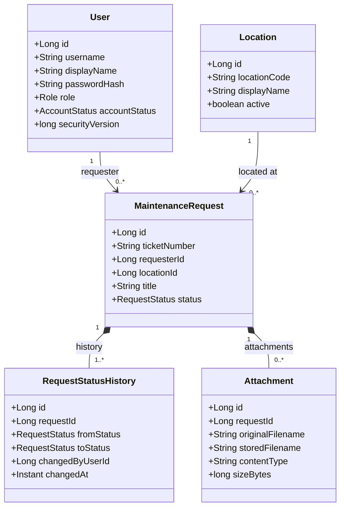
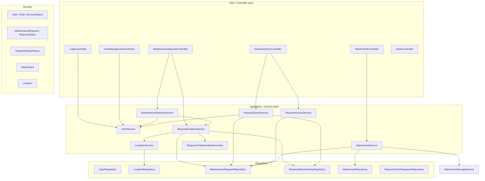
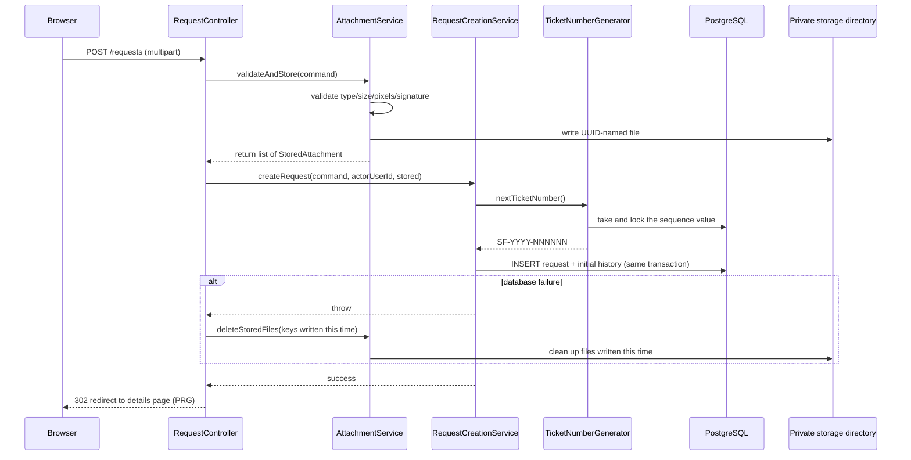
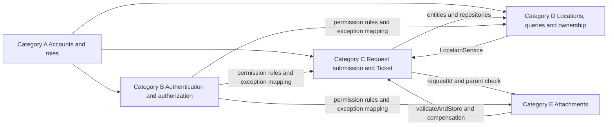
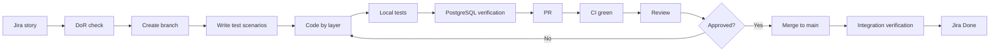

# SmartFix Sprint 2 Development Plan · Coding Standards · Work Categories and Order of Work · Acceptance Handbook

**English** | [简体中文](SmartFix_Sprint2_Development_Plan_CN.md)

> **Document status: PLANNING DRAFT — NOT YET EXECUTED.**
> This document describes **what Sprint 2 is going to do**, not what has been built.
> The repository today still contains only the initial architecture scaffold; the Sprint 2
> classes, tables, routes and tests **do not exist yet**.

> **⚠️ Missing requirements file:** the planner **did not receive** a separate Sprint 2
> requirements Markdown file (the referenced source was empty, and no sprint/requirement
> file exists anywhere in the repository). The scope and class inventory below therefore
> follow **the Sprint 2 specification given in this task**, reconciled against the actual
> repository state. **Before Sprint 2 formally starts, this plan must be checked line by line
> against the requirements file.** Wherever the two disagree, the requirements file wins and
> the change is handled through the process in §29.

---

## Table of Contents

1. [Document purpose and audience](#1-document-purpose-and-audience)
2. [Sprint 2 goal](#2-sprint-2-goal)
3. [Official roles and permission boundaries](#3-official-roles-and-permission-boundaries)
4. [Explicitly out of scope for Sprint 2](#4-explicitly-out-of-scope-for-sprint-2)
5. [The unified domain model](#5-the-unified-domain-model)
6. [Project directory conventions](#6-project-directory-conventions)
7. [Unified layering rules](#7-unified-layering-rules)
8. [Naming conventions](#8-naming-conventions)
9. [Complete class inventory and work categories](#9-complete-class-inventory-and-work-categories)
10. [Core data dictionary](#10-core-data-dictionary)
11. [Input limits](#11-input-limits)
12. [Service contracts](#12-service-contracts)
13. [HTTP routes and permission matrix](#13-http-routes-and-permission-matrix)
14. [Ticket Number design](#14-ticket-number-design)
15. [Database migration plan](#15-database-migration-plan)
16. [Attachment security and consistency](#16-attachment-security-and-consistency)
17. [Five work categories and the order of work](#17-five-work-categories-and-the-order-of-work)
18. [Shared files and conflict management](#18-shared-files-and-conflict-management)
19. [Development flow](#19-development-flow)
20. [Two-week execution plan](#20-two-week-execution-plan)
21. [Test plan and acceptance cases](#21-test-plan-and-acceptance-cases)
22. [DevSecOps and security checks](#22-devsecops-and-security-checks)
23. [Local environment and configuration](#23-local-environment-and-configuration)
24. [Git and PR conventions](#24-git-and-pr-conventions)
25. [Definition of Ready (DoR)](#25-definition-of-ready-dor)
26. [Definition of Done (DoD)](#26-definition-of-done-dod)
27. [Demo script](#27-demo-script)
28. [Risk register](#28-risk-register)
29. [Day 1 decision table](#29-day-1-decision-table)
30. [Copy-paste templates](#30-copy-paste-templates)
31. [Status markers and repository reality check](#31-status-markers-and-repository-reality-check)

---

## 1. Document purpose and audience

**What this is:** a complete Sprint 2 plan that a five-person team can code from directly —
goals, scope, class design, data dictionary, service contracts, route permissions, tests,
work categories and the order of work, process, acceptance and risks.

**Who it is for:** the five members who are about to start coding but are not yet fully
aligned on class names, package paths, interfaces, the database, Git, testing and how to
collaborate. After reading §17 you will know where to start and in what order to proceed.

**What it answers:** what Sprint 2 does, why only that, what it does not do, which five work
categories it splits into,
which classes to create, where they live, how they call each other, which are shared, who
maintains them, how responsibilities divide across layers, how User/Authentication/Location/Request/Attachment
integrate, how tables are designed, how migrations are numbered, how routes, permissions and
ownership are designed, how image upload stays safe, what happens when the file succeeds but
the database fails, which tests to write, what Jenkins checks, when work counts as Done,
what to do on each of the ten days, how to demo, what the risks are, and how Sprint 3 continues.

### 1.1 Status markers used in this document

Four markers are used throughout. **Follow them strictly — never present a plan as finished work.**

| Marker | Meaning |
|---|---|
| **【Current】** | Something that **already exists** in the repository (verifiable in code) |
| **【S2 New】** | **Planned for Sprint 2** (does not exist yet) |
| **【Later Sprint】** | Sprint 3/4 — explicitly **not** in Sprint 2 |
| **【Confirm on Day 1】** | Proposed baseline; frozen at Day 1 (possibly as an ADR) |

### 1.2 Boundary of this deliverable

This document is **planning only**. Planning itself produces **no code, no migration, no
configuration change**. The real Sprint 2 deliverable is the code and tests belonging to the
five work categories in §17.

---

## 2. Sprint 2 goal

### 2.1 Sprint Goal (one goal — do not expand it)

> **Let a requester complete the minimal loop from logging in to “seeing their own maintenance request”.**

```text
Requester logs in
   ↓
Submits a maintenance request (optionally with images)
   ↓
System generates a unique Ticket Number
   ↓
Initial status set to SUBMITTED
   ↓
System writes the initial RequestStatusHistory record
   ↓
Requester views their own request list
   ↓
Requester views their own request details, attachments and status history
```

### 2.2 Scope that sits alongside the loop but is still Sprint 2

1. **Administrator manages accounts and roles** (create user, change role, change account status).
2. **Administrator can look up a request by Ticket Number, read-only** (read-only lookup).
3. **Administrator cannot submit a request on someone's behalf** (no UI entry point, and the
   server rejects it too).
4. **Technician can only log in and reach a controlled placeholder home page** — no work
   orders this round.
5. **Requester can only view their own requests and attachments** (ownership enforced).
6. **Anonymous, wrong-role and non-owner access must all be rejected** (401/403/404 semantics in §13).

### 2.3 Why only this scope

- It is the **first genuinely end-to-end slice**: security (login/role/ownership) + persistence
  (real Flyway tables) + domain modelling (aggregate root and status history) + files (upload
  safety and compensation) + tests and CI.
- It establishes **every high-risk engineering mechanism at once** (migration discipline,
  permission matrix, upload safety, integration testing). Once those hold, Sprint 3 is
  business features on stable ground.
- It deliberately **avoids** approval, dispatch and SLA — the rule-dense areas that need a
  fuller Analysis & Design pass.

### 2.4 Minimum criteria for a successful Sprint 2

At the end of Sprint 2, anyone can run `main` and demo the §27 script, and:

- the database schema comes **100% from Flyway migrations**;
- anonymous, wrong-role and non-owner access are all correctly rejected;
- a failed submission **never** leaves “a database row with no file” or “a stray file with no
  database row”;
- `mvn clean verify` is green both locally and in Jenkins.

---

## 3. Official roles and permission boundaries

### 3.1 There are exactly three official roles

```text
REQUESTER
TECHNICIAN
ADMINISTRATOR
```

**Do not add `FACILITY_OFFICER` on your own initiative.**

### 3.2 Rules about roles

1. If `FACILITY_OFFICER` is ever genuinely needed, it must first be raised and approved as a
   **requirements change**.
2. That change must **simultaneously** update: the `Role` enum, the permission matrix, the
   architecture model, tests, pages and documentation — all of them, no exceptions.
3. **`AccountStatus` is not a role.** It says whether an account may be used (`ACTIVE` /
   `DISABLED`); “what role this user has” is an orthogonal concern.
4. **A user has exactly one Role this round** (no multi-role / role sets). This is a deliberate
   Sprint 2 simplification.
5. **Administrator “lookup” is read-only access**: viewing a request's details, and nothing more.
   It does **not** mean submitting on behalf, approving, changing status or dispatching. None of
   those happen in Sprint 2, and the server must reject them rather than merely hiding buttons.

### 3.3 Permission boundary in one table

| Capability | REQUESTER | TECHNICIAN | ADMINISTRATOR |
|---|---|---|---|
| Log in / log out | ✅ | ✅ | ✅ |
| Controlled placeholder home | ✅ | ✅ | ✅ |
| Submit a request | ✅ | ❌ | ❌ (explicitly forbidden) |
| View my request list / details / attachments | ✅ (own only) | ❌ | ❌ |
| Read-only lookup by Ticket Number | ❌ | ❌ | ✅ (read-only) |
| User and role management | ❌ | ❌ | ✅ |

---

## 4. Explicitly out of scope for Sprint 2

None of the following is done in Sprint 2 (do not implement it “while you are there”, and do
not leave half-built code for it):

| # | Not doing | Why it is deferred | Target |
|---|---|---|---|
| 1 | Administrator approval and the full triage workflow | Needs full use-case and sequence design; status rules undecided | Sprint 3 |
| 2 | `WorkOrder` | Depends on the dispatch model being settled first | Sprint 3 |
| 3 | Dispatch, re-assignment, technician acceptance | Needs matching and dispatch rule analysis | Sprint 3 |
| 4 | Strategy Pattern for technician matching | The variation point is not proven yet; abstracting early violates §44's principle | Sprint 3/4 |
| 5 | Repair status updates (in progress / completed) | Depends on the work order model | Sprint 3 |
| 6 | Completion confirmation | Who may close a request is still open | Sprint 3 |
| 7 | Reopen | Needs state machine rules | Sprint 3 |
| 8 | Feedback | Depends on completion confirmation | Sprint 3/4 |
| 9 | SLA | Needs policy and scheduling design | Sprint 4 |
| 10 | Email and in-app notifications | Needs notification infrastructure and event design | Sprint 4 |
| 11 | Map APIs | Depends on a mature facility/location model | Sprint 4 |
| 12 | Real-time updates | Not needed for the minimal loop | Not planned |
| 13 | Microservices | Architectural decision: modular monolith (README §6) | Not planned |
| 14 | Kubernetes | Operational complexity beyond the project's needs | Not planned |
| 15 | Production deployment | This course delivers a runnable system, not a production rollout | Not planned |
| 16 | JWT | Server-side session this round; JWT brings no benefit here | Not planned |
| 17 | Public registration | Accounts are created by administrators — no open registration surface | Deferred |
| 18 | Password reset | Needs an email channel; depends on #10 | Sprint 4 |
| 19 | NUS SSO | Not confirmed as genuinely required | To confirm |

**Why “not doing” must be written down:** five people have finite capacity over two weeks, and
scope creep is the most common way student projects fail. Writing the exclusions down is what
lets a reviewer say “this implementation is out of scope”.

---

## 5. The unified domain model

### 5.1 Official core objects (one name per concept, team-wide)

```text
User · Role · AccountStatus · Location · MaintenanceRequest
RequestStatus · RequestStatusHistory · UrgencyLevel
MaintenanceCategory · Attachment
```

### 5.2 One official name (synonyms forbidden)

| Official name | Forbidden synonyms | Reason |
|---|---|---|
| `RequestStatusHistory` | `StatusHistory`, `RequestHistory` | One team-wide name; avoids two tables for one concept |
| `MaintenanceRequest` | `Request`, `IssueRequest` | `Request` collides with HTTP request |
| `WorkOrder` (later sprint) | `MaintenanceWorkOrder` | Keep it short and unique |
| `MaintenanceRecord` (later sprint) | `RepairRecord` | Same reason |
| `urgencyLevel` | `urgency`, `priority`, `priorityLevel` | One concept, one name |
| `User` | lowercase `user` as a type name | Avoid confusion with keywords/variables |

### 5.3 Core domain class diagram



### 5.4 Domain rules (mandatory)

1. **`MaintenanceRequest` is the aggregate root**: submission, status and attachments all
   revolve around it.
2. **`Attachment` and `RequestStatusHistory` belong to `MaintenanceRequest`** (composition):
   they have no independent lifecycle and are meaningless without the request.
3. **`RequestStatus` must be an `enum`** (not string constants scattered around, and not its
   own table).
4. **Sprint 2 implements only `SUBMITTED`**; other enum values may exist as placeholders but
   **must have no transition logic**.
5. **The database stores attachment metadata only** (name, type, size, timestamps, storage key);
   the bytes live on disk.
6. **Files are stored under a UUID name**, never under a path derived from the user's filename.
7. **Never use the user's original filename as a path** (path traversal — see §16).
8. **Cross-module relationships use scalar IDs plus database foreign keys** (`requesterId`,
   `locationId`); do not create JPA object associations across modules.
9. **Do not put a large bidirectional request collection on `User`** (loading a user would drag
   out every request, and the association must be maintained from both sides).
10. **Never cascade-delete historical requests**: the foreign keys from history and attachments
    **must not** be `ON DELETE CASCADE`. Audit-style data is retained.

### 5.5 Module dependency graph (target shape for Sprint 2)



**Key point:** services reach other modules **only through that module's Service**
(`MRS → US`, `RCS → LS`). There is **no cross-module Repository access at all** (see §7.3).

---

## 6. Project directory conventions

### 6.1 What each root directory holds

| Directory | Holds | Must never hold |
|---|---|---|
| `src/main/java` | Production Java source (packaged by business module) | Test code, generated output |
| `src/main/resources` | Configuration (`application*.yml`), Thymeleaf templates (`templates/`), public static assets (`static/`), Flyway SQL (`db/migration/`) | User-uploaded files, real passwords |
| `src/test/java` | Test code (`*Test`, `*IT`) | Production business code |
| `src/test/resources` | Test-only configuration (`application-test.yml`), **synthetic** test images | Real user data, real credentials |

### 6.2 Key rules

1. `main/resources/static` holds **only public CSS, JS and system-supplied static images**
   (logo, style assets) — nothing else.
2. **User-uploaded images must never go into `static`**: `static` is a classpath resource served
   as public content, so it can neither be authorized nor kept out of the build JAR.
3. **Production code must never depend on the `test` tree** (`main` must not import anything
   from `test`).
4. **User files must not be written into the JAR or `resources`**: writes into `resources` at
   runtime either fail or are lost. User files go to an **externally configurable private
   directory** (`SMARTFIX_UPLOAD_DIR`, see §23).

### 6.3 Keep the “business module first” structure

```text
com.smartfix.user
com.smartfix.auth
com.smartfix.facility
com.smartfix.request
com.smartfix.common
```

Layers are created inside a module **only when needed** (never create empty packages ahead of time):

```text
controller     # web entry points
service        # use-case orchestration, transactions, permissions
domain         # entities and enums
repository     # persistence
dto            # boundary data transfer
config         # module configuration
validation     # module validators
storage        # module storage implementation (request module attachment storage)
```

---

## 7. Unified layering rules

### 7.1 Responsibilities and prohibitions per layer

| Layer | Responsible for | Forbidden |
|---|---|---|
| **Controller** | HTTP handling, form binding, DTO validation, calling Services, returning views | Calling repositories directly; writing SQL; owning transaction flow; holding business rules |
| **Service** | Use-case orchestration, business validation, permission checks, transactions, cross-component coordination | Building HTML; returning JPA entities straight to a view |
| **Domain** | Entities, enums, domain state and rules | Depending on `MultipartFile`, `HttpServletRequest`, controllers |
| **Repository** | Persistence and database queries | Handling pages; handling upload flows; orchestrating cross-module use cases |
| **DTO** | Boundary data transfer (input Command / output Response) | Using an entity as a DTO |
| **Config** | Configuration classes and property binding | Business logic |
| **Validation** | Dedicated validators (e.g. uploads) | Database access |
| **Storage** | The concrete file storage implementation | Business rules, page logic |

### 7.2 Runtime dependency direction

```text
Controller → Service → Repository / Domain
```

### 7.3 Cross-module call rules

**Allowed (and preferred):**

```text
auth    → UserService
request → UserService
request → LocationService
```

**Forbidden:**

```text
auth    → UserRepository
request → LocationRepository
Controller → Repository          （never, under any circumstances）
```

**Reason:** a repository is a module's internal implementation detail. Reaching into another
module's repository dissolves the module boundary and ends in a big ball of mud
(see [`docs/architecture.md`](../architecture.md) and [`docs/module-guide.md`](../module-guide.md)).

### 7.4 Sequence of a submission (the Sprint 2 main path)



---

## 8. Naming conventions

### 8.1 Full naming table

| # | Artifact | Rule | Good example | Bad example |
|---|---|---|---|---|
| 1 | Package | All-lowercase English | `com.smartfix.request.service` | `com.smartfix.Request.Service` |
| 2 | Java class | PascalCase | `MaintenanceRequestService` | `maintenanceRequestService` |
| 3 | Entity | PascalCase, singular | `MaintenanceRequest` | `MaintenanceRequests` |
| 4 | Enum | PascalCase, singular | `RequestStatus` | `RequestStatuses` |
| 5 | Enum value | UPPER_SNAKE_CASE | `SUBMITTED` | `Submitted` |
| 6 | Command (input DTO) | Action + object + `Command` | `SubmitMaintenanceRequestCommand` | `RequestForm` |
| 7 | Response (output DTO) | Object + purpose + `Response` | `MaintenanceRequestSummaryResponse` | `RequestDTO` |
| 8 | Service | Object + `Service` | `RequestQueryService` | `RequestManager` |
| 9 | Repository | Entity + `Repository` | `MaintenanceRequestRepository` | `RequestDao` |
| 10 | Controller | Object + `Controller` | `UserManagementController` | `AdminServlet` |
| 11 | Method | lowerCamelCase, verb first | `requireReadableRequest` | `check()` |
| 12 | Field | lowerCamelCase | `urgencyLevel` | `Urgency_Level` |
| 13 | Constant | UPPER_SNAKE_CASE | `MAX_ATTACHMENTS` | `maxAttachments` |
| 14 | Database table | lower_snake_case, plural | `maintenance_requests` | `MaintenanceRequest` |
| 15 | Database column | lower_snake_case | `ticket_number` | `ticketNumber` |
| 16 | URL | lowercase, plural, kebab-case | `/requests/mine` | `/getMyRequest` |
| 17 | Thymeleaf template | kebab-case | `request-details.html` | `requestDetails.html` |
| 18 | Configuration property | kebab-case hierarchy | `smartfix.attachment.max-count` | `smartfix_attachmentMaxCount` |
| 19 | Environment variable | UPPER_SNAKE_CASE | `SMARTFIX_UPLOAD_DIR` | `smartfix.upload.dir` |
| 20 | Unit test | Class under test + `Test` | `AttachmentValidatorTest` | `TestAttachment` |
| 21 | Integration test | Use case + `IT` | `MaintenanceRequestFlowIT` | `IntegrationTest1` |
| 22 | Git branch | `feature/SCRUM-<n>-<short-description>` | `feature/SCRUM-52-request-submission` | `mybranch` |
| 23 | Flyway migration | `V<n>__snake_case_description.sql` | `V4__create_maintenance_requests.sql` | `v4-CreateRequests.sql` |
| 24 | Git commit | `type(module): action Jira-Key` | `feat(request): add submission validation SCRUM-52` | `update` |

### 8.2 Interfaces vs. implementations: do not apply a template mechanically

1. **Do not mechanically create `IUserService` and `UserServiceImpl`.** With exactly one
   implementation and no substitution need, the interface is noise. Write
   `@Service public class UserService` directly.
2. **Create an interface only when there are multiple implementations, or an external
   dependency must be substitutable.**
3. **An `AttachmentStorageService` interface for attachment storage is justified**: it isolates
   the “disk implementation” from a test double — tests should not write to disk.
   The implementation is named `LocalAttachmentStorageService`.
4. **One business concept has exactly one official name** (see §5.2).
5. **New types should be registered in `docs/sprint2/class-catalog.md`** (the class register
   created during Sprint 2; each work category adds a row when adding a class).

---

## 9. Complete class inventory and work categories

> **Legend:** 【Current】 = already in the repository; 【S2 New】 = planned for Sprint 2.
> **Work-category labels:** A = Accounts and roles · B = Authentication and authorization ·
> C = Request submission and tickets · D = Locations, queries and ownership · E = Attachments (see §17).
> **This chapter marks only *which category* owns a class — never which person.** Who claims which
> category is decided by the team in Jira and synced at stand-up; one person may hold several
> categories, and a category may change hands mid-Sprint.

### 9.1 `user` module (category: A Accounts and roles)

| Package | Class | Responsibility | Callers | Status |
|---|---|---|---|---|
| `com.smartfix.user.domain` | `User` | User entity (account, role, status, security version) | Services/repositories | 【S2 New】 |
| `com.smartfix.user.domain` | `Role` | The three official roles | Permission checks, templates | 【Current】 `src/main/java/com/smartfix/user/domain/Role.java`, **modify existing class** (keep exactly three values) |
| `com.smartfix.user.domain` | `AccountStatus` | Account status enum (`ACTIVE` / `DISABLED`) | `ActiveAccountFilter`, admin pages | 【S2 New】 |
| `com.smartfix.user.repository` | `UserRepository` | User persistence and queries | `UserService` | 【S2 New】 |
| `com.smartfix.user.service` | `UserService` | Account creation / role / status / queries / authentication data | `UserManagementController`, `SmartFixUserDetailsService`, `MaintenanceRequestService`, `RequestQueryService` | 【S2 New】 |
| `com.smartfix.user.service` | `UserBootstrapService` | Create the bootstrap administrator on first start (idempotent) | `BootstrapAdminInitializer` | 【S2 New】 |
| `com.smartfix.user.controller` | `UserManagementController` | Administrator user-management pages and forms | Browser (ADMIN) | 【S2 New】 |
| `com.smartfix.user.dto` | `CreateUserCommand` | Create-user form | `UserManagementController` | 【S2 New】 |
| `com.smartfix.user.dto` | `ChangeUserRoleCommand` | Change-role form | `UserManagementController` | 【S2 New】 |
| `com.smartfix.user.dto` | `ChangeAccountStatusCommand` | Change-status form | `UserManagementController` | 【S2 New】 |
| `com.smartfix.user.dto` | `UserSummaryResponse` | One row of the user list | User management page | 【S2 New】 |
| `com.smartfix.user.dto` | `UserAccessResponse` | “Access context” for other modules | `RequestAccessService` | 【S2 New】 |
| `com.smartfix.user.dto` | `UserAuthenticationData` | Data authentication needs (username, hash, role, status, security version) | `SmartFixUserDetailsService` | 【S2 New】 |
| `com.smartfix.user.config` | `PasswordConfig` | Exposes the `PasswordEncoder` (BCrypt) | Spring container | 【S2 New】 |
| `com.smartfix.user.config` | `BootstrapAdminProperties` | Bootstrap administrator property binding | `UserBootstrapService` | 【S2 New】 |
| `com.smartfix.user.config` | `BootstrapAdminInitializer` | Startup hook triggering bootstrap | Spring startup | 【S2 New】 |

### 9.2 `auth` module (category: B Authentication and authorization)

| Package | Class | Responsibility | Callers | Status |
|---|---|---|---|---|
| `com.smartfix.auth.config` | `SecurityConfig` | Authentication, authorization, CSRF, session rules | Spring Security | 【Current】 `src/main/java/com/smartfix/auth/config/SecurityConfig.java`, **modify existing class** (replace permit-all with real rules) |
| `com.smartfix.auth.service` | `SmartFixUserDetailsService` | Loads authentication data from `UserService` | Spring Security | 【S2 New】 |
| `com.smartfix.auth.security` | `SmartFixUserDetails` | Custom `UserDetails` carrying `userId`, `role`, `securityVersion` | `SmartFixUserDetailsService` | 【S2 New】 |
| `com.smartfix.auth.security` | `ActiveAccountFilter` | Per-request check that the account is still enabled and the security version is unchanged | Servlet filter chain | 【S2 New】 |
| `com.smartfix.auth.controller` | `LoginController` | Login page and logout | Browser | 【S2 New】 |

### 9.3 `facility` module (category: D Locations, queries and ownership)

| Package | Class | Responsibility | Callers | Status |
|---|---|---|---|---|
| `com.smartfix.facility.domain` | `Location` | Facility location entity | `LocationService` | 【S2 New】 |
| `com.smartfix.facility.repository` | `LocationRepository` | Location queries | `LocationService` | 【S2 New】 |
| `com.smartfix.facility.service` | `LocationService` | Active location list, lookup, validation | `RequestCreationService`, form page | 【S2 New】 |
| `com.smartfix.facility.dto` | `LocationResponse` | Location dropdown/display data | Request form page | 【S2 New】 |

### 9.4 `request` module · domain (category: C Request submission and tickets)

| Package | Class | Responsibility | Callers | Status |
|---|---|---|---|---|
| `com.smartfix.request.domain` | `MaintenanceRequest` | Request aggregate root | All request services | 【S2 New】 |
| `com.smartfix.request.domain` | `RequestStatus` | Status enum (only `SUBMITTED` used in Sprint 2) | Status history, pages | 【S2 New】 |
| `com.smartfix.request.domain` | `RequestStatusHistory` | One status-change history entry | Details page | 【S2 New】 |
| `com.smartfix.request.domain` | `UrgencyLevel` | Urgency enum | Form, list | 【S2 New】 |
| `com.smartfix.request.domain` | `MaintenanceCategory` | Fault category enum | Form, list | 【S2 New】 |
| `com.smartfix.request.domain` | `Attachment` | Attachment metadata entity | Details page, download | 【S2 New】 |

### 9.5 `request` module · repository (category: C Request submission and tickets)

| Package | Class | Responsibility | Callers | Status |
|---|---|---|---|---|
| `com.smartfix.request.repository` | `MaintenanceRequestRepository` | Request persistence and queries | `RequestCreationService`, `RequestQueryService`, `RequestAccessService`, `AttachmentService` | 【S2 New】 |
| `com.smartfix.request.repository` | `RequestStatusHistoryRepository` | History entry persistence and per-request queries | `RequestCreationService`, `RequestQueryService` | 【S2 New】 |
| `com.smartfix.request.repository` | `RequestTicketSequenceRepository` | Sequence value acquisition and locking | `RequestTicketNumberGenerator` | 【S2 New】 |
| `com.smartfix.request.repository` | `AttachmentRepository` | Attachment metadata persistence and per-request queries | `AttachmentService` | 【S2 New】 |

### 9.6 `request` module · application (mainly C — see the category column)

| Package | Class | Responsibility | Callers | Category | Status |
|---|---|---|---|---|---|
| `com.smartfix.request.controller` | `MaintenanceRequestController` | `/requests/new`, `POST /requests` | Browser (REQUESTER) | C | 【S2 New】 |
| `com.smartfix.request.controller` | `RequestQueryController` | `/requests/mine`, `/requests/{ticketNumber}` | Browser (REQUESTER / read-only ADMIN) | D | 【S2 New】 |
| `com.smartfix.request.controller` | `AttachmentController` | Attachment download | Browser (authorized user) | E | 【S2 New】 |
| `com.smartfix.request.service` | `MaintenanceRequestService` | Request page use cases (form preparation, submission orchestration) | `MaintenanceRequestController` | C | 【S2 New】 |
| `com.smartfix.request.service` | `RequestCreationService` | **Separate bean** owning the creation transaction (request + initial history) | `MaintenanceRequestService` | C | 【S2 New】 |
| `com.smartfix.request.service` | `RequestTicketNumberGenerator` | Generates `SF-YYYY-NNNNNN` | `RequestCreationService` | C | 【S2 New】 |
| `com.smartfix.request.service` | `RequestQueryService` | My request list, details assembly | `RequestQueryController` | D | 【S2 New】 |
| `com.smartfix.request.service` | `RequestAccessService` | Single place for role and ownership decisions | `RequestQueryService`, `AttachmentService` | D | 【S2 New】 |
| `com.smartfix.request.service` | `AttachmentService` | Validate and store, read, clean up | `MaintenanceRequestController`, `AttachmentController` | E | 【S2 New】 |
| `com.smartfix.request.service` | `AttachmentStorageService` | **Interface**: file storage abstraction | `AttachmentService` | E | 【S2 New】 |
| `com.smartfix.request.storage` | `LocalAttachmentStorageService` | Local disk implementation (UUID names, private directory) | Injected by Spring | E | 【S2 New】 |
| `com.smartfix.request.validation` | `AttachmentValidator` | Type / size / pixel / signature validation | `AttachmentService` | E | 【S2 New】 |
| `com.smartfix.request.config` | `AttachmentProperties` | Attachment limit property binding | `AttachmentValidator` | E | 【S2 New】 |

### 9.7 `request` module · DTOs

| Package | Class | Responsibility | Category | Status |
|---|---|---|---|---|
| `com.smartfix.request.dto` | `SubmitMaintenanceRequestCommand` | Submission form input | C | 【S2 New】 |
| `com.smartfix.request.dto` | `MaintenanceRequestSubmissionResponse` | Submission result (with `ticketNumber`) | C | 【S2 New】 |
| `com.smartfix.request.dto` | `MaintenanceRequestSummaryResponse` | List row | D | 【S2 New】 |
| `com.smartfix.request.dto` | `MaintenanceRequestDetailsResponse` | Details | D | 【S2 New】 |
| `com.smartfix.request.dto` | `RequestStatusHistoryResponse` | History entry display | D | 【S2 New】 |
| `com.smartfix.request.dto` | `AttachmentResponse` | Attachment display (**no `storedFilename`**) | E | 【S2 New】 |
| `com.smartfix.request.dto` | `UploadAttachmentCommand` | Upload input (**no disk path**) | E | 【S2 New】 |
| `com.smartfix.request.dto` | `StoredAttachment` | Storage result (storage key, size, type) | E | 【S2 New】 |

### 9.8 `common` module (coordinating category: B Authentication and authorization)

| Package | Class | Responsibility | Status |
|---|---|---|---|
| `com.smartfix.common.web` | `HomeController` | Home page and the controlled placeholder home | 【Current】 `src/main/java/com/smartfix/common/web/HomeController.java`, **modify existing class** |
| `com.smartfix.common.exception` | `GlobalExceptionHandler` | Maps exceptions to pages/status codes | 【S2 New】 |
| `com.smartfix.common.exception` | `ResourceNotFoundException` | Resource not found (→404) | 【S2 New】 |
| `com.smartfix.common.exception` | `BusinessConflictException` | Business conflict (→409) | 【S2 New】 |
| `com.smartfix.common.exception` | `InputValidationException` | Input validation failure (→400) | 【S2 New】 |
| `com.smartfix.common.configuration` | `TimeConfig` | Injects `Clock` (display Asia/Singapore, store UTC) | 【S2 New】 |

**Note:** if checking the repository shows a class name no longer fits the code structure
(for example `common.web.HomeController` gaining placeholder-home duties), you may propose a
change — but **state the reason and settle on one official name**. Two names for one thing are
not acceptable.

---

## 10. Core data dictionary

### 10.0 Global type conventions

| Convention | Rule |
|---|---|
| `Long` ↔ `BIGINT` | Java `Long` maps to PostgreSQL `BIGINT` |
| `Instant` ↔ `TIMESTAMPTZ` | Java `Instant` maps to `TIMESTAMPTZ` |
| Enums | Stored as **strings** (`VARCHAR`), never as ordinals |
| Time | **Store UTC**, **display Asia/Singapore** |
| Stored filename | **UUID** |
| Primary key | Always `BIGINT` identity (`GENERATED BY DEFAULT AS IDENTITY`) |

### 10.1 `users` → `User`

| Java field | Java type | DB column | DB type | Nullable | Unique | Default | Foreign key | Validation | Purpose | Client-submittable |
|---|---|---|---|---|---|---|---|---|---|---|
| `id` | `Long` | `id` | `BIGINT` | No | Yes (PK) | identity | — | — | Primary key | ❌ |
| `username` | `String` | `username` | `VARCHAR(50)` | No | Yes | — | — | 3–50 chars; lowercase letters, digits and `.`/`_`/`-` | Login name | Admin creation only |
| `displayName` | `String` | `display_name` | `VARCHAR(100)` | No | No | — | — | 1–100 chars | Display name | Admin creation only |
| `passwordHash` | `String` | `password_hash` | `VARCHAR(100)` | No | No | — | — | BCrypt before write | Password hash (**never echoed back**) | ❌ (plaintext accepted, hashed immediately) |
| `role` | `Role` | `role` | `VARCHAR(20)` | No | No | — | — | Must be one of the three official roles | Role | Admin only |
| `accountStatus` | `AccountStatus` | `account_status` | `VARCHAR(20)` | No | No | `'ACTIVE'` | — | `ACTIVE` / `DISABLED` | Account usability | Admin only |
| `securityVersion` | `long` | `security_version` | `BIGINT` | No | No | `0` | — | ≥0 | Incremented on role/status change to invalidate old sessions | ❌ |
| `createdAt` | `Instant` | `created_at` | `TIMESTAMPTZ` | No | No | `now()` | — | — | Created at | ❌ |
| `updatedAt` | `Instant` | `updated_at` | `TIMESTAMPTZ` | No | No | `now()` | — | — | Updated at | ❌ |

### 10.2 `locations` → `Location`

| Java field | Java type | DB column | DB type | Nullable | Unique | Default | Foreign key | Validation | Purpose | Client-submittable |
|---|---|---|---|---|---|---|---|---|---|---|
| `id` | `Long` | `id` | `BIGINT` | No | Yes (PK) | identity | — | — | Primary key | ❌ |
| `locationCode` | `String` | `location_code` | `VARCHAR(50)` | No | Yes | — | — | 1–50 chars | Business location code | ❌ (provided by migration/seed in Sprint 2) |
| `building` | `String` | `building` | `VARCHAR(100)` | Yes | No | — | — | ≤100 | Building | ❌ |
| `floor` | `String` | `floor` | `VARCHAR(20)` | Yes | No | — | — | ≤20 | Floor | ❌ |
| `room` | `String` | `room` | `VARCHAR(50)` | Yes | No | — | — | ≤50 | Room | ❌ |
| `displayName` | `String` | `display_name` | `VARCHAR(150)` | No | No | — | — | 1–150 | Display name | ❌ |
| `active` | `boolean` | `active` | `BOOLEAN` | No | No | `true` | — | — | Usable for new requests | ❌ |

### 10.3 `maintenance_requests` → `MaintenanceRequest`

| Java field | Java type | DB column | DB type | Nullable | Unique | Default | Foreign key | Validation | Purpose | Client-submittable |
|---|---|---|---|---|---|---|---|---|---|---|
| `id` | `Long` | `id` | `BIGINT` | No | Yes (PK) | identity | — | — | Internal primary key | ❌ |
| `ticketNumber` | `String` | `ticket_number` | `VARCHAR(20)` | No | **Yes** | — | — | `SF-YYYY-NNNNNN` | Public ticket number | ❌ (server-generated) |
| `requesterId` | `Long` | `requester_id` | `BIGINT` | No | No | — | → `users(id)` | Must equal the logged-in user | Requester | **❌ never accept a form value** |
| `locationId` | `Long` | `location_id` | `BIGINT` | No | No | — | → `locations(id)` | Must be an **active** location | Fault location | ✅ (dropdown, server-validated) |
| `title` | `String` | `title` | `VARCHAR(120)` | No | No | — | — | 1–120 after trim | Title | ✅ |
| `description` | `String` | `description` | `VARCHAR(2000)` | No | No | — | — | 1–2000 after trim | Description | ✅ |
| `category` | `MaintenanceCategory` | `category` | `VARCHAR(30)` | No | No | — | — | One of the enum values | Category | ✅ |
| `urgencyLevel` | `UrgencyLevel` | `urgency_level` | `VARCHAR(20)` | No | No | — | — | One of the enum values | Urgency | ✅ |
| `status` | `RequestStatus` | `status` | `VARCHAR(20)` | No | No | `'SUBMITTED'` | — | Only `SUBMITTED` in Sprint 2 | Current status | ❌ |
| `createdAt` | `Instant` | `created_at` | `TIMESTAMPTZ` | No | No | `now()` | — | — | Created at | ❌ |
| `updatedAt` | `Instant` | `updated_at` | `TIMESTAMPTZ` | No | No | `now()` | — | — | Updated at | ❌ |

### 10.4 `request_status_history` → `RequestStatusHistory`

| Java field | Java type | DB column | DB type | Nullable | Unique | Default | Foreign key | Validation | Purpose | Client-submittable |
|---|---|---|---|---|---|---|---|---|---|---|
| `id` | `Long` | `id` | `BIGINT` | No | Yes (PK) | identity | — | — | Primary key | ❌ |
| `requestId` | `Long` | `request_id` | `BIGINT` | No | No | — | → `maintenance_requests(id)` (**no cascade delete**) | Must belong to the same request | Owning request | ❌ |
| `fromStatus` | `RequestStatus` | `from_status` | `VARCHAR(20)` | **Yes** | No | `NULL` | — | NULL for the initial entry | Previous status | ❌ |
| `toStatus` | `RequestStatus` | `to_status` | `VARCHAR(20)` | No | No | — | — | `SUBMITTED` initially | New status | ❌ |
| `changedByUserId` | `Long` | `changed_by_user_id` | `BIGINT` | No | No | — | → `users(id)` | — | Actor | ❌ |
| `changedAt` | `Instant` | `changed_at` | `TIMESTAMPTZ` | No | No | `now()` | — | — | Changed at | ❌ |
| `comment` | `String` | `comment` | `VARCHAR(500)` | Yes | No | `NULL` | — | ≤500 | Note (may be null/fixed text in Sprint 2) | ❌ |

### 10.5 `request_attachments` → `Attachment`

| Java field | Java type | DB column | DB type | Nullable | Unique | Default | Foreign key | Validation | Purpose | Client-submittable |
|---|---|---|---|---|---|---|---|---|---|---|
| `id` | `Long` | `id` | `BIGINT` | No | Yes (PK) | identity | — | — | Primary key | ❌ |
| `requestId` | `Long` | `request_id` | `BIGINT` | No | No | — | → `maintenance_requests(id)` | Must belong to the same request | Owning request | ❌ |
| `originalFilename` | `String` | `original_filename` | `VARCHAR(255)` | No | No | — | — | Sanitized display name | Original filename (**display only**) | ❌ (taken server-side from the upload) |
| `storedFilename` | `String` | `stored_filename` | `VARCHAR(64)` | No | **Yes** | — | — | UUID | Disk storage key (**never returned to the browser**) | ❌ |
| `contentType` | `String` | `content_type` | `VARCHAR(100)` | No | No | — | — | As detected server-side | Content type | ❌ |
| `sizeBytes` | `long` | `size_bytes` | `BIGINT` | No | No | — | — | >0 and ≤ limit | Size in bytes | ❌ |
| `uploadedAt` | `Instant` | `uploaded_at` | `TIMESTAMPTZ` | No | No | `now()` | — | — | Uploaded at | ❌ |

---

## 11. Input limits

> **【Confirm on Day 1】** The values below are a **proposed baseline** to be frozen in a Day 1
> ADR. **Do not write them up as “approved by the course”.**

| Item | Proposed baseline | Note |
|---|---|---|
| `username` | 3–50 chars | Unique; duplicate → 409 |
| `displayName` | 1–100 chars | Validated after trim |
| `password` | At least 12 chars, at most 72 bytes UTF-8 | Upper bound comes from BCrypt's 72-byte limit |
| `title` | 1–120 chars after trim | |
| `description` | 1–2000 chars after trim | |
| `category` | `ELECTRICAL`, `PLUMBING`, `HVAC`, `BUILDING`, `OTHER` | Closed enum |
| `urgencyLevel` | `LOW`, `MEDIUM`, `HIGH` | Closed enum |
| Attachment count | 0–3 | Images are **optional** (see §29) |
| Single file size | ≤ 5 MiB | |
| Total size | ≤ 15 MiB | |
| Formats | PNG, JPEG | Based on the **actual decoded result**, not the extension alone |
| Single edge pixels | ≤ 10000 px | |
| Total pixels | ≤ 20 million | |
| List pagination | Default 20, max 100 | `page`/`size` must be clamped |
| Session idle timeout | 30 minutes | |

---

## 12. Service contracts

> **Shared principles (read first):**
> 1. **`actorUserId` must come from the trusted logged-in principal** (`SmartFixUserDetails`).
>    **Never accept `requesterId` from a form or hidden field.**
> 2. **`RequestCreationService` is a separate Spring bean so that `@Transactional` actually
>    applies** (a self-invocation would not — see §12.7).
> 3. **`RequestAccessService` is the single place role and ownership are decided** (do not
>    re-implement the check elsewhere).
> 4. **Upload DTOs must not expose disk paths to the browser.**
> 5. **`AttachmentResponse` does not contain `storedFilename`.**

### 12.1 `UserService`

```java
Long createUser(CreateUserCommand command, Long actorUserId);
void changeRole(Long userId, ChangeUserRoleCommand command, Long actorUserId);
void changeAccountStatus(Long userId, ChangeAccountStatusCommand command, Long actorUserId);
List<UserSummaryResponse> listUsers();
UserAuthenticationData findAuthenticationByUsername(String username);
UserAccessResponse getUserAccess(Long userId);
```

| Method | Input | Output | Exceptions | Transaction | Callers |
|---|---|---|---|---|---|
| `createUser` | Creation form + actor | New user `id` | Duplicate username → `BusinessConflictException`; weak password → `InputValidationException` | Yes (write) | `UserManagementController` |
| `changeRole` | Target user, new role, actor | — | User missing → `ResourceNotFoundException`; **the last administrator must not be demoted** | Yes (write) | `UserManagementController` |
| `changeAccountStatus` | Target user, new status, actor | — | As above; **the last administrator must not be disabled** | Yes (write) | `UserManagementController` |
| `listUsers` | — | User summary list | — | Read-only | `UserManagementController` |
| `findAuthenticationByUsername` | Username | Authentication data (hash, role, status, security version) | Not found → empty/controlled exception (converted to an authentication failure by `auth`) | Read-only | `SmartFixUserDetailsService` |
| `getUserAccess` | User id | Access context (role, status, security version) | User missing → `ResourceNotFoundException` | Read-only | `RequestAccessService` |

> **Note:** a role or status change **must increment `securityVersion`**, so that any existing
> session for that user is invalidated by `ActiveAccountFilter` (this is what makes AC09/AC16 pass).

### 12.2 `LocationService`

```java
List<LocationResponse> listActiveLocations();
LocationResponse getLocation(Long locationId);
Location requireActiveLocation(Long locationId);
```

| Method | Input | Output | Exceptions | Transaction | Callers |
|---|---|---|---|---|---|
| `listActiveLocations` | — | Active location list | — | Read-only | Request form page (`MaintenanceRequestService`) |
| `getLocation` | Location id | Location data | Missing → `ResourceNotFoundException` | Read-only | Details page |
| `requireActiveLocation` | Location id | Domain object | Missing/disabled → `InputValidationException` | Read-only | `RequestCreationService` |

### 12.3 `MaintenanceRequestService`

```java
MaintenanceRequestSubmissionResponse submitRequest(
        SubmitMaintenanceRequestCommand command,
        List<MultipartFile> files,
        Long actorUserId);
```

| Input | Output | Exceptions | Transaction | Callers |
|---|---|---|---|---|
| Form + files + logged-in user id | Submission result (with `ticketNumber`) | Validation failure → `InputValidationException`; file problems → §16; database failure → propagated so the controller can run compensation | **This method does not open a transaction itself** (that is `RequestCreationService`) | `MaintenanceRequestController` |

**Responsibility:** prepare form options (locations, categories, urgency) and orchestrate
“store files first, then create the database record, and clean up on failure”.

### 12.4 `RequestQueryService`

```java
List<MaintenanceRequestSummaryResponse> listMyRequests(Long actorUserId, int page, int size);
MaintenanceRequestDetailsResponse getRequestDetails(String ticketNumber, Long actorUserId);
```

| Method | Input | Output | Exceptions | Transaction | Callers |
|---|---|---|---|---|---|
| `listMyRequests` | Logged-in user id, paging | My request list (**own only**) | — | Read-only | `RequestQueryController` |
| `getRequestDetails` | ticketNumber, logged-in user id | Details (with attachments and status history) | Not readable → `ResourceNotFoundException` (**not 403** — see §13.4) | Read-only | `RequestQueryController` |

### 12.5 `RequestAccessService`

```java
MaintenanceRequest requireReadableRequest(String ticketNumber, Long actorUserId);
```

| Input | Output | Exceptions | Transaction | Callers |
|---|---|---|---|---|
| ticketNumber, logged-in user id | A readable request aggregate | Missing, not the owner, or role not allowed → `ResourceNotFoundException` | Read-only | `RequestQueryService`, `AttachmentService` (download authorization) |

**Single decision rule:**

```text
ADMINISTRATOR → allowed, read-only (lookup)
REQUESTER     → only when request.requesterId == actorUserId
TECHNICIAN    → not allowed
Other/anonymous → not allowed
```

### 12.6 `AttachmentService`

```java
List<StoredAttachment> validateAndStore(List<MultipartFile> files, Long actorUserId);
StoredAttachment readAttachment(String ticketNumber, Long attachmentId, Long actorUserId);
void deleteStoredFiles(List<StoredAttachment> stored);
```

| Method | Input | Output | Exceptions | Transaction | Callers |
|---|---|---|---|---|---|
| `validateAndStore` | Uploaded file list, logged-in user | Storage result list (storage keys) | Validation failure → `InputValidationException`; write failure → controlled exception | No (filesystem) | `MaintenanceRequestService` |
| `readAttachment` | ticketNumber, attachment id, logged-in user | Readable stream + metadata | Parent/child mismatch or not readable → `ResourceNotFoundException` | Read-only | `AttachmentController` |
| `deleteStoredFiles` | Storage results from this submission | — | Cleanup failure is **logged only** (see §16) | No | `MaintenanceRequestService` (compensation) |

### 12.7 `RequestCreationService`

```java
MaintenanceRequestSubmissionResponse createRequest(
        SubmitMaintenanceRequestCommand command,
        List<StoredAttachment> storedAttachments,
        Long actorUserId);
```

| Input | Output | Exceptions | Transaction | Callers |
|---|---|---|---|---|
| Form + already-stored attachments + logged-in user | Submission result | Database exceptions propagate (**triggering file compensation**) | **`@Transactional` (separate bean)** | `MaintenanceRequestService` |

**This method completes in one transaction:**

1. generate `ticketNumber`;
2. `INSERT maintenance_requests` (`status = SUBMITTED`, `requesterId = actorUserId`);
3. `INSERT request_status_history` (`from_status = NULL`, `to_status = SUBMITTED`,
   `changed_by_user_id = actorUserId`);
4. `INSERT request_attachments` (if any).

> **Why a separate bean:** Spring's `@Transactional` works through a proxy, so a
> self-invocation inside the same class **does not open a transaction**. Putting the
> transaction boundary on a public method of a separate bean makes the semantics explicit
> and avoids that trap.

### 12.8 `RequestTicketNumberGenerator`

```java
String nextTicketNumber();
```

| Input | Output | Exceptions | Transaction | Callers |
|---|---|---|---|---|
| — | `SF-YYYY-NNNNNN` | Sequence unavailable → throw and fail the submission (never silently retry into a duplicate) | Joins the `createRequest` transaction | `RequestCreationService` |

---

## 13. HTTP routes and permission matrix

### 13.1 Route table

| Route | Handler | Purpose | Allowed roles | CSRF | Success | Failure | Ownership |
|---|---|---|---|---|---|---|---|
| `GET /login` | `LoginController` | Login page | Anonymous | No | 200 page | — | — |
| `POST /login` | Spring Security | Submit login | Anonymous | **Yes** | 302 → `/` | 302 → `/login?error` | — |
| `POST /logout` | Spring Security | Logout | Authenticated | **Yes** | 302 → `/login?logout` | — | — |
| `GET /` | `HomeController` | Home / controlled placeholder | Authenticated | — | 200 page | 302 → `/login` | — |
| `GET /requests/new` | `MaintenanceRequestController` | Request form | REQUESTER | — | 200 page | 403 | — |
| `POST /requests` | `MaintenanceRequestController` | Submit request | REQUESTER | **Yes** | **302 → `/requests/{ticketNumber}`** (PRG) | Re-rendered form / 400 / 413 | — |
| `GET /requests/mine` | `RequestQueryController` | My requests | REQUESTER | — | 200 list | 403 | — |
| `GET /requests/{ticketNumber}` | `RequestQueryController` | Request details | REQUESTER (own) / ADMIN (read-only) | — | 200 details | 404 | **Yes** |
| `GET /requests/{ticketNumber}/attachments/{attachmentId}` | `AttachmentController` | Attachment download | REQUESTER (own) / ADMIN | — | 200 file stream | 404 | **Yes (parent and child both checked)** |
| `GET /admin/requests/lookup` | `RequestQueryController` | Read-only lookup by ticket | ADMIN | — | 200 details | 404 | Read-only |
| `GET /admin/users` | `UserManagementController` | User list | ADMIN | — | 200 list | 403 | — |
| `GET /admin/users/new` | `UserManagementController` | Create-user form | ADMIN | — | 200 page | 403 | — |
| `POST /admin/users` | `UserManagementController` | Create user | ADMIN | **Yes** | 302 → `/admin/users` | Re-rendered form / 409 | — |
| `POST /admin/users/{userId}/role` | `UserManagementController` | Change role | ADMIN | **Yes** | 302 → `/admin/users` | 400 / 404 | — |
| `POST /admin/users/{userId}/status` | `UserManagementController` | Change account status | ADMIN | **Yes** | 302 → `/admin/users` | 400 / 404 | — |
| `GET /actuator/health` | Actuator | Health check | Anonymous (health only) | — | 200 JSON | — | — |

> **Note:** Sprint 2 has **no** administrator submission route (`POST /requests` returns 403
> for ADMIN). This is §3.2 rule 5 in practice.

### 13.2 Permission matrix

| Route | REQUESTER | TECHNICIAN | ADMINISTRATOR | Anonymous |
|---|---|---|---|---|
| `GET /login`, `POST /login` | Allowed | Allowed | Allowed | Allowed |
| `GET /` | ✅ | ✅ (placeholder) | ✅ | 302 → `/login` |
| `GET /requests/new`, `POST /requests` | ✅ | ❌ 403 | ❌ 403 | 302 → `/login` |
| `GET /requests/mine` | ✅ | ❌ 403 | ❌ 403 | 302 → `/login` |
| `GET /requests/{ticketNumber}` | ✅ own only | ❌ 403 | ✅ read-only | 302 → `/login` |
| `GET /requests/{t}/attachments/{a}` | ✅ own only | ❌ 403 | ✅ read-only | 302 → `/login` |
| `/admin/**` | ❌ 403 | ❌ 403 | ✅ | 302 → `/login` |
| `GET /actuator/health` | ✅ | ✅ | ✅ | ✅ |

### 13.3 Error semantics

| Situation | Status / behaviour |
|---|---|
| Anonymous access to a protected page | **302 redirect to the login page** |
| Wrong role | **403** |
| Requester accessing someone else's request | **404** (never reveals “exists but forbidden”) |
| Request that does not exist | **404** |
| Forged ticket + attachmentId combination (parent mismatch) | **404** |
| Field validation error | **400** or the form re-rendered with errors |
| Duplicate username | **409** |
| Multipart size exceeded | **413** |
| Unexpected exception | **500 friendly page** |

### 13.4 Why “someone else's resource” returns 404 rather than 403

403 tells an attacker “this ticket exists, you just lack permission” — which turns the endpoint
into a ticket-number enumeration oracle. Returning 404 for every non-owner makes “does not
exist” and “not permitted” indistinguishable from the outside.

### 13.5 Error pages and logs must not leak

Error pages and logs **must not** leak: SQL statements, Java class names/stack traces, or
server file paths. `GlobalExceptionHandler` owns the mapping: business exceptions → friendly
pages; unexpected exceptions → a generic 500 page plus a **server-side log** (the stack trace
stays in the log and is **never returned to the browser**).

---

## 14. Ticket Number design

### 14.1 Format

```text
SF-YYYY-000001
 │   │      └── 6-digit sequence (zero-padded)
 │   └── year (current year in Asia/Singapore)
 └── fixed prefix
```

### 14.2 Ten points that must be explained

1. **Internal primary key vs. ticket number:** `id` (`BIGINT`) is the internal key used for
   database relationships; `ticketNumber` is the **public** identifier people read and search
   by. Neither replaces the other.
2. **How a PostgreSQL sequence makes this concurrency-safe:** the number comes from a database
   sequence, and taking a value from a sequence is **atomic** — two concurrent transactions
   never receive the same value.
3. **What the `UNIQUE` constraint does:** even if application code has a bug, the database still
   prevents duplicate ticket numbers. This last line of defence **must exist**.
4. **How the year is produced:** from an injected `Clock` (`TimeConfig`) evaluated in
   Asia/Singapore.
5. **Why gaps are acceptable:** a rolled-back transaction still consumes its sequence value, so
   the range has holes. Gaps **do not affect the business**, and chasing contiguity introduces
   locking and performance problems.
6. **Why `count(*)` is wrong:** under concurrency two requests read the same count and produce
   duplicate numbers; and deleting rows makes the count go backwards.
7. **Why `max(id) + 1` is wrong:** the same race — concurrent inserts both compute the same value.
8. **Why an in-memory counter is wrong:** it breaks with multiple instances or a restart, and can
   never agree with database state.
9. **Why a ticket number is not an access credential:** it is a **short, enumerable** string.
   Authorization **must** be based on the logged-in identity and an ownership check (§12.5).
   “Knows the number, therefore may view” is never acceptable.
10. **PRG vs. strong idempotency:** PRG (Post/Redirect/Get) only fixes the browser behaviour of
    resubmitting on refresh. **Strong idempotency** (one submission intent → exactly one record)
    needs a separate `submissionKey` mechanism.

### 14.3 Sprint 2 trade-off

- **Do: Post/Redirect/Get.** A successful submission returns 302 to the details page.
- **Do not require server-side idempotency by default.** If double-click protection is later
  needed, introduce `submissionKey` (unique constraint + return the existing record on a repeat)
  as a **separate story** — not as a half-built addition inside Sprint 2.
- **Know the residual risk:** a double-click can still create two records in Sprint 2
  (risk R15 in §28). The demo and acceptance must be aware of this boundary.

---

## 15. Database migration plan

### 15.1 Proposed migration sequence

> **Precondition:** the repository currently has only `V1__baseline.sql` (an **intentionally
> empty** baseline, 【Current】). Everything below is 【S2 New】.

| Version | File | Creates | Category |
|---|---|---|---|
| V2 | `V2__create_users.sql` | `users` table + unique constraint on `username` | A |
| V3 | `V3__create_locations.sql` | `locations` table + unique constraint on `location_code` + optional seed rows (see decision table) | D |
| V4 | `V4__create_maintenance_requests.sql` | `maintenance_requests` table + unique `ticket_number` + foreign keys + sequence | C |
| V5 | `V5__create_request_attachments.sql` | `request_attachments` table + foreign keys + unique `stored_filename` | E |
| V6 | `V6__create_request_status_history.sql` | `request_status_history` table + foreign keys (**no cascade delete**) | C |

> **Note:** the original brief listed attachments as V5 but gave no number to
> `request_status_history`. Because **request creation must write the initial history in the
> same transaction**, `request_status_history` must exist right after V4. **The exact numbering
> is frozen on Day 1** (item 11 in §29), and the team follows the register.

### 15.2 Migration discipline (12 points that must be explained)

1. **Category per migration** is in the table above; that category answers for the file’s content and
   its review responses (the team decides who inside the category).
   for review responses.
2. **Tables and constraints each migration creates** are in the table above and in §10.
3. **Dependencies between migrations:** `V2` (users) and `V3` (locations) are independent;
   `V4` depends on `V2` + `V3` (foreign keys); `V5` and `V6` depend on `V4`.
4. **PR merge order:** must be **V2 → V3 → V4 → V6 → V5** (or whatever order Day 1 freezes),
   otherwise a later migration fails because its foreign key target does not exist yet.
5. **How to reserve a version number:** register it in the migration register under
   `docs/sprint2/` **before writing the file**. Registration reserves the number, so two people
   cannot both write `V4`.
6. **What to do on a number collision:** whoever registered second **renumbers and renames their
   file** and says so in the PR. **Never** change the version number of an already-merged file.
7. **Why a merged or executed migration must never be edited:** Flyway records a **checksum** per
   version. Changing the file breaks checksum validation on every database that already ran it
   (teammates, CI) — **the whole team breaks at once**.
8. **What the Flyway checksum means:** it is a digest of the migration file's content, used to
   detect whether the file still matches what was executed.
9. **Why `flyway repair` must not paper over an unknown difference:** repair only rewrites the
   checksum. It does **not** bring the schema back in line with the file — it turns a *visible*
   error into an *invisible* one. A checksum failure must be **understood first**.
10. **Why the main configuration keeps `ddl-auto=none`:** the schema must be defined by
    migrations **only**. Any auto-DDL produces “works on my machine, fails on yours”.
11. **Why real-PostgreSQL integration tests want `ddl-auto=validate`:** it makes Hibernate
    **verify that the entity mappings match the real schema** at startup, surfacing mapping
    errors during tests rather than after release. **Note: `validate` only validates; it never
    creates tables.**
12. **Hibernate `update` is never a substitute for a migration:** `update` is unpredictable,
    unreviewable, cannot be rolled back, and lets every developer's schema drift apart silently.

### 15.3 Integration test database strategy

```text
Unit / controller tests → H2 (fast, isolated)
Repository / integration → PostgreSQL (Testcontainers) 【S2 plan; needs team approval for the test dependency】
Docker smoke            → docker compose with real PostgreSQL + the app
```

**Testcontainers is not yet introduced** (【later / to confirm】). Adopting it means adding a
**test-scope** dependency to `pom.xml`, which is a **team-level change** and must go through the
negotiation in §24 — an individual must not add it unilaterally.

---

## 16. Attachment security and consistency

### 16.1 Upload safety (20 points)

| # | Point | Explanation |
|---|---|---|
| 1 | **Why an extension check alone is not enough** | The extension is entirely client-controlled; `evil.png` can hold anything |
| 2 | **Why the client Content-Type cannot be trusted** | Request headers are trivially forged; the server must decide for itself |
| 3 | **File signature check** | Read the magic bytes (PNG `89 50 4E 47`, JPEG `FF D8 FF`) to confirm the real type |
| 4 | **Image decoding check** | Decode once with `ImageIO`; a failed decode means reject (defends against polyglot/image payloads) |
| 5 | **Pixel limits** | ≤10000 per edge and ≤20 million total, to stop decompression bombs |
| 6 | **Per-file and total size limits** | ≤5 MiB each and ≤15 MiB total (§11) |
| 7 | **Count limit** | 0–3 files |
| 8 | **Original filename sanitization** | Strip the path portion and dangerous characters; keep only a safe display name |
| 9 | **Path traversal defence** | The storage path is built server-side from a UUID; user input never participates in the path |
| 10 | **UUID storage name** | The on-disk filename is a UUID, fully decoupled from user input |
| 11 | **Private storage directory** | `SMARTFIX_UPLOAD_DIR` lives outside the application and is not packaged by the build |
| 12 | **Non-root container permissions** | The container runs as non-root (【Current】 the Dockerfile already does), and the directory permissions must match |
| 13 | **Why `static` is not an option** | `static` is public classpath content: it cannot be authorized and would be baked into the JAR |
| 14 | **Authorized download** | Every download goes through `RequestAccessService` (§12.5) |
| 15 | **Ticket ↔ attachmentId parent check** | The attachment must belong to that ticket, otherwise 404 (defends against ID enumeration) |
| 16 | **Content-Type** | Return the server-detected type on download; never trust the stored client value |
| 17 | **nosniff** | Send `X-Content-Type-Options: nosniff` |
| 18 | **Content-Disposition** | Use `attachment; filename="..."` so the browser never renders it inline |
| 19 | **Caching policy** | Use `Cache-Control: private, no-store` for private content |
| 20 | **Docker volume persistence** | The upload directory must be a mounted volume, or files vanish when the container is recreated |

### 16.2 File and database compensation flow (12 steps)

```text
1.  First validate the form, the account status, the location (active) and every image
2.  If validation fails → write no production file at all
3.  When writing begins → record the storage keys written this time (storedKeys)
4.  If file N fails → clean up files 1..N-1 written this time
5.  Once every file is ready → call RequestCreationService to complete the database transaction
6.  On a database exception or failed commit → clean up every file from this submission
7.  If cleanup itself fails → log it separately (never swallow it silently, and never block the
    response)
8.  Never disguise failure as success: no cleanup exception may let the user see “submitted”
9.  @Transactional cannot roll back local files: the transaction covers the database only, not
    the filesystem
10. A process crash can still leave orphan files: this is an accepted residual risk
11. Any reconciliation tool must first emit a read-only report listing “file without record” and
    “record without file”
12. Never scan and bulk-delete the whole upload directory: a mistaken delete is unrecoverable
```

### 16.3 Why compensation is mandatory

With “write files first, then the database” there are three classes of inconsistency: **more
files than records (orphans)**, **more records than files (broken references)**, and **partial
writes (half an attachment set)**. The compensation flow guarantees: **if the user sees success,
both the database and the files succeeded**; on failure it returns as close to the pre-write
state as possible and leaves an auditable log.

---

## 17. Five work categories and the order of work

> **This chapter makes no task assignment.** The team works through the five **work
> categories** below, and **categories are not tied to people** — anyone can pick up any
> category, and hand-over between stages is fine.
> What determines the order is the **dependency between categories**, not who does which part.
>
> **Tests are completed together with their category** — never postponed to the end of the
> sprint, and never concentrated on one person.

### 17.1 The five work categories

| Category | Capability covered | Modules and packages | Main classes |
|---|---|---|---|
| **A Accounts and roles** | Create users, change roles, enable/disable accounts, bootstrap administrator, expose authentication data and access context | `com.smartfix.user.*` | `User`, `Role`, `AccountStatus`, `UserRepository`, `UserService`, `UserBootstrapService`, `UserManagementController`, `UserAuthenticationData`, `UserAccessResponse`, `PasswordConfig`, `BootstrapAdminProperties`, `BootstrapAdminInitializer` |
| **B Authentication and authorization** | Login/logout, session, CSRF, route permissions, unified exceptions and error pages | `com.smartfix.auth.*`, `com.smartfix.common.exception`, `com.smartfix.common.configuration` | `SecurityConfig`, `SmartFixUserDetails`, `SmartFixUserDetailsService`, `ActiveAccountFilter`, `LoginController`, `GlobalExceptionHandler`, `ResourceNotFoundException`, `BusinessConflictException`, `InputValidationException`, `TimeConfig` |
| **C Request submission and Ticket** | Request aggregate, unique ticket, initial status history, submission main path (PRG) | `com.smartfix.request.{domain,repository,service,controller,dto}` (write side) | `MaintenanceRequest`, `RequestStatus`, `RequestStatusHistory`, `UrgencyLevel`, `MaintenanceCategory`, `MaintenanceRequestRepository`, `RequestStatusHistoryRepository`, `RequestTicketSequenceRepository`, `RequestTicketNumberGenerator`, `RequestCreationService`, `MaintenanceRequestService`, `MaintenanceRequestController`, `SubmitMaintenanceRequestCommand`, `MaintenanceRequestSubmissionResponse` |
| **D Locations, queries and ownership** | Location data, my requests, details and status history, over-reach decisions, administrator read-only lookup | `com.smartfix.facility.*`, `com.smartfix.request.{controller,service,dto}` (read side) | `Location`, `LocationRepository`, `LocationService`, `LocationResponse`, `RequestAccessService`, `RequestQueryService`, `RequestQueryController`, `MaintenanceRequestSummaryResponse`, `MaintenanceRequestDetailsResponse`, `RequestStatusHistoryResponse` |
| **E Attachments** | Validation, private storage, authorized download, compensation cleanup on failure | `com.smartfix.request.{domain,repository,service,storage,validation,config,controller}` (attachment side) | `Attachment`, `AttachmentRepository`, `AttachmentService`, `AttachmentStorageService`, `LocalAttachmentStorageService`, `AttachmentValidator`, `AttachmentProperties`, `AttachmentController`, `AttachmentResponse`, `UploadAttachmentCommand`, `StoredAttachment` |

### 17.2 Goal and boundaries of each category

#### Category A — Accounts and roles

- **Goal:** the system has a trustworthy account data source: an administrator can create accounts, change roles and enable/disable accounts, and other categories can read authentication data and access context.
- **Contracts to freeze first:** `UserAuthenticationData`, `UserAccessResponse`, `UserService` (§12.1).
- **Scenarios that must be tested:** successful creation / duplicate username 409 / password rules / role change bumps the security version / account disabled / **the last administrator cannot be disabled or demoted** / bootstrap administrator is idempotent (a restart does not create a second one).
- **Security notes:** accept the plaintext password and **BCrypt it immediately**; `passwordHash` never appears on a page, in a log, or in a response; role and status changes must increment `securityVersion`.
- **Not allowed:** do not implement the real login logic (that is category B); do not implement registration or password reset (§4); do not expose `UserRepository` to other categories; do not add a request collection to `User`.
- **Done when:** an administrator can create accounts in all three roles; a duplicate username is rejected; a disabled account cannot keep using its old session; `V2` runs successfully on a clean database.

#### Category B — Authentication and authorization

- **Goal:** protected pages are unreachable when logged out; wrong roles are rejected; a disabled account's session dies immediately; every state-changing request is CSRF protected.
- **Contracts:** consumes `findAuthenticationByUsername` from §12.1; provides the **site-wide permission rules** and the **unified exception mapping**.
- **Scenarios that must be tested:** anonymous redirect / successful login / bad credentials / technician over-reach 403 / requester hitting `/admin/**` 403 / missing CSRF rejected 403 / disabled account's old session invalidated / old session invalidated after a role change / protected page unreachable after logout.
- **Security notes:** permit only what is strictly necessary (`/login`, `/actuator/health`, static assets); **never** reintroduce permit-all; CSRF does not apply to GET but must be on for POST; error pages must not leak stack traces.
- **Not allowed:** do not implement SSO or JWT (§4); do not weaken authorization to make a test pass; do not scatter `securityVersion` checks across controllers (they belong in the filter).
- **Done when:** anonymous access to a protected URL always 302-redirects to the login page; wrong roles get 403; a disabled account's session is kicked out on its very next request.

#### Category C — Request submission and Ticket

- **Goal:** after submission the system produces a **unique ticket**, status `SUBMITTED`, and **writes one initial `RequestStatusHistory` row**.
- **Contracts to freeze first:** the `MaintenanceRequest` entity fields, `RequestCreationService`, `RequestTicketNumberGenerator` (§12.7, §12.8).
- **Scenarios that must be tested:** valid submission succeeds / **the initial history must exist as NULL → SUBMITTED** / submission with no attachments / submission with three attachments / a field validation failure writes nothing / a disabled location is rejected / **concurrent submissions do not duplicate tickets** / files are cleaned up when the database fails / PRG redirects to the details page.
- **Security notes:** `requesterId` may **only** come from the logged-in principal; `status` **never** accepts client input; account-enabled and location-active must be validated before submission.
- **Not allowed:** do not implement approval, dispatch, work orders or SLA (§4); do not write status transition logic (only `SUBMITTED` exists); do not let other categories reach this category's repositories directly.
- **Done when:** after a successful submission a unique number like `SF-2026-000123` is visible, the request has one `SUBMITTED` status-history row, and `changed_by_user_id` is the submitter.

#### Category D — Locations, queries and ownership

- **Goal:** a Requester sees only their own request list and details (including attachments and status history); an Administrator can do a read-only lookup by ticket; over-reach always returns 404.
- **Contracts to freeze first:** `LocationService.requireActiveLocation`, `RequestAccessService.requireReadableRequest` (§12.2, §12.5) — attachment download reuses the latter.
- **Scenarios that must be tested:** my list contains only my own / details include attachments and history / **Requester B opening A's details gets 404** / **B opening A's attachment gets 404** / a non-existent ticket gets 404 / administrator read-only lookup succeeds / **administrator cannot submit (403)** / disabled locations do not appear in the dropdown.
- **Security notes:** the ownership decision lives in `RequestAccessService`; return 404 rather than 403 (§13.4); the list query must filter by `requesterId` — **never** fetch everything and filter afterwards.
- **Not allowed:** do not implement approval statuses or maps (§4); do not decide visibility with a hidden field in a template; do not hand-write ownership `if` checks inside controllers.
- **Done when:** Requester A sees their own requests; Requester B opening A's link gets 404; an administrator can see details by ticket number but cannot submit.

#### Category E — Attachments

- **Goal:** only legitimate images reach private storage; downloads are authorized; a failed submission leaves no garbage files.
- **Contracts to freeze first:** the `AttachmentStorageService` interface and the `AttachmentService.validateAndStore` signature (§12.6) — category C depends on them for compensation.
- **Scenarios that must be tested:** legitimate PNG/JPEG accepted / **a renamed text file is rejected** / an oversize file rejected 413 / too many pixels rejected / more than 3 files rejected / **a path-traversal filename (`../../etc/passwd`) has no effect** / when file N fails the first N-1 are cleaned up / files are cleaned up when the database fails / a parent-child mismatch on download returns 404 / response headers are correct (nosniff, attachment, no-store).
- **Security notes:** see all 20 points in §16.1, especially signature and decode checks, UUID naming, the private directory, and authorized download.
- **Not allowed:** do not write files into `static` or `resources`; do not trust the client Content-Type; do not return `storedFilename` to the browser; do not log file contents or full paths.
- **Done when:** after uploading a legitimate image the details page offers a download link; a forged image is rejected; attachments survive a container restart; no leftover files remain in the upload directory after a failed submission.

### 17.3 Dependencies between categories



**How to break the two mutual dependencies (C↔D and C↔E):**

- **Freeze the interface first, let the implementation follow.** Once a contract is frozen the two
  categories can genuinely work in parallel.
- Between C and D: C **first builds the smallest version with no query side** (submission + a
  placeholder details page), and D builds read-only queries on the entities C has already merged.
- Between C and E: C **first builds the smallest version with no attachments** (submission works
  without them), and E completes validation and storage independently before plugging into C's
  compensation path.
- **Never** hand-roll a private file-handling path inside C “to get it working first” — that
  immediately creates a second implementation.

### 17.4 The order of work

**Four ordering rules:**

1. The order is decided by **dependencies**, not by people. Who does which step is negotiable;
   the sequence of the steps itself is not.
2. The next step does not start until the previous one has reached its **observable output**.
3. **Freeze interfaces first, implementations follow**: cross-category contracts are settled on
   the first day of the corresponding category's work (see 17.3).
4. Tests are **completed with their category**, not saved up for the end; integration and CI are
   a separate final step and do not swallow the earlier testing work.

| Step | Content | Prerequisite | Why it must sit here | Observable output |
|---|---|---|---|---|
| **S1** | Day 1 freeze: domain model, naming, class inventory, service contracts, routes and permissions, migration numbers | None | Every category shares one set of names and contracts; without the freeze each writes its own | Class register and migration register committed; **no business code written** |
| **S2** | Category A step 1: `users` migration + `User`/`Role`/`AccountStatus` + `UserRepository` | S1 | A is a shared prerequisite for B, C and D; `requester_id` and `changed_by_user_id` both need a foreign key to it | Clean database migrates to `V2` successfully |
| **S3** | Category D step 1: `locations` migration + `Location` + `LocationService` (**parallel with S2**) | S1 | Independent of A; C's table needs it as a foreign key target, so building it early prevents blocking S7 | Clean database migrates to `V3` successfully |
| **S4** | Category A step 2: `UserService` (authentication data, creation, role, status) + bootstrap administrator | S2 | B needs authentication data and C needs requester validation; the contract is finalised here | `UserServiceTest`, `UserBootstrapServiceTest` pass |
| **S5** | Category B step 1: authentication path (`PasswordConfig` wiring, `SmartFixUserDetails`, `SmartFixUserDetailsService`) | S4 | Without a trusted identity, neither authorization nor submission can be built | Authentication data loads by username (with role, status, security version) |
| **S6** | Category B step 2: real `SecurityConfig` rules + session + CSRF + login page + error pages | S5 | Every protected route depends on it; completing it before the submission path is what lets submission be tested with a real identity | Anonymous 302 / wrong role 403 / successful login (AC01–AC05) |
| **S7** | Category C step 1: `maintenance_requests` and `request_status_history` migrations + entities + `RequestTicketNumberGenerator` | S2, S3, S1 | The foreign key targets (`users`, `locations`) must already exist or the migration fails outright | Clean database migrates to `V4`/`V6`; concurrency test shows no duplicate numbers |
| **S8** | Category C step 2: `RequestCreationService` + `MaintenanceRequestService` + controller + form page (**no attachments**) | S6, S7 | Submission must be driven by a real logged-in identity; getting the attachment-free version working first leaves attachments as a clean plug-in point | Submission succeeds after login; ticket and initial history visible (AC10–AC12) |
| **S9** | Category E step 1: `AttachmentValidator` + `AttachmentStorageService` + local implementation (**parallel with S7/S8**) | S1 (interface frozen first) | No implementation dependency on the submission path once the interface is frozen, so it runs fully in parallel | `AttachmentValidatorTest`, `LocalAttachmentStorageServiceTest` pass |
| **S10** | Categories C and E integrated: submission path gains attachments + compensation cleanup | S8, S9 | Compensation is behaviour that can only be verified once **both** categories are ready | AC23 and AC24 pass; no residue in the upload directory |
| **S11** | Category D step 2: `RequestAccessService` + `RequestQueryService` + list/details/lookup pages | S8 | Queries need a request aggregate that already exists and can be written to | AC16, AC17 and AC18 pass (over-reach returns 404) |
| **S12** | Integration, filling in tests, PostgreSQL verification, Docker smoke, CI and security checks | S1–S11 | End-to-end and real-database verification only make sense once the features are complete | `mvn clean verify` green; the §27 demo script runs start to finish |

**This is not a waterfall.** S3 runs parallel to S2, and S9 runs parallel to S7/S8; once S4 is
done, preparation for both B and C can proceed at the same time.
The only sequence that cannot be compressed is the trunk:
**S1 → S2/S3 → S4 → S5/S6 → S7/S8 → S10/S11**.

### 17.5 How categories map onto the rest of this document

| Category | Class inventory | Service contracts | Routes and permissions | Test classes (§21.2) |
|---|---|---|---|---|
| A Accounts and roles | §9.1 | §12.1 | `/admin/users*` in §13.1 | `UserServiceTest`, `UserManagementControllerTest`, `UserBootstrapServiceTest` |
| B Authentication and authorization | §9.2, §9.8 | consumes §12.1 | `/login`, `/logout` in §13.1; the whole of §13.2 | `SmartFixUserDetailsServiceTest`, `SecurityConfigTest`, `ActiveAccountFilterTest`, `AuthenticationFlowIT` |
| C Request submission and Ticket | §9.4, §9.5, §9.6 (write side), §9.7 (partly) | §12.3, §12.7, §12.8 | `/requests/new`, `POST /requests` in §13.1 | `RequestTicketNumberGeneratorTest`, `RequestCreationServiceTest`, `MaintenanceRequestServiceTest`, `MaintenanceRequestControllerTest` |
| D Locations, queries and ownership | §9.3, §9.6 (read side), §9.7 (partly) | §12.2, §12.4, §12.5 | `/requests/mine`, `/requests/{ticketNumber}`, `/admin/requests/lookup` in §13.1 | `LocationServiceTest`, `RequestAccessServiceTest`, `RequestQueryServiceTest`, `RequestQueryControllerTest` |
| E Attachments | §9.6 (attachment side), §9.7 (partly) | §12.6 | `/requests/{t}/{a}` in §13.1 | `AttachmentValidatorTest`, `LocalAttachmentStorageServiceTest`, `AttachmentServiceTest`, `AttachmentControllerTest`, `AttachmentPersistenceIT` |

---

## 18. Shared files and conflict management

### 18.1 Shared-file coordination table

| Shared file/class | Coordinating category | Consumers | How to communicate before changing it |
|---|---|---|---|
| `MaintenanceRequest` | **C** | C, D, E | Post the field/method change and its impact in the PR description first |
| `MaintenanceRequestRepository` | **C** | C, D, E | New query methods need category C’s agreement; never two people rewriting it at once |
| `Location` | **D** | D, C | Category C only reads the contract and does not change the entity |
| `Attachment` | **E** | E, C, D | Categories C/D read metadata only; do not change the entity |
| `SecurityConfig` | **B** | Everyone | Any rule change is made or reviewed by category B |
| `GlobalExceptionHandler` | **B** | Everyone | Align on the mapping with category B before adding a new exception type |
| `pom.xml` | **B** | Everyone | Dependency changes need team agreement (§24/§22) |
| `Jenkinsfile` | **B** | Everyone | CI changes go in their own PR — never mixed with business changes |
| `docker-compose.yml` | **B** | Everyone | Affects everyone’s local environment — discuss first |
| `application*.yml` | **B** | Everyone | Keep the environment-variable pattern; never hard-code values |
| Flyway migration register | **C** | A, C, D, E | Register the version number before writing the file, to avoid collisions |
| Shared CSS | Anyone (as a consumer) | Everyone | Small changes may be pushed directly; structural changes need discussion |

### 18.2 Ten collaboration rules

1. **Which category coordinates and which are consumers** is defined by the table above; a consumer
   **does not rewrite** the coordinating category’s class.
   the coordinator's class.
2. **Communicate before changing:** before touching a shared class, say in the PR description or
   the team channel “what I am changing and who is affected”.
3. **Avoid two people rewriting the same class:** one story is owned by one person; split the
   work into different services and controllers.
4. **Query, submission and attachment are split into different services and controllers** — this
   plan already does that (`MaintenanceRequestController` / `RequestQueryController` /
   `AttachmentController`). Three people can then work in parallel without touching the same file.
5. **How to reserve a migration number:** register it first (§15.2 point 5).
6. **How to handle a merge conflict:** follow [`docs/git-safety-guide.md`](../git-safety-guide.md)
   and README §23 — understand both intents, merge by hand, then compile, test and read the diff.
7. **Why `git reset --hard` is not allowed:** it discards uncommitted work and local commits,
   **irrecoverably**.
8. **Why `git push --force` is not allowed casually:** it overwrites remote history and erases
   other people's commits.
9. **Why you must not blindly pick “ours” or “theirs”:** that **deletes the other side's correct
   logic**, and on `pom.xml`, migrations or `SecurityConfig` that is a high-risk move.
10. **After a conflict you must verify:** compile + full test run + a self-review of `git diff`
    before committing the resolution.

---

## 19. Development flow

The full 20 steps from starting a story to Done:

```text
1.  Jira story (with scope and out-of-scope)
2.  Acceptance criteria (testable)
3.  Definition of Ready (§25 fully satisfied)
4.  Confirm class names and contracts (against §9/§12, registered in class-catalog)
5.  Reserve a migration version number (if needed)
6.  Branch from the latest main
7.  List the test scenarios (scenario list before code)
8.  Do a small design pass (class/sequence sketch; UML if warranted)
9.  Code layer by layer (Controller → Service → Domain → Repository → DTO)
10. Local unit tests
11. Verify on PostgreSQL (run migrations on a real database + manual checks)
12. Self-review the git diff
13. Open the PR (using the template, stating impact)
14. CI (Jenkins)
15. Code review (at least one non-author)
16. Fix the issues (without lowering the test bar)
17. Merge (CI green + review approved)
18. Verify integration on main (re-run the critical path after merging)
19. Update documentation (class-catalog, registers)
20. Mark the Jira story Done
```

**How to read this:** the flow **repeats per small task**; it is not a one-pass waterfall.
A story may only need the first 12 steps (if it involves no migration and no UML), but it
**must not skip steps 7, 10, 13, 14 and 15**.



---

## 20. Two-week execution plan

> The two weeks are laid out as **Day 1 – Day 10** (working days). Each day lists: the shared
> goal, work that can proceed in parallel, dependencies, the merge target, observable output,
> risks, and the scope adjustment if the day falls short.

### Day 1 — Team alignment (**no business code**)

- **Shared goal:** freeze §5 (domain model), §3 (roles), §8 (naming), §9 (class inventory),
  §12 (contracts), §13 (routes and permissions), §15 (migration order) and §11 (attachment
  limits), and produce the ADRs.
- **Parallel work:** each work category reviews the classes and responsibilities in its own scope
  and raises objections.
- **Dependencies:** everyone present.
- **Merge target:** documentation only (this plan + ADRs + class-catalog + migration register).
- **Observable output:** an agreed class inventory and migration register.
- **Risk:** naming disagreements drag on; **this must close the same day.**
- **If short:** provisional names follow “the official name wins”, and work starts after
  registering — but **two names for one thing are never allowed**.

### Day 2–3 — Base data layer

- **Shared goal:** `users`, `locations` and the base migrations land.
- **Parallel work:** category A does `User`/`Role`/`AccountStatus` + `V2`; category D does
  `Location` + `V3`; category C drafts the `MaintenanceRequest` entity and `V4`; category E drafts
  `Attachment` and `V5`.
- **Dependencies:** the Day 1 freeze.
- **Merge target:** `V2` and `V3` merged; entity and repository skeletons merged.
- **Observable output:** Flyway runs to `V3` on a clean database with no errors.
- **Risk:** migration number collisions; wrong foreign-key ordering.
- **If short:** guarantee `V2` and `V3` merge; `V4` slips to Day 3.

### Day 3–5 — Authentication and submission without attachments

- **Shared goal:** form login, RBAC, session and CSRF working end to end; the **attachment-free**
  submission path usable.
- **Parallel work:** category B builds the whole `auth` path; category C builds
  `RequestTicketNumberGenerator` and `RequestCreationService`; category A builds the `UserService`
  authentication data and management endpoints; category D wires `LocationService` into the form.
- **Dependencies:** the Day 2 entities and migrations.
- **Merge target:** real `SecurityConfig` rules, the login page, the submission path, `V4`.
- **Observable output:** a Requester logs in, submits a request, and sees the ticket and the
  initial history.
- **Risk:** permission rules breaking normal flows; a missing CSRF token making form posts 403.
- **If short:** guarantee “login + attachment-free submission” first; attachments and details slip.

### Day 5–7 — Attachments, details, my requests and ownership

- **Shared goal:** the whole attachment path, the details page, my-request list, and ownership
  plus the reverse-permission cases all working.
- **Parallel work:** category E builds attachment validation/storage/download; category D builds the
  query side and ownership; category C integrates the compensation flow.
- **Dependencies:** the Day 3–5 submission path.
- **Merge target:** `V5`, `V6`, `AttachmentService`, `RequestQueryService`, `RequestAccessService`.
- **Observable output:** a submission with an image succeeds; B gets 404 on A's request and attachment.
- **Risk:** compensation missing a cleanup case; thin over-reach test coverage.
- **If short:** prioritize the over-reach tests and compensation cleanup over page polish.

### Day 7–8 — Integration and defect fixing

- **Shared goal:** resolve integration, migration, form, permission and file-compensation issues.
- **Parallel work:** every category fixes its own module’s defects; category B owns end-to-end integration.
- **Dependencies:** everything merged over the previous seven days.
- **Merge target:** small fix PRs.
- **Observable output:** the end-to-end flow passes in one run on a clean database.
- **Risk:** **integrating only on the last day** (risk R11) — this phase is the defence.
- **If short:** freeze new features and fix only blocking defects.

### Day 8–9 — Tests, PostgreSQL, Docker, CI and security checks

- **Shared goal:** fill in automated tests, verify against PostgreSQL, smoke-test Docker, and run
  CI and security checks.
- **Parallel work:** each category fills in its own module’s tests; category B handles CI and security.
- **Dependencies:** features essentially complete.
- **Merge target:** test and CI PRs.
- **Observable output:** `mvn clean verify` green locally and in CI.
- **Risk:** writing “passed” for tools that are not configured (explicitly forbidden in §22).
- **If short:** ship only checks that **genuinely run**; mark unconfigured tools **as not enabled**.

### Day 10 — Sprint review, demo, retro and Sprint 3 refinement

- **Shared goal:** demo per §27; retrospective; assemble Sprint 3 candidates.
- **Parallel work:** each work category prepares the evidence for its own part.
- **Dependencies:** everything merged.
- **Merge target:** documentation and demo-script corrections only.
- **Observable output:** a full demo run-through + a Sprint 3 backlog draft.
- **Risk:** the demo environment differs from the development environment (use a clean database
  and a container restart to verify).
- **If short:** report the unfinished items honestly (template 10 in §30) — never demo a fake success.

---

## 21. Test plan and acceptance cases

### 21.1 Test levels

| Level | Purpose | Database | When it runs |
|---|---|---|---|
| **Unit test** | Pure logic (validators, generators, domain rules) | None | Every commit |
| **MockMvc controller test** | Routing, binding, validation, status codes | None (services mocked) | Every commit |
| **Repository/integration test** | Real queries and mapping | H2 or PostgreSQL | Every commit / CI |
| **Testcontainers PostgreSQL test** | Real PostgreSQL behaviour and migrations | Ephemeral PostgreSQL container | CI (【S2 plan】, dependency must be approved) |
| **Docker smoke test** | The image and compose actually start; attachments readable | Real PostgreSQL | CI / before merge |
| **Manual demo** | The §27 walkthrough | Real PostgreSQL | Sprint review |

### 21.2 Test class ownership

| Test class | Category | Type |
|---|---|---|
| `UserServiceTest` | A | Unit |
| `UserManagementControllerTest` | A | MockMvc |
| `UserBootstrapServiceTest` | A | Unit |
| `SmartFixUserDetailsServiceTest` | B | Unit |
| `SecurityConfigTest` | B | MockMvc |
| `ActiveAccountFilterTest` | B | Unit/Web |
| `AuthenticationFlowIT` | B | Integration |
| `MaintenanceRequestServiceTest` | C | Unit |
| `RequestCreationServiceTest` | C | Unit/Integration |
| `RequestTicketNumberGeneratorTest` | C | Unit/Integration |
| `MaintenanceRequestControllerTest` | C | MockMvc |
| `LocationServiceTest` | D | Unit |
| `RequestAccessServiceTest` | D | Unit |
| `RequestQueryServiceTest` | D | Unit |
| `RequestQueryControllerTest` | D | MockMvc |
| `AttachmentValidatorTest` | E | Unit |
| `LocalAttachmentStorageServiceTest` | E | Unit |
| `AttachmentServiceTest` | E | Unit |
| `AttachmentControllerTest` | E | MockMvc |
| `MigrationIT` | B | Integration |
| `MaintenanceRequestFlowIT` | B | End-to-end |
| `AttachmentPersistenceIT` | E | Integration |

### 21.3 Acceptance cases (AC01–AC29)

| ID | Scenario | Expected result |
|---|---|---|
| AC01 | Anonymous access to `/requests/mine` | 302 redirect to `/login` |
| AC02 | Login with correct username and password | 302 → `/`, session established |
| AC03 | Login with bad credentials | 302 → `/login?error`, without revealing whether the username exists |
| AC04 | TECHNICIAN accesses `/requests/new` | 403 |
| AC05 | REQUESTER accesses `/admin/users` | 403 |
| AC06 | Create a duplicate username | 409 (with a friendly form error) |
| AC07 | Password stored with BCrypt | The database value is **not** plaintext; `$2a$`/`$2b$` prefix |
| AC08 | Login again after the account is disabled | Login refused |
| AC09 | An **existing session** makes a request after the account is disabled | Session invalidated, redirected to login |
| AC10 | Valid submission (with 1 image) | 200/302 to details, unique ticket generated, `status=SUBMITTED` |
| AC11 | Initial status history after submission | One row with `from_status=NULL`, `to_status=SUBMITTED`, `changed_by_user_id=` the submitter |
| AC12 | Submission with no attachments | Succeeds, ticket generated normally |
| AC13 | Submission with three valid images | Succeeds, 3 attachment rows, 3 files |
| AC14 | Empty or over-long title/description | 400 or the form re-rendered with errors, **no database row** |
| AC15 | Selecting a disabled location | Rejected (`InputValidationException`), **no database row** |
| AC16 | Requester B opens A's details | 404 |
| AC17 | Requester B uses A's ticket with B's own attachmentId | 404 |
| AC18 | Administrator read-only lookup by ticket | 200 with visible details, but **no** edit entry point |
| AC19 | POST without a CSRF token | 403 |
| AC20 | Forged file (a text file renamed `.png`) | Rejected, no file written |
| AC21 | Image exceeding the size/pixel limits | 413 or a validation failure, no file written |
| AC22 | Concurrent submissions (≥10 at once) | Tickets are **never duplicated**; all unique |
| AC23 | A mid-write failure (the 2nd file fails) | The 1st file is cleaned up, no database row |
| AC24 | The database commit fails | Every file from this submission is cleaned up; the user sees a failure page |
| AC25 | Flyway migrations on an empty database | All migrations succeed; `flyway_schema_history` complete |
| AC26 | Attachments readable after a container restart | Still downloadable (volume persistence works) |
| AC27 | Protected page after logout | 302 → `/login` |
| AC28 | Browser refresh after a successful submission | Creates **no** duplicate (PRG works) |
| AC29 | Sensitive-data check on pages and logs | No `passwordHash` on any page; no SQL/stack traces/paths in logs or error pages |

### 21.4 H2 versus PostgreSQL

- H2 (PostgreSQL compatibility mode) is **fast, isolated and needs no setup** — good for unit and
  controller tests.
- **H2 is not PostgreSQL**: types, functions, constraints, indexes and concurrency behaviour all
  differ.
- **A passing H2 test does not prove the PostgreSQL migration is correct.** Migration correctness
  must be verified against **real PostgreSQL** (`MigrationIT` / Docker smoke).
- Known differences to watch: `TIMESTAMPTZ` semantics, `GENERATED ... AS IDENTITY`, unique
  constraint error messages, and collation. **When behaviour differs, PostgreSQL is the reference.**

---

## 22. DevSecOps and security checks

### 22.1 The honesty rule (the most important one here)

> **Never report a check that did not actually run as “passed”.**
> If a tool is not configured, the document and the report must say **not enabled** — not a tick.

Specifically forbidden:

1. **No `|| true`:** using `|| true` in a CI step so a failing check “looks green” turns a
   security check into decoration.
2. **No `allowEmptyResults=true` to hide a missing report:** when the report file is not
   produced (no SARIF/XML), `allowEmptyResults` stops Jenkins from failing — so “zero findings”
   is really “zero scanning”.
3. **No fabricated test reports:** never upload a locally generated report as if it were a CI
   artefact.
4. **Never claim something is configured when it is not:** for example **Testcontainers, JaCoCo,
   Checkstyle, OWASP Dependency-Check, Gitleaks and Trivy are all currently unconfigured** (see
   the table in §31). Sprint 2 plans to evaluate and phase them in; until then they are marked
   **not enabled**.
5. **Never lower a threshold to go green:** for example dropping a coverage gate from 70% to 10%.
6. **Never skip tests:** no `-DskipTests` and no `-Dmaven.test.skip=true` to force a build through.

### 22.2 Mandatory local and CI checks

| Check | Command / mechanism | Status today | Sprint 2 |
|---|---|---|---|
| Compile | `mvn -B clean compile` | Available | Continue |
| Unit tests | `mvn -B test` | Available | Continue; fill in module tests |
| Package | `mvn -B clean package` | Available | Continue |
| Full verification | `mvn -B clean verify` | Available (no integration phase yet) | The standard pre-merge command |
| Surefire unit tests | Maven plugin (bound by default) | Available | Make the report path explicit |
| Failsafe integration tests | `*IT` naming + failsafe plugin | **Not configured** | Planned (needs team-approved pom change) |
| Coverage (JaCoCo) | `jacoco-maven-plugin` | **Not configured** | Planned |
| Static analysis (Checkstyle) | `maven-checkstyle-plugin` | **Not configured** | Planned (start with loose rules) |
| Dependency vulnerability scan | OWASP Dependency-Check | **Not configured** | Planned (first run downloads a lot) |
| Secret scanning | Gitleaks | **Not configured** | Planned |
| Image vulnerability scan | Trivy | **Not configured** | Planned |
| Testcontainers | `org.testcontainers:postgresql` | **Not configured** | Planned (**requires team approval**) |

### 22.3 Jenkins pipeline

The existing `Jenkinsfile` baseline stages (**do not rewrite them unilaterally this sprint**):

```text
Checkout → Build → Unit Test → Package
```

Sprint 2 expectations (**proposed as TODOs, landed by category B in a separate PR, never mixed with
business changes**):
business changes**):

1. Add a `Verify` stage running `mvn -B clean verify`.
2. Archive the Surefire/Failsafe reports (`target/surefire-reports/**`,
   `target/failsafe-reports/**`) — **without** `allowEmptyResults` to hide a missing report.
3. Archive `target/*.jar`.
4. Add a `Security` stage (enabled only once the tools genuinely exist; while they do not, the
   stage must be **explicitly marked SKIPPED** with the reason in the build description).
5. Every new stage must state in its PR description “what happens when this stage fails”.
   **Silent failure is not allowed.**

### 22.4 Secrets and configuration safety

1. **Real passwords never enter the repository, the code, the image or the logs.**
2. `.env` is already ignored by `.gitignore` (verified in the repository); use `.env.example`
   as the template.
3. Inject secrets through Jenkins Credentials in CI — never as plaintext in the `Jenkinsfile`.
4. **Never** put a real password as the default value of `DB_PASSWORD` or
   `SMARTFIX_BOOTSTRAP_ADMIN_PASSWORD`; the bootstrap administrator's password comes from an
   environment variable.
5. Self-check before committing: does `git diff --cached` contain `password`, `secret`, `token`
   or `key`?
6. If a secret is committed by mistake: **rotate the credential immediately** and **report it
   honestly** — do not hide it or merely delete the file.

### 22.5 Runtime security

1. Containers run as a **non-root** user (the existing `Dockerfile` already uses a multi-stage
   build and a non-root `app` user — keep it).
2. The upload directory is **not** in the image and **not** under `static`; it is a mounted
   volume writable only by the application user.
3. Error pages never output stack traces, SQL or filesystem paths;
   `server.error.include-stacktrace` stays off.
4. Logs never print passwords, `passwordHash`, full file paths or file contents.
5. Actuator exposes `health` and `info` only (keep as is); **never** expose `env`, `beans` or
   `heapdump`.

---

## 23. Local environment and configuration

### 23.1 Steps

```bash
# 1) Requirements: Java 21, Maven 3.9+, Docker Desktop
java -version      # expect 21.x
mvn -version

# 2) Start the database (port 5432 may be taken locally — see 23.3)
docker compose up -d db

# 3) Configure environment variables (copy the template; never commit .env)
cp .env.example .env

# 4) Run (ports 8080/8081 may be taken locally — see 23.3)
mvn spring-boot:run

# 5) Open
#    http://localhost:8080/
#    http://localhost:8080/actuator/health
```

### 23.2 Environment variables

| Variable | Purpose | Required | Note |
|---|---|---|---|
| `DB_URL` | JDBC URL | Yes | Defaults to the compose `db` service |
| `DB_USERNAME` | Database user | Yes | Must match `POSTGRES_USER` |
| `DB_PASSWORD` | Database password | Yes | **Never commit a real value** |
| `DB_PORT` | Host port mapping | Situational | Use `5433` when 5432 is taken locally |
| `POSTGRES_DB` | Compose initial database | Yes | Must match `DB_URL` |
| `POSTGRES_USER` | Compose initial user | Yes | |
| `POSTGRES_PASSWORD` | Compose initial password | Yes | |
| `SPRING_PROFILES_ACTIVE` | Active profile | No | e.g. `dev` |
| `SMARTFIX_UPLOAD_DIR` | **【S2 New】** private attachment directory | Yes (from S2) | e.g. `./data/uploads`; must be covered by `.gitignore` |
| `SMARTFIX_BOOTSTRAP_ADMIN_USERNAME` | **【S2 New】** bootstrap administrator username | No | No administrator is created when unset |
| `SMARTFIX_BOOTSTRAP_ADMIN_PASSWORD` | **【S2 New】** bootstrap administrator password | No | **Read from the environment only** |

### 23.3 Known local port conflicts

1. A local PostgreSQL already owns **5432**: start the compose `db` service with
   `DB_PORT=5433 docker compose up -d db`.
2. **8080/8081** are already taken by other services: run with
   `mvn spring-boot:run -Dspring-boot.run.arguments=--server.port=18080`.
3. A port conflict shows up as `Port already in use` / a bind failure — it is **not** an
   application defect.

### 23.4 Database and migrations

1. Every schema change goes through `src/main/resources/db/migration/V*.sql` — **only** that way.
2. `ddl-auto` is `none` in every profile; changing it to `update`/`create` is **forbidden**.
3. An already-executed migration file is **never** modified (Flyway checksum mismatch fails
   immediately).
4. To start over locally:

```bash
docker compose down -v          # wipes the data volume (deletes local data!)
docker compose up -d db
mvn spring-boot:run             # Flyway migrates to the latest version automatically
```

### 23.5 H2 warning (every newcomer must internalise this)

1. H2 is **test-only** PostgreSQL compatibility mode;
   `src/test/resources/application-test.yml` uses `MODE=PostgreSQL`.
2. **Passing on H2 ≠ passing on PostgreSQL** — see §21.4.
3. **H2 must never be used in production or development** (`pom.xml` keeps H2 at test scope).
4. Do not rewrite SQL dialect to make H2 pass; verify on real PostgreSQL instead.

### 23.6 Docker and containers

```bash
docker compose up -d db          # database only (day-to-day development)
docker compose --profile app up -d --build   # database + application
docker compose ps
docker compose logs -f app
docker compose down              # stop (keeps the data volume)
```

- The `app` service is defined under `profiles: ["app"]` and does **not** start by default
  (keep as is).
- Database data lives in the `smartfix_pgdata` volume; `down` keeps it, `down -v` deletes it.
- The upload directory must be a mounted volume, **not** the container's writable layer
  (otherwise a restart loses every file).

---

## 24. Git and PR conventions

### 24.1 Branch naming

```text
feature/SCRUM-<n>-<short-description>    new feature
fix/SCRUM-<n>-<short-description>        defect fix
chore/SCRUM-<n>-<short-description>      build/dependency/configuration
docs/SCRUM-<n>-<short-description>       documentation
test/SCRUM-<n>-<short-description>       additional tests
hotfix/SCRUM-<n>-<short-description>     emergency fix (retrospective review required)
```

Rules: all lowercase, hyphen-separated words, **must carry the Jira key**, and **short-lived**
(preferably ≤3 days).

### 24.2 Commit message

```text
<type>(<scope>): <subject>

<body: why this change, what it affects, how it was verified>
<footer: Refs SCRUM-123>
```

- `type`: `feat` / `fix` / `chore` / `docs` / `test` / `refactor`.
- `scope`: the module (`request`, `auth`, `user`, `attachment`, …).
- The subject may be English or Chinese, but it must be informative — no “update” or “fix bug”.
- One commit does one thing; **never mix formatting with functional change**.

### 24.3 PR conventions

1. The PR title carries the Jira key and a one-line description.
2. The PR description uses template 3 in §30 and must state: **what changed, why, what it
   affects, how it was verified, screenshots/evidence**.
3. **Prefer small PRs**: aim for ≤400 changed lines; split anything larger.
4. The PR must link the Jira story (`Refs SCRUM-XX`).
5. CI must be green to merge (**never** make it green by skipping tests).
6. At least one **non-author** review approval.
7. Merge with squash (or the team's agreed method) to keep `main` readable.
8. **Never commit**: `.env`, real passwords, `target/`, IDE configuration, local `data/uploads`.

### 24.4 Cross-review by work category

> Who reviews whom is assigned by the team on the PR itself; this plan **pre-assigns nobody**.
> Two hard rules: **every PR has at least one reviewer from another work category**, and
> **nobody reviews their own PR**.

| PR’s work category | Suggested primary reviewer from | Suggested secondary reviewer from | Why that pairing |
|---|---|---|---|
| A Accounts and roles | B Authentication and authorization | C Request submission and tickets | Password and authentication semantics + consumer of the service contract |
| B Authentication and authorization | A Accounts and roles | D Locations, queries and ownership | User semantics + whether the rules break normal flows |
| C Request submission and tickets | D Locations, queries and ownership | B Authentication and authorization | Query-side consistency + transactions and permissions |
| D Locations, queries and ownership | C Request submission and tickets | B Authentication and authorization | Data model consistency + authorization semantics |
| E Attachments | C Request submission and tickets | B Authentication and authorization | Submission-path integration + security response headers |

> **Self-approval is forbidden** — you may not approve your own PR, even when CI is green.

### 24.5 What to look for in review

1. Is the layering intact (business logic or direct repository calls inside a controller)?
2. Does anything reach into **another module's repository**?
3. Is any **ownership/permission decision bypassing the service layer**?
4. Is validation performed **server-side** (not just in the browser)?
5. Are the transaction boundaries correct (especially “database write + file write”)?
6. Does anything leak sensitive information (passwords, paths, stack traces)?
7. Do the tests cover **boundaries and failure paths**, not only the happy path?
8. Do migrations **only add, never modify**, and avoid number collisions?
9. Does the naming follow §8?
10. Has anything **weakened a security rule to make a test pass**?

---

## 25. Definition of Ready (DoR)

A story may start only when **all** of the following hold:

1. There is a Jira story with an explicit key.
2. There are **acceptance criteria**, each testable (each convertible into an assertion).
3. The **out-of-scope** items are written down.
4. The affected **classes and contracts** exist in §9 / §12 or have been registered.
5. The **database change** is settled (tables, columns, constraints, migration number registered).
6. The **permission requirements** are explicit (which roles may access, and what over-reach returns).
7. The required **input validation rules** are explicit (against §11).
8. The **test scenario list** is written down (including failure paths).
9. The **UI scope** is explicit (which pages/fragments, how minimal is acceptable, or “no UI in
   this story”).
10. **Dependencies and blockers** are identified (whose classes it needs, who merges first).
11. The estimate is done and fits inside one sprint.
12. Anything needing an **ADR has been discussed**.

**DoR output:** the DoR checklist ticked on the Jira story + the test scenario list written in
the story description or a comment.

---

## 26. Definition of Done (DoD)

### 26.1 Story-level DoD (all required)

1. Code follows the §7 layering and the §8 naming.
2. **Unit tests written and passing** (completed together with their work category — see §17).
3. **Failure paths have tests**, not only the happy path.
4. Any story touching the database has been verified against **clean PostgreSQL**.
5. Any permission-related story has **over-reach tests** (positive and negative).
6. `mvn -B clean verify` passes locally.
7. **CI passes** (genuinely — no skips, no `|| true`).
8. At least one **non-author** code review approval.
9. `main` still builds and starts after the merge.
10. Documentation updated (§9 class-catalog, migration register, README where relevant).
11. No sensitive information in code, logs or pages (self-checked).
12. The Jira story updated per the review outcome and marked Done.
13. There is **observable evidence** (test report, screenshot, log excerpt) — not a verbal
    “done”.

### 26.2 Sprint-level DoD

1. The §27 demo script runs **from beginning to end in one pass** (on a clean database).
2. Every §21.3 acceptance case within this sprint's scope **passes**.
3. Every merged PR has a review record.
4. Flyway runs from `V1` to the latest version on an empty database with no errors.
5. The container image builds, the app runs as non-root, and the upload directory is a volume.
6. Security checks are **reported honestly**: results for what actually ran, and an explicit
   **not enabled** for what did not.
7. Unfinished items are recorded per template 10 in §30 — **not hidden**.
8. A retrospective has happened and its improvements are in the Sprint 3 backlog.

---

## 27. Demo script

> **Preconditions:** clean database + freshly built containers; screen sharing; run in order
> without skipping steps.

| # | Action | Talking point | Expected observable result |
|---|---|---|---|
| 1 | Open `http://localhost:8080/` | App is up; health check | Home page visible; `/actuator/health` returns UP |
| 2 | Open `/requests/mine` (logged out) | Protected route | 302 to the login page |
| 3 | Log in as the administrator | Form login + session | Login succeeds; the role is visible |
| 4 | Open `/admin/users` | Administrator capability | User list visible |
| 5 | Create a REQUESTER account | User management + BCrypt | Created; show the database value is `$2a$/$2b$`, not plaintext |
| 6 | Create a TECHNICIAN account | Role management | Created |
| 7 | Log in as the new Requester | Multiple roles | Login succeeds; `/admin/**` is not reachable |
| 8 | Manually open `/admin/users` | Authorization block | 403 page |
| 9 | Open `/requests/new` | Form + location dropdown | Form visible; the dropdown lists **active locations only** |
| 10 | Submit with an empty title | Server-side validation | Form errors shown; **no new database row** |
| 11 | Fill it in properly and upload one real image | Attachment validation + storage | Submission succeeds; redirect to details (PRG) |
| 12 | View the details page | Ticket and initial history | `SF-YYYY-NNNNNN` shown, status `SUBMITTED`, attachment downloadable |
| 13 | **Refresh the details page** | PRG prevents duplicates | No second record created |
| 14 | Upload **a text file renamed `.png`** | Attachment security | Rejected with a friendly error |
| 15 | Upload **an oversize file** | Limits enforced | Rejected; no file written |
| 16 | Submit another request **with no attachment** | Attachments are optional | Succeeds; a ticket is generated |
| 17 | Open `/requests/mine` | My requests | Only **my own** two records listed |
| 18 | Copy the first details URL | Ownership | Log in as **another Requester** and open it → **404** |
| 19 | Open the attachment URL in that new session | Reverse permission | **404** |
| 20 | As Administrator, open `/admin/requests/lookup` and search by ticket | Read-only lookup | Details visible, **no** edit entry point |
| 21 | Administrator opens `/requests/new` | Role boundary | 403 |
| 22 | Administrator **disables** that Requester on the user page | Account status | Disable succeeds |
| 23 | Back in the Requester's browser, **refresh any protected page** | Old session invalidated | Session invalidated; redirected to login |
| 24 | Try to log in again after disabling | Account status | Login refused |
| 25 | Submit a request without a CSRF token (edit the form in dev tools) | CSRF protection | 403 |
| 26 | Open `/requests/mine` after logout | Session cleanup | 302 → `/login` |
| 27 | Show the `mvn -B clean verify` output and the CI build page | Quality evidence | Tests green; CI stages visible |
| 28 | Show the **honest** security-check conclusion | Honest reporting | Results for what ran; **not enabled** stated explicitly for the rest |
| 29 | Show the unfinished-items record (template 10 in §30) | Transparency | Unfinished work and the reasons stated clearly |
| 30 | Show the Sprint 3 backlog draft | Iteration hand-over | Next scope is clear |

---

## 28. Risk register

> Probability/impact: High / Medium / Low. Every risk needs **prevention** and **detection**,
> or it is not really recorded.

| ID | Risk | Prob. | Impact | Prevention | Detection | Category responsible | Contingency |
|---|---|---|---|---|---|---|---|
| R01 | **Missing requirements file** (this plan’s input was not supplied) | High | High | Obtain the file on Day 1 and compare it item by item; produce a diff list | Day 1 comparison | Team / B | Debatable items become ADRs; anything unconfirmable is deferred, never guessed |
| R02 | Two people editing `SecurityConfig` and overwriting each other | Medium | High | Only category B makes or approves rule changes | PR diff and conflict warnings | B | Revert and redo it centrally under category B |
| R03 | `pom.xml` conflicts (several people adding dependencies) | Medium | Medium | Discuss dependency changes centrally; separate PR | PR diff | B | Merge by hand and re-run the full test suite |
| R04 | Flyway migration number collision (two `V5__`) | Medium | High | Migration register; register before writing the file | Flyway error at startup | C | Renumber and **rebuild the local database with `down -v`**; never patch around it in production style |
| R05 | A merged migration is edited, breaking its checksum | Low | High | Explicit rule: an executed migration is never modified | Startup failure | C | Add a follow-up migration; do not touch the old file |
| R06 | File on disk with no database row (orphan) | Medium | Medium | The compensation flow (§16.2) | Compare directory listing against the database | E | Fix the compensation logic; clean orphans manually |
| R07 | The compensation flow fails, leaving garbage files | Medium | Medium | Compensation must be idempotent and log failures | Logs + directory inspection | E | Provide a cleanup script; add scheduled cleanup in Sprint 3 |
| R08 | A multi-file upload fails mid-way, leaving residue | Medium | Medium | Compensate file by file, deleting already-stored files | AC23 test | E | As above |
| R09 | **Path traversal** exploited | Low | High | UUID renaming + private directory + suspicious filenames rejected (§16.1) | Security test AC20 | E | Fix immediately and rotate the upload directory |
| R10 | **Over-reach access** (viewing/downloading someone else's request) | Medium | High | Ownership centralised in `RequestAccessService`; 404 semantics | AC16/AC17 | D | Fix + full over-reach regression run |
| R11 | **Integrating only on the last day** | High | High | A mandatory integration window on Day 7–8 | Daily merge record | Team | Freeze new features; fix only blocking defects |
| R12 | H2/PostgreSQL divergence (“tests passed but it breaks live”) | Medium | High | Verify critical paths on real PostgreSQL | `MigrationIT` / Docker smoke | B | Fix the SQL against PostgreSQL as the reference |
| R13 | Permission rules break normal flows (403 on submit/query) | Medium | Medium | PRs from category B are reviewed by the business categories | End-to-end tests | B | Refine the matcher; never open the rule up wholesale |
| R14 | CSRF misconfigured so form posts are rejected | Medium | Medium | Forms always carry a token; covered by `SecurityConfigTest` | Manual + automated | B | Fix the templates — **do not loosen CSRF** |
| R15 | Large uploads exhausting memory or disk | Medium | Medium | Size caps + streaming writes + container disk monitoring | AC21 | E | Lower the caps and alert |
| R16 | Bootstrap administrator password committed | Medium | High | Read from the environment only; `.gitignore` covers `.env` | Pre-commit self-check + secret scanning | A | Rotate the credential immediately and report it honestly |
| R17 | CI availability drops (Jenkins down) | Medium | Medium | The critical commands are reproducible locally | Build failures / no response | B | Use a local `mvn clean verify` as interim evidence, clearly labelled |
| R18 | Members' time conflicts cause scope overload | High | Medium | The explicit out-of-scope list in §4; day-by-day close-out in §20 | Burndown / stand-up | Team | Cut scope in the “if short” order given in §20 |
| R19 | Naming drift (two names for one thing) | Medium | Medium | §8 naming rules + `class-catalog` | Review | Team | Rename once, team-wide, after the Day 1 freeze |
| R20 | Docker volume lost so attachments cannot be opened | Low | Medium | Mount the upload directory as a volume; verify with a restart | AC26 | B | Restore the volume and add a persistence test |

---

## 29. Day 1 decision table

> Every row must be **explicitly recorded** at the Day 1 meeting (decision + conclusion +
> note-taker) and written into an ADR or repository document.
> **Never phrase these as “approved by the course”** — they are the team's own baseline.

| # | Decision | Proposed baseline (to confirm) | How it is finalised | Category responsible |
|---|---|---|---|---|
| D01 | Confirm the ticket format as `SF-YYYY-NNNNNN` | Yes | ADR | C |
| D02 | Does the counter **reset yearly** or increase **globally** | Reset yearly (start from 1 each year) | ADR | C |
| D03 | Concrete generation mechanism (counter table vs. sequence) | Dedicated counter table + row lock | ADR | C |
| D04 | Per-file size limit | 5 MB | ADR + config property | E |
| D05 | Files per submission | 3 | ADR + config property | E |
| D06 | Allowed image types | `image/png`, `image/jpeg` | ADR + config property | E |
| D07 | Pixel limit | 6000 × 6000 | ADR + config property | E |
| D08 | Maximum title length | 120 chars | ADR + §11 freeze | C |
| D09 | Maximum description length | 2000 chars | ADR + §11 freeze | C |
| D10 | Minimum password length and complexity | ≥8 chars, letters and digits | ADR | A |
| D11 | Session invalidation policy (timeout, concurrent sessions) | 30-minute idle timeout; immediate invalidation on `securityVersion` change | ADR | B |
| D12 | Over-reach response semantics | **404** (never reveal resource existence) | ADR | D |
| D13 | Attachment storage location and volume mounting | `SMARTFIX_UPLOAD_DIR` + Docker volume | ADR | E |
| D14 | Adopt Testcontainers (**requires a pom change**) | Recommended | Team agreement + ADR | B |
| D15 | Adopt JaCoCo / Checkstyle / Dependency-Check / Gitleaks | At minimum JaCoCo | Team agreement + ADR | B |
| D16 | Minimum coverage **gate** (if adopted) | No hard gate at first (report, then gate) | ADR | B |
| D17 | How the bootstrap administrator is created | Environment-variable driven, idempotent | ADR | A |
| D18 | Migration number allocation (freeze the register) | V2 users / V3 locations / V4 requests / V5 attachments / V6 status_history | Register | C |
| D19 | Whether location seed data is inserted | Recommended: a few seed rows (dev only) | ADR | D |
| D20 | PR merge method (squash / merge commit) | Squash | Team agreement | B |

**End-of-Day-1 acceptance:** all 20 rows have a conclusion; the matching ADRs exist under
`docs/decisions/`; the `class-catalog` and migration register are committed; and **no business
code has been written**.

---

## 30. Copy-paste templates

### Template 1 — Jira story

```text
Title: [<module>] <one-line deliverable>

Description:
  As a <role>, I want <capability>, so that <value>.

Acceptance criteria (each testable):
  AC1 ...
  AC2 ...

Out of scope:
  - ...

Technical notes:
  Affected classes: <against §9>
  Service contracts: <against §12>
  Routes and permissions: <against §13>
  Database change: <migration number + table + columns> (write "none" if none)
  Input validation: <against §11>
  Attachments involved: yes/no

Test scenarios:
  Happy path: ...
  Failure paths: ...
  Permission paths: ...

Work category: <one of A–E>
Claimed by: <filled in once the team claims it at stand-up; write “unclaimed” otherwise>
Story points: <n>
Dependencies: <SCRUM-xx / none>
```

### Template 2 — Jira subtask

```text
Title: [<module>][<type: impl/test/docs/migration>] <specific action>

Description:
  What: ...
  Files/classes: ...
  Done when: ...

Estimate: <hours>
```

### Template 3 — PR description

```markdown
## Link
Refs SCRUM-XX

## What changed
- ...

## Why
- ...

## Impact
- Affected modules/classes:
- Database change: yes (V?) / no
- Dependency/config change: yes / no
- Impact on others:

## How to verify
1. ...
2. ...

## Evidence
- Tests: `mvn -B clean verify` result (local / CI)
- Screenshots/logs:

## Self-check
- [ ] Layering and naming follow the standards
- [ ] No sensitive information
- [ ] No `target/`, `.env` or uploaded files committed
- [ ] Tests include failure paths
```

### Template 4 — Code review checklist

```text
[ ] Layering correct (no business logic in controllers; no entities returned to views)
[ ] No direct access to another module's repository
[ ] Permission/ownership decided in the service, centralised in RequestAccessService
[ ] Server-side validation complete (against §11)
[ ] Transaction boundaries correct (especially database write + file write)
[ ] Attachment safety (signature check, UUID naming, private directory, authorized download)
[ ] No leaked passwords / paths / stack traces
[ ] Migrations only add, no number collisions
[ ] Tests cover failure paths and over-reach
[ ] No `|| true` / skipped tests / lowered thresholds
[ ] Naming follows §8
[ ] Observable evidence provided
Verdict: [ ] Approve  [ ] Request changes
Comments:
```

### Template 5 — ADR

```markdown
# ADR-XXX: <decision title>

- Date: YYYY-MM-DD
- Status: Proposed / Accepted / Superseded
- Decision category: <one of A–E>
- Related: SCRUM-XX

## Context
(Why this must be decided now)

## Options
1. Option A — pros / cons
2. Option B — pros / cons

## Decision
(Which one, and why)

## Consequences
- Positive:
- Negative / cost:
- Impact on later sprints:

## Review trigger
(Under what conditions this should be revisited)
```

### Template 6 — Test evidence record

```text
Story: SCRUM-XX
Command: mvn -B clean verify
Environment: <local / CI / container>  Database: <H2 / PostgreSQL version>
Run at: YYYY-MM-DD HH:mm
Result: <pass / fail>
Tests: <n>  Failures: <n>  Skipped: <n>
Failure detail: <paste the key output>
Checks NOT enabled (state honestly): Testcontainers / JaCoCo / Checkstyle / Dependency-Check / Gitleaks / Trivy
Notes:
```

### Template 7 — Sprint review record

```text
Sprint: Sprint 2
Date: YYYY-MM-DD
Attendees:
Demo content: <against the §27 script, tick each step>
Acceptance cases passed: <list of AC ids>
Acceptance cases failed: <AC ids + reason>
Feedback and issues:
Next steps (Sprint 3 candidates):
```

### Template 8 — Daily stand-up

```text
Date: YYYY-MM-DD
Name:

Done yesterday:
  - <SCRUM-XX>
Planned today:
  - <SCRUM-XX>
Blockers:
  - <none / specific blocker + who can help>
PRs I need reviewed today:
  -
```

### Template 9 — Risk/exception record

```text
ID: RX-XX
Description:
Detected at:
Probability / impact:
Prevention already applied:
Current state: <mitigated / still open / materialised>
Contingency executed:
Conclusion and retrospective:
Update needed in the §28 risk register: yes/no
```

### Template 10 — Unfinished items record (the honesty list)

```text
Sprint: Sprint 2
Recorded at: YYYY-MM-DD

Unfinished items:
  1. <item>
     - Originally planned: ...
     - Actual state: ...
     - Why it is unfinished: ...
     - Impact: ...
     - Follow-up: <Sprint 3 / descoped / abandoned>

Capabilities descoped or not enabled (state honestly):
  - Testcontainers: not enabled / enabled
  - JaCoCo: not enabled / enabled
  - Checkstyle: not enabled / enabled
  - OWASP Dependency-Check: not enabled / enabled
  - Gitleaks: not enabled / enabled
  - Trivy: not enabled / enabled
  - Other: ...

Explicitly out of scope (against §4):
  - ...
```

---

## 31. Status markers and repository reality check

### 31.1 Status markers

Every section of this document uses the four markers below. **Do not mix them up:**

| Marker | Meaning | Note |
|---|---|---|
| 【Current】 | **Already exists** in the repository and is verifiable | There must be a matching file in the repository |
| 【S2 New】 | **Planned for Sprint 2**, not yet implemented | This is not “done” |
| 【Later Sprint】 | Sprint 3 and beyond | Not done this sprint |
| 【Confirm on Day 1】 | A **proposed baseline** to freeze on Day 1 | **Not approved by the course** |

### 31.2 Repository reality check

| Item | Marker | Note |
|---|---|---|
| Project name `smartfix` | 【Current】 | NUS-ISS SWE5006 team project, private repository |
| Spring Boot 3.5.4 / Java 21 | 【Current】 | Confirmed by `pom.xml` and the build `source`/`target` |
| Maven build | 【Current】 | `pom.xml` present |
| Spring MVC + Thymeleaf | 【Current】 | `spring-boot-starter-web` + `spring-boot-starter-thymeleaf` |
| Spring Data JPA | 【Current】 | `spring-boot-starter-data-jpa` present |
| Spring Security 6 | 【Current】 | Dependency present; `SecurityConfig` is currently a **permit-all placeholder** carrying `TODO(Sprint 2)` |
| Flyway | 【Current】 | core + `flyway-database-postgresql` present; `V1__baseline.sql` is **intentionally empty** |
| PostgreSQL driver | 【Current】 | runtime scope |
| H2 2.3.232 | 【Current】 | **test scope**, `MODE=PostgreSQL` |
| `ddl-auto: none` | 【Current】 | Consistent across profiles; must not become `update` |
| Actuator health + info | 【Current】 | Only these two endpoints |
| `Role` three-value enum | 【Current】 | `REQUESTER` / `TECHNICIAN` / `ADMINISTRATOR`; **no** `FACILITY_OFFICER` |
| `HomeController` | 【Current】 | `GET /` and `/home` → view `home` |
| Multi-stage non-root Dockerfile | 【Current】 | Keep |
| `docker-compose.yml` `db` service | 【Current】 | `postgres:16-alpine`, `DB_PORT` overridable, volume `smartfix_pgdata` |
| `app` service (`profiles: ["app"]`) | 【Current】 | Does not start by default |
| `Jenkinsfile` four stages | 【Current】 | Checkout → Build → Unit Test → Package |
| `.env` ignored / `.env.example` | 【Current】 | Real credentials never committed |
| Two existing tests | 【Current】 | Application context test + `HomeController` test |
| `user` module (only the `Role` enum) | 【Current】 | Role enum only — **no** `User` entity, table or service |
| `auth` module (only the `SecurityConfig` placeholder) | 【Current】 | **Permit-all placeholder**; login/session/CSRF **not implemented** |
| `common` module | 【Current】 | Only `HomeController`; **not** a dumping ground |
| `facility` module | 【S2 New】 | `Location` and friends to be added |
| `request` module | 【S2 New】 | Entities, services, controllers and attachments to be added |
| `users` / `locations` / `maintenance_requests` / `request_attachments` / `request_status_history` tables | 【S2 New】 | To be created by V2–V6 |
| `ticket_number` (`SF-YYYY-NNNNNN`) | 【S2 New】 | To be implemented; format pending D01 |
| Attachment upload and private storage | 【S2 New】 | To be implemented |
| My requests list / details / administrator lookup | 【S2 New】 | To be implemented |
| Approval, dispatch, work order execution, SLA, reporting | 【Later Sprint】 | Not this sprint |
| Notifications, in-app messages, email | 【Later Sprint】 | Not this sprint |
| Testcontainers | **Not configured** | The dependency is **absent** from `pom.xml`; adoption under evaluation |
| JaCoCo | **Not configured** | Adoption under evaluation |
| Checkstyle | **Not configured** | Adoption under evaluation |
| OWASP Dependency-Check | **Not configured** | Adoption under evaluation |
| Gitleaks | **Not configured** | Adoption under evaluation |
| Trivy | **Not configured** | Adoption under evaluation |
| Kubernetes deployment | **Not configured** | Not this sprint |
| Front-end framework (React/Vue) | **Not configured** | This sprint uses Thymeleaf server-side rendering |

### 31.3 One last reminder

This file is **a plan**, not **a completion report**.
Any statement that something “is implemented / has passed / is configured” must be backed by a
file, a test result or a CI record in the repository. If there is no evidence, it goes back to
【S2 New】 or 【Confirm on Day 1】.

---

**End of document.**

> Related documents: [简体中文版](SmartFix_Sprint2_Development_Plan_CN.md) ·
> [`docs/architecture.md`](../architecture.md) · [`docs/module-guide.md`](../module-guide.md) ·
> [`docs/development-guide.md`](../development-guide.md) · [`docs/team-workflow.md`](../team-workflow.md) ·
> [`docs/git-safety-guide.md`](../git-safety-guide.md) · [`docs/database-guide.md`](../database-guide.md) ·
> [`docs/testing-guide.md`](../testing-guide.md) · [`docs/troubleshooting.md`](../troubleshooting.md) ·
> [`docs/release-and-recovery.md`](../release-and-recovery.md) ·
> [`docs/decisions/ADR-001-architecture-baseline.md`](../decisions/ADR-001-architecture-baseline.md) ·
> [`README.md`](../../README.md) · [`README.zh-CN.md`](../../README.zh-CN.md)


