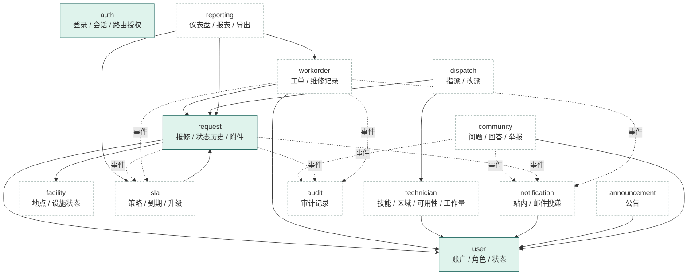
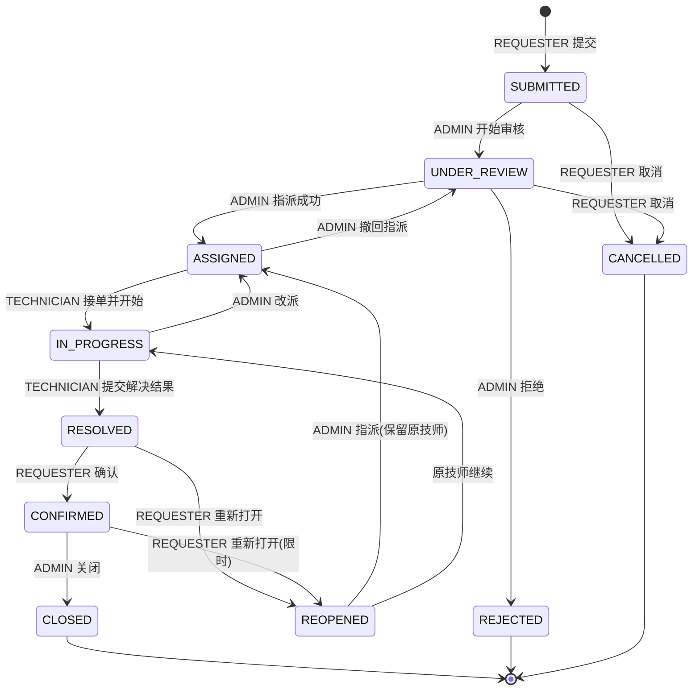
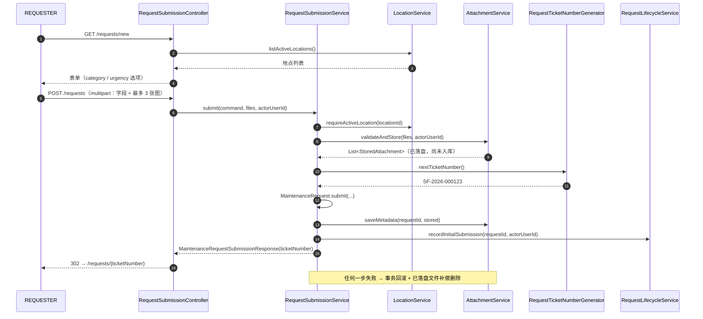
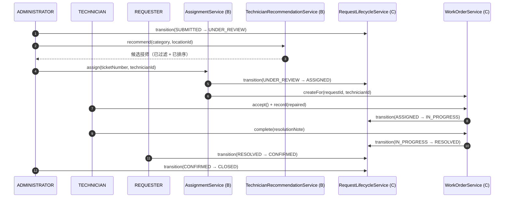
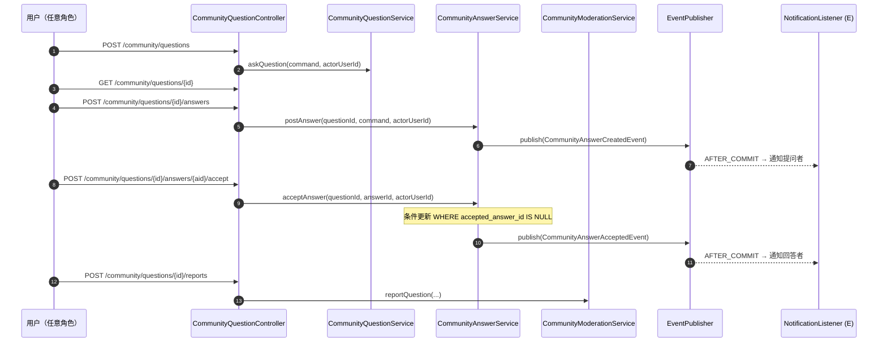
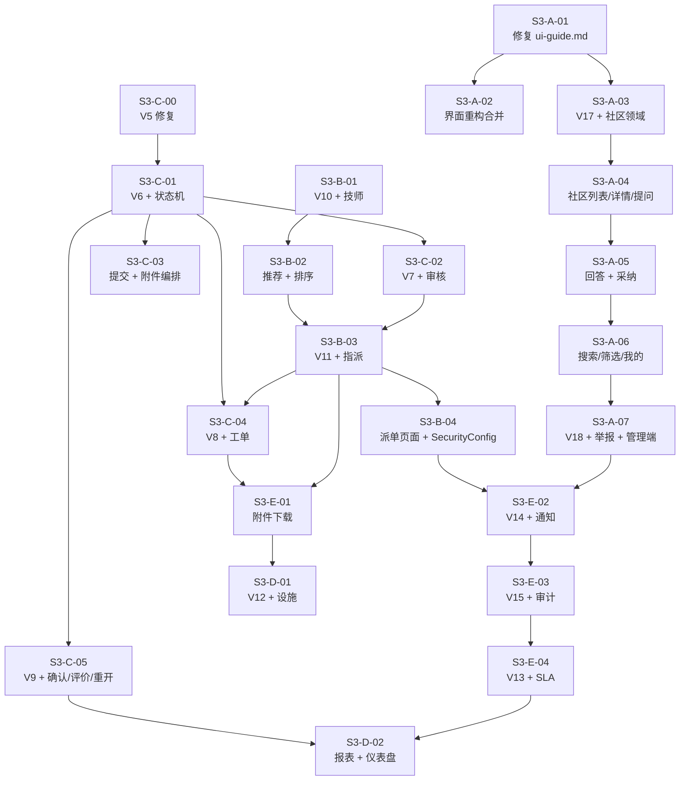

# SmartFix Sprint 3 开发规划 · 范围调整 · 模块分工 · 验收手册

[English version](SmartFix_Sprint3_Development_Plan_EN.md) | **简体中文**

> **文档状态：规划稿（Planning Draft）——未执行。**
> 本文档描述的是 **Sprint 3 将要做什么**，不是已经完成的功能。
> 文中每一个状态标记都对应仓库中的一份可核对证据；没有任何一项功能因为出现在本文档里
> 就变得已经实现。

> **⚠️ 范围变更说明：** 本次 Sprint 3 的范围与 Sprint 2 规划（`docs/sprint2/`）相比有
> **实质性调整**（详见 §4）：新增「社区故障问答」模块（User A）、维修确认/反馈/重新打开
> 由 User A 调整为 User C 负责、Sprint 4 只保留整改与云部署。**Sprint 2 的历史文档不改动**，
> 变更记录只写在本文件里。

---

## 目录

1. [文档定位、规划状态和证据基线](#1-文档定位规划状态和证据基线)
2. [Sprint 3 Goal](#2-sprint-3-goal)
3. [当前仓库完成度与 Sprint 2 遗留](#3-当前仓库完成度与-sprint-2-遗留)
4. [本次范围变更及社区新增需求](#4-本次范围变更及社区新增需求)
5. [角色与权限边界](#5-角色与权限边界)
6. [统一领域模型和状态流转](#6-统一领域模型和状态流转)
7. [项目目录及模块边界](#7-项目目录及模块边界)
8. [分层与命名规范](#8-分层与命名规范)
9. [完整候选类清单与负责人](#9-完整候选类清单与负责人)
10. [核心数据字典](#10-核心数据字典)
11. [输入限制与业务校验](#11-输入限制与业务校验)
12. [Service 契约及跨模块事件](#12-service-契约及跨模块事件)
13. [HTTP 路由与权限矩阵](#13-http-路由与权限矩阵)
14. [报修、工单、派单、社区核心流程](#14-报修工单派单社区核心流程)
15. [数据库迁移规划](#15-数据库迁移规划)
16. [附件、事务和数据一致性](#16-附件事务和数据一致性)
17. [A–E 人员分工与具体开发顺序](#17-ae-人员分工与具体开发顺序)
18. [共享文件和冲突管理](#18-共享文件和冲突管理)
19. [PR 拆分与合并依赖](#19-pr-拆分与合并依赖)
20. [两周执行计划与资源容量](#20-两周执行计划与资源容量)
21. [测试规划与验收矩阵](#21-测试规划与验收矩阵)
22. [DevSecOps 与安全检查](#22-devsecops-与安全检查)
23. [本地环境和配置依赖](#23-本地环境和配置依赖)
24. [Git 与 PR 规范](#24-git-与-pr-规范)
25. [Definition of Ready](#25-definition-of-ready)
26. [Definition of Done](#26-definition-of-done)
27. [完整 Demo 脚本](#27-完整-demo-脚本)
28. [风险、阻塞和范围调整机制](#28-风险阻塞和范围调整机制)
29. [Day 1 决策表](#29-day-1-决策表)
30. [可复制任务、PR、测试证据和回顾模板](#30-可复制任务pr测试证据和回顾模板)
31. [需求—任务—负责人—测试追踪表](#31-需求任务负责人测试追踪表)

---

## 1. 文档定位、规划状态和证据基线

### 1.1 这是什么

一份可以直接指导五名组员进入 Sprint 3 编码阶段的完整规划：目标、范围变更记录、类设计、
数据字典、Service 契约、路由权限、状态机、迁移登记、测试矩阵、人员分工、PR 拆分、
容量评估、Day 1 决策表和追踪表。

**读者：** 五名准备编码、但对 Sprint 3 新增的社区模块、状态机、SLA/通知/审计边界
还不完全清楚的组员。读完 §17 就能知道自己从哪里开始。

**它回答的问题：** Sprint 3 做什么、与 Sprint 2 规划相比改了什么、社区模块如何建模、
谁负责哪个模块的哪一层、状态怎么流转、迁移号怎么登记、通知和审计谁提供谁调用、
两周每天做什么、如何 Demo、还有哪些风险必须在 Day 1 决策。

### 1.2 本次核查基线（可复核）

| 项目 | 值 |
|---|---|
| 核查日期 | **2026-09-29** |
| 仓库路径 | `C:\Users\zhour\smartfix` |
| 当前分支 | `main` |
| 当前 HEAD | `de38d82` — `Merge pull request #11 from Lian9374/feature/SCRUM-UserE3-YUANJIAQI` |
| HEAD 提交时间 | 2026-09-25 10:18:38 +0800 |
| `origin/main` | 与本地 HEAD **一致**（`git rev-list --left-right --count origin/main...HEAD` = `0 0`） |
| 远程可达性 | `git fetch origin` **成功执行**，未返回任何新提交；本次规划基于本地可见状态，远程已同步 |
| 工作区 | **有未提交修改**（见 §3.4），本次规划**未**触碰这些文件 |

只读核查命令（本次实际执行，未做任何写操作）：

```bash
git status --short --branch
git branch --show-current
git remote -v
git log -10 --oneline
git fetch origin
git rev-list --left-right --count origin/main...HEAD
git diff --stat
```

### 1.3 状态标记约定

本文档对所有条目使用六种标记，**请严格遵守，不要把计划当成已完成**：

| 标记 | 含义 |
|---|---|
| **【仓库已存在】** | 已在 `origin/main`（即 `de38d82`）上，可逐文件核对 |
| **【本地待合并】** | 只存在于本地工作区，**尚未提交、尚未推送、尚未评审** |
| **【Sprint 3 计划新增】** | Sprint 3 计划新建（现在**不存在**） |
| **【待团队确认】** | 建议基线，需 Day 1 团队确认后冻结（可能写成 ADR） |
| **【范围外】** | Sprint 3 明确不做 |
| **【Sprint 4 交接】** | 不在 Sprint 3 展开，只登记交接边界 |

> **本文档本身只做规划。** 规划不产出代码、不产出 migration、不修改配置、不执行 commit/push。

### 1.4 证据分级（重要）

本文档把「存在」分成四个层次，**不允许混为一谈**：

| 层次 | 判据 | 例子 |
|---|---|---|
| ① 端到端可用 | 有 Controller 路由 + 页面 + 测试 | `GET /requests/mine` 列表 |
| ② 服务层已实现但无入口 | 有 Service/Repository/测试，**没有 Controller** | `AttachmentService.readAttachment`（无下载路由） |
| ③ 只有实体/DTO/测试 | 有类，但缺迁移或缺调用方 | `RequestStatusHistory`（**表不存在**） |
| ④ 只有文档描述 | 只在 `README`/`module-guide` 里写着 | `workorder`、`dispatch`、`sla`、`notification`、`reporting`、`announcement`、`audit` |

**规则：** ③ 和 ④ **不得**写成「已实现」。② 不得写成「功能已完成」，因为用户走不到它。

---

## 2. Sprint 3 Goal

### 2.1 Sprint Goal（唯一）

> **让三种角色都能走完 SmartFix 的主业务流程：报修用户提交并跟踪、技师接单并记录维修、
> 管理员审核派单并关闭；同时上线社区故障问答，让用户自助解决小故障。**

拆成两条可演示的闭环（Demo 见 §27）：

1. **正式报修维修闭环**：REQUESTER 提交 → ADMINISTRATOR 审核与派单 → TECHNICIAN 接单与维修 →
   用户确认 → 管理员关闭。
2. **社区自助闭环**：用户提问 → 他人回答 → 提问者采纳 → 关键词搜到该问题 → 举报 → 管理员处理。

### 2.2 Sprint 3 完成判据（最小）

| # | 判据 |
|---|---|
| G1 | `main` 上存在完整报修提交入口（页面 + POST 路由 + Service），且附件与提交在同一业务结果里 |
| G2 | `request_status_history` 表存在，每次状态变更都落一条历史，详情页可读 |
| G3 | 状态机至少支持 SUBMITTED → UNDER_REVIEW → ASSIGNED → IN_PROGRESS → RESOLVED → CONFIRMED → CLOSED，非法流转被拒绝 |
| G4 | 技师能被指派、改派，并拥有一个真实的工作页面 |
| G5 | 社区列表、详情、提问、回答、采纳、搜索、举报、管理员处理**全部可用** |
| G6 | 至少一条通知在业务提交后送达正确收件人；**回滚的业务不产生通知** |
| G7 | SLA 至少能对一条请求算出到期时间并在超时后标记 |
| G8 | 干净数据库从 V1 全量迁移成功；已在 Sprint 2 建库的数据库可平滑升级 |
| G9 | 三名角色各自的页面在 1440 与 390 宽度下无横向溢出，且都能用键盘走完主路径 |
| G10 | 全部新增测试在 `mvn clean verify` 下通过；PostgreSQL 集成测试按 README 的 opt-in 方式可运行 |

### 2.3 为什么是这个范围

- Sprint 2 交付的是**数据地基 + 只读查询**，业务闭环一个都没通（§3）。Sprint 3 必须把闭环
  走通，否则 Sprint 4 只剩部署，没有可部署的业务。
- 社区是**本次新增需求**（§4.2），独立于报修主链路，可以在主链路受阻时并行推进，
  是范围内风险最低的增量。
- 明确**不**把未完成业务推给 Sprint 4：Sprint 4 只做整改、稳定性完善和云服务器部署（§4.4）。

---

## 3. 当前仓库完成度与 Sprint 2 遗留

> 本节所有结论均可逐文件核对。核查日期 2026-09-29，分支 `main`，commit `de38d82`。

### 3.1 已经真正可用的部分【仓库已存在】

| # | 能力 | 证据（仓库相对路径） | 层次 |
|---|---|---|---|
| 1 | 账户模型与三值角色 | `src/main/java/com/smartfix/user/domain/User.java`、`Role.java`、`AccountStatus.java`；`db/migration/V2__create_users.sql` | ① |
| 2 | 密码策略（≥12 位含字母与数字） | `user/validation/PasswordPolicy.java`、`ValidPassword.java`、`PasswordConstraintValidator.java` | ① |
| 3 | 表单登录 + 会话 + CSRF | `auth/config/SecurityConfig.java`、`user/controller/LoginController.java` | ① |
| 4 | 停用账号在**下一次请求**被踢出 | `auth/security/ActiveAccountFilter.java`、`User.securityVersion` | ① |
| 5 | 管理员账号管理（建号/改角色/改状态） | `user/controller/UserManagementController.java`（`GET /admin/users`、`GET /new`、`POST`、`POST /{id}/role`、`POST /{id}/status`） | ① |
| 6 | 引导管理员（首次部署用） | `user/service/UserBootstrapService.java`、`user/config/BootstrapAdminProperties.java` | ① |
| 7 | Ticket Number 生成 `SF-YYYY-NNNNNN` | `request/service/RequestTicketNumberGenerator.java` + `db/migration/V4__create_maintenance_requests.sql` 的 `request_ticket_sequences`（含 `PESSIMISTIC_WRITE` 行锁） | ②（无调用方） |
| 8 | 报修实体与 DTO | `request/domain/MaintenanceRequest.java`、`MaintenanceCategory.java`、`UrgencyLevel.java`、`request/dto/*` | ② |
| 9 | 我的报修列表 + 详情查询 | `request/controller/RequestQueryController.java`、`request/service/RequestQueryService.java` | ① |
| 10 | 资源所有权检查（越权返回 404） | `request/service/RequestAccessService.java` | ① |
| 11 | 管理员只读代查 | `GET /admin/requests/lookup`（`RequestQueryController`） | ① |
| 12 | 地点数据 | `facility/domain/Location.java`、`facility/service/LocationService.java`、`db/migration/V3__create_locations.sql` | ②（无管理页面） |
| 13 | 附件校验 / 存储 / 元数据 / 授权读取 | `request/validation/AttachmentValidator.java`、`request/storage/LocalAttachmentStorageService.java`、`request/service/AttachmentService.java`、`db/migration/V5__create_request_attachments.sql` | ②（无 HTTP 入口） |
| 14 | 统一异常处理与错误页 | `common/exception/GlobalExceptionHandler.java`、`templates/error.html` | ① |
| 15 | 三类角色的首页与「我的报修」页面 | `templates/home.html`、`templates/request/mine.html`、`templates/request/detail.html`、`templates/admin/users.html`、`templates/admin/requests.html` | ① |
| 16 | Flyway V1–V5 | `src/main/resources/db/migration/` | ① |

### 3.2 关键缺口（Sprint 2 遗留），逐条给证据

| # | 缺口 | 证据 | 影响 |
|---|---|---|---|
| **K1** | **报修提交没有入口**：`SubmitMaintenanceRequestCommand`、`MaintenanceRequestSubmissionResponse` 存在，但**没有任何 Controller**，**没有** `templates/request/new.html` | `grep -rn "PostMapping" src/main/java` 只命中 `UserManagementController`；`SecurityConfig.java:49` 授权了 `POST /requests`，但没有映射 | 用户**无法提交报修**——整条主链路断在第一环 |
| **K2** | **`request_status_history` 表不存在**：实体、Repository、DTO 都在，迁移缺 V6 | `db/migration/` 只有 V1–V5；`V4__create_maintenance_requests.sql:12-14` 明确「reserves V5 for attachments and V6 for request_status_history」 | `RequestQueryService.getRequestDetails` 读该表 → **对 PostgreSQL 的详情页返回 500** |
| **K3** | **`RequestStatus` 只有 `SUBMITTED` 一个值** | `request/domain/RequestStatus.java`；`V4` 的 `chk_maintenance_requests_status CHECK (status IN ('SUBMITTED'))` | 状态机完全不存在；加值必须**同时**改 Java 枚举与 DB 约束 |
| **K4** | **附件下载没有生产 Controller** | `SecurityConfig.java:50` 授权 `GET /requests/*/attachments/*`，但 `src/main/java` 里没有任何 `*attachments*` 映射 | 用户看不到自己上传的图（`AttachmentService.readAttachment` 无入口） |
| **K5** | **两个 0 字节测试文件** | `src/test/java/com/smartfix/request/controller/AttachmentController.java`（0 字节）、`AttachmentControllerTest.java`（0 字节），均为 2026-09-25 建立 | 与 K4 对应：下载功能只完成了服务层 |
| **K6** | **TECHNICIAN 读不到任何报修** | `RequestAccessService.requireReadableRequest`：ADMINISTRATOR 放行；REQUESTER 且 `requesterId` 匹配放行；**其余（含 TECHNICIAN）一律 `notFound()`** | 技师登录后没有任何工作对象 |
| **K7** | **`workorder` / `dispatch` / `sla` / `notification` / `reporting` / `announcement` / `audit` 七个模块完全不存在** | `find src/main/java -type d` 无对应目录；`docs/module-guide.md` 只是**目标结构** | 这些是 Sprint 3 的主要工作量 |
| **K8** | **`push`/部署未验证**：`Jenkinsfile` 的 Security 阶段 `when { expression { false } }`，永久跳过 | `Jenkinsfile` 第 44-48 行 | 安全扫描**没有**运行过，不得声称已扫描（§22） |

### 3.3 一个必须 Day 1 处理的迁移缺陷（本次核查新发现）

> **`V5__create_request_attachments.sql` 在 `origin/main` 上不是合法 SQL。**

**证据（可复核）：**

```bash
git show HEAD:src/main/resources/db/migration/V5__create_request_attachments.sql | head -3
# 输出（前三行没有任何注释标记）：
============================================================
V5 - SmartFix Sprint 2, work category E (attachments)
============================================================
```

**同时**，工作区里这份文件是**改过的**（未提交）：

```bash
git diff --stat -- src/main/resources/db/migration/V5__create_request_attachments.sql
# → 1 file changed, 8 insertions(+), 4 deletions(-)，补回了 `-- ` 前缀与行尾换行
```

**为什么必须在 Sprint 3 之前解决：**

1. `V5` 是**已合并到 main 的迁移**。任何人在干净检出的仓库上跑 Flyway，都会在 V5 解析失败。
2. Sprint 3 要加 V6。**Flyway 按版本号顺序校验**，V5 内容对不上就轮不到 V6。
3. 一旦把修好的 V5 合并，文件内容改变 → 对它已经应用过的本地库会出现
   **checksum mismatch**。

**处理方式（Day 1 决策 D-06，不由规划者单方面决定）：**

- 由 **C（迁移协调）** 单独开一个「迁移修复」PR，**只**补 `-- ` 前缀与行尾换行，**不**改任何 DDL。
- V1–V4 **绝不修改**。
- 每个本地已应用过 V5 的成员，自行用**一种**方式对齐（三选一，团队统一）：手动订正本机
  `flyway_schema_history` 中 V5 的 checksum、或删除 V5 建的表与其历史行后重跑、或按
  §23 的干净库路径重建**本地**数据库。
- **不要**把 `docker compose down -v`、删库或 `flyway clean` 当成日常解决手段（§15.4）。

### 3.4 本地未提交的工作【本地待合并】

`git status --short` 显示以下内容**尚未提交、尚未推送**（本次规划**未**修改它们）：

| 类别 | 文件 |
|---|---|
| 已修改（tracked） | `CONTRIBUTING.md`、`README.md`、`auth/controller/LoginController.java`、`common/web/HomeController.java`、`db/migration/V5__create_request_attachments.sql`、`static/css/site.css`、`templates/admin/requests.html`、`templates/admin/users.html`、`templates/error.html`、`templates/home.html`、`templates/login.html`、`templates/request/detail.html`、`templates/request/mine.html`、`auth/AuthenticationFlowIT.java`、`auth/config/SecurityConfigTest.java`、`common/web/HomeControllerTests.java` |
| 未跟踪（untracked） | `docs/ui-guide.md`、`common/web/NavigationAdvice.java`、`static/images/`、`templates/fragments/`、`test/java/com/smartfix/request/web/`、`start-smartfix.ps1` |

**这是一次界面重构工作**（登录页、应用外壳、首页结构、空状态、共享片段与设计令牌）。
它对 Sprint 3 的意义：

- ✅ **正面**：`templates/fragments/`、`NavigationAdvice`、`site.css` 令牌体系是 Sprint 3
  所有新页面可以**直接复用**的资产。社区页面、工单页面、SLA 页面都应基于它，而不是另起一套。
- ⚠️ **风险**：`docs/ui-guide.md` **已经与模板脱节**。它记载的片段是
  `layout :: sidebar` / `layout :: topbar` 与 `components :: pageHeading`，而
  `templates/fragments/layout.html` 现在同时存在 `sidebar(active)`（第 121 行）与
  `appbar(active)`（第 194 行），**`topbar` 片段已不存在**；`components.html` 的页面标题
  片段名是 `pageHeading`，容器类名是 `.page-head`。
  → 成员若照 `ui-guide.md` 写页面会**直接 500**。**这是 A 在 Day 1/Day 2 的第一优先级**
  （S3-A-01）。
- ⚠️ **判定**：这份工作**不得**被当成「已验收」。它记为
  **【本地待合并】**，需要走独立 PR + 评审 + 合并之后才算数。

### 3.5 测试资产现状【仓库已存在】

`src/test/java` 下共 **25 个测试文件**，其中：

- **2 个是 0 字节占位文件**（`request/controller/AttachmentController.java`、
  `AttachmentControllerTest.java`）——**不是测试**，见 K5。
- **1 个未跟踪**：`request/web/RequestPagesRenderingIT.java`（随 §3.4 的界面工作一起，属【本地待合并】）。
- 其余 22 个已在 `origin/main` 上。

测试分层（沿用 `docs/testing-guide.md`）与现有分布：

| 层次 | 已有代表 |
|---|---|
| 单元（JUnit 5 + Mockito） | `user/service/UserServiceTest`、`request/service/RequestAccessServiceTest`、`request/service/RequestQueryServiceTest`、`request/domain/MaintenanceRequestTest`、`request/validation/AttachmentValidatorTest`、`facility/service/LocationServiceTest` |
| Web / Controller | `user/controller/UserManagementControllerTest`、`request/controller/RequestQueryControllerTest`、`common/web/HomeControllerTests` |
| 安全 | `auth/config/SecurityConfigTest`、`auth/security/ActiveAccountFilterTest` |
| 集成（`*IT`，Failsafe） | `auth/AuthenticationFlowIT`、`common/MigrationIT`、`request/repository/AttachmentPersistenceIT` |
| 渲染 | `request/web/RequestPagesRenderingIT`（【本地待合并】） |

> **本次规划没有运行任何测试，因此本文档不报告任何通过数量、覆盖率或 CI 结果。**
> 需要数字时，按 §21.5 的命令自行运行并把真实输出贴进 PR。

### 3.6 Sprint 2 遗留清单（Sprint 3 必须收口）

| # | 遗留项 | 谁收口 | 对应任务 |
|---|---|---|---|
| L1 | **V5 迁移文件非法**（§3.3）——**阻塞所有后续迁移** | C | **S3-C-00** |
| L2 | `request_status_history` 缺表（K2） | C | S3-C-01 |
| L3 | 状态枚举只有 `SUBMITTED`（K3） | C | S3-C-01 |
| L4 | 报修提交无入口（K1） | C | S3-C-03 |
| L5 | 附件下载无入口 + 两个 0 字节占位文件（K4、K5） | E | S3-E-01 |
| L6 | 技师读不到被指派给自己的请求（K6） | B + C | S3-B-06 |
| L7 | 技师无资料与工作台（K6/K7） | B + C | S3-B-01 / S3-C-04 |
| L8 | `ui-guide.md` 与现实脱节（§3.4）——**阻塞全员的页面工作** | A | **S3-A-01** |
| L9 | 界面重构未合并（§3.4） | A | S3-A-02 |
| L10 | 地点无管理界面（§3.1 #12） | D | S3-D-01 |
| L11 | `Jenkinsfile` Security 阶段永久跳过（K8） | E | S3-E-07 |

> **任务号对照（全文统一）：** 正文实际使用的任务号是
> `S3-A-01..07`、`S3-B-01..04` 与 `S3-B-06`、`S3-C-00..06`、`S3-D-01..05`、`S3-E-01..05` 与 `S3-E-07`。
> 完整的任务号 ↔ PR ↔ 每日计划对照见 **§17.7**。这些编号在 §17 的 PR 表、§19 的合并依赖图
> 与 §20 的每日计划中**使用同一套含义**，请勿另起编号。
>
> ⚠️ **这些是本文件自编的任务号，不是 Jira Issue ID。**

---

## 4. 本次范围变更及社区新增需求

> **本节是 Sprint 3 的权威变更记录。** Sprint 2 的规划文档（`docs/sprint2/`）**不修改**；
> 凡两者冲突之处，以本文件为准。

### 4.1 变更总表

| # | 变更 | 从 | 到 | 理由 |
|---|---|---|---|---|
| **C-1** | Sprint 3 定位 | 部分业务功能 | **完成已确认范围内的剩余业务功能**，形成两条可演示闭环 | 用户明确调整 |
| **C-2** | Sprint 4 定位 | 继续开发业务 | **只做最终整改、稳定性完善、云服务器部署** | 不再把未完成业务推给 Sprint 4 |
| **C-3** | **新增模块** | 无 | **社区故障问答**（`com.smartfix.community`），负责人 **A** | 本次**用户新增需求** |
| **C-4** | 社区业务边界 | — | 电脑 / 软件 / 网络 / 外设等**小故障**；其他用户、技师、管理员可回答 | 用户明确 |
| **C-5** | 维修确认 / 反馈 / 重新打开 | User A | **User C** | 与 C 负责的请求状态流转天然同属一条链 |
| **C-6** | A 的 UI 职责 | A 承担全部页面实现 | **A 负责共享视觉规范 + 社区页面**；各成员实现**自己**的页面 | 避免单点瓶颈 |
| **C-7** | 正式角色 | 三个 | **保持三个**（REQUESTER / TECHNICIAN / ADMINISTRATOR） | 不新增 `FACILITY_OFFICER`、不新增 `MODERATOR` |
| **C-8** | 规划文档 | — | 新增 `docs/sprint3/SmartFix_Sprint3_Development_Plan_{CN,EN}.md` | 本次产出 |

### 4.2 社区模块的**需求来源声明**（必须共同遵守）

> **社区故障问答是本次（Sprint 3）由用户新提出的需求。**
>
> 它**不是** `README.md` / `README.zh-CN.md` 已经包含的功能，
> **也不是**课程已经批准的范围，
> **更不是** `docs/module-guide.md` 里已经规划过的模块
> （该文档的目标模块列表为 `common` `auth` `user` `request` `workorder` `dispatch`
> `sla` `facility` `notification` `reporting` `announcement` `audit`，**没有** community）。
>
> 因此：**任何文档、报告、Demo 或汇报都不得把社区描述成「原计划功能」或「课程已批准范围」。**
> 它的正确表述是「Sprint 3 新增需求」，并应在 Sprint Review 上作为**范围变更**明确说明。

### 4.3 社区新增需求的范围定义

**用户可以问什么（业务语汇，不是错误信息）：**

- 电脑无法启动 / 运行卡顿
- 软件安装或运行问题
- Wi-Fi 或网络连接问题
- 打印机、鼠标、键盘等外设问题
- 常见设备的小故障

**谁能回答：** 所有**账号状态为 ACTIVE** 的 REQUESTER、TECHNICIAN、ADMINISTRATOR。

**社区帖子不是 `MaintenanceRequest`。** 明确禁止：

- 不自动生成 Ticket Number
- 不自动生成 WorkOrder / Assignment / SLA
- 不写入 `maintenance_requests` 表
- 个人设备问题**不**自动进入校园设施维修范围

> **一句话：** 社区是**独立聚合**，它与报修之间**只有人的身份**是共享的（`users.id`）。

#### 4.3.1 社区第一版（v1）必须做清单

> 下表就是 §31 追踪表里「见 §4.3 清单」所指的清单。
> **有负责人、有验收标准的条目才计入 v1**；没有写进本表的社区功能一律视为范围外。

| # | v1 必须做 | 负责人 | 落地位置 |
|---|---|---|---|
| 1 | 问题列表 | A | `community/controller/CommunityQuestionController` |
| 2 | 分页（默认 10、上限 50） | A | `CommunityQueryService.browse` |
| 3 | 关键词搜索（标题**与**正文，大小写不敏感） | A | `CommunityQuestionRepository` 查询方法 |
| 4 | 分类筛选（5 值） | A | 同上 |
| 5 | `最新` / `待解决` / `已解决` 三种筛选 | A | `CommunityQueryService.browse` 的 `filter` |
| 6 | 发布问题 | A | `CommunityQuestionService.askQuestion` |
| 7 | 查看问题与答案列表 | A | `CommunityQuestionController` 详情页 |
| 8 | 编辑自己的问题 | A | `CommunityQuestionService.editQuestion` |
| 9 | 回答 / 编辑自己的回答 | A | `CommunityAnswerService.postAnswer` / `editAnswer` |
| 10 | 「我的提问」 | A | `CommunityQueryService.myQuestions` |
| 11 | 「我的回答」 | A | `CommunityQueryService.myAnswers` |
| 12 | 采纳 / 取消采纳 | A | `CommunityAnswerService.acceptAnswer` / `removeAcceptance` |
| 13 | 举报问题或回答 | A | `CommunityModerationService.reportQuestion` / `reportAnswer` |
| 14 | 管理员处理举报：隐藏 / 恢复 | A | `CommunityModerationService.resolveReport` / `hide*` / `restore*` |
| 15 | 新回答与被采纳的站内通知 | A 发布事件 → E 投递 | `CommunityAnswerCreatedEvent` / `CommunityAnswerAcceptedEvent` |
| 16 | **服务端**权限检查（不依赖页面隐藏） | A | Service 层所有权检查（§5.4） |
| 17 | 页面、迁移（**V17**：`community_questions` + `community_answers`；**V18**：`community_reports`）与测试 | A | §15、§21.3 的 AC-8..AC-14 |

**明确不在 v1 清单内：** 私信、关注、积分、排行榜、点赞、AI 自动回答、富文本编辑器、
社区帖子自动转报修、任何新的社交身份系统。这些在 §4.5 登记为范围外。

**社区图片不在本表内**，它是【待团队确认】的扩展项（D-10，见 §4.5）。

### 4.4 Sprint 4 的边界（只登记，不展开）

Sprint 4 **只**包含：

| # | Sprint 4 范围 | Sprint 3 需交接什么 |
|---|---|---|
| S4-1 | 最终整改（缺陷、可用性、文案、无障碍） | 缺陷清单 + 已知未修项（§28） |
| S4-2 | 稳定性完善（并发、异常、幂等、日志） | 并发测试结果 + 已知薄弱点（§21.4） |
| S4-3 | 云服务器部署（容器化、外部数据库、HTTPS、环境变量） | 可运行的 `Dockerfile` / `docker-compose.yml` / `Jenkinsfile` + 完整环境变量清单（§23.2） |

**Sprint 3 不得**把范围内的业务功能静默移交给 Sprint 4。若确实无法完成，走 §28 的
范围调整机制，并写进 Sprint Review 的「未完成事项诚实清单」。

### 4.5 明确**不**做的范围

| 项 | 判定 | 说明 |
|---|---|---|
| 私信 / 关注 / 积分 / 排行榜 / 点赞 | 【范围外】 | 社区第一版不做社交化 |
| AI 自动回答 | 【范围外】 | 不引入任何模型调用 |
| 富文本编辑器 | 【范围外】 | 纯文本 + 转义（§11.4） |
| 社区图片 | **【待团队确认】** | 见下 |
| 自动把社区帖子转报修 | 【范围外】 | 两个聚合不互相创建 |
| 新的社交身份系统 | 【范围外】 | 复用 `users` |
| `FACILITY_OFFICER` / `MODERATOR` 角色 | 【范围外】 | 管理动作由 ADMINISTRATOR 承担 |
| 微服务 / K8s / 新前端框架 / JWT | 【范围外】 | 架构约束（§7.1） |

**社区图片特别说明（【待团队确认】，D-10）：**

- **不得**直接把社区图片写进 `request_attachments`——该表的 `request_id` 是
  `NOT NULL` 且外键指向 `maintenance_requests`，复用会让社区帖子被强制挂到一条报修上。
- 若 Day 1 确认必做，**必须**规划独立元数据表 + 独立授权策略，**只**在存储层
  （`AttachmentStorageService` 的能力）上做复用，并**单独估算工作量**。
- 第一版建议：**不做**。理由：社区是文本问答，图片是扩展而非核心。

---

## 5. 角色与权限边界

### 5.1 正式角色只有三个（不变）

| 角色 | 典型行为 | Sprint 3 新增能力 |
|---|---|---|
| **REQUESTER** | 报修、跟踪、确认、评价 | 提交报修（K1 收口）、确认解决、评价、重新打开、使用社区 |
| **TECHNICIAN** | 接单、维修、记录 | **首次拥有真实工作对象**（K6 收口）：查看被指派的请求、接单、记录维修、提交解决结果、使用社区 |
| **ADMINISTRATOR** | 管理、审核、派单、监控 | 审核与最终优先级、指派/改派、关闭、SLA 配置、报表、公告、社区举报处理 |

> **不新增 `FACILITY_OFFICER`。不新增 `MODERATOR`。**
> `Role.java` 的三值枚举**保持不变**；社区的「举报处理」是 **ADMINISTRATOR** 的能力，
> 用现有角色表达，不新建角色。

### 5.2 权限边界一句话总结

| 主体 | 边界 |
|---|---|
| 匿名用户 | 只能到 `/login`、静态资源、`/actuator/health`。访问社区 → 302 到登录页 |
| ACTIVE REQUESTER | 自己的报修（读、确认、评价、重新打开）；社区的读 + 写自己内容 + 采纳自己的问题 |
| ACTIVE TECHNICIAN | **被指派给自己**的报修（读、接单、记录、提交结果）；社区的读 + 写 |
| ACTIVE ADMINISTRATOR | 全部报修；用户管理；派单；SLA；报表；公告；社区内容管理（隐藏/恢复/处理举报） |
| DISABLED（任意角色） | **全部拒绝**。`ActiveAccountFilter` 在下一次请求踢出（已有测试：`ActiveAccountFilterTest.accountChangesInvalidateSessionAndPreventControllerAccess`，其参数化用例 `changedAccounts()` 已包含 `AccountStatus.DISABLED`） |

### 5.3 三条铁律

1. **`navRole` 只决定「显示什么」，永远不决定「允许什么」。** 授权只在
   `SecurityConfig` + Service 层所有权/状态检查里（沿用 `docs/ui-guide.md` 的原则）。
2. **作者身份只来自认证上下文**（`SmartFixUserDetails.getUserId()`），
   **绝不**从表单字段读取 `authorId` / `requesterId` / `actorId`。
3. **越权读取一律返回 404，不是 403。** 沿用 `RequestAccessService` 的既有语义，
   避免暴露「该资源存在」。

### 5.4 权限矩阵（Sprint 3 完整版）

图例：✅ 允许 ｜ ⛔ 拒绝（403 或 404）｜ 🔒 仅限本人/本人相关 ｜ ⚙️ 需要额外前置条件

| 能力 | 匿名 | REQUESTER | TECHNICIAN | ADMIN |
|---|---|---|---|---|
| 浏览社区问题列表 / 详情 | ⛔ (D-04) | ✅ | ✅ | ✅ |
| 搜索 / 分类筛选 / 状态筛选 | ⛔ (D-04) | ✅ | ✅ | ✅ |
| 发布问题 | ⛔ | ✅ | ✅ | ✅ |
| 回答问题 | ⛔ | ✅ | ✅ | ✅ |
| 编辑问题 / 回答 | ⛔ | 🔒 本人 | 🔒 本人 | 🔒 本人 |
| 撤回自己的问题 / 回答 | ⛔ | 🔒 本人 | 🔒 本人 | 🔒 本人 |
| 采纳一条回答 | ⛔ | 🔒 本人的问题 ⚙️ | 🔒 本人的问题 ⚙️ | ⛔ **不代采纳** |
| 取消采纳 | ⛔ | 🔒 本人的问题 | 🔒 本人的问题 | ⛔ |
| 举报问题 / 回答 | ⛔ | ✅ | ✅ | ✅ |
| 处理举报 / 隐藏 / 恢复 | ⛔ | ⛔ | ⛔ | ✅ |
| 提交报修 | ⛔ | ✅ | ⛔ | ⛔ |
| 我的报修列表 | ⛔ | ✅ | ⛔ | ⛔ |
| 查看单条报修 | ⛔ | 🔒 本人 | 🔒 被指派给自己 | ✅ 全部 |
| 审核 / 设最终优先级 | ⛔ | ⛔ | ⛔ | ✅ |
| 指派 / 改派技师 | ⛔ | ⛔ | ⛔ | ✅ |
| 接单 / 开始维修 / 记录维修 | ⛔ | ⛔ | 🔒 被指派给自己 | ⛔ |
| 确认解决 / 评价 / 重新打开 | ⛔ | 🔒 本人的请求 | ⛔ | ⛔ |
| 关闭请求 | ⛔ | ⛔ | ⛔ | ✅ |
| 用户管理 | ⛔ | ⛔ | ⛔ | ✅ |
| SLA 策略配置 | ⛔ | ⛔ | ⛔ | ✅ |
| 报表 / 仪表盘 | ⛔ | ⛔ | 🔒 仅自己的工作量 | ✅ |
| 公告发布 / 撤下 | ⛔ | ⛔ | ⛔ | ✅ |
| 站内通知中心 | ⛔ | 🔒 本人 | 🔒 本人 | 🔒 本人 |
| 审计记录读取 | ⛔ | ⛔ | ⛔ | ✅ |

> **关于管理员不代采纳：** §8.3 明确「管理员不冒充提问者采纳答案」。
> 管理员可以**隐藏**一条被采纳的回答，但由此触发的「清除采纳」是**系统副作用**，
> 不是管理员在替提问者做决定。

---

## 6. 统一领域模型和状态流转

### 6.1 聚合边界（Sprint 3 目标形态）



- **实线** = 编译期依赖，只能**指向对方的公开 Service**。
- **点线** = 应用内事件（发布方不知道订阅方）。**禁止反向依赖**：
  `community` 不依赖 `notification`，`notification` 依赖 `community` 的事件类型——单向。
- **禁止循环依赖。** 若出现 A→B→A，停下来重新设计（`docs/module-guide.md` 第 1 条）。

### 6.2 报修状态机（【待团队确认】，D-07 冻结）

> **这是待冻结设计，不是既有事实。** 当前代码里 `RequestStatus` 只有 `SUBMITTED`（K3）。



**状态取值（10 个，含 3 个终态）：**

`SUBMITTED` `UNDER_REVIEW` `ASSIGNED` `IN_PROGRESS` `RESOLVED` `CONFIRMED` `REOPENED`
`CLOSED` `REJECTED` `CANCELLED`

> 注意是 **10 个枚举值**：`REOPENED` 计入，终态 3 个为 `CLOSED` / `REJECTED` / `CANCELLED`。
> `VARCHAR(20)` 足够容纳最长的 `UNDER_REVIEW`（12 字符）。

### 6.3 状态转换表（每个转换都要有角色、前置、失败条件、历史、SLA、通知）

| # | From → To | 操作角色 | 前置条件 | 失败条件（拒绝） | 历史 | SLA 影响 | 通知 / 审计 |
|---|---|---|---|---|---|---|---|
| T01 | `SUBMITTED` → `UNDER_REVIEW` | ADMIN | 请求存在；当前状态为 `SUBMITTED` | 状态已变（并发） | 记一条 | 开始**受理计时** | 通知提交人「已受理」/ 审计 |
| T02 | `SUBMITTED`/`UNDER_REVIEW` → `CANCELLED` | REQUESTER（仅本人） | 本人是 requester；状态 ∈ {SUBMITTED, UNDER_REVIEW} | 已进入维修中；非本人 | 记一条 | **停止**计时 | 通知 ADMIN / 审计 |
| T03 | `UNDER_REVIEW` → `ASSIGNED` | ADMIN | 已选定 TECHNICIAN；该技师 ACTIVE 且满足硬性条件（§14.3） | 技师停用 / 不满足硬条件 / 并发改派 | 记一条 | 开始**响应计时** | 通知技师 + 提交人 / 审计 |
| T04 | `UNDER_REVIEW` → `REJECTED` | ADMIN | 有拒绝理由（必填，≤500） | 无理由 | 记一条 | **停止**计时 | 通知提交人 / 审计 |
| T05 | `ASSIGNED` → `IN_PROGRESS` | TECHNICIAN（被指派人） | 是当前被指派技师；状态 `ASSIGNED` | 非被指派技师；状态不符 | 记一条 | 开始**解决计时** | 通知提交人 / 审计 |
| T06 | `ASSIGNED` → `UNDER_REVIEW` | ADMIN | 撤回指派（改派前） | — | 记一条 | 响应计时**暂停** | 通知原技师 / 审计 |
| T07 | `IN_PROGRESS` → `ASSIGNED` | ADMIN | 改派：选定新技师 | 新技师不满足硬性条件 | 记一条 | 改派原因入审计 | 通知新旧技师 + 提交人 / 审计 |
| T08 | `IN_PROGRESS` → `RESOLVED` | TECHNICIAN（被指派人） | 已填写解决说明（必填）；工单存在 | 无说明；工单未完成 | 记一条 | **停止**解决计时 | 通知提交人「待确认」/ 审计 |
| T09 | `RESOLVED` → `CONFIRMED` | REQUESTER（仅本人） | 本人是 requester；状态 `RESOLVED` | 非本人；状态不符 | 记一条 | 进入**确认计时** | 通知 ADMIN + 技师 / 审计 |
| T10 | `CONFIRMED` → `CLOSED` | ADMIN | 状态 `CONFIRMED` | — | 记一条 | **关闭**所有计时 | 通知提交人 / 审计 |
| T11 | `RESOLVED`/`CONFIRMED` → `REOPENED` | REQUESTER（仅本人） | 本人是 requester；在允许窗口内（D-08） | 超出窗口；已 `CLOSED` | 记一条 | **重启**解决计时 | 通知 ADMIN + 技师 / 审计 |
| T12 | `REOPENED` → `ASSIGNED` | ADMIN | 选定技师（默认保留原技师） | 原技师已停用 → 必须改派 | 记一条 | 重置响应计时 | 通知技师 / 审计 |
| T13 | `REOPENED` → `IN_PROGRESS` | TECHNICIAN（原被指派人，若仍 ACTIVE） | 原指派仍有效 | 原技师停用 | 记一条 | 继续解决计时 | 通知提交人 / 审计 |

**非法流转示例（必须被拒绝，且要有测试）：**

- `CLOSED` → 任何状态（终态不可变）
- `SUBMITTED` → `RESOLVED`（跳步）
- REQUESTER 执行 T03（角色不符）
- TECHNICIAN 执行 T09（角色不符）
- 在 `IN_PROGRESS` 上执行 T01（状态不符）

### 6.4 状态机实现约束（三条硬规定）

1. **单一事实来源**：状态只存在 `maintenance_requests.status` 一列。
   `request_status_history` 是**审计轨迹**，不是状态来源。任何「从历史推导当前状态」的写法都是缺陷。
2. **所有转换走同一个入口**：
   `RequestLifecycleService.transition(ticketNumber, targetStatus, actorUserId, comment)`。
   **禁止**在任何 Controller 或 Service 里直接 `request.setStatus(...)`。
3. **并发安全**：转换使用**乐观锁**（`maintenance_requests.version`，新增列）或
   **条件更新**（`UPDATE ... WHERE id = ? AND status = ?`），二者择一，不得依赖
   「先读后写」。二次提交同一转换必须返回业务冲突，而不是静默成功。

### 6.5 请求状态 ↔ 工单状态的对应关系（【待团队确认】）

**两个状态机不能互相覆盖。** 建议：

| `maintenance_requests.status` | `work_orders.status` | 说明 |
|---|---|---|
| `ASSIGNED` | `CREATED` | 指派成功即建工单 |
| `IN_PROGRESS` | `IN_PROGRESS` | 技师接单 |
| `IN_PROGRESS` | `ON_HOLD` | 缺料等暂停（**不**改请求状态） |
| `RESOLVED` | `COMPLETED` | 技师提交解决结果 |
| `REOPENED` | `REOPENED` | 重新打开时工单回到可编辑 |
| `CLOSED` | `CLOSED` | 终态 |

> **规则：** 请求状态是**主**，工单状态是**从**。工单状态只能由 `workorder` 模块改，
> 由 `workorder` **请求** `request` 模块执行一次状态转换——**不允许** `workorder`
> 直接写 `maintenance_requests`。

### 6.6 社区内容状态（最小模型）

**只有两个状态维度，且刻意不合并：**

| 维度 | 取值 | 谁改 |
|---|---|---|
| `CommunityContentStatus`（问题与回答共用） | `VISIBLE` / `HIDDEN` / `WITHDRAWN` | 作者可 `WITHDRAWN`；ADMIN 可 `HIDDEN` ↔ `VISIBLE` |
| **是否已解决** | **不存列**，由 `community_questions.accepted_answer_id IS NOT NULL` **推导** | 由采纳/取消采纳改变 |

**为什么「是否解决」不建列（§6.6 的核心决定）：**

- 若同时存在 `solved` 布尔列与 `accepted_answer_id`，两者**必然**会在某次并发或异常路径后
  互相矛盾。规则是「一条被采纳的回答 = 已解决」，那就只保留 `accepted_answer_id`。
- 隐藏/撤回**已采纳**回答时，在**同一事务**里
  `UPDATE community_questions SET accepted_answer_id = NULL WHERE id = ?`，
  解决状态自动跟随，**不存在需要同步的第二个字段**。
- 「Unanswered」筛选（§8.2 列表筛选）= `accepted_answer_id IS NULL AND status = 'VISIBLE'`。
  「Solved」= `accepted_answer_id IS NOT NULL`。

**三个不同的概念，不得混用：**

| 概念 | 是什么 | 第一版 |
|---|---|---|
| **内容隐藏 / 撤回** | 内容是否还能被公开看到 | ✅ 做 |
| **是否已解决** | 提问者是否采纳了一条回答 | ✅ 做（推导） |
| **关闭回答（不再接受新回答）** | 一个独立的生命周期开关 | ❌ **不做**（D-09） |

> **为什么不做「关闭回答」：** 第一版没有任何真实场景需要它（没有私信、没有长期归档策略），
> 造出来就是一个**没有用途的状态**。明确不做，而不是先建了再说。

### 6.7 社区规则清单（每条都要有实现与测试）

| # | 规则 | 落点 |
|---|---|---|
| R1 | 作者 ID 只从认证身份获取，**不信任**表单的 `authorId` | Controller 不绑定该字段；Service 从 principal 取 |
| R2 | 同一问题**最多一条**采纳答案 | `community_questions.accepted_answer_id` 单列 + 条件更新 |
| R3 | 采纳的答案**必须属于该问题** | 复合外键（§10.1）**与** Service 双重校验 |
| R4 | `HIDDEN` 或 `WITHDRAWN` 的回答**不能被采纳** | Service 校验 `answer.status == VISIBLE` |
| R5 | 并发两次采纳 → 仍保持一致 | 条件更新 `WHERE accepted_answer_id IS NULL AND status='VISIBLE'`；影响行数 0 → `BusinessConflictException` |
| R6 | 隐藏/撤回**已采纳**回答 → **原子**清除采纳并更新解决状态 | 同一 `@Transactional` 内：清 `accepted_answer_id` + 置回答状态 + 记审计 |
| R7 | 内容撤回与管理员隐藏**保留必要记录**，**不级联删除**他人回答 | 逻辑状态，不做 `ON DELETE CASCADE`；隐藏问题**不**删其回答 |
| R8 | 管理员**不静默改写**用户正文 | 管理接口只有「改状态」，**没有**「改 body」 |
| R9 | 默认**纯文本**渲染并转义，**不允许**任意 HTML | Thymeleaf `th:text`，**禁用** `th:utext`；加渲染测试断言 `<script>` 被转义 |
| R10 | 长度、分页上限、防重复提交规则 | §11.3、§11.5 |
| R11 | **是否允许作者采纳自己的回答** | **【待团队确认】D-05**，建议基线：**不允许** |
| R12 | 举报需要类型、原因、处理状态、处理人、处理时间 | `community_reports` 五列齐全（§10.3） |
| R13 | 隐藏内容的列表 / 详情 / 搜索采用**一致**规则 | 见 §6.8 |
| R14 | 问题与回答的作者本人**能看到**自己已隐藏/撤回的内容 | 详情页按作者身份放行 |

### 6.8 隐藏 / 撤回内容的可见性与搜索规则（R13 展开）

| 场景 | 列表 | 详情 | 搜索 | 管理员 |
|---|---|---|---|---|
| 问题 `VISIBLE` | 可见 | 可见 | 命中 | 可见 |
| 问题 `WITHDRAWN`（作者撤回） | **不出现** | 作者本人可见（带提示），他人 404 | **不命中** | 可见（管理视图） |
| 问题 `HIDDEN`（管理隐藏） | **不出现** | 作者本人可见（带提示），他人 404 | **不命中** | 可见，可恢复 |
| 回答 `WITHDRAWN` | 不显示正文，显示占位「This answer was withdrawn.」 | 同上 | 不参与搜索 | 可见 |
| 回答 `HIDDEN` | 不显示正文，显示占位「This answer is hidden.」 | 同上 | 不参与搜索 | 可见，可恢复 |

> **一致性铁律：** 一条 SQL 过滤条件（`status = 'VISIBLE'`）必须在列表、详情、搜索、
> 计数**四处**都出现。推荐把它收敛到 `CommunityQueryService` 的一个私有谓词方法里，
> 而不是在四个地方各写一遍。

---

## 7. 项目目录及模块边界

### 7.1 架构约束（不得引入）

沿用 `ADR-001`、`README.md`、`docs/module-guide.md` 已确认的基线：

| 约束 | 值 |
|---|---|
| 语言 / 版本 | Java 21 |
| 框架 | Spring Boot 3.5.x（当前 `pom.xml`：**3.5.4**） |
| 构建 | Maven |
| Web | Spring MVC + Thymeleaf（服务端渲染） |
| 持久化 | Spring Data JPA |
| 安全 | Spring Security（会话认证） |
| 数据库 | PostgreSQL（开发/生产）/ H2（测试，`MODE=PostgreSQL`） |
| 迁移 | Flyway |
| 形态 | **Modular Monolith**，一个应用、一个数据库、一个可部署单元 |
| 分包 | **Package by Business Feature**，模块内再分层 |
| 调用链 | Controller → Service → Repository |
| `ddl-auto` | **保持 `none`** |

**Sprint 3 不引入：** 微服务、Kubernetes、新的 React/Vue 前端、JWT 认证、
为展示设计模式而制造的复杂抽象、消息中间件、外部搜索服务。

### 7.2 模块与包结构（Sprint 3 目标）

```
com.smartfix
├── SmartFixApplication                      【仓库已存在】
├── auth/                                    【仓库已存在】
│   ├── config/SecurityConfig
│   ├── controller/LoginController
│   ├── security/{ActiveAccountFilter, SmartFixUserDetails}
│   └── service/SmartFixUserDetailsService
├── user/                                    【仓库已存在】A 维护
│   ├── config/  controller/  domain/  dto/  repository/  service/  validation/
├── request/                                 【仓库已存在】C（生命周期）+ E（附件层）
│   ├── config/AttachmentProperties
│   ├── controller/  Request*Controller   ← C
│   ├── controller/  AttachmentController ← E（【Sprint 3 计划新增】）
│   ├── domain/      MaintenanceRequest / RequestStatus / RequestStatusHistory ← C
│   ├── domain/      Attachment ← E
│   ├── dto/  repository/  service/  storage/  validation/
├── facility/                                【仓库已存在】D 扩展
├── common/                                  【仓库已存在】只放真正的横切基础设施
├── technician/                              【Sprint 3 计划新增】B
├── dispatch/                                【Sprint 3 计划新增】B
├── workorder/                               【Sprint 3 计划新增】C
├── sla/                                     【Sprint 3 计划新增】E
├── notification/                            【Sprint 3 计划新增】E
├── audit/                                   【Sprint 3 计划新增】E
├── reporting/                               【Sprint 3 计划新增】D
├── announcement/                            【Sprint 3 计划新增】D
└── community/                               【Sprint 3 计划新增】A
    ├── config/CommunityProperties
    ├── controller/{CommunityQuestionController, CommunityAnswerController, CommunityReportController, CommunityModerationController}
    ├── domain/{CommunityQuestion, CommunityAnswer, CommunityReport, CommunityCategory, CommunityContentStatus, CommunityReportReason, CommunityReportStatus}
    ├── dto/
    ├── event/{CommunityAnswerCreatedEvent, CommunityAnswerAcceptedEvent, CommunityContentHiddenEvent}
    ├── repository/
    └── service/{CommunityQuestionService, CommunityAnswerService, CommunityModerationService, CommunityQueryService}
```

### 7.3 社区模块为什么**不**放进 `user` / `request` / `common`

| 候选位置 | 为什么不行 |
|---|---|
| `user` | 社区**没有**账户概念。`user` 是账户与角色的所有者，A 对它的职责是**维护**而非扩张 |
| `request` | 社区帖子**不是** `MaintenanceRequest`，不生成 Ticket / 工单 / SLA。放进 `request` 会诱导错误的复用 |
| `common` | `common` **只放横切基础设施**，不放业务逻辑（`docs/module-guide.md` 第 3 条） |

**结论：** 新模块 `com.smartfix.community`，负责人 A。

### 7.4 `request` 模块内部的**文件级**分工（重要，避免 C 与 E 撞车）

`request` 是唯一被两名成员同时扩展的模块，必须按**文件**划界，不能按「模块」划界：

| 归属 | 目录 / 文件模式 |
|---|---|
| **C** | `request/domain/MaintenanceRequest.java`、`RequestStatus.java`、`RequestStatusHistory.java`、`RequestTicketSequence.java`、`MaintenanceCategory.java`、`UrgencyLevel.java`；`request/controller/Request*Controller.java`；`request/service/Request*.java`、`MaintenanceRequest*.java`；`request/repository/MaintenanceRequestRepository.java`、`RequestStatusHistoryRepository.java`、`RequestTicketSequenceRepository.java` |
| **E** | `request/domain/Attachment.java`；`request/controller/AttachmentController.java`；`request/service/Attachment*.java`；`request/storage/**`；`request/validation/AttachmentValidator.java`；`request/config/AttachmentProperties.java`；`request/repository/AttachmentRepository.java`；`request/dto/{AttachmentResponse, StoredAttachment, ReadableAttachment, UploadAttachmentCommand}.java` |

**交接点（C ← E）：** C 的提交服务需要「先校验并暂存文件，再在请求落库后写元数据」，
这**只**通过 `AttachmentService` 的公开方法调用，C **不**碰 `AttachmentRepository`。

---

## 8. 分层与命名规范

### 8.1 各层职责与禁止事项（沿用 Sprint 2 规范，Sprint 3 无改动）

| 层 | 职责 | 禁止 |
|---|---|---|
| `controller` | HTTP 映射、绑定、校验触发、选视图、放 Model | 业务规则、事务、直接访问 Repository |
| `service` | 业务规则、事务边界、跨模块编排、权限与状态检查 | 返回 JPA 实体给 Controller；引用 `HttpServletRequest` |
| `domain` | 实体、值对象、枚举、**自身的不变式** | 依赖 Service / Repository / Web |
| `repository` | 持久化与查询 | 业务判断 |
| `dto` | 跨层与跨模块的数据载体（`record` 优先） | 承载行为 |
| `event` | 已发生的业务事实（`record`，不可变） | 携带实体引用（**只带 ID 和必要值**） |

### 8.2 命名规范（新增部分）

| 元素 | 规范 | 例 |
|---|---|---|
| 迁移文件 | `V<n>__<snake_case_描述>.sql` | `V17__create_community_questions.sql` |
| 实体 | 单数名词 | `CommunityQuestion` |
| 表 | 复数 snake_case | `community_questions` |
| 枚举值 | `UPPER_SNAKE` | `UNDER_REVIEW` |
| 命令 DTO | `<动词><名词>Command` | `AcceptAnswerCommand` |
| 响应 DTO | `<名词>Response` | `CommunityQuestionDetailResponse` |
| 事件 | `<聚合><过去式事实>Event` | `CommunityAnswerAcceptedEvent` |
| Service 方法 | 动词短语；查询用 `find`/`list`/`get` | `acceptAnswer(...)` |
| 测试 | `<被测类>Tests`（单元）/ `<场景>IT`（集成） | `CommunityAnswerServiceTests` |

### 8.3 保留现有命名，不做无意义重命名

- `MaintenanceRequest`（不是 `Request`——避开与 `HttpServletRequest` 的冲突）
- `RequestStatusHistory`、`RequestTicketSequence`、`RequestAccessService`、`RequestQueryService`
- `ticketNumber`（不是 `ticketNo` / `reference`）
- `Location`（Sprint 3 的 `Facility` 是**另一个**概念，见 §14.4）
- **不**为了文档统一而重命名任何既有类、字段、表或路由。

### 8.4 接口与实现：不要机械套模板

沿用 Sprint 2 规则：**只有存在真实替换点时才抽接口**。

- 已有接口：`AttachmentStorageService`（有 `LocalAttachmentStorageService` 实现，将来可能换对象存储）→ 保留。
- 技师推荐：**不预先**抽 `TechnicianMatchingStrategy`。先写
  `TechnicianRecommendationService` 的具体实现 + 硬性过滤 + 排序规则；
  只有当**第二个真实的排序策略**出现时才抽接口（D-12）。
- 社区：`CommunityQuestionService` / `CommunityAnswerService` / `CommunityModerationService`
  **不抽接口**，直接用类。

---

## 9. 完整候选类清单与负责人

> **⚠️ 本节所有【Sprint 3 计划新增】的类名都是候选设计，不是已存在的文件。**
> 具体命名以实际 PR 为准；命名一旦合并，其他人不得再改。

### 9.1 `technician` 模块 — B

| # | 文件 | 类 | 用途 | 前置 |
|---|---|---|---|---|
| B-01 | `db/migration/V1x__create_technician_profiles.sql` | — | 技师档案、技能、服务区域、可用性 | 迁移号登记 |
| B-02 | `technician/domain/TechnicianProfile.java` | `TechnicianProfile` | 技师档案（关联 `users.id`） | B-01 |
| B-03 | `technician/domain/TechnicianSkill.java` | `TechnicianSkill` | 技能（对应 `MaintenanceCategory`） | B-02 |
| B-04 | `technician/domain/ServiceArea.java` | `ServiceArea` | 服务区域 | B-02 |
| B-05 | `technician/domain/AvailabilityStatus.java` | `AvailabilityStatus` | `AVAILABLE` / `BUSY` / `ON_LEAVE` | — |
| B-06 | `technician/repository/TechnicianProfileRepository.java` | — | 查询 | B-02 |
| B-07 | `technician/service/TechnicianDirectoryService.java` | `TechnicianDirectoryService` | **对外公开 API**：给 `dispatch` 提供候选技师 | B-06 |
| B-08 | `technician/service/TechnicianWorkloadService.java` | `TechnicianWorkloadService` | 在办工单计数 | B-06 |
| B-09 | `technician/dto/{TechnicianProfileResponse, TechnicianCandidateResponse, UpdateTechnicianProfileCommand}.java` | — | DTO | — |
| B-10 | `technician/controller/TechnicianProfileController.java` | — | `GET/POST /technician/profile` | B-02 |

### 9.2 `dispatch` 模块 — B

| # | 文件 | 类 | 用途 | 前置 |
|---|---|---|---|---|
| B-11 | `db/migration/V1x__create_assignments.sql` | — | 指派记录（含改派历史） | B-01 |
| B-12 | `dispatch/domain/Assignment.java` | `Assignment` | 指派（`requestId`、`technicianId`、`active`、原因） | B-11 |
| B-13 | `dispatch/repository/AssignmentRepository.java` | — | 查询当前有效指派 | B-12 |
| B-14 | `dispatch/service/TechnicianRecommendationService.java` | — | **硬性过滤 + 排序**（§14.3） | B-07、B-08 |
| B-15 | `dispatch/service/AssignmentService.java` | `AssignmentService` | 指派 / 改派 / 撤回；**唯一写 `assignments` 的地方** | B-13 |
| B-16 | `dispatch/dto/{AssignmentResponse, AssignTechnicianCommand, ReassignTechnicianCommand, TechnicianRecommendationResponse}.java` | — | DTO | — |
| B-17 | `dispatch/controller/DispatchController.java` | — | `GET /admin/requests/{ticketNumber}/dispatch`、`POST .../assign`、`POST .../reassign` | B-15 |
| B-18 | `dispatch/event/AssignmentCreatedEvent.java` | — | 指派事实（供通知/审计订阅） | — |

### 9.3 `request` 生命周期 — C

| # | 文件 | 类 | 用途 | 前置 |
|---|---|---|---|---|
| C-01 | `db/migration/V06__create_request_status_history.sql` | — | **收口 K2**：建 `request_status_history` | §15.2 |
| C-02 | `request/domain/RequestStatus.java`（改） | `RequestStatus` | 扩到 10 个值 | C-01 |
| C-03 | `request/domain/MaintenanceRequest.java`（改） | — | 加 `version`（乐观锁）、`transitionTo(...)`、`reviewedAt`/`reviewedByUserId` | C-01 |
| C-04 | `request/service/RequestLifecycleService.java` | `RequestLifecycleService` | **状态转换唯一入口**（§6.4） | C-03 |
| C-05 | `request/domain/RequestTransition.java` | `RequestTransition` | 合法转换表（静态 `Map`，纯函数，可单测） | — |
| C-06 | `request/service/RequestSubmissionService.java` | — | **收口 K1**：提交（含附件一致性编排） | C-03、E-01 |
| C-07 | `request/controller/RequestSubmissionController.java` | — | `GET /requests/new`、`POST /requests` | C-06 |
| C-08 | `templates/request/new.html` | — | 提交表单页 | C-07 |
| C-09 | `request/service/RequestReviewService.java` | — | 审核、设最终优先级、拒绝 | C-04 |
| C-10 | `request/domain/RequestConfirmation.java` | `RequestConfirmation` | 用户确认 / 评价 / 重新打开 | C-01 |
| C-11 | `request/service/RequestConfirmationService.java` | — | 确认、评价、重新打开（T09/T11） | C-10 |
| C-12 | `request/controller/RequestConfirmationController.java` | — | `POST /requests/{t}/confirm`、`/feedback`、`/reopen` | C-11 |
| C-13 | `request/dto/{RequestLifecycleActionCommand, RequestFeedbackCommand, RequestTransitionResponse}.java` | — | DTO | — |
| C-14 | `request/event/RequestStatusChangedEvent.java` | — | 状态变更事实 | — |

> **C-10 的建模提醒：** 「评价」是否需要独立表，取决于 D-08 的确认结果。
> 若评价只是「1–5 星 + 一句评论」，用 `request_feedback` 一张表即可，
> **不要**为了对称建三个表。

### 9.4 `workorder` 模块 — C

| # | 文件 | 类 | 用途 | 前置 |
|---|---|---|---|---|
| C-15 | `db/migration/V1x__create_work_orders.sql` | — | 工单 + 维修记录 | C-01 |
| C-16 | `workorder/domain/WorkOrder.java` | `WorkOrder` | 工单（`requestId`、`technicianId`、状态） | C-15 |
| C-17 | `workorder/domain/WorkOrderStatus.java` | `WorkOrderStatus` | `CREATED`/`IN_PROGRESS`/`ON_HOLD`/`COMPLETED`/`REOPENED`/`CLOSED` | — |
| C-18 | `workorder/domain/RepairRecord.java` | `RepairRecord` | 诊断、处理、用料、耗时、证据引用 | C-16 |
| C-19 | `workorder/repository/{WorkOrderRepository, RepairRecordRepository}.java` | — | 查询 | C-16 |
| C-20 | `workorder/service/WorkOrderService.java` | `WorkOrderService` | 接单、开始、记录、提交解决结果 | C-19 |
| C-21 | `workorder/dto/{WorkOrderResponse, RepairRecordCommand, CompleteWorkOrderCommand}.java` | — | DTO | — |
| C-22 | `workorder/controller/WorkOrderController.java` | — | `GET /workorders/mine`、`GET /workorders/{id}`、`POST /workorders/{id}/*` | C-20 |
| C-23 | `templates/workorder/{mine,detail}.html` | — | 技师工作页面 | C-22 |

> **C 同时负责 §6.5 的请求↔工单对应规则。** 工单状态变更**必须**通过
> `RequestLifecycleService` 请求请求侧转换，不得直接写 `maintenance_requests`。

### 9.5 `community` 模块 — A（本次新增需求，详细设计）

#### 9.5.1 领域层

| # | 文件 | 类 | 用途 |
|---|---|---|---|
| A-C01 | `community/domain/CommunityQuestion.java` | `CommunityQuestion` | 问题聚合根 |
| A-C02 | `community/domain/CommunityAnswer.java` | `CommunityAnswer` | 回答 |
| A-C03 | `community/domain/CommunityReport.java` | `CommunityReport` | 举报 |
| A-C04 | `community/domain/CommunityCategory.java` | `CommunityCategory` | `HARDWARE`/`SOFTWARE`/`NETWORK`/`PERIPHERAL`/`OTHER` |
| A-C05 | `community/domain/CommunityContentStatus.java` | `CommunityContentStatus` | `VISIBLE`/`HIDDEN`/`WITHDRAWN` |
| A-C06 | `community/domain/CommunityReportReason.java` | `CommunityReportReason` | `SPAM`/`ABUSIVE`/`OFF_TOPIC`/`DUPLICATE`/`OTHER` |
| A-C07 | `community/domain/CommunityReportStatus.java` | `CommunityReportStatus` | `OPEN`/`ACTIONED`/`DISMISSED` |

> **不做** `CommunityVisibility` 枚举。可见性的真实规则只有
> 「内容的三个状态 + 我是作者」两种，用两个枚举表达清楚就够了（§6.6）。

#### 9.5.2 仓储层

| # | 文件 | 接口 | 关键方法 |
|---|---|---|---|
| A-R01 | `community/repository/CommunityQuestionRepository.java` | `JpaRepository<CommunityQuestion, Long>` | `search(...)`、`findByAuthorIdOrderByCreatedAtDesc(...)` |
| A-R02 | `community/repository/CommunityAnswerRepository.java` | `JpaRepository<CommunityAnswer, Long>` | `findAllByQuestionIdOrderByCreatedAtAsc(...)`、`countByQuestionIdAndStatus(...)` |
| A-R03 | `community/repository/CommunityReportRepository.java` | `JpaRepository<CommunityReport, Long>` | `findAllByStatusOrderByCreatedAtAsc(...)`、`existsByReporterIdAndQuestionId(...)` |

#### 9.5.3 Service 层

| # | 文件 | 类 | 职责 |
|---|---|---|---|
| A-S01 | `community/service/CommunityQuestionService.java` | `CommunityQuestionService` | 提问、编辑、撤回**自己的**问题 |
| A-S02 | `community/service/CommunityAnswerService.java` | `CommunityAnswerService` | 回答、编辑、撤回、**采纳 / 取消采纳** |
| A-S03 | `community/service/CommunityModerationService.java` | `CommunityModerationService` | 举报登记、处理举报、隐藏 / 恢复 |
| A-S04 | `community/service/CommunityQueryService.java` | `CommunityQueryService` | 列表、搜索、筛选、分页、详情组装（**只读**） |
| A-S05 | `community/service/CommunityAccessService.java` | `CommunityAccessService` | 「这条内容我能看吗 / 我能改吗」的**唯一**判定点 |

> **A-S05 单独存在的理由：** 可见性规则要在**列表、详情、搜索、计数**四处一致（§6.8）。
> 抽成一个只读服务比在四个地方各写一遍更不容易走偏——这是**真实**的一致性需要，
> 不是为了对称而分层。

#### 9.5.4 事件

| # | 文件 | 事件 | 订阅方 |
|---|---|---|---|
| A-E01 | `community/event/CommunityAnswerCreatedEvent.java` | 回答被创建 | `notification`（E） |
| A-E02 | `community/event/CommunityAnswerAcceptedEvent.java` | 回答被采纳 | `notification`（E） |
| A-E03 | `community/event/CommunityContentHiddenEvent.java` | 内容被隐藏 | `notification`、`audit`（E） |

> **`community` 只发布，不订阅。`community` 不依赖 `notification` 或 `audit`。**
> 这保证依赖是单向的，不会形成循环。

#### 9.5.5 DTO

| # | 文件 | 说明 |
|---|---|---|
| A-D01 | `community/dto/AskQuestionCommand.java` | `title`、`body`、`category`（**没有** `authorId`） |
| A-D02 | `community/dto/EditQuestionCommand.java` | `title`、`body`、`category` |
| A-D03 | `community/dto/PostAnswerCommand.java` | `body`（**没有** `authorId`） |
| A-D04 | `community/dto/EditAnswerCommand.java` | `body` |
| A-D05 | `community/dto/ReportContentCommand.java` | `reason`、`detail` |
| A-D06 | `community/dto/ResolveReportCommand.java` | `decision`（`ACTIONED`/`DISMISSED`）、`note`、`hideContent` |
| A-D07 | `community/dto/CommunityQuestionSummaryResponse.java` | 列表行 |
| A-D08 | `community/dto/CommunityQuestionDetailResponse.java` | 详情（问题 + 回答列表 + 采纳标记 + 我的权限标记） |
| A-D09 | `community/dto/CommunityAnswerResponse.java` | 单条回答 |
| A-D10 | `community/dto/CommunityReportResponse.java` | 举报行（管理页） |

#### 9.5.6 Controller

| # | 文件 | 类 | 负责的路由 |
|---|---|---|---|
| A-C10 | `community/controller/CommunityQuestionController.java` | — | 列表、详情、新建、编辑、撤回 |
| A-C11 | `community/controller/CommunityAnswerController.java` | — | 回答、编辑、撤回、采纳、取消采纳 |
| A-C12 | `community/controller/CommunityReportController.java` | — | 举报问题 / 举报回答 |
| A-C13 | `community/controller/CommunityModerationController.java` | — | 管理端举报列表与处理、隐藏 / 恢复 |

#### 9.5.7 配置

| # | 文件 | 说明 |
|---|---|---|
| A-C20 | `community/config/CommunityProperties.java` | 标题/正文长度、分页上限、防重复提交窗口 |

### 9.6 `facility` 扩展 — D

| # | 文件 | 用途 |
|---|---|---|
| D-01 | `facility/domain/Facility.java` | **设施**（≠ 地点） |
| D-02 | `facility/domain/FacilityStatus.java` | `OPERATIONAL`/`UNDER_MAINTENANCE`/`OUT_OF_SERVICE` |
| D-03 | `facility/service/FacilityService.java` | 设施状态读写、与未完成请求的联动 |
| D-04 | `facility/service/CampusMapService.java` | 地图数据（坐标来源见 D-11） |
| D-05 | `facility/controller/{FacilityController, CampusMapController}.java` | 管理页面 + 地图页 |
| D-06 | `facility/dto/*.java` | DTO |

### 9.7 `reporting` / `announcement` — D

| # | 文件 | 用途 |
|---|---|---|
| D-07 | `reporting/service/OperationalReportService.java` | 仪表盘与统计（**口径见 §14.5**） |
| D-08 | `reporting/service/ReportExportService.java` | CSV 导出 |
| D-09 | `reporting/controller/{DashboardController, ReportController}.java` | 页面 + 导出路由 |
| D-10 | `announcement/domain/Announcement.java` + `AnnouncementStatus.java` | 公告 |
| D-11 | `announcement/service/AnnouncementService.java` | 发布 / 撤下 / 有效期 |
| D-12 | `announcement/controller/AnnouncementController.java` | 管理页 + 展示 |

### 9.8 `sla` / `notification` / `audit` — E

| # | 文件 | 用途 |
|---|---|---|
| E-01 | `request/controller/AttachmentController.java` | **收口 K4/K5**：`GET /requests/{ticketNumber}/attachments/{attachmentId}` |
| E-02 | `sla/domain/{SlaPolicy, SlaState}.java` | 策略与当前请求的 SLA 状态 |
| E-03 | `sla/service/{SlaPolicyService, SlaCalculationService, SlaEscalationService}.java` | 配置、计算、临期/超时/升级 |
| E-04 | `notification/domain/Notification.java` + `NotificationType.java` | 站内通知 |
| E-05 | `notification/service/{NotificationService, EmailDeliveryService, CommunityNotificationListener}.java` | 投递、失败重试、社区事件订阅 |
| E-06 | `notification/controller/NotificationController.java` | 通知中心、未读/已读 |
| E-07 | `audit/domain/AuditEntry.java` + `AuditAction.java` | 审计记录 |
| E-08 | `audit/service/AuditService.java` + `AuditEventListener.java` | 写入与订阅 |

### 9.9 `common` — A 协调，全员遵守

| 项 | 说明 |
|---|---|
| 现有内容 | `exception/*`、`configuration/TimeConfig`、`web/HomeController`、`web/NavigationAdvice` |
| Sprint 3 允许新增 | 真正的横切基础设施：分页封装、CSV 工具（若确有多处使用） |
| **禁止** | 任何业务逻辑（`TechnicianMatchingUtil`、`SlaCalculator`、`RequestHelper` 之类一律不放） |
| **冲突点** | `HomeController` 在 Sprint 3 要展示更多角色的真实数据 → **必须**由 A 统一改一次，见 §18 |

### 9.10 类清单汇总（按负责人）

| 成员 | 模块 | 候选类数（约） |
|---|---|---|
| **A** | `community`（全部）、`user`（维护）、`common/web`（协调）、共享视觉规范 | 28 |
| **B** | `technician`、`dispatch`、`SecurityConfig`（协调） | 18 |
| **C** | `request` 生命周期、`workorder`、迁移协调 | 23 |
| **D** | `facility`、`reporting`、`announcement` | 12 |
| **E** | `request` 附件层、`sla`、`notification`、`audit` | 8+ |

> **每个功能只有一个主要负责人。** 不允许出现「全体负责」的条目（§17 结尾）。

---

## 10. 核心数据字典

> **约定：** 所有表主键为 `BIGINT GENERATED BY DEFAULT AS IDENTITY`；所有时间列为
> `TIMESTAMPTZ`；所有枚举以 `VARCHAR` 存储并带 `CHECK` 约束；所有外键显式命名。

### 10.1 `community_questions` → `CommunityQuestion`（A）

| 列 | 类型 | 约束 | 说明 |
|---|---|---|---|
| `id` | BIGINT | PK | |
| `author_id` | BIGINT | NOT NULL, FK → `users(id)` | **只能**由认证上下文写入 |
| `category` | VARCHAR(30) | NOT NULL, CHECK ∈ 5 值 | |
| `title` | VARCHAR(150) | NOT NULL, CHECK 长度 1–150 且 `= btrim()` | |
| `body` | VARCHAR(4000) | NOT NULL, CHECK 长度 1–4000 且 `= btrim()` | 纯文本 |
| `status` | VARCHAR(20) | NOT NULL DEFAULT `'VISIBLE'`, CHECK ∈ 3 值 | |
| `accepted_answer_id` | BIGINT | NULL | **唯一的「已解决」事实来源** |
| `created_at` | TIMESTAMPTZ | NOT NULL DEFAULT now() | |
| `updated_at` | TIMESTAMPTZ | NOT NULL DEFAULT now() | |
| `edited_at` | TIMESTAMPTZ | NULL | 首次编辑时间（用于展示「已编辑」） |

**索引与约束：**

| 名称 | 定义 | 目的 |
|---|---|---|
| `uk_community_questions_accepted_pair` | `UNIQUE (id, accepted_answer_id)` | 供下面的复合外键使用 |
| `fk_community_questions_accepted_answer` | `FOREIGN KEY (accepted_answer_id, id) REFERENCES community_answers (id, question_id)` | **DB 层**保证 R3：采纳的回答必须属于本问题 |
| `idx_community_questions_list` | `(status, created_at DESC)` | 列表默认排序 |
| `idx_community_questions_author` | `(author_id, created_at DESC)` | 「我的提问」 |
| `idx_community_questions_category` | `(category, status, created_at DESC)` | 分类筛选 |
| `idx_community_questions_unsolved` | `(status, created_at DESC) WHERE accepted_answer_id IS NULL` | 「未解决」筛选（部分索引） |

> **复合外键为什么可行：** `community_answers` 上有 `UNIQUE (id, question_id)`
> （`id` 本身唯一，所以这个组合天然唯一）。
> 于是 `(accepted_answer_id, id)` 指向 `(id, question_id)` 时，DB 强制
> `answer.question_id = question.id`。**这是把 R3 从服务层下沉到数据库层的做法**，
> 服务层的校验仍然保留（为了给出友好错误，而不是 500）。
>
> **【待团队确认】D-13：** 若团队认为复合外键过于隐晦，可降级为「普通外键 +
> 服务层校验 + 并发条件更新」，但**必须**在 PR 里写明放弃的完整性保证。

### 10.2 `community_answers` → `CommunityAnswer`（A）

| 列 | 类型 | 约束 | 说明 |
|---|---|---|---|
| `id` | BIGINT | PK | |
| `question_id` | BIGINT | NOT NULL, FK → `community_questions(id)`（**不加** `ON DELETE CASCADE`，见 R7） | |
| `author_id` | BIGINT | NOT NULL, FK → `users(id)` | |
| `body` | VARCHAR(4000) | NOT NULL, CHECK 长度 1–4000 且 `= btrim()` | |
| `status` | VARCHAR(20) | NOT NULL DEFAULT `'VISIBLE'`, CHECK ∈ 3 值 | |
| `created_at` / `updated_at` / `edited_at` | TIMESTAMPTZ | 同问题表 | |

**索引与约束：**

| 名称 | 定义 | 目的 |
|---|---|---|
| `uk_community_answers_id_question` | `UNIQUE (id, question_id)` | **支撑 10.1 的复合外键** |
| `idx_community_answers_question` | `(question_id, status, created_at ASC)` | 详情页按时间正序展示回答 |
| `idx_community_answers_author` | `(author_id, created_at DESC)` | 「我的回答」 |

### 10.3 `community_reports` → `CommunityReport`（A）

| 列 | 类型 | 约束 | 说明 |
|---|---|---|---|
| `id` | BIGINT | PK | |
| `question_id` | BIGINT | NULL, FK → `community_questions(id)` | 与 `answer_id` **恰有一个**非空 |
| `answer_id` | BIGINT | NULL, FK → `community_answers(id)` | |
| `reporter_id` | BIGINT | NOT NULL, FK → `users(id)` | |
| `reason` | VARCHAR(30) | NOT NULL, CHECK ∈ 5 值 | |
| `detail` | VARCHAR(500) | NULL | |
| `status` | VARCHAR(20) | NOT NULL DEFAULT `'OPEN'`, CHECK ∈ 3 值 | |
| `handled_by_user_id` | BIGINT | NULL, FK → `users(id)` | |
| `handled_at` | TIMESTAMPTZ | NULL | |
| `resolution_note` | VARCHAR(500) | NULL | |
| `created_at` | TIMESTAMPTZ | NOT NULL DEFAULT now() | |

**约束与索引：**

| 名称 | 定义 | 目的 |
|---|---|---|
| `chk_community_reports_target` | `CHECK ((question_id IS NOT NULL) <> (answer_id IS NOT NULL))` | 举报对象唯一 |
| `chk_community_reports_handled` | `CHECK ((status = 'OPEN') = (handled_at IS NULL))` | 处理时间与状态一致 |
| `uk_community_reports_question` | `UNIQUE (reporter_id, question_id) WHERE question_id IS NOT NULL` | **防重复举报**（R12） |
| `uk_community_reports_answer` | `UNIQUE (reporter_id, answer_id) WHERE answer_id IS NOT NULL` | **防重复举报**（R12） |
| `idx_community_reports_queue` | `(status, created_at ASC)` | 管理端待处理队列 |

> **为什么用两个**部分唯一索引**而不是一个复合唯一：** PostgreSQL 中 `NULL` 互不相等，
> 单个 `UNIQUE (reporter_id, question_id, answer_id)` 拦不住重复举报（`NULL` 那一列使两行不等）。
> 两个部分索引是这里唯一正确的写法。

### 10.4 `maintenance_requests` 的 Sprint 3 变更（C）

| 变更 | 类型 | 说明 |
|---|---|---|
| `status` CHECK 扩展 | ALTER | 从 `IN ('SUBMITTED')` 扩到 10 个值 |
| `version` | 新增列 `BIGINT NOT NULL DEFAULT 0` | **乐观锁**，用于并发状态转换 |
| `reviewed_by_user_id` | 新增列 `BIGINT NULL` FK → `users(id)` | 审核人 |
| `reviewed_at` | 新增列 `TIMESTAMPTZ NULL` | 审核时间 |
| `final_urgency_level` | 新增列 `VARCHAR(20) NULL` | 管理员设定的**最终**优先级（与提交人填的 `urgency_level` 分开，不覆盖用户输入） |
| `resolved_at` / `closed_at` | 新增列 `TIMESTAMPTZ NULL` | 终态时间 |

> **`urgency_level` 不覆盖。** 提交人填的是**申报**紧急度，管理员定的是**最终**紧急度。
> 两个都保留，UI 上分开展示——这既是审计需要，也避免「管理员的判断抹掉了用户的陈述」。

### 10.5 `request_status_history`（C，**V6**，收口 K2）

| 列 | 类型 | 约束 |
|---|---|---|
| `id` | BIGINT | PK |
| `request_id` | BIGINT | NOT NULL, FK → `maintenance_requests(id)` |
| `from_status` | VARCHAR(20) | NULL（首次为 NULL） |
| `to_status` | VARCHAR(20) | NOT NULL |
| `changed_by_user_id` | BIGINT | NOT NULL, FK → `users(id)` |
| `changed_at` | TIMESTAMPTZ | NOT NULL |
| `comment` | VARCHAR(500) | NULL |

> **实体已存在**（`RequestStatusHistory`，字段与上表**完全一致**，含
> `COMMENT_MAX_LENGTH = 500`）。V6 只需**如实建表**，**不**改实体。
> 这正是「实体先行、迁移缺失」的 K2 缺口。

索引：`idx_request_status_history_request (request_id, changed_at ASC)`。

### 10.6 其余新表（简表）

| 表 | 负责人 | 关键约束 |
|---|---|---|
| `technician_profiles` | B | `UNIQUE (user_id)`；`availability_status` CHECK；`active` |
| `technician_skills` | B | `UNIQUE (technician_profile_id, category)` |
| `technician_service_areas` | B | `UNIQUE (technician_profile_id, location_id)` |
| `assignments` | B | `active BOOLEAN`；`UNIQUE (request_id) WHERE active` → **一条请求同时只有一个有效指派** |
| `work_orders` | C | `UNIQUE (request_id)`；`status` CHECK |
| `repair_records` | C | FK → `work_orders(id)`；`recorded_by_user_id` |
| `request_feedback` | C | `UNIQUE (request_id)`；`rating` CHECK 1–5 |
| `facilities` | D | FK → `locations(id)`；`status` CHECK |
| `sla_policies` | E | `UNIQUE (category, urgency_level)`（【待团队确认】D-14 策略维度） |
| `request_sla_states` | E | `UNIQUE (request_id)`；`due_at`、`breached_at` |
| `notifications` | E | `(recipient_user_id, read_at)` 索引 |
| `audit_entries` | E | 只追加；`(entity_type, entity_id, occurred_at)` 索引 |
| `announcements` | D | `status` CHECK；`valid_from` / `valid_to` |

---

## 11. 输入限制与业务校验

### 11.1 报修（C）

| 字段 | 限制 | 校验位置 |
|---|---|---|
| `locationId` | 必填；必须是**存在且 active** 的地点 | Bean Validation + `LocationService.requireActiveLocation` |
| `title` | 必填；trim 后 1–120；`= btrim()` | 实体 + DB CHECK（**已有**） |
| `description` | 必填；trim 后 1–2000 | 实体 + DB CHECK（**已有**） |
| `category` | 必填；5 值枚举 | DB CHECK（**已有**） |
| `urgencyLevel` | 必填；3 值枚举 | DB CHECK（**已有**） |
| 附件 | ≤3 个；单文件 ≤5 MB；合计 ≤15 MB；仅 `image/png`、`image/jpeg` | `AttachmentValidator`（**已有**） |

### 11.2 状态转换（C）

| 输入 | 限制 |
|---|---|
| `targetStatus` | 必须是枚举值，且必须在 `RequestTransition` 允许集合内 |
| `comment` | 拒绝理由 **必填**（T04）；解决说明 **必填**（T08）；其余 ≤500 |
| `rating` | 1–5 整数 |
| `actorUserId` | **不从表单读**，只从 principal 读 |

### 11.3 社区（A）

| 字段 | 限制 | 依据 |
|---|---|---|
| 问题 `title` | 必填；trim 后 3–150 | 与报修 title 一致的手感 |
| 问题 / 回答 `body` | 必填；trim 后 10–4000 | 太短的问题没有信息量 |
| `category` | 必填；5 值枚举 | |
| 举报 `reason` | 必填；5 值枚举 | |
| 举报 `detail` | 选填；≤500 | |
| 搜索 `q` | trim 后 ≤100；≤0 字符视为无搜索 | |
| 分页 `page` | ≥0，负数归 0 | 沿用 `RequestQueryService` 的做法 |
| 分页 `size` | 默认 **10**，上限 **50**，非法值取默认 | 社区列表比报修列表更短 |
| 内容编辑 | **只能**改 `title` / `body` / `category`，**不能**改 `author_id` / `status` / `accepted_answer_id` | R1、R8 |

### 11.4 内容安全（A，R9）

| 规则 | 做法 |
|---|---|
| 纯文本渲染 | Thymeleaf `th:text`；**全仓库禁用 `th:utext`** |
| HTML 转义 | Thymeleaf 默认转义，不关掉 |
| 换行保留 | CSS `white-space: pre-wrap`（`.prose`，**已有**），**不**用 `th:utext` 换 `<br>` |
| 链接 | **不**自动识别 URL（避免把 `javascript:` 变成可点链接） |
| 验收 | 渲染测试断言：含 `<script>alert(1)</script>` 的正文在 HTML 中**以转义形式**出现 |

### 11.5 防重复提交（A）

| 场景 | 规则 |
|---|---|
| 同一用户重复举报同一内容 | **DB 部分唯一索引**兜底（§10.3）+ Service 预检查给出友好提示 |
| 短时间连发相同问题 | `CommunityProperties` 提供**最小间隔**（建议 30 秒）与**每日上限**（建议 20 条）；超限返回业务冲突 |
| 表单重复提交 | 沿用现有 POST-Redirect-GET；**不**引入额外 token 机制 |

> **为什么不引入幂等 token：** 项目里没有现成机制，为一个可选需求新增一套状态存储
> 不划算。用「DB 唯一约束 + 时间窗」已经覆盖真实的重复提交场景（D-15 确认）。

### 11.6 长度上限汇总（前后端必须一致）

| 内容 | 上限 | 与 DB 列宽一致 |
|---|---|---|
| 问题标题 | 150 | `VARCHAR(150)` ✅ |
| 问题 / 回答正文 | 4000 | `VARCHAR(4000)` ✅ |
| 举报说明 / 处理备注 | 500 | `VARCHAR(500)` ✅ |
| 状态变更评论 | 500 | `VARCHAR(500)` ✅ |
| 报修标题 / 描述 | 120 / 2000 | 已有 ✅ |
| 技师技能备注 | 200 | 待 B 定义 |

> **规则：** HTML 的 `maxlength`、DTO 的 `@Size`、实体校验、DB 列宽**四处必须相同**。
> 任何一处不同都会变成「页面能填、保存报错」或「保存成功但被截断」。

---

## 12. Service 契约及跨模块事件

> **格式：** 方法 → 输入 DTO → 调用者身份 → 返回 DTO → 权限 → 事务 → 业务冲突 → 事件。

### 12.1 `CommunityQuestionService`（A）— 【Sprint 3 计划新增】

| 方法 | 输入 | 身份来源 | 返回 | 权限 | 事务 | 业务冲突 | 事件 |
|---|---|---|---|---|---|---|---|
| `askQuestion(AskQuestionCommand)` | `title`/`body`/`category` | `actorUserId` | `Long`（questionId） | 任意 ACTIVE 角色 | `@Transactional` | 频率超限 → `InputValidationException` | — |
| `editQuestion(Long, EditQuestionCommand)` | 同上 | `actorUserId` | `void` | **仅作者** | `@Transactional` | 非作者 → `ResourceNotFoundException`；状态非 `VISIBLE` → `BusinessConflictException` | — |
| `withdrawQuestion(Long)` | — | `actorUserId` | `void` | **仅作者** | `@Transactional` | 非作者 → 404；已是 `WITHDRAWN` → 幂等返回 | — |
| `findQuestion(Long)` | — | `actorUserId` | `CommunityQuestionDetailResponse` | 见 §6.8 | `readOnly` | 不可见 → 404 | — |

### 12.2 `CommunityAnswerService`（A）

| 方法 | 输入 | 身份来源 | 返回 | 权限 | 事务 | 业务冲突 | 事件 |
|---|---|---|---|---|---|---|---|
| `postAnswer(Long questionId, PostAnswerCommand)` | `body` | `actorUserId` | `Long`（answerId） | 任意 ACTIVE 角色；问题须 `VISIBLE` | `@Transactional` | 问题不可见 → 404；频率超限 → 校验异常 | `CommunityAnswerCreatedEvent` |
| `editAnswer(Long answerId, EditAnswerCommand)` | `body` | `actorUserId` | `void` | **仅作者** | `@Transactional` | 非作者 → 404 | — |
| `withdrawAnswer(Long answerId)` | — | `actorUserId` | `void` | **仅作者** | `@Transactional` | 非作者 → 404 | `CommunityContentHiddenEvent`（若曾被采纳） |
| `acceptAnswer(Long questionId, Long answerId)` | — | `actorUserId` | `void` | **仅问题作者**（D-05：**不能是自己写的回答**） | `@Transactional` | 见下 | `CommunityAnswerAcceptedEvent` |
| `removeAcceptance(Long questionId)` | — | `actorUserId` | `void` | **仅问题作者** | `@Transactional` | 未采纳 → 幂等返回 | — |

**`acceptAnswer` 的完整规则（R2–R6 的落点）：**

1. 加载问题；`question.authorId == actorUserId`，否则 404。
2. `question.status == VISIBLE`，否则冲突。
3. 加载回答；`answer.questionId == questionId`，否则 404（**R3**）。
4. `answer.status == VISIBLE`，否则冲突（**R4**）。
5. **D-05：** `answer.authorId == actorUserId` → 冲突（默认不允许采纳自己的回答）。
6. **并发（R5）**：条件更新
   `UPDATE community_questions SET accepted_answer_id = :aid, updated_at = :now WHERE id = :qid AND accepted_answer_id IS NULL AND status = 'VISIBLE'`
   → 影响行数 `0` ⇒ `BusinessConflictException("This question already has an accepted answer.")`。
   影响行数 `1` ⇒ 发布 `CommunityAnswerAcceptedEvent`。

> **为什么用条件更新而不是乐观锁：** 这里的不变式是「从 NULL 变为非 NULL」，
> 一条带 `WHERE accepted_answer_id IS NULL` 的 UPDATE 由数据库**原子**保证，
> 不需要读版本、也不需要重试循环。第一次提交成功，第二次必然 0 行。

### 12.3 `CommunityModerationService`（A）

| 方法 | 输入 | 身份来源 | 返回 | 权限 | 事务 | 业务冲突 | 事件 |
|---|---|---|---|---|---|---|---|
| `reportQuestion(Long, ReportContentCommand)` | `reason`/`detail` | `actorUserId` | `Long` | 任意 ACTIVE 角色 | `@Transactional` | 重复举报 → 冲突（DB 兜底） | — |
| `reportAnswer(Long, ReportContentCommand)` | 同上 | 同上 | `Long` | 同上 | `@Transactional` | 同上 | — |
| `listOpenReports(int page, int size)` | — | `actorUserId` | `List<CommunityReportResponse>` | **仅 ADMIN** | `readOnly` | — | — |
| `resolveReport(Long reportId, ResolveReportCommand)` | `decision`/`note`/`hideContent` | `actorUserId` | `void` | **仅 ADMIN** | `@Transactional` | 已处理 → 幂等返回 | `CommunityContentHiddenEvent`（若隐藏） |
| `hideQuestion(Long)` / `restoreQuestion(Long)` | — | `actorUserId` | `void` | **仅 ADMIN** | `@Transactional` | — | `CommunityContentHiddenEvent` |
| `hideAnswer(Long)` / `restoreAnswer(Long)` | — | `actorUserId` | `void` | **仅 ADMIN** | `@Transactional` | — | `CommunityContentHiddenEvent` |

**`hideAnswer` 的关键分支（R6）：**

```
在同一 @Transactional 内：
  1. answer.status = HIDDEN
  2. IF 该回答是所属问题的 accepted_answer_id THEN
       UPDATE community_questions SET accepted_answer_id = NULL WHERE id = :qid
     （解决状态自动跟随 → 不存在第二个事实来源）
  3. 发布 CommunityContentHiddenEvent（供通知 + 审计）
```

> **不做 `ON DELETE`，不做正文改写（R7、R8）。** 隐藏是**状态变更**，
> 回答的正文、作者、时间全部保留，管理员随时可以恢复。

### 12.4 `CommunityQueryService`（A，只读）

| 方法 | 输入 | 返回 | 权限 |
|---|---|---|---|
| `browse(category, filter, q, page, size)` | 筛选条件 | `List<CommunityQuestionSummaryResponse>` | 任何 ACTIVE 角色 |
| `myQuestions(actorUserId, page, size)` | — | 同上 | 本人，**含**自己的隐藏/撤回内容 |
| `myAnswers(actorUserId, page, size)` | — | `List<CommunityAnswerResponse>` | 同上 |

`filter` 取值：`LATEST`（默认）/ `UNANSWERED` / `SOLVED`。

### 12.5 跨模块**公开**契约（谁提供、谁调用）

| 提供方 | 公开方法 | 调用方 | 说明 |
|---|---|---|---|
| `user` → `UserService` | `getUserAccess(Long)` → `UserAccessResponse` | `request`、`dispatch`、`community`、`sla`、`reporting` | **已有**。只读「角色 + 状态」 |
| `facility` → `LocationService` | `getLocation(Long)`、`listActiveLocations()`、`requireActiveLocation(Long)` | `request`、`dispatch`、`facility` 自身 | **已有** |
| `request` → `RequestAccessService` | `requireReadableRequest(ticketNumber, actorUserId)` | `dispatch`、`workorder` | **已有**（**需扩展**：见下） |
| `request` → `RequestLifecycleService` | `transition(...)`、`getStatus(...)` | `workorder`、`sla` | Sprint 3 新增 |
| `technician` → `TechnicianDirectoryService` | `findCandidates(category, locationId)`、`getProfile(userId)` | `dispatch` | Sprint 3 新增 |
| `technician` → `TechnicianWorkloadService` | `countOpenWorkOrders(technicianId)` | `dispatch`、`reporting` | Sprint 3 新增 |
| `dispatch` → `AssignmentService` | `assign(...)`、`reassign(...)`、`findActiveAssignment(requestId)` | `request`、`workorder`、`reporting` | Sprint 3 新增 |
| `workorder` → `WorkOrderService` | `findByRequestId(...)`、`findMine(technicianId)` | `request`、`reporting` | Sprint 3 新增 |
| `sla` → `SlaCalculationService` | `dueAtFor(requestId)`、`isBreached(requestId)` | `request`、`reporting` | Sprint 3 新增 |
| `notification` → `NotificationService` | `notify(recipientUserId, type, payload)` | **只能**由事件监听器调用 | Sprint 3 新增 |
| `audit` → `AuditService` | `record(AuditAction, entityType, entityId, actorUserId, detail)` | **只能**由事件监听器调用 | Sprint 3 新增 |

**强制规则：**

1. **禁止跨模块 Repository 访问。** 任何 `import com.smartfix.X.repository` 出现在
   非 X 模块的代码里，评审直接打回。
2. **`RequestAccessService` 必须扩展**（C 负责）：TECHNICIAN 需要能读到**被指派给自己**的
   请求（收口 K6）。扩展方式：新增
   `requireReadableRequest(ticketNumber, actorUserId)` 内的分支——若 actor 是 TECHNICIAN
   且 `AssignmentService.findActiveAssignment(requestId).technicianId == actorUserId`，则放行。
   **这是 C 与 B 的接口点，必须 Day 1 冻结签名。**

### 12.6 跨模块事件（发布方 → 订阅方）

| 事件 | 发布方 | 订阅方 | 订阅方做什么 |
|---|---|---|---|
| `RequestStatusChangedEvent` | `request`（C） | `notification`（E）、`audit`（E）、`sla`（E） | 通知相关人；写审计；重算/停表 |
| `AssignmentCreatedEvent` | `dispatch`（B） | `notification`、`audit` | 通知技师与提交人 |
| `WorkOrderCompletedEvent` | `workorder`（C） | `notification`、`sla` | 通知提交人待确认 |
| `CommunityAnswerCreatedEvent` | `community`（A） | `notification`（E） | 通知提问者「有人回答了」 |
| `CommunityAnswerAcceptedEvent` | `community`（A） | `notification`（E） | 通知回答者「你的回答被采纳」 |
| `CommunityContentHiddenEvent` | `community`（A） | `notification`、`audit` | 通知作者；写审计 |

**投递时序（硬规定）：**

> 所有订阅方使用
> `@TransactionalEventListener(phase = TransactionPhase.AFTER_COMMIT)`。
>
> **理由：** 业务事务回滚时，**绝不能**发出「成功」通知。
> `AFTER_COMMIT` 保证通知只在业务事实**已提交**之后才被触发。
> 提交之后的投递失败**不**回滚业务，由 `notification` 自己的重试机制处理（§14.7）。

**事件载荷约束：**

- 事件是 `record`，**不可变**。
- 只携带 **ID 与必要值**（如 `requestId`、`ticketNumber`、`fromStatus`、`toStatus`、
  `actorUserId`、`occurredAt`）。**禁止**携带 JPA 实体、`User`、`HttpServletRequest`。
- 事件类型定义在**发布方**的 `event` 包内。订阅方 `import` 发布方的事件类型——
  这是**唯一**允许的「依赖方向反转」形式，且方向单一，不构成循环。

### 12.7 事务编排的位置（唯一）

| 事务 | 位置 | 覆盖什么 |
|---|---|---|
| 报修提交 + 附件元数据 | `RequestSubmissionService`（C） | 文件已落盘 + 元数据入库 + 状态历史首条 |
| 状态转换 + 历史 + 事件发布 | `RequestLifecycleService`（C） | 三件事在**一个**事务里 |
| 采纳答案 | `CommunityAnswerService`（A） | 条件更新 + 事件 |
| 隐藏已采纳回答 | `CommunityModerationService`（A） | 改回答状态 + 清采纳 + 事件 |
| 指派 + 请求状态 + 工单创建 | `AssignmentService`（B）**发起**，调 `RequestLifecycleService` | B 的事务里调 C 的服务（**都是 REQUIRED 传播**，同一事务） |

> **规则：** 事务编排只发生在 **Service**，且**只有一个** Service 拥有该事务的起点。
> **禁止**在 Controller 上写 `@Transactional`。

---

## 13. HTTP 路由与权限矩阵

> **来源：** 现有路由来自逐文件核对的 `@GetMapping` / `@PostMapping`（§3.1）；
> 新增路由是**候选设计**。所有写操作**必须**是 POST + CSRF，**没有例外**。

### 13.1 现有路由【仓库已存在】（不改路径）

| # | 方法 | 路径 | Controller | 授权（`SecurityConfig`） |
|---|---|---|---|---|
| 1 | GET | `/login` | `LoginController` | permitAll |
| 2 | GET | `/`, `/home` | `HomeController` | authenticated |
| 3 | GET | `/requests/mine` | `RequestQueryController` | `hasRole('REQUESTER')` |
| 4 | GET | `/requests/{ticketNumber}` | `RequestQueryController` | `hasAnyRole('REQUESTER','ADMINISTRATOR')` |
| 5 | GET | `/admin/requests/lookup` | `RequestQueryController` | `/admin/**` → `hasRole('ADMINISTRATOR')` |
| 6 | GET | `/admin/users` | `UserManagementController` | 同上 |
| 7 | GET | `/admin/users/new` | `UserManagementController` | 同上 |
| 8 | POST | `/admin/users` | `UserManagementController` | 同上 |
| 9 | POST | `/admin/users/{userId}/role` | `UserManagementController` | 同上 |
| 10 | POST | `/admin/users/{userId}/status` | `UserManagementController` | 同上 |
| 11 | POST | `/logout` | Spring Security | authenticated |
| 12 | POST | `/login` | Spring Security | permitAll |

> **能力空洞（K1、K4）：** 第 3 行已授权但**未实现** `GET /requests/new` 与 `POST /requests`；
> 第 4 行已授权但**未实现** `GET /requests/*/attachments/*`。
> `SecurityConfig.java:47-51` 的授权**先于**实现存在——这正是 Sprint 3 要补齐的部分。

### 13.2 社区路由（A）— 【Sprint 3 计划新增】

| # | 方法 | 路径 | 用途 | 授权 |
|---|---|---|---|---|
| A-R1 | GET | `/community` | 问题列表（搜索 / 分类 / 筛选 / 分页） | authenticated（任意角色） |
| A-R2 | GET | `/community/questions/new` | 提问表单 | authenticated（任意角色） |
| A-R3 | POST | `/community/questions` | 提问 | authenticated（任意角色） |
| A-R4 | GET | `/community/questions/{questionId}` | 问题详情 + 回答 | authenticated |
| A-R5 | GET | `/community/questions/{questionId}/edit` | 编辑表单 | authenticated（Service 校验作者） |
| A-R6 | POST | `/community/questions/{questionId}` | 保存编辑 | authenticated（Service 校验作者） |
| A-R7 | POST | `/community/questions/{questionId}/withdraw` | 撤回自己的问题 | authenticated（Service 校验作者） |
| A-R8 | POST | `/community/questions/{questionId}/answers` | 发布回答 | authenticated |
| A-R9 | GET | `/community/answers/{answerId}/edit` | 编辑回答表单 | authenticated（Service 校验作者） |
| A-R10 | POST | `/community/answers/{answerId}` | 保存回答编辑 | authenticated（Service 校验作者） |
| A-R11 | POST | `/community/answers/{answerId}/withdraw` | 撤回自己的回答 | authenticated（Service 校验作者） |
| A-R12 | POST | `/community/questions/{questionId}/answers/{answerId}/accept` | 采纳 | authenticated（Service 校验问题作者） |
| A-R13 | POST | `/community/questions/{questionId}/acceptance/remove` | 取消采纳 | 同上 |
| A-R14 | POST | `/community/questions/{questionId}/reports` | 举报问题 | authenticated |
| A-R15 | POST | `/community/answers/{answerId}/reports` | 举报回答 | authenticated |
| A-R16 | GET | `/community/mine` | 我的提问 / 我的回答（`?tab=questions\|answers`） | authenticated |
| A-R17 | GET | `/admin/community/reports` | 举报队列 | `hasRole('ADMINISTRATOR')` |
| A-R18 | POST | `/admin/community/reports/{reportId}/resolve` | 处理举报 | 同上 |
| A-R19 | POST | `/admin/community/questions/{questionId}/hide` | 隐藏问题 | 同上 |
| A-R20 | POST | `/admin/community/questions/{questionId}/restore` | 恢复问题 | 同上 |
| A-R21 | POST | `/admin/community/answers/{answerId}/hide` | 隐藏回答 | 同上 |
| A-R22 | POST | `/admin/community/answers/{answerId}/restore` | 恢复回答 | 同上 |

#### 13.2.1 路径匹配顺序检查（**必须**验证，不能想当然）

| 潜在冲突 | 结论 |
|---|---|
| `/community/questions/new` vs `/community/questions/{questionId}` | Spring Boot 3 使用 `PathPatternParser`，**字面量段优先于变量段**，`/new` 会正确命中表单路由。**必须**写一条测试断言 `GET /community/questions/new` 返回表单而不是查 id=`new` |
| `/community/mine` vs `/community/questions/...` | 段数与层级不同，**不冲突** |
| `/community/answers/{answerId}` vs `/community/questions/{questionId}` | 第二段字面量不同，**不冲突** |
| `/admin/community/**` vs 既有 `/admin/**` | `SecurityConfig` 的 `/admin/**` **已覆盖**，无需新增规则；顺序保持 `/admin/**` 在 `anyRequest()` 之前 |

> **规则：** 新增路由**必须**在 `SecurityConfig` 里显式授权（或在 `/admin/**` 覆盖范围内），
> **再做**实现与页面。`docs/ui-guide.md` 的原则：**链接绝不能先于路由存在**。

### 13.3 其他新增路由

| # | 方法 | 路径 | 负责人 | 授权 |
|---|---|---|---|---|
| N-1 | GET | `/requests/new` | C | `hasRole('REQUESTER')`（**已在 `SecurityConfig` 中授权**） |
| N-2 | POST | `/requests` | C | `hasRole('REQUESTER')`（**已授权**） |
| N-3 | GET | `/requests/{ticketNumber}/attachments/{attachmentId}` | E | `hasAnyRole('REQUESTER','ADMINISTRATOR')` + TECH 分支（**需扩规则**） |
| N-4 | POST | `/requests/{ticketNumber}/confirm` | C | `hasRole('REQUESTER')` + 所有权 |
| N-5 | POST | `/requests/{ticketNumber}/feedback` | C | `hasRole('REQUESTER')` + 所有权 |
| N-6 | POST | `/requests/{ticketNumber}/reopen` | C | `hasRole('REQUESTER')` + 所有权 |
| N-7 | GET | `/requests/{ticketNumber}/review` | C | `hasRole('ADMINISTRATOR')` |
| N-8 | POST | `/requests/{ticketNumber}/review` | C | `hasRole('ADMINISTRATOR')` |
| N-9 | POST | `/requests/{ticketNumber}/close` | C | `hasRole('ADMINISTRATOR')` |
| N-10 | GET | `/admin/requests/{ticketNumber}/dispatch` | B | `hasRole('ADMINISTRATOR')` |
| N-11 | POST | `/admin/requests/{ticketNumber}/assign` | B | 同上 |
| N-12 | POST | `/admin/requests/{ticketNumber}/reassign` | B | 同上 |
| N-13 | GET | `/workorders/mine` | C | `hasRole('TECHNICIAN')` |
| N-14 | GET | `/workorders/{workOrderId}` | C | `hasRole('TECHNICIAN')` + 被指派 |
| N-15 | POST | `/workorders/{workOrderId}/accept` | C | 同上 |
| N-16 | POST | `/workorders/{workOrderId}/records` | C | 同上 |
| N-17 | POST | `/workorders/{workOrderId}/complete` | C | 同上 |
| N-18 | GET/POST | `/technician/profile` | B | `hasRole('TECHNICIAN')` |
| N-19 | GET | `/notifications` | E | authenticated（只看自己的） |
| N-20 | POST | `/notifications/{notificationId}/read` | E | authenticated + 收件人 |
| N-21 | GET | `/admin/sla/policies` / `POST` | E | `hasRole('ADMINISTRATOR')` |
| N-22 | GET | `/dashboard` | D | `hasRole('ADMINISTRATOR')`（技师版 `/dashboard` 显示自己的） |
| N-23 | GET | `/admin/reports` / `GET /admin/reports/export.csv` | D | `hasRole('ADMINISTRATOR')` |
| N-24 | GET | `/admin/facilities` / `/admin/facilities/{id}/status` | D | `hasRole('ADMINISTRATOR')` |
| N-25 | GET | `/campus-map` | D | authenticated（字段可见性见 §14.4） |
| N-26 | GET | `/announcements` / `GET /admin/announcements` / `POST` | D | 前者 authenticated，后者 ADMIN |
| N-27 | GET | `/admin/audit` | E | `hasRole('ADMINISTRATOR')` |

### 13.4 错误语义约定（沿用 Sprint 2）

| 情形 | 状态码 | 说明 |
|---|---|---|
| 未登录访问受保护页面 | **302** → `/login` | Spring Security 默认 |
| 角色不符 | **403** | `accessDeniedHandler` |
| 资源不存在 **或** 无权读 | **404** | **故意不区分**，避免暴露存在性 |
| 表单校验失败 | **200** + 页面内错误 | 保留用户已填的非敏感字段 |
| 非法状态流转 / 并发冲突 | **409 语义**（页面级 `alert('error', ...)`） | `BusinessConflictException` 由 `GlobalExceptionHandler` 处理 |
| 未知路径 | **403**（`anyRequest().denyAll()`） | 现有设计，**不**改成 404 |
| 未处理异常 | **500** + `error.html` | 绝不渲染异常消息、堆栈、SQL 或文件路径 |

### 13.5 权限矩阵（按路由的完整落点）

见 §5.4。**每条新路由在 PR 里必须回答一句话：「它属于 §5.4 的哪一行？」**
回答不出来的路由不允许合并。

---

## 14. 报修、工单、派单、社区核心流程

### 14.1 报修提交流程（C，收口 K1）



**要点：**

- 附件与请求**在同一个业务结果里**：要么都成立，要么都不成立。文件先落盘、后入库，
  失败时按 §16.2 补偿。
- `requesterId` **只**来自 `principal.getUserId()`，表单里没有这个字段。
- 首条状态历史（`null → SUBMITTED`）使用**已有**的
  `RequestStatusHistory.initialSubmission(...)`——实体已存在（K2 只需建表）。

### 14.2 状态流转与派单流程（C + B）



**编排规则：**

- `AssignmentService` 是**发起方**，在同一事务里调 `RequestLifecycleService` 和
  `WorkOrderService`。**B 不直接写 `maintenance_requests`。**
- 每一步状态变更都落一条 `request_status_history` 并发布 `RequestStatusChangedEvent`。

### 14.3 技师推荐：硬性过滤 + 排序规则（B）

**硬性过滤（不满足则**不**出现在候选里）：**

| # | 条件 |
|---|---|
| F1 | 对应 `users` 账号 `account_status = ACTIVE`（**停用账号绝不能被指派**） |
| F2 | `technician_profiles.active = TRUE` |
| F3 | 具备该请求 `category` 的技能（`technician_skills` 命中） |
| F4 | 服务区域覆盖该请求的 `location_id`（`technician_service_areas` 命中） |
| F5 | `availability_status ≠ ON_LEAVE` |

**排序规则（在通过过滤的集合内排序，规则**必须**写进代码注释与测试）：**

| 优先级 | 排序键 | 方向 | 理由 |
|---|---|---|---|
| 1 | `availability_status = AVAILABLE` 优先于 `BUSY` | desc | 空闲优先 |
| 2 | 在办工单数（`countOpenWorkOrders`） | asc | **工作量均衡** |
| 3 | `technician_profiles.id` | asc | **确定性**（去掉随机性，测试可复现） |

> **确定性是硬要求：** 排序键的最后一项必须是唯一且稳定的（`id`）。
> 否则同样的输入会给出不同顺序，测试无法断言，演示会出现「一会儿推荐 A、一会儿推荐 B」。

**并发派单（必须处理）：**

- `assignments` 上有 `UNIQUE (request_id) WHERE active`。
- 两名管理员同时指派 → 一方成功，另一方**插入失败** → 捕获约束冲突 →
  `BusinessConflictException("This request already has an active assignment.")`。
- **不**依赖「先查再写」。

**Strategy Pattern（D-12，【待团队确认】）：**

> 第一版**不引入** `TechnicianMatchingStrategy`。
> 只有当出现**第二个真实的排序策略**（例如「紧急单优先就近」）时，才把
> `TechnicianRecommendationService` 里的排序抽成接口。
> **理由：** 现在只有一个变化点，抽接口会让读者在两处之间来回跳，收益为零。

### 14.4 地点 ≠ 设施（D）

| 概念 | 是什么 | 现有位置 |
|---|---|---|
| **Location（地点）** | 报修发生的**空间位置**：楼、层、房间 | 【仓库已存在】`locations` 表、`Location`、`LocationService` |
| **Facility（设施）** | 空间里的**具体设备**：空调、电梯、投影仪 | 【Sprint 3 计划新增】`facilities` 表，FK → `locations(id)` |

**设施状态与多个未完成请求的关系：**

- `FacilityStatus`：`OPERATIONAL` / `UNDER_MAINTENANCE` / `OUT_OF_SERVICE`。
- 一处设施可以同时有多条未完成请求。
- **规则：** 设施的 `UNDER_MAINTENANCE` 是**展示性状态**，由 D 的管理员显式设置或由
  「存在未完成请求」**派生提示**——**不**允许用「有未完成请求」自动改状态，
  否则用户会看到状态在自己没操作的情况下变化。
- **D-11 待确认：地图坐标来源。** 不引入外部地图 SDK（`docs/module-guide.md` 明确禁止）；
  第一版用**静态示意**（列表 + 建筑/楼层文字定位）。若必须上地图，走 ADR。

  本分支已按上述第一版集成建筑目录、楼层／状态筛选、角色字段过滤及报修地点预选；
  实际实现边界和验证方式见 [ADR-004：校园地图第一版集成](../decisions/ADR-004-campus-map-directory.md)。
  用户后续明确要求真实 NUS 在线地图；已由 [ADR-005](../decisions/ADR-005-nus-online-map.md) 扩展为 OneMap 底图、公开建筑坐标及每 30 秒更新的真实报修／维修概览。
  D-16 的全系统字段规则仍需统一确认，ADR 只记录地图响应的当前边界。

**公开 / 受限字段（D-16 待确认）：**

| 字段 | 公开 | 受限 |
|---|---|---|
| 设施名称、位置、状态 | ✅ | |
| 报修人、报修描述、附件 | | ✅ 仅 `RequestAccessService` 放行者 |
| 内部备注、SLA 明细 | | ✅ 仅 ADMIN |

### 14.5 统计口径（D，必须先在 Day 1 写清）

> **没有冻结口径的报表都是错的。** 每个指标在实现前必须回答下面五个问题。

| 指标 | 口径（建议基线） |
|---|---|
| 报修总数 | 按 `maintenance_requests.created_at` 落在区间内计数 |
| 待处理 | `status ∈ {SUBMITTED, UNDER_REVIEW}` |
| 维修中 | `status ∈ {ASSIGNED, IN_PROGRESS, REOPENED}` |
| 已解决 | `status ∈ {RESOLVED, CONFIRMED, CLOSED}` |
| 平均解决时长 | `resolved_at − created_at`，**仅**统计到达 `RESOLVED` 及以后的请求 |
| 超时率 | `request_sla_states.breached_at IS NOT NULL` / 统计区间内的总数 |
| 技师工作量 | 按 `assignments` 当前有效记录计数 |

**五个必须回答的问题：**

1. 时间区间按哪个字段切？（建议：`created_at`）
2. 时区？（建议：`Asia/Singapore`，与 `TimeConfig` 一致）
3. 已取消/已拒绝的请求算不算进分母？（建议：**不算**，单列展示）
4. 平均值遇 `NULL` 怎么处理？（建议：跳过，不按 0 计）
5. 导出 CSV 的编码与列顺序？（建议：UTF-8 **带 BOM**，否则 Excel 打开中文乱码）

### 14.6 社区核心流程（A）



**采纳的原子性（已在 §12.2 说明）与解决状态的推导（已在 §6.6 说明）在此不再重复。**

### 14.7 通知、邮件与失败重试（E）

| 环节 | 规则 |
|---|---|
| 触发 | 只由 `@TransactionalEventListener(AFTER_COMMIT)` 触发 |
| 站内通知 | 事务内写 `notifications` 一行；**立即**可读 |
| 邮件 | **仅含数字文本的先落库**（这一条在业务事务内），**邮件发送本身**在业务事务**之后** |
| 发送失败 | 有限重试：**3 次**，退避 1s / 5s / 30s；超过则记 `FAILED` 并写审计 |
| 绝不 | 因邮件失败回滚业务；**绝不**重试到无限；**绝不**发出「已成功」的通知给已回滚的业务 |
| 去重 | 同一 `(recipientUserId, type, entityId)` 在短窗口内只发一次（§14.8） |

> **「事件提交后通知」的实现要点：** 业务事务提交 → `AFTER_COMMIT` 监听器运行 →
> 此时才创建通知。如果业务事务回滚，监听器**根本不会执行**。
> 这是**结构上**保证了「不会发出已回滚业务的成功通知」，而不是靠代码里记得检查。

### 14.8 SLA（E，【待团队确认】D-14 冻结细节）

| 问题 | 建议基线 |
|---|---|
| 起止点 | 起点 = `created_at`；**受理计时**到 `UNDER_REVIEW`；**响应计时**到 `ASSIGNED`；**解决计时**到 `RESOLVED`；**确认计时**到 `CONFIRMED` |
| 工作时间 vs 自然时间 | **自然时间**（第一版）。理由：校园设施不含夜间值守，工作日历是额外复杂度且没有需求依据 |
| 暂停 | 改派（T07）、`ON_HOLD` 工单**暂停**解决计时 |
| 重新打开 | `REOPENED` **重新开始**解决计时，**不**累加历史时长；历史时长保留在 `request_status_history` |
| 临期判定 | `due_at - now ≤ 阈值`（建议剩余 20% 或 4 小时，取小） |
| 超时判定 | `now > due_at AND breached_at IS NULL` → 置 `breached_at` + 发布升级 |
| 升级 | 发布 `SlaBreachedEvent` → `notification` 通知 ADMIN |
| **去重** | `breached_at` 是**唯一**的升级触发条件；一旦非空**不再**重复升级（这就是去重机制） |
| 调度 | 定时任务扫描；**必须**幂等（同一请求重复扫描不产生第二条升级） |

---

## 15. 数据库迁移规划

### 15.1 当前状态（核查于 2026-09-29）

| 版本 | 文件 | 内容 | 状态 |
|---|---|---|---|
| V1 | `V1__baseline.sql` | **故意为空** | 已应用 |
| V2 | `V2__create_users.sql` | `users`（含 4 个 CHECK） | 已应用 |
| V3 | `V3__create_locations.sql` | `locations` + 索引 | 已应用 |
| V4 | `V4__create_maintenance_requests.sql` | `maintenance_requests` + `request_ticket_sequences` | 已应用 |
| V5 | `V5__create_request_attachments.sql` | `request_attachments` + 索引 | **已应用，但文件在 main 上非法**（§3.3） |
| V6+ | — | — | **不存在** |

**`V4` 文件头部的原文约定（必须遵守）：**

> `V4__create_maintenance_requests.sql:12-14` —
> 「Sprint 2 migration plan reserves V5 for attachments and V6 for
> `request_status_history`. V6 must not be applied before V5 has been
> registered/merged, otherwise existing developer databases would need out-of-order
> Flyway migrations.」

### 15.2 拟分配迁移登记表（**C 维护，本表是唯一登记处**）

> **规则：** 只有 C 在本表里写入一行，编号才算被占用。
> **不得**因为本表写了某个编号，就认为它「已经被某人占用」。
> **实际做法：** 成员在**开始写第一个迁移**时向 C 报「我需要一个号」，
> C 按当时的**实际最大已合并版本号 + 1** 分配并登记在本表。

| 版本 | 内容 | 负责人 | 依赖 | 状态 |
|---|---|---|---|---|
| **V6** | `create_request_status_history` | **C** | 无 | **唯一被 V4 文件头正式预留的编号**【待团队确认 D-01】 |
| V7 | `maintenance_requests` 扩展（status CHECK、version、reviewed_*、final_urgency_level、resolved_at、closed_at） | C | V6 | 待分配 |
| V8 | `work_orders` + `repair_records` | C | V7 | 待分配 |
| V9 | `request_feedback` | C | V7 | 待分配 |
| V10 | `technician_profiles` + `technician_skills` + `technician_service_areas` | B | V2 | 待分配 |
| V11 | `assignments` | B | V10、V7 | 待分配 |
| V12 | `facilities`（含 `locations` 上的 FK） | D | V3 | 待分配 |
| V13 | `sla_policies` + `request_sla_states` | E | V7 | 待分配 |
| V14 | `notifications` | E | V2 | 待分配 |
| V15 | `audit_entries` | E | V2 | 待分配 |
| V16 | `announcements` | D | V2、V12 | 待分配 |
| V17 | `community_questions` + `community_answers` | A | V2 | 待分配 |
| V18 | `community_reports` | A | V17 | 待分配 |

> **V17 与 V18 之间必须有依赖。** `community_reports` 的外键指向
> `community_questions` 与 `community_answers`，两者不能合并成一个迁移，
> 否则将来只回滚举报表时无法拆分。
> **同时**：`community_questions.accepted_answer_id` 的复合外键指向
> `community_answers`，而 `community_answers.question_id` 指向 `community_questions`。
> **处理方式：** V17 建两张表（回答表的 FK 建表时即带；问题表的
> `accepted_answer_id` 列**不带**外键），V18 用 `ALTER TABLE ... ADD CONSTRAINT`
> 补上复合外键。**顺序：先建表、后加环状外键。**

> **关于「依赖」列的说明：** 该列记录的是**表结构依赖**，不是**合并顺序**。
> 无论 V6 的依赖是否为空，**V5 修复合并之前都不得应用 V6**（§3.3、D-06）。

### 15.3 迁移纪律（在 Sprint 2 的 12 条之上补充 Sprint 3 的 5 条）

**沿用（不改）：**

1. 已执行、已合并的迁移**永不修改**（仅 §3.3 的 V5 例外，且走独立修复 PR）。
2. 每个迁移**只做一件事**。
3. 迁移文件**幂等性不做要求**（Flyway 保证只跑一次），但**必须**有明确的
   `CREATE TABLE` / `ALTER TABLE` 语义。
4. 不使用 `IF NOT EXISTS` 掩盖错误（它会让「表已存在」这种真实问题变成静默通过）。
5. 外键、唯一约束、CHECK 约束**必须显式命名**。
6. 索引命名 `idx_<表>_<用途>`；唯一约束 `uk_<表>_<用途>`；外键 `fk_<表>_<引用>`。
7. `ddl-auto` **保持 `none`**。
8. 一个迁移 PR **只含一个模块**的迁移。
9. 迁移 PR 的 `## 如何验证` **必须**包含干净库全量迁移的步骤与输出。
10. 时间列一律 `TIMESTAMPTZ` + `DEFAULT CURRENT_TIMESTAMP`。
11. 布尔列一律 `NOT NULL DEFAULT`。
12. 枚举列一律 `VARCHAR` + `CHECK`，**不**用原生 `ENUM` 类型。

**Sprint 3 新增：**

13. **环状外键（社区问题 ↔ 回答）先建表、后加约束**，见 §15.2。
14. **部分唯一索引用于「有条件的唯一性」**（`assignments` 的有效指派、
    `community_reports` 的防重、`community_questions` 的未解决筛选）。
15. **软删除一律用状态列，不用 `deleted_at`**——本项目已用 `AccountStatus` 表达停用，
    社区与请求沿用状态列，保持一致。
16. **不引入数据库触发器**。所有级联行为在 Service 层显式表达。
    触发器会把业务逻辑藏起来，评审时看不见。
17. **不在迁移里写数据修正脚本**（DML）。若确需修正历史数据，单独一个
    `V<n>__backfill_....sql`，并在 PR 描述里说明影响行数与回滚方案。

### 15.4 什么情况下**不**允许用「删库」解决

| 场景 | 允许的做法 | **不允许** |
|---|---|---|
| 本地开发库迁移冲突 | 按 README 的干净库路径重建**本地**库（§23.3） | 在共享/演示库上操作 |
| V5 校验和冲突（§3.3） | 团队统一的一种对齐方式 | 作为**日常**手段反复使用 |
| 演示前想「从零开始」 | 用独立的新库名 | 删掉队友也在用的库 |
| 需要回滚一个迁移 | 写一个新的、向前修复的迁移 | `flyway clean`、`DROP DATABASE`、`docker compose down -v` |

> **一句话：** `docker compose down -v` 会**删掉 volume**，也就是**所有人的本地数据**。
> 它是一次性的、需要说明理由的操作，**不是**解决迁移冲突的常规手段。

### 15.5 干净数据库初始化与升级验证（Sprint 3 必须做两次）

| 验证 | 做法 | 期望 |
|---|---|---|
| **A. 干净库全量迁移** | 全新库 → 启动应用 → Flyway 从 V1 跑到最新 | 全部成功；`flyway_schema_history` 无 `failed` |
| **B. Sprint 2 数据升级** | 用 Sprint 2 结束时的库（V1–V5 已应用、含真实数据）→ 启动新版应用 | V6+ 增量应用成功；**已有数据完好**；新列有正确默认值 |

**B 是必须做的**，因为 Sprint 3 加了 `NOT NULL` 列（`maintenance_requests.version`）。
若 `DEFAULT 0` 缺失，升级会在已有数据上失败。**每一条 `NOT NULL` 新列都必须有 `DEFAULT`。**

---

## 16. 附件、事务和数据一致性

### 16.1 上传安全（沿用 Sprint 2 的 20 条，此处只列 Sprint 3 相关）

| # | 规则 | 现有实现 |
|---|---|---|
| 1 | 只接受 `image/png`、`image/jpeg` | `AttachmentValidator` + DB CHECK |
| 2 | 单个 ≤5 MB、合计 ≤15 MB、最多 3 个 | `AttachmentProperties` + `application.yml` |
| 3 | 不信任客户端 `Content-Type`，读取实际内容校验 | `AttachmentValidator` |
| 4 | 存储名服务端生成（UUID），不落用原始文件名 | `LocalAttachmentStorageService` |
| 5 | `stored_filename` 全局唯一（DB 约束） | V5 |
| 6 | 存储目录在 web 根之外，不可静态访问 | `smartfix.uploads.dir` |
| 7 | 下载必须**经过授权**，不能直接映射文件路径 | **Sprint 3 要补**（E-01） |
| 8 | 下载响应 `Content-Disposition: attachment` + 正确 `Content-Type` | **Sprint 3 要补** |
| 9 | 附件读取沿用 `RequestAccessService` 的所有权判定 | **Sprint 3 要补**（含 TECH 分支） |

### 16.2 文件与数据库的补偿流程（**Sprint 3 必须落地**）

现有 `AttachmentService` 已提供 `validateAndStore(...)` / `saveMetadata(...)` /
`deleteStoredFiles(...)` 三个方法——这就是补偿流程的三个构件。

| 步 | 动作 | 失败时 |
|---|---|---|
| 1 | 校验全部文件（数量、大小、类型、内容） | **不落盘**，直接返回校验错误 |
| 2 | 全部文件落盘（服务端命名） | 删除本次已落盘的文件，返回错误 |
| 3 | 开始 DB 事务：创建 `maintenance_requests` | 删除全部已落盘文件 |
| 4 | 生成 ticket number | 同上，回滚 |
| 5 | 写入 `request_attachments` 元数据 | 同上，回滚 |
| 6 | 写入首条 `request_status_history` | 同上，回滚 |
| 7 | 提交事务 | 提交失败 → 删除全部已落盘文件 |
| 8 | 发布 `RequestStatusChangedEvent`（`AFTER_COMMIT`） | 不影响业务，仅记录 |

> **为什么必须做补偿：** 文件系统和数据库**没有共同的事务**。
> 不补偿的结果是「盘上有文件、库里没有记录」——这是**孤儿文件**，
> 用户看不到、管理员清不掉、磁盘只涨不降。

### 16.3 三处事务边界（Sprint 3 新增）

| 事务 | 边界 | 里面**不能**有什么 |
|---|---|---|
| 提交 | `RequestSubmissionService.submit` | 邮件发送、外部 HTTP 调用 |
| 状态转换 | `RequestLifecycleService.transition` | 通知投递（只发布事件） |
| 采纳 | `CommunityAnswerService.acceptAnswer` | 通知投递（只发布事件） |

### 16.4 Sprint 3 的数据一致性规则

| # | 规则 |
|---|---|
| 1 | 状态只有一个事实来源（`maintenance_requests.status`）；历史是轨迹（§6.4） |
| 2 | 解决状态只有一个事实来源（`community_questions.accepted_answer_id`）（§6.6） |
| 3 | 一条请求同时只有一个有效指派（`assignments` 部分唯一索引）（§14.3） |
| 4 | 一处内容同时只有一条采纳（条件更新）（§12.2） |
| 5 | 通知**绝不**先于业务提交（`AFTER_COMMIT`）（§14.7） |
| 6 | 审计**只**记必要的业务信息，**绝不**记密码、密码哈希、token、完整请求体（§22.3） |
| 7 | 附件与请求同生共死（§16.2） |
| 8 | 隐藏/撤回**不删除**任何他人内容（§6.7 R7） |

---

## 17. A–E 人员分工与具体开发顺序

> **这是一份建议责任基线。** 容量评估（§20）之后可以在**团队同意**下调整协作任务，
> 但**每个功能必须有一个主要负责人**——不允许「全体负责」。
>
> **共同前提：** 每个人**自己**负责自己业务的页面、后端、测试和迁移内容。
> A **不**替所有人开发 UI；B **不**替所有人实现资源所有权；
> E **不**替其他模块决定业务状态；C 协调迁移编号，但**不**代写所有模块的 SQL。

---

### 17.1 A — YU ZHOURUI

#### 业务目标

让 SmartFix 拥有一个**自助社区**：用户能就电脑、软件、网络、外设等小故障提问，
其他用户与技师能回答，提问者能采纳答案形成**可搜索的解决经验**；
管理员能处理举报、隐藏与恢复违规内容。同时**守护共享视觉规范**，让三种角色的界面
看起来是同一个产品。

#### 负责 / 不负责

| 负责 | 不负责 |
|---|---|
| `com.smartfix.community` **全部**（domain / repository / service / dto / event / controller / 页面 / 迁移 / 测试） | 报修、工单、派单、SLA、通知**投递**、报表、公告的实现 |
| `user` 模块的**必要维护**（Bug 修复、必要的只读查询扩展） | 重写 `user` 模块 |
| **共享视觉规范**：`docs/ui-guide.md` 的准确性、`site.css` 令牌、`fragments/` 片段的可用性 | **替其他成员实现他们的页面**——B/C/D/E 各自实现自己的页面 |
| 社区页面与现有布局的**整合** | 修改 `SecurityConfig`（B 协调） |
| 【本地待合并】界面重构工作的收口（S3-A-02） | 修改 `pom.xml` / `Jenkinsfile` / `docker-compose.yml`（需指定协调者） |

#### 前置依赖

| 依赖 | 提供方 | 冻结时间 |
|---|---|---|
| `SecurityConfig` 的社区路由授权 | B | Day 1 |
| 通知投递能力（`NotificationService`） | E | Day 3（事件先发，投递可后到） |
| 审计写入（`AuditService`） | E | Day 3 |
| 共享片段与令牌可用（A 自己先修复 `ui-guide.md`） | A | Day 1 |
| 迁移号 V17 / V18 | C | Day 1 登记 |

#### 需要修改的既有文件及原因

| 文件 | 原因 | 状态 |
|---|---|---|
| `docs/ui-guide.md` | **已与模板脱节**（`topbar` 片段不存在、`pageHeading` 命名、`appbar` 未记载）→ 不修则所有人会写出 500 页面 | 【本地待合并】 |
| `src/main/resources/static/css/site.css` | 追加社区所需样式（问题列表、回答、采纳标记、举报入口） | 【本地待合并】 |
| `src/main/resources/templates/fragments/layout.html` | 在 `appbar` / `sidebar` 中加 **Community** 导航项 | 【本地待合并】 |
| `src/main/resources/templates/fragments/components.html` | 若有真正复用的新组件（如 `acceptedBadge`） | 【本地待合并】 |
| `src/main/java/com/smartfix/common/web/HomeController.java` | 首页在 Sprint 3 要展示更多角色的真实数据；**A 统一改一次**，其他成员**不**改（§18） | 【本地待合并】 |
| `src/main/resources/templates/home.html` | 首页加社区入口 | 【本地待合并】 |

> ⚠️ **A 的 Day 1/Day 2 第一优先级是 S3-A-01（修复 `ui-guide.md`）。**
> 在它修复之前，任何成员照文档写页面都会失败。这是**阻塞四人**的事，必须先做。

#### 建议新增文件、类和用途

见 §9.5（28 个候选类）。按 PR 分批：

| 批次 | 内容 |
|---|---|
| PR-1 | `CommunityCategory`、`CommunityContentStatus`、`CommunityReportReason`、`CommunityReportStatus` + `V17` 迁移 + `CommunityQuestion` / `CommunityAnswer` |
| PR-2 | `CommunityQuestionService` / `CommunityQuestionController` / 列表页 / 详情页 / 提问页 |
| PR-3 | `CommunityAnswerService` / `CommunityAnswerController` / 回答与编辑 / 采纳与取消采纳 |
| PR-4 | 搜索、筛选、`/community/mine`、分页 |
| PR-5 | `V18` 迁移 + `CommunityReport` / `CommunityModerationService` / 举报入口 / 管理端 |
| PR-6 | 事件发布 + 与 E 的通知接线（**E 的模块就绪后**） |
| PR-7 | 渲染测试 + XSS 测试 + 并发采纳测试 |

#### 数据库变化

`V17`（`community_questions`、`community_answers`）、`V18`（`community_reports` + 复合外键）。
详见 §10.1–10.3。**编号由 C 登记，A 不自行决定。**

#### Controller / Service / DTO 契约

见 §12.1–12.4、§13.2、§9.5.5。**Day 1 必须冻结**：
`CommunityQuestionService` 与 `CommunityAnswerService` 的**公开方法签名**——
E 需要按 `CommunityAnswerCreatedEvent` / `CommunityAnswerAcceptedEvent` /
`CommunityContentHiddenEvent` 的**字段**来写监听器。

#### 页面

| 页面 | 路由 | 要求 |
|---|---|---|
| 社区列表 | `GET /community` | 页面标题 + 一句说明；**Ask a Question** 按钮；搜索框 + 分类下拉；`Latest / Unanswered / Solved` 三个筛选；每行：标题、摘要、作者、时间、回答数、状态；分页；空状态 |
| 问题详情 | `GET /community/questions/{id}` | 问题正文；**采纳答案突出展示在回答列表顶部**；回答按时间正序；`Answer` 表单；举报入口；按权限显示编辑/管理操作 |
| 提问表单 | `GET /community/questions/new` | 标题、分类、正文；字符计数提示；取消返回 |
| 编辑表单 | `GET /community/questions/{id}/edit`、`GET /community/answers/{id}/edit` | 只改标题/分类/正文 |
| 我的 | `GET /community/mine` | 两个 tab：我的提问 / 我的回答 |
| 管理端举报队列 | `GET /admin/community/reports` | 举报类型、原因、时间、对象链接；处理表单（决定 + 备注 + 是否隐藏） |

**页面纪律（必须遵守）：**

- **不要**把社区做成与现有网站割裂的另一套 UI。复用 `fragments/layout` 的
  `appbar` / `sidebar` / `footer`、`.card`、`.badge`、`.empty-state`、`.btn`。
- **保留本地已有的美化成果**（【本地待合并】的设计令牌与片段）。
- **每个页面只有一个明确的主标题**，避免重复出现页面名（例如列表页已有 `h1 Community`，
  卡片标题里**不**再写一次 `Community`）。
- 空状态区分两种：**没有任何问题**（`emptyState`，带插画）与
  **筛选没有结果**（不同文案：「No questions match this filter.」，**不带**插画）。

社区空状态**复用首页的插画语言**（`fragments/illustrations :: requestEmpty` 或同风格的新 SVG），
**不**新造一套视觉。

#### 权限

见 §5.4 的前半部分与 §13.2。**每条服务端方法的权限检查必须写单测**。

#### 测试（至少覆盖以下 15 项）

| # | 测试 | 层次 |
|---|---|---|
| T1 | 合法提问成功；空标题 / 超长正文 / 非法分类被拒 | Service 单测 |
| T2 | 未登录访问 `/community` → 302 到 `/login` | MockMvc + Security |
| T3 | 账号 `DISABLED` 后操作 → 被 `ActiveAccountFilter` 拒绝 | 集成 |
| T4 | **表单里塞 `authorId` 被忽略**，实际作者是登录人 | Service 单测（**R1**） |
| T5 | 编辑**他人**问题 / 回答 → 404 | Service 单测 |
| T6 | 采纳**其他问题**的回答 → 404 | Service 单测（**R3**） |
| T7 | **非问题作者**采纳 → 404 | Service 单测 |
| T8 | **并发两次采纳**：一个成功、一个 `BusinessConflictException`，且最终只有一条采纳 | 集成（**R5**） |
| T9 | 隐藏**已采纳**回答 → 采纳被原子清除、问题回到未解决 | 集成（**R6**） |
| T10 | 正文含 `<script>alert(1)</script>` → HTML 中**被转义** | 渲染测试（**R9**） |
| T11 | 搜索命中标题 / 正文；大小写不敏感；分页边界（`page=0`、`size>50` 被夹紧） | Repository / Service |
| T12 | 同一用户重复举报同一内容 → 被拒 | 集成（**R12**） |
| T13 | 管理员处理举报 → 状态、处理人、处理时间正确；`hideContent=true` 时内容被隐藏 | Service 单测 |
| T14 | 通知收件人正确（回答 → 提问者；采纳 → 回答者），且**业务回滚时不发通知** | 集成（`AFTER_COMMIT` 验证） |
| T15 | 应用重启后数据仍在（真实持久化，不是内存） | 集成 |

#### 验收标准

| # | 标准 |
|---|---|
| A-AC1 | 任意 ACTIVE 角色能提问、回答、编辑自己的内容、举报 |
| A-AC2 | 提问者能采纳**一条**、且能取消采纳；采纳的答案在详情页突出展示 |
| A-AC3 | 搜索能找到标题或正文命中的问题；`Latest / Unanswered / Solved` 各自筛选正确 |
| A-AC4 | 隐藏已采纳回答后，问题**自动**回到「未解决」 |
| A-AC5 | 管理员能处理举报、隐藏、恢复；**不能**采纳、**不能**改用户正文 |
| A-AC6 | 社区**从不**创建 `maintenance_requests`、WorkOrder、Assignment 或 SLA 记录 |
| A-AC7 | 页面在 1440 / 1280 / 390 宽度下无横向溢出；键盘可完成提问—回答—采纳主路径 |
| A-AC8 | `docs/ui-guide.md` 与 `fragments/` 一致（名称、示例、样式说明） |

#### 分阶段 PR

见上「建议新增文件」的 PR-1 至 PR-7。**PR-1 与 S3-A-01（文档修复）分开提交**，
理由：一个是修正既有文档，一个是新增功能，评审关注点不同。

#### 给其他成员的交接内容

| 交给谁 | 内容 |
|---|---|
| **E** | 三个事件类型的**字段定义**（Day 1 冻结）；事件在**社区事务提交后**才发布 |
| **B** | 社区路由清单 + 需要的 `SecurityConfig` 规则 |
| **B/C/D/E** | 修复后的 `docs/ui-guide.md` + 可用片段清单（Day 2） |
| **C** | `V17` / `V18` 的编号占用与依赖（Day 1） |
| **全员** | 社区导航项已加入 `appbar` / `sidebar`；各角色都能看到 |

---

### 17.2 B — WANG PENGRUI

#### 业务目标

让**派单**真正可做：管理员能看到符合条件、按规则排序的候选技师，能指派、能改派；
技师有**资料**（技能、服务区域、可用性）和**可度量的工作量**。
同时守护**公共认证授权配置**，评审所有新功能的路由权限。

#### 负责 / 不负责

| 负责 | 不负责 |
|---|---|
| `com.smartfix.technician`（资料、技能、服务区域、可用性、工作量） | 报修本身的状态流转（C） |
| `com.smartfix.dispatch`（推荐、指派、改派、撤回） | 工单与维修记录（C） |
| `SecurityConfig` 的**协调**（新增路由的授权规则统一由 B 出入） | 通知投递、SLA 计算（E） |
| **新功能路由权限评审**（每位成员的路由都要过 B 一次） | 报表逻辑（D） |
| `RequestAccessService` 的 **TECHNICIAN 分支**（与 C 联合） | 替其他人实现资源所有权 |

#### 前置依赖

| 依赖 | 提供方 | 冻结时间 |
|---|---|---|
| `UserService.getUserAccess`（判断账号 ACTIVE） | A（**已存在**） | 已可用 |
| `RequestAccessService` 的所有权判定 | C（**已存在**，需扩展） | Day 1 冻结签名 |
| `RequestLifecycleService.transition` | C | Day 2 |
| `LocationService`（服务区域与地点匹配） | D（**已存在**） | 已可用 |
| 迁移号 V10 / V11 | C | Day 1 登记 |

#### 需要修改的既有文件及原因

| 文件 | 原因 |
|---|---|
| `src/main/java/com/smartfix/auth/config/SecurityConfig.java` | 为 Sprint 3 全部新增路由加授权；**B 是唯一出入**，其他成员提需求不直接改 |
| `src/main/java/com/smartfix/request/service/RequestAccessService.java` | 扩展 TECHNICIAN 分支（**与 C 联合评审**，因为文件属 C 的模块） |
| `src/test/java/com/smartfix/auth/config/SecurityConfigTest.java` | 为新路由补授权断言 |
| `src/main/resources/templates/fragments/layout.html` | 技师导航项（`My Work Orders`）——**A 协调**，B 提供链接与 `active` key |

#### 建议新增文件、类和用途

见 §9.1、§9.2（18 个候选类）。

#### 数据库变化

`V10`（`technician_profiles` / `technician_skills` / `technician_service_areas`）、
`V11`（`assignments`，含 `UNIQUE (request_id) WHERE active` 部分唯一索引）。

#### Controller / Service / DTO 契约

见 §12.5、§13.3 的 N-10 至 N-12、N-18。

**Day 1 必须冻结：**

- `TechnicianDirectoryService.findCandidates(category, locationId)` 的**返回结构**
- `AssignmentService.assign/reassign/findActiveAssignment` 的签名
- `RequestAccessService.requireReadableRequest` 的 TECH 分支语义

#### 页面

| 页面 | 路由 | 要求 |
|---|---|---|
| 派单页 | `GET /admin/requests/{ticketNumber}/dispatch` | 请求摘要；**候选技师表**（姓名、技能匹配、区域、可用性、在办工单数）；每行一个 Assign 按钮；改派时显示当前指派与原因输入 |
| 技师资料页 | `GET/POST /technician/profile` | 技能多选、服务区域多选、可用性单选 |
| 技师工作台 | `GET /workorders/mine`（**C 提供，B 提供导航**） | 技师可见 |

#### 权限

- 派单页与所有指派动作：`hasRole('ADMINISTRATOR')`。
- 技师资料页：`hasRole('TECHNICIAN')`，且**只能**改自己的资料。
- **停用账号**与**不满足硬性条件**（§14.3 F1–F5）的技师**绝不能**出现在候选里，
  **也绝不能**被指派——**服务端**必须再校验一次，不能只靠列表不显示。

#### 测试

| # | 测试 |
|---|---|
| T1 | 硬性过滤：缺技能 / 不在服务区域 / `ON_LEAVE` / 账号 `DISABLED` / 档案 `active=false` 的技师**都**不出现在候选里 |
| T2 | 排序：可用性 → 在办工单数 → id；**相同输入两次调用结果完全一致**（确定性） |
| T3 | 指派成功后：请求状态变 `ASSIGNED`、工单被创建、历史多一条、通知发给技师 |
| T4 | **并发派单**：两名管理员同时指派 → 一方成功、一方 `BusinessConflictException`，最终只有一条有效指派 |
| T5 | 改派：旧指派失效、新指派生效、请求状态回到 `ASSIGNED`、通知发新技师 |
| T6 | **停用账号不能被指派**（即使手工构造请求） |
| T7 | 非 ADMIN 访问派单路由 → 403 |
| T8 | `RequestAccessService`：技师**只能**读到被指派给自己的请求；他人请求 → 404 |

#### 验收标准

| # | 标准 |
|---|---|
| B-AC1 | 管理员能看到候选技师，且候选**只**包含满足 F1–F5 的人 |
| B-AC2 | 能指派、能改派；每次动作都有状态历史与通知 |
| B-AC3 | 并发派单不会产生两条有效指派 |
| B-AC4 | 技师登录后能看到自己的工作，且**看不到**别人的 |
| B-AC5 | `SecurityConfig` 中每条 Sprint 3 新路由都有显式授权与测试断言 |
| B-AC6 | 未满足条件的技师无法被指派（服务端拒绝，不只是界面隐藏） |

#### 分阶段 PR

| PR | 内容 |
|---|---|
| PR-1 | `V10` + `technician` 领域与仓储 + `TechnicianDirectoryService` |
| PR-2 | 技师资料页 |
| PR-3 | `TechnicianRecommendationService`（硬性过滤 + 排序）+ 单测 |
| PR-4 | `V11` + `AssignmentService` + 并发测试 |
| PR-5 | 派单页面 + `SecurityConfig` 授权 + `SecurityConfigTest` |
| PR-6 | `RequestAccessService` TECH 分支（**与 C 联合评审**） |

#### 给其他成员的交接内容

| 交给谁 | 内容 |
|---|---|
| **C** | `AssignmentService.findActiveAssignment` 的签名；`RequestAccessService` 的扩展补丁 |
| **E** | `AssignmentCreatedEvent` 字段；通知收件人（技师 + 提交人） |
| **D** | `TechnicianWorkloadService` 的只读接口（报表要用） |
| **A** | `SecurityConfig` 的社区路由授权（Day 1 完成） |
| **全员** | 权限评审结论 + `SecurityConfigTest` 的新断言 |

---

### 17.3 C — WANG HAOYANG

#### 业务目标

把 Sprint 2 断掉的报修主链路**接通并走完**：提交 → 审核 → 指派 → 维修中 → 已解决 →
用户确认 → 管理员关闭；同时给技师一个真实的**工单与维修记录**工作台，
并让**用户确认、评价、重新打开**落地（本次由 A 调整给 C）。协调 Flyway 编号。

#### 负责 / 不负责

| 负责 | 不负责 |
|---|---|
| Sprint 2 报修提交缺口（K1） | 技师资料与推荐（B） |
| 状态历史（K2、K3） | 附件**存储与下载**（E） |
| 管理员审核与最终优先级 | SLA 计算（E） |
| 请求状态流转（`RequestLifecycleService`） | 通知投递（E） |
| 维修工单与维修记录（`workorder`） | 报表与公告（D） |
| 用户确认、评价、关闭、重新打开 | 社区（A） |
| **Flyway 编号协调**（登记表维护者） | 代写其他模块的 SQL 内容 |

#### 前置依赖

| 依赖 | 提供方 | 冻结时间 |
|---|---|---|
| `AttachmentService.validateAndStore/saveMetadata/deleteStoredFiles` | E（**已存在**） | 已可用 |
| `LocationService.requireActiveLocation` | D（**已存在**） | 已可用 |
| `RequestTicketNumberGenerator.nextTicketNumber` | **已存在** | 已可用 |
| `AssignmentService.findActiveAssignment` | B | Day 2 |
| 迁移号 V6–V9 | C（自己登记） | Day 1 |

#### 需要修改的既有文件及原因

| 文件 | 原因 |
|---|---|
| `src/main/resources/db/migration/V5__create_request_attachments.sql` | **修复非法 SQL**（§3.3，S3-C-00） |
| `src/main/java/com/smartfix/request/domain/RequestStatus.java` | 扩到 10 个值（K3） |
| `src/main/java/com/smartfix/request/domain/MaintenanceRequest.java` | 加 `version`、`transitionTo(...)`、审核与终态字段 |
| `src/main/java/com/smartfix/request/repository/MaintenanceRequestRepository.java` | 加分页计数、按状态查询、条件更新 |
| `src/main/java/com/smartfix/request/service/RequestQueryService.java` | 列表改为返回分页信息；详情加入工单/指派/SLA 只读信息 |
| `src/main/java/com/smartfix/request/controller/RequestQueryController.java` | 详情页需要更多角色（TECHNICIAN）放行 |
| `src/main/resources/templates/request/detail.html`、`mine.html` | 加状态操作按钮区、时间线（**保留现有美化**） |
| `src/main/resources/templates/home.html` | **不自己改**——首页改动由 A 统一做（§18） |

#### 建议新增文件、类和用途

见 §9.3、§9.4（23 个候选类）。

#### 数据库变化

`V6`（`request_status_history`）、`V7`（`maintenance_requests` 扩展）、
`V8`（`work_orders` + `repair_records`）、`V9`（`request_feedback`）。
**`V7` 的每条 `NOT NULL` 新列必须有 `DEFAULT`**（§15.5 的升级验证会检查）。

#### Controller / Service / DTO 契约

见 §12.5、§13.3 的 N-1、N-2、N-4 至 N-9、N-13 至 N-17。

**核心契约（Day 1 冻结）：**

```
RequestLifecycleService.transition(String ticketNumber,
                                   RequestStatus target,
                                   Long actorUserId,
                                   String comment)   → RequestTransitionResponse
RequestLifecycleService.recordInitialSubmission(Long requestId, Long actorUserId)
RequestLifecycleService.getStatus(String ticketNumber) → RequestStatus
```

#### 页面

| 页面 | 路由 | 要求 |
|---|---|---|
| 提交表单 | `GET /requests/new` | 地点下拉（只列 active）、标题、描述、分类、紧急度、最多 3 张图；**保留用户已填内容**（出错时） |
| 我的报修 | `GET /requests/mine` | 分页；空的与筛选无结果**区分** |
| 请求详情 | `GET /requests/{t}` | 主区：描述 + 附件 + 状态时间线；副区：真实信息（ticket、地点、分类、紧急度、状态）；按角色显示操作 |
| 审核页 | `GET/POST /requests/{t}/review` | 审核、设最终优先级、拒绝（理由必填） |
| 技师工作台 | `GET /workorders/mine` | 我的工单列表（按状态分组） |
| 工单详情 | `GET /workorders/{id}` | 请求摘要；接单/开始/记录维修/提交解决结果 |

#### 权限

见 §5.4。**重点：**

- REQUESTER 只能操作**自己**的请求（确认、评价、重新打开）。
- TECHNICIAN 只能操作**被指派给自己**的工单。
- **「请求评论」与「社区回答」必须分开**——它们是两个模块的两张表，
  **不得**为了复用把社区回答挂到 `request` 上（`docs/module-guide.md` 的 `request` 边界）。

#### 测试

| # | 测试 |
|---|---|
| T1 | 提交成功：请求落库、ticket 格式正确、首条历史 `null → SUBMITTED` |
| T2 | 提交失败（附件超限）：**没有**孤儿文件、**没有**请求记录 |
| T3 | **`V7` 之后 Sprint 2 数据仍可升级**（升级验证，§15.5-B） |
| T4 | **合法转换全部通过**（T01–T13 每一条） |
| T5 | **非法转换全部被拒**：终态不可变、跳步、角色不符、状态不符 |
| T6 | **并发转换**：两人同时把 `IN_PROGRESS → RESOLVED`，只有一个成功 |
| T7 | 每次转换都落一条历史（数量、`from`/`to`、操作人、时间正确） |
| T8 | REQUESTER 确认他人请求 → 404 |
| T9 | TECHNICIAN 操作未被指派给自己的工单 → 404 |
| T10 | 重新打开：状态、SLA 计时、通知三处都正确 |
| T11 | 详情页在 PostgreSQL 下**不再 500**（K2 收口的直接证据） |

#### 验收标准

| # | 标准 |
|---|---|
| C-AC1 | 用户能从页面提交报修（含图片），并立即在「我的报修」看到 |
| C-AC2 | 管理员能审核、设最终优先级、指派、关闭 |
| C-AC3 | 技师能接单、记录维修、提交解决结果 |
| C-AC4 | 用户能确认、评价、重新打开 |
| C-AC5 | 全部非法流转被服务端拒绝并有测试 |
| C-AC6 | 详情页在干净库和升级库上都返回 200 |
| C-AC7 | `V5` 修复已合并，且干净库从 V1 到最新全量迁移成功 |

#### 分阶段 PR

| PR | 内容 | 依赖 |
|---|---|---|
| **PR-0** | **V5 修复**（独立、只补 `--`，不含 DDL 变更） | **最优先** |
| PR-1 | `V6` + `RequestStatus` 扩展 + `RequestLifecycleService` + `RequestTransition` + 单测 | PR-0 |
| PR-2 | `V7` + `MaintenanceRequest` 扩展 + 审核服务 + 审核页面 | PR-1 |
| PR-3 | 提交（`RequestSubmissionService` + Controller + 模板 + 附件编排 + 补偿） | PR-1 |
| PR-4 | `V8` + `workorder` 模块 + 技师工作台 | PR-1、B 的指派 |
| PR-5 | `V9` + 确认 / 评价 / 重新打开 | PR-1 |
| PR-6 | 详情页与列表页更新（时间线、操作区、分页） | PR-2..5 |

#### 给其他成员的交接内容

| 交给谁 | 内容 |
|---|---|
| **B** | `RequestLifecycleService.transition` 的签名与异常语义 |
| **E** | `RequestStatusChangedEvent` 字段；SLA 需要的状态时刻 |
| **D** | 报表需要的状态集合与口径（§14.5） |
| **A** | 详情页/列表页的视觉改动**必须**复用 A 的片段与令牌 |
| **全员** | 迁移登记表（§15.2）的当前占用情况 |

---

### 17.4 D — ZHANG JINGYI

#### 业务目标

让**设施**（不是地点）有状态、有地图可见性；让管理员有一个**基于真实数据**的仪表盘
与报表（含 CSV 导出）；让**维修公告**能发布、撤下、带有效期。

#### 负责 / 不负责

| 负责 | 不负责 |
|---|---|
| 地点与设施（`Location` 的**维护**，`Facility` 的**新增**） | 报修状态流转（C） |
| 设施状态 | SLA（E） |
| 地图展示及公开 / 受限信息 | 通知投递（E） |
| 角色仪表盘 | 社区（A） |
| 统计报表与导出 | 派单逻辑（B） |
| 维修公告 | 工单与维修记录（C） |

#### 前置依赖

| 依赖 | 提供方 | 冻结时间 |
|---|---|---|
| `LocationService`（**已存在**） | D 自己 | 已可用 |
| `RequestQueryService` / `RequestLifecycleService` 的只读接口 | C | Day 3 |
| `TechnicianWorkloadService` | B | Day 5 |
| `SlaCalculationService` | E | Day 6 |
| 迁移号 V12 / V16 | C | Day 1 登记 |

#### 需要修改的既有文件及原因

| 文件 | 原因 |
|---|---|
| `src/main/java/com/smartfix/facility/domain/Location.java` | **只在必要时**扩展（例如加 `latitude` / `longitude`，D-11 确认后） |
| `src/main/java/com/smartfix/facility/service/LocationService.java` | 加管理端方法（新增/停用地点） |
| `src/main/resources/templates/fragments/layout.html` | 管理员导航加 Dashboard / Reports / Facilities / Announcements（**A 协调**） |

#### 建议新增文件、类和用途

见 §9.6、§9.7（12 个候选类）。

#### 数据库变化

`V12`（`facilities`，FK → `locations`）、`V16`（`announcements`）。

#### Controller / Service / DTO 契约

见 §13.3 的 N-22 至 N-26。

**报表只读契约：** `reporting` **不**直接访问 `maintenance_requests` 的 Repository——
它调用 `RequestQueryService` 与 `WorkOrderService` 的**公开只读方法**。
若某个统计需要新的查询，**向拥有方提需求**，由拥有方在**自己的模块**里加公开方法。

#### 页面

| 页面 | 路由 | 要求 |
|---|---|---|
| 仪表盘 | `GET /dashboard` | **只显示真实数据**；没有数据的指标**不显示**，或显示「暂无数据」，**不**填假数字 |
| 报表 | `GET /admin/reports` | 统计表 + 口径说明（§14.5）+ 导出按钮 |
| 设施管理 | `GET /admin/facilities` | 设施列表 + 状态切换 |
| 地图 | `GET /campus-map` | 第一版：列表 + 建筑/楼层定位；**不引入外部 SDK**（D-11） |
| 公告 | `GET /announcements`、`GET/POST /admin/announcements` | 列表、发布、撤下、有效期 |

#### 权限

- 仪表盘与报表：`hasRole('ADMINISTRATOR')`；技师版只显示**自己的**工作量。
- 设施管理与公告：`hasRole('ADMINISTRATOR')`。
- 地图：authenticated；**公开 / 受限字段必须服务端过滤**（§14.4），不能只靠前端不渲染。

#### 测试

| # | 测试 |
|---|---|
| T1 | 设施状态与多条未完成请求并存时，状态**不会**被自动改写（§14.4） |
| T2 | 报表口径：构造已知数据集，断言每个指标的数字 |
| T3 | 时区：跨越午夜的数据归到正确日期（`Asia/Singapore`） |
| T4 | CSV 导出：列顺序、UTF-8 BOM、空值表示 |
| T5 | 地图 / 设施的**受限字段不出现**在受限角色的响应里 |
| T6 | 公告有效期：过期公告不展示；撤下后立即不展示 |
| T7 | 非 ADMIN 访问仪表盘 → 403 |

#### 验收标准

| # | 标准 |
|---|---|
| D-AC1 | 仪表盘的每个数字都能从真实数据复算出来，**没有**假数据 |
| D-AC2 | 报表口径在页面上写明（区间、时区、分母规则） |
| D-AC3 | CSV 在 Excel 中打开中文不乱码 |
| D-AC4 | 公告能发布、撤下、按有效期自动隐藏 |
| D-AC5 | 设施状态可管理，且与请求的关系符合 §14.4 |

#### 分阶段 PR

| PR | 内容 |
|---|---|
| PR-1 | `V12` + `Facility` + `FacilityStatus` + `FacilityService` + 管理页 |
| PR-2 | `reporting` 只读服务 + 报表页（口径先写清） |
| PR-3 | CSV 导出 |
| PR-4 | 仪表盘（三角色） |
| PR-5 | `V16` + 公告 |
| PR-6 | 地图（按 D-11 结论） |

#### 给其他成员的交接内容

| 交给谁 | 内容 |
|---|---|
| **C** | 报表需要的统计口径与只读查询需求 |
| **A** | 新页面的片段使用方式（必须与 A 的规范一致） |
| **B** | `facilities` 与 `locations` 的关系（派单的服务区域用 `location_id`） |
| **E** | 公告是否触发通知（Day 1 决定） |

---

### 17.5 E — YUAN JIAQI

#### 业务目标

让**附件、SLA、通知、审计**这四件横切能力真正可用：用户能上传并下载维修证据；
SLA 能算出到期、判临期/超时并按**去重**规则升级；站内通知能送达正确收件人、
邮件失败能有限重试；关键业务动作有审计记录。
**E 提供能力，不替其他模块决定业务状态。**

#### 负责 / 不负责

| 负责 | 不负责 |
|---|---|
| 报修附件与维修证据（**HTTP 入口**、下载授权） | 报修状态流转（C） |
| SLA 配置、计算、提醒、升级 | 派单决策（B） |
| 站内通知、邮件、失败重试 | 业务状态的定义（**只订阅事件，不判断该不该变更**） |
| 审计记录基础服务 | 每个模块**该记什么**——由拥有方决定并调用 |
| 迁移号 V13 / V14 / V15 的**内容**（编号由 C 登记） | 报表与公告（D） |

#### 前置依赖

| 依赖 | 提供方 | 冻结时间 |
|---|---|---|
| `RequestStatusChangedEvent` | C | Day 2 |
| `AssignmentCreatedEvent` | B | Day 3 |
| `WorkOrderCompletedEvent` | C | Day 5 |
| 三个社区事件 | A | **Day 1**（字段冻结） |
| `RequestAccessService` | C（**已存在**） | 已可用 |
| 迁移号 V13–V15 | C | Day 1 登记 |

#### 需要修改的既有文件及原因

| 文件 | 原因 |
|---|---|
| `src/main/java/com/smartfix/request/service/AttachmentService.java` | 加下载所需的响应组装（若不足） |
| `src/main/resources/application.yml` | 新增 SLA、通知、邮件配置项——**配置是共享文件**，需协调者评审（§18） |
| `src/test/java/com/smartfix/request/controller/AttachmentController.java`（**0 字节**） | 填上真实内容或删除；**不得留 0 字节占位**（K5） |
| `src/test/java/com/smartfix/request/controller/AttachmentControllerTest.java`（**0 字节**） | 同上 |

#### 建议新增文件、类和用途

见 §9.8（8+ 候选类）。

#### 数据库变化

`V13`（`sla_policies` + `request_sla_states`）、`V14`（`notifications`）、
`V15`（`audit_entries`，只追加）。

#### Controller / Service / DTO 契约

见 §13.3 的 N-3、N-19、N-20、N-21、N-27。

**事件订阅契约（E 必须按发布方冻结的字段实现）：**

```
@TransactionalEventListener(phase = AFTER_COMMIT)
void on(CommunityAnswerCreatedEvent e)
void on(CommunityAnswerAcceptedEvent e)
void on(CommunityContentHiddenEvent e)
void on(RequestStatusChangedEvent e)
void on(AssignmentCreatedEvent e)
void on(WorkOrderCompletedEvent e)
```

#### 页面

| 页面 | 路由 | 要求 |
|---|---|---|
| 通知中心 | `GET /notifications` | 未读/已读区分；未读数在导航上以**文字 + 数字**显示，不只用颜色 |
| SLA 策略 | `GET/POST /admin/sla/policies` | 按分类 + 紧急度配置目标时长 |
| 审计 | `GET /admin/audit` | 时间、操作人、动作、对象；**不含**任何敏感值 |
| 附件 | 详情页内的附件列表 | 缩略/文件名 + 下载链接，**只有**有权者能看到链接 |

#### 权限

- 附件下载：沿用 `RequestAccessService`；**必须**扩 TECH 分支，否则技师看不到维修证据。
- 通知：**只能**看自己的（`recipient_user_id = actorUserId`），越权 → 404。
- SLA 与审计：`hasRole('ADMINISTRATOR')`。

#### 测试

| # | 测试 |
|---|---|
| T1 | 上传后能下载，`Content-Type` 与文件名正确 |
| T2 | 他人附件 → 404；ADMIN → 200；被指派技师 → 200 |
| T3 | **附件下载不暴露文件系统路径**（响应头与错误页都不含） |
| T4 | SLA 到期计算：已知创建时间 + 策略 → 断言 `due_at` |
| T5 | 超时升级**只发生一次**（幂等去重，§14.8） |
| T6 | 重新打开后计时**重新开始**，不累加 |
| T7 | **业务事务回滚时不产生通知**（`AFTER_COMMIT` 的直接证据） |
| T8 | 通知收件人正确（回答→提问者、采纳→回答者、指派→技师+提交人） |
| T9 | 邮件失败重试 3 次后置 `FAILED`，**不回滚业务** |
| T10 | 越权读他人通知 → 404 |
| T11 | 审计记录**不含**密码、密码哈希、token、完整请求体 |

#### 验收标准

| # | 标准 |
|---|---|
| E-AC1 | 用户能上传并在详情页下载自己的附件；技师能下载被指派请求的证据 |
| E-AC2 | 每条请求都能算出 `due_at`；超时后**只**升级一次 |
| E-AC3 | 每条业务通知都送达**正确**的收件人，且**回滚的业务不发通知** |
| E-AC4 | 邮件失败不至于让业务失败 |
| E-AC5 | 审计记录可查，且**不含**任何秘密 |
| E-AC6 | `AttachmentController` 的两个 0 字节占位文件已被**真实实现或删除** |

#### 分阶段 PR

| PR | 内容 |
|---|---|
| PR-1 | **附件下载 Controller + 授权 + 测试**（收口 K4/K5，优先做，因为用户现在看不到自己上传的图） |
| PR-2 | `V14` + `NotificationService` + 通知中心 + 事件监听器骨架 |
| PR-3 | `V15` + `audit` |
| PR-4 | 各发布方的事件接线（按发布方就绪顺序） |
| PR-5 | `V13` + SLA 计算 + 策略页 |
| PR-6 | 邮件投递 + 有限重试 |
| PR-7 | SLA 提醒与升级（定时任务，幂等） |

#### 给其他成员的交接内容

| 交给谁 | 内容 |
|---|---|
| **A** | 三个社区事件的监听器已就绪；通知收件人规则 |
| **C** | `RequestStatusChangedEvent` 的消费方式；SLA 需要的状态时刻 |
| **B** | `AssignmentCreatedEvent` 的消费方式 |
| **D** | 报表需要的 SLA 只读接口 |
| **全员** | 审计记录只读接口；**新模块不要自己建通知表**（§12.6 的规则） |

---

### 17.6 分工边界的一句话总结

| 成员 | 一句话 |
|---|---|
| **A** | 社区全部 + 用户模块维护 + **共享视觉规范**（不替别人做页面） |
| **B** | 技师、派单 + **认证授权评审**（不替别人实现所有权） |
| **C** | 报修生命周期 + 工单 + **迁移编号协调**（不代写别人的 SQL） |
| **D** | 设施、地图、报表、公告（**不编造数据**） |
| **E** | 附件、SLA、通知、审计（**只提供能力，不决定业务状态**） |

**反模式（禁止）：**

- ❌「社区页面由 A 全部实现」——只有社区页面归 A，其他模块的页面各自实现。
- ❌「测试统一由 B 写」——每人随功能交付**自己**的测试（§21.1）。
- ❌「迁移由 C 写」——C 只协调编号，SQL 内容由模块负责人写。

### 17.7 任务号与 PR / 每日计划的对照表

> 本表把散落在 §17 的 PR 编号、§19.1 的合并依赖图和 §20.2 的每日计划统一到**一套任务号**上。
> 所有任务号都是**本文件自编**，**不是** Jira Issue ID（§16）。

| 任务号 | 内容 | 对应 §17 的 PR | §20.2 排期 | 依赖 |
|---|---|---|---|---|
| **S3-A-01** | 修复 `docs/ui-guide.md`（**阻塞四人**） | 不在 PR 序列内（独立文档 PR） | Day 1 | — |
| **S3-A-02** | 界面重构合并 | 不在 PR 序列内（独立合并 PR） | Day 2 | S3-A-01 |
| **S3-A-03** | `V17` + 社区领域 | §17.1 **PR-1** | Day 2 | S3-A-01 |
| **S3-A-04** | 社区列表 / 详情 / 提问 | §17.1 **PR-2** | Day 3 | S3-A-03 |
| **S3-A-05** | 回答 + 采纳（含并发测试） | §17.1 **PR-3** | Day 4 | S3-A-04 |
| **S3-A-06** | 搜索 / 筛选 / 我的 | §17.1 **PR-4** | Day 5 | S3-A-05 |
| **S3-A-07** | `V18` + 举报 + 管理端 | §17.1 **PR-5** | Day 6 | S3-A-06 |
| **S3-B-01** | `V10` + `technician` 领域与仓储 + `TechnicianDirectoryService`，以及技师资料页 | §17.2 **PR-1 + PR-2** | Day 2–3 | — |
| **S3-B-02** | `TechnicianRecommendationService`（硬性过滤 + 排序）+ 单测 | §17.2 **PR-3** | Day 4 | S3-B-01 |
| **S3-B-03** | `V11` + `AssignmentService` + 并发测试 | §17.2 **PR-4** | Day 5 | S3-B-02、S3-C-02 |
| **S3-B-04** | 派单页面 + `SecurityConfig` 全量授权 + `SecurityConfigTest` | §17.2 **PR-5** | Day 6 | S3-B-03 |
| **S3-B-06** | `RequestAccessService` 的 TECH 分支（**与 C 联合评审**，收口 K6） | §17.2 **PR-6** | Day 7 | S3-B-03 |
| **S3-C-00** | 修复非法的 `V5` 迁移（**阻塞所有后续迁移**） | §17.3 **PR-0** | Day 1 | — |
| **S3-C-01** | `V6` + `RequestStatus` 扩展 + `RequestLifecycleService` + `RequestTransition` + 单测 | §17.3 **PR-1** | Day 2 | S3-C-00 |
| **S3-C-02** | `V7` + `MaintenanceRequest` 扩展 + 审核服务 + 审核页面 | §17.3 **PR-2** | Day 3 | S3-C-01 |
| **S3-C-03** | 提交（`RequestSubmissionService` + Controller + 模板 + 附件编排 + 补偿） | §17.3 **PR-3** | Day 4 | S3-C-01 |
| **S3-C-04** | `V8` + `workorder` 模块 + 技师工作台 | §17.3 **PR-4** | Day 5 | S3-C-01、S3-B-03 |
| **S3-C-05** | `V9` + 确认 / 评价 / 重新打开 | §17.3 **PR-5** | Day 6 | S3-C-01 |
| **S3-C-06** | 详情页与列表页更新（时间线、操作区、分页） | §17.3 **PR-6** | Day 7 | S3-C-02..05 |
| **S3-D-01** | `V12` + `Facility` + `FacilityStatus` + `FacilityService` + 管理页（收口 L10） | §17.4 **PR-1** | Day 2 | S3-E-01 |
| **S3-D-02** | `reporting` 只读服务 + 报表页（口径先写清） | §17.4 **PR-2** | Day 3–4 | S3-C-05 |
| **S3-D-03** | CSV 导出 | §17.4 **PR-3** | Day 5 | S3-D-02 |
| **S3-D-04** | 仪表盘（三角色） | §17.4 **PR-4** | Day 6 | S3-D-02、S3-E-04 |
| **S3-D-05** | `V16` + 公告 | §17.4 **PR-5** | Day 7 | S3-D-04 |
| **S3-E-01** | 附件下载 Controller + 授权 + 测试（收口 K4 / K5） | §17.5 **PR-1** | Day 2 | S3-C-04、S3-B-03 |
| **S3-E-02** | `V14` + `NotificationService` + 通知中心 + 事件监听器骨架 | §17.5 **PR-2** | Day 3–4 | S3-B-04、S3-A-07 |
| **S3-E-03** | `V15` + `audit` | §17.5 **PR-3** | Day 5 | S3-E-02 |
| **S3-E-04** | `V13` + SLA 计算 + 策略页 | §17.5 **PR-4**（各发布方事件接线的对应项见下） | Day 6 | S3-E-03 |
| **S3-E-05** | 邮件投递 + 有限重试；SLA 提醒与升级（定时任务，幂等） | §17.5 **PR-6 + PR-7** | Day 7 | S3-E-04 |
| **S3-E-07** | `Jenkinsfile` 的 Security 阶段（收口 K8）——**条件任务**：或让该阶段真实运行，或明确写下「本 Sprint 不启用」的理由（§22） | 不在 §17.5 的 PR 序列内 | 随 §22 一起处理 | — |

> **明确没有独立任务号的 PR：** §17.1 的 **PR-6**（事件发布 + 与 E 的通知接线）与
> **PR-7**（渲染 / XSS / 并发采纳测试）。它们**不是**被遗漏，而是按下面的方式并入：
> PR-6 的接线工作在 **S3-E-02** 落地（§17.5 PR-4 的「各发布方的事件接线」），
> PR-7 的测试随 **S3-A-03..S3-A-07** 各自的 PR 一起提交（§21.1：每人交付自己的测试），
> Day 7 由 A 统一补渲染 / XSS / 无障碍走查。
>
> **`S3-B-05`、`S3-D-06`、`S3-E-06` 在正文中没有对应条目，因此不分配。** 为避免出现
> 「编号存在但无人负责」的空条目，正文只使用上表列出的任务号。

---

## 18. 共享文件和冲突管理

### 18.1 共享文件协调表（**Sprint 3 必须遵守**）

| 共享文件 / 区域 | 协调者 | 其他成员的规则 |
|---|---|---|
| `auth/config/SecurityConfig.java` | **B** | 其他成员**提需求**（路由 + 角色），由 B 统一改一次。**不同时改** |
| `user` 模块公开接口（`UserService`、`UserAccessResponse`） | **A** | 其他模块**只调用**，需要新方法向 A 提 |
| 请求状态与历史（`RequestStatus`、`MaintenanceRequest`、`RequestStatusHistory`） | **C** | 其他模块**只通过** `RequestLifecycleService` 操作 |
| 设施与报表服务（`LocationService`、`FacilityService`、`ReportService`） | **D** | 其他模块**只调用**公开方法 |
| 通知 / SLA / 附件接口（`NotificationService`、`SlaCalculationService`、`AttachmentService`） | **E** | 其他模块**只调用**或**只发布事件**；**不建自己的通知表** |
| 共享布局与样式（`templates/fragments/*`、`static/css/site.css`） | **A 协调**，**各成员实现自己的页面** | 需要新片段先找 A；**不**在自己页面里写一次性样式覆盖 |
| Flyway 版本登记（§15.2 的表） | **C 协调**，各成员负责**本模块**迁移内容 | 开始写迁移前先向 C 取号 |
| `pom.xml` | **B**（协调者） | 需要新依赖先讨论；由 B 单独开 PR，**不夹带业务改动** |
| `application.yml` / `application-dev.yml` | **B**（协调者）+ 需求方**联合评审** | 新增配置项写清键名、默认值、用途 |
| `Jenkinsfile` / `docker-compose.yml` / `Dockerfile` | **E**（协调者） | Sprint 3 默认不改；要改走 ADR |
| `common/web/HomeController.java`、`templates/home.html` | **A** | **其他成员不改首页**；需要首页展示自己的数据 → 向 A 提 |
| `.env.example` | **B** | 只加**变量名与说明**，**绝不**加真实值 |

### 18.2 十条协作纪律

1. **不要五个人同时大改** `home.html`、`site.css`、`SecurityConfig`、`application.yml`。
   这四份文件按 §18.1 单点出入。
2. **改动共享文件前先在群里说**，并说明改什么、为什么、影响谁。
3. **一个 PR 只改一个关注点。** 修文档和加功能分开。
4. **不做无意义的重命名。** 已合并的类名、表名、路由名不动。
5. **不做全局格式化。** 一个格式化 PR 会让所有人的分支冲突。
6. **不删除别人的代码**，除非在 PR 里说明理由并获得原作者同意。
7. **不在共享文件里留 TODO**；要留就留 `TODO(S3-<任务号>)` 且必须在 Sprint 内消除。
8. **不把 0 字节文件留在仓库里**（已有两个，K5 要清）。
9. **不提交 `.env`、密钥、密码、token**，也不写进截图文件名或日志（§22.4）。
10. **遇到共享文件的冲突，先停手，找协调者**，不要用「覆盖对方」的方式解决。

### 18.3 每日同步点（防止冲突的机制）

| 时机 | 做什么 |
|---|---|
| 每天站会 | 每人说「今天要改哪个**共享文件**」——这是唯一需要提前通报的信息 |
| 提交前 | `git pull --rebase`（**不**在共享分支上用 merge 制造无意义合并提交） |
| 合并前 | 看一遍 §18.1 的表：我的改动是否越界 |

---

## 19. PR 拆分与合并依赖

### 19.1 合并顺序图



### 19.2 关键路径与阻塞点

| # | 阻塞 | 阻塞谁 | 解法 |
|---|---|---|---|
| **1** | **S3-A-01（修 `ui-guide.md`）** | 全员的页面工作 | A 在 Day 1 完成，**最优先** |
| **2** | **S3-C-00（V5 修复）** | 所有后续迁移 | C 在 Day 1 完成 |
| **3** | **S3-C-01（V6 + 状态机）** | B 的指派、C 的工单、D 的报表 | C 在 Day 2 完成 |
| **4** | **S3-B-03（指派）** | C 的工单、D 的技师工作量 | B 在 Day 4 完成 |
| **5** | **`RequestAccessService` TECH 分支** | B、C、E 三方 | Day 1 冻结签名，B+C 联合 PR |
| **6** | 事件字段冻结 | A→E、C→E、B→E | Day 1 全部冻结 |

### 19.3 PR 大小与评审

| 规则 | 值 |
|---|---|
| 单个 PR 的迁移文件数 | **≤1 个模块** |
| 单个 PR 的共享文件改动 | **≤1 份**，且必须在描述里点名 |
| PR 描述 | 用 §30 模板 3，**必须**填「如何验证」与「证据」 |
| 评审人 | **交叉评审**：A↔B、C↔D、E 与所有人（E 的能力被所有人使用） |
| 合并方式 | 沿用 Sprint 2（squash/merge 由团队既有约定决定，**本次不改**） |
| CI | 未通过不合并；**不**跳过钩子、**不**放宽断言 |

### 19.4 每个 PR 的「合并依赖」声明

PR 描述里必须写一行：

```
合并依赖：依赖 <PR 编号或任务号> 先合并；本 PR 合并后 <谁会受影响>
```

---

## 20. 两周执行计划与资源容量

> **本计划按 Day 1–Day 10，不写具体日期**（避免与实际日历错位）。
> 下面的里程碑是**目标**，不是已完成的事实。

### 20.1 里程碑

| 阶段 | 目标 |
|---|---|
| **Day 1** | 范围、接口、状态、权限、迁移**冻结**；D-01..D-20 决策出结论；A 修完 `ui-guide.md`；C 修完 V5 |
| **Day 2–3** | 报修遗留补齐（提交 + 状态机 + 审核）；社区提问回答**基础可用**；`V6`..`V9` 落地 |
| **Day 4–5** | **维修完整主流程可演示**（提交→审核→指派→维修→解决→确认→关闭）；社区**采纳流程**可演示 |
| **Day 6–7** | SLA、通知、设施地图、报表公告等**集成** |
| **Day 8** | **功能冻结**（只修缺陷，不加功能） |
| **Day 9–10** | 跨角色验收与缺陷修复；Demo 彩排；Sprint Review |

### 20.2 每日计划

#### Day 1 — 对齐与冻结（**不出业务代码**）

| 时段 | 内容 |
|---|---|
| 上午 | 走 §29 的 Day 1 决策表，逐条出结论（D-01..D-20），写入本文件或 ADR |
| 上午 | **A：修 `ui-guide.md`**（S3-A-01）；**C：修 V5**（S3-C-00）——两人当天必须完成 |
| 下午 | 冻结：`RequestLifecycleService` 签名、`AssignmentService` 签名、六个事件字段、`RequestAccessService` TECH 分支语义 |
| 下午 | C 建立迁移登记表（§15.2）；各成员登记自己要用的号 |
| 下午 | B 出 `SecurityConfig` 的**全量新增路由授权清单**（一次改完） |
| 结束 | DoR（§25）逐条检查；**没有通过的 Story 不允许开工** |

#### Day 2 — 地基

| 成员 | 任务 |
|---|---|
| A | S3-A-02 界面重构合并；S3-A-03 社区领域 + `V17` |
| B | S3-B-01 `V10` + `technician` 领域 |
| C | S3-C-01 `V6` + `RequestStatus` + `RequestLifecycleService` |
| D | S3-D-01 `V12` + `Facility` |
| E | S3-E-01 附件下载 Controller（**收口 K4/K5**） |

#### Day 3 — 主链路起点

| 成员 | 任务 |
|---|---|
| A | S3-A-04 社区列表 / 详情 / 提问 |
| B | S3-B-01 技师资料页（§17.2 PR-2，`V10` + 领域已在 Day 2 完成） |
| C | S3-C-02 `V7` + 审核服务 |
| D | S3-D-02 报表口径冻结 + 只读服务骨架 |
| E | S3-E-02 `V14` + `NotificationService` + 事件监听器骨架 |

#### Day 4 — 派单与提交

| 成员 | 任务 |
|---|---|
| A | S3-A-05 回答 + 采纳（**并发测试**） |
| B | S3-B-02 推荐 + 排序 + 单测 |
| C | S3-C-03 提交 + 附件编排 + 补偿 |
| D | S3-D-02 报表页 |
| E | S3-E-02 通知中心 + 接线 C/B 的事件 |

#### Day 5 — 主流程贯通（**第一个演示点**）

| 成员 | 任务 |
|---|---|
| A | S3-A-06 搜索 / 筛选 / 我的 |
| B | S3-B-03 `V11` + `AssignmentService` + 并发测试 |
| C | S3-C-04 `V8` + `workorder` + 技师工作台 |
| D | S3-D-03 CSV 导出 |
| E | S3-E-03 `V15` + 审计 |

#### Day 6 — 确认与集成

| 成员 | 任务 |
|---|---|
| A | S3-A-07 `V18` + 举报 + 管理端 |
| B | S3-B-04 派单页面 + `SecurityConfig` 全量授权 + `SecurityConfigTest` |
| C | S3-C-05 `V9` + 确认 / 评价 / 重新打开 |
| D | S3-D-04 仪表盘 |
| E | S3-E-04 `V13` + SLA 计算 |

#### Day 7 — 横切能力集成

| 成员 | 任务 |
|---|---|
| A | 社区渲染测试 + XSS 测试 + 无障碍检查 |
| B | S3-B-06 `RequestAccessService` TECH 分支（与 C 联合，收口 K6） |
| C | S3-C-06 详情页 / 列表页更新（时间线、操作区、分页） |
| D | S3-D-05 公告 + `V16` |
| E | S3-E-05 邮件投递 + 有限重试；SLA 提醒与升级 |

#### Day 8 — 功能冻结

| 内容 |
|---|
| **只修缺陷，不加功能。** 全量 `mvn clean verify`；PostgreSQL 集成测试；干净库 + 升级库两次迁移验证（§15.5） |
| 跨角色走查：1440 / 1920 / 1280 / 390 四个宽度；键盘路径；对比度 |
| 未完成项**如实**登记（§30 模板 10），**不**悄悄推给 Sprint 4 |

#### Day 9 — 验收与修复

| 内容 |
|---|
| 按 §21.3 的验收矩阵逐条走；发现的缺陷当天修 |
| Demo 彩排（§27 的两条闭环 + 异常场景） |
| 性能与并发抽查（并发派单、并发采纳、重复提交） |

#### Day 10 — Sprint Review / Demo / Retro

| 内容 |
|---|
| Demo（§27）；Sprint Review（含**社区为新增需求**的说明）；Retro；Sprint 4 交接（§4.4） |

### 20.3 Planned Capacity 与 Actual Effort

> ⚠️ **本表的大部分格子必须由团队自己填写。**
> **规划者没有获得每人的可投入时间，因此留空。**
> **不得**默认每人每天有 8 小时开发时间。

#### Planned Capacity（每人填自己的，Day 1 完成）

| 成员 | 两周可投入小时 | 会议 | 其他活动（课程/作业/招聘等） | **净开发容量** |
|---|---|---|---|---|
| **A — YU ZHOURUI** | ＿＿ | ＿＿ | ＿＿ | ＿＿ |
| **B — WANG PENGRUI** | ＿＿ | ＿＿ | ＿＿ | ＿＿ |
| **C — WANG HAOYANG** | ＿＿ | ＿＿ | ＿＿ | ＿＿ |
| **D — ZHANG JINGYI** | ＿＿ | ＿＿ | ＿＿ | ＿＿ |
| **E — YUAN JIAQI** | ＿＿ | ＿＿ | ＿＿ | ＿＿ |
| **合计** | ＿＿ | ＿＿ | ＿＿ | **＿＿** |

> **填写规则：**
> - 「会议」包含站会、评审、Demo 彩排、课程时间。
> - 「其他活动」包含所有会挤占开发时间的事，**不要**填 0 来让自己看起来更空闲。
> - **净开发容量 = 可投入 − 会议 − 其他活动。**

#### 已估算任务量（S3 任务，估算区间）

> **估算假设（所有估算共同的边界）：**
> ① 一名熟悉本仓库的成员；② 不含代码评审等待时间；
> ③ 不含 Day 1 的决策会议；④ 不含环境搭建；
> ⑤ 已包含该模块自己的单元测试，**不**包含集成测试与缺陷修复。

| 成员 | 估算任务量（小时） | 假设说明 |
|---|---|---|
| A | 34 – 50 | 社区 28 个候选类 + 页面 + 测试；**最大**，因为含新模块从零建立 |
| B | 22 – 32 | 两个模块 + 排序算法 + 并发 + 权限评审 |
| C | 30 – 44 | 状态机 + 提交 + 工单 + 确认/评价/重开 + 迁移协调 |
| D | 20 – 30 | 设施 + 报表 + 导出 + 公告 + 仪表盘 |
| E | 26 – 38 | 附件下载 + 通知 + 邮件重试 + SLA + 审计 |
| **合计** | **132 – 194** | |

#### 缺口分析（容量填完后计算）

| 成员 | 净开发容量 | 已估算任务量 | **缺口** | 处置 |
|---|---|---|---|---|
| A | ＿＿ | 34 – 50 | ＿＿ | ＿＿ |
| B | ＿＿ | 22 – 32 | ＿＿ | ＿＿ |
| C | ＿＿ | 30 – 44 | ＿＿ | ＿＿ |
| D | ＿＿ | 20 – 30 | ＿＿ | ＿＿ |
| E | ＿＿ | 26 – 38 | ＿＿ | ＿＿ |
| **合计** | **＿＿** | **132 – 194** | **＿＿** | |

#### 容量不足时**允许**的三种处置（**必须**按顺序考虑）

| 顺序 | 处置 | 说明 |
|---|---|---|
| **1** | **拆任务** | 把一个 Story 拆成更小的子任务，让多人**并行**但不重叠（按文件/层次拆，不按「谁有空谁上」拆） |
| **2** | **调投入** | 团队同意下，把成员的时间从低优先级任务挪到关键路径（§19.2 的六个阻塞点） |
| **3** | **记范围变更** | 走 §28 的流程，写进 Sprint Review 的诚实清单，**并说明 Sprint 4 是否承接** |

> **绝不允许：**
> - ❌ 为了让容量表好看而低估任务量。
> - ❌ 静默删掉用户要求的功能。
> - ❌ 把未完成业务**默认**推给 Sprint 4（Sprint 4 只有整改 + 稳定性 + 云部署）。

#### Actual Effort（Sprint 结束时填）

| 成员 | 实际工时 | 已完成任务 | 未完成任务 | 偏差原因 |
|---|---|---|---|---|
| A | ＿＿ | ＿＿ | ＿＿ | ＿＿ |
| B | ＿＿ | ＿＿ | ＿＿ | ＿＿ |
| C | ＿＿ | ＿＿ | ＿＿ | ＿＿ |
| D | ＿＿ | ＿＿ | ＿＿ | ＿＿ |
| E | ＿＿ | ＿＿ | ＿＿ | ＿＿ |

---

## 21. 测试规划与验收矩阵

### 21.1 测试责任原则

> **每人随功能交付自己的测试。** 不允许「先写完功能，最后统一补测试」，
> 也不允许「把测试都交给 B」。

| 规则 | 说明 |
|---|---|
| 谁写功能谁写测试 | 每个 PR 的 Definition of Done（§26）包含测试 |
| 测试跟着代码走 | 单元测试与被测类**同一个 PR** |
| 不允许后补 | 「测试留到下个 PR」**不是**可接受的计划 |
| 不允许放宽断言 | 不得为了通过测试删除权限检查或放宽断言（**既有约束**） |
| 不允许无证据声称通过 | 未运行就**不**写「已通过」 |

### 21.2 测试层次与工具（**基于本仓库实际的 `pom.xml`**）

| 层次 | 工具 | 命名 | 运行命令 |
|---|---|---|---|
| 单元 / 切片 | JUnit 5 + Mockito + Spring Boot Test | `*Test.java` | `mvn test` |
| 集成（内存库） | Spring Boot Test + MockMvc + **H2 `MODE=PostgreSQL`** | `*Test.java` | `mvn test` |
| 迁移 / 真实库 | Spring Boot Test + **PostgreSQL** | `*IT.java` | `mvn -Ppostgres-it verify` |
| 全量 | 上述全部 | — | `mvn clean verify` |

**仓库既有配置（已核对，非推测）：**

- `pom.xml`：spring-boot-starter-test（含 JUnit 5 / Mockito / AssertJ）、
  `spring-security-test`、`h2`（test scope）、`postgresql`（runtime）。
- Surefire 跑 `*Test`；Failsafe 跑 `*IT`，且默认
  `<excludes><exclude>**/MigrationIT.java</exclude></excludes>`。
- `postgres-it` profile 用 `<excludes combine.self="override" />`
  **清空**该排除，因此 `MigrationIT` **只在**该 profile 下运行。
- `src/test/resources/application-test.yml`：H2 `jdbc:h2:mem:smartfix;MODE=PostgreSQL;...`，
  **`flyway.enabled: false`**（因此 H2 下**不**跑迁移，表由 JPA 建）；
  `bootstrap-admin.enabled: false`。
- PostgreSQL 集成测试需要环境变量 `TEST_DB_URL` / `TEST_DB_USERNAME` / `TEST_DB_PASSWORD`。

> ⚠️ **不要编造 profile。** 上面就是本仓库**实际存在**的 profile 与配置。
> 若需要新的测试 profile，必须先改 `pom.xml`（走 §18.1 的协调流程），并在 PR 里说明。

### 21.3 验收矩阵

> 图例：**A** = A 负责提供测试 · **B/C/D/E** 同理 · 「集成」= 需要真实数据库或跨模块。

| # | 验收项 | 层次 | 主责 | 依赖 | 证据形式 |
|---|---|---|---|---|---|
| **AC-1** | 用户能从页面提交报修（含图片） | 集成 | C | E 的附件能力 | MockMvc 测试 + Demo 截图 |
| **AC-2** | 管理员能审核、设最终优先级、拒绝 | 集成 | C | — | Service 单测 + 页面截图 |
| **AC-3** | 管理员能派单、改派；并发下只有一条有效指派 | 集成 | B | C 的状态机 | 并发测试（真实库） |
| **AC-4** | 技师能接单、开始、记录维修、提交解决结果 | 集成 | C | B 的指派 | 集成测试 |
| **AC-5** | 用户能确认、评价、重新打开 | 集成 | C | E 的 SLA | 集成测试 |
| **AC-6** | 管理员能关闭；终态不可再变 | Service | C | — | 非法转换单测 |
| **AC-7** | 状态历史完备：每次转换一条，字段正确 | Service | C | — | 单测 + 集成 |
| **AC-8** | 社区：提问 / 回答 / 编辑自己的内容 | 集成 | A | — | MockMvc |
| **AC-9** | 社区：采纳与取消采纳；并发双采纳只有一条 | 集成 | A | — | 并发测试（真实库） |
| **AC-10** | 社区：搜索标题与正文；`Latest/Unanswered/Solved` | 集成 | A | — | Repository 测试 |
| **AC-11** | 社区：举报 → 管理员处理 → 隐藏 → 恢复 | 集成 | A | E 的审计 | 集成测试 |
| **AC-12** | 社区：**作者标识只来自认证**，表单 `authorId` 被忽略 | Service | A | — | 单测（**R1**） |
| **AC-13** | 社区：隐藏已采纳回答 → 采纳被原子清除 | 集成 | A | — | 集成（**R6**） |
| **AC-14** | 社区：正文按纯文本转义，`<script>` 不执行 | 渲染 | A | — | 渲染测试（**R9**） |
| **AC-15** | 附件：上传 / 下载 / 越权 404 / 技师可见 | 集成 | E | C 的所有权判定 | MockMvc |
| **AC-16** | SLA：`due_at` 计算正确；重新打开重新计时 | Service | E | C 的状态机 | 单测 |
| **AC-17** | SLA：超时升级**只发生一次** | 集成 | E | — | 幂等测试 |
| **AC-18** | 通知：收件人正确；**回滚的业务不发通知** | 集成 | E | 各发布方 | `AFTER_COMMIT` 测试 |
| **AC-19** | 邮件失败重试后置 `FAILED`，业务不回滚 | 集成 | E | — | 故障注入测试 |
| **AC-20** | 审计：记录必要业务信息，**不含**秘密 | Service | E | — | 单测（断言不含敏感字段） |
| **AC-21** | 设施：状态与多条未完成请求并存时不自动改写 | Service | D | — | 单测 |
| **AC-22** | 报表：每个指标可从已知数据集复算 | Service | D | C/E 的只读接口 | 单测 |
| **AC-23** | CSV 导出：列顺序正确、UTF-8 BOM、Excel 中文不乱码 | 集成 | D | — | 导出字节断言 |
| **AC-24** | 公告：发布 / 撤下 / 有效期 | 集成 | D | — | 集成测试 |
| **AC-25** | 权限：每条新路由都有授权，且**未授权返回 404 / 403 语义正确** | 切片 | **B** | 全员提供路由清单 | `SecurityConfigTest` 断言 |
| **AC-26** | **升级验证**：Sprint 2 已有数据库升级到最新迁移不失败 | 集成 | C | 全员迁移 | `MigrationIT`（`postgres-it`） |
| **AC-27** | **干净库验证**：空库从 V1 全量迁移成功 | 集成 | C | 全员迁移 | `MigrationIT`（`postgres-it`） |
| **AC-28** | 界面：1440 / 1280 / 390 三宽度无横向溢出 | 手工 | A | — | 截图 |
| **AC-29** | 界面：<kbd>Tab</kbd> 能完成主路径；焦点可见 | 手工 | A | — | 走查记录 |
| **AC-30** | 界面：对比度达标；**不只用颜色**表达状态 | 手工 | A | — | 走查记录 |

### 21.4 必需的异常与边界场景

> 这些**必须**有测试或手工验证记录，不能只写「应该没问题」。

| # | 场景 | 期望 |
|---|---|---|
| E-1 | 未登录访问受保护路由 | 302 → `/login` |
| E-2 | 角色不符 | 403 |
| E-3 | 访问**他人**的请求 / 工单 / 通知 / 附件 | **404**（不是 403，避免泄露存在性） |
| E-4 | 未映射路径 | 403（`anyRequest().denyAll()`） |
| E-5 | 并发派单 | 一方 `BusinessConflictException`，最终一条有效指派 |
| E-6 | 并发双采纳 | 一方冲突，最终一条采纳 |
| E-7 | 非法状态流转（跳步、终态、角色不符） | 被拒，**不写**历史，**不发**通知 |
| E-8 | 附件上传失败 / 落库失败 | 无孤儿文件、无半成品记录（§16.2） |
| E-9 | 通知投递失败 | 业务成功、通知置 `FAILED`、有限重试 |
| E-10 | 账号被停用后继续操作 | `ActiveAccountFilter` 拦截 |
| E-11 | 旧数据库升级 | `MigrationIT` 通过（AC-26） |
| E-12 | 超时后重新打开 | SLA 重新计时，不累加 |
| E-13 | 超长标题 / 正文 / 分页越界 | 被校验拒绝或夹紧，不 500 |
| E-14 | 正文含 HTML / 脚本 | 转义后原样显示，不执行 |
| E-15 | 重复举报同一内容 | 被拒（R12） |

### 21.5 测试证据要求

每个 PR 的描述里必须包含：

1. **运行了什么命令**（逐字复制，例如 `mvn -Dtest=CommunityAnswerServiceTest test`）。
2. **输出摘要**（通过数 / 失败数），**不**写未运行的结果。
3. 若无法运行（例如缺 `TEST_DB_*` 环境变量），**如实说明**：写了什么、为什么没跑、谁在什么条件下跑。

> **禁止：** 编造通过数量、覆盖率数字或 CI 结论。
> 本文件是**规划稿**，因此本文件**不含**任何测试通过数据。

---

## 22. DevSecOps 与安全检查

### 22.1 现状（已核对）

| 项 | 状态 |
|---|---|
| `Jenkinsfile` 阶段 | Checkout / Build / Unit Test / Package / Verify / PostgreSQL Integration / **Security** |
| **Security 阶段** | `when { expression { false } }` —— **永久跳过**（K8） |
| 结论 | **从未真正运行过**安全扫描 |

### 22.2 Sprint 3 的安全动作

| # | 动作 | 负责人 | 说明 |
|---|---|---|---|
| 1 | 启用或**明确废弃** Security 阶段 | **E**（协调者） | 二选一，**不允许**保持「写了但永远不跑」的状态。若要启用，需先确定用什么工具、失败阈值、是否阻断合并 |
| 2 | 依赖漏洞扫描纳入 PR 检查 | E | 若引入新插件，**单独** PR，`pom.xml` 走 §18.1 协调 |
| 3 | 所有新路由的授权断言 | **B** | `SecurityConfigTest`，AC-25 |
| 4 | 所有新输入的服务端校验 | 各功能负责人 | §11 |
| 5 | 所有新写入的越权测试 | 各功能负责人 | AC 中的 404 断言 |
| 6 | 附件上传安全 | E | §16.1（类型白名单、大小、路径穿越、不暴露路径） |

### 22.3 必须遵守的七条安全纪律

| # | 规则 |
|---|---|
| 1 | **权限检查在服务端。** 前端隐藏按钮**不是**权限控制 |
| 2 | **身份只来自认证上下文。** 绝不接受表单里的 `authorId` / `requesterId` / `actorId`（R1） |
| 3 | **越权读返回 404，不返回 403。** 403 会泄露「这个对象存在」 |
| 4 | **所有写操作保留 CSRF。** 状态变更**不得**用 GET（§13.1 的规则） |
| 5 | **不回显用户输入为 HTML。** 全仓库禁用 `th:utext` 渲染用户内容（§11.4） |
| 6 | **不记录秘密。** 密码、密码哈希、token、完整请求体**不进**审计表、日志或截图文件名 |
| 7 | **不跳过钩子、不绕过签名。** CI 失败就修，不放宽 |

### 22.4 秘密与凭据处理

| 项 | 规则 |
|---|---|
| 数据库密码 | 通过环境变量 `DB_PASSWORD` 注入；`.env` **不进**版本库 |
| 测试库凭据 | `TEST_DB_URL` / `TEST_DB_USERNAME` / `TEST_DB_PASSWORD`，只在本机/CI secrets |
| `.env.example` | **只**含变量名与说明，**绝不含**真实值 |
| 文档 / 截图 / 日志 | **不写**账号密码。演示账号的口令**只**存在于本地手工验证环境，任何人**不得**把口令原文写进本文件、截图文件名或日志。 |
| 测试夹具 | 测试里用固定的假密码，**不**用真实密码 |

### 22.5 新模块的安全评审清单（每个 PR 自查）

- [ ] 新路由是否已在 `SecurityConfig` 里有**显式**授权条目？
- [ ] 是否有对应的授权断言（越权 → 404 / 403）？
- [ ] 所有入参是否服务端校验（长度、范围、枚举、必填）？
- [ ] 所有列表是否有分页上限？
- [ ] 用户内容是否**只**通过 `th:text` 输出？
- [ ] 写操作是否 POST + CSRF？
- [ ] 是否写入了任何秘密字段？
- [ ] 错误页是否泄露堆栈或路径？（`server.error.include-*: never` 已配置）

---

## 23. 本地环境和配置依赖

### 23.1 当前配置现状（已核对，非推测）

| 文件 | 关键内容 |
|---|---|
| `src/main/resources/application.yml` | 数据源来自 `DB_URL` / `DB_USERNAME` / `DB_PASSWORD`；`jpa.hibernate.ddl-auto: none`；`open-in-view: false`；Flyway enabled；multipart 单文件 5242880、请求总量 15728640；`server.port: 8080`；会话 cookie http-only + same-site lax；`server.error.include-message/exception/stacktrace: never`；`smartfix.bootstrap-admin.*`；`smartfix.uploads.*`（dir、max-size、max-files 3、max-total-size、max-dimension 10000、max-pixels 20000000）；actuator 只暴露 health + info |
| `src/main/resources/application-dev.yml` | `show-sql: false`；`com.smartfix: DEBUG` |
| `src/test/resources/application-test.yml` | H2 内存 + `MODE=PostgreSQL`；`ddl-auto: none`；**`flyway.enabled: false`**；`bootstrap-admin.enabled: false` |
| `docker-compose.yml` | 提供 PostgreSQL 服务 |
| `.env.example` | 环境变量样例（**不含真实值**） |

### 23.2 端口（**已存在的冲突，必须提前知道**）

| 端口 | 冲突情况 | 处理 |
|---|---|---|
| **5432** | 本机 PostgreSQL 常占用 | 用 `DB_PORT` 或改 compose 映射；**不要**停掉用户已有的数据库服务 |
| **8080** | 常被其他服务占用 | 用 `--server.port=8091`（或任意空闲端口）启动 |
| **8081** | 也被占用 | 同上 |

> 启动命令示例（**替换占位值**，不要把真实密码写进任何文件）：
> ```
> DB_URL=jdbc:postgresql://localhost:5433/smartfix DB_USERNAME=... DB_PASSWORD=... \
>   mvn spring-boot:run -Dspring-boot.run.arguments=--server.port=8091
> ```

### 23.3 Sprint 3 需要的新配置项（**建议，Day 1 评审**）

| 键 | 用途 | 默认值建议 | 负责人 |
|---|---|---|---|
| `smartfix.community.title-max-length` | 社区问题标题上限 | `120` | A |
| `smartfix.community.body-max-length` | 正文上限 | `5000` | A |
| `smartfix.community.answer-max-length` | 回答上限 | `5000` | A |
| `smartfix.community.page-size` / `max-page-size` | 社区分页 | `20` / `50` | A |
| `smartfix.community.duplicate-window-minutes` | 反重复时间窗 | `2` | A |
| `smartfix.sla.enabled` | SLA 计算开关 | `true` | E |
| `smartfix.sla.default-policy-hours` | 无策略时的默认目标 | 待定（D-14） | E |
| `smartfix.notification.email.enabled` | 邮件开关 | `false`（本地默认关） | E |
| `smartfix.notification.retry.max-attempts` / `backoff` | 重试 | `3` / `1s,5s,30s` | E |
| `smartfix.audit.enabled` | 审计开关 | `true` | E |
| `smartfix.map.provider` | 地图数据来源 | 待定（D-11） | D |

> ⚠️ **`application.yml` 是共享文件**（§18.1）。新增键**必须**：
> ① 由 B 作为协调者统一评审；
> ② 写清键名、默认值、用途；
> ③ 同步更新 `.env.example`（**只**变量名与说明）。

### 23.4 本地环境前置检查清单

- [ ] JDK 21 可用（`java -version`）
- [ ] Maven 可用（`mvn -v`）
- [ ] Docker Desktop 可用（若用 compose 起 PostgreSQL）
- [ ] PostgreSQL 可达，且**端口不与本机已有实例冲突**
- [ ] `DB_URL` / `DB_USERNAME` / `DB_PASSWORD` 已设置（**不写进文件**）
- [ ] 端口 8080 / 8081 是否被占用已确认，必要时用 `--server.port`
- [ ] `git fetch origin` 能成功（只读，**不**合并）
- [ ] 工作区里【本地待合并】的界面改动已确认**保留**

### 23.5 常见问题与处置（**不含破坏性操作**）

| 现象 | 处置 |
|---|---|
| Flyway 报 checksum 不匹配 | **先确认**是哪个迁移、谁改过（很可能是 V5 修复，§3.3）。**不要**用 `flyway clean` 或删库解决 |
| 端口被占用 | 换端口启动，**不要**杀掉用户的其他服务 |
| 表不存在 / 列不存在 | 确认迁移是否已合并、编号是否按 §15.2 登记 |
| H2 测试通过但 PostgreSQL 失败 | 典型是 SQL 方言差异（部分唯一索引、`ON CONFLICT`、`RETURNING`）。**在 `postgres-it` profile 下复现**，不要只靠 H2 判断 |
| 中文字符串在 PS1 里报错 | Windows PowerShell 5.1 的编码坑：脚本一律用纯 ASCII（**既有教训**） |

---

## 24. Git 与 PR 规范

### 24.1 分支命名

```
feature/S3-<模块>-<短描述>          例：feature/S3-community-question-crud
fix/S3-<模块>-<短描述>              例：fix/S3-request-v5-migration-sql
docs/S3-<短描述>                    例：docs/S3-fix-ui-guide
```

沿用 Sprint 2 已有的分支风格（例如 `feature/SCRUM-UserE3-YUANJIAQI`）**也可以**，
但**新增**分支建议带上 `S3-` 前缀，便于识别。

### 24.2 Commit 规范

| 规则 | 说明 |
|---|---|
| 格式 | `<type>(<scope>): <subject>`，例如 `feat(community): add question detail page` |
| type | `feat` / `fix` / `docs` / `test` / `refactor` / `chore` |
| scope | 模块名（`community` / `request` / `dispatch` / `sla` / `reporting` …） |
| 语言 | 英文，祈使句，首行 ≤ 72 字符 |
| 一个 commit 一件事 | 格式化、重命名**单独**提交 |
| **禁止** | 提交 `.env`、密钥、密码、token、IDE 配置、构建产物 |
| **禁止** | 提交 0 字节文件；提交 `.orig` / `.rej` / `.bak` 等冲突残留 |
| 迁移 | 与对应业务代码**同一个 PR**，但迁移文件名与内容必须与 §15.2 登记一致 |

### 24.3 PR 规范

| 项 | 要求 |
|---|---|
| 标题 | `[S3-<任务号>] <一句话>`，例：`[S3-A-04] Community question list, detail and ask form` |
| 描述 | 用 §30 模板 3，**必须**含：改了什么、为什么、如何验证、证据、合并依赖 |
| 大小 | 单个 PR 的迁移 ≤1 个模块；共享文件改动 ≤1 份且必须点名 |
| 评审 | **交叉评审**：A↔B、C↔D、E 与所有人 |
| CI | 未通过不合并；**不**跳过钩子、**不**放宽断言 |
| 合并前 | 看一遍 §18.1 是否越界；`git pull --rebase` 后再推 |
| 不合并的 PR | 明确标注 `WIP`，并在 Sprint Review 里如实说明 |

### 24.4 本次规划的 Git 边界（**必须遵守**）

> 本节约束的是**本次**产出规划文档的动作，与团队日常开发无关。

| 未执行 | 说明 |
|---|---|
| ❌ `git commit` | 未执行 |
| ❌ `git push` | 未执行 |
| ❌ 创建 PR | 未创建 |
| ❌ 删除分支 | 未执行 |
| ❌ `git reset --hard` | 未执行 |
| ❌ 覆盖未提交代码 | 未执行 |
| ❌ 删除数据库或 Docker volume | 未执行 |
| ❌ `git stash` / 清理工作区 | 未执行 |
| ❌ `git checkout` / `switch` 切换分支 | 未执行 |
| ✅ `git fetch origin` | **只读**执行过（§1.1），返回无新提交 |
| ✅ 只读的 `git log` / `git status` / `git rev-list` | 已执行 |
| ✅ 只写 `docs/sprint3/` 下的**规划文档** | 本次唯一的写操作 |

---

## 25. Definition of Ready

> 一个任务进入开发前**必须**满足以下全部条件。**没通过的卡片不允许开工。**

### 25.1 通用 DoR（所有任务）

- [ ] **任务号已分配**（`S3-<成员>-<序号>`）
- [ ] **业务价值一句话说得清**：这个任务让**哪个角色**能**做什么**之前做不到的事
- [ ] **负责人唯一**（不是「A 和 B」，是一人负责，其他人协作）
- [ ] **接收方明确**：交付物由谁验收
- [ ] **依赖已满足或已排期**：依赖的 PR / 任务 / 决策有明确状态
- [ ] **不依赖未决决策**，或该决策已被列入 §29 并**指定了出结论的时点**
- [ ] **输入输出可描述**：调用什么、返回什么、失败如何表现
- [ ] **权限清楚**：哪些角色可以、哪些不可以，越权时返回什么

### 25.2 含数据变更的任务（额外）

- [ ] **迁移编号已向 C 登记**（§15.2 表里有一行）
- [ ] 迁移的**依赖顺序**已说明（本迁移依赖哪个先合并）
- [ ] 每条新 `NOT NULL` 列**有 `DEFAULT`**（否则升级验证会失败，§15.5）
- [ ] **不修改已应用过的迁移文件**（除非是 §3.3 的 V5 修复，且已过 Day 1 决策）
- [ ] 干净库验证与升级验证**都在计划里**（AC-26 / AC-27）

### 25.3 含界面的任务（额外）

- [ ] **页面主标题已定**（一个页面一个主标题）
- [ ] **用哪些现有片段 / 令牌已确定**（`fragments/layout`、`components`、`site.css`）
- [ ] **空状态已定义**：区分「没有任何内容」与「筛选无结果」
- [ ] **有加载/错误状态的呈现方式**（至少在 MR 里说明）
- [ ] **不新造一套与现有视觉割裂的样式**

### 25.4 含跨模块调用的任务（额外）

- [ ] **调用的是对方的公开方法**，不是直接访问对方的 Repository
- [ ] **接口签名已在 Day 1 冻结**，或已与对方确认
- [ ] **不成环**：调用方向符合 §6.1 的模块依赖图
- [ ] 若涉及通知/审计，**只发布事件**，不自己建通知表（§12.6）

### 25.5 DoR 检查的时点

| 时点 | 谁检查 |
|---|---|
| Day 1 结束 | 全员互查（**这是 Day 1 的产出之一**） |
| 每个任务开工前 | 负责人自查 + 站会声明 |
| 新加入的任务 | 立即检查，**不合格不排期** |

---

## 26. Definition of Done

> 一个任务声称「完成」**必须**满足以下全部条件。
> **任何一条不满足，就不能在 Sprint Review 上说「已完成」。**

### 26.1 通用 DoD（所有任务）

- [ ] **代码已合并到集成分支**（未合并的 PR **不算**完成）
- [ ] **行为符合任务描述与验收标准**，且**有证据**（测试输出 / 截图 / 走查记录）
- [ ] **测试已写并在同一 PR 提交**，且**本次实际运行过**（写明命令与结果）
- [ ] **`mvn clean verify` 在本地通过**（或如实说明哪一步没跑、为什么）
- [ ] **权限检查在服务端**，且有越权测试（404 / 403）
- [ ] **输入校验完整**（长度、范围、枚举、必填、分页上限）
- [ ] **没有新增 0 字节文件**，没有 `.orig` / `.rej` / `.bak` 残留
- [ ] **没有提交秘密**（`.env`、密码、token、IDE 配置、构建产物）
- [ ] **没有为了通过而放宽断言或删除权限检查**（既有硬约束）
- [ ] **代码风格与周边一致**（命名、注释密度、分层）

### 26.2 含界面的任务（额外）

- [ ] **1440 / 1280 / 390 三宽度无横向溢出**
- [ ] **键盘可完成主路径**，焦点可见
- [ ] **状态表达不只靠颜色**
- [ ] **空状态 / 筛选无结果两种文案都正确**
- [ ] **页面只有一个主标题**
- [ ] **复用现有片段与令牌**，没有一次性样式覆盖

### 26.3 含数据变更的任务（额外）

- [ ] **迁移已在干净库上从 V1 全量成功**
- [ ] **迁移已在 Sprint 2 的数据库上成功升级**（AC-26）
- [ ] **`ddl-auto` 仍是 `none`**（没有被改过）
- [ ] **实体字段与表结构一致**（列名、类型、可空性）
- [ ] **已应用的迁移文件未被修改**（V5 修复除外，且已过决策）

### 26.4 含跨模块调用的任务（额外）

- [ ] **只调用对方的公开服务方法**（不直接访问对方 Repository）
- [ ] **事件在事务提交后才发布**（`AFTER_COMMIT`，§12.6）
- [ ] **业务回滚时不产生通知**（有测试，AC-18）
- [ ] **没有形成模块环**

### 26.5 文档与交接 DoD

- [ ] **受影响的文档已更新**（例如 `docs/ui-guide.md`、`docs/module-guide.md`）
- [ ] **需要他人知道的事已在群里说明**（新片段、新接口、新配置键、新路由）
- [ ] **§31 追踪表的对应行已更新状态**

### 26.6 谁判定 DoD

| 角色 | 职责 |
|---|---|
| **负责人** | 自查全部条目，**逐条**确认 |
| **评审人**（交叉评审） | 抽查，尤其是权限、测试、迁移、共享文件越界 |
| **接收方** | 确认交付物可用（例如 E 确认 A 的事件字段符合契约） |

> **反模式：** 「代码写完了」≠「完成」。
> 「我的部分没问题，别人的还没好」≠「完成」——
> 跨模块任务的 DoD 包含**端到端可用**（例如 AC-1 要求「能从页面提交」）。

---

## 27. 完整 Demo 脚本

> **两条主 Demo + 异常场景。** 每条都写明**前置状态**、**步骤**、**期望**、**证据**。
> Demo 用**真实数据**，**不**用假数据或硬编码返回值。

### 27.1 Demo 1 —— 报修全流程闭环

**目标：** 证明「提交 → 审核 → 指派 → 维修 → 解决 → 确认 → 关闭」是一条能走完的真实链路。

**前置状态：**

- 数据库已迁移到最新（AC-27 的干净库，或 AC-26 的升级库）
- 有至少：1 个 REQUESTER、3 个 TECHNICIAN（技能/区域/可用性各不相同）、1 个 ADMINISTRATOR
- 有至少 2 个 active 的 `Location`、1 个有技能匹配的技师

| 步 | 角色 | 操作 | 期望（可观察） | 证据 |
|---|---|---|---|---|
| 1 | REQUESTER | 登录 → 首页 → **New request** | 表单页；`h1` 出现一次；地点下拉**只列 active** 地点 | 截图 |
| 2 | REQUESTER | 填写标题、描述、分类、紧急度，附 **1 张图**，提交 | 跳转成功；**ticket 形如 `SF-2026-000123`** | 截图 |
| 3 | REQUESTER | 打开「我的报修」→ 点进详情 | 列表能看到；详情页状态 `SUBMITTED`；时间线**有 1 条**「提交」记录 | 截图 |
| 4 | REQUESTER | 尝试访问另一个用户的请求 URL | **404**（不是 403） | 截图 |
| 5 | ADMINISTRATOR | 登录 → 审核页 | 能审核；能设**最终优先级**；能拒绝（理由必填） | 截图 |
| 6 | ADMINISTRATOR | 审核通过 → 打开派单页 | 候选技师列表**只**包含满足硬性条件的人；排序稳定 | 截图 |
| 7 | ADMINISTRATOR | 指派给技师 T | 请求状态变 `ASSIGNED`；**工单创建**；技师收到**站内通知** | 截图 |
| 8 | TECHNICIAN T | 登录 → 我的工单 | **能看到**这一个工单；**看不到**别人的 | 截图 |
| 9 | TECHNICIAN T | 接单 → 开始维修 → 记录维修 → 提交解决结果 | 每步状态正确；时间线逐步增长 | 截图 |
| 10 | REQUESTER | 刷新详情 | 状态 `RESOLVED`；时间线完整；**收到通知** | 截图 |
| 11 | REQUESTER | 确认 + 评价 | 状态 `CONFIRMED`；评价落库并展示 | 截图 |
| 12 | ADMINISTRATOR | 关闭 | 状态 `CLOSED`；**终态**；**不再出现任何操作按钮** | 截图 |
| 13 | ADMINISTRATOR | 尝试对已关闭请求做操作 | 被拒；**没有**新增时间线条目 | 截图 |
| 14 | 任意 | 打开 `/admin/reports` | 第 1 步创建的请求**计入统计**；口径说明可见 | 截图 |

**检查点（Demo 结束时当场核对）：**

- [ ] 时间线条目数 == 实际发生的转换次数（**没有**漏记，**没有**多记）
- [ ] 每一次转换**都**产生了通知（按收件人规则）
- [ ] `maintenance_requests.urgency_level` **未被**管理员覆盖（管理员写的是 `final_urgency_level`）
- [ ] 详情页附件图片**能下载且能显示**

### 27.2 Demo 2 —— 社区问答闭环

**目标：** 证明社区能提问、回答、采纳、搜索、举报与处理，且**与报修完全隔离**。

| 步 | 角色 | 操作 | 期望（可观察） | 证据 |
|---|---|---|---|---|
| 1 | 用户 U1 | 打开导航的 **Community** → 提问页 | 列表页与提问页正常；与网站视觉**一致**（同一导航、同一卡片风格） | 截图 |
| 2 | U1 | 提问：「笔记本连不上 Wi-Fi 怎么办」，分类=网络 | 提交成功；跳转到详情页；状态显示**未解决** | 截图 |
| 3 | 用户 U2 | 登录 → Community 列表 | **能搜到**刚提的问题（搜标题关键词） | 截图 |
| 4 | U2 | 打开详情 → 写回答 | 回答出现在列表；**U1 收到通知** | 截图 |
| 5 | 技师 T | 登录 → 同一个问题 → 写**第二个**回答 | 两个回答都在；U1 又收到一条通知 | 截图 |
| 6 | U1 | 刷新 → **采纳**技师 T 的回答 | 该回答**突出展示在顶部**；状态显示**已解决**；T 收到通知 | 截图 |
| 7 | U1 | 取消采纳 | 状态回到**未解决**；没有回答被删除 | 截图 |
| 8 | U1 | 重新采纳 | 同上；**只有一条**采纳标记 | 截图 |
| 9 | 用户 U3 | 打开**别人的**问题，尝试编辑 URL | **404** | 截图 |
| 10 | 用户 U3 | 在提问表单里**手工注入** `authorId`（改表单或直接 POST） | 提交后作者**仍是自己**；注入被忽略 | 网络面板 / 结果截图 |
| 11 | U2 | 在回答里输入 `<script>alert(1)</script>` | 页面上**原样显示文本**，脚本**不执行** | 截图 |
| 12 | U3 | **举报**某条回答，理由=垃圾信息 | 举报成功；**重复举报同一内容被拒** | 截图 |
| 13 | ADMINISTRATOR | 打开 `/admin/community/reports` | 看到该举报：对象链接、类型、理由、时间 | 截图 |
| 14 | ADMINISTRATOR | 处理 → 隐藏 → 让内容被隐藏 | 回答在列表/详情/搜索里**一致地**不可见 | 截图 |
| 15 | ADMINISTRATOR | **恢复**该回答 | 内容重新可见；**正文未被改写** | 截图 |
| 16 | ADMINISTRATOR | 尝试「替用户采纳答案」 | **无此入口**（管理员不代采纳） | 截图 |
| 17 | 检查 | 查数据库 | `maintenance_requests` / `work_orders` / `assignments` **没有**任何社区产生的行 | SQL 输出 |
| 18 | 检查 | 查搜索 | `Unanswered` 只含 0 回答的；`Solved` 只含已采纳的 | 截图 |
| 19 | 检查 | 访问 `/community/mine` | 「我的提问」与「我的回答」两个 tab 都正确 | 截图 |

### 27.3 异常场景演示（穿插在 Demo 中或单独一段）

| # | 场景 | 演示方式 | 期望 |
|---|---|---|---|
| X-1 | **越权访问** | 用户直接输入他人请求/工单/通知/附件的 URL | 404 |
| X-2 | **角色不符** | REQUESTER 访问 `/admin/**` | 403 |
| X-3 | **并发派单** | 两个浏览器（或两个标签）同时点 Assign | 一方成功、一方看到冲突提示；数据库里**只有一条**有效指派 |
| X-4 | **并发采纳** | 两个标签同时采纳不同回答 | 一方成功、一方冲突；**最终只有一个**采纳 |
| X-5 | **超时（SLA）** | 用**测试配置**把目标时长调成很短（**不改业务数据**），或直接构造一条早于到期的记录 | 通知/升级**只发生一次**；重复扫描**不重复升级** |
| X-6 | **附件失败** | 上传一个超限文件，或模拟落库失败 | 无孤儿文件、无半成品记录；错误提示可读 |
| X-7 | **通知失败** | 关闭邮件服务（或指向不可达 SMTP） | 业务**照样成功**；通知记录置 `FAILED` 并有限重试 |
| X-8 | **停用账号** | 管理员停用某账号后，该用户继续操作 | 被 `ActiveAccountFilter` 拦截 |
| X-9 | **旧库升级** | 用 Sprint 2 遗留的数据库启动新版本 | 迁移成功、页面可用（AC-26） |
| X-10 | **非法状态流转** | 直接 POST 一个跳步的状态变更 | 被拒；**没有**新时间线条目、**没有**通知 |

### 27.4 Demo 环境与纪律

| 项 | 要求 |
|---|---|
| 数据库 | **真实 PostgreSQL**（不是 H2）；Demo 前跑一次 AC-27 干净库迁移 |
| 数据 | 真实录入的数据；**不用**硬编码返回值或假接口 |
| 账号 | 演示账号只在**本地**创建；**不**把密码写进文档、截图或日志 |
| 浏览器 | 至少一个桌面宽度（1440）+ 一个手机宽度（390） |
| 失败处理 | **若某步失败，如实说明**，展示错误，**不**临时注释掉断言或跳过权限检查 |
| 时间 | 两条 Demo 各预留 12–15 分钟，异常场景 8–10 分钟，留出提问时间 |

### 27.5 Demo 讲不清就算没做

> 如果某个功能**无法在 Demo 中展示**（例如只能靠读代码才看得出），
> 那么它在 Sprint Review 里应当被表述为「已实现但**未验证**」，
> **不**能说成「已完成」。

---

## 28. 风险、阻塞和范围调整机制

### 28.1 风险登记表

> 概率 / 影响：**高 / 中 / 低**。状态：**开放 / 已缓解 / 已发生 / 已关闭**。

| # | 风险 | 概率 | 影响 | 缓解措施 | 负责人 | 触发信号 | 状态 |
|---|---|---|---|---|---|---|---|
| R-1 | **`V5` 非法 SQL** 阻断所有后续迁移 | **高** | **高** | Day 1 修复（S3-C-00）；干净库 + 升级库双验证 | C | 干净库启动直接失败 | 开放 |
| R-2 | 修复 `V5` 导致**已应用该迁移的本地库 checksum 不匹配** | 中 | 中 | Day 1 记录谁已应用过；**不**用 `flyway clean` / 删库；按 §15.4 处置 | C | 启动报 checksum mismatch | 开放 |
| R-3 | **`docs/ui-guide.md` 与模板脱节**，全员照文档写页面得到 500 | **高** | 中 | Day 1 修文档（S3-A-01）**先于**任何页面工作 | A | 页面渲染报错 | 开放 |
| R-4 | **社区范围过大**（28 个候选类 + 6 页面 + 测试）压垮 A | **高** | **高** | 按 §20.3 的三种处置顺序：先拆任务、再调投入、最后记范围变更；**不**静默砍功能 | 全员 | Day 4 A 的任务未过半 | 开放 |
| R-5 | **事件字段 Day 1 没冻结**，E 的监听器返工 | 中 | 中 | Day 1 明确冻结三组事件字段并写进本文件 | A/C/B + E | E 的 PR 与 A 的字段不一致 | 开放 |
| R-6 | **`RequestAccessService` 的 TECH 分支**改动牵动 B/C/E 三方 | 中 | 中 | Day 1 冻结语义；B+C **联合** PR；补越权测试 | B + C | 技师看不到被指派的请求/附件 | 开放 |
| R-7 | **并发派单 / 并发采纳**在 H2 下测不出（H2 与 PostgreSQL 行为不同） | 中 | 中 | 并发测试**必须**在 `postgres-it` profile 下跑 | B / A | H2 通过但真实库失败 | 开放 |
| R-8 | **迁移编号撞车**（多人同时取号） | 中 | 中 | C 维护 §15.2 登记表；**只有登记过才算占用** | C | 两个 PR 用同一个 V 号 | 开放 |
| R-9 | **共享文件冲突**（`SecurityConfig` / `application.yml` / `home.html` / `site.css`） | 中 | 中 | §18.1 单点出入 + 站会声明 | 各协调者 | 反复 rebase 冲突 | 开放 |
| R-10 | **容量不足**（未获取每人的可投入时间） | **高** | **高** | §20.3 填写容量表；缺口按三种处置；**不**默认 8 小时/天 | 全员 | 净容量 < 估算下限 | 开放 |
| R-11 | **Jenkins Security 阶段永久跳过**（K8）被当成「已有安全检查」 | 中 | 中 | §22.2 动作 1：启用或**明确废弃**，二选一 | E | 有人声称「CI 有安全扫描」 | 开放 |
| R-12 | **通知在业务回滚后仍发出** | 中 | **高** | 强制 `@TransactionalEventListener(AFTER_COMMIT)`；AC-18 测试 | E | 出现「幽灵通知」 | 开放 |
| R-13 | **社区图片需求**被塞进 `request_attachments`（`request_id` 为 NOT NULL FK） | 中 | 中 | §4.5 明确禁止；Day 1 决策 D-10 决定是否做、怎么做 | A | 出现 `request_id` 为空的附件行 | 开放 |
| R-14 | **报表口径不清**导致数字对不上 | 中 | 中 | §14.5 的口径表 + 「必须回答的五个问题」；口径写在页面上 | D | Demo 时两个数字互相矛盾 | 开放 |
| R-15 | **Demo 环境数据缺失**导致现场演示失败 | 中 | 中 | Demo 前跑一次干净库迁移 + 造数脚本；预留 30 分钟缓冲 | 全员 | 彩排失败 | 开放 |
| R-16 | **未完成业务被默认推给 Sprint 4** | 中 | **高** | §4.4 明确 Sprint 4 只有整改 + 稳定性 + 云部署；未完成项**如实登记** | 全员 | Sprint 4 清单里出现新功能 | 开放 |

### 28.2 阻塞升级路径

| 级别 | 现象 | 处理 | 时限 |
|---|---|---|---|
| **L1** | 个人卡住（环境、报错、看不懂代码） | 问相邻成员；同一问题 30 分钟无进展就发群 | 当天 |
| **L2** | 跨模块接口不一致 | 相关两人 + 协调者当天对齐；**写进本文件或 ADR** | 1 天 |
| **L3** | 迁移编号 / 共享文件冲突 | 找 C（编号）或对应协调者（§18.1） | 当天 |
| **L4** | 范围要变（做不完 / 需求变） | **走 §28.3 的流程**，不在站会上口头改 | 当天提出 |
| **L5** | 关键路径阻塞（§19.2 的六个点） | 全员停手，先解阻塞；必要时调投入 | 立即 |

### 28.3 范围调整流程（**必须走这一步**）

```
1. 提出：谁提出、变什么、为什么、影响的验收项（§21.3 的编号）
2. 评估：对关键路径的影响、对容量表的影响、是否有替代方案
3. 团队同意：至少涉及方全同意；有记录
4. 写下来：更新本文件的 §4 / §20 / §31，并说明 Sprint 4 是否承接
5. 在 Sprint Review 里如实汇报
```

**允许：**
- ✅ 把一个 Story 拆小，多人并行
- ✅ 降低某个非关键验收项的**完成度**（例如报表先做 3 个指标而不是 6 个），并**明确写出**
- ✅ 把某个功能整体**延后**，并说明 Sprint 4 是否承接

**禁止：**
- ❌ 静默删除用户要求的功能
- ❌ 把未完成业务**默认**推给 Sprint 4（Sprint 4 只有整改 + 稳定性 + 云部署）
- ❌ 为了显得完成而放宽验收标准
- ❌ 在 Sprint Review 上第一次提出范围变化

### 28.4 范围调整决策记录模板

```
日期（Day N）：
提出人：
变更内容：
原因：
影响的验收项：
团队决定：
Sprint 4 是否承接：
记录人：
```

---

## 29. Day 1 决策表

> **Day 1 必须逐条出结论。** 每条都要写明：**问题 / 选项 / 建议 / 影响 / 结论**。
> 结论一旦定了就写进本文件，之后的开发**按结论走**，不再反复。
>
> ⚠️ **没有结论就不开工。** 表中「建议」栏是**规划者的建议**，不是已定的结论。

| # | 问题 | 选项 | 建议 | 影响谁 | 结论（Day 1 填） |
|---|---|---|---|---|---|
| **D-01** | **迁移编号从 V6 开始、能不能保证无冲突？** | ① 直接按 §15.2 表登记 ② 先 fetch 远端确认无未合并迁移再生效 | ①+②：先 `git fetch` 确认，再按表登记 | 全员 | ＿＿ |
| **D-02** | **报修提交与附件编排放在哪个事务边界？** | ① 一个事务全包 ② 文件先落盘、DB 事务独立、失败补偿删除 | ②（§16.2 的八步补偿） | C / E | ＿＿ |
| **D-03** | **地址（`Location`）与设施（`Facility`）的关系** | ① Facility 属于 Location（1:N） ② 独立 | ①（§14.4） | D / B | ＿＿ |
| **D-04** | **设施状态是否由请求自动推导？** | ① 自动改写 ② **不**自动改写，仅人工维护 | ②（避免多条未完成请求互相打架） | D | ＿＿ |
| **D-05** | **提问者能否采纳自己的回答？** | ① 允许 ② 禁止 | **②禁止**（避免自我刷已解决） | A | 禁止自我采纳（ADR-003，2026-10-08） |
| **D-06** | **`V5` 非法 SQL 怎么修？** | ① 直接补注释并合并（已应用者会 checksum 不匹配） ② 新增 V5.1/V19 修复迁移 | ①（因为 V5 目前**无法在干净库应用**，说明没人能成功应用过），但需**先确认**是否有本地库已应用 | C / 全员 | ＿＿ |
| **D-07** | **状态机 10 个状态与 T01–T13 是否冻结？** | ① 冻结 ② 调整 | ①冻结（§6.3/§6.4） | 全员 | ＿＿ |
| **D-08** | **重新打开的时间窗与评价是否必填？** | ① 无窗口、评价可选 ② 限 N 天内、评价必填 | ①（无窗口，评价可选），若要设窗口须写进 §6.3 的 T13 | C | ＿＿ |
| **D-09** | **是否引入「关闭回答」概念？** | ① 引入（作者可停止收新回答） ② **不**引入 | ②不引入（`accepted_answer_id` 已足够表达「已解决」） | A | 不引入独立关闭回答开关（ADR-003，2026-10-08） |
| **D-10** | **社区图片要不要做？怎么做？** | ① 本 Sprint 不做（v1 纯文本） ② 新建 `community_attachments` 表 ③ 复用 `request_attachments` | **①不做或②新建独立表**；**绝不**用 ③（`request_id` 为 NOT NULL） | A / E | 本 Sprint 社区纯文本，不提供社区附件（ADR-003，2026-10-08） |
| **D-11** | **地图数据从哪来、怎么呈现？** | ① 静态 SVG 平面图 + 坐标 ② 引入外部地图 SDK ③ 只做列表 + 建筑/楼层文字定位 | ③（不引入外部依赖，成本最低且不会因网络失败） | D | ＿＿ |
| **D-12** | **是否现在就引入 `TechnicianMatchingStrategy` 策略模式？** | ① 现在就抽象 ② 先用单一实现，出现真实变体再抽 | ②（§8.3：没有真实变体就不要提前抽象） | B | ＿＿ |
| **D-13** | **「采纳的回答必须属于该问题」用数据库约束还是只靠服务层？** | ① 复合外键 `(accepted_answer_id, id) → (id, question_id)` ② 只在服务层校验 | ① + 服务层友好校验（双保险） | A | 复合外键 + 服务端归属校验 + 条件更新（ADR-003，2026-10-08） |
| **D-14** | **SLA 用自然时间还是工作时间？暂停点有哪些？** | ① 自然时间 ② 工作时间（需要工作日历） | ①自然时间（v1），暂停点见 §14.8 | E | ＿＿ |
| **D-15** | **社区反重复怎么实现？** | ① 时间窗内相同标题+正文拒绝 ② 不限制 | ①（时间窗可配，默认 2 分钟） | A | 重复问题窗口默认 2 分钟；问题/回答分别默认每滚动 24 小时 20 条；不加 30 秒间隔（ADR-003，2026-10-08） |
| **D-16** | **哪些字段是「受限信息」（不公开）？** | 具体列名清单 | 见 §14.4：精确门牌、内部备注、报告人身份等 | D | ＿＿ |
| **D-17** | **NUS SSO 做不做？** | ① 本 Sprint 做 ② **不做**，用本地账号 | ②不做（见下方 D-18/D-19 同理） | 全员 | ＿＿ |
| **D-18** | **公开注册与密码重置做不做？** | ① 做 ② **不做** | ②不做（Sprint 3 范围外，§4.5） | 全员 | ＿＿ |
| **D-19** | **实时刷新 / WebSocket 推送做不做？** | ① 做 ② **不做**，用页面刷新 + 站内通知 | ②不做（v1；若要做得单独立项） | 全员 | ＿＿ |
| **D-20** | **Jenkins Security 阶段：启用还是废弃？** | ① 启用（选定工具 + 阈值） ② **明确废弃**并删掉该阶段 | 二选一，**不允许**保持「写了但永不执行」 | E | ＿＿ |

### 29.1 必须在 Day 1 冻结的接口

| # | 接口 | 冻结内容 |
|---|---|---|
| F-1 | `RequestLifecycleService.transition(...)` | 方法签名、异常语义、返回结构 |
| F-2 | `RequestLifecycleService.recordInitialSubmission(...)` | 签名 |
| F-3 | `AssignmentService.assign/reassign/findActiveAssignment` | 签名、冲突异常 |
| F-4 | `RequestAccessService.requireReadableRequest(...)` | TECH 分支的判定规则 |
| F-5 | `CommunityAnswerCreatedEvent` | **全部字段** |
| F-6 | `CommunityAnswerAcceptedEvent` | **全部字段** |
| F-7 | `CommunityContentHiddenEvent` | **全部字段** |
| F-8 | `RequestStatusChangedEvent` | **全部字段** |
| F-9 | `AssignmentCreatedEvent` | **全部字段** |
| F-10 | `WorkOrderCompletedEvent` | **全部字段** |
| F-11 | `NotificationService.notify(...)` | 签名（收件人、类型、标题、正文、关联对象） |
| F-12 | `AuditService.record(...)` | 签名（动作、对象类型、对象 id、操作人、时间） |

> **冻结的意思是：改动它需要走 §28.3 的流程。** 不是「永远不能改」，而是「不能悄悄改」。

### 29.2 SSO / 公开注册 / 实时刷新的明确处置

| 功能 | Sprint 3 处置 | 理由 |
|---|---|---|
| **NUS SSO** | **范围外**，仅登记在 §11 的范围跟踪中 | 需要 IdP 配合与凭据；本 Sprint 用本地账号 |
| **公开注册** | **范围外**；账号由管理员创建（已有 `user` 模块能力） | 公开注册带来账号滥用与审核负担；课程场景不需要 |
| **密码重置** | **范围外** | 需要邮件通道；E 的邮件能力本次优先给业务通知 |
| **实时刷新 / WebSocket** | **范围外**；用页面刷新 + 站内通知替代 | v1 业务不要求实时；引入 WebSocket 增加连接管理与测试成本 |

> 这四项**不是**「以后自动要做」。若团队在 Day 1 决定要做其中某一项，
> **必须**走 §28.3 的范围调整流程并调整 §20.3 的容量表。

---

## 30. 可复制任务、PR、测试证据和回顾模板

### 模板 1 —— 任务卡

```
任务号：S3-<成员>-<序号>
标题：
负责人：
接收方（谁验收）：
依赖：（任务号 / PR / 决策编号，含状态）
优先级：P0 / P1 / P2
状态：【仓库已存在】/【本地待合并】/【Sprint 3 计划新增】/【待团队确认】/【范围外】

业务目标（一句话，说清哪个角色能做什么之前做不到的事）：

交付物：
  - 代码：
  - 迁移：
  - 页面：
  - 测试：
  - 文档：

输入输出契约：
  - 调用：
  - 返回：
  - 失败：

权限：
  - 允许：
  - 拒绝（返回什么）：

验收标准（可观察、可验证）：
  1.
  2.

估算区间：__ – __ 小时
估算假设：
  - 熟悉本仓库的成员 / 不含评审等待 / 不含环境搭建 / 已含本模块单测 / 不含集成测试与缺陷修复

Definition of Ready 检查：
  [ ] 业务价值清楚  [ ] 依赖已排期  [ ] 权限清楚  [ ] 迁移已登记（若涉及）
  [ ] 页面规范已定（若涉及）  [ ] 接口已冻结（若跨模块）

备注 / 待确认：
```

### 模板 2 —— 迁移登记行（填进 §15.2 的表）

```
版本号：V__
文件名：V__ __create_<table>.sql
表：<table_name>
负责人：<A/B/C/D/E>
依赖：（必须先合并的任务号 / 迁移号）
内容摘要：<建表 / 加列 / 加索引 / 加约束>
是否含 NOT NULL 新列：是 / 否（若是，DEFAULT 是什么）
登记日期（Day N）：
```

### 模板 3 —— PR 描述

```
标题：[S3-<任务号>] <一句话>

## 改了什么
-

## 为什么
-

## 如何验证
命令（逐字复制）：
```
mvn -Dtest=<TestClass> test
```

输出摘要（通过 / 失败）：

## 证据
- 截图 / 测试输出 / SQL 结果：

## 数据库变更
- 迁移文件：V__ ...（已向 C 登记：是 / 否）
- 依赖的迁移：V__（必须先合并）

## 权限
- 新增路由：<路径> → <角色>
- 越权测试：<测试方法名>

## 共享文件
- 本 PR 改动的共享文件（§18.1）：<文件名或「无」>

## 合并依赖
合并依赖：依赖 <PR 编号 / 任务号> 先合并；本 PR 合并后 <谁会受影响>

## 未完成 / 已知问题
- （如实写；没有就写「无」）
```

### 模板 4 —— 测试证据记录

```
任务号：
测试文件：
运行命令（逐字）：
运行环境：本地 / CI；H2 / PostgreSQL（profile：____）
结果：通过 __ / 失败 __ / 跳过 __
失败详情（若有）：

若未运行：
  原因：
  谁在什么条件下运行：
  预计何时：
```

### 模板 5 —— 缺陷记录

```
编号：BUG-__
发现时间（Day N）：
发现场景：（对应 §21.4 的 E-__ 或 Demo 步骤）
复现步骤：
  1.
  2.
期望：
实际：
严重度：阻断 / 高 / 中 / 低
影响验收项：AC-__
负责人：
状态：开放 / 修复中 / 待验证 / 已关闭
修复 PR：
回归验证：
```

### 模板 6 —— 每日站会（三句话）

```
昨天：完成了 <任务号>（证据：<PR / 测试>）
今天：要做 <任务号>；要改的共享文件是 <文件名 / 无>
阻塞：<具体卡在哪，需要谁> / 无
```

### 模板 7 —— 范围变更记录

见 §28.4。

### 模板 8 —— 决策记录

```
编号：D-__（对应 §29 表）
日期（Day N）：
问题：
选项：
结论：
理由：
影响：<谁 / 哪个验收项 / 哪份文件>
记录人：
```

### 模板 9 —— Sprint Review 汇报（每人一段）

```
成员：
完成任务（有证据的）：
  - S3-X-01 ...（PR #__，测试：__）
未完成任务（如实）：
  - S3-X-05 ...（原因：__；是否建议 Sprint 4 承接：是 / 否）
遇到的阻塞与处理：
下个 Sprint 的输入：
```

### 模板 10 —— 未完成项诚实清单（Sprint Review 上展示）

```
| 任务号 | 描述 | 完成度 | 未完成原因 | 当前是否可用 | 建议处置 |
|---|---|---|---|---|---|
| S3-X-05 | ... | 60% | 依赖 D-13 未定 | 部分（后端可用，无页面） | 拆到 Sprint 4 的整改项 / 记入 backlog |

说明：
- 「完成度」用 §1.4 的证据分层（①端到端可用 / ②服务层有但无入口 / ③仅实体与测试 / ④仅文档）
- 任何未完成项都必须在 Sprint Review 上**主动**说明，不得等别人问
- 不得把未完成业务默认推给 Sprint 4
```

### 模板 11 —— 回顾（Retro）三条

```
做得好（保留）：
  -
做得不好（停止）：
  -
下次尝试（开始）：
  -
```

---

## 31. 需求—任务—负责人—测试追踪表

> 本表把**用户提出的每一项需求**映射到**任务号、负责人、验收项与测试**。
> **不允许出现「没有负责人的需求」**，也**不允许出现「没有测试的验收项」**。

### 31.1 本次范围变更与新需求

| # | 需求（用户原话要点） | 任务号 | 负责人 | 验收项 | 测试证据 | 状态 |
|---|---|---|---|---|---|---|
| **N-1** | **社区故障问答**（新需求，A 负责） | S3-A-03..07 | **A** | AC-8..14、AC-12、AC-13、AC-14 | T1–T15（§17.1） | 【Sprint 3 计划新增】 |
| **N-2** | 维修确认、反馈、**重新打开**改由 **C** 负责 | S3-C-05 | **C** | AC-5 | T8–T10（§17.3） | 【Sprint 3 计划新增】 |
| **N-3** | A 负责**共享视觉规范与社区页面**，不负责所有成员的页面实现 | S3-A-01 / S3-A-02 | **A**（协调） | AC-28..30 | 走查记录 | 【本地待合并】 |

### 31.2 需求追踪表（按范围项）

| 范围项 | 现有证据 | Sprint 3 处置 | 负责人 | 依赖 | 验收项 | 测试 | 是否待确认 |
|---|---|---|---|---|---|---|---|
| **报修提交** | ② 服务层有 `SubmitMaintenanceRequestCommand`，**无** Controller 与模板（K1） | **做** | C | E 的附件 | AC-1 | MockMvc + Demo | 否 |
| **状态历史** | ③ 实体 + 仓储 + DTO 有，**表缺失**（K2） | **做** | C | 迁移 V6 | AC-7 | 集成 | 否 |
| **`RequestStatus` 扩展** | ③ 仅 `SUBMITTED`（K3） | **做** | C | 迁移 V7 | AC-2, AC-6 | 单测（非法转换） | D-07 |
| **附件下载入口** | ② `SecurityConfig` 已授权，**无 Controller**（K4），两个 0 字节占位（K5） | **做** | E | `RequestAccessService` TECH 分支 | AC-15 | MockMvc | 否 |
| **技师资料** | ④ 不存在 | **做** | B | 迁移 V10 | B-AC1 | 单测 | 否 |
| **技师推荐 / 排序** | ④ 不存在 | **做** | B | 技师资料 | B-AC1, B-AC2 | 单测（确定性 + 过滤） | D-12 |
| **派单 / 改派** | ④ 不存在 | **做** | B | 迁移 V11、状态机 | AC-3 | 并发测试（真实库） | 否 |
| **工单与维修记录** | ④ 不存在 | **做** | C | 迁移 V8、指派 | AC-4 | 集成 | 否 |
| **用户确认 / 评价 / 重开** | ④ 不存在 | **做**（归 C） | C | 迁移 V9、状态机 | AC-5 | 集成 | D-08 |
| **管理员关闭** | ④ 不存在 | **做** | C | 状态机 | AC-6 | 单测 | 否 |
| **SLA 配置 / 计算 / 提醒 / 升级** | ④ 不存在 | **做** | E | 迁移 V13、状态机 | AC-16, AC-17 | 单测 + 幂等测试 | D-14 |
| **站内通知** | ④ 不存在 | **做** | E | 迁移 V14、各发布方事件 | AC-18 | `AFTER_COMMIT` 测试 | 否 |
| **邮件 + 失败重试** | ④ 不存在 | **做**（本地默认关） | E | 通知表 | AC-19 | 故障注入 | 否 |
| **地图** | ④ 不存在 | **做**（按 D-11 的结论） | D | 设施 | D-AC5 | 走查 | **D-11** |
| **实时刷新 / 推送** | ④ 不存在 | **不做** | — | — | — | — | **D-19** |
| **NUS SSO** | ④ 不存在 | **不做** | — | — | — | — | **D-17** |
| **密码重置** | ④ 不存在 | **不做** | — | — | — | — | **D-18** |
| **公开注册** | ④ 不存在 | **不做** | — | — | — | — | **D-18** |
| **技师推荐（匹配算法高阶版）** | ④ 不存在 | **做基础版**（硬性过滤 + 确定性排序） | B | 技师资料 | B-AC1 | 单测 | D-12 |
| **仪表盘与报表** | ④ 不存在 | **做**（真实数据，无假数据） | D | C/E 的只读接口 | AC-21, AC-22 | 单测 | R-14 |
| **维修公告** | ④ 不存在 | **做** | D | 迁移 V16 | AC-24 | 集成 | 否 |
| **审计** | ④ 不存在 | **做** | E | 迁移 V15 | AC-20 | 单测（不含秘密） | 否 |
| **社区问答** | **新需求**，`README` 与 `docs/module-guide.md` **均无** | **做 v1**（见 §4.3 清单） | A | 迁移 V17/V18 | AC-8..14 | §17.1 的 T1–T15 | D-05, D-09, D-10, D-13, D-15 |
| **社区图片** | 新需求的**未决扩展** | **待确认** | A | — | — | — | **D-10** |
| **统一视觉规范** | 【本地待合并】的界面重构 | **收口** | A | — | AC-28..30 | 走查 | 否 |
| **Jenkins 安全扫描** | 阶段存在但 `when { false }`（K8） | **启用或废弃** | E | — | AC-25 | CI | **D-20** |
| **Sprint 4（整改 + 稳定性 + 云部署）** | — | **仅列边界**（§4.4） | 全员 | — | — | — | 否 |

### 31.3 「每条需求都有负责人」自检

| 检查 | 结果 |
|---|---|
| 有**任何**一项需求没有负责人？ | **否** |
| 有**任何**一条验收项没有测试？ | **否**（AC-28..30 是手工走查，已注明「手工」） |
| 有**任何**一条路由没有权限定义？ | **否**（§13.1–13.3） |
| 有**任何**一个新状态没有进入与退出规则？ | **否**（§6.4 的 T01–T13） |
| 有**任何**一个迁移没有依赖说明？ | **否**（§15.2） |
| 有**任何**一个跨模块接口没有提供方与调用方？ | **否**（§12.5） |
| 存在**环形**模块依赖？ | **否**（§6.1） |
| 社区会**自动**变成工单？ | **否**（§4.3 明确排除） |
| 所有 UI 都推给 A？ | **否**（§17.1，各成员实现自己的页面） |
| 所有测试都推给 B？ | **否**（§21.1，每人随功能交付） |

---

## 附录 A —— 本文件的状态标记

| 标记 | 含义 |
|---|---|
| 【仓库已存在】 | 已在 `origin/main` 的代码/文件里存在，本次核查确认 |
| 【本地待合并】 | 存在于**工作区**但未提交（§3.4 列出） |
| 【Sprint 3 计划新增】 | 本文件规划要新建，**当前不存在** |
| 【待团队确认】 | 需要 Day 1 决策或团队同意（§29） |
| 【范围外】 | 明确不在 Sprint 3 范围（§4.5） |

---

## 附录 B —— 本文件的边界声明

> **本文件是规划稿，未执行。**
>
> 本轮工作**只**产出了规划文档：
>
> - **没有**实现任何业务代码
> - **没有**创建任何 SQL Migration
> - **没有**修改任何运行配置
> - **没有**执行 `git commit` 或 `git push`
> - **没有**创建 PR、删除分支、`git reset --hard`、覆盖未提交代码
> - **没有**删除数据库或 Docker volume
> - **没有**修改 `src/`、`pom.xml`、`Jenkinsfile`、`docker-compose.yml`、运行配置
> - **没有**修改历史 Sprint 2 文档
> - **没有**启动数据库，**没有**运行测试
>
> 因此本文件**不含**任何测试通过数、覆盖率、CI 结论或运行结果。
>
> 文中所有「建议」「待确认」「候选」均为**规划者的意见**，需要团队在 Day 1 决策
> （§29）后由**团队**确认。**不得**把本文件的建议当作已批准的设计。
>
> 文中的任务号（`S3-x-nn`）是**本文件自编的编号**，**不是** Jira Issue ID。
> 文中所有时间为 Day 1–Day 10，**不含具体日期**。
>
> 人员可投入时间与实际工时**留空**（§20.3），因为规划者没有获得这些数据。

---

**相关文档：**

- [English version](SmartFix_Sprint3_Development_Plan_EN.md)
- [Sprint 2 开发计划（历史·中文）](../sprint2/SmartFix_Sprint2_Development_Plan_CN.md)
- [Sprint 2 开发计划（历史·英文）](../sprint2/SmartFix_Sprint2_Development_Plan_EN.md)
- [测试指南](../testing-guide.md)
- [模块指南](../module-guide.md)
- [界面指南](../ui-guide.md)
- [架构说明](../architecture.md)
- [数据库指南](../database-guide.md)
- [开发指南](../development-guide.md)
- [团队协作规范](../team-workflow.md)
- [Git 安全指南](../git-safety-guide.md)
- [故障排查](../troubleshooting.md)
- [ADR-001 架构基线](../decisions/ADR-001-architecture-baseline.md)
- [ADR-002 会话认证](../decisions/ADR-002-session-authentication.md)


> 2026-10-08 更新：D-05、D-09、D-10、D-13、D-15 已按使用者授权确定；当前结论见 [ADR-003](../decisions/ADR-003-community-completion.md)。旧阶段文字为历史。
