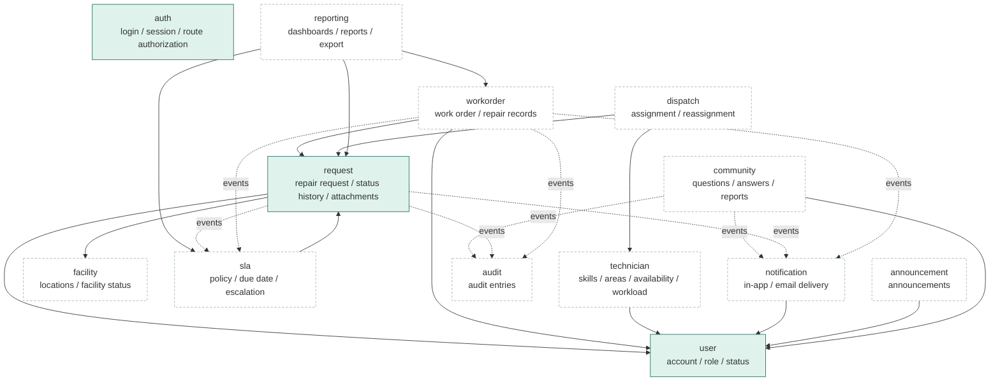
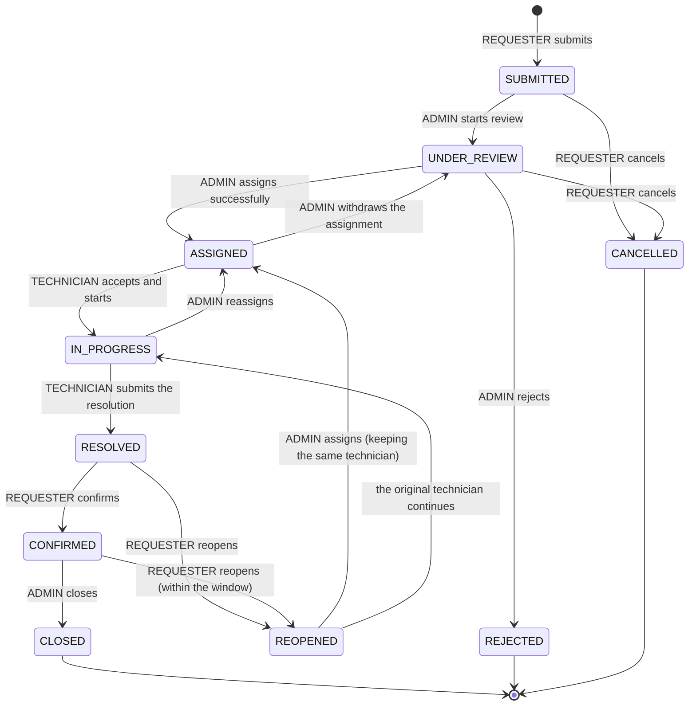
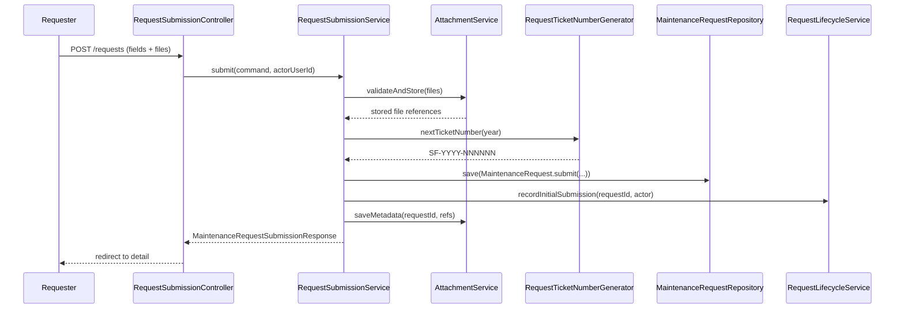
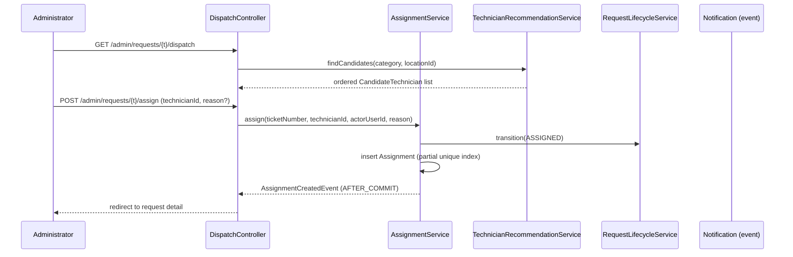
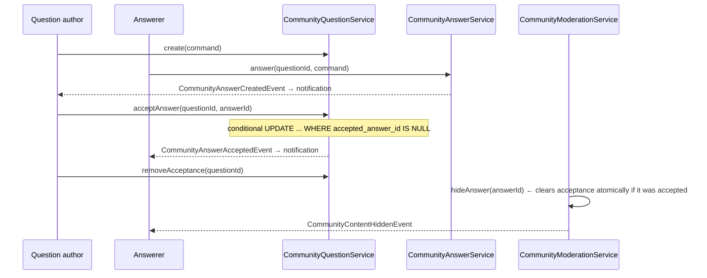
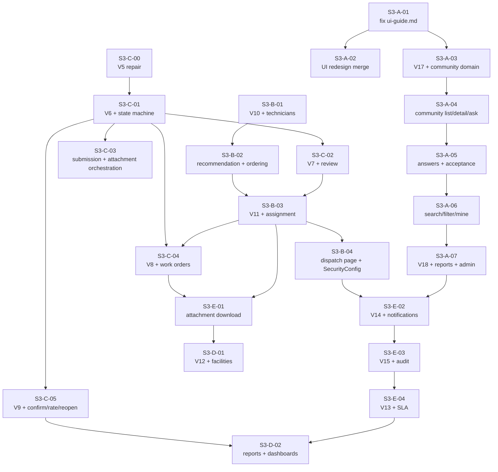

# SmartFix Sprint 3 Development Plan · Scope Change · Module Ownership · Acceptance Manual

**English** | [简体中文](SmartFix_Sprint3_Development_Plan_CN.md)

> **Document status: PLANNING DRAFT — NOT EXECUTED.**
> This document describes **what Sprint 3 will do**, not what has been built.
> Every status marker in this document corresponds to a checkable piece of evidence in the
> repository. No feature becomes implemented by being written about here.

> **⚠️ Scope change notice:** Sprint 3's scope differs **materially** from the Sprint 2 plan
> (`docs/sprint2/`). See §4: the **Community Fault Q&A** module is new and owned by User A;
> repair confirmation / feedback / reopen moves from User A to **User C**; Sprint 4 is
> reserved for remediation and cloud deployment only. **Sprint 2's historical documents are
> not modified** — all change records live in this document.

---

## Table of Contents

1. [Document Purpose, Planning Status and Evidence Baseline](#1-document-purpose-planning-status-and-evidence-baseline)
2. [Sprint 3 Goal](#2-sprint-3-goal)
3. [Current Repository Completeness and Sprint 2 Leftovers](#3-current-repository-completeness-and-sprint-2-leftovers)
4. [Scope Changes and the New Community Requirement](#4-scope-changes-and-the-new-community-requirement)
5. [Roles and Permission Boundaries](#5-roles-and-permission-boundaries)
6. [Unified Domain Model and State Transitions](#6-unified-domain-model-and-state-transitions)
7. [Project Directory and Module Boundaries](#7-project-directory-and-module-boundaries)
8. [Layering and Naming Conventions](#8-layering-and-naming-conventions)
9. [Complete Candidate Class List and Owners](#9-complete-candidate-class-list-and-owners)
10. [Core Data Dictionary](#10-core-data-dictionary)
11. [Input Limits and Business Validation](#11-input-limits-and-business-validation)
12. [Service Contracts and Cross-Module Events](#12-service-contracts-and-cross-module-events)
13. [HTTP Routes and Permission Matrix](#13-http-routes-and-permission-matrix)
14. [Request, Work Order, Dispatch and Community Core Flows](#14-request-work-order-dispatch-and-community-core-flows)
15. [Database Migration Plan](#15-database-migration-plan)
16. [Attachments, Transactions and Data Consistency](#16-attachments-transactions-and-data-consistency)
17. [A–E Ownership and Development Order](#17-ae-ownership-and-development-order)
18. [Shared Files and Conflict Management](#18-shared-files-and-conflict-management)
19. [PR Breakdown and Merge Dependencies](#19-pr-breakdown-and-merge-dependencies)
20. [Two-Week Execution Plan and Capacity](#20-two-week-execution-plan-and-capacity)
21. [Test Plan and Acceptance Matrix](#21-test-plan-and-acceptance-matrix)
22. [DevSecOps and Security Checks](#22-devsecops-and-security-checks)
23. [Local Environment and Configuration Dependencies](#23-local-environment-and-configuration-dependencies)
24. [Git and PR Conventions](#24-git-and-pr-conventions)
25. [Definition of Ready](#25-definition-of-ready)
26. [Definition of Done](#26-definition-of-done)
27. [Complete Demo Script](#27-complete-demo-script)
28. [Risks, Blockers and Scope Adjustment Mechanism](#28-risks-blockers-and-scope-adjustment-mechanism)
29. [Day 1 Decision Table](#29-day-1-decision-table)
30. [Copy-Paste Templates: Task, PR, Test Evidence, Retro](#30-copy-paste-templates-task-pr-test-evidence-retro)
31. [Requirement–Task–Owner–Test Traceability Matrix](#31-requirementtaskownertest-traceability-matrix)

---

## 1. Document Purpose, Planning Status and Evidence Baseline

### 1.1 What this is

A complete plan that five team members can follow straight into Sprint 3 coding: goals, scope
change records, class design, data dictionary, Service contracts, route permissions, state
machine, migration registration, test matrix, ownership, PR breakdown, capacity assessment,
Day 1 decision table and traceability matrix.

**Reader:** five team members about to code, who are not yet fully clear on the new Community
module, the state machine, or the SLA / notification / audit boundaries. Reading §17 is enough
to know where each person starts.

**Questions it answers:** what Sprint 3 does; what changed versus the Sprint 2 plan; how the
Community module is modelled; who owns which layer of which module; how status flows; how
migration numbers are registered; who provides and who calls notifications and audit; what
happens each day for two weeks; how to demo; which risks must be decided on Day 1.

### 1.2 Verification baseline (reproducible)

| Item | Value |
|---|---|
| Verification date | **2026-09-29** |
| Repository path | `C:\Users\zhour\smartfix` |
| Current branch | `main` |
| Current HEAD | `de38d82` — `Merge pull request #11 from Lian9374/feature/SCRUM-UserE3-YUANJIAQI` |
| HEAD commit time | 2026-09-25 10:18:38 +0800 |
| `origin/main` | **Identical** to local HEAD (`git rev-list --left-right --count origin/main...HEAD` = `0 0`) |
| Remote reachability | `git fetch origin` **succeeded**, returned no new commits; this plan is based on the locally visible state, remote is in sync |
| Working tree | **Has uncommitted changes** (see §3.4); this planning round **did not touch** those files |

Read-only commands actually run (no write operation was performed):

```bash
git status --short --branch
git branch --show-current
git remote -v
git log -10 --oneline
git fetch origin
git rev-list --left-right --count origin/main...HEAD
git diff --stat
```

### 1.3 Status markers

This document uses six markers. **Follow them strictly — never read a plan as a fact:**

| Marker | Meaning |
|---|---|
| **【EXISTS IN REPO】** | On `origin/main` (i.e. `de38d82`), verifiable file by file |
| **【LOCAL, UNMERGED】** | Present only in the working tree — **not committed, not pushed, not reviewed** |
| **【PLANNED — NEW IN S3】** | To be created in Sprint 3 (does **not** exist now) |
| **【TEAM DECISION NEEDED】** | Proposed baseline; requires Day 1 team confirmation before freezing (may become an ADR) |
| **【OUT OF SCOPE】** | Explicitly not done in Sprint 3 |
| **【S4 HANDOFF】** | Not expanded in Sprint 3; only the handoff boundary is recorded |

> **This document only plans.** Planning produces no code, no migration, no configuration
> change and no commit/push.

### 1.4 Evidence tiers (important)

This document splits "exists" into four tiers and **does not allow them to be conflated**:

| Tier | Test | Example |
|---|---|---|
| ① End-to-end usable | Controller route + page + test | `GET /requests/mine` list |
| ② Service layer exists, no entry point | Service/Repository/tests present, **no Controller** | `AttachmentService.readAttachment` (no download route) |
| ③ Entity/DTO/test only | Classes exist but migration or caller missing | `RequestStatusHistory` (**table absent**) |
| ④ Documented only | Named only in `README` / `module-guide` | `workorder`, `dispatch`, `sla`, `notification`, `reporting`, `announcement`, `audit` |

**Rule:** tiers ③ and ④ **must not** be written as "implemented". Tier ② **must not** be
written as "feature complete", because a user cannot reach it.

---

## 2. Sprint 3 Goal

### 2.1 The Sprint Goal (a single sentence)

> **Let all three roles complete SmartFix's main business flow: a requester submits and
> tracks a repair, a technician accepts the work and records the repair, and an administrator
> reviews, dispatches and closes it — while also shipping Community Fault Q&A so users can
> solve small faults themselves.**

Broken into two demonstrable loops (see the demos in §27):

1. **The formal repair loop:** REQUESTER submits → ADMINISTRATOR reviews and dispatches →
   TECHNICIAN accepts and repairs → the user confirms → the administrator closes.
2. **The community self-service loop:** a user asks → someone answers → the asker accepts →
   the question is found by keyword search → a report is filed → an administrator handles it.

### 2.2 Minimum Sprint 3 completion criteria

| # | Criterion |
|---|---|
| G1 | A complete repair-submission entry point exists on `main` (page + POST route + Service), and attachments and submission form one business result |
| G2 | The `request_status_history` table exists, every status change writes a history row, and the detail page can read it |
| G3 | The state machine supports at least SUBMITTED → UNDER_REVIEW → ASSIGNED → IN_PROGRESS → RESOLVED → CONFIRMED → CLOSED, and illegal transitions are rejected |
| G4 | A technician can be assigned and reassigned, and has a real work page |
| G5 | The community's list, detail, ask, answer, accept, search, report and administrator handling are **all usable** |
| G6 | At least one notification reaches the correct recipient after the business transaction commits; **a rolled-back transaction produces no notification** |
| G7 | SLA can at least compute a due time for one request and mark it once overdue |
| G8 | A clean database migrates successfully from V1 in full, and a database created during Sprint 2 upgrades smoothly |
| G9 | Each of the three roles' pages has no horizontal overflow at 1440 and 390 width, and the main path can be completed with the keyboard alone |
| G10 | All new tests pass under `mvn clean verify`; the PostgreSQL integration tests can be run via the opt-in path documented in the README |

### 2.3 Why this scope

- Sprint 2 delivered a **data foundation plus read-only queries** — not one business loop was
  closed (§3). Sprint 3 must close the loops, otherwise Sprint 4 has only deployment and no
  deployable business.
- The community is a **new requirement in this round** (§4.2), independent of the main repair
  chain, so it can proceed in parallel if the main chain is blocked — the lowest-risk
  increment in scope.
- It is explicit that unfinished business is **not** pushed to Sprint 4: Sprint 4 does only
  remediation, stability hardening and cloud-server deployment (§4.4).

---

## 3. Current Repository Completeness and Sprint 2 Leftovers

> Every conclusion in this section can be checked file by file. Inspection date **2026-09-29**,
> branch `main`, commit `de38d82`.

### 3.1 What genuinely works today 【EXISTS IN REPO】

| # | Capability | Evidence (repo-relative paths) | Tier |
|---|---|---|---|
| 1 | Account model and the three-valued role | `src/main/java/com/smartfix/user/domain/User.java`, `Role.java`, `AccountStatus.java`; `db/migration/V2__create_users.sql` | ① |
| 2 | Password policy (≥12 chars, letters and digits) | `user/validation/PasswordPolicy.java`, `ValidPassword.java`, `PasswordConstraintValidator.java` | ① |
| 3 | Form login + session + CSRF | `auth/config/SecurityConfig.java`, `user/controller/LoginController.java` | ① |
| 4 | A disabled account is ejected on its **next request** | `auth/security/ActiveAccountFilter.java`, `User.securityVersion` | ① |
| 5 | Administrator account management (create / change role / change status) | `user/controller/UserManagementController.java` (`GET /admin/users`, `GET /new`, `POST`, `POST /{id}/role`, `POST /{id}/status`) | ① |
| 6 | Bootstrap administrator (for first deployment) | `user/service/UserBootstrapService.java`, `user/config/BootstrapAdminProperties.java` | ① |
| 7 | Ticket number generation `SF-YYYY-NNNNNN` | `request/service/RequestTicketNumberGenerator.java` + `request_ticket_sequences` in `db/migration/V4__create_maintenance_requests.sql` (with a `PESSIMISTIC_WRITE` row lock) | ② (no caller) |
| 8 | Request entity and DTOs | `request/domain/MaintenanceRequest.java`, `MaintenanceCategory.java`, `UrgencyLevel.java`, `request/dto/*` | ② |
| 9 | My requests list + detail query | `request/controller/RequestQueryController.java`, `request/service/RequestQueryService.java` | ① |
| 10 | Resource ownership check (unauthorised access returns 404) | `request/service/RequestAccessService.java` | ① |
| 11 | Administrator read-only lookup on someone's behalf | `GET /admin/requests/lookup` (`RequestQueryController`) | ① |
| 12 | Location data | `facility/domain/Location.java`, `facility/service/LocationService.java`, `db/migration/V3__create_locations.sql` | ② (no management screen) |
| 13 | Attachment validation / storage / metadata / authorised read | `request/validation/AttachmentValidator.java`, `request/storage/LocalAttachmentStorageService.java`, `request/service/AttachmentService.java`, `db/migration/V5__create_request_attachments.sql` | ② (no HTTP entry point) |
| 14 | Unified exception handling and error page | `common/exception/GlobalExceptionHandler.java`, `templates/error.html` | ① |
| 15 | Landing pages and "My Requests" for all three roles | `templates/home.html`, `templates/request/mine.html`, `templates/request/detail.html`, `templates/admin/users.html`, `templates/admin/requests.html` | ① |
| 16 | Flyway V1–V5 | `src/main/resources/db/migration/` | ① |

### 3.2 Key gaps (Sprint 2 leftovers), each with its evidence

| # | Gap | Evidence | Impact |
|---|---|---|---|
| **K1** | **Request submission has no entry point.** `SubmitMaintenanceRequestCommand` and `MaintenanceRequestSubmissionResponse` exist, but there is **no Controller** and **no** `templates/request/new.html`. | `grep -rn "PostMapping" src/main/java` hits only `UserManagementController`; `SecurityConfig.java:49` authorizes `POST /requests` but nothing maps it. | Users **cannot submit a request** — the whole main chain is broken at its first link. |
| **K2** | **The `request_status_history` table does not exist.** The entity, repository and DTO are all present; migration V6 is absent. | `db/migration/` holds only V1–V5; `V4__create_maintenance_requests.sql:12-14` says explicitly that it "reserves V5 for attachments and V6 for request_status_history". | `RequestQueryService.getRequestDetails` reads that table → the **detail page returns 500 on PostgreSQL**. |
| **K3** | **`RequestStatus` has only the `SUBMITTED` value.** | `request/domain/RequestStatus.java`; `V4`'s `chk_maintenance_requests_status CHECK (status IN ('SUBMITTED'))`. | The state machine does not exist at all; adding a value **must** change the Java enum and the DB constraint **together**. |
| **K4** | **Attachment download has no production Controller.** | `SecurityConfig.java:50` authorizes `GET /requests/*/attachments/*`, but no `*attachments*` mapping exists anywhere in `src/main/java`. | Users cannot see the images they uploaded (`AttachmentService.readAttachment` has no entry point). |
| **K5** | **Two 0-byte test files.** | `src/test/java/com/smartfix/request/controller/AttachmentController.java` (0 bytes) and `AttachmentControllerTest.java` (0 bytes), both created 2026-09-25. | Mirrors K4: download was finished only down to the service layer. |
| **K6** | **A TECHNICIAN can read no request at all.** | `RequestAccessService.requireReadableRequest`: ADMINISTRATOR passes; REQUESTER passes when `requesterId` matches; **everything else — including TECHNICIAN — gets `notFound()`**. | A signed-in technician has no work object whatsoever. |
| **K7** | **The seven packages `workorder` / `dispatch` / `sla` / `notification` / `reporting` / `announcement` / `audit` do not exist.** | `find src/main/java -type d` returns no such directories; `docs/module-guide.md` describes only the **target** structure. | These are the bulk of Sprint 3's work. |
| **K8** | **`push` / deployment is unverified.** The `Jenkinsfile` Security stage is `when { expression { false } }`, permanently skipped. | `Jenkinsfile` lines 44–48. | No security scan has **ever** run; it must not be claimed as scanned (§22). |

### 3.3 New discovery: the committed `V5` is not valid SQL

```bash
git show HEAD:src/main/resources/db/migration/V5__create_request_attachments.sql | head -3
```

returns three **uncommented** `====` lines. The working tree contains an **uncommitted fix**
(8 insertions, 4 deletions) restoring the `-- ` comment prefixes and the trailing newline.

**Consequences:**

1. A **clean checkout cannot run Flyway past V4** — the run fails at V5.
2. Because V6 must not be applied before V5 is valid, **all Sprint 3 migrations are blocked**
   until this is fixed.
3. Fixing it **changes the checksum** for anyone who already applied V5 locally. That is a
   real, but bounded, cost — and it implies nobody successfully applied V5 from a clean
   checkout, which is itself evidence of how this went unnoticed.

**Resolution is a Day 1 team decision (D-06).** It is **not** a reason to run
`flyway clean`, drop the database, or `docker compose down -v`.

### 3.4 Uncommitted local work (【LOCAL, UNMERGED】)

The working tree holds a UI redesign: **16 tracked files modified and 6 untracked files**.
`docs/ui-guide.md` documents `layout :: sidebar` / `layout :: topbar` and
`components :: pageHeading`, but `layout.html` now has both `sidebar(active)` (line 121) and
`appbar(active)` (line 194) with `topbar` gone, and `components.html` uses `page-head` /
`pageHeading`. **Following the guide as written produces a 500.**

This is gap **S3-A-01**, and it **blocks every member's page work**.

### 3.5 Test asset inventory 【EXISTS IN REPO】

`src/test/java` holds **25 test files**, of which:

- **2 are zero-byte placeholder files** (`request/controller/AttachmentController.java`,
  `AttachmentControllerTest.java`) — **not tests**, see K5.
- **1 is untracked**: `request/web/RequestPagesRenderingIT.java` (arrived with the §3.4 UI work, so
  it is 【LOCAL, UNMERGED】).
- The other 22 are already on `origin/main`.

Test tiers (following `docs/testing-guide.md`) and the current distribution:

| Tier | Existing examples |
|---|---|
| Unit (JUnit 5 + Mockito) | `user/service/UserServiceTest`, `request/service/RequestAccessServiceTest`, `request/service/RequestQueryServiceTest`, `request/domain/MaintenanceRequestTest`, `request/validation/AttachmentValidatorTest`, `facility/service/LocationServiceTest` |
| Web / Controller | `user/controller/UserManagementControllerTest`, `request/controller/RequestQueryControllerTest`, `common/web/HomeControllerTests` |
| Security | `auth/config/SecurityConfigTest`, `auth/security/ActiveAccountFilterTest` |
| Integration (`*IT`, Failsafe) | `auth/AuthenticationFlowIT`, `common/MigrationIT`, `request/repository/AttachmentPersistenceIT` |
| Rendering | `request/web/RequestPagesRenderingIT` (【LOCAL, UNMERGED】) |

> **This planning round ran no tests, so this document reports no pass counts, no coverage
> figures and no CI results.**
> When a number is needed, run the commands in §21.5 yourself and paste the real output into the PR.

### 3.6 Sprint 2 leftover list (must be closed in Sprint 3)

| # | Leftover | Closed by | Task |
|---|---|---|---|
| L1 | **V5 migration file is invalid** (§3.3) — **blocks every later migration** | C | **S3-C-00** |
| L2 | `request_status_history` table missing (K2) | C | S3-C-01 |
| L3 | Status enum has only `SUBMITTED` (K3) | C | S3-C-01 |
| L4 | Request submission has no entry point (K1) | C | S3-C-03 |
| L5 | Attachment download has no entry point + two 0-byte placeholder files (K4, K5) | E | S3-E-01 |
| L6 | A technician cannot read a request assigned to them (K6) | B + C | S3-B-06 |
| L7 | Technicians have no profile and no workbench (K6/K7) | B + C | S3-B-01 / S3-C-04 |
| L8 | `ui-guide.md` is out of step with reality (§3.4) — **blocks every member's page work** | A | **S3-A-01** |
| L9 | The UI refactor has not been merged (§3.4) | A | S3-A-02 |
| L10 | Locations have no management screen (§3.1 #12) | D | S3-D-01 |
| L11 | The `Jenkinsfile` Security stage is permanently skipped (K8) | E | S3-E-07 |

> **Task-number cross-reference (used consistently throughout this document):** the task
> numbers actually used are
> `S3-A-01..07`, `S3-B-01..04` and `S3-B-06`, `S3-C-00..06`, `S3-D-01..05`, and
> `S3-E-01..05` and `S3-E-07`.
> The complete task-number ↔ PR ↔ daily-plan mapping is **§17.7**. These numbers carry **the
> same meaning** in §17's PR tables, §19's merge-dependency graph and §20's daily plan. Do not
> invent a second numbering scheme.
>
> ⚠️ **These are task numbers invented by this document. They are not Jira Issue IDs.**

---

## 4. Scope Changes and the New Community Requirement

### 4.1 Change table (C-1 … C-8)

| # | Change | From | To | Reason |
|---|---|---|---|---|
| **C-1** | Sprint 3 positioning | Some business features | **Complete the remaining confirmed business features**, producing two demonstrable end-to-end loops | Explicit user adjustment |
| **C-2** | Sprint 4 positioning | Continue feature development | **Final remediation, stability hardening and cloud-server deployment only** | Unfinished business is no longer pushed into Sprint 4 |
| **C-3** | **New module** | None | **Community Fault Q&A** (`com.smartfix.community`), owner **A** | **A NEW user requirement in this round** |
| **C-4** | Community business boundary | — | Computer / software / network / peripheral **small faults**; other users, technicians and administrators may answer | Explicit user instruction |
| **C-5** | Repair confirmation / feedback / reopen | User A | **User C** | It belongs to the same chain as the request lifecycle C already owns |
| **C-6** | A's UI responsibility | A implements every page | **A owns the shared visual spec + the community pages**; each member implements **their own** pages | Avoids a single-point bottleneck |
| **C-7** | Official roles | Three | **Stay at three** (REQUESTER / TECHNICIAN / ADMINISTRATOR) | No `FACILITY_OFFICER`, no `MODERATOR` |
| **C-8** | Planning documents | — | New `docs/sprint3/SmartFix_Sprint3_Development_Plan_{CN,EN}.md` | Produced in this round |

### 4.2 Requirement-source declaration for the community module (binding on everyone)

> **Community Fault Q&A is a NEW requirement raised by the user for Sprint 3.**
>
> It is **not** in `README.md` / `README.zh-CN.md`,
> it is **not** an approved course scope,
> and it is **not** a module already planned in `docs/module-guide.md`
> (that document's target module list is `common` `auth` `user` `request` `workorder`
> `dispatch` `sla` `facility` `notification` `reporting` `announcement` `audit` — there is
> **no** community).
>
> Therefore: **no document, report, demo or presentation may describe the community as an
> "already planned feature" or an "approved course scope".** The correct formulation is
> "a new Sprint 3 requirement", and it should be stated explicitly at Sprint Review as a
> **scope change**.

### 4.3 Scope definition for the new community requirement

**What a user may ask about (business vocabulary, not error text):**

- A computer that will not start / runs slowly
- Software installation or runtime problems
- Wi-Fi or network connectivity problems
- Printer, mouse, keyboard and other peripheral problems
- Small faults in common devices

**Who may answer:** every REQUESTER, TECHNICIAN and ADMINISTRATOR whose **account status is
ACTIVE**.

**A community post is not a `MaintenanceRequest`.** Explicitly forbidden:

- No automatic Ticket Number
- No automatic WorkOrder / Assignment / SLA
- No row is written into `maintenance_requests`
- A personal device problem does **not** automatically enter the campus-facility repair scope

> **In one sentence:** the community is an **independent aggregate**; the only thing it shares
> with the repair flow is the **identity of a person** (`users.id`).

#### 4.3.1 Community v1 must-do checklist

> This table is the checklist that §31's traceability table means by "see the §4.3 list".
> **Only entries with an owner and acceptance criteria count as v1.** Any community feature
> not written into this table is out of scope by definition.

| # | v1 must-do | Owner | Where it lands |
|---|---|---|---|
| 1 | Question list | A | `community/controller/CommunityQuestionController` |
| 2 | Pagination (default 10, maximum 50) | A | `CommunityQueryService.browse` |
| 3 | Keyword search (title **and** body, case-insensitive) | A | `CommunityQuestionRepository` query methods |
| 4 | Category filter (5 values) | A | Same |
| 5 | `Latest` / `Unanswered` / `Solved` filters | A | `CommunityQueryService.browse`'s `filter` |
| 6 | Publish a question | A | `CommunityQuestionService.askQuestion` |
| 7 | View a question and its answers | A | `CommunityQuestionController` detail page |
| 8 | Edit one's own question | A | `CommunityQuestionService.editQuestion` |
| 9 | Post and edit one's own answers | A | `CommunityAnswerService.postAnswer` / `editAnswer` |
| 10 | "My Questions" | A | `CommunityQueryService.myQuestions` |
| 11 | "My Answers" | A | `CommunityQueryService.myAnswers` |
| 12 | Accept and un-accept an answer | A | `CommunityAnswerService.acceptAnswer` / `removeAcceptance` |
| 13 | Report a question or an answer | A | `CommunityModerationService.reportQuestion` / `reportAnswer` |
| 14 | Admin handling of reports: hide / restore | A | `CommunityModerationService.resolveReport` / `hide*` / `restore*` |
| 15 | In-app notification for new answers and acceptance | A publishes the event → E delivers | `CommunityAnswerCreatedEvent` / `CommunityAnswerAcceptedEvent` |
| 16 | **Server-side** permission checks (never relying on hiding a page element) | A | Service-layer ownership checks (§5.4) |
| 17 | Pages, migrations (**V17**: `community_questions` + `community_answers`; **V18**: `community_reports`) and tests | A | §15, AC-8..AC-14 in §21.3 |

**Explicitly not in the v1 checklist:** direct messages, follows, points, leaderboards,
likes, AI auto-answer, a rich-text editor, automatic post→request conversion, any new social
identity system. These are registered as out of scope in §4.5.

**Community images are not in this table** — they are a **pending extension** (D-10, see §4.5).

### 4.4 Sprint 4 boundary (registration only — not expanded here)

Sprint 4 contains **only**:

| # | Sprint 4 scope | What Sprint 3 must hand over |
|---|---|---|
| S4-1 | Final remediation (defects, usability, copy, accessibility) | Defect list + known open items (§28) |
| S4-2 | Stability hardening (concurrency, exceptions, idempotency, logging) | Concurrency test results + known weak points (§21.4) |
| S4-3 | Cloud-server deployment (containerisation, external database, HTTPS, environment variables) | A runnable `Dockerfile` / `docker-compose.yml` / `Jenkinsfile` + the complete environment-variable list (§23.2) |

**Sprint 3 must not** silently hand in-scope business features to Sprint 4. If something
genuinely cannot be finished, use the scope-adjustment mechanism in §28 and record it in the
Sprint Review's "honest list of unfinished items".

### 4.5 Scope explicitly NOT being done

| Item | Disposition | Note |
|---|---|---|
| Direct messages / follows / points / leaderboards / likes | 【Out of scope】 | v1 does not socialise the community |
| AI auto-answer | 【Out of scope】 | No model call is introduced |
| Rich-text editor | 【Out of scope】 | Plain text + escaping (§11.4) |
| Community images | **【TEAM DECISION NEEDED】** | See below |
| Automatic community-post → repair-request conversion | 【Out of scope】 | The two aggregates never create each other |
| A new social identity system | 【Out of scope】 | Reuses `users` |
| `FACILITY_OFFICER` / `MODERATOR` roles | 【Out of scope】 | Moderation is performed by ADMINISTRATOR |
| Microservices / K8s / a new front-end framework / JWT | 【Out of scope】 | Architecture constraints (§7.1) |

**Community images — special note (【TEAM DECISION NEEDED】, D-10):**

- Community images **must not** be written into `request_attachments`: that table's
  `request_id` is `NOT NULL` with a foreign key to `maintenance_requests`, so reuse would
  force a community post to be attached to a repair request.
- If Day 1 confirms this is required, it **must** be planned as a separate metadata table
  with its own authorisation policy, reusing **only** at the storage layer
  (`AttachmentStorageService`'s capability), and **estimated separately**.
- Recommendation for v1: **do not do it.** The community is text Q&A; images are an extension,
  not a core need.

---

## 5. Roles and Permission Boundaries

### 5.1 There are exactly three official roles (unchanged)

| Role | Typical behaviour | New Sprint 3 capability |
|---|---|---|
| **REQUESTER** | Reports, tracks, confirms, rates | Submit a request (closes K1), confirm resolution, rate, reopen, use the community |
| **TECHNICIAN** | Accepts work, repairs, records | **For the first time has real work objects** (closes K6): view assigned requests, accept work, record repairs, submit a resolution, use the community |
| **ADMINISTRATOR** | Manages, reviews, dispatches, monitors | Review and final priority, assign/reassign, close, SLA configuration, reports, announcements, community report handling |

> **No `FACILITY_OFFICER` is added.  No `MODERATOR` is added.**
> `Role.java`'s three-value enum **stays as it is**; community "report handling" is an
> **ADMINISTRATOR** capability, expressed with the existing role rather than a new one.

### 5.2 The permission boundary in one table

| Principal | Boundary |
|---|---|
| Anonymous | Only `/login`, static resources, `/actuator/health`. Accessing the community → 302 to the login page |
| ACTIVE REQUESTER | Their own requests (read, confirm, rate, reopen); community read + writing their own content + accepting on their own question |
| ACTIVE TECHNICIAN | Requests **assigned to them** (read, accept, record, submit a resolution); community read + write |
| ACTIVE ADMINISTRATOR | All requests; user management; dispatch; SLA; reporting; announcements; community content management (hide / restore / handle reports) |
| DISABLED (any role) | **Everything is denied.** `ActiveAccountFilter` removes them on their next request (test already exists: `ActiveAccountFilterTest.accountChangesInvalidateSessionAndPreventControllerAccess`, whose parameterised `changedAccounts()` already includes `AccountStatus.DISABLED`) |

### 5.3 Three iron rules

1. **`navRole` only decides "what is displayed", never "what is allowed".** Authorisation
   lives only in `SecurityConfig` plus the service layer's ownership/state checks (following
   the principle in `docs/ui-guide.md`).
2. **Author identity comes only from the authentication context**
   (`SmartFixUserDetails.getUserId()`) — a form field named `authorId` / `requesterId` /
   `actorId` is **never** read.
3. **An unauthorised read always returns 404, not 403.** This follows the existing semantics
   of `RequestAccessService`, so as not to disclose that the resource exists.

### 5.4 Permission matrix (the complete Sprint 3 version)

Legend: ✅ allowed ｜ ⛔ denied (403 or 404) ｜ 🔒 self / self-related only ｜ ⚙️ an additional precondition applies

| Capability | Anonymous | REQUESTER | TECHNICIAN | ADMIN |
|---|---|---|---|---|
| Browse the community question list / detail | ⛔ (D-04) | ✅ | ✅ | ✅ |
| Search / category filter / status filter | ⛔ (D-04) | ✅ | ✅ | ✅ |
| Publish a question | ⛔ | ✅ | ✅ | ✅ |
| Answer a question | ⛔ | ✅ | ✅ | ✅ |
| Edit a question / answer | ⛔ | 🔒 author | 🔒 author | 🔒 author |
| Withdraw one's own question / answer | ⛔ | 🔒 author | 🔒 author | 🔒 author |
| Accept an answer | ⛔ | 🔒 on one's own question ⚙️ | 🔒 on one's own question ⚙️ | ⛔ **never on someone's behalf** |
| Remove acceptance | ⛔ | 🔒 on one's own question | 🔒 on one's own question | ⛔ |
| Report a question / answer | ⛔ | ✅ | ✅ | ✅ |
| Handle reports / hide / restore | ⛔ | ⛔ | ⛔ | ✅ |
| Submit a repair request | ⛔ | ✅ | ⛔ | ⛔ |
| My requests list | ⛔ | ✅ | ⛔ | ⛔ |
| View one request | ⛔ | 🔒 own | 🔒 assigned to me | ✅ all |
| Review / set the final priority | ⛔ | ⛔ | ⛔ | ✅ |
| Assign / reassign a technician | ⛔ | ⛔ | ⛔ | ✅ |
| Accept work / start repair / record repair | ⛔ | ⛔ | 🔒 assigned to me | ⛔ |
| Confirm resolution / rate / reopen | ⛔ | 🔒 own request | ⛔ | ⛔ |
| Close a request | ⛔ | ⛔ | ⛔ | ✅ |
| User management | ⛔ | ⛔ | ⛔ | ✅ |
| SLA policy configuration | ⛔ | ⛔ | ⛔ | ✅ |
| Reporting / dashboards | ⛔ | ⛔ | 🔒 own workload only | ✅ |
| Publish / withdraw an announcement | ⛔ | ⛔ | ⛔ | ✅ |
| In-app notification centre | ⛔ | 🔒 own | 🔒 own | 🔒 own |
| Read audit entries | ⛔ | ⛔ | ⛔ | ✅ |

> **On administrators never accepting on someone's behalf:** §8.3 states explicitly that "an
> administrator does not impersonate the asker to accept an answer". An administrator **may
> hide** an accepted answer, but the resulting "acceptance cleared" is a **system side effect**,
> not an administrator making a decision for the asker.

---

## 6. Unified Domain Model and State Transitions

### 6.1 Aggregate boundaries (the Sprint 3 target shape)



- **Solid line** = a compile-time dependency, and it may only point at the other side's
  **public Service**.
- **Dotted line** = an in-application event (the publisher does not know its subscribers).
  **Reverse dependencies are forbidden**: `community` does not depend on `notification`;
  `notification` depends on `community`'s event types — one direction only.
- **Cycles are forbidden.** If A→B→A appears, stop and redesign (rule 1 of
  `docs/module-guide.md`).

Green = **【EXISTS IN REPO】**; everything else is **【PLANNED — NEW IN S3】**.

**Dependency rules:**

1. **`community` depends on nothing.** It does not import `request`, `workorder` or `dispatch`.
2. **`notification` and `audit` depend on community's event types** — one direction only.
   Community never imports notification.
3. **No cycles.** Community publishes events; it never calls a notifier directly.
4. **`request` never imports `community`** — request comments and community answers are
   separate concepts in separate tables (§7.2).

### 6.2 Request state machine (【TEAM DECISION NEEDED】, frozen at D-07)

> **This is a design awaiting freeze, not an existing fact.** Today `RequestStatus` holds only
> `SUBMITTED` (K3).



**Status values (10, of which 3 are terminal):**

`SUBMITTED` `UNDER_REVIEW` `ASSIGNED` `IN_PROGRESS` `RESOLVED` `CONFIRMED` `REOPENED`
`CLOSED` `REJECTED` `CANCELLED`

> Note that this is **10 enum values**: `REOPENED` counts, and the 3 terminal values are
> `CLOSED` / `REJECTED` / `CANCELLED`.
> `VARCHAR(20)` is wide enough for the longest, `UNDER_REVIEW` (12 characters).

### 6.3 Transition table (every transition needs a role, preconditions, failure conditions, history, SLA and notification)

| # | From → To | Acting role | Preconditions | Failure conditions (rejected) | History | SLA impact | Notification / audit |
|---|---|---|---|---|---|---|---|
| T01 | `SUBMITTED` → `UNDER_REVIEW` | ADMIN | Request exists; current status is `SUBMITTED` | Status already changed (concurrency) | 1 row | Starts the **review clock** | Notify the reporter "under review" / audit |
| T02 | `SUBMITTED`/`UNDER_REVIEW` → `CANCELLED` | REQUESTER (own only) | The actor is the requester; status ∈ {SUBMITTED, UNDER_REVIEW} | Repair already started; not the requester | 1 row | **Stops** the clock | Notify ADMIN / audit |
| T03 | `UNDER_REVIEW` → `ASSIGNED` | ADMIN | A TECHNICIAN has been chosen; that technician is ACTIVE and meets the hard filters (§14.3) | Technician disabled / fails a hard filter / concurrent reassignment | 1 row | Starts the **response clock** | Notify the technician + reporter / audit |
| T04 | `UNDER_REVIEW` → `REJECTED` | ADMIN | A rejection reason is present (**required**, ≤500) | No reason | 1 row | **Stops** the clock | Notify the reporter / audit |
| T05 | `ASSIGNED` → `IN_PROGRESS` | TECHNICIAN (the assignee) | The actor is the current assignee; status is `ASSIGNED` | Not the assignee; status mismatch | 1 row | Starts the **resolution clock** | Notify the reporter / audit |
| T06 | `ASSIGNED` → `UNDER_REVIEW` | ADMIN | Withdrawing the assignment (before reassigning) | — | 1 row | Response clock **pauses** | Notify the former technician / audit |
| T07 | `IN_PROGRESS` → `ASSIGNED` | ADMIN | Reassignment: a new technician has been chosen | The new technician fails a hard filter | 1 row | The reassignment reason goes to audit | Notify old + new technician + reporter / audit |
| T08 | `IN_PROGRESS` → `RESOLVED` | TECHNICIAN (the assignee) | A resolution note has been written (**required**); the work order exists | No note; the work order is not complete | 1 row | **Stops** the resolution clock | Notify the reporter "awaiting confirmation" / audit |
| T09 | `RESOLVED` → `CONFIRMED` | REQUESTER (own only) | The actor is the requester; status is `RESOLVED` | Not the requester; status mismatch | 1 row | Starts the **confirmation clock** | Notify ADMIN + technician / audit |
| T10 | `CONFIRMED` → `CLOSED` | ADMIN | Status is `CONFIRMED` | — | 1 row | **Closes** all clocks | Notify the reporter / audit |
| T11 | `RESOLVED`/`CONFIRMED` → `REOPENED` | REQUESTER (own only) | The actor is the requester; within the allowed window (D-08) | Outside the window; already `CLOSED` | 1 row | **Restarts** the resolution clock | Notify ADMIN + technician / audit |
| T12 | `REOPENED` → `ASSIGNED` | ADMIN | A technician has been chosen (the same one by default) | The original technician is disabled → must reassign | 1 row | Resets the response clock | Notify the technician / audit |
| T13 | `REOPENED` → `IN_PROGRESS` | TECHNICIAN (the original assignee, if still ACTIVE) | The original assignment is still valid | The original technician is disabled | 1 row | The resolution clock continues | Notify the reporter / audit |

**Illegal-transition examples (all must be rejected, and each needs a test):**

- `CLOSED` → anything (a terminal state is immutable)
- `SUBMITTED` → `RESOLVED` (skipping steps)
- A REQUESTER performing T03 (wrong role)
- A TECHNICIAN performing T09 (wrong role)
- Performing T01 on a request in `IN_PROGRESS` (wrong status)

### 6.4 Three hard implementation constraints for the state machine

1. **Single source of truth:** the status lives in exactly one column,
   `maintenance_requests.status`. `request_status_history` is an **audit trail**, not the
   source of the status. Any code that derives the current status from the history is a defect.
2. **Every transition goes through one entry point:**
   `RequestLifecycleService.transition(ticketNumber, targetStatus, actorUserId, comment)`.
   Calling `request.setStatus(...)` directly in any Controller or Service is **forbidden**.
3. **Concurrency safety:** a transition uses either an **optimistic lock**
   (`maintenance_requests.version`, a new column) or a **conditional update**
   (`UPDATE ... WHERE id = ? AND status = ?`) — pick one, and never rely on "read then write".
   Submitting the same transition twice must return a business conflict, never silently succeed.

### 6.5 Request ↔ Work Order status mapping (【TEAM DECISION NEEDED】)

**The two state machines must not overwrite each other.** Proposed:

| `maintenance_requests.status` | `work_orders.status` | Note |
|---|---|---|
| `ASSIGNED` | `CREATED` | A successful assignment creates the work order |
| `IN_PROGRESS` | `IN_PROGRESS` | Technician accepted |
| `IN_PROGRESS` | `ON_HOLD` | Paused (e.g. awaiting parts) — **does not** change request status |
| `RESOLVED` | `COMPLETED` | Technician submitted the resolution |
| `REOPENED` | `REOPENED` | On reopen the work order becomes editable again |
| `CLOSED` | `CLOSED` | Terminal |

> **Rule:** the request status is **primary**; the work order status is **secondary**.
> Only the `workorder` module changes work order status, and it does so by **asking** the
> `request` module to perform a transition — `workorder` must **never** write
> `maintenance_requests` directly.

### 6.6 Community content state (minimal model)

**There are exactly two dimensions, and they are deliberately not merged:**

| Dimension | Values | Who changes it |
|---|---|---|
| `CommunityContentStatus` (shared by questions and answers) | `VISIBLE` / `HIDDEN` / `WITHDRAWN` | The author may set `WITHDRAWN`; an ADMIN may set `HIDDEN` ↔ `VISIBLE` |
| **Whether it is solved** | **No column** — derived from `community_questions.accepted_answer_id IS NOT NULL` | Changed by accept / un-accept |

**Why "solved" is not a column (the core decision of §6.6):**

- If a `solved` boolean and `accepted_answer_id` both existed, they would **necessarily**
  contradict each other after some concurrent or exceptional path. The rule is "one accepted
  answer = solved", so only `accepted_answer_id` is kept.
- Hiding or withdrawing an **accepted** answer performs
  `UPDATE community_questions SET accepted_answer_id = NULL WHERE id = ?` in the **same
  transaction**, so the solved state follows automatically — **there is no second field to
  keep in sync**.
- The `Unanswered` filter = `accepted_answer_id IS NULL AND status = 'VISIBLE'`.
  `Solved` = `accepted_answer_id IS NOT NULL`.

**Three distinct concepts that must not be conflated:**

| Concept | What it is | v1 |
|---|---|---|
| **Content hidden / withdrawn** | Whether the content is still publicly visible | ✅ do it |
| **Whether it is solved** | Whether the asker accepted an answer | ✅ do it (derived) |
| **Closing a question (no new answers)** | A separate lifecycle switch | ❌ **not doing** (D-09) |

> **Why not "close answers":** v1 has no real scenario that needs it (no DMs, no long-term
> archival policy). Building it would create a **state with no purpose**. It is explicitly
> excluded rather than built "just in case".

### 6.7 Community rule list (each rule needs an implementation and a test)

| # | Rule | Where it lands |
|---|---|---|
| **R1** | Author id comes only from the authenticated identity; a form `authorId` is **not trusted** | The controller does not bind that field; the service reads the principal |
| **R2** | At most **one** accepted answer per question | The single `accepted_answer_id` column + conditional update |
| **R3** | The accepted answer **must belong to that question** | Composite foreign key (§10.1) **and** a service check |
| **R4** | A `HIDDEN` or `WITHDRAWN` answer **cannot be accepted** | Service checks `answer.status == VISIBLE` |
| **R5** | Two concurrent accepts stay consistent | Conditional update `WHERE accepted_answer_id IS NULL AND status='VISIBLE'`; 0 rows affected → `BusinessConflictException` |
| **R6** | Hiding/withdrawing an **accepted** answer **atomically** clears the acceptance and updates the solved state | One `@Transactional`: clear `accepted_answer_id` + set the answer status + write audit |
| **R7** | Withdrawal and admin hiding **keep the necessary records** and **do not cascade-delete** other people's answers | Logical status; no `ON DELETE CASCADE`; hiding a question does **not** delete its answers |
| **R8** | Administrators **do not silently rewrite** user text | The admin interface changes **status only** — there is **no** "edit body" |
| **R9** | Render **plain text** and escape by default; **no arbitrary HTML** | Thymeleaf `th:text`, `th:utext` **banned**; a rendering test asserts `<script>` is escaped |
| **R10** | Length limits, pagination caps and anti-duplicate rules | §11.3, §11.5 |
| **R11** | **Whether an author may accept their own answer** | **【TEAM DECISION NEEDED】D-05**; proposed baseline: **not allowed** |
| **R12** | Reports need a type, reason, handling status, handler and handled-at | The five columns exist in `community_reports` (§10.3) |
| **R13** | Hidden content follows **consistent** rules across list / detail / search | See §6.8 |
| **R14** | The author of a question or answer **can still see** their own hidden/withdrawn content | The detail page admits them by identity |

### 6.8 Visibility and search rules for hidden / withdrawn content (R13 expanded)

| Case | List | Detail | Search | Administrator |
|---|---|---|---|---|
| Question `VISIBLE` | Visible | Visible | Matched | Visible |
| Question `WITHDRAWN` (author) | **Absent** | The author sees it (with a notice); others get 404 | **Not matched** | Visible (admin view) |
| Question `HIDDEN` (moderated) | **Absent** | The author sees it (with a notice); others get 404 | **Not matched** | Visible, restorable |
| Answer `WITHDRAWN` | Body not shown; placeholder "This answer was withdrawn." | Same | Not searched | Visible |
| Answer `HIDDEN` | Body not shown; placeholder "This answer is hidden." | Same | Not searched | Visible, restorable |

---

## 7. Project Directory and Module Boundaries

### 7.1 Architecture constraints (carried forward)

- **Modular monolith**, package by business feature.
- **Controller → Service → Repository.** Controllers never touch repositories.
- `spring.jpa.hibernate.ddl-auto: none` — schema comes from Flyway only.
- Thymeleaf server-side rendering; no SPA.

### 7.2 Target package tree

```
com.smartfix
├── common/          【EXISTS】 shared web advice, exceptions, config
├── auth/            【EXISTS】 security config, login
├── user/            【EXISTS】 users, roles, account status
├── request/         【EXISTS】 maintenance requests, attachments, status history
├── community/       【PLANNED — NEW IN S3】  ← A
├── technician/      【PLANNED — NEW IN S3】  ← B
├── dispatch/        【PLANNED — NEW IN S3】  ← B
├── workorder/       【PLANNED — NEW IN S3】  ← C
├── facility/        【EXISTS】 locations; facilities are 【PLANNED】  ← D
├── reporting/       【PLANNED — NEW IN S3】  ← D
├── announcement/    【PLANNED — NEW IN S3】  ← D
├── sla/             【PLANNED — NEW IN S3】  ← E
├── notification/    【PLANNED — NEW IN S3】  ← E
└── audit/           【PLANNED — NEW IN S3】  ← E
```

### 7.3 Why community is its own module

Community is **not** placed in `user`, `request` or `common`:

| Rejected location | Why it is wrong |
|---|---|
| `user` | Community content is **not** user-profile data; it would make `user` a dumping ground |
| `request` | A community post is **not** a maintenance request. Putting it there invites the post→request coupling §4.3 explicitly forbids |
| `common` | `common` holds cross-cutting infrastructure, not a business feature |

Community is a **business feature with its own lifecycle, its own tables and its own
moderation rules**, so it gets its own package.

### 7.4 File-level split inside `request`

Because C and E both work inside `request`, the split is defined **file by file**:

| Owner | Files |
|---|---|
| **C** | `RequestStatus`, `MaintenanceRequest`, `MaintenanceCategory`, `UrgencyLevel`, `RequestStatusHistory`, `RequestTicketSequence`, `MaintenanceRequestRepository`, `RequestStatusHistoryRepository`, `RequestTicketSequenceRepository`, `RequestQueryService`, `RequestQueryController`, `RequestSubmissionService`, `RequestLifecycleService`, `RequestReviewService`, `RequestAccessService` |
| **E** | `Attachment`, `AttachmentRepository`, `AttachmentService`, `AttachmentController`, `AttachmentProperties`, `AttachmentStorage`, attachment validation classes |

**Interface between them:** C's code never opens attachment files directly; it calls
`AttachmentService`. E's code never changes request status; it reads it. The single
crossing point is `RequestAccessService.requireReadableRequest`, which E calls for download
authorization and which **B and C jointly extend** for the TECHNICIAN branch (K6).

---

## 8. Layering and Naming Conventions

### 8.1 Layer responsibilities and prohibitions (following the Sprint 2 conventions; unchanged in Sprint 3)

| Layer | Responsibility | Forbidden |
|---|---|---|
| `controller` | HTTP mapping, binding, triggering validation, choosing the view, populating the Model | Business rules, transactions, direct repository access |
| `service` | Business rules, transaction boundaries, cross-module orchestration, permission and state checks | Returning JPA entities to a Controller; referencing `HttpServletRequest` |
| `domain` | Entities, value objects, enums, **its own invariants** | Depending on Service / Repository / Web |
| `repository` | Persistence and queries | Business decisions |
| `dto` | Data carriers across layers and modules (`record` preferred) | Carrying behaviour |
| `event` | A business fact that has happened (`record`, immutable) | Carrying entity references (**IDs and necessary values only**) |

### 8.2 Naming conventions (the new parts)

| Element | Convention | Example |
|---|---|---|
| Migration file | `V<n>__<snake_case_description>.sql` | `V17__create_community_questions.sql` |
| Entity | Singular noun | `CommunityQuestion` |
| Table | Plural snake_case | `community_questions` |
| Enum value | `UPPER_SNAKE` | `UNDER_REVIEW` |
| Command DTO | `<Verb><Noun>Command` | `AcceptAnswerCommand` |
| Response DTO | `<Noun>Response` | `CommunityQuestionDetailResponse` |
| Event | `<Aggregate><PastTenseFact>Event` | `CommunityAnswerAcceptedEvent` |
| Service method | A verb phrase; `find`/`list`/`get` for queries | `acceptAnswer(...)` |
| Test | `<ClassUnderTest>Tests` (unit) / `<Scenario>IT` (integration) | `CommunityAnswerServiceTests` |

### 8.3 Keep existing names — no pointless renaming

- `MaintenanceRequest` (not `Request` — avoids colliding with `HttpServletRequest`)
- `RequestStatusHistory`, `RequestTicketSequence`, `RequestAccessService`, `RequestQueryService`
- `ticketNumber` (not `ticketNo` / `reference`)
- `Location` (Sprint 3's `Facility` is a **different** concept — see §14.4)
- Do **not** rename any existing class, field, table or route just to make the documentation
  look uniform.

### 8.4 Interfaces and implementations: do not apply a template mechanically

This follows the Sprint 2 rule: **extract an interface only when a real substitution point exists.**

- **Existing interface:** `AttachmentStorageService` (with a `LocalAttachmentStorageService`
  implementation, and object storage may replace it later) → keep it.
- **Technician recommendation:** do **not** extract `TechnicianMatchingStrategy` in advance.
  First write the concrete `TechnicianRecommendationService` with its hard filters and
  ordering rules; extract an interface only when a **second real ordering strategy** appears
  (D-12).
- **Community:** `CommunityQuestionService` / `CommunityAnswerService` /
  `CommunityModerationService` do **not** get interfaces — use the classes directly.

---

## 9. Complete Candidate Class List and Owners

> **None of these classes exist yet** unless marked 【EXISTS IN REPO】.
> Class names here are **candidates**, not filenames on disk.
> Roughly: **A ≈ 28, B ≈ 18, C ≈ 23, D ≈ 12, E ≈ 8+** classes.

### 9.1 `technician` module — B

| # | File | Class | Purpose | Prerequisite |
|---|---|---|---|---|
| B-01 | `db/migration/V1x__create_technician_profiles.sql` | — | Technician profile, skills, service areas, availability | Migration number registered |
| B-02 | `technician/domain/TechnicianProfile.java` | `TechnicianProfile` | Technician profile (linked to `users.id`) | B-01 |
| B-03 | `technician/domain/TechnicianSkill.java` | `TechnicianSkill` | Skill (maps to `MaintenanceCategory`) | B-02 |
| B-04 | `technician/domain/ServiceArea.java` | `ServiceArea` | Service area | B-02 |
| B-05 | `technician/domain/AvailabilityStatus.java` | `AvailabilityStatus` | `AVAILABLE` / `BUSY` / `ON_LEAVE` | — |
| B-06 | `technician/repository/TechnicianProfileRepository.java` | — | Queries | B-02 |
| B-07 | `technician/service/TechnicianDirectoryService.java` | `TechnicianDirectoryService` | **Public API**: supplies candidate technicians to `dispatch` | B-06 |
| B-08 | `technician/service/TechnicianWorkloadService.java` | `TechnicianWorkloadService` | Open work-order count | B-06 |
| B-09 | `technician/dto/{TechnicianProfileResponse, TechnicianCandidateResponse, UpdateTechnicianProfileCommand}.java` | — | DTOs | — |
| B-10 | `technician/controller/TechnicianProfileController.java` | — | `GET/POST /technician/profile` | B-02 |

### 9.2 `dispatch` module — B

| # | File | Class | Purpose | Prerequisite |
|---|---|---|---|---|
| B-11 | `db/migration/V1x__create_assignments.sql` | — | Assignment records (including reassignment history) | B-01 |
| B-12 | `dispatch/domain/Assignment.java` | `Assignment` | An assignment (`requestId`, `technicianId`, `active`, reason) | B-11 |
| B-13 | `dispatch/repository/AssignmentRepository.java` | — | Queries the currently active assignment | B-12 |
| B-14 | `dispatch/service/TechnicianRecommendationService.java` | — | **Hard filters + ordering** (§14.3) | B-07, B-08 |
| B-15 | `dispatch/service/AssignmentService.java` | `AssignmentService` | Assign / reassign / withdraw; **the only place that writes `assignments`** | B-13 |
| B-16 | `dispatch/dto/{AssignmentResponse, AssignTechnicianCommand, ReassignTechnicianCommand, TechnicianRecommendationResponse}.java` | — | DTOs | — |
| B-17 | `dispatch/controller/DispatchController.java` | — | `GET /admin/requests/{ticketNumber}/dispatch`, `POST .../assign`, `POST .../reassign` | B-15 |
| B-18 | `dispatch/event/AssignmentCreatedEvent.java` | — | The assignment fact (for notification/audit subscribers) | — |

### 9.3 `request` lifecycle — C

| # | File | Class | Purpose | Prerequisite |
|---|---|---|---|---|
| C-01 | `db/migration/V06__create_request_status_history.sql` | — | **Closes K2**: creates `request_status_history` | §15.2 |
| C-02 | `request/domain/RequestStatus.java` (modified) | `RequestStatus` | Extended to 10 values | C-01 |
| C-03 | `request/domain/MaintenanceRequest.java` (modified) | — | Adds `version` (optimistic lock), `transitionTo(...)`, `reviewedAt`/`reviewedByUserId` | C-01 |
| C-04 | `request/service/RequestLifecycleService.java` | `RequestLifecycleService` | **The single entry point for status transitions** (§6.4) | C-03 |
| C-05 | `request/domain/RequestTransition.java` | `RequestTransition` | The legal-transition table (a static `Map`, pure functions, unit-testable) | — |
| C-06 | `request/service/RequestSubmissionService.java` | — | **Closes K1**: submission (including attachment-consistency orchestration) | C-03, E-01 |
| C-07 | `request/controller/RequestSubmissionController.java` | — | `GET /requests/new`, `POST /requests` | C-06 |
| C-08 | `templates/request/new.html` | — | The submission form page | C-07 |
| C-09 | `request/service/RequestReviewService.java` | — | Review, set the final priority, reject | C-04 |
| C-10 | `request/domain/RequestConfirmation.java` | `RequestConfirmation` | User confirmation / rating / reopen | C-01 |
| C-11 | `request/service/RequestConfirmationService.java` | — | Confirm, rate, reopen (T09/T11) | C-10 |
| C-12 | `request/controller/RequestConfirmationController.java` | — | `POST /requests/{t}/confirm`, `/feedback`, `/reopen` | C-11 |
| C-13 | `request/dto/{RequestLifecycleActionCommand, RequestFeedbackCommand, RequestTransitionResponse}.java` | — | DTOs | — |
| C-14 | `request/event/RequestStatusChangedEvent.java` | — | The status-change fact | — |

> **A modelling reminder for C-10:** whether "rating" needs its own table depends on the
> D-08 decision. If a rating is just "1–5 stars plus one line of comment", one
> `request_feedback` table is enough — do **not** create three tables for symmetry.

### 9.4 `workorder` module — C

| # | File | Class | Purpose | Prerequisite |
|---|---|---|---|---|
| C-15 | `db/migration/V1x__create_work_orders.sql` | — | Work orders + repair records | C-01 |
| C-16 | `workorder/domain/WorkOrder.java` | `WorkOrder` | Work order (`requestId`, `technicianId`, status) | C-15 |
| C-17 | `workorder/domain/WorkOrderStatus.java` | `WorkOrderStatus` | `CREATED`/`IN_PROGRESS`/`ON_HOLD`/`COMPLETED`/`REOPENED`/`CLOSED` | — |
| C-18 | `workorder/domain/RepairRecord.java` | `RepairRecord` | Diagnosis, action taken, parts used, time spent, evidence reference | C-16 |
| C-19 | `workorder/repository/{WorkOrderRepository, RepairRecordRepository}.java` | — | Queries | C-16 |
| C-20 | `workorder/service/WorkOrderService.java` | `WorkOrderService` | Accept, start, record, submit the resolution | C-19 |
| C-21 | `workorder/dto/{WorkOrderResponse, RepairRecordCommand, CompleteWorkOrderCommand}.java` | — | DTOs | — |
| C-22 | `workorder/controller/WorkOrderController.java` | — | `GET /workorders/mine`, `GET /workorders/{id}`, `POST /workorders/{id}/*` | C-20 |
| C-23 | `templates/workorder/{mine,detail}.html` | — | The technician's work pages | C-22 |

> **C also owns the request↔work-order mapping rule in §6.5.** A work-order status change
> **must** ask the `request` side for a transition through `RequestLifecycleService`; it must
> never write `maintenance_requests` directly.

### 9.5 `community` — A (28 classes)

#### 9.5.1 Domain (A-C01 … A-C07)

| ID | Candidate class | Purpose | Values |
|---|---|---|---|
| A-C01 | `CommunityQuestion` | Question aggregate root; holds `acceptedAnswerId` | — |
| A-C02 | `CommunityAnswer` | Answer | — |
| A-C03 | `CommunityReport` | Report | — |
| A-C04 | `CommunityCategory` | Category | `HARDWARE` / `SOFTWARE` / `NETWORK` / `PERIPHERAL` / `OTHER` |
| A-C05 | `CommunityContentStatus` | Shared by questions and answers | `VISIBLE` / `HIDDEN` / `WITHDRAWN` |
| A-C06 | `CommunityReportReason` | Report reason | `SPAM` / `ABUSIVE` / `OFF_TOPIC` / `DUPLICATE` / `OTHER` |
| A-C07 | `CommunityReportStatus` | Report handling status | `OPEN` / `ACTIONED` / `DISMISSED` |

> **Do not create every enum just to make the list look complete.** If a value set is not
> genuinely needed, do not add it.
>
> **Specifically: there is no `CommunityVisibility` enum.** The real visibility rules are a
> single three-valued dimension shared by questions and answers, and "solved" is derived from
> `accepted_answer_id` (§6.6). Splitting this into two look-alike enums would create two
> places to change and two chances for them to disagree.

#### 9.5.2 Repositories

| # | File | Interface | Key methods |
|---|---|---|---|
| A-R01 | `community/repository/CommunityQuestionRepository.java` | `JpaRepository<CommunityQuestion, Long>` | `search(...)`, `findByAuthorIdOrderByCreatedAtDesc(...)` |
| A-R02 | `community/repository/CommunityAnswerRepository.java` | `JpaRepository<CommunityAnswer, Long>` | `findAllByQuestionIdOrderByCreatedAtAsc(...)`, `countByQuestionIdAndStatus(...)` |
| A-R03 | `community/repository/CommunityReportRepository.java` | `JpaRepository<CommunityReport, Long>` | `findAllByStatusOrderByCreatedAtAsc(...)`, `existsByReporterIdAndQuestionId(...)` |

#### 9.5.3 Services

| # | File | Class | Responsibility |
|---|---|---|---|
| A-S01 | `community/service/CommunityQuestionService.java` | `CommunityQuestionService` | Ask, edit and withdraw **one's own** question |
| A-S02 | `community/service/CommunityAnswerService.java` | `CommunityAnswerService` | Answer, edit, withdraw, **accept / un-accept** |
| A-S03 | `community/service/CommunityModerationService.java` | `CommunityModerationService` | Register reports, handle reports, hide / restore |
| A-S04 | `community/service/CommunityQueryService.java` | `CommunityQueryService` | List, search, filter, paginate, assemble the detail view (**read-only**) |
| A-S05 | `community/service/CommunityAccessService.java` | `CommunityAccessService` | The **single** decision point for "may I see this / may I change this" |

> **Why A-S05 exists on its own:** the visibility rules must agree in **four** places — list,
> detail, search and counts (§6.8). Extracting one read-only service is less likely to drift
> than writing the rule out four times — a **real** consistency need, not layering for symmetry.

#### 9.5.4 Events

| # | File | Event | Subscribers |
|---|---|---|---|
| A-E01 | `community/event/CommunityAnswerCreatedEvent.java` | An answer was created | `notification` (E) |
| A-E02 | `community/event/CommunityAnswerAcceptedEvent.java` | An answer was accepted | `notification` (E) |
| A-E03 | `community/event/CommunityContentHiddenEvent.java` | Content was hidden | `notification`, `audit` (E) |

> **`community` only publishes; it never subscribes, and it does not depend on `notification`
> or `audit`.** This keeps the dependency one-directional and prevents a cycle.

#### 9.5.5 DTOs

| # | File | Note |
|---|---|---|
| A-D01 | `community/dto/AskQuestionCommand.java` | `title`, `body`, `category` (**no** `authorId`) |
| A-D02 | `community/dto/EditQuestionCommand.java` | `title`, `body`, `category` |
| A-D03 | `community/dto/PostAnswerCommand.java` | `body` (**no** `authorId`) |
| A-D04 | `community/dto/EditAnswerCommand.java` | `body` |
| A-D05 | `community/dto/ReportContentCommand.java` | `reason`, `detail` |
| A-D06 | `community/dto/ResolveReportCommand.java` | `decision` (`ACTIONED`/`DISMISSED`), `note`, `hideContent` |
| A-D07 | `community/dto/CommunityQuestionSummaryResponse.java` | A list row |
| A-D08 | `community/dto/CommunityQuestionDetailResponse.java` | Detail (question + answer list + acceptance marker + my-permission flags) |
| A-D09 | `community/dto/CommunityAnswerResponse.java` | A single answer |
| A-D10 | `community/dto/CommunityReportResponse.java` | A report row (admin page) |

#### 9.5.6 Controllers

| # | File | Routes it owns |
|---|---|---|
| A-C10 | `community/controller/CommunityQuestionController.java` | List, detail, create, edit, withdraw |
| A-C11 | `community/controller/CommunityAnswerController.java` | Answer, edit, withdraw, accept, un-accept |
| A-C12 | `community/controller/CommunityReportController.java` | Report a question / report an answer |
| A-C13 | `community/controller/CommunityModerationController.java` | Admin report list and handling, hide / restore |

#### 9.5.7 Configuration

| # | File | Note |
|---|---|---|
| A-C20 | `community/config/CommunityProperties.java` | Title/body lengths, pagination ceiling, duplicate-submission window |

### 9.6 `facility` extension — D

| # | File | Note |
|---|---|---|
| D-01 | `facility/domain/Facility.java` | A **facility** (≠ a location) |
| D-02 | `facility/domain/FacilityStatus.java` | `OPERATIONAL`/`UNDER_MAINTENANCE`/`OUT_OF_SERVICE` |
| D-03 | `facility/service/FacilityService.java` | Read/write facility status and its interaction with open requests |
| D-04 | `facility/service/CampusMapService.java` | Map data (the coordinate source is D-11) |
| D-05 | `facility/controller/{FacilityController, CampusMapController}.java` | Admin page + map page |
| D-06 | `facility/dto/*.java` | DTOs |

### 9.7 `reporting` / `announcement` — D

| # | File | Note |
|---|---|---|
| D-07 | `reporting/service/OperationalReportService.java` | Dashboards and statistics (**definitions in §14.5**) |
| D-08 | `reporting/service/ReportExportService.java` | CSV export |
| D-09 | `reporting/controller/{DashboardController, ReportController}.java` | Pages + export route |
| D-10 | `announcement/domain/Announcement.java` + `AnnouncementStatus.java` | Announcements |
| D-11 | `announcement/service/AnnouncementService.java` | Publish / withdraw / validity window |
| D-12 | `announcement/controller/AnnouncementController.java` | Admin page + public display |

### 9.8 `sla` / `notification` / `audit` — E

| # | File | Note |
|---|---|---|
| E-01 | `request/controller/AttachmentController.java` | **Closes K4/K5**: `GET /requests/{ticketNumber}/attachments/{attachmentId}` |
| E-02 | `sla/domain/{SlaPolicy, SlaState}.java` | Policies and a request's current SLA state |
| E-03 | `sla/service/{SlaPolicyService, SlaCalculationService, SlaEscalationService}.java` | Configuration, calculation, near-due / overdue / escalation |
| E-04 | `notification/domain/Notification.java` + `NotificationType.java` | In-app notifications |
| E-05 | `notification/service/{NotificationService, EmailDeliveryService, CommunityNotificationListener}.java` | Delivery, retry on failure, community event subscription |
| E-06 | `notification/controller/NotificationController.java` | Notification centre, unread/read |
| E-07 | `audit/domain/AuditEntry.java` + `AuditAction.java` | Audit entries |
| E-08 | `audit/service/AuditService.java` + `AuditEventListener.java` | Writing and subscribing |

### 9.9 `common` — coordinated by A, followed by everyone

| Item | Note |
|---|---|
| Existing contents | `exception/*`, `configuration/TimeConfig`, `web/HomeController`, `web/NavigationAdvice` |
| New in Sprint 3 | Genuinely cross-cutting infrastructure only: a pagination wrapper, a CSV utility (if it really is used in more than one place) |
| **Forbidden** | Any business logic (no `TechnicianMatchingUtil`, `SlaCalculator`, `RequestHelper` and the like) |
| **Conflict point** | `HomeController` must show real data for more roles in Sprint 3 → **A must change it once, centrally**; see §18 |

### 9.10 Candidate-class summary by owner

| Member | Modules | Approximate candidate count |
|---|---|---|
| **A** | `community` (all), `user` (maintenance), `common/web` (coordination), the shared visual spec | 28 |
| **B** | `technician`, `dispatch`, `SecurityConfig` (coordination) | 18 |
| **C** | `request` lifecycle, `workorder`, migration coordination | 23 |
| **D** | `facility`, `reporting`, `announcement` | 12 |
| **E** | `request` attachment layer, `sla`, `notification`, `audit` | 8+ |

> **Every feature has exactly one primary owner.** "Everyone is responsible" entries are not
> allowed (see the end of §17).

---

## 10. Core Data Dictionary

> **Conventions:** all primary keys are `BIGINT GENERATED BY DEFAULT AS IDENTITY`; all time
> columns are `TIMESTAMPTZ`; all enums are stored as `VARCHAR` with a `CHECK` constraint; all
> foreign keys are named explicitly.

### 10.1 `community_questions` → `CommunityQuestion` (A)

| Column | Type | Constraints | Note |
|---|---|---|---|
| `id` | BIGINT | PK | |
| `author_id` | BIGINT | NOT NULL, FK → `users(id)` | Written **only** from the authentication context |
| `category` | VARCHAR(30) | NOT NULL, CHECK ∈ 5 values | |
| `title` | VARCHAR(150) | NOT NULL, CHECK length 1–150 and `= btrim()` | |
| `body` | VARCHAR(4000) | NOT NULL, CHECK length 1–4000 and `= btrim()` | Plain text |
| `status` | VARCHAR(20) | NOT NULL DEFAULT `'VISIBLE'`, CHECK ∈ 3 values | |
| `accepted_answer_id` | BIGINT | NULL | **The single source of truth for "solved"** |
| `created_at` | TIMESTAMPTZ | NOT NULL DEFAULT now() | |
| `updated_at` | TIMESTAMPTZ | NOT NULL DEFAULT now() | |
| `edited_at` | TIMESTAMPTZ | NULL | First edit time (drives the "edited" marker) |

**Indexes and constraints:**

| Name | Definition | Purpose |
|---|---|---|
| `uk_community_questions_accepted_pair` | `UNIQUE (id, accepted_answer_id)` | Supports the composite FK below |
| `fk_community_questions_accepted_answer` | `FOREIGN KEY (accepted_answer_id, id) REFERENCES community_answers (id, question_id)` | **In-DB** guarantee of R3: the accepted answer belongs to this question |
| `idx_community_questions_list` | `(status, created_at DESC)` | Default list ordering |
| `idx_community_questions_author` | `(author_id, created_at DESC)` | "My questions" |
| `idx_community_questions_category` | `(category, status, created_at DESC)` | Category filter |
| `idx_community_questions_unsolved` | `(status, created_at DESC) WHERE accepted_answer_id IS NULL` | "Unresolved" filter (partial index) |

> **Why the composite foreign key works:** `community_answers` carries
> `UNIQUE (id, question_id)` (`id` is already unique, so the pair trivially is too).
> So `(accepted_answer_id, id)` referencing `(id, question_id)` forces
> `answer.question_id = question.id` in the database. **This pushes R3 from the service layer
> down into the schema**; the service-level check stays, to produce a readable error rather
> than a 500.
>
> **【TEAM DECISION NEEDED】D-13:** if the team finds the composite FK too subtle, it may be
> downgraded to "a plain FK + service-layer validation + conditional update" — but the PR
> **must** state the integrity guarantee being given up.

### 10.2 `community_answers` → `CommunityAnswer` (A)

| Column | Type | Constraints | Note |
|---|---|---|---|
| `id` | BIGINT | PK | |
| `question_id` | BIGINT | NOT NULL, FK → `community_questions(id)` (**no** `ON DELETE CASCADE` — see R7) | |
| `author_id` | BIGINT | NOT NULL, FK → `users(id)` | |
| `body` | VARCHAR(4000) | NOT NULL, CHECK length 1–4000 and `= btrim()` | |
| `status` | VARCHAR(20) | NOT NULL DEFAULT `'VISIBLE'`, CHECK ∈ 3 values | |
| `created_at` / `updated_at` / `edited_at` | TIMESTAMPTZ | As in the questions table | |

**Indexes and constraints:**

| Name | Definition | Purpose |
|---|---|---|
| `uk_community_answers_id_question` | `UNIQUE (id, question_id)` | **Supports the composite FK in 10.1** |
| `idx_community_answers_question` | `(question_id, status, created_at ASC)` | Detail page lists answers oldest first |
| `idx_community_answers_author` | `(author_id, created_at DESC)` | "My answers" |

### 10.3 `community_reports` → `CommunityReport` (A)

| Column | Type | Constraints | Note |
|---|---|---|---|
| `id` | BIGINT | PK | |
| `question_id` | BIGINT | NULL, FK → `community_questions(id)` | **Exactly one** of this and `answer_id` is non-null |
| `answer_id` | BIGINT | NULL, FK → `community_answers(id)` | |
| `reporter_id` | BIGINT | NOT NULL, FK → `users(id)` | |
| `reason` | VARCHAR(30) | NOT NULL, CHECK ∈ 5 values | |
| `detail` | VARCHAR(500) | NULL | |
| `status` | VARCHAR(20) | NOT NULL DEFAULT `'OPEN'`, CHECK ∈ 3 values | |
| `handled_by_user_id` | BIGINT | NULL, FK → `users(id)` | |
| `handled_at` | TIMESTAMPTZ | NULL | |
| `resolution_note` | VARCHAR(500) | NULL | |
| `created_at` | TIMESTAMPTZ | NOT NULL DEFAULT now() | |

**Constraints and indexes:**

| Name | Definition | Purpose |
|---|---|---|
| `chk_community_reports_target` | `CHECK ((question_id IS NOT NULL) <> (answer_id IS NOT NULL))` | Exactly one target |
| `chk_community_reports_handled` | `CHECK ((status = 'OPEN') = (handled_at IS NULL))` | Handling time matches status |
| `uk_community_reports_question` | `UNIQUE (reporter_id, question_id) WHERE question_id IS NOT NULL` | **Duplicate-report prevention** (R12) |
| `uk_community_reports_answer` | `UNIQUE (reporter_id, answer_id) WHERE answer_id IS NOT NULL` | **Duplicate-report prevention** (R12) |
| `idx_community_reports_queue` | `(status, created_at ASC)` | Admin pending queue |

> **Why two partial unique indexes rather than one composite unique:** in PostgreSQL `NULL`s
> compare as distinct, so a single `UNIQUE (reporter_id, question_id, answer_id)` would not
> block duplicates — the `NULL` in one column makes the two rows unequal. Two partial indexes
> are the only correct formulation here.

### 10.4 Sprint 3 changes to `maintenance_requests` (C)

| Change | Type | Note |
|---|---|---|
| `status` CHECK extension | ALTER | From `IN ('SUBMITTED')` to the ten values |
| `version` | New column `BIGINT NOT NULL DEFAULT 0` | **Optimistic lock** for concurrent transitions |
| `reviewed_by_user_id` | New column `BIGINT NULL` FK → `users(id)` | Reviewer |
| `reviewed_at` | New column `TIMESTAMPTZ NULL` | Review time |
| `final_urgency_level` | New column `VARCHAR(20) NULL` | The administrator's **final** priority (kept separate from the reporter's `urgency_level`; the user's input is **not** overwritten) |
| `resolved_at` / `closed_at` | New columns `TIMESTAMPTZ NULL` | Terminal timestamps |

> **`urgency_level` is not overwritten.** The reporter declared an urgency; the administrator
> decided a final one. Both are kept and shown separately — that is both an audit need and a
> safeguard against an administrator's judgement erasing the user's own statement.

### 10.5 `request_status_history` (C, **V6**, closes K2)

| Column | Type | Constraints |
|---|---|---|
| `id` | BIGINT | PK |
| `request_id` | BIGINT | NOT NULL, FK → `maintenance_requests(id)` |
| `from_status` | VARCHAR(20) | NULL (NULL for the first row) |
| `to_status` | VARCHAR(20) | NOT NULL |
| `changed_by_user_id` | BIGINT | NOT NULL, FK → `users(id)` |
| `changed_at` | TIMESTAMPTZ | NOT NULL |
| `comment` | VARCHAR(500) | NULL |

> **The entity already exists** (`RequestStatusHistory`), its fields match this table
> **exactly** — including `COMMENT_MAX_LENGTH = 500` — and it already has the
> `initialSubmission(requestId, changedByUserId, changedAt)` factory. V6 only needs to
> **create the table as described**; it must **not** change the entity. This is precisely the
> "entity first, migration missing" shape of gap K2.

Index: `idx_request_status_history_request (request_id, changed_at ASC)`.

### 10.6 Remaining new tables (summary)

| Table | Owner | Key constraints |
|---|---|---|
| `technician_profiles` | B | `UNIQUE (user_id)`; `availability_status` CHECK; `active` |
| `technician_skills` | B | `UNIQUE (technician_profile_id, category)` |
| `technician_service_areas` | B | `UNIQUE (technician_profile_id, location_id)` |
| `assignments` | B | `active BOOLEAN`; `UNIQUE (request_id) WHERE active` → **one active assignment per request** |
| `work_orders` | C | `UNIQUE (request_id)`; `status` CHECK |
| `repair_records` | C | FK → `work_orders(id)`; `recorded_by_user_id` |
| `request_feedback` | C | `UNIQUE (request_id)`; `rating` CHECK 1–5 |
| `facilities` | D | FK → `locations(id)`; `status` CHECK |
| `sla_policies` | E | UNIQUE over (category, urgency) |
| `request_sla_states` | E | `UNIQUE (request_id)`; `due_at`, `breached_at`, `paused_at` |
| `notifications` | E | FK → `users(id)`; `read_at`; retry counter |
| `audit_entries` | E | Append-only; no update or delete path in code |
| `announcements` | D | Validity window; withdraw flag |

---

## 11. Input Limits and Business Validation

### 11.1 Request submission (C)

| Field | Limit | Where it is validated |
|---|---|---|
| `locationId` | Required; must be an **existing and active** location | Bean Validation + `LocationService.requireActiveLocation` |
| `title` | Required; after trim 1–120; `= btrim()` | Entity + DB CHECK (**already in repo**) |
| `description` | Required; after trim 1–2000 | Entity + DB CHECK (**already in repo**) |
| `category` | Required; 5-value enum | DB CHECK (**already in repo**) |
| `urgencyLevel` | Required; 3-value enum | DB CHECK (**already in repo**) |
| Attachments | ≤3 files; ≤5 MB each; ≤15 MB total; only `image/png`, `image/jpeg` | `AttachmentValidator` (**already in repo**) |

### 11.2 Status transitions (C)

| Input | Limit |
|---|---|
| `targetStatus` | Must be an enum value **and** must be in the set allowed by `RequestTransition` |
| `comment` | **Required** for a rejection (T04); **required** for a resolution note (T08); otherwise ≤500 |
| `rating` | Integer 1–5 |
| `actorUserId` | **Never read from the form** — read only from the authenticated principal |

### 11.3 Community (A)

| Field | Limit | Rationale |
|---|---|---|
| Question `title` | Required; after trim 3–150 | Same feel as the request title |
| Question / answer `body` | Required; after trim 10–4000 | A question shorter than this carries no information |
| `category` | Required; 5-value enum | |
| Report `reason` | Required; 5-value enum | |
| Report `detail` | Optional; ≤500 | |
| Search `q` | After trim ≤100; ≤0 characters means "no search" | |
| Pagination `page` | ≥0; a negative value becomes 0 | Follows the existing `RequestQueryService` behaviour |
| Pagination `size` | Default **10**, maximum **50**; an illegal value takes the default | The community list is shorter than the request list |
| Editing content | **Only** `title` / `body` / `category` may change; `author_id` / `status` / `accepted_answer_id` may **never** change | R1, R8 |

### 11.4 Content safety (A, R9)

| Rule | How |
|---|---|
| Plain-text rendering | Thymeleaf `th:text`; **`th:utext` is banned repo-wide** |
| HTML escaping | Thymeleaf's default escaping; never disabled |
| Line breaks | CSS `white-space: pre-wrap` (`.prose`, **already in repo**); do **not** use `th:utext` to insert `<br>` |
| Links | URLs are **not** auto-linked (auto-linking turns `javascript:` into a clickable link) |
| Acceptance | A rendering test asserts that a body containing `<script>alert(1)</script>` appears in the HTML **in escaped form** |

### 11.5 Duplicate-submission prevention (A)

| Scenario | Rule |
|---|---|
| The same user reporting the same content twice | **DB partial unique index** as the backstop (§10.3) **plus** a service-level pre-check that returns a friendly message |
| The same question posted repeatedly in a short window | `CommunityProperties` supplies a **minimum interval** (suggested 30 seconds) and a **daily cap** (suggested 20); exceeding either returns a business conflict |
| Repeated form submission | Keep the existing POST-Redirect-GET; **no** additional token mechanism |

> **Why no idempotency token:** the project has no such mechanism today, and adding a whole
> new state store for one optional requirement is not worth it. "DB unique constraint + time
> window" already covers the realistic duplicate-submission scenarios (confirmed at D-15).

### 11.6 Length-limit summary (front end and back end must agree)

| Content | Limit | Matches the column width |
|---|---|---|
| Question title | 150 | `VARCHAR(150)` ✅ |
| Question / answer body | 4000 | `VARCHAR(4000)` ✅ |
| Report detail / resolution note | 500 | `VARCHAR(500)` ✅ |
| Status-change comment | 500 | `VARCHAR(500)` ✅ |
| Request title / description | 120 / 2000 | Already ✅ |
| Technician skill note | 200 | To be defined by B |

> **Rule:** the HTML `maxlength`, the DTO's `@Size`, the entity validation and the column
> width **must all carry the same number**. Any disagreement produces either "the form
> accepted it and saving failed" or "saving succeeded and the value was truncated".

---

## 12. Service Contracts and Cross-Module Events

> **Format:** method → input DTO → where the identity comes from → returned DTO →
> permission → transaction → business conflict → event.

### 12.1 `CommunityQuestionService` (A) — 【PLANNED, new in Sprint 3】

| Method | Input | Identity source | Returns | Permission | Transaction | Conflict | Event |
|---|---|---|---|---|---|---|---|
| `askQuestion(AskQuestionCommand)` | `title`/`body`/`category` | `actorUserId` | `Long` (questionId) | any ACTIVE role | `@Transactional` | Rate limit exceeded → `InputValidationException` | — |
| `editQuestion(Long, EditQuestionCommand)` | Same | `actorUserId` | `void` | **Author only** | `@Transactional` | Not the author → `ResourceNotFoundException`; status not `VISIBLE` → `BusinessConflictException` | — |
| `withdrawQuestion(Long)` | — | `actorUserId` | `void` | **Author only** | `@Transactional` | Not the author → 404; already `WITHDRAWN` → idempotent no-op | — |
| `findQuestion(Long)` | — | `actorUserId` | `CommunityQuestionDetailResponse` | See §6.8 | `readOnly` | Not visible → 404 | — |

### 12.2 `CommunityAnswerService` (A)

| Method | Input | Identity source | Returns | Permission | Transaction | Conflict | Event |
|---|---|---|---|---|---|---|---|
| `postAnswer(Long questionId, PostAnswerCommand)` | `body` | `actorUserId` | `Long` (answerId) | any ACTIVE role; the question must be `VISIBLE` | `@Transactional` | Question not visible → 404; rate limit → validation exception | `CommunityAnswerCreatedEvent` |
| `editAnswer(Long answerId, EditAnswerCommand)` | `body` | `actorUserId` | `void` | **Author only** | `@Transactional` | Not the author → 404 | — |
| `withdrawAnswer(Long answerId)` | — | `actorUserId` | `void` | **Author only** | `@Transactional` | Not the author → 404 | `CommunityContentHiddenEvent` (if it had been accepted) |
| `acceptAnswer(Long questionId, Long answerId)` | — | `actorUserId` | `void` | **Question author only** (D-05: **cannot be their own answer**) | `@Transactional` | See below | `CommunityAnswerAcceptedEvent` |
| `removeAcceptance(Long questionId)` | — | `actorUserId` | `void` | **Question author only** | `@Transactional` | Nothing accepted → idempotent no-op | — |

**The complete `acceptAnswer` rule (where R2–R6 land):**

1. Load the question; `question.authorId == actorUserId`, otherwise 404.
2. `question.status == VISIBLE`, otherwise conflict.
3. Load the answer; `answer.questionId == questionId`, otherwise 404 (**R3**).
4. `answer.status == VISIBLE`, otherwise conflict (**R4**).
5. **D-05:** `answer.authorId == actorUserId` → conflict (accepting one's own answer is not allowed by default).
6. **Concurrency (R5):** conditional update
   `UPDATE community_questions SET accepted_answer_id = :aid, updated_at = :now WHERE id = :qid AND accepted_answer_id IS NULL AND status = 'VISIBLE'`
   → affected rows `0` ⇒ `BusinessConflictException("This question already has an accepted answer.")`.
   Affected rows `1` ⇒ publish `CommunityAnswerAcceptedEvent`.

> **Why a conditional update rather than an optimistic lock:** the invariant here is
> "NULL → non-NULL". One `UPDATE ... WHERE accepted_answer_id IS NULL` is enforced
> **atomically** by the database; there is no version to read and no retry loop to write.
> The first submission succeeds; the second necessarily affects 0 rows.

### 12.3 `CommunityModerationService` (A)

| Method | Input | Identity source | Returns | Permission | Transaction | Conflict | Event |
|---|---|---|---|---|---|---|---|
| `reportQuestion(Long, ReportContentCommand)` | `reason`/`detail` | `actorUserId` | `Long` | any ACTIVE role | `@Transactional` | Duplicate report → conflict (DB backstop) | — |
| `reportAnswer(Long, ReportContentCommand)` | Same | Same | `Long` | Same | `@Transactional` | Same | — |
| `listOpenReports(int page, int size)` | — | `actorUserId` | `List<CommunityReportResponse>` | **ADMIN only** | `readOnly` | — | — |
| `resolveReport(Long reportId, ResolveReportCommand)` | `decision`/`note`/`hideContent` | `actorUserId` | `void` | **ADMIN only** | `@Transactional` | Already handled → idempotent no-op | `CommunityContentHiddenEvent` (if hiding) |
| `hideQuestion(Long)` / `restoreQuestion(Long)` | — | `actorUserId` | `void` | **ADMIN only** | `@Transactional` | — | `CommunityContentHiddenEvent` |
| `hideAnswer(Long)` / `restoreAnswer(Long)` | — | `actorUserId` | `void` | **ADMIN only** | `@Transactional` | — | `CommunityContentHiddenEvent` |

**The critical `hideAnswer` branch (R6):**

```
Inside one @Transactional:
  1. answer.status = HIDDEN
  2. IF this answer is its question's accepted_answer_id THEN
       UPDATE community_questions SET accepted_answer_id = NULL WHERE id = :qid
     (the solved state follows automatically → there is never a second source of truth)
  3. Publish CommunityContentHiddenEvent (for notification + audit)
```

> **No `ON DELETE`, no rewriting of the body (R7, R8).** Hiding is a **status change**: the
> answer's body, author and timestamps are all retained, and an administrator can restore it
> at any time.

### 12.4 `CommunityQueryService` (A, read-only)

| Method | Input | Returns | Permission |
|---|---|---|---|
| `browse(category, filter, q, page, size)` | Filter criteria | `List<CommunityQuestionSummaryResponse>` | Any ACTIVE role |
| `myQuestions(actorUserId, page, size)` | — | Same | Self, **including** the caller's own hidden/withdrawn content |
| `myAnswers(actorUserId, page, size)` | — | `List<CommunityAnswerResponse>` | Same |

`filter` values: `LATEST` (default) / `UNANSWERED` / `SOLVED`.

### 12.5 Cross-module **public** contracts (who provides, who calls)

| Provider | Public method | Callers | Note |
|---|---|---|---|
| `user` → `UserService` | `getUserAccess(Long)` → `UserAccessResponse` | `request`, `dispatch`, `community`, `sla`, `reporting` | **Already in repo.** Read-only "role + status" |
| `facility` → `LocationService` | `getLocation(Long)`, `listActiveLocations()`, `requireActiveLocation(Long)` | `request`, `dispatch`, `facility` itself | **Already in repo** |
| `request` → `RequestAccessService` | `requireReadableRequest(ticketNumber, actorUserId)` | `dispatch`, `workorder` | **Already in repo** (**must be extended**: see below) |
| `request` → `RequestLifecycleService` | `transition(...)`, `getStatus(...)` | `workorder`, `sla` | New in Sprint 3 |
| `technician` → `TechnicianDirectoryService` | `findCandidates(category, locationId)`, `getProfile(userId)` | `dispatch` | New in Sprint 3 |
| `technician` → `TechnicianWorkloadService` | `countOpenWorkOrders(technicianId)` | `dispatch`, `reporting` | New in Sprint 3 |
| `dispatch` → `AssignmentService` | `assign(...)`, `reassign(...)`, `findActiveAssignment(requestId)` | `request`, `workorder`, `reporting` | New in Sprint 3 |
| `workorder` → `WorkOrderService` | `findByRequestId(...)`, `findMine(technicianId)` | `request`, `reporting` | New in Sprint 3 |
| `sla` → `SlaCalculationService` | `dueAtFor(requestId)`, `isBreached(requestId)` | `request`, `reporting` | New in Sprint 3 |
| `notification` → `NotificationService` | `notify(recipientUserId, type, payload)` | **Event listeners only** | New in Sprint 3 |
| `audit` → `AuditService` | `record(AuditAction, entityType, entityId, actorUserId, detail)` | **Event listeners only** | New in Sprint 3 |

**Binding rules:**

1. **Cross-module repository access is forbidden.** Any `import com.smartfix.X.repository`
   appearing in a module other than X is rejected at review.
2. **`RequestAccessService` must be extended** (owned by C): a TECHNICIAN must be able to read
   a request **assigned to them** (this closes K6). The extension is a new branch inside
   `requireReadableRequest(ticketNumber, actorUserId)` — if the actor is a TECHNICIAN and
   `AssignmentService.findActiveAssignment(requestId).technicianId == actorUserId`, allow it.
   **This is the C↔B interface point and its signature must be frozen on Day 1.**

### 12.6 Cross-module events (publisher → subscriber)

| Event | Publisher | Subscribers | What the subscriber does |
|---|---|---|---|
| `RequestStatusChangedEvent` | `request` (C) | `notification` (E), `audit` (E), `sla` (E) | Notify the relevant people; write the audit entry; restart/stop the SLA clock |
| `AssignmentCreatedEvent` | `dispatch` (B) | `notification`, `audit` | Notify the technician and the reporter |
| `WorkOrderCompletedEvent` | `workorder` (C) | `notification`, `sla` | Tell the reporter there is work awaiting confirmation |
| `CommunityAnswerCreatedEvent` | `community` (A) | `notification` (E) | Tell the asker "someone answered" |
| `CommunityAnswerAcceptedEvent` | `community` (A) | `notification` (E) | Tell the answerer "your answer was accepted" |
| `CommunityContentHiddenEvent` | `community` (A) | `notification`, `audit` | Notify the author; write the audit entry |

**Delivery timing (hard rule):**

> Every subscriber uses
> `@TransactionalEventListener(phase = TransactionPhase.AFTER_COMMIT)`.
>
> **Reason:** when a business transaction rolls back, a "success" notification must **never**
> be emitted. `AFTER_COMMIT` guarantees the notification is only triggered once the business
> fact is **already committed**. A delivery failure *after* commit does **not** roll the
> business transaction back — it is handled by `notification`'s own retry mechanism (§14.7).

**Event payload constraints:**

- An event is a `record` and is **immutable**.
- It carries **IDs and necessary values only** (e.g. `requestId`, `ticketNumber`,
  `fromStatus`, `toStatus`, `actorUserId`, `occurredAt`). Carrying JPA entities, `User`, or
  `HttpServletRequest` is **forbidden**.
- Event types are defined in the **publisher's** `event` package. Subscribers `import` the
  publisher's event type — this is the **only** permitted form of inverted dependency
  direction, it points one way, and it does not create a cycle.

### 12.7 Where transaction orchestration lives (exactly one place)

| Transaction | Location | What it covers |
|---|---|---|
| Request submission + attachment metadata | `RequestSubmissionService` (C) | Files written to disk + metadata persisted + first status-history row |
| Status transition + history + event publication | `RequestLifecycleService` (C) | All three in **one** transaction |
| Accepting an answer | `CommunityAnswerService` (A) | Conditional update + event |
| Hiding an accepted answer | `CommunityModerationService` (A) | Answer status + acceptance cleared + event |
| Assignment + request status + work-order creation | `AssignmentService` (B) **initiates**, calling `RequestLifecycleService` | B's transaction calls C's service (**both REQUIRED propagation**, so the same transaction) |

> **Rule:** transaction orchestration happens only in a **Service**, and exactly **one**
> service owns the start of any given transaction.
> **`@Transactional` on a Controller is forbidden.**

---

## 13. HTTP Routes and Permission Matrix

### 13.1 Existing routes (【EXISTS IN REPO】)

| Method | Path | Authorization |
|---|---|---|
| GET | `/login` | permitAll |
| POST | `/login` | permitAll |
| POST | `/logout` | authenticated |
| GET | `/`, `/home` | authenticated |
| GET | `/requests/new`, `/requests/mine` | `hasRole("REQUESTER")` |
| POST | `/requests` | `hasRole("REQUESTER")` — **authorized but unmapped (K1)** |
| GET | `/requests/*`, `/requests/*/attachments/*` | `hasAnyRole("REQUESTER","ADMINISTRATOR")` |
| GET | `/admin/**` | `hasRole("ADMINISTRATOR")` |
| GET | `/actuator/health` | permitAll |
| GET | `/actuator/info` | ADMIN |
| GET | `/css/**`, `/js/**`, `/images/**`, `/favicon.ico` | permitAll |
| — | `anyRequest()` | **`denyAll()`** |

### 13.2 Community routes (A-R1 … A-R22)

| ID | Method | Path | Authorization |
|---|---|---|---|
| A-R1 | GET | `/community` | any ACTIVE |
| A-R2 | GET | `/community/questions/new` | any ACTIVE |
| A-R3 | POST | `/community/questions` | any ACTIVE |
| A-R4 | GET | `/community/questions/{questionId}` | any ACTIVE |
| A-R5 | GET | `/community/questions/{questionId}/edit` | author only (404 otherwise) |
| A-R6 | POST | `/community/questions/{questionId}` | author only |
| A-R7 | GET | `/community/mine` | any ACTIVE |
| A-R8 | POST | `/community/questions/{questionId}/answers` | any ACTIVE |
| A-R9 | GET | `/community/answers/{answerId}/edit` | author only |
| A-R10 | POST | `/community/answers/{answerId}` | author only |
| A-R11 | POST | `/community/questions/{questionId}/answers/{answerId}/accept` | question author only |
| A-R12 | POST | `/community/questions/{questionId}/acceptance/remove` | question author only |
| A-R13 | POST | `/community/questions/{questionId}/reports` | any ACTIVE |
| A-R14 | POST | `/community/answers/{answerId}/reports` | any ACTIVE |
| A-R15 | GET | `/admin/community/reports` | ADMIN |
| A-R16 | POST | `/admin/community/reports/{reportId}/resolve` | ADMIN |
| A-R17 | POST | `/admin/community/questions/{questionId}/hide` | ADMIN |
| A-R18 | POST | `/admin/community/questions/{questionId}/restore` | ADMIN |
| A-R19 | POST | `/admin/community/answers/{answerId}/hide` | ADMIN |
| A-R20 | POST | `/admin/community/answers/{answerId}/restore` | ADMIN |
| A-R21 | POST | `/community/answers/{answerId}/withdraw` | answer author only |
| A-R22 | GET | `/admin/community/questions/{questionId}` | ADMIN |

#### 13.2.1 Path-matching-order check

Spring Boot 3 uses `PathPatternParser`, which ranks **literal** segments above **variable**
segments. Therefore:

- `/community/questions/new` wins over `/community/questions/{questionId}` — so "new" is
  never captured as a question id.
- `/community/mine` does not collide with `/community/questions/...` at all.

> **This must be verified by an actual test**, not assumed — it is exactly the kind of thing
> that silently works until a route is added later.

### 13.3 Other new routes (N-1 … N-27)

| ID | Method | Path | Authorization |
|---|---|---|---|
| N-1 | GET | `/requests/new` | REQUESTER (page) |
| N-2 | POST | `/requests` | REQUESTER (**finally mapped**, closes K1) |
| N-3 | GET | `/requests/{t}/attachments/{id}` | per `RequestAccessService` (**closes K4**) |
| N-4 | GET | `/requests/{t}/review` | ADMIN |
| N-5 | POST | `/requests/{t}/review` | ADMIN |
| N-6 | POST | `/requests/{t}/reject` | ADMIN |
| N-7 | POST | `/requests/{t}/confirm` | REQUESTER (own) |
| N-8 | POST | `/requests/{t}/feedback` | REQUESTER (own) |
| N-9 | POST | `/requests/{t}/reopen` | REQUESTER (own) |
| N-10 | GET | `/admin/requests/{t}/dispatch` | ADMIN |
| N-11 | POST | `/admin/requests/{t}/assign` | ADMIN |
| N-12 | POST | `/admin/requests/{t}/reassign` | ADMIN |
| N-13 | GET | `/workorders/mine` | TECHNICIAN |
| N-14 | GET | `/workorders/{id}` | TECHNICIAN (assigned only) |
| N-15 | POST | `/workorders/{id}/accept` | TECHNICIAN (assigned) |
| N-16 | POST | `/workorders/{id}/start` | TECHNICIAN (assigned) |
| N-17 | POST | `/workorders/{id}/resolve` | TECHNICIAN (assigned) |
| N-18 | GET/POST | `/technician/profile` | TECHNICIAN (own) |
| N-19 | GET | `/notifications` | authenticated (own only) |
| N-20 | POST | `/notifications/{id}/read` | authenticated (own only) |
| N-21 | GET/POST | `/admin/sla/policies` | ADMIN |
| N-22 | GET | `/dashboard` | role-dependent content |
| N-23 | GET | `/admin/reports` | ADMIN |
| N-24 | GET | `/admin/reports/export` | ADMIN |
| N-25 | GET | `/admin/facilities` | ADMIN |
| N-26 | GET | `/campus-map` | authenticated |
| N-27 | GET/POST | `/admin/announcements`, `/announcements` | ADMIN / authenticated |

### 13.4 Error semantics

| Situation | Response |
|---|---|
| Not authenticated | `302` → `/login` |
| Authenticated, wrong role | `403` |
| Object absent **or** not owned by the actor | **`404`** (IR-3) |
| Validation failure | `200` + the form redisplayed with in-page errors and input preserved |
| Business conflict | `409` semantics, surfaced as a readable message |
| Unmapped path | `403` (because of `anyRequest().denyAll()`) |

### 13.5 Route rules

| # | Rule |
|---|---|
| 1 | **No status change may use `GET`** |
| 2 | **All write operations keep CSRF** |
| 3 | Every new route gets an explicit entry in `SecurityConfig` and an assertion in `SecurityConfigTest` |
| 4 | Path parameter names are `{questionId}`, `{answerId}`, `{ticketNumber}` — never bare `{id}` |

---

## 14. Request, Work Order, Dispatch and Community Core Flows

### 14.1 Request submission



**Eight-step compensation table (on any failure):**

| Step | Action | Compensation |
|---|---|---|
| 1 | Validate inputs | — |
| 2 | Validate and store files to disk | — |
| 3 | Generate ticket number | — |
| 4 | Insert request | — |
| 5 | Insert initial history | — |
| 6 | Save attachment metadata | — |
| 7 | Commit | — |
| **Fail at 4–7** | DB transaction rolls back | **Delete the stored files** (step 2's artifacts) |
| **Fail at 2** | Nothing stored | Nothing to compensate |

### 14.2 Dispatch



**Orchestration rule:** **B never writes `maintenance_requests` directly.** `AssignmentService`
calls `RequestLifecycleService.transition(...)`. This keeps the state machine in one place.

### 14.3 Technician recommendation

**Hard filters (all must pass):**

| ID | Filter |
|---|---|
| **F1** | Account status is `ACTIVE` |
| **F2** | Technician profile `active = true` |
| **F3** | Availability is `AVAILABLE` (not `ON_LEAVE`) |
| **F4** | Has the skill matching the request's category |
| **F5** | Covers the request's location (service area) |

**Ordering keys (deterministic):**

```
1. Availability           (AVAILABLE < BUSY)
2. Open work order count  (ascending — least loaded first)
3. technician id          (ascending)  ← required
```

> **The `id` tiebreak is not decoration.** Without it, two technicians with equal availability
> and equal load could come back in different orders across calls, which makes tests flaky and
> demos non-reproducible.

**Concurrent dispatch:** the `assignments` table has a **partial unique index** enforcing at
most one active assignment per request. Two administrators racing produce one winner and one
`BusinessConflictException` — settled by the database, not by a check-then-act race.

**Decision D-12:** do **not** introduce a `TechnicianMatchingStrategy` Strategy Pattern now.
See §8.3.

### 14.4 Location ≠ Facility

| Concept | Meaning |
|---|---|
| **Location** | *Where* something is: building, floor, room 【EXISTS IN REPO】 |
| **Facility** | *What* is there: a specific asset or installation 【PLANNED】 |

**Rules:**

1. A facility belongs to a location (1:N) — decision D-03.
2. `UNDER_MAINTENANCE` facility status is **never auto-derived** from open requests —
   decision D-04. Multiple open requests may exist against one facility, and auto-deriving
   would make the status flip back and forth depending on which request closed last.
3. **Public vs restricted fields** are filtered **server-side** (D-16): exact room numbers,
   internal notes and reporter identity are restricted. Hiding them in the template is not
   sufficient — they must not be in the response at all.

### 14.5 Statistic definitions

| Statistic | Definition |
|---|---|
| Requests submitted | Count of `created_at` within the range |
| Requests resolved | Count where `resolved_at` within the range |
| Requests closed | Count where `closed_at` within the range |
| Average resolution time | Mean of `resolved_at − created_at`, over requests resolved in the range |
| SLA breach rate | Breached ÷ total, over requests **created** in the range |
| Open requests | Count of non-terminal statuses **as of now** |

**Five questions that must be answered before writing any report code:**

1. Which timestamp decides membership in the period?
2. Is the period by `created_at` or by the closing timestamp?
3. What is the denominator for a rate?
4. Which timezone? (Answer: `Asia/Singapore`)
5. Does "closed this week" mean "closed during this week" or "created this week and since closed"?

> **The definition goes on the page.** If a reader cannot recompute the number from the page's
> own explanation, the report is not finished.

### 14.6 Community ask / answer / accept



### 14.7 Notification, email and retry

| Item | Rule |
|---|---|
| Delivery path | `@TransactionalEventListener(AFTER_COMMIT)` |
| Retry | 3 attempts, backoff 1s / 5s / 30s |
| On final failure | Mark `FAILED`; **never** roll back the business transaction |
| Email locally | Disabled by default (`smartfix.notification.email.enabled: false`) |

### 14.8 SLA (E; details frozen by 【TEAM DECISION NEEDED】 D-14)

| Question | Proposed baseline |
|---|---|
| Start and end points | Start = `created_at`; the **review clock** runs to `UNDER_REVIEW`; the **response clock** to `ASSIGNED`; the **resolution clock** to `RESOLVED`; the **confirmation clock** to `CONFIRMED` |
| Working time vs natural time | **Natural time** (v1). Rationale: campus facilities have no night shift, and a working calendar is extra complexity with no requirement behind it |
| Pause | Reassignment (T07), and a work order in `ON_HOLD` **pauses** the resolution clock |
| Reopen | `REOPENED` **restarts** the resolution clock; elapsed time is **not** accumulated — the historical durations stay in `request_status_history` |
| Approaching due | `due_at - now ≤ threshold` (suggested: 20% of the target remaining, or 4 hours, whichever is smaller) |
| Overdue | `now > due_at AND breached_at IS NULL` → set `breached_at` and publish an escalation |
| Escalation | Publish `SlaBreachedEvent` → `notification` tells the ADMIN |
| **Deduplication** | `breached_at` is the **only** escalation trigger; once it is non-null there is **no** further escalation (that *is* the dedup mechanism) |
| Scheduling | A scheduled scan; it **must** be idempotent (scanning the same request twice must not produce a second escalation) |

---

## 15. Database Migration Plan

### 15.1 Current state (inspected 2026-09-29)

| Version | File | Contents | Status |
|---|---|---|---|
| V1 | `V1__baseline.sql` | **intentionally empty** | applied |
| V2 | `V2__create_users.sql` | `users` (with 4 CHECKs) | applied |
| V3 | `V3__create_locations.sql` | `locations` + indexes | applied |
| V4 | `V4__create_maintenance_requests.sql` | `maintenance_requests` + `request_ticket_sequences` | applied |
| V5 | `V5__create_request_attachments.sql` | `request_attachments` + indexes | **applied, but the file is invalid on `main`** (§3.3) |
| V6+ | — | — | **does not exist** |

**The convention written into the `V4` file header (binding):**

> `V4__create_maintenance_requests.sql:12-14` —
> "Sprint 2 migration plan reserves V5 for attachments and V6 for
> `request_status_history`. V6 must not be applied before V5 has been
> registered/merged, otherwise existing developer databases would need out-of-order
> Flyway migrations."

### 15.2 Proposed registration table (**maintained by C; this table is the single registry**)

> **Rule:** a version number counts as taken only once C has written a row into this table.
> **Never** read a number written here as "already claimed by someone".
> **In practice:** a member who is about to write their first migration asks C for a number,
> and C allocates it as the **actual current maximum merged version + 1** and registers it here.

| Version | Contents | Owner | Depends on | Status |
|---|---|---|---|---|
| **V6** | `create_request_status_history` | **C** | none | **the only number formally reserved by the `V4` header** 【team to confirm — D-01】 |
| V7 | `maintenance_requests` extension (status CHECK, `version`, `reviewed_*`, `final_urgency_level`, `resolved_at`, `closed_at`) | C | V6 | to be allocated |
| V8 | `work_orders` + `repair_records` | C | V7 | to be allocated |
| V9 | `request_feedback` | C | V7 | to be allocated |
| V10 | `technician_profiles` + `technician_skills` + `technician_service_areas` | B | V2 | to be allocated |
| V11 | `assignments` | B | V10, V7 | to be allocated |
| V12 | `facilities` (including the FK to `locations`) | D | V3 | to be allocated |
| V13 | `sla_policies` + `request_sla_states` | E | V7 | to be allocated |
| V14 | `notifications` | E | V2 | to be allocated |
| V15 | `audit_entries` | E | V2 | to be allocated |
| V16 | `announcements` | D | V2, V12 | to be allocated |
| V17 | `community_questions` + `community_answers` | A | V2 | to be allocated |
| V18 | `community_reports` | A | V17 | to be allocated |

> **V17 and V18 must be kept separate.** `community_reports` has foreign keys pointing at
> `community_questions` and `community_answers`, so the two cannot be merged into one
> migration — otherwise the report table could never be rolled back on its own.
> **At the same time:** `community_questions.accepted_answer_id` is a composite foreign key
> pointing at `community_answers`, while `community_answers.question_id` points back at
> `community_questions`.
> **How it is handled:** V17 creates both tables (the answer table's FK is present from
> creation; the question table's `accepted_answer_id` column carries **no** foreign key),
> and V18 adds the composite foreign key with `ALTER TABLE ... ADD CONSTRAINT`.
> **Order: create the tables first, add the circular foreign key afterwards.**

> **Ordering caveat above schema dependencies:** V6 must not be applied before the V5 fix has
> been merged (§3.3, D-06), regardless of the "none" in the *Depends on* column — that column
> records schema dependencies, not merge order.

### 15.3 Migration discipline (12 carried forward + 5 new)

**Carried forward:**

1. Never modify an applied migration.
2. One concern per migration.
3. No DML in migrations.
4. No database triggers.
5. `ddl-auto` stays `none`.
6. Every migration must be re-runnable from a clean database.
7. Every new `NOT NULL` column needs a `DEFAULT`.
8. Names: `V<N>__<verb>_<noun>.sql`, lowercase snake_case.
9. Indexes are created with the table that needs them, not in a later catch-all migration.
10. Foreign keys declare their delete behaviour explicitly.
11. Timestamps are `TIMESTAMP` (no timezone) with the application supplying `Asia/Singapore`.
12. Comment the *why*, not the *what*.

**New in Sprint 3:**

13. **Circular FKs are built in two steps** (create, then `ALTER TABLE`).
14. **Partial unique indexes** are the tool for conditional uniqueness — PostgreSQL treats
    `NULL`s as distinct, so a plain unique constraint would not enforce it.
15. **Soft delete is a status column**, not a `deleted_at` column. Community visibility uses
    `VISIBLE` / `HIDDEN` / `WITHDRAWN`.
16. **No triggers** — moderation and state changes are explicit service code.
17. **H2 ≠ PostgreSQL** for partial indexes and `ON CONFLICT`. Any migration using them must
    be verified under the `postgres-it` profile.

### 15.4 When "delete the database" is **not** the answer

> **Do not recommend `docker compose down -v`, dropping the database, or `flyway clean` as
> the resolution to an everyday migration conflict.**

These destroy the very data that would reveal whether the upgrade path works. The correct
response to a conflict is to identify which migration is at fault and fix it — as with V5.

The only legitimate use of a clean database is the **verification run** in §15.5-A, on a
throwaway database, not the development one.

### 15.5 Two required verification runs

| Run | What it proves |
|---|---|
| **A — Clean database** | A fresh database migrates from V1 to the latest version without error |
| **B — Sprint 2 data upgrade** | A database created at the Sprint 2 schema migrates to the latest version, and its existing rows survive |

> **Rule:** every new `NOT NULL` column needs a `DEFAULT`, or run B fails on existing rows.

---

## 16. Attachments, Transactions and Data Consistency

### 16.1 Upload security

| # | Check |
|---|---|
| 1 | Content type allow-list |
| 2 | Size limit (single 5 MB, request 15 MB, max 3 files) — already in `application.yml` |
| 3 | Image dimension and pixel caps (10000 / 20,000,000) — already configured |
| 4 | **Never** build a path from user input — generate the stored filename |
| 5 | **Never** expose the filesystem path in a response header or an error page |
| 6 | Download authorization is re-checked server-side, every time |

### 16.2 File/DB compensation (eight steps)

```
1. Validate the upload (type, size, dimensions)
2. Store the file to disk → returns a storage reference
3. Validate and begin the DB transaction
4. Insert the owning record (request or attachment metadata)
5. ... remaining DB work ...
6. Commit
7. On ANY failure between 3 and 6:
     the DB transaction rolls back → delete the files stored in step 2
8. On failure in step 1 or 2: nothing was stored, nothing to compensate
```

### 16.3 The three transaction boundaries

| Boundary | Contains | Does not contain |
|---|---|---|
| Business | Status change + history + event publication | File I/O, email |
| Attachment | Metadata insert | Business status |
| Notification | Notification row insert + delivery attempt | Business status |

### 16.4 Eight consistency rules

| # | Rule |
|---|---|
| 1 | `maintenance_requests.status` is the single source of truth |
| 2 | Status history has exactly one row per transition — no more, no fewer |
| 3 | An accepted answer belongs to its question (composite FK **and** a service check) |
| 4 | At most one accepted answer per question (conditional update) |
| 5 | At most one active assignment per request (partial unique index) |
| 6 | Notification rows are written **after** the business transaction commits |
| 7 | A failed notification never fails the business transaction |
| 8 | Hiding or withdrawing **never deletes** another person's content (R7) |

---

## 17. A–E Ownership and Development Order

> **This is a proposed ownership baseline.** Collaborative tasks may be adjusted after the
> capacity assessment (§20) **with team agreement** — but **every feature has exactly one
> accountable owner**. "Everybody owns it" is not ownership.

**Shared premise:** each member owns **their own** pages, backend, tests and migration
content. A does **not** build everyone's UI; B does **not** implement resource ownership for
everyone; E does **not** decide business status for other modules; C coordinates migration
numbers but does **not** write every module's SQL.

---

### 17.1 A — YU ZHOURUI

#### Business goal

Give SmartFix a **self-service community**: users ask about computer, software, network and
peripheral faults; other users and technicians answer; the question author accepts an answer,
turning the thread into **searchable solved knowledge**; administrators handle reports, hide
and restore. Also **guard the shared visual spec** so three roles see one product.

#### Owns / does not own

| Owns | Does not own |
|---|---|
| **All of** `com.smartfix.community` (domain / repository / service / dto / event / controller / pages / migrations / tests) | Request, work order, dispatch, SLA, notification **delivery**, reporting, announcements |
| **Necessary maintenance** of the `user` module (bug fixes, read-only query extensions) | Rewriting the `user` module |
| **Shared visual spec**: accuracy of `docs/ui-guide.md`, `site.css` tokens, usability of `fragments/` | **Implementing other members' pages** — B/C/D/E implement their own |
| Community page integration with the existing layout | Modifying `SecurityConfig` (B coordinates) |
| 【LOCAL, UNMERGED】 UI redesign consolidation (S3-A-02) | `pom.xml` / `Jenkinsfile` / `docker-compose.yml` (designated coordinator) |

#### Prerequisites

| Dependency | Provider | Frozen |
|---|---|---|
| `SecurityConfig` community route authorization | B | Day 1 |
| `NotificationService` delivery (events may be published first) | E | Day 3 |
| `AuditService` | E | Day 3 |
| Working shared fragments and tokens (A fixes `ui-guide.md` first) | A | Day 1 |
| Migration numbers V17 / V18 | C | Day 1 |

#### Existing files to modify and why

| File | Why | Status |
|---|---|---|
| `docs/ui-guide.md` | **Out of sync with the templates** (`topbar` fragment gone, `pageHeading` vs `page-head`, `appbar` undocumented) → anyone following it produces a 500 | 【LOCAL, UNMERGED】 |
| `static/css/site.css` | Community styles (question list, answers, acceptance badge, report entry) | 【LOCAL, UNMERGED】 |
| `templates/fragments/layout.html` | Add the **Community** nav entry to `appbar` / `sidebar` | 【LOCAL, UNMERGED】 |
| `templates/fragments/components.html` | Only if a genuinely reusable component is added (e.g. `acceptedBadge`) | 【LOCAL, UNMERGED】 |
| `common/web/HomeController.java` | Home page must show real data for more roles; **A makes this change once** — nobody else edits it (§18) | 【LOCAL, UNMERGED】 |
| `templates/home.html` | Add the community entry point | 【LOCAL, UNMERGED】 |

> ⚠️ **A's first priority on Day 1 is S3-A-01 (fix `ui-guide.md`).** Until it is fixed, any
> member following the document will build a broken page. This **blocks four people**.

#### Proposed new files

See §9.5 (28 candidate classes), delivered in batches:

| Batch | Content |
|---|---|
| PR-1 | Enums + `V17` + `CommunityQuestion` / `CommunityAnswer` |
| PR-2 | `CommunityQuestionService` / controller / list, detail, ask pages |
| PR-3 | `CommunityAnswerService` / controller / answer & edit / accept & un-accept |
| PR-4 | Search, filters, `/community/mine`, pagination |
| PR-5 | `V18` + `CommunityReport` / `CommunityModerationService` / report entry / admin handling |
| PR-6 | Event publication + wiring to E (**after E's module exists**) |
| PR-7 | Rendering tests + XSS test + concurrent-accept test |

#### Database changes

`V17` (`community_questions`, `community_answers`), `V18` (`community_reports` + composite FK).
See §10.1–10.3. **Numbers are registered by C; A does not pick them.**

#### Controller / Service / DTO contracts

See §12.1–12.4, §13.2, §9.5.5. **Day 1 must freeze** the public method signatures of
`CommunityQuestionService` and `CommunityAnswerService` — E needs the **fields** of
`CommunityAnswerCreatedEvent`, `CommunityAnswerAcceptedEvent` and
`CommunityContentHiddenEvent` to write the listeners.

#### Pages

| Page | Route | Requirements |
|---|---|---|
| Community list | `GET /community` | Page title + one-line description; **Ask a Question**; search box + category select; `Latest / Unanswered / Solved`; each row: title, excerpt, author, time, answer count, status; pagination; empty state |
| Question detail | `GET /community/questions/{id}` | Question body; **accepted answer highlighted at the top**; other answers in time order; answer form; report entry; edit/moderation actions per permission |
| Ask form | `GET /community/questions/new` | Title, category, body; character counter; cancel |
| Edit forms | `GET /community/questions/{id}/edit`, `GET /community/answers/{id}/edit` | Title/category/body only |
| Mine | `GET /community/mine` | Two tabs: my questions / my answers |
| Admin report queue | `GET /admin/community/reports` | Type, reason, time, link to target; handling form (decision + note + hide?) |

**Page discipline:**

- **Do not** build the community as a visually separate site. Reuse the `fragments/layout`
  `appbar` / `sidebar` / `footer`, `.card`, `.badge`, `.empty-state`, `.btn`.
- **Preserve the existing visual work** (【LOCAL, UNMERGED】 design tokens and fragments).
- **One clear main heading per page.** If the list page already has `h1 Community`, the card
  titles do **not** repeat "Community".
- **Two distinct empty states:** *no questions at all* (illustration + invitation to ask) and
  *no results for this filter* ("No questions match this filter." — **no** illustration).

Community empty states **reuse the home page's illustration language**; they do not invent a
new visual vocabulary.

#### Permissions

See §5.4 first half and §13.2. **Every server-side permission check gets a unit test.**

#### Tests (at least these 15)

| # | Test | Level |
|---|---|---|
| T1 | Valid question succeeds; empty title / over-long body / invalid category rejected | Service |
| T2 | Unauthenticated `/community` → 302 to `/login` | MockMvc + Security |
| T3 | `DISABLED` account → blocked by `ActiveAccountFilter` | Integration |
| T4 | **`authorId` submitted in the form is ignored**; the real author is the signed-in user | Service (**R1**) |
| T5 | Editing **someone else's** question / answer → 404 | Service |
| T6 | Accepting an answer **from another question** → 404 | Service (**R3**) |
| T7 | **Non-author** accepting → 404 | Service |
| T8 | **Concurrent double-accept**: one succeeds, one gets `BusinessConflictException`, exactly one acceptance remains | Integration (**R5**) |
| T9 | Hiding an **accepted** answer clears the acceptance atomically; question returns to unsolved | Integration (**R6**) |
| T10 | Body containing `<script>alert(1)</script>` is **escaped** in the HTML | Rendering (**R9**) |
| T11 | Search matches title and body; case-insensitive; pagination boundaries (`page=0`, `size>50` clamped) | Repository / Service |
| T12 | Duplicate open report by the same user on the same target → rejected | Integration (**R12**) |
| T13 | Report handling records status, handler and handled-at; `hideContent=true` hides the content | Service |
| T14 | Notification recipients are correct (answer → question author; acceptance → answer author), and **no notification is sent when the business transaction rolls back** | Integration (`AFTER_COMMIT`) |
| T15 | Data survives an application restart (real persistence) | Integration |

#### Acceptance criteria

| # | Criterion |
|---|---|
| A-AC1 | Any ACTIVE role can ask, answer, edit their own content, and report |
| A-AC2 | The question author can accept **one** answer and un-accept it; the accepted answer is highlighted |
| A-AC3 | Search finds title or body matches; `Latest / Unanswered / Solved` each filter correctly |
| A-AC4 | Hiding an accepted answer returns the question to **unsolved** automatically |
| A-AC5 | Admins can handle reports, hide and restore; they **cannot** accept, and **cannot** rewrite user text |
| A-AC6 | Community **never** creates `maintenance_requests`, WorkOrder, Assignment or SLA rows |
| A-AC7 | Pages work at 1440 / 1280 / 390 with no horizontal overflow; the keyboard can complete ask–answer–accept |
| A-AC8 | `docs/ui-guide.md` matches `fragments/` (names, examples, style notes) |

#### Phased PRs

PR-1 … PR-7 above. **PR-1 and S3-A-01 (doc fix) are separate commits** — one corrects existing
documentation, the other adds a feature; reviewers care about different things.

#### Handoffs

| To | Content |
|---|---|
| **E** | The three event types' **field definitions** (frozen Day 1); events published only **after** the community transaction commits |
| **B** | Community route list + the `SecurityConfig` rules needed |
| **B/C/D/E** | The repaired `docs/ui-guide.md` + list of usable fragments (Day 2) |
| **C** | V17 / V18 registration and dependencies (Day 1) |
| **All** | Community nav entry added to `appbar` / `sidebar`; visible to all roles |

---

### 17.2 B — WANG PENGRUI

#### Business goal

Make **dispatch** real: an administrator sees candidates that satisfy the conditions, ordered
by a stated rule, and can assign or reassign. Technicians get a **profile** (skills, service
areas, availability) and a **measurable workload**. Also guard **shared auth configuration**
and review every new route's permissions.

#### Owns / does not own

| Owns | Does not own |
|---|---|
| `com.smartfix.technician` (profile, skills, service areas, availability, workload) | Request status transitions (C) |
| `com.smartfix.dispatch` (recommendation, assign, reassign, withdraw) | Work orders and repair records (C) |
| **Coordination of** `SecurityConfig` (all new route rules pass through B) | Notification delivery, SLA calculation (E) |
| **Route permission review** for every member's new routes | Reporting logic (D) |
| The **TECHNICIAN branch** of `RequestAccessService` (jointly with C) | Implementing other people's resource ownership |

#### Prerequisites

| Dependency | Provider | Frozen |
|---|---|---|
| `UserService.getUserAccess` | A (**exists**) | Ready |
| `RequestAccessService` ownership check | C (**exists**, needs extending) | Day 1 |
| `RequestLifecycleService.transition` | C | Day 2 |
| `LocationService` (service area matching) | D (**exists**) | Ready |
| Migration numbers V10 / V11 | C | Day 1 |

#### Existing files to modify and why

| File | Why |
|---|---|
| `auth/config/SecurityConfig.java` | Authorize every new Sprint 3 route; **B is the only entry point** |
| `request/service/RequestAccessService.java` | Extend the TECHNICIAN branch (**jointly reviewed with C** — the file belongs to C's module) |
| `test/.../SecurityConfigTest.java` | Add authorization assertions for the new routes |
| `templates/fragments/layout.html` | Technician nav entry (`My Work Orders`) — **A coordinates**, B supplies the link and `active` key |

#### Proposed new files

See §9.1, §9.2 (18 candidate classes).

#### Database changes

`V10` (`technician_profiles`, `technician_skills`, `technician_service_areas`),
`V11` (`assignments`, with the `UNIQUE (request_id) WHERE active` partial index).

#### Controller / Service / DTO contracts

See §12.5, §13.3 (N-10 … N-12, N-18).

**Must be frozen on Day 1:**

- The **return shape** of `TechnicianDirectoryService.findCandidates(category, locationId)`
- The signatures of `AssignmentService.assign / reassign / findActiveAssignment`
- The TECHNICIAN semantics of `RequestAccessService.requireReadableRequest`

#### Pages

| Page | Route | Requirements |
|---|---|---|
| Dispatch | `GET /admin/requests/{ticketNumber}/dispatch` | Request summary; **candidate table** (name, skill match, area, availability, open work order count); one Assign button per row; on reassign show the current assignment plus a reason field |
| Technician profile | `GET/POST /technician/profile` | Skill multi-select, service area multi-select, availability radio |
| Technician workbench | `GET /workorders/mine` (**C provides it**, B provides navigation) | Visible to technicians |

#### Permissions

- Dispatch page and all assignment actions: `hasRole('ADMINISTRATOR')`.
- Technician profile: `hasRole('TECHNICIAN')`, and **only their own**.

> **A disabled account, or one failing any hard filter (§14.3 F1–F5), must never appear as a
> candidate and must never be assignable.** The service layer re-checks this; a hidden row in
> a list is not authorization.

#### Tests

| # | Test |
|---|---|
| T1 | Hard filters: missing skill / outside service area / `ON_LEAVE` / account `DISABLED` / profile `active=false` — **none** appear as candidates |
| T2 | Ordering: availability → open work orders → id; **two identical calls return identical results** |
| T3 | A successful assignment: request becomes `ASSIGNED`, work order created, history row added, notification sent |
| T4 | **Concurrent dispatch**: two administrators at once → one succeeds, one gets `BusinessConflictException`, exactly one active assignment remains |
| T5 | Reassign: old assignment deactivated, new one active, request back to `ASSIGNED`, new technician notified |
| T6 | **A disabled account cannot be assigned** (even with a hand-crafted request) |
| T7 | Non-admin on a dispatch route → 403 |
| T8 | `RequestAccessService`: a technician reads **only** requests assigned to them; others → 404 |

#### Acceptance criteria

| # | Criterion |
|---|---|
| B-AC1 | Candidates are shown and contain **only** technicians passing F1–F5 |
| B-AC2 | Assign and reassign work; each action produces a history row and a notification |
| B-AC3 | Concurrent dispatch never produces two active assignments |
| B-AC4 | A technician sees their own work and **not** anyone else's |
| B-AC5 | Every new Sprint 3 route in `SecurityConfig` has explicit authorization and a test assertion |
| B-AC6 | An unqualified technician cannot be assigned (server-side rejection, not merely hidden) |

#### Phased PRs

| PR | Content |
|---|---|
| PR-1 | `V10` + `technician` domain and repositories + `TechnicianDirectoryService` |
| PR-2 | Technician profile page |
| PR-3 | `TechnicianRecommendationService` (hard filters + ordering) + unit tests |
| PR-4 | `V11` + `AssignmentService` + concurrency tests |
| PR-5 | Dispatch page + `SecurityConfig` authorization + `SecurityConfigTest` |
| PR-6 | `RequestAccessService` TECHNICIAN branch (**jointly reviewed with C**) |

#### Handoffs

| To | Content |
|---|---|
| **C** | `AssignmentService.findActiveAssignment` signature; the `RequestAccessService` patch |
| **E** | `AssignmentCreatedEvent` fields; recipients (technician + requester) |
| **D** | The read-only `TechnicianWorkloadService` interface reporting needs |
| **A** | Community route authorization in `SecurityConfig` (done Day 1) |
| **All** | Permission review outcome + the new `SecurityConfigTest` assertions |

---

### 17.3 C — WANG HAOYANG

#### Business goal

Reconnect and complete the repair chain that Sprint 2 left broken: submit → review → assign →
in progress → resolved → user confirm → admin close. Give technicians a real **work order and
repair record** workbench, and land **user confirmation, rating and reopen** (moved to C this
Sprint). Coordinate Flyway numbering.

#### Owns / does not own

| Owns | Does not own |
|---|---|
| The Sprint 2 submission gap (K1) | Technician profiles and recommendation (B) |
| Status history (K2, K3) | Attachment **storage and download** (E) |
| Admin review and final priority | SLA calculation (E) |
| Request status transitions (`RequestLifecycleService`) | Notification delivery (E) |
| Work orders and repair records (`workorder`) | Reporting and announcements (D) |
| User confirm, rate, close, reopen | Community (A) |
| **Flyway number coordination** (maintains the registration table) | Writing other modules' SQL content |

#### Prerequisites

| Dependency | Provider | Frozen |
|---|---|---|
| `AttachmentService.validateAndStore / saveMetadata / deleteStoredFiles` | E (**exists**) | Ready |
| `LocationService.requireActiveLocation` | D (**exists**) | Ready |
| `RequestTicketNumberGenerator.nextTicketNumber` | **exists** | Ready |
| `AssignmentService.findActiveAssignment` | B | Day 2 |
| Migration numbers V6–V9 | C (self-registered) | Day 1 |

#### Existing files to modify and why

| File | Why |
|---|---|
| `db/migration/V5__create_request_attachments.sql` | **Repair the invalid SQL** (§3.3, S3-C-00) |
| `request/domain/RequestStatus.java` | Expand to ten values (K3) |
| `request/domain/MaintenanceRequest.java` | Add `version`, `transitionTo(...)`, review and terminal fields |
| `request/repository/MaintenanceRequestRepository.java` | Add pagination counts, status queries, conditional update |
| `request/service/RequestQueryService.java` | Return pagination info; detail page needs work order / assignment / SLA read-only info |
| `request/controller/RequestQueryController.java` | Detail page must admit more roles (TECHNICIAN) |
| `templates/request/detail.html`, `mine.html` | Add the action area and timeline (**preserve the existing visual work**) |
| `templates/home.html` | **Not edited by C** — home page changes are A's, made once (§18) |

#### Proposed new files

See §9.3, §9.4 (23 candidate classes).

#### Database changes

`V6` (`request_status_history`), `V7` (`maintenance_requests` extension),
`V8` (`work_orders` + `repair_records`), `V9` (`request_feedback`).
**Every new `NOT NULL` column in `V7` needs a `DEFAULT`** (§15.5 run B will check this).

#### Controller / Service / DTO contracts

See §12.5, §13.3 (N-1, N-2, N-4 … N-9, N-13 … N-17).

**Core contract (frozen Day 1):**

```
RequestLifecycleService.transition(String ticketNumber,
                                   RequestStatus target,
                                   Long actorUserId,
                                   String comment)   → RequestTransitionResponse
RequestLifecycleService.recordInitialSubmission(Long requestId, Long actorUserId)
RequestLifecycleService.getStatus(String ticketNumber) → RequestStatus
```

#### Pages

| Page | Route | Requirements |
|---|---|---|
| Submit form | `GET /requests/new` | Location select (active only), title, description, category, urgency, up to 3 images; **preserve input on error** |
| My requests | `GET /requests/mine` | Pagination; empty vs filtered-empty states distinguished |
| Request detail | `GET /requests/{t}` | Main: description + attachments + status timeline; aside: real facts (ticket, location, category, urgency, status); role-dependent actions |
| Review | `GET/POST /requests/{t}/review` | Approve, set final priority, reject (**reason required**) |
| Technician workbench | `GET /workorders/mine` | My work orders grouped by status |
| Work order detail | `GET /workorders/{id}` | Request summary; accept / start / record / submit resolution |

#### Permissions

See §5.4. Key points:

- A REQUESTER may act **only** on their own requests (confirm, rate, reopen).
- A TECHNICIAN may act **only** on work orders assigned to them.
- **Request comments and community answers must stay separate** — two modules, two tables.
  Do **not** reuse community answers as request comments (that is `docs/module-guide.md`'s
  stated `request` boundary).

#### Tests

| # | Test |
|---|---|
| T1 | Successful submission: request persisted, ticket format correct, first history row `null → SUBMITTED` |
| T2 | Failed submission (oversized attachment): **no orphan files**, **no request row** |
| T3 | **Sprint 2 data still upgrades after `V7`** (verification run B, §15.5) |
| T4 | **Every legal transition passes** (each of T01–T13) |
| T5 | **Every illegal transition is rejected**: terminal immutability, skipped steps, wrong role, wrong state |
| T6 | **Concurrent transition**: two actors moving `IN_PROGRESS → RESOLVED` at once — only one succeeds |
| T7 | Every transition writes exactly one history row (count, `from`/`to`, actor, timestamp) |
| T8 | A REQUESTER confirming someone else's request → 404 |
| T9 | A TECHNICIAN acting on a work order not assigned to them → 404 |
| T10 | Reopen: status, SLA timing and notification all correct |
| T11 | The detail page **no longer 500s** on PostgreSQL (direct evidence for closing K2) |

#### Acceptance criteria

| # | Criterion |
|---|---|
| C-AC1 | A user can submit a repair from the page (with images) and see it immediately in "My Requests" |
| C-AC2 | An administrator can review, set final priority, assign and close |
| C-AC3 | A technician can accept, record the repair and submit the resolution |
| C-AC4 | A user can confirm, rate and reopen |
| C-AC5 | Every illegal transition is rejected server-side and covered by a test |
| C-AC6 | The detail page returns 200 on both a clean database and an upgraded database |
| C-AC7 | The V5 repair is merged and a clean database migrates from V1 to the latest version successfully |

#### Phased PRs

| PR | Content | Depends on |
|---|---|---|
| **PR-0** | **V5 repair** (isolated; adds only `--` prefixes, no DDL change) | **Highest priority** |
| PR-1 | `V6` + `RequestStatus` expansion + `RequestLifecycleService` + `RequestTransition` + unit tests | PR-0 |
| PR-2 | `V7` + `MaintenanceRequest` extension + review service + review page | PR-1 |
| PR-3 | Submission (`RequestSubmissionService` + controller + template + attachment orchestration + compensation) | PR-1 |
| PR-4 | `V8` + `workorder` module + technician workbench | PR-1, B's assignment |
| PR-5 | `V9` + confirm / rate / reopen | PR-1 |
| PR-6 | Detail and list page updates (timeline, action area, pagination) | PR-2…5 |

#### Handoffs

| To | Content |
|---|---|
| **B** | `RequestLifecycleService.transition` signature and exception semantics |
| **E** | `RequestStatusChangedEvent` fields; the status timestamps SLA needs |
| **D** | The status sets and definitions reporting needs (§14.5) |
| **A** | Detail/list visual changes **must** reuse A's fragments and tokens |
| **All** | The current state of the migration registration table (§15.2) |

---

### 17.4 D — ZHANG JINGYI

#### Business goal

Give **facilities** (not locations) status and map visibility; give administrators a dashboard
and reports built on **real data** (with CSV export); let **maintenance announcements** be
published, withdrawn and expire.

#### Owns / does not own

| Owns | Does not own |
|---|---|
| Locations and facilities (maintaining `Location`, adding `Facility`) | Request status transitions (C) |
| Facility status | SLA (E) |
| Map display, public vs restricted information | Notification delivery (E) |
| Role dashboards | Community (A) |
| Statistics, reports, export | Dispatch logic (B) |
| Maintenance announcements | Work orders and repair records (C) |

#### Prerequisites

| Dependency | Provider | Frozen |
|---|---|---|
| `LocationService` (**exists**) | D | Ready |
| Read-only interfaces of `RequestQueryService` / `RequestLifecycleService` | C | Day 3 |
| `TechnicianWorkloadService` | B | Day 5 |
| `SlaCalculationService` | E | Day 6 |
| Migration numbers V12 / V16 | C | Day 1 |

#### Existing files to modify and why

| File | Why |
|---|---|
| `facility/domain/Location.java` | **Only if needed** (e.g. adding `latitude` / `longitude` after D-11) |
| `facility/service/LocationService.java` | Add admin methods (create / deactivate a location) |
| `templates/fragments/layout.html` | Admin nav: Dashboard / Reports / Facilities / Announcements (**A coordinates**) |

#### Proposed new files

See §9.6, §9.7 (12 candidate classes).

#### Database changes

`V12` (`facilities`, FK → `locations`), `V16` (`announcements`).

#### Controller / Service / DTO contracts

See §13.3 (N-22 … N-26).

**Reporting read-only contract:** the `reporting` module **does not** access
`maintenance_requests` repositories directly. It calls public read-only methods on
`RequestQueryService` and `WorkOrderService`. If a statistic needs a new query, **raise it with
the owning module** — the owner adds a public method **inside their own module**.

#### Pages

| Page | Route | Requirements |
|---|---|---|
| Dashboard | `GET /dashboard` | **Real data only.** A metric with no data is **not shown**, or shows "No data yet" — **never a placeholder number** |
| Reports | `GET /admin/reports` | Statistic table + stated definitions (§14.5) + export button |
| Facilities | `GET /admin/facilities` | Facility list + status toggle |
| Map | `GET /campus-map` | v1: list + building/floor positioning; **no external SDK** (D-11) |
| Announcements | `GET /announcements`, `GET/POST /admin/announcements` | List, publish, withdraw, validity window |

#### Permissions

- Dashboard and reports: `hasRole('ADMINISTRATOR')`; the technician view shows **their own**
  workload only.
- Facilities and announcements: `hasRole('ADMINISTRATOR')`.
- Map: authenticated; **public vs restricted fields are filtered server-side** (§14.4) —
  not merely left out of the template.

#### Tests

| # | Test |
|---|---|
| T1 | Facility status is **not** rewritten when multiple open requests exist (§14.4) |
| T2 | Statistic definitions: build a known dataset and assert each metric's number |
| T3 | Timezone: data spanning midnight is attributed to the correct date (`Asia/Singapore`) |
| T4 | CSV export: column order, UTF-8 BOM, null representation |
| T5 | Restricted facility/map fields **do not appear** in a restricted role's response |
| T6 | Announcement validity: expired announcements are hidden; withdrawal hides immediately |
| T7 | Non-admin on the dashboard → 403 |

#### Acceptance criteria

| # | Criterion |
|---|---|
| D-AC1 | Every dashboard number can be recomputed from real data — **no fabricated data** |
| D-AC2 | Report definitions are stated on the page (period, timezone, denominator rule) |
| D-AC3 | CSV opens in Excel with Chinese characters intact |
| D-AC4 | Announcements publish, withdraw and expire correctly |
| D-AC5 | Facility status is manageable and its relationship to requests matches §14.4 |

#### Phased PRs

| PR | Content |
|---|---|
| PR-1 | `V12` + `Facility` + `FacilityStatus` + `FacilityService` + admin page |
| PR-2 | `reporting` read-only service + reports page (definitions written first) |
| PR-3 | CSV export |
| PR-4 | Dashboards (three roles) |
| PR-5 | `V16` + announcements |
| PR-6 | Map (per the D-11 outcome) |

#### Handoffs

| To | Content |
|---|---|
| **C** | Statistic definitions and read-only query requirements |
| **A** | How new pages use the fragments (must match A's spec) |
| **B** | The `facilities` ↔ `locations` relationship (dispatch uses `location_id` for service areas) |
| **E** | Whether announcements trigger notifications (Day 1 decision) |

---

### 17.5 E — YUAN JIAQI

#### Business goal

Make four cross-cutting capabilities genuinely usable: users upload and download repair
evidence; SLA computes due dates and flags approaching/overdue with **deduplicated**
escalation; in-app notifications reach the right recipients and email failures retry a bounded
number of times; key business actions leave an audit trail.
**E provides capabilities and does not decide business status for other modules.**

#### Owns / does not own

| Owns | Does not own |
|---|---|
| Request attachments and repair evidence (**HTTP entry point**, download authorization) | Request status transitions (C) |
| SLA configuration, calculation, reminders, escalation | Dispatch decisions (B) |
| In-app notifications, email, retry | **Business status definitions** — subscribes to events, never decides whether a status should change |
| The audit base service | **What** each module records — the owning module decides and calls it |
| The **content** of V13 / V14 / V15 (numbers registered by C) | Reporting and announcements (D) |

#### Prerequisites

| Dependency | Provider | Frozen |
|---|---|---|
| `RequestStatusChangedEvent` | C | Day 2 |
| `AssignmentCreatedEvent` | B | Day 3 |
| `WorkOrderCompletedEvent` | C | Day 5 |
| The three community events | A | **Day 1** (fields frozen) |
| `RequestAccessService` | C (**exists**) | Ready |
| Migration numbers V13–V15 | C | Day 1 |

#### Existing files to modify and why

| File | Why |
|---|---|
| `request/service/AttachmentService.java` | Add any response assembly the download route needs |
| `application.yml` | New SLA / notification / email keys — **a shared file**, needs the coordinator's review (§18) |
| `test/.../request/controller/AttachmentController.java` (**0 bytes**) | Fill with real content or delete; **no 0-byte placeholders** (K5) |
| `test/.../request/controller/AttachmentControllerTest.java` (**0 bytes**) | Same |

#### Proposed new files

See §9.8 (8+ candidate classes).

#### Database changes

`V13` (`sla_policies` + `request_sla_states`), `V14` (`notifications`),
`V15` (`audit_entries`, append-only).

#### Controller / Service / DTO contracts

See §13.3 (N-3, N-19, N-20, N-21, N-27).

**Event subscription contract (E implements against the publishers' frozen fields):**

```
@TransactionalEventListener(phase = AFTER_COMMIT)
void on(CommunityAnswerCreatedEvent e)
void on(CommunityAnswerAcceptedEvent e)
void on(CommunityContentHiddenEvent e)
void on(RequestStatusChangedEvent e)
void on(AssignmentCreatedEvent e)
void on(WorkOrderCompletedEvent e)
```

#### Pages

| Page | Route | Requirements |
|---|---|---|
| Notification centre | `GET /notifications` | Read/unread distinguished; the unread count in the nav uses **text + a number**, not colour alone |
| SLA policies | `GET/POST /admin/sla/policies` | Target duration by category + urgency |
| Audit | `GET /admin/audit` | Time, actor, action, object; **no sensitive values** |
| Attachments | Inline on the detail page | Thumbnail/name + download link; the link appears **only** for those authorized |

#### Permissions

- Attachment download: reuses `RequestAccessService`; **the TECHNICIAN branch must be
  extended**, otherwise technicians cannot see repair evidence.
- Notifications: **own only** (`recipient_user_id = actorUserId`); otherwise 404.
- SLA and audit: `hasRole('ADMINISTRATOR')`.

#### Tests

| # | Test |
|---|---|
| T1 | After upload, download works with the correct `Content-Type` and filename |
| T2 | Another user's attachment → 404; ADMIN → 200; assigned technician → 200 |
| T3 | **The download never exposes a filesystem path** (neither in headers nor in error pages) |
| T4 | SLA due calculation: known creation time + policy → assert `due_at` |
| T5 | Overdue escalation happens **exactly once** (idempotent dedup, §14.8) |
| T6 | Reopen **restarts** the clock rather than accumulating |
| T7 | **No notification is produced when the business transaction rolls back** (direct evidence for `AFTER_COMMIT`) |
| T8 | Recipients are correct (answer → question author; acceptance → answer author; assignment → technician + requester) |
| T9 | Email failure after 3 retries marks `FAILED` and **does not roll back the business transaction** |
| T10 | Reading someone else's notification → 404 |
| T11 | Audit rows contain **no** passwords, password hashes, tokens or full request bodies |

#### Acceptance criteria

| # | Criterion |
|---|---|
| E-AC1 | Users download their own attachments; technicians download evidence for assigned requests |
| E-AC2 | Every request has a computable `due_at`; overdue escalates **once** |
| E-AC3 | Every business notification reaches the **right** recipient, and **rolled-back business sends nothing** |
| E-AC4 | An email failure cannot fail the business transaction |
| E-AC5 | Audit records are queryable and contain **no secrets** |
| E-AC6 | The two 0-byte placeholder files are **really implemented or deleted** |

#### Phased PRs

| PR | Content |
|---|---|
| PR-1 | **Attachment download controller + authorization + tests** (closes K4/K5 — do this first; users currently cannot see what they uploaded) |
| PR-2 | `V14` + `NotificationService` + notification centre + listener skeleton |
| PR-3 | `V15` + `audit` |
| PR-4 | Wiring publishers' events (in the order the publishers become ready) |
| PR-5 | `V13` + SLA calculation + policy page |
| PR-6 | Email delivery + bounded retry |
| PR-7 | SLA reminders and escalation (scheduled, idempotent) |

#### Handoffs

| To | Content |
|---|---|
| **A** | The three community listeners are ready; recipient rules |
| **C** | How `RequestStatusChangedEvent` is consumed; the status timestamps SLA needs |
| **B** | How `AssignmentCreatedEvent` is consumed |
| **D** | The read-only SLA interface reporting needs |
| **All** | The read-only audit interface; **new modules must not build their own notification table** (§12.6) |

---

### 17.6 Ownership in one line each

| Member | One line |
|---|---|
| **A** | All of community + user-module maintenance + **the shared visual spec** (not everyone's pages) |
| **B** | Technicians, dispatch + **auth/permission review** (not others' ownership implementation) |
| **C** | Request lifecycle + work orders + **migration number coordination** (not others' SQL) |
| **D** | Facilities, map, reports, announcements (**no fabricated data**) |
| **E** | Attachments, SLA, notifications, audit (**capabilities only, never business status**) |

**Anti-patterns (forbidden):**

- ❌ "A builds all the community UI **and** helps with other pages" — only community pages are A's.
- ❌ "B writes all the tests" — everyone delivers tests with their own feature (§21.1).
- ❌ "C writes all the migrations" — C coordinates numbers; the module owner writes the SQL.

### 17.7 Task numbers mapped to PRs and to the daily plan

> This table unifies the PR numbers scattered through §17, the merge-dependency graph in §19.1
> and the daily plan in §20.2 onto **one set of task numbers**. Every task number here is
> **invented by this document** and is **not** a Jira Issue ID (§16).

| Task | Content | Corresponding §17 PR | §20.2 slot | Depends on |
|---|---|---|---|---|
| **S3-A-01** | Fix `docs/ui-guide.md` (**blocks four people**) | Outside the PR sequence (a standalone docs PR) | Day 1 | — |
| **S3-A-02** | Merge the UI refactor | Outside the PR sequence (a standalone merge PR) | Day 2 | S3-A-01 |
| **S3-A-03** | `V17` + community domain | §17.1 **PR-1** | Day 2 | S3-A-01 |
| **S3-A-04** | Community list / detail / ask | §17.1 **PR-2** | Day 3 | S3-A-03 |
| **S3-A-05** | Answers + acceptance (including the concurrency test) | §17.1 **PR-3** | Day 4 | S3-A-04 |
| **S3-A-06** | Search / filter / mine | §17.1 **PR-4** | Day 5 | S3-A-05 |
| **S3-A-07** | `V18` + reports + the admin side | §17.1 **PR-5** | Day 6 | S3-A-06 |
| **S3-B-01** | `V10` + `technician` domain and repositories + `TechnicianDirectoryService`, plus the technician profile page | §17.2 **PR-1 + PR-2** | Day 2–3 | — |
| **S3-B-02** | `TechnicianRecommendationService` (hard filters + ordering) + unit tests | §17.2 **PR-3** | Day 4 | S3-B-01 |
| **S3-B-03** | `V11` + `AssignmentService` + concurrency test | §17.2 **PR-4** | Day 5 | S3-B-02, S3-C-02 |
| **S3-B-04** | Dispatch page + the full `SecurityConfig` authorisation set + `SecurityConfigTest` | §17.2 **PR-5** | Day 6 | S3-B-03 |
| **S3-B-06** | `RequestAccessService`'s TECH branch (**reviewed jointly with C**; closes K6) | §17.2 **PR-6** | Day 7 | S3-B-03 |
| **S3-C-00** | Fix the invalid `V5` migration (**blocks every later migration**) | §17.3 **PR-0** | Day 1 | — |
| **S3-C-01** | `V6` + `RequestStatus` extension + `RequestLifecycleService` + `RequestTransition` + unit tests | §17.3 **PR-1** | Day 2 | S3-C-00 |
| **S3-C-02** | `V7` + `MaintenanceRequest` extension + review service + review page | §17.3 **PR-2** | Day 3 | S3-C-01 |
| **S3-C-03** | Submission (`RequestSubmissionService` + Controller + templates + attachment orchestration + compensation) | §17.3 **PR-3** | Day 4 | S3-C-01 |
| **S3-C-04** | `V8` + the `workorder` module + the technician workbench | §17.3 **PR-4** | Day 5 | S3-C-01, S3-B-03 |
| **S3-C-05** | `V9` + confirm / rate / reopen | §17.3 **PR-5** | Day 6 | S3-C-01 |
| **S3-C-06** | Detail-page and list-page updates (timeline, action area, pagination) | §17.3 **PR-6** | Day 7 | S3-C-02..05 |
| **S3-D-01** | `V12` + `Facility` + `FacilityStatus` + `FacilityService` + management page (closes L10) | §17.4 **PR-1** | Day 2 | S3-E-01 |
| **S3-D-02** | `reporting` read-only services + report pages (define the metric definitions first) | §17.4 **PR-2** | Day 3–4 | S3-C-05 |
| **S3-D-03** | CSV export | §17.4 **PR-3** | Day 5 | S3-D-02 |
| **S3-D-04** | Dashboards (all three roles) | §17.4 **PR-4** | Day 6 | S3-D-02, S3-E-04 |
| **S3-D-05** | `V16` + announcements | §17.4 **PR-5** | Day 7 | S3-D-04 |
| **S3-E-01** | Attachment download Controller + authorisation + tests (closes K4 / K5) | §17.5 **PR-1** | Day 2 | S3-C-04, S3-B-03 |
| **S3-E-02** | `V14` + `NotificationService` + notification centre + the event-listener skeleton | §17.5 **PR-2** | Day 3–4 | S3-B-04, S3-A-07 |
| **S3-E-03** | `V15` + `audit` | §17.5 **PR-3** | Day 5 | S3-E-02 |
| **S3-E-04** | `V13` + SLA calculation + policy page | §17.5 **PR-4** (the per-publisher event wiring is the item below) | Day 6 | S3-E-03 |
| **S3-E-05** | Email delivery + bounded retry; SLA reminders and escalation (a scheduled task, idempotent) | §17.5 **PR-6 + PR-7** | Day 7 | S3-E-04 |
| **S3-E-07** | The `Jenkinsfile` Security stage (closes K8) — a **conditional** task: either make the stage actually run, or write down explicitly why it stays off this Sprint (§22) | Outside §17.5's PR sequence | Handled alongside §22 | — |

> **PRs that deliberately have no separate task number:** §17.1's **PR-6** (event publication
> + wiring E's notifications) and **PR-7** (rendering / XSS / acceptance-concurrency tests).
> They are **not** omissions; they fold in as follows: PR-6's wiring lands in **S3-E-02**
> (§17.5 PR-4, "wiring each publisher's events"), and PR-7's tests are submitted with the
> respective **S3-A-03..S3-A-07** PRs (§21.1: everyone delivers their own tests), with A
> doing a consolidated rendering / XSS / accessibility pass on Day 7.
>
> **`S3-B-05`, `S3-D-06` and `S3-E-06` have no corresponding entry in the body text and are
> therefore not allocated.** So that no "number exists but nobody owns it" gaps appear, the
> document uses only the task numbers listed in the table above.

---

## 18. Shared Files and Conflict Management

### 18.1 Shared file coordination table

| Shared file / area | Coordinator | Rules for everyone else |
|---|---|---|
| `auth/config/SecurityConfig.java` | **B** | Others **raise a request** (route + role); B makes one consolidated change. **Never edited concurrently** |
| `user` public interfaces (`UserService`, `UserAccessResponse`) | **A** | Others **call only**; new methods are requested from A |
| Request status and history (`RequestStatus`, `MaintenanceRequest`, `RequestStatusHistory`) | **C** | Others act **only through** `RequestLifecycleService` |
| Facility and reporting services (`LocationService`, `FacilityService`, `ReportService`) | **D** | Others **call public methods only** |
| Notification / SLA / attachment interfaces | **E** | Others **call or publish events only**; **never build their own notification table** |
| Shared layout and styles (`templates/fragments/*`, `static/css/site.css`) | **A coordinates**, **each member implements their own pages** | Ask A before adding a fragment; **no one-off style overrides inside a page** |
| Flyway version registration (§15.2) | **C coordinates**, each member owns their module's migration content | Get a number from C before writing a migration |
| `pom.xml` | **B** (coordinator) | Discuss new dependencies first; B opens a **separate** PR with no business changes mixed in |
| `application.yml` / `application-dev.yml` | **B** (coordinator) + the requester **jointly review** | State the key name, default value and purpose |
| `Jenkinsfile` / `docker-compose.yml` / `Dockerfile` | **E** (coordinator) | Not changed in Sprint 3 by default; changes go through an ADR |
| `common/web/HomeController.java`, `templates/home.html` | **A** | **Nobody else edits the home page**; request homepage changes from A |
| `.env.example` | **B** | Add **variable names and descriptions only** — **never real values** |

### 18.2 Ten collaboration rules

1. **Do not have five people editing** `home.html`, `site.css`, `SecurityConfig` or
   `application.yml` at once. These four have a single entry point per §18.1.
2. **Announce before touching a shared file** — what, why and who is affected.
3. **One concern per PR.** A documentation fix and a feature are separate PRs.
4. **No gratuitous renames.** Merged class, table and route names do not move.
5. **No repo-wide reformatting.** One formatting PR creates conflicts on everyone's branch.
6. **Do not delete someone else's code** without stating why in the PR and getting the
   author's agreement.
7. **No `TODO` in a shared file** without a task id — write `TODO(S3-<task>)` and clear it
   before the Sprint ends.
8. **No 0-byte files in the repository** (two exist today; K5 clears them).
9. **Never commit `.env`, secrets, passwords or tokens**, and never put them in a screenshot
   filename or a log line (§22.4).
10. **On a shared-file conflict, stop and ask the coordinator** — do not resolve it by
    overwriting the other person.

### 18.3 Daily synchronisation points

| When | What |
|---|---|
| Daily stand-up | Each person states **which shared file** they will touch today — the only information that must be announced in advance |
| Before pushing | `git pull --rebase` (**no** merge commits on the shared branch) |
| Before merging | Re-read §18.1 and check whether the change crosses a boundary |

---

## 19. PR Breakdown and Merge Dependencies

### 19.1 Merge order



### 19.2 Critical path and blockers

| # | Blocker | Blocks | Resolution |
|---|---|---|---|
| **1** | **S3-A-01 (fix `ui-guide.md`)** | Everyone's page work | A completes it on Day 1 — **highest priority** |
| **2** | **S3-C-00 (V5 repair)** | All subsequent migrations | C completes it on Day 1 |
| **3** | **S3-C-01 (V6 + state machine)** | B's assignment, C's work orders, D's reports | C completes it on Day 2 |
| **4** | **S3-B-03 (assignment)** | C's work orders, D's technician workload | B completes it on Day 4 |
| **5** | **`RequestAccessService` TECHNICIAN branch** | B, C and E all depend on it | Signature frozen Day 1; joint B + C PR |
| **6** | Event field freezing | A→E, C→E, B→E | All frozen on Day 1 |

### 19.3 PR size and review

| Rule | Value |
|---|---|
| Migrations in one PR | **≤1 module** |
| Shared-file changes in one PR | **≤1 shared file**, named in the description |
| PR description | §30 template 3, with "how to verify" and "evidence" filled in |
| Reviewers | **Cross-review**: A↔B, C↔D, E with everyone (everyone uses E's capabilities) |
| Merge method | Follow the Sprint 2 convention (**unchanged** this round) |
| CI | Do not merge while red; **do not** skip hooks or loosen assertions |

### 19.4 Merge-dependency declaration

Every PR description includes:

```
Merge dependency: depends on <PR / task id> merging first; after this merges, <who is affected>
```

---

## 20. Two-Week Execution Plan and Capacity

> The plan runs **Day 1 – Day 10** with **no concrete dates** (avoiding misalignment with the
> real calendar). The milestones below are **targets**, not completed facts.

### 20.1 Milestones

| Phase | Goal |
|---|---|
| **Day 1** | Freeze scope, interfaces, states, permissions and the migration plan; decide D-01…D-20; A fixes `ui-guide.md`; C fixes V5 |
| **Day 2–3** | Close the submission gap (submission + state machine + review); community ask/answer **basically usable**; `V6`…`V9` land |
| **Day 4–5** | **The complete repair flow is demonstrable** (submit → review → assign → repair → resolve → confirm → close); community **acceptance flow** demonstrable |
| **Day 6–7** | SLA, notifications, facility map, reports and announcements **integrated** |
| **Day 8** | **Feature freeze** (defects only, no new features) |
| **Day 9–10** | Cross-role acceptance and defect fixing; demo rehearsal; Sprint Review |

### 20.2 Daily plan

#### Day 1 — Alignment and freezing (**no business code**)

| Slot | Content |
|---|---|
| Morning | Walk the Day 1 decision table (§29), decide D-01…D-20, record them |
| Morning | **A: fix `ui-guide.md`** (S3-A-01); **C: fix V5** (S3-C-00) — both must finish today |
| Afternoon | Freeze: `RequestLifecycleService` signature, `AssignmentService` signature, six event field sets, `RequestAccessService` TECHNICIAN semantics |
| Afternoon | C creates the migration registration table (§15.2); each member registers their numbers |
| Afternoon | B produces the **full** list of new route authorizations for `SecurityConfig` (one consolidated change) |
| End | DoR check (§25); **no story starts without passing it** |

#### Day 2 — Foundations

| Member | Task |
|---|---|
| A | S3-A-02 merge UI redesign; S3-A-03 community domain + `V17` |
| B | S3-B-01 `V10` + `technician` domain |
| C | S3-C-01 `V6` + `RequestStatus` + `RequestLifecycleService` |
| D | S3-D-01 `V12` + `Facility` |
| E | S3-E-01 attachment download controller (**closes K4/K5**) |

#### Day 3 — The main chain begins

| Member | Task |
|---|---|
| A | S3-A-04 community list / detail / ask |
| B | S3-B-01 technician profile page (§17.2 PR-2; `V10` + domain already done on Day 2) |
| C | S3-C-02 `V7` + review service |
| D | S3-D-02 report definition freeze + read-only service skeleton |
| E | S3-E-02 `V14` + `NotificationService` + listener skeleton |

#### Day 4 — Dispatch and submission

| Member | Task |
|---|---|
| A | S3-A-05 answers + acceptance (**concurrency test**) |
| B | S3-B-02 recommendation + ordering + unit tests |
| C | S3-C-03 submission + attachment orchestration + compensation |
| D | S3-D-02 reports page |
| E | S3-E-02 notification centre + wiring C's and B's events |

#### Day 5 — Main flow end to end (**first demo point**)

| Member | Task |
|---|---|
| A | S3-A-06 search / filters / mine |
| B | S3-B-03 `V11` + `AssignmentService` + concurrency tests |
| C | S3-C-04 `V8` + `workorder` + technician workbench |
| D | S3-D-03 CSV export |
| E | S3-E-03 `V15` + audit |

#### Day 6 — Confirmation and integration

| Member | Task |
|---|---|
| A | S3-A-07 `V18` + reports + admin handling |
| B | S3-B-04 dispatch page + full `SecurityConfig` authorization + `SecurityConfigTest` |
| C | S3-C-05 `V9` + confirm / rate / reopen |
| D | S3-D-04 dashboards |
| E | S3-E-04 `V13` + SLA calculation |

#### Day 7 — Cross-cutting integration

| Member | Task |
|---|---|
| A | Community rendering tests + XSS test + accessibility check |
| B | S3-B-06 `RequestAccessService` TECHNICIAN branch (jointly with C; closes K6) |
| C | S3-C-06 detail / list page updates (timeline, actions, pagination) |
| D | S3-D-05 announcements + `V16` |
| E | S3-E-05 email delivery + bounded retry; SLA reminders and escalation |

#### Day 8 — Feature freeze

| Content |
|---|
| **Defects only, no new features.** Full `mvn clean verify`; PostgreSQL integration tests; both migration verification runs (§15.5) |
| Cross-role walkthrough at 1440 / 1920 / 1280 / 390; keyboard path; contrast |
| Unfinished work is recorded **honestly** (§30 template 10), **not** quietly pushed to Sprint 4 |

#### Day 9 — Acceptance and fixing

| Content |
|---|
| Walk the acceptance matrix (§21.3) item by item; fix defects the same day |
| Demo rehearsal (both §27 loops plus the exception scenarios) |
| Concurrency spot checks (dispatch, acceptance, duplicate submission) |

#### Day 10 — Sprint Review / Demo / Retro

| Content |
|---|
| Demo (§27); Sprint Review (including the statement that **community is a new requirement**); Retro; Sprint 4 handoff (§4.4) |

### 20.3 Planned capacity vs actual effort

> ⚠️ **Most of this table must be filled in by the team.**
> The planner **was not given** anyone's available hours, so the cells are **blank**.
> **Do not assume eight development hours per person per day.**

#### Planned capacity (each person fills their own; done on Day 1)

| Member | Available hours (2 weeks) | Meetings | Other activities (courses, assignments, recruitment, …) | **Net development capacity** |
|---|---|---|---|---|
| **A — YU ZHOURUI** | ____ | ____ | ____ | ____ |
| **B — WANG PENGRUI** | ____ | ____ | ____ | ____ |
| **C — WANG HAOYANG** | ____ | ____ | ____ | ____ |
| **D — ZHANG JINGYI** | ____ | ____ | ____ | ____ |
| **E — YUAN JIAQI** | ____ | ____ | ____ | ____ |
| **Total** | ____ | ____ | ____ | **____** |

> **How to fill it in:**
> - "Meetings" includes stand-ups, reviews, demo rehearsals and class time.
> - "Other activities" includes anything that takes development time — **do not write 0** to
>   look more available.
> - **Net development capacity = available − meetings − other activities.**

#### Estimated task load (S3 tasks, ranges)

> **Estimation assumptions (common to every estimate):**
> ① one member already familiar with this repository; ② excluding code review waiting time;
> ③ excluding the Day 1 decision meeting; ④ excluding environment setup;
> ⑤ including that module's own unit tests, **excluding** integration tests and defect fixing.

| Member | Estimated load (hours) | Assumption note |
|---|---|---|
| A | 34 – 50 | 28 candidate classes + pages + tests; **the largest**, because it is a new module from zero |
| B | 22 – 32 | Two modules + ordering algorithm + concurrency + permission review |
| C | 30 – 44 | State machine + submission + work orders + confirm/rate/reopen + migration coordination |
| D | 20 – 30 | Facilities + reports + export + announcements + dashboards |
| E | 26 – 38 | Attachment download + notifications + email retry + SLA + audit |
| **Total** | **132 – 194** | |

#### Gap analysis (computed once capacity is filled in)

| Member | Net capacity | Estimated load | **Gap** | Disposition |
|---|---|---|---|---|
| A | ____ | 34 – 50 | ____ | ____ |
| B | ____ | 22 – 32 | ____ | ____ |
| C | ____ | 30 – 44 | ____ | ____ |
| D | ____ | 20 – 30 | ____ | ____ |
| E | ____ | 26 – 38 | ____ | ____ |
| **Total** | **____** | **132 – 194** | **____** | |

#### Three permitted responses to insufficient capacity (apply **in order**)

| Order | Response | Detail |
|---|---|---|
| **1** | **Split tasks** | Break a story into smaller subtasks so several people work **in parallel without overlap** — split by file or layer, never by "whoever is free" |
| **2** | **Move capacity** | With team agreement, shift time from low-priority work to the critical path (§19.2's six blockers) |
| **3** | **Record a scope change** | Follow §28, write it into the honest Sprint Review list, **and state whether Sprint 4 takes it** |

> **Never allowed:**
> - ❌ Underestimating the load to make the capacity table look comfortable.
> - ❌ Quietly deleting a feature the user asked for.
> - ❌ Treating Sprint 4 as the default destination for unfinished business (Sprint 4 is
>   remediation + stability + cloud deployment only).

#### Actual effort (filled in at the end of the Sprint)

| Member | Actual hours | Completed tasks | Incomplete tasks | Reason for variance |
|---|---|---|---|---|
| A | ____ | ____ | ____ | ____ |
| B | ____ | ____ | ____ | ____ |
| C | ____ | ____ | ____ | ____ |
| D | ____ | ____ | ____ | ____ |
| E | ____ | ____ | ____ | ____ |

---

## 21. Test Plan and Acceptance Matrix

### 21.1 Testing responsibility

> **Everyone delivers tests with their own feature.** Deferring all tests to the end, or
> handing them all to B, is not an acceptable plan.

| Rule | Detail |
|---|---|
| Whoever writes the feature writes the test | Each PR's Definition of Done (§26) includes tests |
| Tests travel with the code | Unit tests ship in the **same PR** as the class under test |
| No deferral | "Tests in the next PR" is **not** an acceptable plan |
| No loosened assertions | Never delete a permission check or relax an assertion to make a test pass (**standing constraint**) |
| No unverified claims | If it was not run, do not write "passing" |

### 21.2 Test levels and tooling (**based on this repository's actual `pom.xml`**)

| Level | Tooling | Naming | Command |
|---|---|---|---|
| Unit / slice | JUnit 5 + Mockito + Spring Boot Test | `*Test.java` | `mvn test` |
| Integration (in-memory) | Spring Boot Test + MockMvc + **H2 `MODE=PostgreSQL`** | `*Test.java` | `mvn test` |
| Migration / real database | Spring Boot Test + **PostgreSQL** | `*IT.java` | `mvn -Ppostgres-it verify` |
| Everything | All of the above | — | `mvn clean verify` |

**Repository configuration (verified, not assumed):**

- `pom.xml`: spring-boot-starter-test (JUnit 5 / Mockito / AssertJ), `spring-security-test`,
  `h2` (test scope), `postgresql` (runtime).
- Surefire runs `*Test`; Failsafe runs `*IT` with the default
  `<excludes><exclude>**/MigrationIT.java</exclude></excludes>`.
- The `postgres-it` profile uses `<excludes combine.self="override" />` to **clear** that
  exclusion, so `MigrationIT` runs **only** under that profile.
- `src/test/resources/application-test.yml`: H2 `jdbc:h2:mem:smartfix;MODE=PostgreSQL;...`,
  **`flyway.enabled: false`** (so migrations do **not** run under H2; tables come from JPA),
  `bootstrap-admin.enabled: false`.
- PostgreSQL integration tests need `TEST_DB_URL` / `TEST_DB_USERNAME` / `TEST_DB_PASSWORD`.

> ⚠️ **Do not invent a profile.** The above are the profiles and settings that **actually
> exist** in this repository. A new test profile requires a `pom.xml` change (through §18.1),
> stated in the PR.

### 21.3 Acceptance matrix

Legend: **A** = A provides the test; likewise B/C/D/E. "Integration" = needs a real database
or crosses modules.

| # | Acceptance item | Level | Owner | Depends on | Evidence |
|---|---|---|---|---|---|
| **AC-1** | A user can submit a repair from the page (with images) | Integration | C | E's attachment capability | MockMvc test + demo screenshot |
| **AC-2** | An admin can review, set final priority and reject | Integration | C | — | Service test + page screenshot |
| **AC-3** | An admin can assign and reassign; only one active assignment survives concurrency | Integration | B | C's state machine | Concurrency test (real DB) |
| **AC-4** | A technician can accept, start, record and submit a resolution | Integration | C | B's assignment | Integration test |
| **AC-5** | A user can confirm, rate and reopen | Integration | C | E's SLA | Integration test |
| **AC-6** | An admin can close; terminal states cannot change | Service | C | — | Illegal-transition unit test |
| **AC-7** | Status history is complete: one row per transition, correct fields | Service | C | — | Unit + integration |
| **AC-8** | Community: ask / answer / edit own content | Integration | A | — | MockMvc |
| **AC-9** | Community: accept and un-accept; concurrent double-accept leaves one | Integration | A | — | Concurrency test (real DB) |
| **AC-10** | Community: search title and body; `Latest/Unanswered/Solved` | Integration | A | — | Repository test |
| **AC-11** | Community: report → admin handles → hide → restore | Integration | A | E's audit | Integration test |
| **AC-12** | Community: **author identity comes only from authentication**; a form `authorId` is ignored | Service | A | — | Unit test (**R1**) |
| **AC-13** | Community: hiding an accepted answer clears acceptance atomically | Integration | A | — | Integration (**R6**) |
| **AC-14** | Community: bodies render as escaped plain text; `<script>` does not execute | Rendering | A | — | Rendering test (**R9**) |
| **AC-15** | Attachments: upload / download / 404 for others / visible to the assigned technician | Integration | E | C's ownership check | MockMvc |
| **AC-16** | SLA: `due_at` computed correctly; reopen restarts the clock | Service | E | C's state machine | Unit test |
| **AC-17** | SLA: overdue escalation happens **exactly once** | Integration | E | — | Idempotency test |
| **AC-18** | Notifications: correct recipients; **no notification for rolled-back business** | Integration | E | All publishers | `AFTER_COMMIT` test |
| **AC-19** | Email failure retries then marks `FAILED`; business does not roll back | Integration | E | — | Fault-injection test |
| **AC-20** | Audit records necessary business facts and **no secrets** | Service | E | — | Unit test (asserts absence of sensitive fields) |
| **AC-21** | Facilities: status is not rewritten while multiple open requests exist | Service | D | — | Unit test |
| **AC-22** | Reports: every metric recomputable from a known dataset | Service | D | C's and E's read-only interfaces | Unit test |
| **AC-23** | CSV export: correct column order, UTF-8 BOM, intact Chinese in Excel | Integration | D | — | Byte-level assertion |
| **AC-24** | Announcements: publish / withdraw / validity | Integration | D | — | Integration test |
| **AC-25** | Permissions: every new route is authorized, with correct 404 / 403 semantics | Slice | **B** | Everyone's route list | `SecurityConfigTest` |
| **AC-26** | **Upgrade verification**: a Sprint 2 database migrates to the latest version successfully | Integration | C | Everyone's migrations | `MigrationIT` (`postgres-it`) |
| **AC-27** | **Clean database verification**: an empty database migrates from V1 successfully | Integration | C | Everyone's migrations | `MigrationIT` (`postgres-it`) |
| **AC-28** | UI: no horizontal overflow at 1440 / 1280 / 390 | Manual | A | — | Screenshots |
| **AC-29** | UI: <kbd>Tab</kbd> completes the main path; focus is visible | Manual | A | — | Walkthrough notes |
| **AC-30** | UI: contrast passes; state is **not** conveyed by colour alone | Manual | A | — | Walkthrough notes |

### 21.4 Required exception and boundary scenarios

| # | Scenario | Expectation |
|---|---|---|
| E-1 | Unauthenticated access to a protected route | 302 → `/login` |
| E-2 | Wrong role | 403 |
| E-3 | Accessing **someone else's** request / work order / notification / attachment | **404** (not 403 — no existence disclosure) |
| E-4 | Unmapped path | 403 (`anyRequest().denyAll()`) |
| E-5 | Concurrent dispatch | One side gets `BusinessConflictException`; one active assignment remains |
| E-6 | Concurrent double-accept | One side conflicts; one acceptance remains |
| E-7 | Illegal transition (skipped step, terminal, wrong role) | Rejected; **no** history row, **no** notification |
| E-8 | Attachment upload or persistence failure | No orphan files, no half-created record (§16.2) |
| E-9 | Notification delivery failure | Business succeeds, notification marked `FAILED`, bounded retry |
| E-10 | Disabled account continues operating | Blocked by `ActiveAccountFilter` |
| E-11 | Old database upgrade | `MigrationIT` passes (AC-26) |
| E-12 | Reopen after overdue | SLA restarts; does not accumulate |
| E-13 | Over-long title / body / out-of-range pagination | Rejected or clamped, never a 500 |
| E-14 | Body containing HTML / script | Escaped and displayed as text; does not execute |
| E-15 | Duplicate report on the same content | Rejected (R12) |

### 21.5 Test evidence requirements

Every PR description states:

1. **What command was run** (copied verbatim, e.g.
   `mvn -Dtest=CommunityAnswerServiceTest test`).
2. **An output summary** (passed / failed). **Never** report a result that was not produced.
3. If it could not be run (e.g. missing `TEST_DB_*`), **say so plainly**: what was written,
   why it was not run, and who will run it under what conditions.

> **Forbidden:** fabricating pass counts, coverage figures or CI conclusions.
> This document is a **planning draft**, so it contains **no** test result data.

---

## 22. DevSecOps and Security Checks

### 22.1 Current state (verified)

| Item | State |
|---|---|
| `Jenkinsfile` stages | Checkout / Build / Unit Test / Package / Verify / PostgreSQL Integration / **Security** |
| **Security stage** | `when { expression { false } }` — **permanently skipped** (K8) |
| Conclusion | **No security scan has ever actually run** |

### 22.2 Sprint 3 security actions

| # | Action | Owner | Note |
|---|---|---|---|
| 1 | Enable or **explicitly retire** the Security stage | **E** (coordinator) | Choose one. **Leaving "written but never executed" is not an option.** If enabling: decide the tool, the failure threshold and whether it blocks merges |
| 2 | Dependency vulnerability scanning in PR checks | E | If a new plugin is introduced, **separate** PR; `pom.xml` follows §18.1 |
| 3 | Authorization assertions for every new route | **B** | `SecurityConfigTest`, AC-25 |
| 4 | Server-side validation for every new input | Each feature owner | §11 |
| 5 | Authorization tests for every new write path | Each feature owner | The 404 assertions in the AC list |
| 6 | Attachment upload security | E | §16.1 (type allow-list, size, path traversal, no path disclosure) |

### 22.3 Seven security rules

| # | Rule |
|---|---|
| 1 | **Permission checks live server-side.** Hiding a button is not access control |
| 2 | **Identity comes only from the authentication context.** Never accept a form field `authorId`, `requesterId` or `actorId` (R1) |
| 3 | **Unauthorized reads return 404, not 403.** 403 leaks that the object exists |
| 4 | **All writes keep CSRF.** Status changes must **not** use GET (§13.5) |
| 5 | **Never echo user input as HTML.** `th:utext` is banned repository-wide for user content (§11.4) |
| 6 | **Never log secrets.** Passwords, password hashes, tokens and full request bodies do not enter the audit table, logs or screenshot filenames |
| 7 | **Do not skip hooks or bypass signing.** Fix the failure; do not loosen the check |

### 22.4 Secrets and credentials

| Item | Rule |
|---|---|
| Database password | Injected via `DB_PASSWORD`; `.env` **is not** committed |
| Test database credentials | `TEST_DB_URL` / `TEST_DB_USERNAME` / `TEST_DB_PASSWORD`, local or CI secrets only |
| `.env.example` | **Names and descriptions only** — **never** real values |
| Docs / screenshots / logs | **Never** contain credentials. Demo accounts live only in local manual verification and do not enter this document |
| Test fixtures | Use fixed fake passwords, never real ones |

### 22.5 New-module security checklist (per PR)

- [ ] Is every new route explicitly authorized in `SecurityConfig`?
- [ ] Is there a matching authorization assertion (unauthorized → 404 / 403)?
- [ ] Are all inputs validated server-side (length, range, enum, required)?
- [ ] Does every list have a page-size cap?
- [ ] Is user content output **only** via `th:text`?
- [ ] Are writes POST + CSRF?
- [ ] Was any secret written anywhere?
- [ ] Does any error page leak a stack trace or a path? (`server.error.include-*: never` is
      already configured)

---

## 23. Local Environment and Configuration Dependencies

### 23.1 Current configuration (verified, not assumed)

| File | Key content |
|---|---|
| `src/main/resources/application.yml` | Datasource from `DB_URL` / `DB_USERNAME` / `DB_PASSWORD`; `jpa.hibernate.ddl-auto: none`; `open-in-view: false`; Flyway enabled; multipart single file 5242880 and request total 15728640; `server.port: 8080`; session cookie http-only + same-site lax; `server.error.include-message/exception/stacktrace: never`; `smartfix.bootstrap-admin.*`; `smartfix.uploads.*` (dir, max-size, max-files 3, max-total-size, max-dimension 10000, max-pixels 20000000); actuator exposing health + info only |
| `src/main/resources/application-dev.yml` | `show-sql: false`; `com.smartfix: DEBUG` |
| `src/test/resources/application-test.yml` | H2 in-memory + `MODE=PostgreSQL`; `ddl-auto: none`; **`flyway.enabled: false`**; `bootstrap-admin.enabled: false` |
| `docker-compose.yml` | Provides the PostgreSQL service |
| `.env.example` | Environment variable samples (**no real values**) |

### 23.2 Ports (**existing conflicts you must know about**)

| Port | Conflict | Handling |
|---|---|---|
| **5432** | Frequently taken by a local PostgreSQL | Use `DB_PORT` or change the compose mapping; **do not** stop the user's existing database service |
| **8080** | Frequently taken by another service | Start with `--server.port=8091` (or any free port) |
| **8081** | Also occupied | Same |

> Example start command (**replace the placeholders**; never write a real password into any file):
> ```
> DB_URL=jdbc:postgresql://localhost:5433/smartfix DB_USERNAME=... DB_PASSWORD=... \
>   mvn spring-boot:run -Dspring-boot.run.arguments=--server.port=8091
> ```

### 23.3 New configuration keys needed in Sprint 3 (**proposed; review on Day 1**)

| Key | Purpose | Suggested default | Owner |
|---|---|---|---|
| `smartfix.community.title-max-length` | Question title limit | `120` | A |
| `smartfix.community.body-max-length` | Question body limit | `5000` | A |
| `smartfix.community.answer-max-length` | Answer limit | `5000` | A |
| `smartfix.community.page-size` / `max-page-size` | Community pagination | `20` / `50` | A |
| `smartfix.community.duplicate-window-minutes` | Anti-duplicate window | `2` | A |
| `smartfix.sla.enabled` | SLA calculation toggle | `true` | E |
| `smartfix.sla.default-policy-hours` | Fallback target when no policy exists | TBD (D-14) | E |
| `smartfix.notification.email.enabled` | Email toggle | `false` (off locally by default) | E |
| `smartfix.notification.retry.max-attempts` / `backoff` | Retry | `3` / `1s,5s,30s` | E |
| `smartfix.audit.enabled` | Audit toggle | `true` | E |
| `smartfix.map.provider` | Map data source | TBD (D-11) | D |

> ⚠️ **`application.yml` is a shared file** (§18.1). A new key **must**: ① be reviewed by B as
> coordinator; ② state its name, default and purpose; ③ be mirrored in `.env.example`
> (**names and descriptions only**).

### 23.4 Local environment pre-flight checklist

- [ ] JDK 21 available (`java -version`)
- [ ] Maven available (`mvn -v`)
- [ ] Docker Desktop available (if using compose for PostgreSQL)
- [ ] PostgreSQL reachable and its **port does not clash** with an existing local instance
- [ ] `DB_URL` / `DB_USERNAME` / `DB_PASSWORD` set (**not** written to a file)
- [ ] Port availability for 8080 / 8081 confirmed; use `--server.port` if needed
- [ ] `git fetch origin` succeeds (read-only; **no** merge)
- [ ] The 【LOCAL, UNMERGED】 UI changes in the working tree are confirmed **preserved**

### 23.5 Common problems and handling (**no destructive operations**)

| Symptom | Handling |
|---|---|
| Flyway checksum mismatch | **First establish** which migration and who changed it (very likely the V5 repair, §3.3). **Do not** solve it with `flyway clean` or by dropping the database |
| Port already in use | Start on a different port; **do not** kill the user's other services |
| Table or column missing | Check whether the migration is merged and whether its number was registered per §15.2 |
| H2 passes but PostgreSQL fails | Typically a SQL dialect difference (partial indexes, `ON CONFLICT`, `RETURNING`). **Reproduce under the `postgres-it` profile**; never judge from H2 alone |
| Non-ASCII strings break a PowerShell script | Windows PowerShell 5.1 encoding pitfall: keep scripts pure ASCII (**standing lesson**) |

---

## 24. Git and PR Conventions

### 24.1 Branch naming

```
feature/S3-<module>-<short-description>     e.g. feature/S3-community-question-crud
fix/S3-<module>-<short-description>         e.g. fix/S3-request-v5-migration-sql
docs/S3-<short-description>                 e.g. docs/S3-fix-ui-guide
```

Following the Sprint 2 style (e.g. `feature/SCRUM-UserE3-YUANJIAQI`) is also acceptable, but
**new** branches should carry the `S3-` prefix for recognisability.

### 24.2 Commit conventions

| Rule | Detail |
|---|---|
| Format | `<type>(<scope>): <subject>`, e.g. `feat(community): add question detail page` |
| type | `feat` / `fix` / `docs` / `test` / `refactor` / `chore` |
| scope | Module name (`community` / `request` / `dispatch` / `sla` / `reporting` / …) |
| Language | English, imperative, first line ≤ 72 characters |
| One commit, one thing | Formatting and renames go in **separate** commits |
| **Forbidden** | Committing `.env`, secrets, passwords, tokens, IDE config or build output |
| **Forbidden** | Committing 0-byte files; committing `.orig` / `.rej` / `.bak` conflict leftovers |
| Migrations | Same PR as the code that needs them, and the filename and content must match the §15.2 registration |

### 24.3 PR conventions

| Item | Requirement |
|---|---|
| Title | `[S3-<task id>] <one line>`, e.g. `[S3-A-04] Community question list, detail and ask form` |
| Description | §30 template 3 — must state what changed, why, how to verify, evidence, merge dependency |
| Size | Migrations ≤1 module; shared-file changes ≤1 file and named |
| Review | **Cross-review**: A↔B, C↔D, E with everyone |
| CI | Do not merge while red; **do not** skip hooks or loosen assertions |
| Before merging | Re-check §18.1; `git pull --rebase` before pushing |
| PRs not merging | Mark `WIP` and report them honestly in the Sprint Review |

### 24.4 Git boundaries for **this planning round**

> This section constrains **this round's documentation work**, not the team's daily development.

| Not performed | Note |
|---|---|
| ❌ `git commit` | Not performed |
| ❌ `git push` | Not performed |
| ❌ Creating a PR | Not created |
| ❌ Deleting a branch | Not performed |
| ❌ `git reset --hard` | Not performed |
| ❌ Overwriting uncommitted code | Not performed |
| ❌ Deleting a database or a Docker volume | Not performed |
| ❌ `git stash` / cleaning the working tree | Not performed |
| ❌ `git checkout` / `switch` to another branch | Not performed |
| ✅ `git fetch origin` | **Read-only**, performed (§1.2); returned no new commits |
| ✅ Read-only `git log` / `git status` / `git rev-list` | Performed |
| ✅ Writing **planning documents** only under `docs/sprint3/` | The only write operation this round |

---

## 25. Definition of Ready

> A task **must** satisfy every condition below before development starts.
> **A card that fails the check does not start.**

### 25.1 General DoR (all tasks)

- [ ] **Task id assigned** (`S3-<member>-<number>`)
- [ ] **Business value in one sentence**: which role can now do what they could not before
- [ ] **Exactly one accountable owner** (not "A and B" — one owner, others collaborate)
- [ ] **Acceptor identified**: who accepts the deliverable
- [ ] **Dependencies satisfied or scheduled**, each with a stated status
- [ ] **No dependency on an undecided question**, or it is listed in §29 with a decision time
- [ ] **Inputs and outputs describable**: what is called, what comes back, how failure looks
- [ ] **Permissions clear**: which roles may, which may not, and what an unauthorized caller gets

### 25.2 Tasks with data changes (additional)

- [ ] **Migration number registered with C** (a row exists in the §15.2 table)
- [ ] The migration's **ordering dependency** is stated
- [ ] Every new `NOT NULL` column **has a `DEFAULT`** (otherwise upgrade verification fails, §15.5)
- [ ] **No applied migration is modified** (except the V5 repair, which passed the Day 1 decision)
- [ ] Both the clean-database and upgrade verification runs **are planned** (AC-26 / AC-27)

### 25.3 Tasks with UI (additional)

- [ ] **The page's main heading is decided** (one main heading per page)
- [ ] **Which existing fragments and tokens are used** is decided (`fragments/layout`, `components`, `site.css`)
- [ ] **Empty states defined**: "nothing here yet" vs "no results for this filter"
- [ ] **Loading and error presentation** described at least in the PR
- [ ] **No new visual vocabulary** that breaks from the existing design

### 25.4 Tasks with cross-module calls (additional)

- [ ] **Calls the other side's public method**, not its repository
- [ ] **The interface signature was frozen on Day 1**, or the other side confirmed it
- [ ] **No cycle**: the call direction matches §6.1
- [ ] If notifications or audit are involved, **publish events only** — no private notification table (§12.6)

### 25.5 When the DoR is checked

| When | Who |
|---|---|
| End of Day 1 | Everyone cross-checks (**this is a Day 1 deliverable**) |
| Before each task starts | The owner, plus a stand-up statement |
| Tasks added mid-Sprint | Checked immediately; **unqualified work is not scheduled** |

---

## 26. Definition of Done

> A task may claim "done" **only** when every condition below holds.
> **If any one fails, it cannot be reported as complete in the Sprint Review.**

### 26.1 General DoD (all tasks)

- [ ] **Code merged into the integration branch** (an unmerged PR is **not** done)
- [ ] **Behaviour matches the task description and acceptance criteria**, with **evidence**
- [ ] **Tests written and submitted in the same PR**, and **actually run** (command and result stated)
- [ ] **`mvn clean verify` passes locally** (or the steps not run are stated plainly, with reasons)
- [ ] **Permission checks are server-side**, with an unauthorized-access test (404 / 403)
- [ ] **Input validation is complete** (length, range, enum, required, page-size cap)
- [ ] **No new 0-byte files**, no `.orig` / `.rej` / `.bak` leftovers
- [ ] **No secrets committed** (`.env`, passwords, tokens, IDE config, build output)
- [ ] **No assertion loosened and no permission check removed to make a test pass**
- [ ] **Code style matches its surroundings** (naming, comment density, layering)

### 26.2 Tasks with UI (additional)

- [ ] **No horizontal overflow at 1440 / 1280 / 390**
- [ ] **The keyboard completes the main path**; focus is visible
- [ ] **State is not conveyed by colour alone**
- [ ] **Both empty-state texts are correct** (nothing here vs no results)
- [ ] **One main heading per page**
- [ ] **Existing fragments and tokens reused**, with no one-off style override

### 26.3 Tasks with data changes (additional)

- [ ] **The migration succeeds from V1 on a clean database**
- [ ] **The migration succeeds on the Sprint 2 database** (AC-26)
- [ ] **`ddl-auto` is still `none`** (unchanged)
- [ ] **Entities match the schema** (column names, types, nullability)
- [ ] **No applied migration file was modified** (except the V5 repair, after the decision)

### 26.4 Tasks with cross-module calls (additional)

- [ ] **Calls only the other module's public service methods**
- [ ] **Events are published after the transaction commits** (`AFTER_COMMIT`, §12.6)
- [ ] **A rolled-back business transaction produces no notification** (tested, AC-18)
- [ ] **No module cycle introduced**

### 26.5 Documentation and handoff DoD

- [ ] **Affected documentation updated** (e.g. `docs/ui-guide.md`, `docs/module-guide.md`)
- [ ] **Anything others must know was announced** (new fragments, interfaces, config keys, routes)
- [ ] **The matching row in the §31 traceability matrix is updated**

### 26.6 Who decides the DoD

| Role | Responsibility |
|---|---|
| **Owner** | Self-checks every item, one by one |
| **Reviewer** (cross-review) | Spot-checks, especially permissions, tests, migrations and shared-file boundaries |
| **Acceptor** | Confirms the deliverable is usable (e.g. E confirms A's event fields match the contract) |

> **Anti-patterns:** "the code is written" ≠ done.
> "My part is fine, theirs isn't" ≠ done — a cross-module task's DoD includes **end-to-end
> usability** (AC-1 requires "submittable **from the page**").

---

## 27. Complete Demo Script

> **Two main demos plus exception scenarios.** Each states the **preconditions**, **steps**,
> **expectations** and **evidence**. Demos use **real data** — no fixtures, no hard-coded
> return values.

### 27.1 Demo 1 — the full repair loop

**Goal:** prove that submit → review → assign → repair → resolve → confirm → close is one
walkable, real chain.

**Preconditions:**

- Database migrated to the latest version (the §15.5-A clean database, or the §15.5-B upgrade)
- At least: 1 REQUESTER, 3 TECHNICIANs (with different skills / areas / availability), 1 ADMINISTRATOR
- At least 2 active `Location`s, and 1 technician with a matching skill

| Step | Role | Action | Expected (observable) | Evidence |
|---|---|---|---|---|
| 1 | REQUESTER | Sign in → home → **New request** | Form page; `h1` appears once; location select lists **only active** locations | Screenshot |
| 2 | REQUESTER | Fill title, description, category, urgency; attach **1 image**; submit | Redirect on success; ticket looks like `SF-2026-000123` | Screenshot |
| 3 | REQUESTER | Open "My requests" → the request | Listed; detail shows `SUBMITTED`; the timeline has **1** entry | Screenshot |
| 4 | REQUESTER | Try another user's request URL | **404** (not 403) | Screenshot |
| 5 | ADMINISTRATOR | Sign in → review page | Can review; can set the **final priority**; can reject (**reason required**) | Screenshot |
| 6 | ADMINISTRATOR | Approve → open the dispatch page | Candidate list contains **only** technicians passing the hard filters; the order is stable | Screenshot |
| 7 | ADMINISTRATOR | Assign to technician T | Request becomes `ASSIGNED`; a **work order is created**; T receives an **in-app notification** | Screenshot |
| 8 | TECHNICIAN T | Sign in → my work orders | **Sees exactly this one**; **cannot see** others' | Screenshot |
| 9 | TECHNICIAN T | Accept → start → record the repair → submit resolution | Each step's status is correct; the timeline grows | Screenshot |
| 10 | REQUESTER | Refresh the detail page | Status `RESOLVED`; complete timeline; **notification received** | Screenshot |
| 11 | REQUESTER | Confirm + rate | Status `CONFIRMED`; the rating is stored and displayed | Screenshot |
| 12 | ADMINISTRATOR | Close | Status `CLOSED`; **terminal**; **no action buttons remain** | Screenshot |
| 13 | ADMINISTRATOR | Attempt an action on the closed request | Rejected; **no new timeline entry** | Screenshot |
| 14 | Anyone | Open `/admin/reports` | The request from step 1 **is counted**; the definitions are visible | Screenshot |

**On-the-spot checks at the end of Demo 1:**

- [ ] Timeline entries == transitions that actually occurred (nothing missing, nothing extra)
- [ ] Every transition produced a notification, per the recipient rules
- [ ] `maintenance_requests.urgency_level` was **not** overwritten by the administrator (the
      administrator wrote `final_urgency_level`)
- [ ] The attachment **downloads and displays**

### 27.2 Demo 2 — the community loop

**Goal:** prove the community supports asking, answering, accepting, searching, reporting and
moderation — and stays **fully isolated** from repairs.

| Step | Role | Action | Expected (observable) | Evidence |
|---|---|---|---|---|
| 1 | User U1 | Open **Community** in the nav → ask page | List and ask pages work; the visual design is **consistent** with the site | Screenshot |
| 2 | U1 | Ask: "Laptop cannot connect to Wi-Fi", category = Network | Submitted; redirect to detail; status shows **unsolved** | Screenshot |
| 3 | User U2 | Sign in → Community list | **Finds** the question by title keyword | Screenshot |
| 4 | U2 | Open detail → write an answer | The answer appears; **U1 receives a notification** | Screenshot |
| 5 | Technician T | Sign in → the same question → write a **second** answer | Both answers present; U1 receives another notification | Screenshot |
| 6 | U1 | Refresh → **accept** T's answer | That answer is **highlighted at the top**; status shows **solved**; T is notified | Screenshot |
| 7 | U1 | Un-accept | Status returns to **unsolved**; no answer was deleted | Screenshot |
| 8 | U1 | Accept again | Same; **exactly one** acceptance mark | Screenshot |
| 9 | User U3 | Open **someone else's** question and edit the URL | **404** | Screenshot |
| 10 | User U3 | **Inject** `authorId` into the ask form (edit the form or POST directly) | The author is **still U3**; the injection is ignored | Network panel / result screenshot |
| 11 | U2 | Enter `<script>alert(1)</script>` in an answer | Displayed **verbatim as text**; the script **does not run** | Screenshot |
| 12 | U3 | **Report** an answer, reason = spam | Report accepted; **duplicate report rejected** | Screenshot |
| 13 | ADMINISTRATOR | Open `/admin/community/reports` | The report shows target link, type, reason, time | Screenshot |
| 14 | ADMINISTRATOR | Handle it → hide the content | The answer is **consistently** invisible in list, detail and search | Screenshot |
| 15 | ADMINISTRATOR | **Restore** it | Visible again; **the body text was not rewritten** | Screenshot |
| 16 | ADMINISTRATOR | Try to "accept on the user's behalf" | **No such control exists** | Screenshot |
| 17 | Check | Query the database | `maintenance_requests` / `work_orders` / `assignments` contain **no** rows from community activity | SQL output |
| 18 | Check | Check the filters | `Unanswered` contains only zero-answer questions; `Solved` only accepted ones | Screenshot |
| 19 | Check | Open `/community/mine` | "My questions" and "My answers" tabs both correct | Screenshot |

### 27.3 Exception scenario demo

| # | Scenario | How to demonstrate | Expectation |
|---|---|---|---|
| X-1 | **Unauthorized access** | Enter another user's request / work order / notification / attachment URL | 404 |
| X-2 | **Wrong role** | REQUESTER visits `/admin/**` | 403 |
| X-3 | **Concurrent dispatch** | Two browsers (or tabs) press Assign at once | One succeeds, one sees a conflict; the database holds **one** active assignment |
| X-4 | **Concurrent acceptance** | Two tabs accept different answers at once | One succeeds, one conflicts; **exactly one** acceptance |
| X-5 | **SLA overdue** | Use **test configuration** to shorten the target duration (**never modify business data**), or construct a record already past due | Notification/escalation happens **exactly once**; a repeated scan does not re-escalate |
| X-6 | **Attachment failure** | Upload an oversized file, or simulate a persistence failure | No orphan files, no half-created record; a readable error |
| X-7 | **Notification failure** | Stop the mail service (or point it at an unreachable SMTP) | Business **still succeeds**; the notification is `FAILED` and retried a bounded number of times |
| X-8 | **Disabled account** | An administrator disables an account; that user keeps operating | Blocked by `ActiveAccountFilter` |
| X-9 | **Old database upgrade** | Start the new version against a Sprint 2 database | Migration succeeds; pages work (AC-26) |
| X-10 | **Illegal transition** | POST a skipped status change directly | Rejected; **no** new timeline entry, **no** notification |

### 27.4 Demo environment and discipline

| Item | Requirement |
|---|---|
| Database | **Real PostgreSQL** (not H2); run the §15.5-A clean migration before the demo |
| Data | Genuinely entered data; **no** hard-coded return values or stubbed endpoints |
| Accounts | Demo accounts are created **locally only**; passwords never enter documents, screenshots or logs |
| Browser | At least one desktop width (1440) and one phone width (390) |
| On failure | **State it plainly**, show the error, and **do not** comment out an assertion or skip a permission check to get through |
| Time | 12–15 minutes per demo, 8–10 minutes for exception scenarios, plus questions |

### 27.5 If it cannot be shown, it was not done

> A feature that **cannot be demonstrated** (one that only reading the code would reveal) must
> be reported in the Sprint Review as "implemented but **unverified**" — never as complete.

---

## 28. Risks, Blockers and Scope Adjustment Mechanism

### 28.1 Risk register

> Probability / impact: **High / Medium / Low**. Status: **Open / Mitigated / Occurred / Closed**.

| # | Risk | Prob | Impact | Mitigation | Owner | Trigger | Status |
|---|---|---|---|---|---|---|---|
| R-1 | **The invalid `V5`** blocks every later migration | **High** | **High** | Day 1 repair (S3-C-00); both clean and upgrade verification | C | A clean database fails to start | Open |
| R-2 | Repairing `V5` causes a **checksum mismatch** on databases that already applied it | Med | Med | Day 1 records who applied it; **no** `flyway clean` / drop; handle per §15.4 | C | Startup reports a checksum mismatch | Open |
| R-3 | **`docs/ui-guide.md` is out of sync**, so everyone who follows it builds a 500 | **High** | Med | Day 1 documentation fix (S3-A-01) **before** any page work | A | Page render errors | Open |
| R-4 | **Community scope is large** (28 candidate classes + 6 pages + tests) and overwhelms A | **High** | **High** | Apply §20.3's three responses in order: split tasks, move capacity, then record a scope change; **never** quietly cut a feature | All | By Day 4 A's tasks are under half done | Open |
| R-5 | **Event fields not frozen on Day 1**, forcing rework of E's listeners | Med | Med | Day 1 freezes the three event field sets and writes them into this document | A/C/B + E | E's PR disagrees with A's fields | Open |
| R-6 | The **`RequestAccessService` TECHNICIAN branch** touches B, C and E | Med | Med | Freeze the semantics on Day 1; a **joint** B + C PR; add unauthorized tests | B + C | Technicians cannot see assigned requests or attachments | Open |
| R-7 | **Concurrent dispatch / acceptance** cannot be tested under H2 (H2 and PostgreSQL differ) | Med | Med | Concurrency tests **must** run under the `postgres-it` profile | B / A | H2 passes but the real database fails | Open |
| R-8 | **Migration number collisions** (multiple people taking numbers) | Med | Med | C maintains the §15.2 table; **a number counts as taken only when registered** | C | Two PRs use the same V number | Open |
| R-9 | **Shared-file conflicts** (`SecurityConfig` / `application.yml` / `home.html` / `site.css`) | Med | Med | §18.1 single entry points + stand-up announcements | Each coordinator | Repeated rebase conflicts | Open |
| R-10 | **Insufficient capacity** (nobody's available hours were provided) | **High** | **High** | Fill in the §20.3 capacity table; apply the three responses; **do not** assume 8 hours/day | All | Net capacity < the estimate's lower bound | Open |
| R-11 | The **Jenkins Security stage being permanently skipped** (K8) is mistaken for "we have security scanning" | Med | Med | §22.2 action 1: enable or **explicitly retire** — choose one | E | Someone claims CI does security scanning | Open |
| R-12 | **A notification is sent after the business transaction rolled back** | Med | **High** | Mandatory `@TransactionalEventListener(AFTER_COMMIT)`; AC-18 test | E | "Ghost notifications" appear | Open |
| R-13 | The **community image requirement** is pushed into `request_attachments` (`request_id` is a NOT NULL FK) | Med | Med | §4.5 forbids it; Day 1 decision D-10 decides whether and how | A | An attachment row appears with a null `request_id` | Open |
| R-14 | **Unclear report definitions** produce numbers that do not reconcile | Med | Med | The §14.5 definition table plus the five questions; definitions shown on the page | D | Two numbers contradict each other during the demo | Open |
| R-15 | **Demo environment data missing** and the live demo fails | Med | Med | Run a clean migration + data setup before the demo; allow a 30-minute buffer | All | Rehearsal fails | Open |
| R-16 | **Unfinished business is silently handed to Sprint 4** | Med | **High** | §4.4 restricts Sprint 4 to remediation, stability and cloud deployment; unfinished work is **recorded honestly** | All | A new feature appears in the Sprint 4 list | Open |

### 28.2 Escalation path

| Level | Symptom | Handling | Timeframe |
|---|---|---|---|
| **L1** | An individual is stuck (environment, error, unfamiliar code) | Ask a neighbour; if 30 minutes pass with no progress, raise it in the group | Same day |
| **L2** | A cross-module interface disagrees | The two people plus the coordinator align the same day; **write it into this document or an ADR** | 1 day |
| **L3** | Migration number or shared-file conflict | Go to C (numbers) or the relevant coordinator (§18.1) | Same day |
| **L4** | Scope must change (running out of time, requirement changed) | **Follow §28.3**; do not change scope verbally in a stand-up | Raise the same day |
| **L5** | A critical-path blocker (§19.2's six items) | Everyone stops and clears it; move capacity if needed | Immediately |

### 28.3 Scope adjustment process (**required**)

```
1. Raise: who, what changes, why, which acceptance items are affected (§21.3 ids)
2. Assess: critical-path impact, capacity-table impact, alternatives
3. Team agreement: everyone affected agrees; recorded
4. Write it down: update §4 / §20 / §31 of this document and state whether Sprint 4 takes it
5. Report it honestly in the Sprint Review
```

**Permitted:**
- ✅ Splitting a story into smaller pieces so several people work in parallel
- ✅ Reducing the **completeness** of a non-critical acceptance item (e.g. reports ship with 3
  of 6 metrics), **stated explicitly**
- ✅ Deferring a whole feature, **stating whether Sprint 4 takes it**

**Forbidden:**
- ❌ Quietly deleting a feature the user asked for
- ❌ Treating Sprint 4 as the default destination for unfinished business
- ❌ Loosening acceptance criteria to make the Sprint look complete
- ❌ Raising a scope change for the first time at the Sprint Review

### 28.4 Scope change record template

```
Date (Day N):
Raised by:
Change:
Reason:
Affected acceptance items:
Team decision:
Sprint 4 takes it: yes / no
Recorded by:
```

---

## 29. Day 1 Decision Table

> **Every row must be decided on Day 1.** Each states the question, options, recommendation,
> impact and outcome.
>
> ⚠️ **No decision, no work.** The "recommendation" column is **the planner's suggestion**, not
> a settled decision.

| # | Question | Options | Recommendation | Impact | Decision (fill on Day 1) |
|---|---|---|---|---|---|
| **D-01** | **Can migrations safely start at V6 without collisions?** | ① Register per §15.2 ② `fetch` the remote first to confirm no unmerged migrations | ①+②: `git fetch` to confirm, then register | All | ____ |
| **D-02** | **Where is the transaction boundary for submission and attachments?** | ① One transaction for everything ② Files written first, DB transaction separate, compensation on failure | ② (§16.2's eight steps) | C / E | ____ |
| **D-03** | **Relationship between Location and Facility** | ① Facility belongs to Location (1:N) ② Independent | ① (§14.4) | D / B | ____ |
| **D-04** | **Is facility status derived from requests?** | ① Auto-rewritten ② **Not** auto-rewritten; maintained manually | ② (avoids multiple open requests fighting over the status) | D | ____ |
| **D-05** | **May a question author accept their own answer?** | ① Allowed ② Forbidden | **② Forbidden** (prevents self-marking as solved) | A | Forbidden (ADR-003, 2026-10-08) |
| **D-06** | **How is the invalid `V5` repaired?** | ① Add the comment prefixes and merge (checksum mismatch for anyone who applied it) ② Add a V5.1 / V19 repair migration | ① (V5 **cannot** be applied from a clean checkout today, which suggests nobody applied it), **after confirming** whether any local database did | C / All | ____ |
| **D-07** | **Are the ten statuses and T01–T13 frozen?** | ① Freeze ② Adjust | ① Freeze (§6.3 / §6.4) | All | ____ |
| **D-08** | **Reopen window and whether rating is required** | ① No window; rating optional ② N-day window; rating required | ① (no window, rating optional); a window would have to be written into T13 | C | ____ |
| **D-09** | **Introduce a "close answers" concept?** | ① Yes (the author stops new answers) ② **No** | ② No: `accepted_answer_id` already expresses "solved" | A | No independent close-answers switch (ADR-003, 2026-10-08) |
| **D-10** | **Community images: do them, and how?** | ① Not this Sprint (v1 is text only) ② A new `community_attachments` table ③ Reuse `request_attachments` | **① or ②**; **never ③** (`request_id` is NOT NULL) | A / E | Text only this Sprint; no community attachments (ADR-003, 2026-10-08) |
| **D-11** | **Map data source and presentation** | ① Static SVG floor plan + coordinates ② An external map SDK ③ A list plus building/floor text positioning | ③ (no external dependency, lowest cost, cannot fail on network) | D | ____ |
| **D-12** | **Introduce `TechnicianMatchingStrategy` now?** | ① Abstract now ② Ship one implementation; extract when a real variant appears | ② (§8.3: do not abstract ahead of a real variation point) | B | ____ |
| **D-13** | **"The accepted answer must belong to the question": DB constraint or service-layer only?** | ① Composite FK `(accepted_answer_id, id) → (id, question_id)` ② Service-layer check only | ① **plus** a friendly service-layer check | A | Composite FK plus service ownership checks and conditional updates (ADR-003, 2026-10-08) |
| **D-14** | **SLA: natural time or working time? Which pause points?** | ① Natural time ② Working time (needs a working calendar) | ① natural time for v1; pause points per §14.8 | E | ____ |
| **D-15** | **How is community anti-duplicate implemented?** | ① Reject identical title+body from the same author inside a window ② No limit | ① (window configurable, default 2 minutes) | A | 2-minute duplicate-question window; separate 20-per-rolling-24h question/answer caps; no additional 30s interval (ADR-003, 2026-10-08) |
| **D-16** | **Which fields are "restricted"?** | An explicit column list | See §14.4: exact room numbers, internal notes, reporter identity | D | ____ |
| **D-17** | **NUS SSO?** | ① This Sprint ② **No**; local accounts | ② No (as with D-18 / D-19) | All | ____ |
| **D-18** | **Public registration and password reset?** | ① Yes ② **No** | ② No (out of Sprint 3 scope, §4.5) | All | ____ |
| **D-19** | **Real-time refresh / WebSocket push?** | ① Yes ② **No**; page refresh + in-app notification | ② No for v1; it would be a separate piece of work | All | ____ |
| **D-20** | **Jenkins Security stage: enable or retire?** | ① Enable (choose a tool and threshold) ② **Explicitly retire** and remove the stage | Choose one; **"written but never executed" is not acceptable** | E | ____ |

### 29.1 Interfaces that must be frozen on Day 1

| # | Interface | What is frozen |
|---|---|---|
| F-1 | `RequestLifecycleService.transition(...)` | Signature, exception semantics, return shape |
| F-2 | `RequestLifecycleService.recordInitialSubmission(...)` | Signature |
| F-3 | `AssignmentService.assign / reassign / findActiveAssignment` | Signatures, conflict exception |
| F-4 | `RequestAccessService.requireReadableRequest(...)` | TECHNICIAN branch rule |
| F-5 | `CommunityAnswerCreatedEvent` | **All fields** |
| F-6 | `CommunityAnswerAcceptedEvent` | **All fields** |
| F-7 | `CommunityContentHiddenEvent` | **All fields** |
| F-8 | `RequestStatusChangedEvent` | **All fields** |
| F-9 | `AssignmentCreatedEvent` | **All fields** |
| F-10 | `WorkOrderCompletedEvent` | **All fields** |
| F-11 | `NotificationService.notify(...)` | Signature (recipient, type, title, body, related object) |
| F-12 | `AuditService.record(...)` | Signature (action, target type, target id, actor, time) |

> **Frozen means** changing it requires §28.3. It does not mean "never changes" — it means
> "does not change quietly".

### 29.2 SSO / public registration / real-time: explicit disposition

| Feature | Sprint 3 disposition | Reason |
|---|---|---|
| **NUS SSO** | **Out of scope**, recorded in §11's scope tracking only | Needs IdP cooperation and credentials; this Sprint uses local accounts |
| **Public registration** | **Out of scope**; accounts are created by an administrator (existing `user` capability) | Public registration brings abuse and moderation burden; the course scenario does not need it |
| **Password reset** | **Out of scope** | Needs a mail channel; E's email capability goes to business notifications first |
| **Real-time refresh / WebSocket** | **Out of scope**; page refresh + in-app notification instead | v1 does not require real time; WebSocket adds connection management and test cost |

> These four are **not** "things we will automatically do later". If the team decides on Day 1
> to do one, it **must** go through §28.3 and adjust the §20.3 capacity table.

---

## 30. Copy-Paste Templates: Task, PR, Test Evidence, Retro

### Template 1 — Task card

```
Task id: S3-<member>-<number>
Title:
Owner:
Acceptor (who accepts it):
Dependencies: (task id / PR / decision id, with status)
Priority: P0 / P1 / P2
Status: 【EXISTS IN REPO】/【LOCAL, UNMERGED】/【PLANNED — NEW IN S3】/【TEAM DECISION NEEDED】/【OUT OF SCOPE】

Business goal (one sentence: which role can now do what they could not):

Deliverables:
  - Code:
  - Migration:
  - Pages:
  - Tests:
  - Docs:

Input/output contract:
  - Calls:
  - Returns:
  - Failure:

Permissions:
  - Allowed:
  - Denied (what is returned):

Acceptance criteria (observable and verifiable):
  1.
  2.

Estimate: __ – __ hours
Estimation assumptions:
  - familiar with this repo / excludes review waiting / excludes environment setup /
    includes this module's unit tests / excludes integration tests and defect fixing

Definition of Ready check:
  [ ] value clear  [ ] dependencies scheduled  [ ] permissions clear  [ ] migration registered (if any)
  [ ] page conventions decided (if any)  [ ] interface frozen (if cross-module)

Notes / to confirm:
```

### Template 2 — Migration registration row (into the §15.2 table)

```
Version: V__
Filename: V__ __create_<table>.sql
Table(s): <table_name>
Owner: <A/B/C/D/E>
Depends on: (task id / migration number that must merge first)
Summary: <create table / add column / add index / add constraint>
Has new NOT NULL columns: yes / no (if yes, the DEFAULT is)
Registered on (Day N):
```

### Template 3 — PR description

```
Title: [S3-<task id>] <one line>

## What changed
-

## Why
-

## How to verify
Command (copied verbatim):
```
mvn -Dtest=<TestClass> test
```

Output summary (passed / failed):

## Evidence
- Screenshots / test output / SQL results:

## Database changes
- Migration: V__ ... (registered with C: yes / no)
- Depends on migrations: V__ (must merge first)

## Permissions
- New routes: <path> → <role>
- Unauthorized-access test: <test method name>

## Shared files
- Shared files changed in this PR (§18.1): <file names, or "none">

## Merge dependency
Merge dependency: depends on <PR / task id> merging first; after this merges, <who is affected>

## Incomplete / known issues
- (Write it honestly; write "none" if there is none.)
```

### Template 4 — Test evidence record

```
Task id:
Test file:
Command run (verbatim):
Environment: local / CI; H2 / PostgreSQL (profile: ____)
Result: passed __ / failed __ / skipped __
Failure details (if any):

If not run:
  Reason:
  Who will run it and under what conditions:
  Expected when:
```

### Template 5 — Defect record

```
Id: BUG-__
Found (Day N):
Scenario found in: (a §21.4 E-__ case, or a demo step)
Reproduction steps:
  1.
  2.
Expected:
Actual:
Severity: blocker / high / medium / low
Acceptance items affected: AC-__
Owner:
Status: open / fixing / ready to verify / closed
Fix PR:
Regression verification:
```

### Template 6 — Daily stand-up (three sentences)

```
Yesterday: finished <task id> (evidence: <PR / test>)
Today: doing <task id>; shared file I will touch: <file / none>
Blocked: <what exactly, and who can unblock> / none
```

### Template 7 — Scope change record

See §28.4.

### Template 8 — Decision record

```
Id: D-__ (matching the §29 table)
Date (Day N):
Question:
Options:
Decision:
Reason:
Impact: <who / which acceptance item / which document>
Recorded by:
```

### Template 9 — Sprint Review report (one per member)

```
Member:
Completed tasks (with evidence):
  - S3-X-01 ... (PR #__, tests: __)
Incomplete tasks (honestly):
  - S3-X-05 ... (reason: __; recommend Sprint 4 takes it: yes / no)
Blockers encountered and how they were handled:
Input for the next Sprint:
```

### Template 10 — Honest incomplete-work list (shown at the Sprint Review)

```
| Task id | Description | Completeness | Why incomplete | Currently usable? | Proposed disposition |
|---|---|---|---|---|---|
| S3-X-05 | ... | 60% | blocked on D-13 | partial (backend usable, no page) | carry into Sprint 4 remediation / backlog |

Notes:
- "Completeness" uses §1.4's evidence tiers (① end-to-end / ② service without entry point /
  ③ entity and tests only / ④ documentation only)
- Every incomplete item is stated **proactively** at the Sprint Review; nobody waits to be asked
- Unfinished business is never handed to Sprint 4 by default
```

### Template 11 — Retro (three lines)

```
Worked well (keep):
  -
Did not work (stop):
  -
Try next time (start):
  -
```

---

## 31. Requirement–Task–Owner–Test Traceability Matrix

> This table maps **every requirement the user raised** to a **task id, owner, acceptance item
> and test**. **No requirement may lack an owner**, and **no acceptance item may lack a test**.

### 31.1 This round's scope changes and new requirements

| # | Requirement (user's own framing) | Task ids | Owner | Acceptance | Test evidence | Status |
|---|---|---|---|---|---|---|
| **N-1** | **Community fault Q&A** (new requirement, owned by A) | S3-A-03..07 | **A** | AC-8..14, AC-12, AC-13, AC-14 | §17.1 T1–T15 | 【PLANNED — NEW IN S3】 |
| **N-2** | Repair confirmation, feedback and **reopen** move to **C** | S3-C-05 | **C** | AC-5 | §17.3 T8–T10 | 【PLANNED — NEW IN S3】 |
| **N-3** | A owns the **shared visual spec and community pages**, not everyone's page implementations | S3-A-01 / S3-A-02 | **A** (coordinates) | AC-28..30 | Walkthrough notes | 【LOCAL, UNMERGED】 |

### 31.2 Traceability matrix (by scope item)

| Scope item | Existing evidence | Sprint 3 disposition | Owner | Depends on | Acceptance | Test | To confirm? |
|---|---|---|---|---|---|---|---|
| **Request submission** | ② service layer has `SubmitMaintenanceRequestCommand`, **no** controller or template (K1) | **Do it** | C | E's attachments | AC-1 | MockMvc + demo | No |
| **Status history** | ③ entity + repository + DTO exist, **table missing** (K2) | **Do it** | C | migration V6 | AC-7 | Integration | No |
| **`RequestStatus` expansion** | ③ only `SUBMITTED` (K3) | **Do it** | C | migration V7 | AC-2, AC-6 | Unit (illegal transitions) | D-07 |
| **Attachment download entry point** | ② `SecurityConfig` already authorizes it, **no controller** (K4); two 0-byte placeholders (K5) | **Do it** | E | `RequestAccessService` TECHNICIAN branch | AC-15 | MockMvc | No |
| **Technician profile** | ④ absent | **Do it** | B | migration V10 | B-AC1 | Unit | No |
| **Technician recommendation / ordering** | ④ absent | **Do it** | B | technician profile | B-AC1, B-AC2 | Unit (determinism + filters) | D-12 |
| **Dispatch / reassign** | ④ absent | **Do it** | B | migration V11, state machine | AC-3 | Concurrency test (real DB) | No |
| **Work orders and repair records** | ④ absent | **Do it** | C | migration V8, assignment | AC-4 | Integration | No |
| **User confirm / rate / reopen** | ④ absent | **Do it** (now C's) | C | migration V9, state machine | AC-5 | Integration | D-08 |
| **Admin close** | ④ absent | **Do it** | C | state machine | AC-6 | Unit | No |
| **SLA config / calculation / reminders / escalation** | ④ absent | **Do it** | E | migration V13, state machine | AC-16, AC-17 | Unit + idempotency test | D-14 |
| **In-app notifications** | ④ absent | **Do it** | E | migration V14, publishers' events | AC-18 | `AFTER_COMMIT` test | No |
| **Email + retry** | ④ absent | **Do it** (off locally by default) | E | notification table | AC-19 | Fault injection | No |
| **Map** | ④ absent | **Do it** (per the D-11 outcome) | D | facilities | D-AC5 | Walkthrough | **D-11** |
| **Real-time refresh / push** | ④ absent | **Not doing** | — | — | — | — | **D-19** |
| **NUS SSO** | ④ absent | **Not doing** | — | — | — | — | **D-17** |
| **Password reset** | ④ absent | **Not doing** | — | — | — | — | **D-18** |
| **Public registration** | ④ absent | **Not doing** | — | — | — | — | **D-18** |
| **Advanced technician matching** | ④ absent | **Do the basic version** (hard filters + deterministic ordering) | B | technician profile | B-AC1 | Unit | D-12 |
| **Dashboards and reports** | ④ absent | **Do it** (real data, no fabrication) | D | C's and E's read-only interfaces | AC-21, AC-22 | Unit | R-14 |
| **Maintenance announcements** | ④ absent | **Do it** | D | migration V16 | AC-24 | Integration | No |
| **Audit** | ④ absent | **Do it** | E | migration V15 | AC-20 | Unit (no secrets) | No |
| **Community Q&A** | **New requirement**; absent from both `README` and `docs/module-guide.md` | **Do v1** (the §4.3 list) | A | migrations V17/V18 | AC-8..14 | §17.1 T1–T15 | D-05, D-09, D-10, D-13, D-15 |
| **Community images** | A **pending extension** of the new requirement | **To confirm** | A | — | — | — | **D-10** |
| **Unified visual spec** | 【LOCAL, UNMERGED】 UI redesign | **Consolidate** | A | — | AC-28..30 | Walkthrough | No |
| **Jenkins security scan** | Stage exists but is `when { false }` (K8) | **Enable or retire** | E | — | AC-25 | CI | **D-20** |
| **Sprint 4 (remediation + stability + cloud deployment)** | — | **Boundary only** (§4.4) | All | — | — | — | No |

### 31.3 "Every requirement has an owner" self-check

| Check | Result |
|---|---|
| Any requirement without an owner? | **No** |
| Any acceptance item without a test? | **No** (AC-28..30 are manual walkthroughs, labelled "Manual") |
| Any route without a permission definition? | **No** (§13.1–13.3) |
| Any new state without entry and exit rules? | **No** (§6.4 T01–T13) |
| Any migration without a stated dependency? | **No** (§15.2) |
| Any cross-module interface without a provider and a caller? | **No** (§12.5) |
| Any circular module dependency? | **No** (§6.1) |
| Does community automatically become a work order? | **No** (§4.3 explicitly excludes it) |
| Is all UI pushed onto A? | **No** (§17.1: each member implements their own pages) |
| Are all tests pushed onto B? | **No** (§21.1: everyone delivers tests with their feature) |

---

## Appendix A — Status markers used in this document

| Marker | Meaning |
|---|---|
| 【EXISTS IN REPO】 | Present in `origin/main`'s code/files, confirmed by this round's verification |
| 【LOCAL, UNMERGED】 | Present in the **working tree** but uncommitted (§3.4) |
| 【PLANNED — NEW IN S3】 | Planned by this document to be created; **does not exist now** |
| 【TEAM DECISION NEEDED】 | Requires a Day 1 decision or team agreement (§29) |
| 【OUT OF SCOPE】 | Explicitly outside Sprint 3 (§4.5) |
| 【S4 HANDOFF】 | Not expanded in Sprint 3; only the handoff boundary is recorded |

---

## Appendix B — Boundary statement

> **This document is a planning draft. Nothing in it has been executed.**
>
> This round produced **planning documents only**:
>
> - **No** business code was implemented
> - **No** SQL migration was created
> - **No** runtime configuration was modified
> - **No** `git commit` or `git push` was performed
> - **No** PR was created, no branch deleted, no `git reset --hard`, no uncommitted code overwritten
> - **No** database or Docker volume was deleted
> - **No** changes were made to `src/`, `pom.xml`, `Jenkinsfile`, `docker-compose.yml` or runtime configuration
> - **No** Sprint 2 historical document was modified
> - **No** database was started and **no** test was run
>
> Therefore this document contains **no** test pass counts, coverage figures, CI conclusions or
> run results.
>
> Every "recommendation", "to confirm" and "candidate" in this document is **the planner's
> opinion** and requires the **team's** confirmation after the Day 1 decisions (§29).
> **Do not treat this document's recommendations as approved design.**
>
> The task ids (`S3-x-nn`) are **this document's own numbering**, **not** Jira issue ids.
> All time references are Day 1 – Day 10, with **no concrete dates**.
>
> Individual available hours and actual effort are **left blank** (§20.3), because the planner
> was not given that data.

---

**Related documents:**

- [简体中文（primary document）](SmartFix_Sprint3_Development_Plan_CN.md)
- [Sprint 2 development plan (historical, CN)](../sprint2/SmartFix_Sprint2_Development_Plan_CN.md)
- [Sprint 2 development plan (historical, EN)](../sprint2/SmartFix_Sprint2_Development_Plan_EN.md)
- [Test guide](../testing-guide.md)
- [Module guide](../module-guide.md)
- [UI guide](../ui-guide.md)
- [Architecture](../architecture.md)
- [Database guide](../database-guide.md)
- [Development guide](../development-guide.md)
- [Team workflow](../team-workflow.md)
- [Git safety guide](../git-safety-guide.md)
- [Troubleshooting](../troubleshooting.md)
- [ADR-001 Architecture baseline](../decisions/ADR-001-architecture-baseline.md)
- [ADR-002 Session authentication](../decisions/ADR-002-session-authentication.md)


> 2026-10-08: D-05, D-09, D-10, D-13 and D-15 are now resolved under user authorization. [ADR-003](../decisions/ADR-003-community-completion.md) supersedes earlier pending-decision prose.
