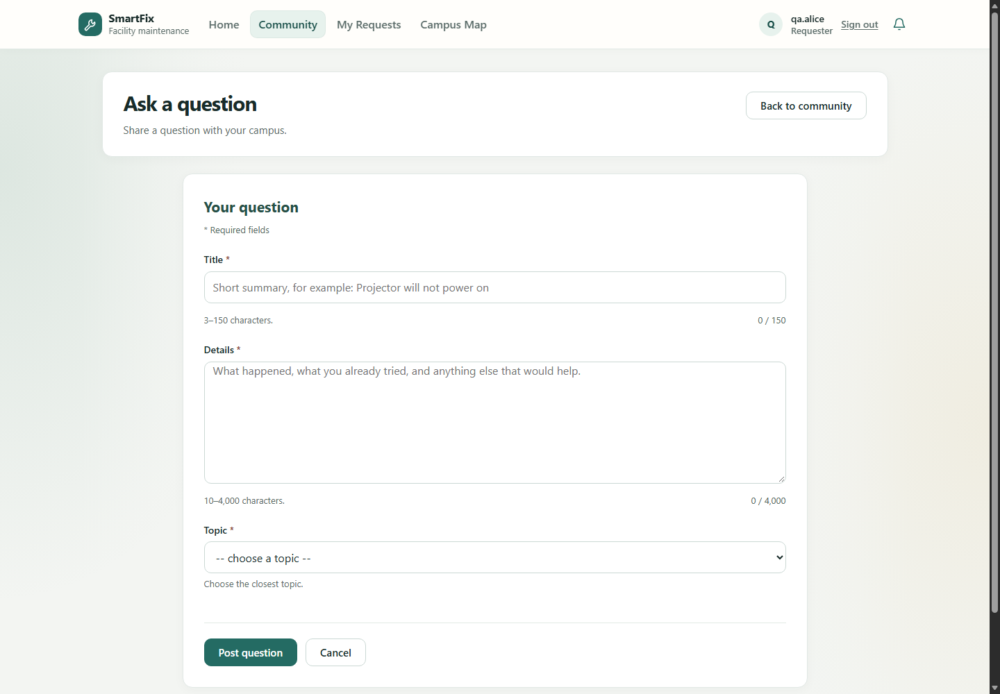
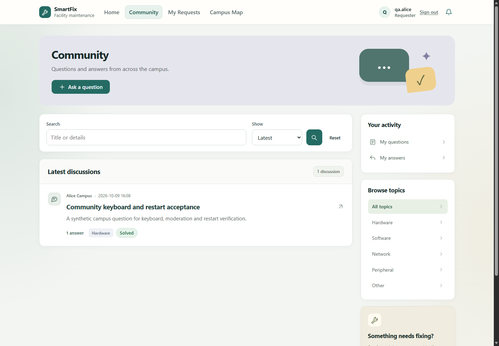
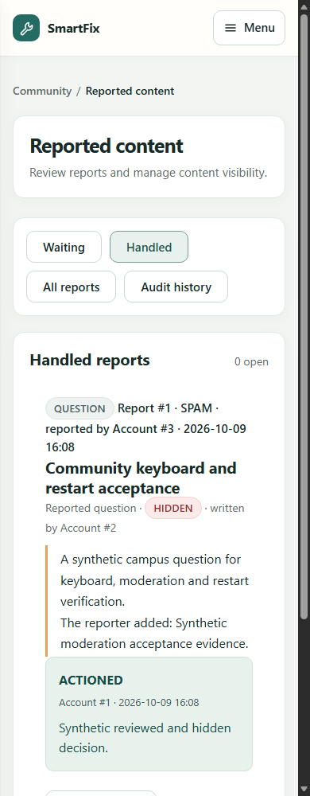

# UserA 剩余改进与验收收口（2026-10-09）

关联：Sprint 3 S3-A-01、S3-A-04～07；使用者本轮提出的第 8～19 项。
本轮是既有 UserA/地图交付后的独立改进，不把历史 89 文件再次包装为一个新增 PR。

## 已完成的代码改进

8. **公开回答数。** 列表 DTO 增加 `answerCount`，社区列表和“我的问题”显示数值。
   当前页的问题 ID 一次分组统计，仅计 VISIBLE 回答；零回答补零，空页不查询。
   详情回答标题也使用可见数，隐藏/撤回占位条目不贡献计数。
9. **公开昵称。** UserService 提供批量、只读 `findDisplayNames`，仓储投影只选择 ID/显示名。
   列表、问题详情、回答使用转义后的昵称；DTO 保留 ID 作所有权判断，管理员举报页保留编号追踪。
   不暴露登录名、密码散列、角色或账号状态，不跨模块注入用户仓储。
10. **统一页面。** 提问/编辑问题、编辑回答、详情、我的提问/回答和举报队列沿用既有配色，
    增加标题容器、统一内容宽度和操作区；缩短重复说明，把提示与计数放在同一信息行。
    修正手机上处理决定被挤成窄列的问题。“我的社区”保留一处总数，删除重复 shown。
11. **表单反馈。** 必填、原生 minlength/maxlength、实时/预填字符计数与错误焦点统一。
    服务端校验仍是最终保障；普通校验失败沿用既有 HTTP 200 错误重绘契约，未擅自改为 400。
    校验字段优先获得焦点，全局拒绝则聚焦错误提示；计数不会逐字发送 aria-live 播报。
12. **举报 ID。** 既有修复已使用 `resolve-note-hint-{reportId}`；本轮补充多条记录渲染的
    ID 唯一性检查、label 和 aria-describedby 检查。
13. **分页边界。** 既有 POST 已保留 view/page/size；本轮补齐超出范围的 GET 回到最后有效页。
    处理完最后一页时仍显示处理反馈；二次重定向会保留 success/error flash。
14. **注册防刷。** 单实例原子滚动计数、地址与全局上限、容量边界、429/Retry-After、
    不信任任意转发头。完整配置和 B 复核范围见 [注册限流交接](Registration_Hardening_Handoff_CN.md)。
    邮箱验证/验证码未加入本轮，重启或多实例共享配额不在此内存实现的保证内。
15. **严格作者配额。** 两种发布入口在 READ_COMMITTED 事务内通过用户服务锁作者行，
    再检查滚动配额和插入；问题去重也在锁内。同一数据库上的不同应用实例共用该行锁。
    发布事务先取账号锁；采纳/撤回继续使用问题锁与条件更新，不增加反向锁顺序。
    直接 SQL 写入不是该服务入口保证。历史 `duplicate-detection-enabled=false` 仍明确关闭发布保护。

## 自动验收与持久化证据（16、17）

功能分支基于已发布地图提交 `becfc781`；本轮后端/主体 UI 提交为 `fd9429a`、`a2b85ae`，
另有最后的表单信息行/手机处理决定微调。没有接触现有应用数据库。
Docker 当时未运行，因此使用安装的 PostgreSQL 16 在 **127.0.0.1:55439** 启动专用测试实例。
原生测试只写 `smartfix_test` 中的随机 schema；浏览器仅写新建的
`smartfix_community_acceptance_test`。测试凭据全部为合成值。

- **功能分支完整 `mvn -o -B verify`：559 项通过**，392 单元/Web/仓储 + 167 集成，零失败/错误/跳过。
- **相关原生 PostgreSQL：16 项通过**：注册并发 2、回答/发布并发 5、社区迁移约束 1、举报事务/并发 8。
  同命令还跑了 9 项仓储单元测试，不把重复的 9 项计为新增 PostgreSQL 场景。
- **最新 main 集成检出：708 项通过**，459 单元/Web/仓储 + 249 集成，零失败/错误/跳过。
  把两个改进提交叠加到 `origin/main=06f00815479cd910f33b80701d2834d2e6922843`，
  保留 B/C/E 代码，独立检出而非覆盖当前功能分支。
- 最后页面微调叠加到该 main 检出后，定向复验 **30 项通过**（4 单元 + 26 页面/分页集成）。
- **真实 Edge：107 个检查通过，299 次键盘动作，应用启动 2 次。**
  主链路只用 Tab、Enter、ArrowDown、Space 和真实文本输入；没有鼠标操作、DOM click 或脚本提交替代主链路。
  单独的无效输入场景使用实际 CSRF 发 POST，验证服务端重绘和首个错误焦点。
  检查所有社区表单/详情/个人内容与举报队列的标题、重复 ID、label、说明关联和脚本错误；
  1440、1000、768、390、320px 均无横向溢出。
- **渲染文字对比度抽样：72 个，最小 4.759:1，全部达到各自文字阈值。**
  仅测可解析的文字颜色与实色背景，包含提示、计数、元数据、按钮和徽章；
  不把抽样当作完整 WCAG 审计，不宣称边框、所有焦点状态、渐变或读屏行为均已认证。

键盘链路：注册两位测试成员 → Alice 提问/编辑 → Bob 回答/编辑 → Alice 采纳
→ Bob 举报问题 → 管理员处理并隐藏 → Handled 找到记录 → 恢复 → 正式审计看到隐藏/恢复。
**停止第一次 JVM，启动另一 PID 的 JVM**，重新登录后核对问题正文、回答、采纳、
处理记录、恢复后的可见状态及两个成员的通知均保留。前后 PID 与结果在 JSON 中。

详见 [浏览器结果 JSON](evidence/community-quality/browser-results.json) 与
[机器结果汇总](evidence/community-quality/verification-summary.json)。

### 复跑

先准备独立本地 PostgreSQL 测试库，不能把现有应用库改名或清空以运行验收。
原生测试要求库名以 `_test` 结尾，每类测试创建/清理自己的随机 schema。

```powershell
mvn -o -B verify

# TEST_DB_* 指向专用测试数据库，凭据由本地环境提供。
mvn -o -B -Ppostgres-it "-Dtest=CommunityQuestionRepositoryTest" `
  "-Dit.test=CommunityAnswerConcurrencyPostgresIT,CommunityModerationPostgresIT,CommunityMigrationPostgresIT,RegistrationConcurrencyPostgresIT" verify

# 需要新建的本地验收库，脚本拒绝普通应用库名称；保留数据完成重启检查。
$env:COMMUNITY_ACCEPTANCE_DB_URL='jdbc:postgresql://127.0.0.1:55439/smartfix_community_acceptance_test'
node tools/verify-community-browser.mjs
```

Node 运行时须支持内置 fetch/WebSocket，浏览器默认为 Windows Edge，可设置 `BROWSER_BINARY`。
脚本使用隔离浏览器 profile，只启动/停止自己创建的本地 Java 测试进程；不控制个人浏览器。
重复运行应另备新的验收库，避免同名合成账号影响结果；脚本不自动删除调用者数据库。
临时应用日志、打包 jar 和失败调试材料留在忽略的 target/，正式证据只含合成内容。

## 文档与迁移登记（18）

README 中“只有脚手架”“permit-all”旧现状已纠正；中英文 README、模块指南、UI 指南、
ADR-003、实施契约和本交接同步。旧阶段记录在契约开头明确为历史，不能继续作为当前缺口引用。
页面全局导航包括 Community/Campus Map；New request 仍是上下文按钮。

本分支实际编号：V17 问题/回答；V18 采纳复合外键；V19 举报；V20 社区使用的通知基础；
V21 正式审计；V22 已发布 NUS 建筑目录。本轮统计、昵称、限流、分页与 UI **不需要新迁移**，
未修改这些已发布 SQL，未对现有库执行 repair/clean。

### 最新 main 的既存集成边界

main 已包含 E 的 V14 通知表和 A 的 V20 通知表。独立检出的新 PostgreSQL schema 实测
`CommunityMigrationPostgresIT` 在 **V20 / SQLSTATE 42P07 / relation notifications already exists** 失败。
这与 PR #24/#25 已记录的问题一致；不是本轮添加的迁移，也不能由通过的 708 项 H2 测试掩盖。
本轮没有擅自更改已发布校验和、删除通知数据或修复共享 Flyway 历史。
需要先明确各共享环境的 V14/V20 已执行状态，再做独立迁移协调。
因此本轮可以评审的 PR 使用 draft 标记这个部署阻塞，不宣称最新 main 已可全新 PostgreSQL 部署。

## 评审交付（19）

按评审主题拆成两条分支/PR：注册限流（目标 main）与社区质量/证据（先以注册限流分支为基线）。
前者合并后再把后者调整为 main，保留本轮独立范围；未执行合并或部署。
PR 正文写清 S3-A 任务、范围、零迁移、认证影响、测试、截图和限制，不保留模板占位符。
已合并的 UserA #23 补写真实交付说明，历史测试结果标明为历史，不混用本轮结果。
B 的评审请求与实际批准分开记录，不能把作者测试结果写成 B 已复核。
注册限流见 [PR #27](https://github.com/Lian9374/smartfix/pull/27)，已向 `Bogang233` 请求评审。
社区 PR 使用 `feature/community-quality-completion-20261009` 分支，正文链接本验收记录及截图。

**仍需人工/外部完成：** B 评审批准；真机与实际读屏验收；共享迁移历史协调。
邮箱验证/验证码和多实例注册入口限流属于另行确定的范围。

## 截图






